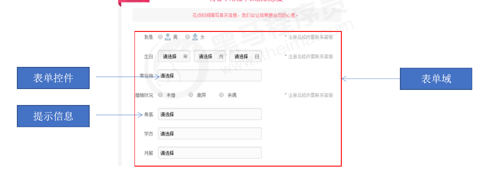
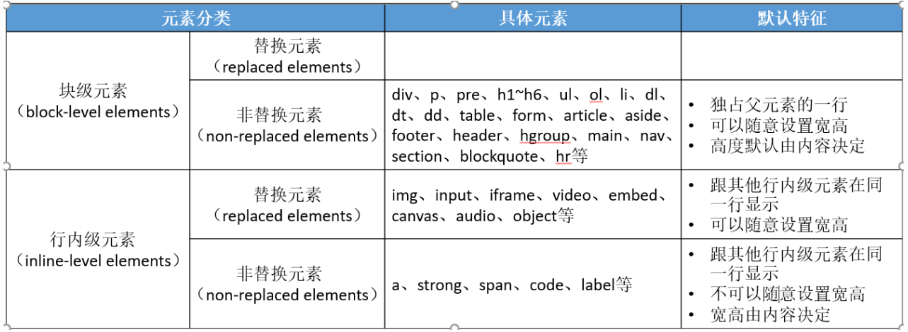
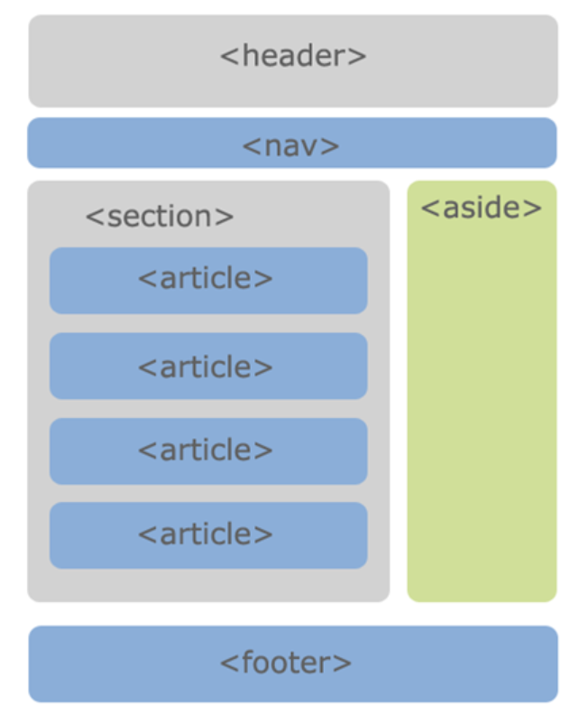
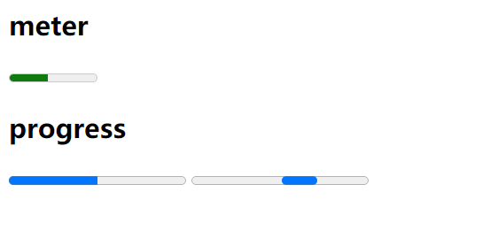
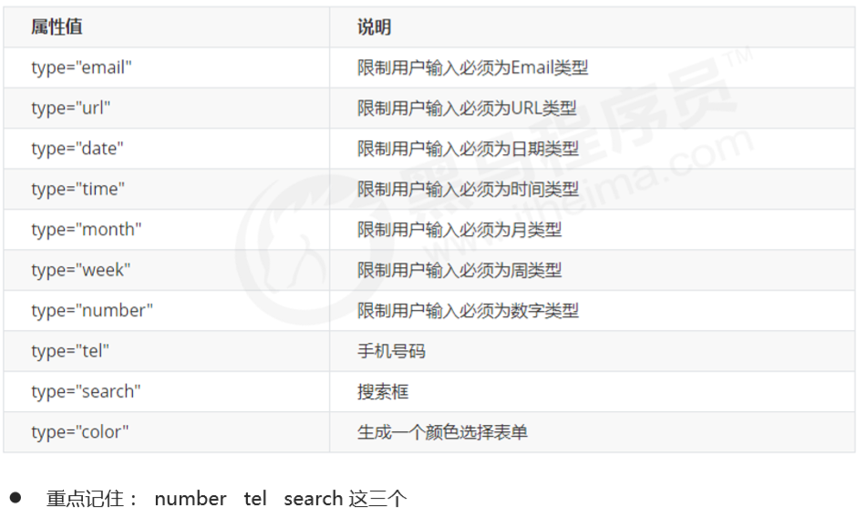
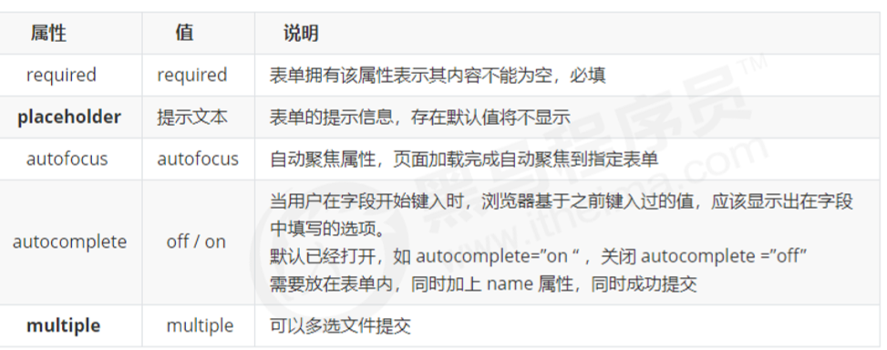
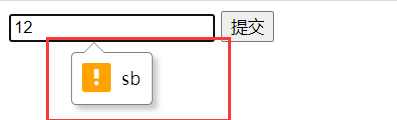

# 一、初识HTML

## 1.1 一个网页的组成

- HTML(网页的结构) + CSS(**样式**) + JavaScript(交互)

    

## 1.2 什么是HTML？

- HTML(Hyper Text Markup Language)是***超文本标记语言***

- **HTML是用来描述网页的内容和结构**

- HTML页面内可以包含图片、链接，甚至音乐、视频等非文字元素

- 通常我们看到的网页， 常见以 .htm 或 **.html 后缀结尾的文件**，因此将其俗称为 ***HTML 文件***。 

    

    


## 1.3 什么是元素？

- ***由标签和内容组成的称为元素（element）***

- 一般的说法：head元素、< head >标签，img元素、< img >标签

    

    

## 1.4 双标签和单标签

- **包含了具体内容，书写格式是双标签**
  
- <标签名>具体内容</标签名> 
  
    - ```HTML
      <div>我是内容</div>
      ```
    
- **没有包含具体内容，书写格式是单标签**
  
  - ```HTML
    <img1 src="./img/01.jpg" alt="">    
    ```
    
    

## 1.5 元素的属性

- 元素的属性是编写在元素开头标签中的

    - `<起始标签 属性名="属性值">`

        

- **属性值建议统一使用双引号**

    

- 有些属性是**公共**的，每一个元素都可以设置
  
  - 比如class、id、title属性
  
- 有些属性是**元素特有**的，不是每一个元素都可以设置
  
    - 比如img元素的alt属性

- 每个元素都可以设置**自定义属性**
  
    - 比如 `data-index="xxx"`属性

  

## 1.6 完整的HTML结构

```html
<!DOCTYPE html>
<html lang="en">
<head>
    <meta charset="UTF-8">
    <meta name="viewport" content="width=device-width, initial-scale=1.0">
    <title>Document</title>
</head>
<body>
    
</body>
</html>
```

- **文档声明** 
  
  - ```html
      <!DOCTYPE html>
      ```
      
  - 告诉浏览器当前页面是HTML5页面，让浏览器用HTML5的标准去解析识别HTML文档
  
      
  
- **html元素** 
  
  - html元素是HTML文档的根元素，**一个文档中只能有一个**
    
  - W3C标准建议为html元素增加一个lang属性
    
  - lang="en"告诉浏览器：这个HTML文档的语言是英文
  
  ​      
  
- **head元素**
  
  - 一般用于描述网页的各种信息，比如字符编码、网页标题等
  
- **title元素** ----- 网页的标题
  
- **meta元素** ------ 设置网页的字符编码,一般都使用UTF-8编码
  
    - style ----- 编写当前页面的css样式
    
    - link ---- 外部引入的文件(css、网页的图标)
      
      

- **body元素**
  
    - 在body元素中编写**网页中真正要展示的HTML内容元素**


## 1.7 字符实体

- **字符实体的概述**
  
- 在HTML元素中，有些符号是无法被浏览器解析的，因此可以使用**字符实体来代替一些特殊的符号**
  
- 空格：

  ```
  &nbsp;
  ```

- 大于号：

  ```
  &gt;
  ```

- 小于号：

  ```
  &lt;
  ```

- &：

  ```
  &amp
  ```

  

## 1.8 什么是URL？

- URL是统一资源定位符，也就是资源的所在位置

- 参考：`Node --> 网路通信基础`

  

# 二、基本元素的使用

## 2.1 span元素和div元素

- span元素的作用：**将普通文本进行归类**

- div元素的作用：**用于把网页分割为多个独立的部分**

    

## 2.2 绝对路径和相对路径

- 绝对路径：从磁盘的根目录下开始查找

- 相对路径：由这个文件所在的文件夹开始查找 
     - ./表示**当前文件所在的文件夹**

     - ../代表上级文件夹
     
         


## 2.3 iframe元素

- 利用iframe元素可以实现：在一个HTML文档中嵌入其他HTML文档

- frameborder属性:用于规定是否显示边框
        1：显示
        0：不显示
    
- ```HTML
    <iframe src="" frameborder="0"></iframe>
    ```

    

## 2.4 base元素

- 可以利用base元素设置当前页面**所有a元素的默认行为**

- **base元素写在head元素中**

        <base href="https://www.baidu.com" target="_blank">
    
    
    
    

## 2.5 锚点链接

- 锚点链接可以实现：**跳转到网页中的具体位置**

    ```HTML
    <a href="#one">标题1</a>  会跳转到id值为one的元素的位置
    <a href="#">标题1</a>  会跳转到页面的顶部
    ```

- 注意：**只能通过设置id选择器才能实现锚点链接**

    

    

## 2.6 a元素

* 两个重要的属性
  * href：要跳转到的网址

  * target

* `target属性`的两个重要的值
    * _self: 默认, 在当前窗口打开(标签)
    * _blank: 在新的标签页中打开页面(标签)
- 取消a元素的自动跳转页面行为

    ```HTML
    <a href="javascript:">标题1</a>
    ```
    
    

# 三、列表元素

- 有序列表：ol、li

- 无序列表：ul、li   (**重点记住**)

- 定义列表：dl、dt、dd

  

## 3.1 列表相关的CSS属性

- `list-style-image`：设置某张图片为li元素前面的标记

- `list-style`：缩写属性
      举例：`list-style: outside url("images/dot.png");`

- 注意：它们都可以继承，所以设置给ol、ul元素，默认也会应用到li元素

  

- 一般最常用的还是设置为none，**去掉li元素前面的默认标记**    
  
- `list-style: none;`
  
  


# 四、表格元素

## 4.1 表格的元素

```html
 <table> 
   <tr> 
     <td>单元格内的文字</td> 
     ... 
   </tr> 
   ... 
 </table> 
```

- table：定义一个表格

- caption：表格的标题
  
- tr：表格中的行

- thead：表格的表头（**里面嵌套着tr和th**）

- th：表格的表头单元格
  
- tbody:表格的主体(**里面嵌套着tr和td**)

- td：行中的单元格

    

    


## 4.2 table元素的属性（了解）

- border  边框的宽度

- cellpadding  单元格的内边距

- cellspacing  单元格的外边距

- width  表格的宽度

- align  表格的水平对齐方式

    - left、center、right
    
- 注意：**以上5个属性已经不推荐使用了**，***因为要遵守着样式页面分离的写法***，所有最好都在CSS中实现样式

    

## 4.3 tr、th、td的常用属性

- rowspan **单元格可横跨的行数**
  
- colspan **单元格可横跨的列数**

    

- 合并单元格三步曲： 
    1. 先确定是跨行还是跨列合并。 

    2. 找到目标单元格. 写上合并方式 = 合并的单元格数量。比如：`<td colspan="2"></td> `

    3. 删除多余的单元格。

        

## 4.4 在CSS中设置表格的样式

```css
table {
  border: 1px solid black;
  border-collapse: collapse
}
td {
  border: 1px solid black; 
}
```

1. 合并单元格的边框
    - `table { border-collapse: collapse }`
2. 将单元格居中显示
    - `table { margin: 0 auto }`

3. 给每个单元格设置内边距
    - `td, th { padding:10px }`

4. 设置每个单元格之间的间距
    - `table { border-spacing: 10px }`
    - 注意：需要在没有合并单元格边框的时候才有有效果


​	

# 五、表单元素

## 5.1 表单的组成

- 在 HTML 中，一个完整的表单通常由***表单域、表单控件（也称为表单元素）和 提示信息3个部分构成***。

    
    
    

## 5.2 表单域

- 表单域是一个包含表单元素的区域。 

    - 在 HTML 标签中， < form > 标签用于***定义表单域***，以实现用户信息的收集和传递。

    ```html
     <form action=“url地址” method=“提交方式”> 
       各种表单元素控件 
     </form>
    ```

- `form`标签常用的属性
    - **action**
        - 用于提交表单数据的请求URL
        - URL的组成：`HTTP协议//主机地址:端口号/路径`，在**action下 HTTP协议必须填写**
    - **method**
        - 请求方法（get和post），默认是get
    
    - target
        - 在什么地方打开URL（参考a元素的target）
    - **enctype**
        - multipart/form-data：***文件上传时必须为这个值***，并且method必须是post


## 5.3 表单控件

- **input元素**：单行文本输入框、单选框、复选框、按钮等元素

    - 在 < input > 标签中，包含一个 type 属性，根据不同的 type 属性值，输入字段拥有很多种形式

    - ```html
        <input type="属性值" />
        ```

- **textarea元素**：多行文本框

    - ```html
        <textarea name="" cols="30" rows="10"></textarea>
        ```
    
        css样式
        textarea { resize: none } // 禁止文本框拖拽
    
- **select、option元素**：下拉选择框

    - select常用属性

        - multiple：可以多选
    
        - size：显示多少项
    
    - option常用属性

        - selected：默认被选中
    
    - ```html
        <select name="">
        		<option value=""></option>
        </select>
        ```
    
        


- **button**：表单提交按钮
  
  
  - ```html
    <button>按钮1</button>
    ```
    
    
  
- **label**：用于绑定一个表单元素，当点击< label > 标签内的文本时，浏览器就会自动将焦点(光标)转到或者 选择对应的表单元素上，用来**增加用户体验.** 
  
  
  - ```HTML
    <label for="username">
      用户名：<input type="text" id="username">
    </label>
    ```
  
  -  < label > 标签的 for 属性应当与相关元素的 id 属性相同。
  
      
  
- **fieldset**：表单元素组：用于**分类一个表单组**
  
  
  - **legend**：每个表单组的**标题**
  
    - ```html
        <fieldset>
            <legend>表单的标题</legend>
            <label for="username">
                用户名：<input type="text" id="username">
            </label>
        </fieldset>
      ```
  
      
  
  

## 5.4 input元素中的属性

- input元素中的**type属性值介绍**

    - text：文本输入框（明文输入）

    - password：文本输入框（密文输入）

    - radio：单选框(**name值相同的radio才具备单选功能)**

    - checkbox：复选框(**属于同一种类型的checkbox，name值要保持一致**)

    - submit：提交表单数据给***服务器***

    - reset：重置表单中的所有信息

    - file：文件上传

    - number：文本框中只允许输入数字

      
      
      

- input元素中的其他属性

    - maxlength：允许输入的最大字数
    
    - placeholder：占位文字
    
    - readonly：只读
    
    - disabled：禁用
    
    - checked：默认被选中

        - 只有当type属性为**radio**或**checkbox**时可用
    
            

    - **name**：只有设置了name属性才会将表单信息提交到服务器，**作为请求传递参数的key传递给服务器**
    
    - **value**：设置提交给服务器的数据，**作为请求传递参数的value传递给服务器**
    


## 5.5 提交表单的流程

- 表单提交后会形成一个url提交给服务器，并且跳转到该url的网页地址，该url是from元素中的action地址

- 服务器根据这个url地址给你返回不同的数据

- url地址会拼接上***表单元素中对应的name属性值和value属性值***

         https://www.baidu.com/s?wd=vue   
         （name=wd  value=vue）


## 5.6 GET请求和POST请求

- GET请求地址：

        http://ww.test.com/login?phone=123&password=234  （传递的数据都在查询字符串中）

- POST请求地址：

        http://ww.test.com/login （传递的数据都在请求体中）
    
    

# 六、元素类型


## 6.1 元素可以分为2大类

### 1. 块级元素

- ***block-level elements***：块级元素

- 特性：**独占父元素的一行**，宽度默认为父元素的`100%`

- 比如div、p、pre、h1~h6、ul、ol、li、dl、dt、dd、table、form元素等


### 2. 行内级元素

- ***inline-level elements***：行内级元素

- 特性：**多个行内级元素可以在父元素的同一行中显示**

- 比如a、img、span、iframe、label、input、button、 video、audio元素等

- 注：**并不是所有的行内级元素都不能设置宽度和高度**

    

### 3. 行内级元素可以分为两大类

#### 1. 替换元素

- 特性：***元素本身没有实际内容，浏览器根据元素的类型和属性，来决定元素的具体显示内容***

- 比如img、input、iframe、video元素等


#### 2. 非替换元素

- 特性：***元素本身是有实际内容的，浏览器会直接将其内容显示出来***

- 比如div、p、pre、h1~h6、ul、ol、li、dl、dt、dd、table、form、nav、section、a、span、label元素等


## 6.2 元素的分类和总结



## 6.3 如何修改元素类型?
- CSS中有个display属性，能修改**元素的显示类型**

  

## 6.4 细节补充

- 块级元素一般情况下，可以包含其他任何元素（比如块级元素、行内级元素、inline-block元素）
    - 特殊情况：**p元素不能包含其他块级元素**

- **行内级元素只能包含行内级元素**，不能包含块级元素


# 七、HTML5


## 7.1 HTML5的简介

- 什么是**HTML5**?

    - **HTML5** 是定义 HTML 标准的**最新的版本**。

    - **HTML5**是一个新版本的**HTML语言**，具有**新的元素**，**属性和行为**

    

    

- **HTML5**和**H5**的区别？

    - `HTML5`：当前最新版本的**超文本标记语言**
    
    - `H5`：**一套技术的简称**，包含了 HTML5、CSS3、JavaScript等一系列的技术。

    - 跳出程序员的世界，大部分人眼中的**H5**，大概率是说的是**基于HTML5**制作的网页
    
        


## 7.2 HTML5新增的元素

### 7.2.1 语义化的元素

- ***这些元素跟div元素一样，都是块级元素***

-     < header>：头部元素

-     < nav>：导航元素

-     < section>：定义文档某个区域的元素

-     < article>：内容元素

-     < aside>：侧边栏元素

-     < footer>：尾部元素



- 具体的页面布局还是要看我们自己

  

### 7.2.2 媒体元素

-     视频：< video>

-     音频：< audio>

- 以上两个元素具有**如下属性以及嵌套的元素**

    - width、height：控制**video元素**的**宽度和高度**，`audio`元素无法使用

    - src：媒体的*来源地址*

    - controls：是否显示*媒体元素的工具栏*，值类型为布尔值

    - autoplay：*自动播放*，值类型为布尔值，但是存在兼容性问题

    - muted：*静音*，值类型为布尔值，增加后不静音并且自动播放会生效

    - loop：*循环播放*，值类型为布尔值

    - < source >元素
    
            如果存在兼容性问题，可以将多个视频格式的数据源放到source元素中
            
            src：通过src指定数据的来源
    
    - ```HTML
      <audio src=" " loop controls >
          <source src=" ">
      </audio>
      ```
    
      

>坑：只有设置了`muted属性`，`autpplay`属性**才会生效**！`audio`元素无法自动播放音乐！！
>


- 解决`audio`无法自动播放步骤：
    - 只有绑定了`click`事件交互，才能够触发audio的播放


### 7.2.3 状态元素




- `<meter>`：用来显示已知范围的标量值或者分数值
    - value：当前的数值。
    - min：值域的最小边界值。默认为0
    - max：值域的上限边界值。默认为1


- `progress`：用来显示一项任务的完成进度
    - max：进度条总长度
    - value：指定进度条的完成长度
        		


## 7.3 HTML5新增的属性

### 7.3.1 表单元素的属性扩展

-  HTML5 新增的 ***input 类型*** 
    - 


- 新增的表单元素属性
  
    - 
    
    - 补充：`pattern` : 正则验证  pattern="\d{1,5}''


- `inputEle.setCustomValidity('xx')`：可以自定义表单验证提示

    


### 7.3.2 普通元素的属性扩展

- `contenteditable`

    - 该属性表示**元素是否可被用户编辑**，编辑后会修改该元素的文本内容

    - ```html
        <div contenteditable="true"></div>
        ```

        


