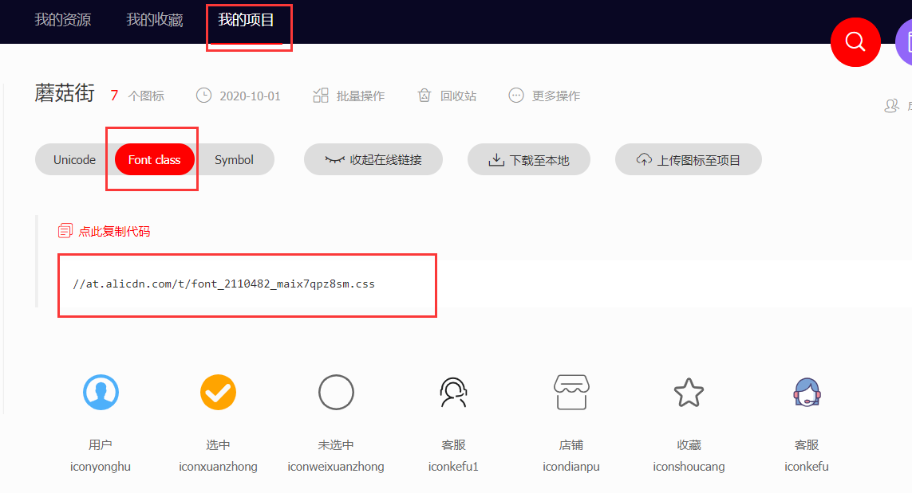

# 一、CSS介绍


## 1.1 什么是CSS

- CSS是给HTML元素设置样式的**样式表**

- CSS的作用是：可以给网页中的**每一个元素设置样式**，***让网页更加精美***

    

## 1.2 CSS官方文档

- 官方文档地址
    - https://developer.mozilla.org/zh-CN/docs/Web/CSS


- 由于浏览器版本、CSS版本等问题，有些CSS属性是无法使用的
  
    - 可以到 https://caniuse.com/ 查询CSS属性的可用性
    
        

## 1.3 CSS的三种引入方式
- 内联样式 （不推荐使用）

    - ```html
        <p style="样式名: 样式值;">你好啊</p> 
        ```
    
- 内嵌样式表（在学习和测试中用）：在heade元素中编写style标签，在style标签中编写CSS相关样式

    - ```css
        <style>
            p {样式名（属性名）: 样式值（属性值）;}
        </style>
        ```
    
        
    
- 引入外部CSS样式表（开发项目的时候用）：独立新建`.css`文件

    - ```css
        方式1： <link rel="stylesheet" href="./css/h.css"> // 在HTML文件中引入
        方式2： import './css/h.css'  // 在CSS文件中引入
        ```
    
- 一般在外部CSS文件中都要***指定字符编码 @charset 'UTF-8'***
  
  

## 1.4 @import和link引入CSS的区别

- **@import**只能在css文件中**引入其他的css文件**

    - ```CSS
        @import './demo02.css'
        ```

- **link**标签引入只能在**HTML文件中的head元素**中使用

    - ```html
        <head>
            <link rel="stylesheet" href="style.css">
        </head>
        ```

        

## 1.5 CSS的组成

- CSS 规则由两个主要的部分构成：**选择器**，**样式表**，样式表中又分为了**样式名**、**样式值**

- ```css
    p {
        color:red;
        text-align:center;
    }
    ```

    - 在上图代码中 **p是选择器**，用于匹配符合条件的HTML元素，后面紧跟着`{}`表示样式表，
    - 在样式表中每一组样式以`样式名:样式值`实现，并且每组样式之间以`;`隔开


## 1.6 CSS注释

- 在编写的CSS区域中，代码注释如下
    - `/*这是个注释*/`


# 二、CSS选择器

- 什么是CSS选择器？
  
    - 按照一定的规则**选出符合条件的元素**，**并且为之添加CSS样式**
    
      

## 一、CSS基本选择器

### 1.1 通用选择器

-  `* {color:red;} `
    - 选取所有的元素设置样式，一般用于清除浏览器默认样式

    - PS：效率比较低，尽量不要使用

        

### 1.2 元素选择器
- `div {color:red;}  `
    - 给所有的div元素设置样式

        

### 1.3 类选择器

- `.one {color:red;}`
    - 给class属性值为one的元素设置样式

    - PS：一个元素可以有多个类名，**多个类名以空格进行分割**

        - ```html
            <div class="one two"></div>
            ```

    - **类名的规范**：以`kobe-case`命名

        

### 1.4 id选择器
- `#one {color:red;}`
    - 给id属性值为one的元素设置样式

    - 注意：**一个HTML文档里面的id值是唯一的**，不能重复

    - id选择器**只会匹配第一个匹配到的元素**

        


​    


## 二、CSS其他选择器

### 2.1 属性选择器

- `[title] `：拥有title属性的元素
- `[title='one']` ：title属性值恰好等于one的元素
- `[title*='one']` ：title属性值包含one的元素


### 2.2 后代选择器

- 两个选择器之间以空格分开

- `div span `：div元素里面的所有span元素（包括直接子元素、后代元素）


### 2.3 子代选择器
- `div > span `：div元素下的span子元素


### 2.4 相邻兄弟选择器
- `div+p `：div元素后面紧挨着的p元素（且div、p元素必须是兄弟关系）


### 2.5 交集选择器

- 两个选择器之间没有空格

- `div.one `：class值为one的div元素


### 2.6 并集选择器

- 两个选择器之间以`,`分开

- `div,.one `：所有的div元素和所有class值为one的元素


## 三、伪类选择器

### 3.1 什么是伪类

- 伪类专门用来表示元素的一种的特殊的状态

    - 比如：访问过的超链接、普通的超链接、获取焦点的文本框

    - 当我们需要为**处在这些状态的元素设置样式**时，就可以使用伪类
    
        

### 3.2 目标伪类

- `a:target `：可用于选取当前活动的目标元素(配合锚点使用)


### 3.3 元素伪类

- `input:disabled`： 匹配每个被禁用的元素，只支持表单元素

    

### 3.4 动态伪类

- `a:link` ：未访问的链接

- `a:visited `：已访问的链接

- `a:hover` ：鼠标挪动到链接上

- `a:active` ：激活的链接（鼠标在链接上长按住未松开）

- ***以上编写顺序是 :link、:visited、:hover、:active***

    

- 除了a元素，**:hover、:active也能用在其他元素上**

- `:hover`表示获取鼠标经过时的元素

- `input:focus` 获取当前拥有输入焦点的表单元素

    

### 3.5 结构伪类

- 作用：**专门用于匹配子元素的** 

    - `ele:nth-child(n)` ：匹配指定元素的第 N 个子元素
    - `ele:nth-child(odd) `：匹配指定元素的奇数的子元素的 
    - `ele:nth-child(even) `：匹配指定元素的偶数的子元素的 
    - `ele:nth-last-child(n) `：匹配指定元素的的倒数第 N 个子元素
    
    

- 其他的结构伪类（了解）：
    - `ele:first-child`，等同于:nth-child(1)
    - `ele:last-child`，等同于:nth-last-child(1)
    - `ele:only-child`，匹配父元素中唯一的子元素
    - `ele:root`：根元素，就是HTML元素
    - `ele:empty`代表里面完全空白的元素


### 3.6 否定伪类

- 作用：**可以从已选中的的元素中剔除某些元素**

- 语法： :not(选择器)

  - `div:not('.box1') {  }`：获取所有div但是除了class为box1的div元素
    
    

  


## 四、伪元素选择器

### 4.1 什么是伪元素

- 伪元素选择器**用于表示元素中的一些特殊的位置**

- 伪元素注意细节：
    - ***为了区分伪元素选择器和伪类选择器***，**建议伪元素使用2个冒号**，比如`::first-line`


### 4.2 伪元素选择器

- `ele::before`和`ele::after`用来在一个元素的**内容之前**或**之后插入其他内容**（可以是文字、图片）

    ```css
    ele::after {
        content: '要插入的内容';
        color: red;
    }
    ```
    
    
    
    

- `input::placeholder`：获取input元素中的占位字符元素

    - ```css
        input::placeholder {
        	color: pink;
        }
        ```

        


# 三、CSS基本属性

## 3.1 常用的CSS属性

- **color**：前景色（文字颜色）

- **font-size**：文字大小

- **background-color**：背景色

- **width** ：宽度

- **height**：高度

    - 注意：***有些行内级元素无法设置宽度和高度***

- **background-color**：背景色

    

## 3.2 设置文本的属性

- **text-decoration**：设置文字的装饰线

    - ```
        none：无任何装饰线，可以去除a元素默认的下划线
        underline：下划线
        overline：上划线
        line-through：中划线（删除线）
        ```

- **letter-spacing**：设置字母之间的间距  默认为0

- **word-spacing**：设置单词之间的间距  默认为0

- **text-transform**：设置文字的大小写转换

    - ```
        capitalize：将每个单词的首字符变为大写
        uppercase：将每个单词的所有字符变为大写 
        lowercase：将每个单词的所有字符变为小写
        ```
    
- **text-indent**：设置第一行内容的缩进
  
    

- **text-align**：***设置元素内容在元素中的水平对齐方式***，**这里的元素内容包括子元素**

    - left：左对齐

    - right：右对齐

    - center：正中间显示

    - justify：两端对齐

      

- **line-height**：设置文本的行高

    - 行高可以先简单***理解为一行文字所占据的高度***
      
    - **height**和**line-height**的区别

        - ```
            height：元素的整体高度
            
            line-height：元素中每一行文字所占据的高度
            ```
    
    - 如何让这文字在块级元素中**垂直居中**？

        - 让**line-height**等同于**height**
    
            
    
    - 注意：***line-height是会被继承的***
    
        

- **单行文本不换行多余文本显示省略号**

    - ```css
        div{
        	 /* 强制不换行 */
           white-space: nowrap;
           /* 超出部分隐藏 */
           overflow: hidden;
           /* 超出部分以省略号代替 */
           text-overflow: ellipsis;
        }
        ```

        

- **多行文本超出隐藏多余文本显示省略号**

    - ```css
        div{
           display:-webkit-box;
           overflow:hidden;
           text-overflow:ellipsis;
           -webkit-line-clamp:3;
           -webkit-box-orient:vertical;
        }
        ```

        


## 3.3 设置字体相关的属性

- **font-size**：决定文字的大小
  
    - 如果设置百分比，**那么是基于父元素的文字大小进行计算**
    
      
  
- **font-family**：设置文字的字体名称
  
    - 会从系统自带中的字体依次去找，如果系统没有该字体则该属性无效

    - 可以设置1个或者多个字体名称（从左到右按顺序选择字体）

    - **开发中都是多个字体进行使用的**
    
      
  
- **font-weight**：设置文字的粗细

    - normal：等于400px

    - bold：等于700px

        

- **font-style**：设置文字的常规、斜体显示

    - normal：常规显示

    - italic：用字体的斜体显示(前提, 是font-family这种字体本身是支持斜体)

    - oblique：文本倾斜显示(让文字倾斜)

      

- **font**：***是以上所有字体属性的缩写属性***

    - font-style、font-weight、font-size/line-height、   font-family
    
    - line-height可以省略，如果不省略，必须跟在font-size后面
    
    - ***font-size、font-family不可以调换顺序，不可以省略*** 


## 3.4 CSS3新增属性

### CSS属性 - outline

- outline**表示元素的外轮廓**

- 特点：***不占用空间***，不占用元素的大小

- 默认显示在盒子的外面

- 使用方法和border属性一样

    

### CSS属性 - cursor

- **cursor**可以设置鼠标指针（光标）在元素上面时的显示样式
- auto：默认值
  
- default：一个小箭头
  
- pointer：一只小手
  
- text：一条竖线
  
- none：没有任何指针显示在元素上面


### CSS属性 - filter

- 例如： `filter: blur(5px)`;     ***blur模糊处理  数值越大越模糊*** 

    

### CSS属性 - calc

- calc() 此CSS函数让你在声明CSS属性值时***执行一些计算***。 

    - ```css
        width: calc(100% - 80px); 
        ```

        

### CSS属性 - box-sizing

- 传统模式宽度计算：盒子的宽度=  **CSS中设置的width(内容区)** + border + padding 

- CSS3盒子模型： 盒子的宽度 =  CSS中设置的宽度width 里面包含了 border 和 padding 

    ```css
    /* CSS3盒子模型 */
    box-sizing: border-box;
    /* 传统盒子模型 */
    box-sizing: content-box
    ```

    

>如果希望在**不影响原有尺寸**的情况下**添加内边距**，那么可以设置为`border-box`


# 四、CSS其他属性

## 4.1 元素的隐藏和显示

### CSS属性 - display

- 能修改元素的显示类型，有4个常用值

    - block：让元素显示为块级元素（**独占父元素的一行并且可以设置宽高**）

    - inline：让元素显示为行内级非替换元素（**不能再设置宽高**）

    - none：隐藏元素（**不占页面空间**）

    - inline-block：**跟其他行内级元素在同一行显示,可以随意设置宽高**
    
        

### CSS属性 - visibility

- **visibility**：能控制元素的可见性，有2个常用值

    - visible：显示元素

    - hidden：隐藏元素

- 注意：***虽然元素看不见了，但还会占着原来的位置***

    

### CSS属性 - opacity

- opacity：能够修改元素的透明度

    - 1 表示完全可见

    - 0：表示为透明状态，***但是依旧占据着页面的空间***

        

- **该属性通常配合过渡动画属性使用**

  

- 当`opacity`属性的值应用于某个元素上时，即使这个元素的子元素没有继承`opacity`。
- **但`opacity`元素和它包含的子元素都会具有相同的透明度**

- 使用`background:rgba();`方式则不会影响子元素的透明度


### CSS属性 - overflow

- **overflow**：***用于控制元素中内容溢出时的行为***

    - visible：溢出的内容照样可见(默认值)

    - hidden：溢出的内容直接裁剪

    - scroll：溢出的内容可以通过滚动机制查看,会显示滚动条区域，**滚动条区域占用的空间属于width、height**

    - auto（常用）：自动根据内容是否溢出来决定是否提供滚动机制

      

- `overflow-y / overflow-x`：***用于控制元素中内容溢出时的x轴和y轴行为***

    - 属性值与`overflow`一致

        

​    

- **该属性对于行内非替换元素不起效果**

    - 原因：***行内非替换元素无法设置宽高***，宽高是由内容本身撑起来的，所以不会溢出

  


## 4.2 元素的背景图片

### CSS属性 - background-image

- 用于**设置元素的背景图片**，会盖在(不是覆盖)background-color的上面

- 如果设置了多张图片，默认显示第一张

- ```CSS
  background-image: url('');
  ```

- 注意：**如果元素没有具体的宽高，背景图片是不会显示出来的**，***因此该属性对行内非替换元素无效***

  

### CSS属性 - background-repeat

- 用于设置**背景图片是否要平铺**

    - repeat：平铺（默认值）

    - no-repeat：不平铺

    - repeat-x：只在水平方向平铺

    - repeat-y：只在垂直平方向平铺
    
        

### CSS属性 - background-size

- 用于设置**背景图片的大小**

    - auto:以图片大小本身显示（默认值）

    - cover：缩放背景图，以完全覆盖铺满元素

    - contain：缩放背景图，宽度或者高度铺满元素，**但是图片保持宽高比**

    - < percentage >：百分比，相对于背景区（background positioning area）
    
      

### CSS属性 - background-position

- **用于设置背景图片在水平、垂直方向上的具体位置**，所有的位置都是**相较于父元素区域**

- **该属性通常配合精灵图使用**

    - 以px为单位，第一个值是水平方向的值，第二个值是垂直方向的值，***正值表示右和下，负值表示相反***

    - 水平方向还可以设值：left、center、right

    - 垂直方向还可以设值：top、center、bottom

    - ***如果只设置了1个方向，另一个方向默认是center***
    
      

### CSS属性 - background-attachment(很少用)

- scroll：背景图片跟随元素一起滚动（默认值）

- fixed：背景图片相对于浏览器窗口固定

  

### CSS属性 - background

- **background**是一系列背景相关属性的简写属性

    - image  position/size  repeat  attachment  color

            background-size可以省略
            如果不省略，background-size必须紧跟在background-position的后面
        
        

###  background-image和img的选择


## 4.3 圆角和阴影效果

### CSS属性 - border-radio

- **border-radio**可以设置元素的四个角

    - **border-radius的值等于50%时，就会变成一个圆**

    - ***百分比是参考当前元素的宽度来计算的***
    
        

### CSS属性 - box-shadow

- **box-shadow**属性***可以给元素设置阴影***

- 多个方向的阴影之间用逗号隔开，从前到后叠加

- ```css
box-shadow: 2px 5px 10px 3px #e0e0e0;
  ```

    - 第1个属性值：水平方向的偏移，正数往右偏移

    - 第2个属性值：垂直方向的偏移，正数往下偏移

    - 第3个属性值：模糊半径（blur radius）

    - 第4个属性值：延伸距离(会扩充阴影内容)

    - 第5个属性值：阴影的颜色，如果没有设置，默认黑色
    
    - inset（基本不用）：外框阴影变成内框阴影
  
      

- 让元素**四周有均匀的阴影**

    - ```css
        box-shadow: 0 0 5px
        ```

    - 只设置**模糊半径**


### CSS属性 - text-shadow

- **text-shadow**用法类似于box-shadow，***用于给文字添加阴影效果***

- **text-shadow**同样适用于`::first-line`、`::first-letter`选择器

  

## 4.4 动画效果（重要）

### CSS属性 - transform

- **transform**属性***可以设置元素的形状变化***

    - 注意：该属性对**行内非替换元素**没有效果，该属性一般配合**:hover伪类选择器使用**

        

- 平移：**translate(x, y)**

    - 值类型可以是数字或者是百分比
    - ***百分比：参照元素本身的宽度和高度***

    - ```css
        transform: translate(5px, 50px)
        ```

        

- 缩放：**scale(x, y)**

    - 数字：1：保持不变、2：放大一倍、0.5：缩小一半

        ```css
        transform: scale(2)
        ```

    - ***百分比：不支持百分比***

        

- 旋转：**rotate(deg)**

    - ***设置角度后面必须跟deg单位***

    - 正数为顺时针旋转

    - 负数为逆时针旋转

    - 旋转的原点受**transform-origin**属性的影响

    - ```css
        transform: rotate(45deg)
        ```

        

- 倾斜：**skew(deg,deg)**

    - 一个值时，表示x轴上的倾斜度数

    - 二个值时，表示x轴和y轴上的倾斜度数

    - ```css
    transform: skew(45deg)
      ```
      
      

- **transform**后面可以跟多个值，多个值之间以空格隔开

    - ```css
    transform: translate(100px,0)  scale(.5) rotate(45deg);
      ```
    
    - 当**transform**同时有**位移和其他属性**的时候，记得要将***位移属性值***放到最前


### CSS属性 - transform-origin

- **设置元素发生形变时的原点**

    - ***在元素没形变(transform)之前设置该属性***

        

- 一个值：设置x轴的原点

- 两个值：设置x轴和y轴的原点

- 值类型

  - left, center, right, top, bottom

  - length（px）：从左上角开始计算

    
  

### CSS属性 - transition（过渡动画）

- ***该属性是控制动画的首尾两个帧，如果希望有更多的动画变化，需要用到关键帧动画***

    - **在元素没形变(transform)之前设置该属性**

        

- 值1：指定对哪一个属性做过渡动画，可以写all表示所有可动画的属性

  - 哪些属性支持过渡动画需要自己查文档

- 值2：指定过渡动画所需的时间，***单位可以是ms或者s***

- 值3：指定动画的变化曲线(匀速（linear）、先快后慢)

- 值4：指定过渡动画执行之前的等待时间***(基本不设置)***

- ```css
    transition: transform .5s linear
    ```

- `transition`可以指定多个值，以逗号隔开

    - ```css
        transition: transform .5s linear, opacity .5s linear
        ```

        


>坑：**transition对top、left无效**
>
>

- 解决方案：首先设置元素`position`为`relative`或`absolute`等，然后初始化，如`left=0;`


### 关键帧动画 - animation

- 关键帧动画使用**@keyframes**来定义多个变化状态，并且使用**animation-name**来声明匹配：

    1. 使用 **@keyframes**创建一个规则

    2. **@keyframes**中使用百分比定义各个阶段的样式

    3. 通过**animation**属性将动画添加到属性上


- **animation**属性的值：

    - animation-name(必填)：指定执行哪一个关键帧动画

    - animation-duration（必填）：指定动画的持续时间

    - animation-timing-function：指定动画的变化曲线

    - animation-delay：指定延迟执行的时间

    - animation-iteration-count：指定动画执行的次数，执行**infinite**表示无限动画

-       ```css
  .box1:hover {
  		animation: test1 2s linear infinite,test2 2s linear;
  }
  ```
  
  ```css
        @keyframes test1 {
            0% {
                transform: translate(0,0);
            }
            25% {
                transform: translate(300px,0);
            }
            50% {
                transform: translate(300px,300px);
            }
           75% {
                transform: translate(0,300px);
            }
            100% {
                transform: translate(0,0);
            }
        }
        @keyframes test2 {
            0% {
                opacity: 1;
            }
            50% {
                opacity: 0.5;
            }
        }
  ```
  
  

>**关键帧的百分比**，可以理解为**指定的时间点**

- 也可以用`form / to`关键词来定义动画的**初始状态**和**结束状态**


### 3D动画效果
```css
    body {
        /* 给祖先元素开启一个perspective属性 */
        perspective: 1000px;
    }
    .box2 {
        /* 开启过渡动画 */
        transition: all 1s linear ;
    }
    .box2:hover {
        /* 实现3D动画旋转 */
        transform: rotateY(180deg)
    }
```


## 4.5 背景颜色的渐变效果

```css
background:linear-gradient(从哪个角度开始渐变，color1，color2)
background: linear-gradient(90deg,red,#ff3264);
```


## CSS属性 - vertical-align

- **vertical-align**会影响 **行内块元素(inline-block)** 在一个 **行盒** 中垂直方向的位置

    


### 1.1 了解行盒概念

- 什么是行盒？

    - ***所有块级元素的每一行都属于一个行盒***

        

- 元素内容为什么可以撑起块级元素的高度？

    - 元素内容有行高（line-height），撑起来了高度

        

- 行高为什么可以撑起块级元素的高度？

    - 块级元素的每一行都属于一个行盒，**行盒里面会包裹当前行的行高**

        

- 撑起块级元素高度的流程

    - **内容有行高 => 行盒包裹了行高 => 行盒撑起了块级元素的高度**
    
        
    
        

### 1.2 默认对其方式

- 块级元素中的行内级元素是如何对其的？

    - 默认是**baseline（基线）对其**

        

- 但是**baseline**都是谁呢？

    - 文本的baseline是小写字母的下方

    - Inline-block默认的baseline是margin-bottom的底部（就是盒子的底部）

        
    
        

### 1.3 vertical-align - 取值

- baseline(默认值)：基线对(以小写字母的下方对其)

- top：把行内级元素的顶部跟line boxes顶部对齐

- **middle**：以行内级元素的中心点与当前行盒中的x-height一半对其

- **bottom**：以行内级元素的底部和line box底部对齐

    

### 1.4 img 配合 vertical-align

- 在大多数情况下，**vertical-align**属性是配合img元素进行使用的，因为该css属性可以让img元素和文本**对其显示**

    - ```css
        img {
        		vertical-align: middle;
        }
        ```

        


# 五、CSS的特性

## 5.1 继承性(inherit)

- 一个元素如果没有设置某**CSS属性**，就会***跟随父元素的CSS属性***

- 有些CSS属性可以被继承，有些CSS属性不可用被继承

- 不能继承的CSS属性，可以使用`inherit`值强制继承


## 5.2 层叠性

- **CSS允许多个相同名字的CSS属性层叠同在一个元素上**

- 哪个CSS属性会生效，**取决于CSS属性所处的选择器的的优先级高低**

    

- ***如果优先级相同那么后面的会覆盖掉前面的***


## 5.3 CSS选择器的优先级列表

- !important：10000

- 内联样式：1000

- id选择器：100

- 类选择器、属性选择器、伪类：10

- 元素选择器、伪元素：1

- 通配符：0

- 注意：如果有多个选择器，那么权重值不会叠加，而是会根据选择器优先的个数来做比较

  

## 5.4 CSS使用经验总结

- **充分利用浏览器的开发者工具进行调试（增加、修改样式）、查错**

  

# 六、元素的居中显示


- 注：**不同类型的元素在其父元素中居中显示的方式是不一样的**

  

## 6.1 行内级元素

- 水平居中：***在父元素中设置text-align: center***

- 垂直居中：**给父元素设置如下CSS样式**

    - ```css
        display: flex;
        align-items: center;
        ```
        
        


## 6.2 块级元素

- 水平居中：给当前块级元素中设置**margin: 0 auto**

  - ***前提：当前块级元素必须要有宽度***，且这个**宽度不能够占满父元素的宽度**

  - 原理：块级元素默认独占父元素的一行，只能设置外边距来调整块级元素的位置

  

- 如果希望给块级元素中的**文本内容**或**其他嵌套的元素**水平居中，那么可以

    - ```css
        text-align: center;
        ```

        

- 垂直居中：**给父元素设置如下CSS样式**

    - ```css
        display: flex;
        align-items: center;
        ```


## 6.3 定位元素

- 定位元素的**水平居中**

  - ```CSS
      .box {
          /* 1.给图片的外部包裹一个div，并且将图片溢出的部分隐藏 */
          overflow: hidden;
      }
      img {
          position: relative;
          /* 2.将图片向左移动自身宽度的一半 */
          transform: translate(-50%);
          /* 3.将图片向右移动父元素宽度的一半 */
          left: 50%;
      }
    ```

    

- 定位元素的垂直居中

  - ```CSS
        img {
            position: relative;
            top: 50%; <!-- 百分比参照父元素的高度 -->
            transform: translate(0,-50%);   <!-- 百分比参考当前元素的大小 -->
        }
    ```

    
    
    

## 6.4 固定定位元素

- 固定定位元素：`绝对定位元素`、`固定定位元素`
  
- 前提：定位的**参照对象**都必须为**body元素**
  
- 水平居中

    - ```css
        div {
            position: fixed;
            top: 0;
            left: 0;
            right: 0;
            bottom: 0;
            margin: 0 auto;
        }
        ```

- 垂直居中
  
    - 将上图中代码中的**上下外边距**设置为`auto`


## 6.4 margin中的auto的值

- 官方文档说明

    - **只有块级元素才能在margin中设置auto值**

    - 当左右边距都设置为auto时，此时的auto是平均等分左右的边距，使块级元素在父元素中居中

    - ***当上下边距都设置auto时，auto的值是0，也就是没有改变***
    
      

# 七、盒子模型


- **HTML中的每一个元素都可以看做是一个盒子**

    

## 7.1 每个盒子具备的特征

### 1.1 内容（content）

- 盒子里面装的东西

- 常见属性
    - width：宽度

    - min-width：最小宽度

    - max-width：最大宽度

    - height：高度

    - min-height：最小高度

    - max-height：最大高度
    
        

### 1.2 内边距（padding）

- **盒子边框和内容区之间的间距**

- 内边距(padding)相关***CSS属性***

    - `padding`：是padding-top、padding-right、padding-bottom、padding-left的简写属性

- **内边距会撑大盒子的总大小**

    

- 内边距的妙用
  
    - 如果不希望让**内容区紧挨着盒子边缘**，可以通过设置内边距，将内容区挤进去

  

### 1.3 边框（border）

- **就是盒子的边框，边缘部分**

- 盒子的大小包括盒子边框大小

    

### 1.4 外边距（margin）

- **盒子和其他盒子之间的间距**

- 外边距(margin)相关属性

    - margin：是margin-top、margin-right、margin-bottom、margin-left的简写属性

- 可以设置百分比：***参考父元素的宽度，但是很少这么做***

    

    

### 1.5 盒子模型结构


- 盒子的**宽度**计算：width(内容区) + 左右的padding(内边距) + 左右的border(边框线)
- 盒子的**高度**计算：height(内容区) + 上下的padding(内边距) + 上下的border(边框线)


## 7.2 外边距的传递和折叠

### margin-top和margin-bottom的传递

- margin-top传递

    - **如果块级元素的顶部线和父元素的顶部线重叠**，***那么这个块级元素的margin-top值会传递给父元素***

        

- margin-bottom传递（***很少见）***

    - **如果块级元素的底部线和父元素的底部线重叠**，并且父元素的高度是auto，那么这个块级元素的margin-bottom值会传递给父元素

        

- 如何防止出现传递问题?

    - 触发BFC（结界）

         - 给父元素设置overflow为auto

    - 建议：   

        - margin一般是用来设置兄弟元素之间的间距
        - padding一般是用来设置父子元素之间的间距
        
        


### margin-top和margin-bottom的折叠

- **垂直方向上相邻的2个盒子的margin-top、margin-bottom有可能会合并为1个margin，这种现象叫做collapse（折叠）**

- **水平方向上的margin（margin-left、margin-right）永远不会collapse(折叠)**

    

- 如何防止折叠现象发生？

    - ***只设置其中一个元素的margin-top***
    
    

## 7.3 边框相关属性

### 3.1 边框相关的css属性

- border-width：边框的宽度

- border-color：边框颜色

- border-style：边框样式

- **border-top**、**border-right**、**border-bottom**、**border-left**
  
  - ***设置不同方向的边框的简写***
    
  - ```CSS
    boder-left: 10px solid red
    ```
  
- **border**: 统一设置4个方向的边框

    - ```CSS
        boder: 10px solid red
        ```

        

- 边框样式的取值（***常用的就dashed和solid）***
  
  - **dashed：边框是一条虚线**
  
  - **solid**：**边框是一条实线** 
    
  - **none**：没有边框，边框颜色、边框宽度会被忽略
    
  - dotted：边框是一系列的点 
    
  - double：边框有两条实线。两条线宽和其中的空白的宽度之和等于border-width的值
  
    

### 3.2 boder实现各种形状

- 实现两个三角形拼接成的正方形
  
  ```CSS
  .box1 {
      width: 0;
      background-color: skyblue;
      border-top: 100px solid red;
      border-left: 100px solid blue;
  }	
  ```

- 实现4个三角形拼接成的正方形 
  
    ```css
    .box2 {
        width: 0px;
        border-top: 100px solid black;
        border-left: 100px solid bisque;
        border-right: 100px solid aqua;
        border-bottom: 100px solid slateblue;
  }
  ```
  
- 实现一个正三角形
  
    ```CSS
    .box3 {
        width: 0px;
        /* transparent用于设置颜色为透明 */
        border-top: 100px solid transparent;
        border-left: 100px solid transparent;
        border-right: 100px solid transparent;
        border-bottom: 100px solid slateblue;
    }
    ```


- 实现一个倒三角形

    ```CSS
    .box4 {
        width: 0px;
        /* transparent用于设置颜色为透明 */
        border-top: 100px solid transparent;
        border-left: 100px solid transparent;
        border-right: 100px solid transparent;
        border-bottom: 100px solid slateblue;
        /* 将该盒子旋转180度 */
        transform: rotate(180deg);
}
    ```
    
    
    
    

## 7.4 margin负值的妙用

- 场景一：当子元素的宽度/高度不够我们进行布局时，可以通过设置margin负值来增加子元素的宽度/高度

    - ***前提：父元素的宽高必须设定，子元素的宽高为auto***
    
- 场景二：当边框线重合时，**可以通过设置margin的负值来覆盖掉其中一条边框**


## 7.5 细节注意点

- **width、height、margin-top、margin-bottom**，这些属性对**行内级非替换元素**不起作用

- **padding-top、padding-bottom、上下方向的border**，行内级非替换元素最好别用这些属性

  

# 八、元素的定位

## 8.0 CSS属性 - position


- 利用**position**属性可以对元素进行定位，让元素灵活布局，

- **postion**属性的值

    - static
    - reative
    - absolute
    - fixed

    

    

## 8.1 了解标准流

### 8.1.1 了解网页中的标准流

- 默认情况下，元素都是按照**normal flow**（标准流、常规流、正常流、文档流）进行排布，从左到右、从上到下按顺序摆放好


- 在标准流中，可以使用margin、padding对元素进行定位，其中margin还可以设置负数

- ***标准流的的缺点是：设置一个元素的margin或者padding，通常会影响到标准流中其他元素的定位效果***

    

### 8.1.2 视口和画布

- **视口：当前浏览器可见的区域**

- **画布：当前浏览器中所有的区域**

    

### 8.1.3 脱离标准流元素的特点

- **可以随意设置宽高**

- **宽高默认由内容决定**

- **不再受标准流的约束**

- **不再给父元素汇报宽高数据**

    

### 8.1.4 脱标的元素和display的关系

- 已知的脱标元素有： **position: fixed/absolute**， **float：left/right**

- **脱标元素的display值基本为block（块级元素）**

    

- 问题：块级元素是占据父元素的一整行，为什么脱标元素没有？
  
    - 原因：***脱离标准的元素不知道父元素是谁，因此宽高默认是由内容决定的***
    
        
    
        

## 8.2 static - 静态定位

- static - 静态定位（position属性的默认值）

- 元素按照normal flow（标准流）布局

- **left 、right、top、bottom这些CSS属性没有任何作用**

  

## 8.3 relative - 相对定位

- 元素按照normal flow布局（自己原来占据的位置依然占用空间）

- 可以通过left、right、top、bottom进行定位

- **定位参照对象是元素自己原来的位置（原点就是自己原来的位置）**

- 可以设置百分比

  - ***left、right：参考父元素的宽度***

  - ***top、bottom：参考父元素的高度***

- ```css
    span {
        position: relative;
        top: 50px;
        left: 50px;
    }
    ```

    


## 8.4 fixed - 固定定位

- 元素脱离normal flow（**脱离标准流、原来占据的位置不占用空间,会被其他标准流的元素顶替**）

- 可以通过left、right、top、bottom进行定位

- **定位参照对象是视口（viewport），原点就是浏览器的窗口**

- 特点：当画布滚动时，开启固定定位的元素会固定不动

- ```css
span {
      position: fixed;
      top: 0px;
  }
  ```
  
  - 如果**没有**为`fixed元素`指定**top**和**left**，那么`fixed元素`会默认**参照最邻近的定位元素进行定位**
  
  

>***坑1***：**父元素**存在c3的`transform`属性时，会导致**后代元素**的`fixed`布局失效（其表现像化为`absolute`布局）。

>***坑2***：如果**父级元素的z-index的层次比同级元素低**，**就算fixed的z-index比父级高，也会被父级同级元素遮挡。**


## 8.5 absolute - 绝对定位

- 元素脱离normal flow（**脱离标准流、脱标，原来占据的位置不占用空间,会被其他标准流的元素顶替**）

- 可以通过left、right、top、bottom进行定位

- 定位参照对象是**最邻近**的且**设置了非static的祖先元素**，如果找不到这样的祖先元素，参照对象是**body元素**

- 可以设置百分比

  - left、right：参考父元素的宽度
  
  - top、bottom：参考父元素的高度
  
      
  
- 子绝父相
  - **在绝大数情况下，子元素的绝对定位都是相对于父元素进行定位**

  - 如果希望子元素相对于父元素进行定位，又不希望父元素脱标，常用解决方案是：

      - 父元素设置position: relative（**让父元素成为定位元素，而且父元素不脱离标准流**）

      - 子元素设置position: absolute

  - 简称为“子绝父相”

    

## 8.6 position - 总结


## 8.7 绝对定位的技巧

- ***绝对定位元素：position值为absolute或者fixed的元素***

- 对于绝对定位元素来说

  - 定位参照对象的宽度 = left + right + margin-left + margin-right + 绝对定位元素的实际占用宽度

  - 定位参照对象的高度 = top + bottom + margin-top + margin-bottom + 绝对定位元素的实际占用高度

      

- **如果希望绝对定位元素的宽高和定位参照对象一样**，可以给绝对定位元素设置以下属性

  - ```css
    span {
        position: absolute;
        left: 0;
        right: 0;
        top: 0;
        bottom: 0;
        margin: 0
    }
    ```

    

  

## 8.8 元素的层叠(z-index)

-  层叠关系的介绍


- CSS属性 - **z-index**

    - **该属性仅对定位元素有效果**

    - z-index属性用来**设置定位元素的层叠顺序**

    - 取值可以是正整数、负整数、0

    - 比较原则
        - z-index越大，层叠在越上面

        - z-index相等，写在后面的那个元素层叠在上面

          

>***坑1***：如果是**父子元素**开启了`z-index`，那么`z-index`不会生效，**子元素永远覆盖在父元素上面**
>
>

>***坑2***：如果**父级元素的z-index的层次比同级元素低**，**就算fixed的z-index比父级高，也会被父级同级元素遮挡。**


## 8.9 sticky - 粘性定位

- 语法：

    - ```css 
         选择器 { position: sticky; top: 0px; }
        ```
        
        

**粘性定位**的特点： 

1. 以浏览器的**可视窗口**为参照点移动元素（固定定位特点） 
2. 粘性定位占有原先的位置（相对定位特点） 
3. 必须添加 top 、left、right、bottom 其中一个才有效 


- 使用场景：
    - 实现***吸顶效果***


# 九、元素的浮动


## 9.0 CSS属性 - float

- **浮动（float）会让元素脱离标准流，以达到灵活布局的效果**

- float的常用取值

    - none：不浮动，默认值

    - left：***向父元素的左侧浮动***

    - right：***向父元素的右侧浮动***
    
        

## 9.1 浮动的规则

- 规则一
  - **元素一旦浮动后，脱离标准流**
  
  - 朝着向左或向右方向移动，直到自己父元素的的边界***或者其他浮动元素的边界为止***
  
- **定位元素会层叠在浮动元素上面**
  
  - 
  
      
  
- 规则二（重要）
  
  - **浮动元素不能与行内级内容层叠，行内级内容将会被浮动元素推出去**
  
- 行内级内容：行内级元素、块级元素的文字内容
  
- ***可以实现图文环绕***
  
- 浮动元素会与div元素层叠，但不会跟div元素中的文字内容层叠
  
  ​    
  
- 规则三
  - 行内级元素、inline-block元素浮动后，其顶部将与所在行的顶部对齐,也就是说元素不会往上移，**而是在当前行左右移动**

  - 块级元素浮动后，**其顶部将与所在行的顶部对齐**

      
  
- 规则四
  
  - 如果元素是向左（右）浮动，浮动元素的左（右）边界不能超出包含块（父元素）的左（右）边界
  
      
  
- 规则五
  - 浮动元素之间不能层叠

  - 如果一个元素浮动，另一个浮动元素已经在那个位置了，后浮动的元素将紧贴着前一个浮动元素（左浮找左浮，右浮找右浮）

  - **如果水平方向剩余的空间不够显示浮动元素，浮动元素将向下移动，直到有充足的空间为止**

      
  
- 规则六
  - 浮动元素的顶端不能超过包含块（父元素）的顶端，**也不能超过之前所有浮动元素的顶端**

    

## 9.2 inline-block布局的缺陷

1. inline-block元素***水平之间有间隙***

2. inline-block元素 ***对其方式会影响布局***

   

## 9.3 浮动产生的问题

- **由于浮动元素脱离了标准流，变成了脱标元素，所以不再向父元素汇报高度**

- **父元素计算总高度时，就不会计算浮动子元素的高度，导致了高度坍塌的问题**

    

- 解决父元素高度坍塌问题的过程，一般叫做**清浮动（**清理浮动、清除浮动）

- 清浮动的目的是

    - **让父元素计算总高度的时候，把浮动子元素的高度算进去**
    
      

## 9.4 CSS属性 - clear

-  **解决浮动带来的父元素高度塌陷问题**

-  clear属性取值如下：

    - left：要求元素的顶部低于之前生成的所有左浮动元素的底部
    
    -  right：要求元素的顶部低于之前生成的所有右浮动元素的底部
      
    - both：要求元素的顶部低于之前生成的所有浮动元素的底部
    
    -  none：默认值，无特殊要求
      
    
- 一般就只用在非浮动元素上，可以让非浮动元素与浮动元素不层叠

    

## 9.5 清浮动的解决方案

- 方案一

    - 给父元素设置固定高度，扩展性不好（不推荐）

- 方案二

    - 在父元素最后增加一个空的块级子元素，并且让它设置clear: both

    - 会增加很多无意义的空标签，维护麻烦

- 方案三

    - 在父元素最后增加一个br标签：<br clear="all">
    
    - 违反了结构与样式分离的原则（不推荐）
      
    
- **最优方案**

    - 给父元素增加::after伪元素

        ``` css
        .clear-fix::after {
            content: " ";
            display: block;
            clear: both;
        }
        ```
    
- 总结：***需要在浮动元素的父元素中写清除浮动的类名***

    

## 定位方案的应用场景


# 细节补充

## 1. 字体补充

### 1.1 网络字体

- ***@font-face CSS属性***可以让网页支持网络字体(Web Font)，不再局限于系统自带的字体

- 常见的字体文件格式

    - .ttf
    - .otf
    - .eot
    - .svg 、 .svgz
    - .woff

- ***@font-face CSS属性***的基本使用

    - ```CSS
        @font-face {
            /* 字体名称可以随便写 */
            font-family: "net-font";
            /* 浏览器会按顺序加载每一个字体文件，直到找到他支持的字体 */
            src: url("./font/ZhiMangXing-Regular.ttf")
                 url("./font/ZhiMangXing-Regular.otf");
        }
        p {font-family: "net-font";}
        ```

    - 注意：src里面只能放入***同一个字体类型不同格式的文件***，而不***能放入多个字体类型文件***


### 1.2 字体图标

- 思考：字体可以设计成各式各样的形状，那么能不能把字体直接设计成图标的样子呢？

    - 当然可以，***这个就叫做字体图标***

- 字体图标的好处：

    - 放大不会失真

    - 可以任意切换颜色

    - 用到很多个图标时，文件相对图片较小

        

- 字体图标的使用：

    - 登录阿里icons（https://www.iconfont.cn/）

    - 选择自己要用的图标，添加到项目

        

    - 下载项目到本地

        

        

    - 通过link引入iconfont.css文件

        ```html
        <link rel="stylesheet" href="./font/iconfont.css">
        ```

    

    - 在需要使用字体图标的标签中，添加`iconfont和指定字体图标的`类名

        - ```html
            <i class="iconfont icon-gouwuche"></i>
            ```

        

        


- 如果需要***修改字体图标的大小***，则需要修改对应元素的***字体大小***

    

    

### 1.3 追加字体图标

1. 将需要添加的字体图标放入到原来的项目中

2. 打开`我的项目`，查看`在线链接`，复制代码替换***iconfont.css***文件中的`@font-face`属性

    

    

3. 复制新增的字体图标的代码，并在`iconfont.css`文件中写入如下配置

    - ```css
        自定义类名:before {
          content: "字体图标代码";
        }
        ```

        


### 1.4 外链引入字体图标

- 阿里巴巴字体图标允许我们**通过CDN的方式引入字体图标CSS样式**，无需下载到本地

1. 将字体图标添加到`我的项目`后，点击`Font class`，将CSS外链引入到项目文件中

    

    

    

2. 使用字体图标时，只需给HTML元素添加`iconfont 图标类名`，更改字体图标大小只需更改字体大小

    - ```html
        <i class="iconfont iconyonghu"></i>
        ```

        

3. **项目需要追加字体图标时**，必须**更新外链链接**，并且重新引入更新后的CSS外链链接，才能使用新的字体图标

    


### 1.5 svg引入字体图标

- 只有使用**svg**方式才能引入**彩色的字体图标**

1. 选择 **symbol**方式，并引入外链的JS文件

    


2. 添加如下CSS样式

    - ```css
        .icon {
        	width: 1em;
        	height: 1em;
        	vertical-align: -0.15em;
        	fill: currentColor;
        	overflow: hidden;
        }
        ```

        

3. 通过`svg`元素，将彩色图标应用于页面

    - ```html
        <svg class="icon" aria-hidden="true">
        	<use xlink:href="#icon-xxx"></use>
        </svg>
        ```

        


## 2. CSS颜色取值

- 基本颜色关键字
    - red：红色，black：黑色，yellow：黄色，blue：蓝色，purple：紫色，white：白色

- RGB颜色
    - rgb(red, green, blue)

- RGBA颜色
    - rgba(red, green, blue, alpha)
    - alpha：设置***透明度***, 取值范围是0.0~1.0

- `transparent`表示颜色为透明，不可见


## 3. Emmet语法

- Emmet语法的作用：

    1. 快速生成HTML结构语法 

    2. 快速生成CSS样式语法 

        

- 快速生成***HTML结构***语法：

    1. 如果想要生成多个相同标签  加上 * 就可以了，快速生成3个div ：`div*3` +tab键

    2. 如果有父子级关系的标签，可以用 >  比如   ul > li：`ul>li`+tab键

    3. 如果有兄弟关系的标签，用  +  就可以了 比如：`div+p   `+tab键

    4. 如果生成带有类名或者id名字的，  直接写  .demo  或者  #two   tab 键就可以了 

        - `div.demo || div#two`

    5. 如果生成的div 类名是有顺序的， 可以用 自增符号  $  

        - `div.$*5`

    6. 如果想要在生成的标签内部写内容可以用  { }  表示 

        - `div.$*5{$}`


- 快速生成***CSS样式***语法：
  
    - w100 = width：100px；

    - w20+h30+m30 = width：20px；height:30px margin:30px
    
        

## 4. CSS Sprite(性能优化)

- 什么是CSS Sprite

    - 是一种CSS图像合成技术，将各种小图片合并到一张图片上，然后***利用CSS的背景定位来显示对应的图片部分***

        

- 使用CSS Sprite的好处

    - 减少网页的http请求数量，加快网页响应速度，减轻服务器压力

    - 减小图片总大小

    - 解决了图片命名的困扰，只需要针对一张集合的图片命名

        

- 使用精灵图核心总结： 
    1. 精灵图主要针对于小的背景图片使用。 

    2. **主要借助于背景位置来实现---background-position 。** 

    3. 一般情况下精灵图都是负值。（千万注意网页中的坐标： x轴右边走是正值，左边走是负值， y轴同理。）

         

## 5. 理解浏览器前缀

- 问题：为什么有些CSS属性前面需要跟上浏览器前缀？

    - 比如：***-moz-display:flex***

- 原因：***有些浏览器的版本不支持一些CSS属性，需要加上前缀才能使用***

- 注意：**不需要手动添加，后面学习了模块化打包工具会自动添加浏览器前缀**

    

## 6. 命名规范

- 常见的命名规范有

    - `kebab-case`：单词之间以-隔开，比如`head-left`
    - `大驼峰`：每一个单词的首字母都采用大写字母，比如`HeadLeft`
- `小驼峰`：第一个单词以小写字母开始，第二个单词的首字母大写。例如：firstName、lastName
    - 

- HTML中的类名、id 以及自定义属性等等，命名都与遵循`kebab-case`规范

- JS中的变量遵循`小驼峰`命名规范
- JS中的构造函数遵循`大驼峰`命名规范


## 7. 元素的背景颜色

- **元素的背景颜色会填充元素的整个宽度**，包括内边距，代码举例：

    


- 给img元素设置背景颜色有时会生效，为什么？
    - 并不是所有图片都可以设置背景颜色，要保证**图片是透明的才可以设置背景颜色**
    - 如果想让图片是透明的就要用到ps工具


## 8. CSS单位

- CSS 有几个不同的单位用于表示尺寸大小。
    - 参考文档：`https://www.runoob.com/cssref/css-units.html`

- 一些设置 需要 CSS 尺寸大小的属性有 **width, margin, padding, font-size, border-width**, 等。
- CSS尺寸大小由**一个数字和单位组成**如 10px, 2em, 等。


- 相对尺寸
    - 


- 绝对尺寸
    - 


