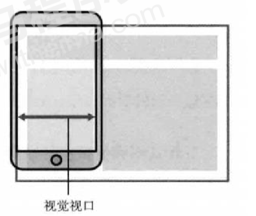
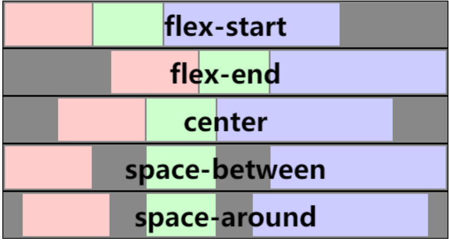
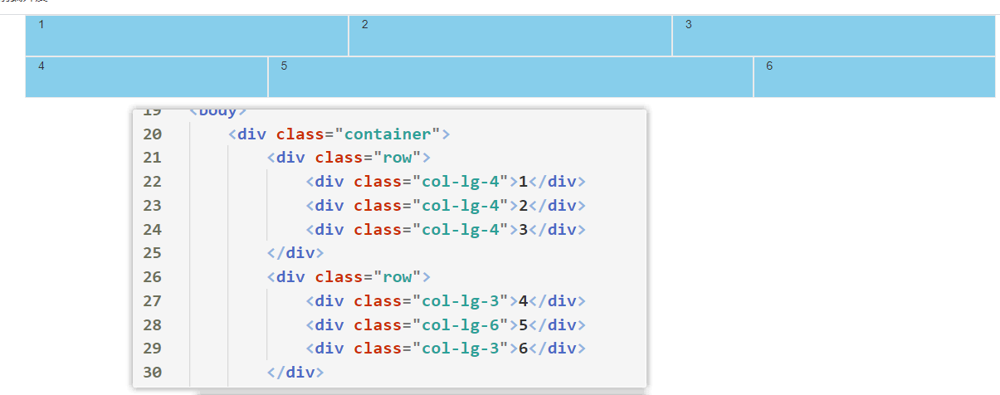
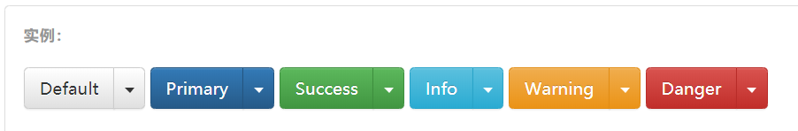

# 一、移动端基础

## 1.1 视口

- **布局视口**
    - **布局视口又称为画布**，指的是**当前页面中所有的区域**
    - iOS, Android基本都将这个视口分辨率设置为980px，所以PC上的网页大多都能在手机上呈现，只不 过元素看上去很小，一般默认可以通过手动缩放网页
    - 


- **视觉视口**
    - 视觉视口指的是**当前用户所能看见的区域部分**
    - 


- **理想视口**
    - 理想视口指的是***布局视口的宽度与当前手机设备的宽度一样***，并且***按照等比例缩放元素***


## 1.2 meta视口标签

- `meta`标签是写在`head`元素中的，该标签一般用于设定**视口相关配置**

```HTML
<meta name="viewport" content="width=device-width, initial-scale=1.0, user-scalable=no" >
```

- 移动端默认**视觉视口**大小是980px，所有的元素在移动端没有设置视口的情况下都会被缩小

    - width：设置视口的大小
    - initial-scale：设置缩放的比例
    - user-scalable：用户是否可以双击屏幕缩放，yes或no


## 1.3 物理像素和物理像素比 (了解)

- 常见的移动端屏幕尺寸

    

      

- **物理像素指的就是分辨率**

- 以苹果6为例，在厂家出厂时就设置好了其**分辨率**为`1334*750`，也就是说该设备屏幕中，能放入`宽750px，长1334px的东西`，但是为什么实际开发尺寸只有375*667？
    - PC端页面，1个px 等于1个物理像素的，但是移动端就不尽相同 
    - 移动端页面，`1px 开发像素 = 1px 开发像素 * 物理像素比`
    - 因此在移动端开发中写1px像素，***需要乘以物理像素比，才是实际像素***


## 1.4 移动端开发选择

- 现在市场常见的移动端开发有 **单独制作移动端页面** 和 **响应式页面** 两种方案 

- **单独制作移动端页面**（主流）

    - ***技术栈***：**流式布局（百分比布局）**、**flex 弹性布局**（强烈推荐）
    - 比如：京东商城手机版 淘宝触屏版 苏宁易购手机版
    - 移动端和PC端页面分别**通过不同的域名访问**

        
    


-  **响应式兼容PC移动端**
    - ***技术栈***：**媒体查询** 、**bootstarp框架**、**Less**
    - 原理：通过***判断屏幕宽度***来改变样式，***以适应不同终端***
    - 缺点：**制作麻烦**，需要花很大精力去调兼容性问题


## 1.5 移动端CSS初始化

- 移动端 CSS 初始化推荐使用***normalize.css***
  
- 官网地址： http://necolas.github.io/normalize.css/
  
- 初始化一些移动端的默认设置(做个了解)

    - ```css
        /*CSS3盒子模型*/
        box-sizing: border-box;
        -webkit-box-sizing: border-box;
        /*点击高亮我们需要清除清除 设置为transparent 完成透明*/
        -webkit-tap-highlight-color: transparent;
        /*在移动端浏览器默认的外观在iOS上加上这个属性才能给按钮和输入框自定义样式*/
        -webkit-appearance: none;
        /*禁用长按页面时的弹出菜单*/
        img,a { -webkit-touch-callout: none; }
        ```

        

- 下载好css初始化文件后，**在页面中引入**即可

    - ```html
        <link rel="stylesheet" href="./css/normalize.css">
        ```

        


## 1.6 移动端布局总结


# 二、流式布局

## 2.1 流式布局的概念

- 流式布局，就是**百分比布局** 

- 通过盒子的**宽度设置成百分比**来根据屏幕的宽度来进行伸缩，**不受固定像素的限制**，内容向两侧填充。 

- 流式布局方式是***移动web开发使用的比较常见的布局方式***

    

- 也就是说将**CSS单位全部换成百分比单位**，以达到自适应屏幕的大小，缺点：需要依赖**百分比的参考对象**


## 2.2 流式布局的基本实现


- 核心：宽度通过设置百分比，以此来达到不同的设备对应的是不同的宽度


# 三、flex 布局


## 3.1 初识 flex 布局

- **flex布局是目前web开发中使用最多的布局方案**

- flex 布局（Flexible 布局，弹性布局）

- 目前特别在移动端用的最多，目前PC端也使用越来越多了

- **如果不需要兼容IE浏览器可以完全用flex布局代替float布局**

    

## 3.2 flex布局的重要概念

- flex布局的**重要概念**

    - 开启了 flex 布局的元素**（父元素）**叫 **flex container**

    - flex container 里面的**每一个子元素**叫做 **flex items**

    - **每一个flex items 以主轴方向进行排列**

        

- 如何给元素开启 **flex** 布局？

    - 设置 **display 属性为 flex 或者 inline-flex** 的元素就可以成为 ***flex container***

        - ```css
            p {
            		display: flex || inline-flex;
            }
            ```

            

    - **flex（用的较多）： flex container 以 块级元素 形式存在**

    - inline-flex： flex container 以 行内块（可以给元素设置宽高，并且与其他行内元素在同一行） 形式存在

        

- 注：**开启flex后，不论是 flex container  还是 flex itmes 都可以设置宽高**

  ​    

## 3.3 flex 布局模型图


  

## 3.4 flex container 上的 CSS 属性

#### flex-direction

- **flex items** 默认都是沿着 main axis（主轴）从 main start 开始往 main end 方向排布

- ***flex-direction 决定了 main axis 的方向***

- 取值：

    - row（默认值）

    - row-reverse（主轴从右到左）

    - column（主轴从上到下）

    - column-reverse（主轴从下到上）

- 

    

#### justify-content（重点）

- **justify-content 决定了 flex items 在 main axis 上的对齐方式**

- 取值：

    - flex-start（默认值）：与 main start 对齐

    - flex-end：与 main end 对齐

    - ***center***：**在主轴方向上居中对齐**

    - ***space-between***：

            flex items 之间的距离是由主轴上的剩余空间均等分配的
            
            flex items与 main start、main end两端对齐

    - ***space-evenly***：

            flex items 之间的距离是由主轴上的剩余空间均等分配的
            
            flex items 与 main start、main end 之间的距离 等于 flex items 之间的距离

    - ***space-around***：

            flex items 之间的距离是由主轴上的剩余空间均等分配的
            
            flex items 与 main start、main end 之间的距离是 flex items 之间距离的一半

- 注意：space-between、space-evenly、space-around这些值都是**将主轴的剩余空间做一个平分**

    - **如果没有剩余的空间，那么这些属性是没有效果的**




#### align-items (重点)

- **align-items 决定了 flex items 在 交叉轴（cross axis） 上的对齐方式**

- 取值：

    - stretch：当 flex items 的宽度为auto时，会拉伸弹性元素（flex itmes），填充交叉轴空间

    - flex-start：与 cross start 对齐

    - flex-end：与 cross end 对齐

    - **center：居中对齐**，可以实现**flex items 在 flex  container**上的垂直居中效果


#### flex-wrap（重点）

- 默认情况下，所有的flex items 都会在同一行显示

- 默认情况下，**交叉轴上的剩余空间，将会均等分的分配给 flex items所属的每一行**

- **flex-wrap属性可以决定超过 flex container宽度的元素是否换行显示**

- 取值：

    - nowrap（默认值）：不换行显示**，假如宽度溢出，则自动压缩相应元素的宽度**

    - **wrap：换行显示,假如宽度溢出，自动换行**

    - wrap-reverse（用的少）：换行显示，并且cross start 与 cross end 交换
    
        


- flex-flow 是 flex-direction || flex-wrap 的简写

    - 可以省略，顺序任意

        

#### align-content

- **align-content 决定了多行 flex items 在 cross axis 上的对齐方式**，用法与 justify-content 类似

- **如果 flex container没有设置换行，那么该属性不起效果**

- 默认情况下，***交叉轴上的剩余空间，将会均等分的分配给 flex items所属的每一行***

    

- 取值：

    - flex-start：在交叉轴的 cross start 上依次排布多行，中间没有间隙

    - flex-end：在交叉轴的 cross end 上依次排布多行

    - **center：在交叉轴上居中对齐**

    - space-between：

            flex items 每行之间的距离是由交叉轴上剩余的空间均等分配的
            
            与 cross start、cross end两端对齐

    - space-around：

            flex items 每行之间的距离是由交叉轴上剩余的空间均等分配的
            
            flex items 与 cross start、cross end 之间的距离是 flex items 每行之间距离的一半

    - space-evenly：

            flex items 每行之间的距离是由交叉轴上剩余的空间均等分配的
            
            flex items 与 cross start、cross end 之间的距离 等于 flex items 每行之间的距离
        
        
        
        
        

## 3.5 flex items 上的 CSS 属性

#### order

- ***order 决定了 flex items 的排布顺序***

- 可以设置任意整数（正整数、负整数、0），值越小就越排在前面

- 默认值是 0

    


#### align-self

- flex items 可以通过 align-self 覆盖 flex container 设置的 align-items

    

    

#### flex-grow（重点）

- **flex-grow 决定了 flex items 如何扩展**

- 可以设置任意非负数字（正小数、正整数、0），默认值是 0

- **当 flex container 在 main axis 方向上有剩余 空间 时，flex-grow 属性才会有效**

  ​    

- 如果所有 **flex items** 的 **flex-grow** 总和 sum 超过 1

    - 每个 flex item 扩展的 宽度  = `主轴上剩余的宽度  X flex-grow / sum`

        

- 如果所有 **flex items** 的 **flex-grow** 总和不超过 1

    - 每个 flex item 扩展的 size  = ` flex container 的剩余 size X flex-grow`

        

- 如果想让每个 **flex  items** 元素**均等分主轴上剩余的宽度**，可以给 **flex items** 设置如下CSS属性

  - ```css
    flex items { flex-grow: 1 }
    ```
    
    
    
    
    
    

#### flex-shrink（重点）

- 如果flex items 在主轴方向上的宽度 超出了 flex container 的宽度时，默认的会将每个flex items 宽度减去超出的宽度

    

- **flex-shrink 决定了 flex items 如何收缩**

    - 可以设置任意非负数字（正小数、正整数、0），默认值是 1

    - **当 flex items 在 main axis 方向上超过了 flex container 的 size，flex-shrink 属性才会有效**

        

- 如果所有 flex items 的 flex-shrink 总和超过 1

    - 每个 flex item 收缩的 size = **flex items 超出 flex container 的 宽度 / flex-shrink 总和 * flex items所占flex-shrink所占的比例**

    

#### flex-basis

-  **flex-basis 用来设置 flex items 在 main axis 方向上的 宽度**

-  决定 flex items 最终 宽度 的因素，从**优先级高到低**

    - max-width\max-height\min-width\min-height

    - **flex-basis**

    - width\height

    - 内容本身的 size
    
        

#### flex

- **flex 是 flex-grow || flex-shrink || flex-basis 的简写**，flex 属性可以指定1个，2个或3个值。

- 只设定一个值（重点）

    - 无单位数: 它会被当作< flex-grow >的值。

    - px单位值: 它会被当作 < flex-basis >的值。

        

- 设定两个值

    - 第一个值必须为一个无单位数，并且它会被当作 < flex-grow > 的值

    - 第二个值必须为以下之一：

            一个无单位数：它会被当作 <flex-shrink> 的值。
            
            一个有效的宽度值: 它会被当作 <flex-basis> 的值。
        

- 设定三个值

    - 第一个值必须为一个无单位数，并且它会被当作 < flex-grow> 的值。

    - 第二个值必须为一个无单位数，并且它会被当作  < flex-shrink> 的值。

    - 第三个值必须为一个有效的宽度值， 并且它会被当作 < flex-basis> 的值。


# 四、响应式布局


## 4.1 rem单位

- 设置***文字大小***的单位

    - px：设置为固定的css像素

    - em：相对于父元素字体的大小

    - %：**相对于父元素字体的大小**

    - ***rem***：**相对于根元素（html）的字体大小**

        

        

- 设置***宽度***的单位

    - px：设置为固定的css像素

    - em: 

        - 如果自身有font-size，em相对于自己的font-size

        - 如果自身没有font-size，em相对于父元素的font-size

    - %：**相对于父元素的宽度大小**

    - ***rem***：**相对于根元素（html）的字体大小**

        

- 总结：***rem单位***永远相**相对于根元素（html）的字体大小**

    - ```css
        html {
          font-size: 12px;
        }
        
        div {
          font-size: 2rem; /* 24px */
          width: 5rem;  /* 60px */
          background-color: skyblue;
        }
        ```

        


## 4.2 媒体查询

- 媒体查询（Media Query）是**CSS3新语法**。
    - 使用 **@media** 查询，可以针对不同的媒体类型定义不同的样式 
    
    - **@media** 可以针对不同的屏幕尺寸设置不同的样式 
    
    - 使用`@media`才能够实现页面**响应式布局**
    
    
    
- **媒体查询语法规范**：

    - ```css 
            @media mediatype and|not|only (media feature) {
                CSS-Code;
            }
        ```
    
    - 媒体类型：`all`(所有设备)、`screen`(用于电脑屏幕，平板电脑，智能手机等。)
    
    - `media feature`：
        - `width`(浏览器的窗口尺寸，可加min/max)
        - `device-width`(设备的参数尺寸，可加min/max)
    
    

- `min-width`和`max-width`
    - `min-width`：最小宽度，在**媒体查询**中，宽度大于或者等于最小宽度时，就触发其CSS样式
    - `max-width`：最大宽度，在**媒体查询**中，宽度小于或者等于最大宽度时，就触发其CSS样式


>媒体查询一般写**四套设备方案**，在编写媒体查询时注意顺序(**从小到大**)，**后者**符合条件的媒体查询**会覆盖前者**


## 4.3 rem + 媒体查询

- **媒体查询 + rem**实现元素动态大小变化 
  
    - rem单位是相对于html元素的字体大小的，我们可以将元素**所有的css单位都设置为rem单位**
    - 通过媒体查询，可以根据不同的屏幕宽度设置不同的`HTML元素`的字体大小，以此达到页面元素大小的动态变化
    - 


- 引入**媒体查询的css文件资源**

    - 针对于不同的屏幕尺寸 **调用不同的css文件**

- ```css
    <link rel="stylesheet" href="styleA.css" media="screen and (min-width: 400px)">
    ```

    


## 4.4 rem适配方案（了解）

- 核心：使用**媒体查询**根据不同设备按比例设置***html的字体大小***，然后页面元素使用***rem做尺寸单位***
    - 当html字体大小变化。元素尺寸也会发生变化，从而达到等比缩放的适配


- rem适配方案***流程***：
    1. 按照设计稿与设备宽度的比例，动***态计算并设置 html*** 根标签的 ***font-size*** 大小；（媒体查询)
    2.  CSS 中，设计稿元素的宽、高、相对位置等取值，按照同等比例换算为 ***rem 为单位的值***


- rem适配方案的技术选择

    


### 技术方案1

- 核心：***rem + 媒体查询 + less 技术***

- 动态设置 html 标签 ***font-size 大小***

    ① 假设设备宽度是750px 

    ② 假设我们把整个屏幕划分为15等份（划分标准不一可以是20份也可以是10等份）

    ③ 每一份作为html字体大小，这里就是50px 

    ④ 那么在320px设备的时候，html元素的字体大小为320/15 就是 21.33px 

    ⑤ 用我们页面元素的大小 除以不同的 html 字体大小会发现他们比例还是相同的 

    ⑥ 但是已经能实现不同屏幕下 页面元素盒子等比例缩放的效果

    


- 元素中的***rem单位***取值
    - 公式： `页面元素的rem值 =  页面元素值（px） /  html font-size 字体大小`


# 五、Less

## 5.1 邂逅 Less

### 5.1.1 Less 简介

- 什么是Less？

    - Less是**一门 CSS 扩展语言，也称为CSS预处理器。**
    - 增加了变量、Mixin、函数等特性，使 **CSS 更易维护和扩展**
    - Less 既可以在 客户端 上运行 ，也可以借助Node.js在服务端运行。

    

- Less的中文官网：https://less.bootcss.com/


- 在Less文件中***导入其他Less文件***

    - ```less
        // 在 index.Less 中导入 common.Less 文件
        @import  “./common.Less”
        ```

        

### 5.1.2 Less 编译

- VSCode的***Less插件***：`Easy LESS`

    - 该插件用来把Less文件编译为 css文件 。只要保存一下Less文件，会自动生成同名的CSS文件

- 使用步骤如下
    1. 我们首先新建一个后缀名为***Less的文件***，在这个Less文件里面书写Less语句

    2. 通过`Easy LESS`插件可以将Less文件编译成CSS文件

    3. ***在HTML页面中将编译后的CSS文件引入即可***


### 5.1.3 Less中的注释

- 以`//`开头的注释，**不会**被编译到css文件中

- 以`/**/`包裹的注释**会**被编译到css文件中  


### 5.1.4 Less 变量

- 语法： `@变量名:值;`

    - ```less
        @fontColor: red;
        div {
            color: @fontColor;
        }
        ```

- 变量命名规范：

    1. 必须有@为前缀   
    2. 不能以数字开头 

- 使用Less变量

    - 作为普通属性值只来使用：直接使用`@xxx`
    - 作为选择器或属性名：`#/@{xxx}`的形式 (几乎不这么做)


>Less中的变量具有**块级作用域**，且会**提升**到当前**作用域**的最顶端


## 5.2 Less 嵌套

- 基本嵌套规则


- 如果有 & 符号，它就被解析为**父元素自身**或**父元素的伪类**
    - 


## 5.3 Less 混合 (核心)

- Less中允许将**公共的css样式**存放在`.xxx`函数体中，并以`.xxx()`形式调用

    - Less中的混合采取就是**抽离css公共样式思想**

    - 注：定义**函数名**时，必须以`.`开头！

      ​    

### 1. 普通调用


### 2. 带参数调用

- 可以在函数括号中通过`@xxx`定义形参，多个形参之间以`逗号`隔开，在调用时传入实参

    

    

- 以`@xxx:值`的方式定义**形参的默认值**，当没有传入对应的实参时，默认值会生效

    


### 3. 指定形参调用

- 在调用函数时，可以通过`@xxx:值`来指定形参的值

    


### 4. 匹配函数调用

1. 定义函数时，允许在所有形参的最前面**定义一个占位符**

2. 在调用函数时，可以传入占位符，根据占位符来**调用匹配的函数**

3. 当占位符为`@_`时，则代表**全局匹配**，不论传入什么占位符，该函数都会被调用

    


### 5. arguments形参

- 在定义函数时，默认会有一个`@arguments`形参，他代表了**所有形参的合集**

    


## 5.4 Less 运算

- ```less
    /* Less 里面写 */
    @witdh: 10px + 5;
    div {
    	border: @witdh solid red;
    }
    
    /* 生成的css */
    div {
    	border: 15px solid red;
    }
    /* Less 甚至还可以这样 */
    width: (@width + 5) * 2;
    ```

    

- 在less中，如果希望语句**不被less编译**，而是**被css编译**，则可以采取以下写法:`~"不被Less编译的内容"`

    - ```less
        div {
          width: ~"calc(100vh - 20vh)"
        }
        ```

        

>坑：less中加法+，减法-，乘法*可以直接写，**但是除法/需要（）括起来**
>


## 5.5 Less继承


- 继承语法与混合类似，只不过在定**义继承时不需要在括号**
- 继承时通过`extend(.xxx)`方式**继承**

- **继承后会编译成并集选择器**，有利于提高css性能

- ***继承不灵活性能高 混合灵活性能低***


# Bootstrap开发（一）

## 1.1 Bootstrap介绍

- Bootstrap 是基于 HTML、CSS、JavaScript的。 **使用Bootstrap可以快速搭建出我们想要的静态页面**

    - 官方中文文档网址：https://www.bootcss.com/
    - **优秀翻译**后的中文文档：https://code.z01.com/v3/  、  https://code.z01.com/v4/

    ​    

- 优点：

    - 提供了一套简洁、直观、强悍的组件

    - 通过***修改类名***，即可让元素拥有样式，让开发更简单，提高了开发的效率

        ​    

- ***Bootstrap***的核心在于：**通过修改类名来达到我们想要的样式**

    - 修改Bootstrap 原来的样式，注意***权重问题*** 

        ​    

- 学好***Bootstrap*** 的关键在于知道它***定义了哪些样式***，以及这些样式能实现什么样的效果

>注：`bootstrap3`和`bootstrap4`存在和**很多差异**，以下基本为`bootstrap3`的实例
>


## 1.2 Bootstrap基本模板

1. 引入**bootstrap**的CSS文件

    - ```html
        <link rel="stylesheet" href="./bootstrap-3.3.7/dist/css/bootstrap.css">
        ```

        

2. 引入jquery文件：**Bootstrap 的所有 JavaScript 插件都依赖 jQuery**，所以必须放在前边

    - ```html
        <script src="./js/jquery.js"></script>
        ```

        

3. 加载 Bootstrap 的**所有 JavaScript 插件**。你也可以根据需要**只加载单个插件**

    - ```html
        <script src="./bootstrap-3.3.7/dist/js/bootstrap.js""></script>
        ```

        

>注：以上为`bootstrap3`的**基本模板**，下面是`bootstrap4`的**基本模板**
>
>

1. 引入**bootstrap**的CSS文件

    - ```html
        <link rel="stylesheet" href="./bootstrap-4.6/dist/css/bootstrap.css">
        ```

        

2. 引入**jquery**文件：**Bootstrap 的所有 JavaScript 插件都依赖 jQuery**，所以必须放在前边

    - ```html
        <script src="./js/jquery.js"></script>
        ```

        

3. 引入**Popper**文件，该文件为`bootstrap4`新增的**内置组件文件**，需要单独下载

    - ```html
        <script src="./bootstrap-4.6/dist/js/popper.js"></script>
        ```

        

4. 加载 Bootstrap 的**所有 JavaScript 插件**。你也可以根据需要**只加载单个插件**

    - ```html
        <script src="./bootstrap-4.6/dist/js/bootstrap.js""></script>
        ```

        


## 1.3 布局容器

- 在`Bootstrap`中**预先定义**好了`.container`这个类，该类主要是**充当一个容器的作用**，该***容器主要用于居中显示***

  ​    

- `.container`类作用如下：

    - **居中显示**

    - 根据不同屏幕宽度的变化，其**容器的宽度也会发生变化**

        - 大屏 ( >=1200px)  宽度定为 1170px 
        - 中屏 ( >=992px)   宽度定为 970px 
        - 小屏 ( >=768px)   宽度定为 750px 
        - 以上所有**宽度包括内边距**

        

          

- 注意：

    - `.container`包裹的容器，左右**内边距均为15px**
    - `bootstrap`默认修改了所有元素的**盒模型**：`* { box-sizing: border-box }`
    - `border-box`下的width = `padding` + `border` + `width`，height同理


## 1.4 栅格系统（重点）


### 1.4.1 栅格系统的重要概念

- ***栅格系统***英文为“grid systems”，它是指将页***面布局划分为等宽的列***，然后通过**列数的定义来模块化页面布局**

    - 简单来说就是在一个`.container`里面处理`.row`与`.col-xx-xx`的关系

    ​    

- Bootstrap 需要为**栅格系统包裹**一个 `.container` 容器，从而**实现响应式布局**

    - 原理就是在不同屏幕下，通过媒体查询来改变这个***布局容器的大小***，再改变里面***子元素的排列方式和大小***，从而实现 不同屏幕下，看到不同的页面布局和样式变化

        

- 不论容器宽度怎样变化，***系统会自动将容器均分***为最多`12列`。


### 1.4.2 栅格选项参数

- **栅格系统**用于通过一系列的***行（row）与列（column）***的组合来创建**页面布局**


- 所有的行`.row`必须放到`.container`容器里面，所有列（`column）`必须放在 行” `.row` 内

- 每一行`.row`都会占据***父容器***的**全部宽度**，**包括容器的内边距部分**，且***每一行均等分成了12列***

- `.col-xs-xxx.col-sm-xxx .col-md-xxx`：分别代表在不同屏幕尺寸下，**列所占的份数**

    

    

- 类前缀解析：

    - `.col-xs-份数`：在屏幕宽度小于768px下所占的列数

    - `.col-sm-份数`：在屏幕宽度大等于768px下所占的列数 （小屏设备）

    - `.col-md-份数`：在屏幕宽度大等于992px下所占的列数

    - `.col-lg-份数`：在屏幕宽度大等于1200px下所占的列数 （大屏设备）

        ​    

- 注意点：

    1. 每一***列***默认有左右15像素的 padding ，可以通过**取消内边距**或者在**列中嵌套一个行**来消除内边距
    2. 可以同时为一列指定多个设备的类名，以便**在不同尺寸下划分不同份数** 例如 `class="col-md-4 col-sm-6"`
    3. 如果**列的总份数大于12**，多余的“列”所在的元素将被作为一个整体***另起一行排列*** 
    4. 在`xs`屏幕模式下，默认每一列占***12份***


### 1.4.3 栅格系统源码分析

>`bootstrap3`中**栅格系统**是基于  ***float***  实现，而在`bootstrap4`中**栅格系统**是 ***flex*** 实现
>


1. 通过**媒体查询**来改变这个***`.container`容器的width***
2. 每一行`.row`的**宽度**默认与父元素`.container`一致  100%

3. 根据***每一列的份数***，来决定当前列在行中的***width***，默认每一行分为12列
4. 通过**媒体查询**改变**每一列所占的width**，保持**每一列的width**都参照于`.container`容器


- `bootstrap`中的栅格系统的**源码分析**

    


### 1.4.4 自定义栅格系统

1. 进入`bootstrap.css`中，全局匹配`col`，修改为自己想要自定义的类名

    

    

2. 引入`bootstrap.css`后，将原来的`col`类名，替换为修改后的自定义类名

    


### 1.4.4 列嵌套

- **列嵌套**就是一个列内再分成若干份小列。所以需要将当前列看成是一个**容器**，并为其添加新的行和列

    - ```html
        <div class="row">
          <div class="col-lg-4">
            <div class="row">
              <div class="col-lg-6">小列</div>
              <div class="col-lg-6">小列</div>
            </div>
          </div>
        </div>
        ```

        

    

### 1.4.5 列偏移

- 使用` .col-md-offset-xxx `类可以将列***向右侧偏移***。实际原理是**为当前元素增加了左侧的外边距**

    - xxx的取值是你要向右偏移几个***列份数***

    - ```html
        <!-- 列偏移 --> 
        <div class="row">
            <div class="col-lg-4">1</div>
            <div class="col-lg-4 col-lg-offset-4">向右偏移4个列份数</div>
        </div>
        ```

        


## 1.5 响应式工具

- 在实际开发中，我们想要一些元素在大屏幕设备下可见，在小屏幕下不可见，可以通过**媒体查询来实现**
- `Bootstrap`已经帮我们预先准备了这种**响应式工具类**，可以方便的针对不同设备 **展示或隐藏页面内容。**


# Bootstrap开发（二）


​    

## 2.1 全局CSS样式


### 2.1.1 排版样式

- 标题：

    - ```html
        <p class="h1~h6"></p>
        ```

- 改变大小写

    - ```html
        <p class="text-lowercase">Lowercased text.</p>
        <p class="text-uppercase">Uppercased text.</p>
        <p class="text-capitalize">Capitalized text.</p>
        ```

- 图片相关样式

    - `img-thumbnail`：图片带有边框 且自适应父元素的大小
    - `img-circle`：根据图片大小为其添加圆角

- 文本颜色

    - `text-primary`：蓝色
    - `text-danger`：酒红色

- 文字对齐和行内元素居中

    - `text-center`

- 背景颜色

    - `bg-primary`：深蓝色
    - `bg-success`：绿色
    - `bg-info`：浅蓝色
    - `bg-warning`：粉色

- 块元素居中

    - `center-block`

- 清除浮动

    - `clearfix`

- 显示或隐藏内容

    - `hidden/show`


### 2.1.2 表格样式

- 在***Botstrap***中，**表格样式的所有类名**，都加在`table`元素上
- `.table`：使表格的每一行占据父元素的全部宽度，并且均等分每一个`td`

- `.table-striped`：实现条纹状表格

- `.table-bordered`：带边框的表格

- `.table-hover`：鼠标悬停到`tr`时，背景颜色加深


### 2.1.3 表单样式

- 这里不多做表单样式的讲解，在`bootstrap`中看表单实例更详细


### 2.1.4 按钮样式

- `.btn`：为按钮添加最基本的按钮样式
- `.btn-info/success`：设置按钮的背景颜色
- `.btn-lg/sm`：设置按钮的尺寸大小

- `.close`：关闭按钮

- `.caret`：三角形样式


### 2.1.5 字体图标

- 字体图标去**中文文档中的组件**中查找响应的类名，直接使用即可


## 2.2 组件

- 这里只展示常见的组件图片，具体组件的代码和讲解，需要去`Bootstarp3`中文官网中查看

    ​    

### 2.2.1 下拉菜单

- 实例1

    


### 2.2.2 按钮式下拉菜单

- 实例1：

    


- 实例2：

    


- 实例3

    


### 2.2.3 导航条

- 实例1

    


### 2.2.4 分页


### 2.2.5 巨幕


### 2.2.6 列表组


## 2.3 JS插件


### 2.3.1 模态框

1. ***先复制好模态框的HTML代码***

    - ```html
        <button class="btn btn-primary btn-lg">点击展示模态框</button>
        <!-- 模态框 -->
        <div class="modal fade" tabindex="-1" role="dialog">
        ......
        ```

2. 在JS中编写按钮的点击事件

    - ```js
        $('.btn').click(() => {
            // 展示模态框 $('模态框的选择器')
            $('.modal').modal('show')
        })
        ```

3. 或者不需要编写JS代码

    - ```html
        <!-- data-target='模态框的选择器' -->
        <button data-toggle="modal" data-target=".modal">展示模态框</button>
        ```

        

### 2.3.2 轮播图

```html
<div id="carousel-example-generic" class="carousel slide" data-ride="carousel">
  <!-- 小圆点 -->
  <ol class="carousel-indicators">
    <li data-target="#carousel-example-generic" data-slide-to="0" class="active"></li>
    <li data-target="#carousel-example-generic" data-slide-to="1"></li>
    <li data-target="#carousel-example-generic" data-slide-to="2"></li>
  </ol>

  <!-- 轮播内容 -->
  <div class="carousel-inner" role="listbox">
    <div class="item active">
      
      <div class="carousel-caption">
        ...
      </div>
    </div>
    <div class="item">
      
      <div class="carousel-caption">
        ...
      </div>
    </div>
    ...
  </div>

  <!-- 上一页下一页控制器 -->
  <a class="left carousel-control" href="#carousel-example-generic" role="button" data-slide="prev">
    <span class="glyphicon glyphicon-chevron-left" aria-hidden="true"></span>
    <span class="sr-only">Previous</span>
  </a>
  <a class="right carousel-control" href="#carousel-example-generic" role="button" data-slide="next">
    <span class="glyphicon glyphicon-chevron-right" aria-hidden="true"></span>
    <span class="sr-only">Next</span>
  </a>
</div>
```


- ```js
    $('.carousel').carousel({
      interval: 2000  // 间隔两秒轮播一次
    })
    ```

    


# 细节补充

## 1. CSS单位比较

- 设置***文字大小***的单位

    - ***px***：设置为固定的css像素

    - ***em***：相对于父元素字体的大小

    - ***%***：**相对于父元素字体的大小**

    - ***rem***：**相对于根元素（html）的字体大小**

      ​    

      ​    

- 设置***宽度***的单位

    - ***px***：设置为固定的css像素

    - ***em***: 

        - 如果自身有font-size，em相对于自己的font-size

        - 如果自身没有font-size，em相对于父元素的font-size

    - ***%***：**相对于父元素的宽度大小**

    - ***rem***：**相对于根元素（html）的字体大小**

      

    

    


## 2. vw 与 vh单位

- 可以说vw 与 vh单位的出现，***完美解决了页面适配屏幕大小的问题***！

    - 这两个单位都是相对于视口
    - 视口：***浏******览器中所能看见的区域，也称为可视区域***

    

- ***vw***：

    - 相对于视口宽度，1vw = **视口宽度的1%**

- ***vh***：

    - 相对于视口高度，1vh = **视口高度的1%**


- css单位参考：https://www.runoob.com/cssref/css-units.html


## 3. CSS中定义变量

**全局变量**

1. **定义**全局变量：通过`--变量名`定义变量，在**任何元素**上都可以引用该变量

    - ```css
        :root {
            /* 定义了一个名为themeColor1的变量 值为红色 */
            --themeColor1: red;
        }
        ```

2. **使用**全局变量：通过`var(变量名)`引用变量，**全局变量在任何元素上都可以被引用**

    - ```css
        h2 {
        	color: var(--themeColor1);
        }
        .one {
        	color: var(--themeColor1);
        }
        ```


**局部变量**

1. **定义**局部变量：只能在**符合该选择器**的元素上引用该变量

    - ```css
        .one {
          /* 定义了一个名为themeColor2的变量 值为蓝色 */
          --themeColor2: blue;
        }
        ```

2. **使用**局部变量：通过`var(变量名)`引用变量，**局部变量只能在符合该选择器的元素上引用该变量**

    - ```css
        .one {
        	color: var(--themeColor2);
        }
        ```

        


## 4. viewport + Less 适配

>`viewport适配`也就是将**所有的px像素单位转换为vh、vw单位**，已达到**页面自适应效果**
>
>
>
>

- 以`iphone6`为设计稿

    

    

    


## 5. 移动端上的a标签范围问题

1、 直接 删除 a标签的 **href属性**  （如果在不做页面跳转的情况下推荐使用）


2、 给a标签增加css 样式，增加一个  -webkit-tap-highlight-color 属性

实例 ：

```css
a {
 -webkit-tap-highlight-color: rgba(0,0,0,0);
 }
```


## 6. 清除移动端默认样式

```css
/*reset css*/
*,::before,::after{
    margin:0;
    padding:0;
    /*清除移动端默认的点击高亮效果*/
    -webkit-tap-highlight-color:transparent;
    /*设置以边框开始计算宽度*/
    -webkit-box-sizing:border-box;
    box-sizing:border-box;
}

body{
    font-size:14px;
    font-family:"Microsoft YaHei",sans-serif;/*设备默认字体*/
    color:#333;
}

a{
    color:#333;
    text-decoration:none;
}

a:hover{
    text-decoration:none;
}

ul,ol{
    list-style:none;
}

input, button{
    border:none;
    outline:none;
    /*清除移动端默认的表单样式*/
    -webkit-appearance:none;
}
```


## 7. viewport + rem响应式适配

- https://juejin.cn/post/6844904029898670088#heading-2

- 原理：
    - 设置html的`font-size`为**vw单位**，跟随着屏幕视口大小的改变而改变
    - 其他元素的单位统统替换为 **rem**单位，即可实现响应式效果


## 8. 禁止移动端左右滚动

1. 设置meta标签

   - ```css
     <meta name="viewport" content="width=device-width, initial-scale=1.0, user-scalable=no, shrink-to-fit=no">
     ```

     

2. 设置根元素大小

   - ```css
     html, body {
       width: 100vw;
       overflow-x: hidden;
     }
     ```
     
  


