# 一、手机APP开发 - 前端打包

## 1.1 三种APP开发模式

- **web app**

    - 基于`html + css + js`技术栈开发的APP

    - 通过**编辑器的打包功能**，将`.html`文件打包成APP应用

        

- **native app**

    - 原生APP就是利用**Android**、**iOS**平台官方的**开发语言**进行开发

    - Android app开发：`java`     IOS 开发：`object-c / swift`

        

- **混合开发**

    - 基于**web app** 和 **native app** 两种开发模式 **混合进行开发**

      ​    


>**三种开发模式下的app**的区别

- **web app**：

    1. **开发成本低、跨平台**

    2. 需要联网，因为`html`文件部署在远程服务器需要发送请求访问

    3. 更新版本方便(更新服务器部署的`html`文件即可)

    4. 移动设备功能有限

      ​    

- **native app**：

    1. **开发成本高、Android/IOS需要单独开发**

    2. 不需要联网，因为直接下载到本地

    3. 更新版本需要重新下载软件(体验差)

    4. 移动设备功能丰富

    5. **性能最优**

      ​    

        

- **混合开发**：

    1. 比web app版实现功能多
    2. 跨平台
    3. 可离线运行，但部分内容依旧需要联网展现


## 1.2 理解webview

>在移动设备上，不论是应用APP还是网页，都必须**通过`webview`来渲染`html`页面**

- 理解**浏览器内核**

    - 浏览器最重要或者说核心的部分为“**渲染引擎**”，不过我们一般习惯将之称为“**浏览器内核**”。负责将网页语法进行解释（`html + css + js`）并渲染成我们所**看到的网页**。
    - **不同的浏览器内核对网页编写语法的解释也有不同**，因此同一网页在不同的内核的浏览器里的渲染效果也可能不同

    - 以chrome为例，**chrome**的**渲染引擎**是**WebKit 内核**，那么`html`页面就是由 **webkit内核进行解释并渲染**

    

- **webview是什么？**

    - **PC端**上的浏览器一般由`webkit`内核解析并渲染`html`页面

    - **移动设备**上的浏览器一般由`webview`内核解析并渲染`html`页面

    - **Webview** 是一个基于webkit的**移动端渲染引擎**

      ​    

- **webview用于什么地方？**

    - 手机系统层面如果没有webview支持，是无法展示html页面，webview的作用是**手机系统来展示html界面的**

    ​      

- **一个原生app应用调用html页面的过程？**

    1. 原生应用加载html页面 (走网络请求获取`html`文件)

    2. 加载完成，**通过webview来渲染展示的**

    3. 那么页面不光展示，有时候可能还需要交互，比如html界面的按钮需要调用系统原生的东西（比如：拍照，系统的文件，相册之类的）。**原生端就负责维护html调用的接口**，然后按照需要返回（原生端充当一个server的角色，html充当一个client角色）


## 1.3 APP打包

>将一个`.html`文件**打包成APP**需要经过以下几个步骤

- 注：hubdierX要注册邮箱，打包需要实名认证

1. 下载`HBuilderX`：https://www.dcloud.io/hbuilderx.html，***选择APP开发板***
2. 在解压文件存储地址中找到**HBuilderX.exe**，直接双击运行**HBuilderX.exe**文件
3. 新建项目，选中`H5+app`类型

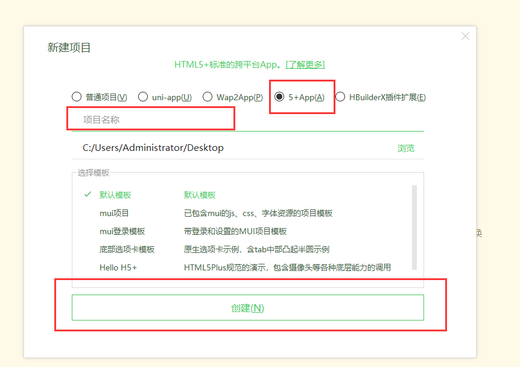

4. 创建`H5+app`项目后，删除所有文件，仅保留`manifest.json`文件，并将要打包的`HTML`项目导入进去

    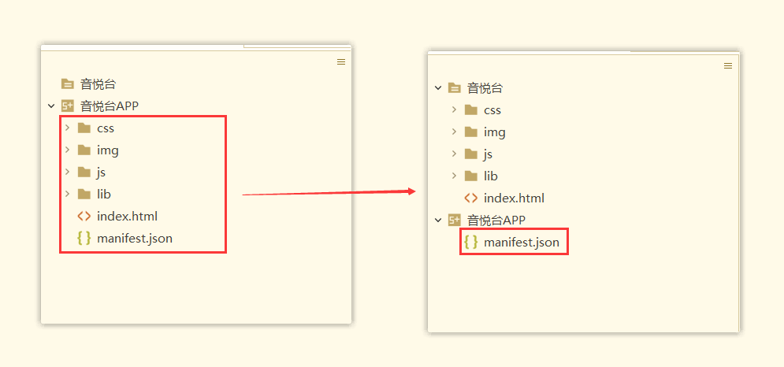

5. 点击`manifest.json`文件 对APP进行配置，**图标只支持png格式**

    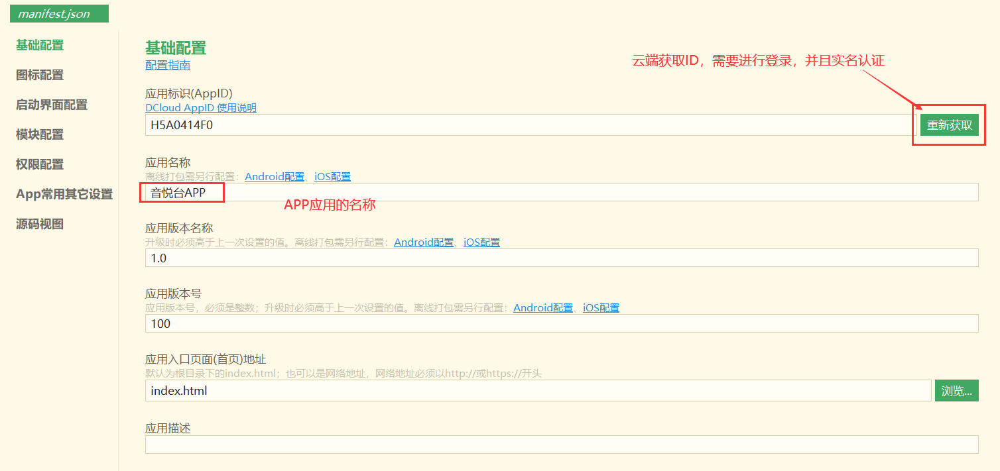

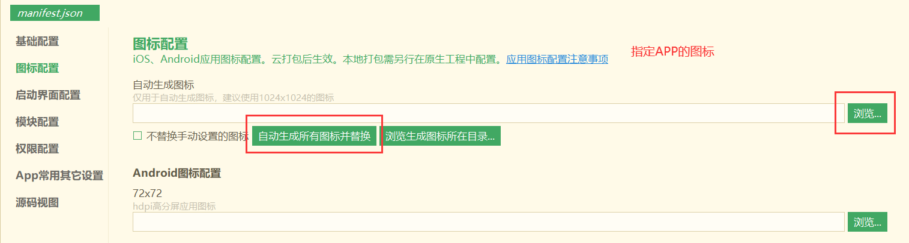


6. 右键点击`H5+app`项目，发行 -> 云打包

    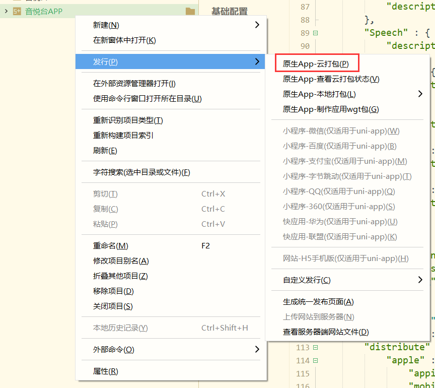


7. 使用`DCLOUD`老版证书打包，由于ios APP需要配置额外证书，因此**只打包Android app**

    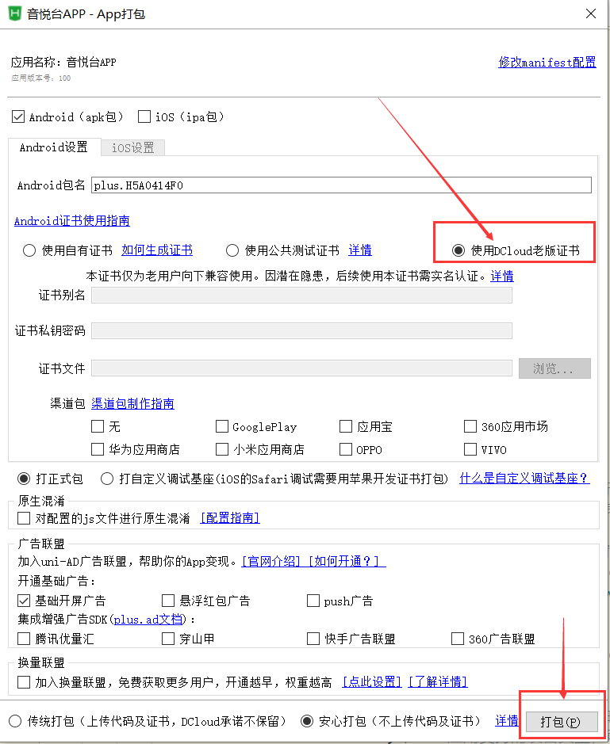


8. 打包完成，点击下载地址，进行下载`apk`文件

    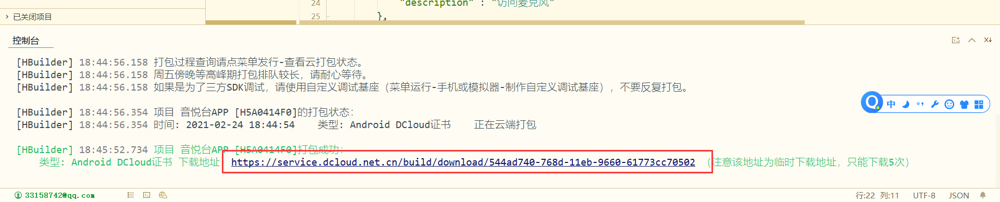


9. 下载安装模拟器，将`apk`包拖动到模拟器上，测试项目


## 1.4 打包前端项目

1. 将前端项目部署到远程服务器上

2. 在`H5+app`项目中新建**index.html**文件，编写js脚本，让页面跳转到前端页面所在的网址

3. 重复上一个小章节的步骤，开始打包成app

    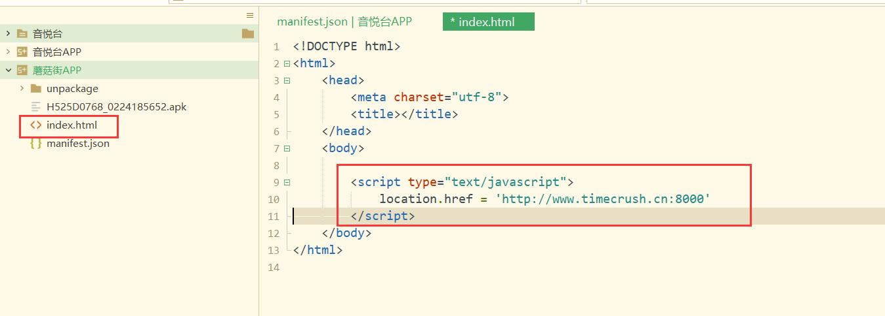


>注：js脚本中链接跳转时需要添加**http前缀**


# 二、手机APP开发 - MUI框架

## 2.1 MUI框架的介绍

>MUI是最**接近原生APP**体验的**高性能前端框架**

- 使用MUI框架开发手机APP的优势：

    1. **框架轻量**，MUI不依赖任何第三方JS库，文件体积小

    2. **追求原生APP UI风格**

    3. **体验流程**，在MUI框架内部通过webview解决了DOM元素的卡顿问题

    4. MUI框架可以看做是一个**UI组件库**，而H5+ 才是实现调用设备功能的技术规范

          

        

- 使用MUI框架前的**预备知识**：***html + css + js***

- [MUI官网](https://dev.dcloud.net.cn/mui/)

>**MUI**的实现，其**底层原理**与**HTML5+**、**5+Runtime**、**native.js**有着密不可分的关系
>

- [HTML5+、native.js、5+Runtime等介绍](https://blog.csdn.net/u014466109/article/details/71076185)


## 2.2 MUI的实现原理 (了解)

### HTML5+

- ***HTML5+***也可以称为**HTML5 Plus**	
    - [HTML5+文档补充](https://ask.dcloud.net.cn/article/89)

- H5开发APP的痛点：
    - 无法调用手机硬件上的功能，比如拍照、通讯录等
    - 为弥补H5能力的不足，中国成立了HTML5中国产业联盟[www.html5plus.org](http://www.html5plus.org/)组织，**推出HTML5+规范。**


- 什么是 **HTML5+** ?

    - HTML5+规范是一个**开放规范**

    - HTML5+**新增了**JavaScript对象**plus**，使得**js可以调用各种浏览器无法实现或实现不佳的设备能力**

    - 简单来说就是**HTML5+可以调用一些设备硬件上的API**，如摄像头、陀螺仪、文件系统、通讯录等

        

- HTML5+提供的**plus对象**
    - mui中有个plus对象，他不是简单的使用html5的功能，而是提供了一个叫html5+的API集，并且将他们封装在了这个plus对象中，里面有陀螺仪，map，定位，相机，文件流等等的原生功能调用接口！

    - plus对象就必须在***mui.plusReady()***之中使用，，如果不不需要用***HTML5+***提供的API，你并不需要使用plusReady方法，只需要在用mui之前mui.init()一下就可以，这也是**mui.init()**和**plusReady()**的**区别**

    - mui.plusReady()是为“html5+”而生的，最终需要**打包成了app级别**才能使用，因为这**plus对象里面的东西最终会被映射成为java，objective-c的代码**
    - 说太多也不好理解，这些底层的实现都已经由dcloud团队领导的“中国html5+产业联盟”（社区）实现了，我们只要知道我们写的plus对象的js代码都会被转化为原生代码，app就能实现很多原生功能的调用。

    - plus这些东西在浏览器级别是不支持的，所以不可以在浏览器中调用plusReady，以及plus.xxx.xxx方法等

    - 要使用html5+就要求我们**打包成app**，**有5+Runtime运行环境**，这样即可运行plus对象下的对象和方法，这个打包可以由hbuilder实现。


###  Native.js

- HTML5+是规范性的，他**只实现了一些常用的原生API调用**
- 如果希望调用所有的原生API，则要**使用Native技术**

>如果说Node.js把js扩展到服务器世界，那么Native.js则把js扩展到手机App的原生世界。
>

- ***Native.js***是另一项**创新技术**，也简称 **NJS**
    - Native.js把几十万**原生APP的API映射成了js对象**，通过**js**可以直接调**ios**和**android**的**原生API**
    - 这部分就不再跨平台，写法分别是plus.ios和plus.android
    - **native.js不是js框架**，是技术！
    - native.js使得开发H5 APP**更加接近原生**，因为他可以用原生一样的语法调用原生的对象（映射）
    - 与Node不同的是，NJS没有单独的运行环境，而是集成在另一个环境中*(5+Runtime)*


- 补充：
    - 由于**NJS是直接调用原生API**，需要对原生API有一定了解
    - 需要能看懂原生代码并参考原生代码修改为JS代码，否则只能直接copy别人写好的NJS代码。


- [Native.js文档补充](https://ask.dcloud.net.cn/article/88)


### 5+Runtime

- ***5+Runtime***：是一种运行环境

    - 它是**HTML5+规范实现**的必要环境
    - 也是**Native.js**技术实现的必要环境

    - 目前 **Hbuilder X**集成了5+Runtime环境

- HTML5+ APP 应用架构

    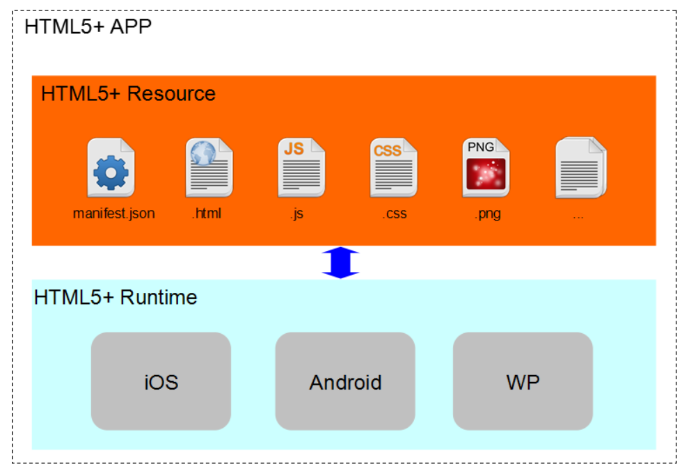


### H5 APP和H5+ APP的区别

- 使用H5开发的APP

    - 其主要功能与网页相同，只能实现一些简单的APP，**无法完成对设备硬件功能的调用**

        

- 使用H5+开发的APP
    
    - 可以与原生语法一样调用设备硬件的功能，但是要**基于HTML5+规范去实现**


## 2.3 开发环境搭配

1. 下载并安装好 ***Hbuilder X***,
2. 通过***Hbuilder X***来创建**MUI项目工程文件夹**

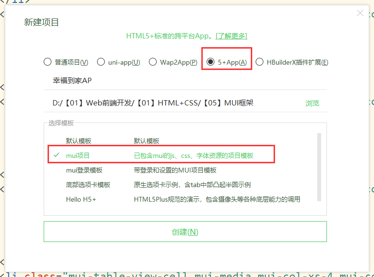


3. 了解文件夹目录结构

    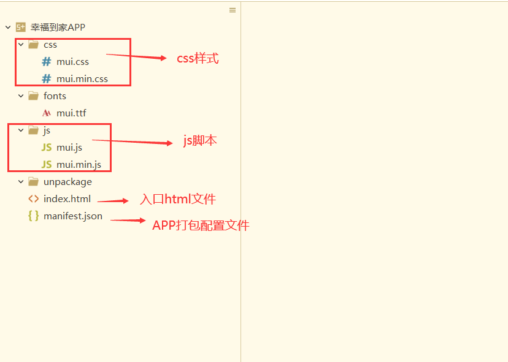


## 2.4 MUI初体验

1. 新建**含mui的HTML**文件
    - 在Hbuilder X中，新建HTML文件，选择”含mui的HTML“模板，可以快速生成mui页面模板
    - 该模板默认处理了mui的js、css资源引用。

2. 输入`mheader`
    - 顶部标题栏是每个页面都必需的内容，在Hbuilder中输入mheader，可以快速生成顶部导航栏。

3. 输入`mbody -> mlis`

    - 除顶部导航、底部选项卡两个控件之外，其它控件都建议放在`.mui-content`控件内，在Hbuilder中输入mbody，可快速生成包含`.mui-content`的代码块。

    - 在`.mui-content`内输入`mlis`可以快速生成列表的代码块

4. 输入`mTab`

    - 可快速生成底部选项卡

最后实现效果

​	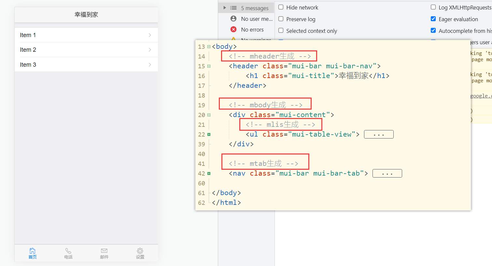

- [更多完整代码块快捷键请参考](https://dev.dcloud.net.cn/mui/snippet/)


# 三、手机APP开发 - MUI实战

## 3.1 项目介绍

- 项目截图

    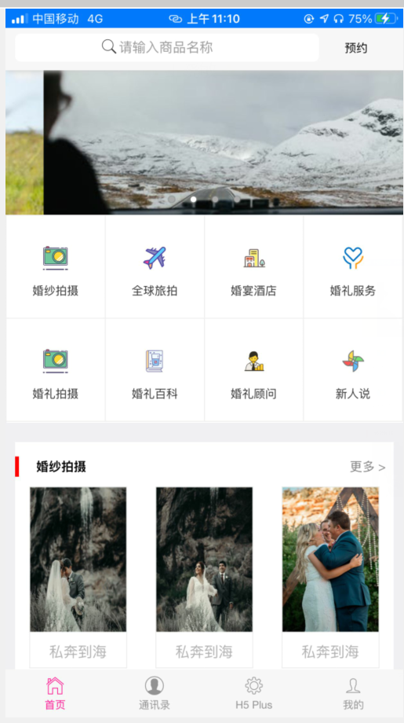           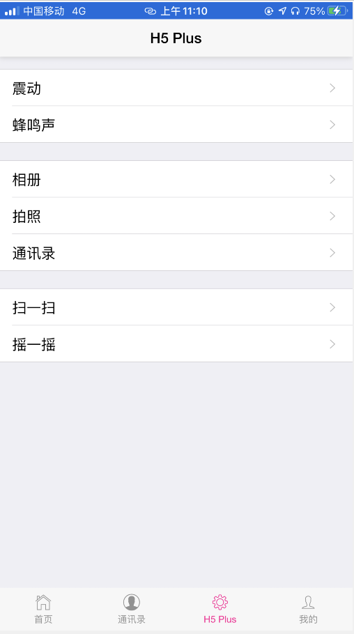        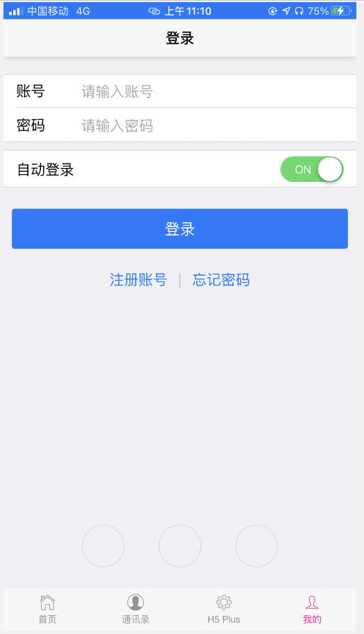


>主要实现功能：使用**html5 plus 规范**去调用硬件上的功能，使用**mui框架**来**搭建UI界面**
>

- `html5 plus接口文档`：https://www.html5plus.org/doc/zh_cn/device.html#plus.device.beep

- 再次重复：**使用html5 plus规范时**，其**运行环境只能在手机APP上**，因为浏览器无法识别plus对象

- 使用**mui框架**时，**可以通过浏览器来预览实现的UI界面效果**


## 3.2 项目初始化

1. 在Hbuilder X 中创建 **h5 + app** 项目，选择mui模板

    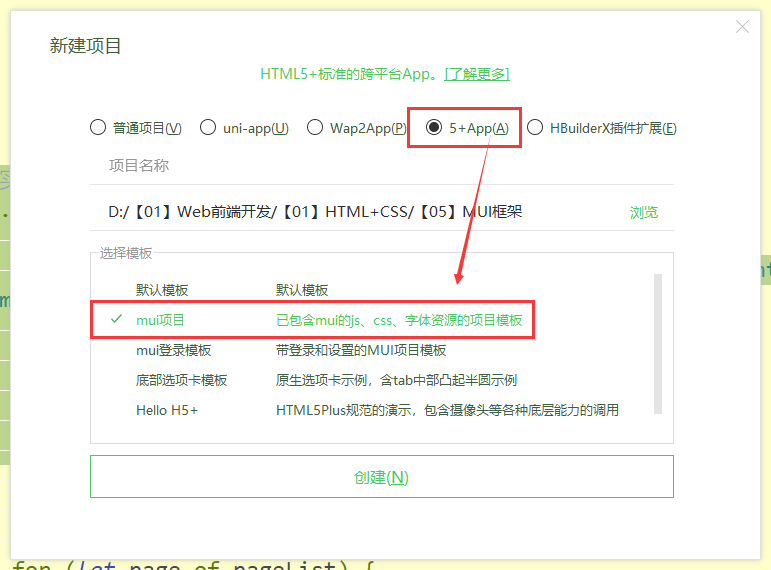

2. 划分项目目录结构

    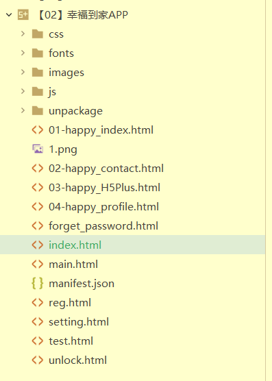

3. 在手机上调试APP，步骤如下：

    1. 将手机与电脑用数据线进行连接
    2. Hbuilder X中 *运行 -> 运行到手机或模拟器 ->运行自己的设备*

    3. 打开手机上自动安装的 Hbuilder软件，即可实施预览当前所开发的APP


## 3.3 底部TabBar的实现

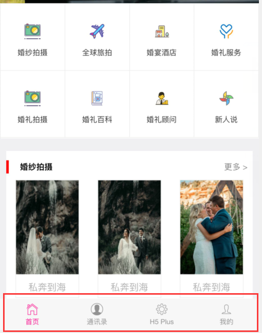

- 使用底部TabBar将APP划分为4个不同页面：**首页、 通讯录、H5 Plus、我的**


1. 通过**mui框架**将**底部选项卡**给**渲染出来**

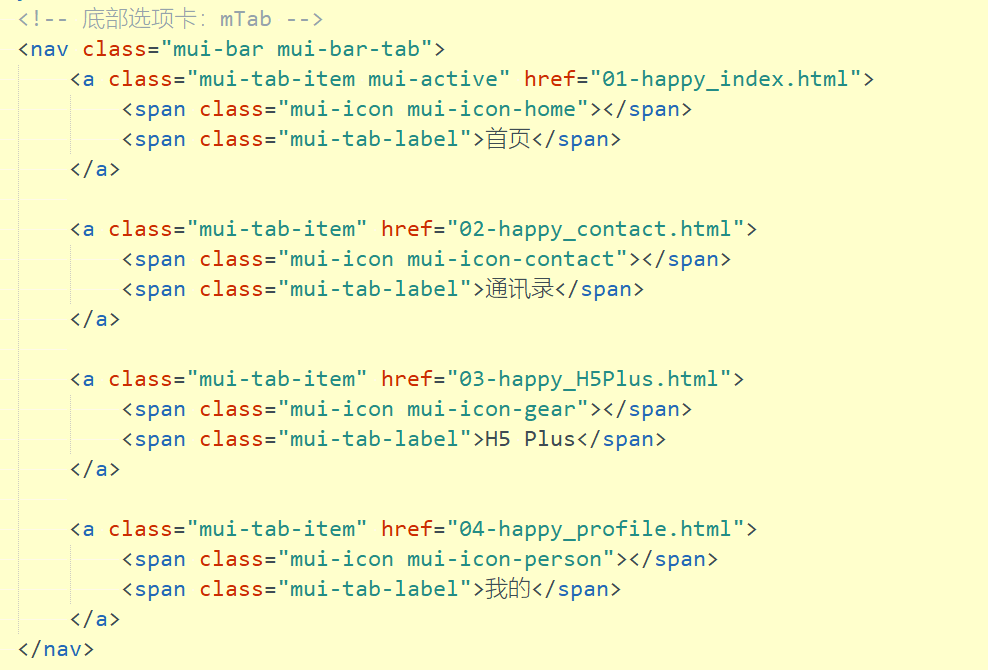


2. 通过**HTML5 Plus**规范实现底部选项卡跳转页面的功能，API：***plus.webview***

    - ```js
        // 实现底部选项卡切换功能
        mui.plusReady(() => {
          // 定义一个数组，用于存储底部选项卡关联的页面
          let pageList = ['01-happy_index.html', '02-happy_contact.html', '03-happy_H5Plus.html', '04-happy_profile.html']
          // 获取当前窗口对象
          let ws = plus.webview.currentWebview()
          // 设置页面窗口样式
          let pageStyle = {
            bottom: "50px",
            top: "0px",
          }
          // 遍历页面数组，为每个页面创建webview窗口对象
          for (let page of pageList) {
            // 将当前遍历到的页面创建为webview窗口对象
            let item = plus.webview.create(page, page, pageStyle)
            // 将webview窗口对象追加到当前ws对象中
            ws.append(item)
          }
          // 设置默认打开的页面
          plus.webview.show(pageList[0])
        })
        
        
        // 监听底部选项卡的点击
        // 使用mui 的on监听事件时，必须绑定后代元素，不然报错，或者可以通过原生JS方式监听事件
        mui(".mui-bar-tab").on('tap', '.mui-tab-item', function() {
          //获取点击的a标签的href值
          const href = this.getAttribute("href");
          // 展示对应的页面
          plus.webview.show(href)
        })
        ```

        

3. 将底部**tabbar页面**设置为APP的**主入口页面**

    


## 3.4 首页实现

- 使用**mui框架**完成首页页面的展示

    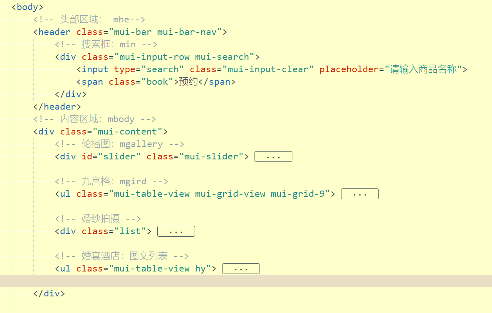


- 实现**拨打电话**和**轮播图自动轮播**功能

    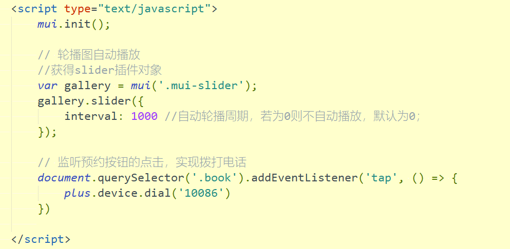


## 3.5 H5 Plus功能实现

### H5 Plus - 震动、蜂鸣声功能

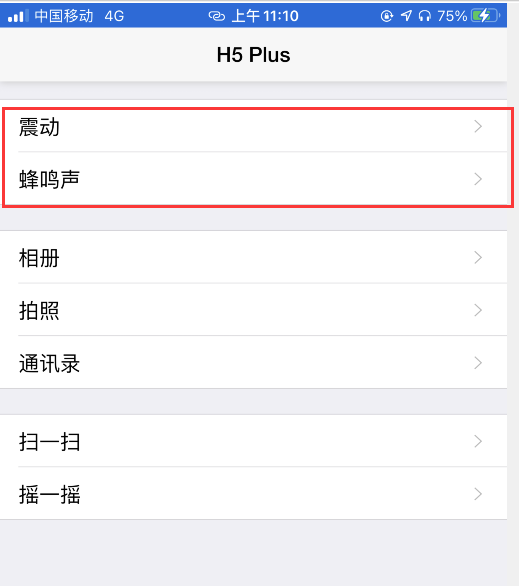


- 使用**HTML5 Plus规范**实现震动、蜂鸣声功能：*device对象*

    ```js
    // 1. 发出蜂鸣声
    let beepEle = document.querySelector('.beep')
    beepEle.addEventListener('click', function() {
    	plus.device.beep(2000)
    })
    
    // 2. 设备震动
    let vibrateEle = document.querySelector('.vibrate')
    vibrateEle.addEventListener('tap', function() {
    	plus.device.vibrate(2000)
    })
    ```

    


### H5 Plus - 通讯录

- 使用**HTML5 Plus规范**实现通讯录功能：*contacts对象*

    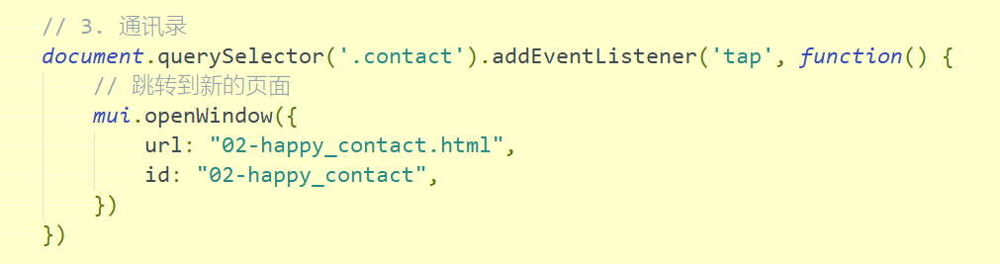

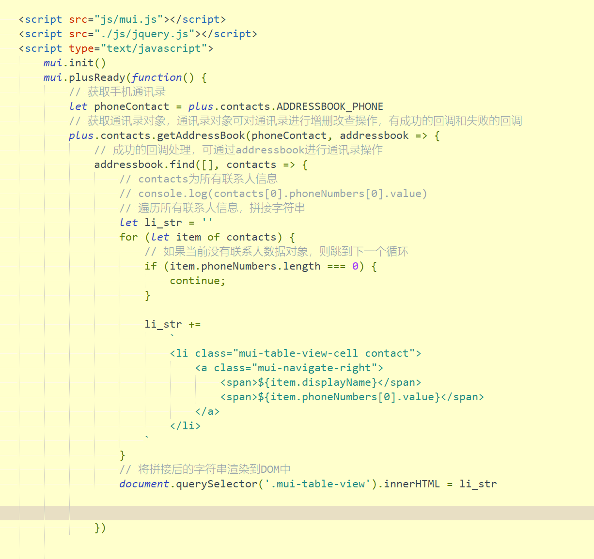


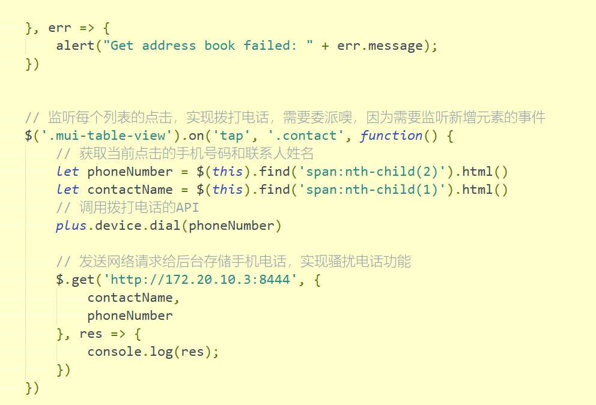


### H5 Plus - 相册单选

***gallery对象***

```js
plus.gallery.pick(path => {
 	// path为所选照片在手机中存储的位置
 	let img = document.querySelector('.show-img img')
 	img.setAttribute('src', path)

 }, () => {
 	alert('请在设置中打开相册权限')
 	console.log('error');
 })
```


### H5 Plus - 相册多选

***gallery对象***

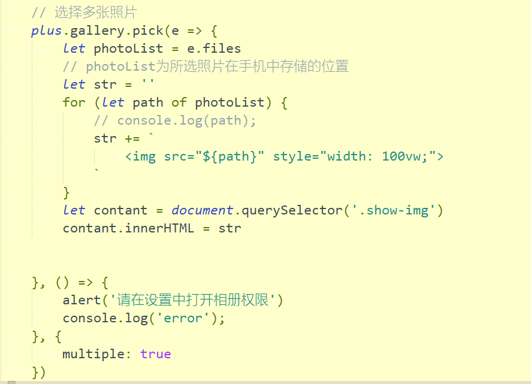


### H5 PLus - 拍照

***camera***对象

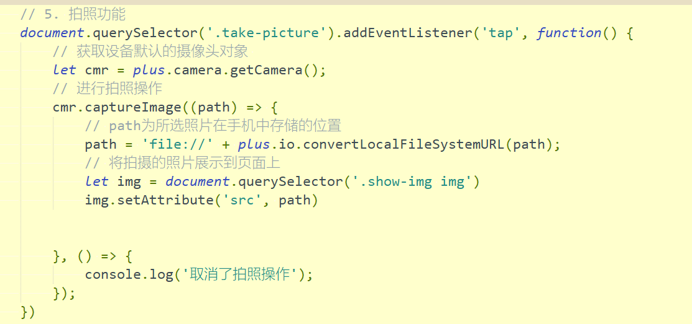


## 3.6 Mui和H5 Plus的学习方式

- 学习方式一：通过**官方文档**查看MUI和H5 Plus相关的API
    - [MUI](http://dev.dcloud.net.cn/mui/ui/)
    - [HTML5 Plus](https://www.html5plus.org/doc/zh_cn/device.html#plus.device.beep)


- 学习方式二：通过**Hbuilder X下载**MUI和H5 Plus的**模板**，来查看**需要引入的组件**和要使用的H5+ API

    - 可以通过真机调试的方式，来预览MUI和H5 Plus**包含的组件库**和**JS功能**

        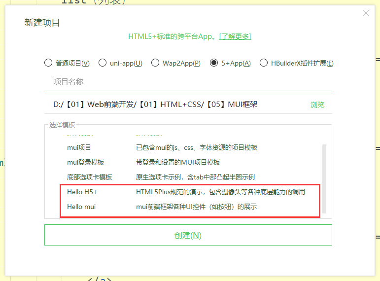

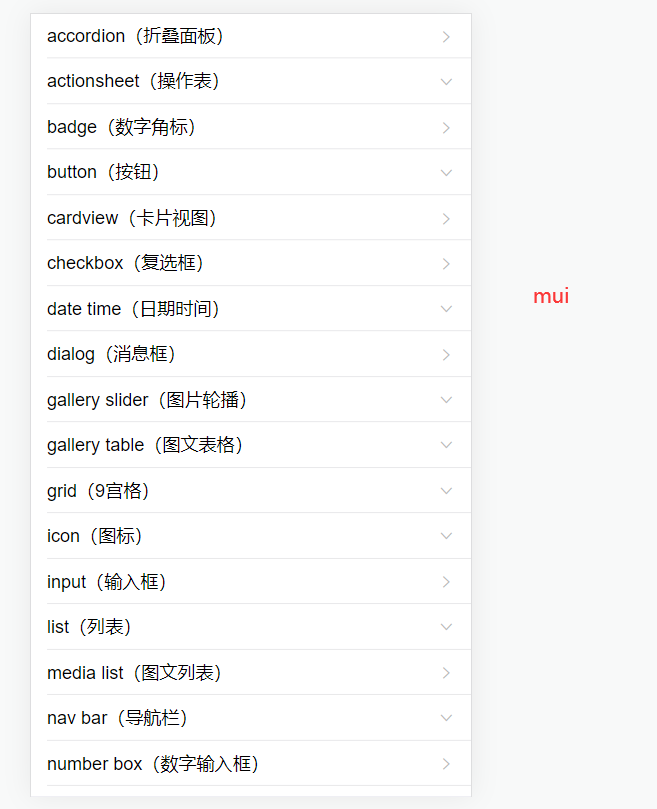


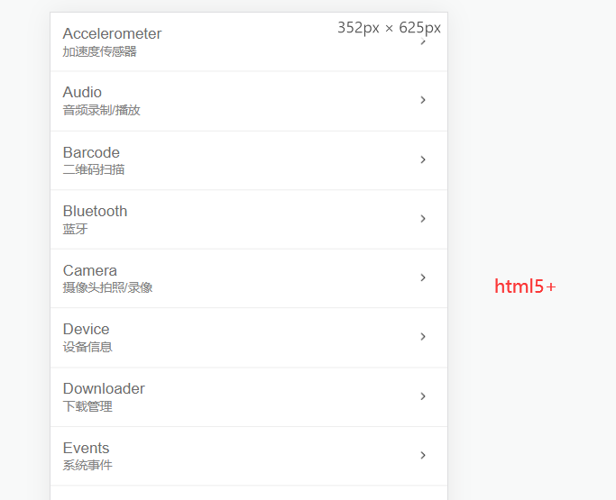


