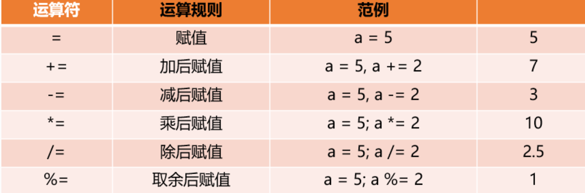
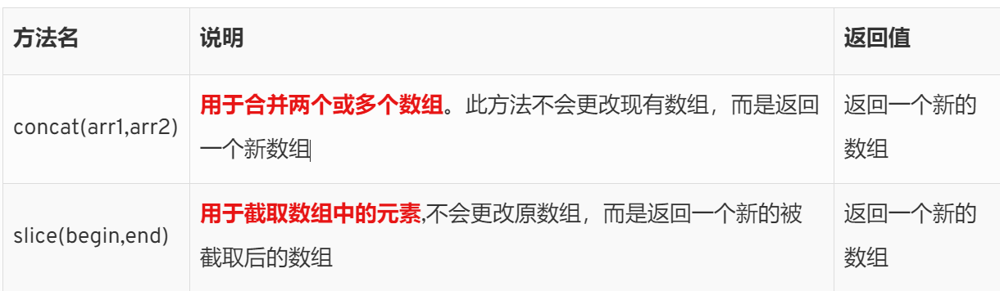

# 一、计算机基础（了解）

## 1.1 编程语言

- ***编程语言指人与计算机之间通讯的语言***，它是人与计算机之间传递信息的媒介。

- **编程语言的种类**非常的多，总的来说可以分成***机器语言，汇编语言和高级语言三大类。***

- 实际上计算机***最终所执行的都是 机器语言***，它是由“0”和“1”组成的二进制数

    

    

## 1.2 汇编语言和高级语言的区别


- 汇编语言和机器语言实质是相同的，***都是直接对硬件操作***

- 高级语言主并不是特指某一种具体的语言，常用的有C语言、C++、Java、C#、Python、PHP、JavaScript

    

    

## 1.3 高级语言

- **高级语言**分为两种：
- ***解释型语言和编译型语言***，他们的区别就在于***翻译代码成二进制的时间点不同***


## 1.4 翻译器

    高级语言所编制的程序不能直接被计算机识别，必须经过转换才能被执行，为此，我们需要一个翻译器。翻译器可以将我们所编写的源代码转换为机器语言，这也被称为二进制化。


## 1.5 编程语言和标记语言区别

- ***编程语言有很强的逻辑和行为能力***。在编程语言里, 你会看到很多 if else 、for 、while等具有逻辑性和行为能力的指令，这是主动的。 

- **标记语言（html）不用于向计算机发出指令**。***标记语言的存在是用来被读取的, 他是被动的。*** 

    

    

## 1.6 数据的存储

- ***计算机内部使用二进制 0 和 1来表示数据。***

- 所有数据，包括文件、图片等最终都是以二进制数据（0 和 1）的形式存放在硬盘中的。

- ***硬盘、内存都是保存的二进制数据***

    

    

## 1.7 程序的运行过程

	1. 打开某个程序时，先从硬盘中把程序的代码加载到内存中
	2. CPU执行内存中的代码
	
	   注意：之所以要内存的一个重要原因，是因为如果只从硬盘中读数据，会浪费cpu性能，所以，才使用存取速度更快的内存来保存运行时的数据。（内存是电，硬盘是机械）


# 二、JavaScript的介绍

## 2.1 什么是JavaScript？

- ***JavaScript是一种运行在客户端的脚本语言 （Script 是脚本的意思）***

- 脚本语言：不需要编译，**运行过程中由 js 解释器( js 引擎） 逐行 来进行解释并执行**

- 现在也可以基于 Node.js 技术进行开发服务器端

    

## 2.2 JavaScript的作用

- J***avaScript的作用是给浏览器指令（命令），负责和浏览器进行沟通的***

- JavaScript目前可以做哪些工作？

    - ***网页的交互***

    - 服务端开发(Node.js)

    - App(React Native)

    - ***小程序开发: HTML(WXML)+CSS(WXSS)+JavaScript***

        

        


## 2.3 浏览器如何执行JS

- ***浏览器分成两部分：渲染引擎和 JS 引擎***

    

- **渲染引擎**:

    - 用来**解析HTML与CSS**，俗称内核，比如chrome浏览器的blink，老版本的webkit

- **JS引擎**:

    - **也称为JS解释器**。用来读取网页中的avaScript代码， 对其处理后运行，比如chrome浏览器的V8

        


- **浏览器本身并不会执行JS代码，而是通过内置 JavaScript 引擎(解释器) 来执行 JS 代码** 。***JS 引擎执行代码时逐行解释每一句源码（转换为机器语言），然后由计算机去执行***，所以 JavaScript 语言归为脚本语言，会逐行解释执行。

    

- JS在浏览器中的**渲染过程**
  
    - 在HTML文件中，通过`script`标签来引入JS文件或编写JS代码，浏览器当解析到有JS代码时，会通过JS引擎来解析


## 2.4 JS 的组成


- ECMAScript

        规定了JS的编程语法和基础核心知识

- DOM——文档对象模型

        文档对象模型（DocumentObject Model，简称DOM），通过 DOM 提供的接口可以对页面上的各种元素进行操作（大小、位置、颜色等）

- BOM——浏览器对象模型  
  
      浏览器对象模型(Browser Object Model，简称BOM) 是指浏览器对象模型，通过BOM可以操作浏览器窗口，比如弹出框、控制浏览器跳转、获取分辨率等。
  
  

## 2.5 JavaScript的编写位置

- 位置一：在script标签中（学习和测试时用）

    ```HTML
    <a href="#">百度一下</a>
    <script>
        alert('我也是一个弹窗')
    </script>
    ```

- 位置二：引入外部的js文件（开发项目时用）

    ```HTML
    <script src="./test.js"></script>
    ```
    
    


- 注意事项：

    - ***在HTML中我们推荐使用双引号, JS 中我们推荐使用单引号***

    - ***script标签在任何情况下都不能写成单标签***

    - script标签中可以省略type属性

    - **推荐将JavaScript代码和编写位置放在body元素的最底部**

    - 引入外部 JS 文件时，script标签里不能写任何东西
    
        
    
        

## 2.6 JavaScript中的注释

- 单行注释

    ```js
    // 我是一个单行注释
    ```

- 多行注释

    ```js
    /* 我是一个多行注释 */
    ```

-  文档注释：用于解析函数的作用

   ```js
    /**
     * 该函数是用于.....
     */
   ```
   

## 2.7 JS与浏览器的交互方式

- 方式一：弹出弹窗显示内容

    - `alert()`：接受一个参数

        

- 方式二：在控制台打印（开发测试时使用最多）

    - `console.log(内容1, 内容2)`

        

- 方式三：DOM（Document Object Model）操作 

    - `通过document.write(写入的内容)`

        

- 方式四：接收用户输入的内容：

    - ```js
        var age = prompt("你多大了")
        console.log(age)
        ```
    
        


# 三、ECMAScript（一）

## 一、变量

### 1.1 什么是变量？

- **变量是用于存放数据的容器**。 我们通过 变量名 获取数据，甚至数据可以修改。 

- **变量是存储在内存中的**

    

- 本质：**变量是在内存中申请的一块用来存放数据的空间**。
  
    - 类似我们酒店的房间，酒店可以看成是内存，酒店里的一个房间就可以看做是一个变量
    
         

### 1.2 使用变量

- 变量的**声明**

    - ```js
        var age  // 声明一个 名称为 age 的变量
        ```

    - var 是一个 JS关键字，用来声明变量( variable 变量的意思 )。**使用该关键字声明变量后，计算机会自动为变量分配内存空间。**

    - age 是程序员定义的变量名，我们要**通过变量名来访问内存中分配的空间**

        

- 变量的**赋值**
  
    - ```js
    age = 18  // 给 age 这个变量赋值为 18  
      ```
    
    - **变量值是程序员保存到变量空间里的值**
    
        


- 同时声明**多个变量并且赋值**

    - ```js
        var name = '张三'， age = 18, sex = '男'
        ```
    
        


### 1.3 变量的更新

- **一个变量被重新复赋值后，它原有的值就会被覆盖**，变量值将以最后一次赋的值为准

    

- 如何让一个变量所对应的空间存储多个数据？

    - 让该变量成为一个对象

    - var obj = {}
    
        
    
        

### 1.4 变量的命名规范

- ***第一个字符必须是一个字母、下划线（ _ ）或一个美元符号（ $ ）***

- 其他字符可以是字母、下划线、美元符号或数字

- ***不能使用关键字和保留字命名***：

    - https://developer.mozilla.org/zh-CN/docs/Web/JavaScript/Reference/Reserved_words

- 变量名必须见名思意

- **遵守驼峰命名法**

    

### 1.5 如何交换两个变量的值

- 方式一：使用**临时变量**

    ```js
    var num1 = 100
    var num2 = 200
    // 临时交换三步曲
    var temp = num1
    num1 = num2
    num2 = temp
    
    console.log('num1:'+num1,'num2:'+num2)
    ```

    

- 方式二：使用**算法**

    ```js
    var num1 = 100
    var num2 = 200
    
    var sum = num1 + num2
    num1 = sum - num1
    num2 = sum - num2
       
    console.log('num1:'+num1,'num2:'+num2)
    ```


## 二、数据类型

### 2.1 数据类型的简介

- 什么是**数据类型**？

   - 在计算机中，不同的数据所需占用的空间是不同的，**根据数据占用空间的不同，于是定义了不同的数据类型。**
   
       
   
- 变量的数据类型

    - 变量是用来存储值的所在处，它们有名字和数据类型。变量的数据类型决定了如何将代表这些值的位存储到计算机的内存中。

        

- **JavaScript 是一种弱类型语言。这意味着不用提前声明变量的类型**，在程序运行过程中，类型才会被自动确定


- 在JS代码运行时，**变量的数据类型是由变量的值来判断 的**


- JS 把数据类型***分为两类***：

  - **基本（简单）数据类型** `（Number,String,Boolean,Undefined,Null）`

  - **复杂（引用）数据类型** `（object)`

    

### 2.2 基本数据类型


#### 数值型（Number）

- JavaScript 数字类型既可以保存整数，也可以保存小数(浮点数）

- ***使用JS进行浮点数字计算，可能得到一个不精确的结果***

- 数值型的特殊值

    - Infinity ，代表无穷大，大于任何数值
      
    - ***NaN ，Not a number，代表一个非数值***
    
        
    
- **isNaN方法用于判断是否不是一个数字**。不是数字返回true，是数字返回false。


#### 字符串型（String）

- ***字符串型的值可以是引号中的任意文本，建议使用单引号来嵌套文本***

- 字符串中的转义字符

    

    

- 获取字符串的长度：***length属性***

- 字符串拼接

    - 多个字符串之间可以使用 + 进行拼接
    
    - **字符串和其他类型拼接：其他类型转成字符串**

    - ***经常会将字符串和变量来拼接***
    
      

#### 布尔型（Boolean）

- 布尔类只有两个值：***true 和 false***

- 布尔型和数字型相加的时候， ***true 的值为 1 ，false 的值为 0***

  

#### 空类型（Null）

- Null类型只有一个值：***null***

- **通常当一个对象（Object类型）不再使用时，可以赋值为null**

- 注意：布尔型与空类型相加时  结果为1或者0

  

#### 未定义型（Undefined）

- Undefined 类型只有一个值：***undefined***

- **声明变量但未对其赋值时**，这个变量的值就是 undefined

- 注意：***布尔型与未定义型相加时  结果为NaN***

- Null和Undefined的关系：

    - undefined值实际上是由null值衍生出来的，所以如果比较undefined和null是否相等，会返回true

    - 但是转化成数字时，undefined为NaN，null为0
    
        

#### 判断变量的数据类型

- ***typeof 可用来获取检测变量的数据类型***

  ```js
  var num = 18;
  console.log(typeof num) // 结果 number      
  ```

  


### 2.3 数据类型的转换

#### 转换为字符串

- toString() 和 String() 使用方式不一样

- 更多使用***第三种转换方式***， 这一种方式也称之为**隐式转换**


####  转换为数字型（重点）

- 隐式转换是我们在进行算数运算的时候，JS 自动转换了数据类型

- 


#### 转换为布尔型

- **代表空、否定的值会被转换为 false**  ，`''、0、NaN、null、undefined  `

- 其余值都会被转换为 true

  ```js
  console.log(Boolean('')); // false
  console.log(Boolean(0)); // false
  console.log(Boolean(NaN)); // false
  console.log(Boolean(null)); // false
  console.log(Boolean(undefined)); // false
  console.log(Boolean('小白')); // true
  console.log(Boolean(12)); // true
  ```


## 三、运算符

### 3.1 算术运算符

- **算术运算符是对数据进行计算的符号**

- 可以直接对数据进行操作, ***也可以操作变量指向的数据***

    

    

- 注意：**自增和自减运算符只能和变量配合使用**

    

- **前置递增**运算符和**后置递增**运算符的区别

    - 前置：先自增，**表达式返回值为自增后的值**

    - 后置：**表达式返回值为原来的值**，然后再自增
    
    - 开发中都是使用**后置递增运算符**
    
      

### 3.2 关系(比较)运算符

- **比较运算符是两个数据进行比较时所使用的运算符**，比较运算后，**会返回一个布尔值 （true / false）作为比较运算的结果**

- 常用在if/while语句中

    


### 3.3 逻辑运算符

- **它是用于将多个条件放在一起进行运算的,运算结果也是Boolean类型: true/false**

- 常用在if/while语句中

    

      

- ***逻辑运算符的返回值***

    - &&:

        - 如果第一个表达式的值为真，则返回表达式2

        - 如果第一个表达式的值为假，则返回表达式1

    - ||:

        - 如果第一个表达式的值为真，则返回表达式1

        - 如果第一个表达式的值为假，则返回表达式2
        
          

- **逻辑与(&&)中断**

    - 常用于判断**数据是否进行过赋值改变**，常用方法为设置**表达式1初始值为undefined**，后期如进行赋值改变有**真实数据存在则会返回表达式2** 

        

- **逻辑或(||)**中断

    - 常用于**判断一个数值存不存在**，不存在的话**返回第二个已存在数据**


### 3.4 赋值运算符

- **赋值运算符主要是给某个变量进行赋值**

    


### 3.5 运算符的优先级


-  ***&& 比 || 优先级高*** 


## 四、流程控制

- 在程序开发中，程序有三种不同的执行方式：

    - 顺序 —— **从上向下，顺序执行代码**

    - 分支 —— **根据条件判断**，决定执行代码的 分支

    - 循环 —— 让 特定代码 **重复 执行**

    

    

### 4.1 分支结构（条件判断）


#### 4.1.1 if语句

- `if`的语法结构

    ```js
    // 条件成立执行代码，否则什么也不做 
    if (条件表达式) {    
        // 条件成立执行的代码语句 
    }
    ```

    

- `if else` 的语法结构

    ```js
    // 条件成立  执行 if 里面代码，否则执行else 里面的代码 
    if (条件表达式) {    
        // [如果] 条件成立执行的代码 
    } else {    
            // [否则] 执行的代码 
    }
    ```

    

- 多分支语句：`if.. else if.. else..`

    - 执行逻辑：如果条件表达式1 满足就执行语句1 ，***执行完毕后会退出整个if分支语句***
    
    - ```js
              // 适合于检查多重条件。 
              if (条件表达式1) {    
                      语句1； 
              } else if (条件表达式2)  {
                     语句2； 
              } else if (条件表达式3)  {
                      语句3； .... 
              } else {    
                      // 上述条件都不成立执行此处代码 
              }
      ```
    
      


#### 4.1.2 三元表达式

- **三元表达式是if else语句的简写，该表达式有返回值**

    

- 语法：`表达式1 ? 表达式2 : 表达式3`

    - 如果表达式1为 true ，则返回表达式2的值，否则返回表达式3的值 

        

- 问题：如果我们不想要表达式3的返回值怎么办？

    - `表达式1 ? 表达式2 : ''`


#### 4.1.3 switch分支语句

- 它是通过判断**表达式的结果是否等于case语句的常量**，来执行**相应的分支体**的

- 与if语句不同的是，switch语句只能做**值的相等判断**（使用全等运算符 ===），而if语句可以做**值的范围判断**

    

    

- ***如果所有的 case 的值都和表达式的值不匹配，则执行 default 里的代码*** 

- 注意： 执行case 里面的语句时，**如果没有break，则继续执行下一个case里面的语句**

    

#### 4.1.4 switch 和 if 的区别 

- `switch...case` 语句**通常处理 case为比较确定值的情况**

- `if…else…`语句更加灵活，**常用于范围判断(大 于、等于某个范围)** 

- switch 语句进行条件判断后直接执行到程序的条件语句，**效率更高**

- if…else 语句有几种条件，就得 判断多少次, **效率更低**

    


### 4.2 循环结构

#### 1. for循环


- 语法结构

    ```js
    for(初始化变量; 条件表达式; 操作表达式 ){
        //循环体
    }
    ```

    - **初始化变量通常会写let i = 0**

    - ***条件表达式***：用于确定每一次循环是否能被执行。**如果结果是 true 就继续循环，否则退出循环**

    - ***操作表达式***：**是每次循环最后执行的代码  通常都是对初始化变量的递增或递减**


- ***执行过程***：

    1. **初始化变量操作在整个 for 循环只会执行一次**

    2. **执行条件表达式**，**如果为true，则执行循环体语句**，否则退出循环，**循环结束**

    3. **执行操作表达式，此时第一轮结束**

    4. **直接去执行条件表达式（不再初始化变量）**，如果为 true ，则去执行循环体语句，否则退出循环。

    5. 重复以上的3 4 步骤

       

- **for循环嵌套**

    - 循环语句可以嵌套任何语句，包括他自身

    - 打印n行n列的星星

        ```js
        var star = '';
        for (var j = 1; j <= n; j++) {
            for (var i = 1; i <= n; i++) {
                star += '☆'
            }
            // 每次满 5个星星 就 加一次换行
            star += '\n'
        }
    console.log(star);
        ```

    - 打印九九乘法表
    
        ```js
        for(var i = 0; i < 9; i++) {
        
            for(var j = 1; j <= i + 1; j++) {
                str += i + 1 + '+' + j + ' = ' + (i + 1) * j + '  '
            }
            str += '\n'
        }
        console.log(str)
        ```
        
        

#### 2. whlie循环

- 基本语法结构

    ```js
    while (条件表达式) {
        // 循环体代码 
    }
    ```

- while只有一个判断条件

    - ***当判断条件为true时，执行循环体***

    - ***当判断条件为flase时，跳出循环体***

        

- 注意：**使用 while 循环时一定要有退出条件，否则会成为死循环**

    

#### 3. 循环的跳转

- `continue` 关键字用于**立即跳出本次循环，继续下一次循环**

- `break`： **直接跳出整个循环, 循环结束**

  

### 4.3 断点调试

- **断点调试可以帮助观察程序的运行过程**，开发中非常的实用
- 注意：**给代码打上断点之后，需要刷新浏览器才能生效**


- 方法一：在浏览器中手动的打断点

- 方式二：***在JS代码中写上debugger，浏览器解析JS时会自动打上断点***


# 四、ECMAScript（二）

## 一、数组

### 1.1 数组的概念

- **数组是指一组数据的集合**，其中的**每个数据**被称作**元素**，在数组中可以**存放任意类型的元素**

    

- **数组是一种将一组数据存储在单个变量名下的优雅方式**

    

- 注意：虽然JavaScript支持在数组中存放不同的数据类型，但是***开发中建议存放相同的类型的数据***

  

### 1.2 创建数组

- 方式一（基本不用）：

    ```js
    var 数组名 = new Array() ； // 使用构造函数来创建一个空的数组，返回的是一个数组对象
    ```

- 方式二：

    ```js
    //1. 使用数组字面量方式创建空的数组
    var  数组名 = []；
    
    //2. 使用数组字面量方式创建带初始值的数组
    var  数组名 = ['小白','小黑','大黄','瑞奇'];
    ```

      


### 1.3 获取数组中的元素

```js
// 定义数组
var arrStus = [1,2,3]

// 获取数组中的第2个元素
alert(arrStus[1]); 
```


- ***数组可以通过索引来访问、修改对应的数组元素***

    - **索引值是从0开始的**（注意，不是从1开始的）

- 注意：如果访问时数组没有和索引值对应的元素，***则得到的值是undefined***

    

- 如何获取数组中的最后一个元素？

    ```js
    var last = arr[arr.length - 1]
    ```


### 1.4 遍历(迭代)数组

- 可以通过 for 循环遍历数组中的每一项元素

- ***数组有一个length属性，length属性可以获取数组的长度***

    - **数组的长度取决于数组中有多少个元素**

    -       ```js
            var arrStus = [1,2,3];
            alert(arrStus.length);  // 获取数组的长度
            ```
            

- 遍历数组

    ```js
    var arr = ['red','green', 'blue'];
    
    for(var i = 0; i < arr.length; i++){
        console.log(arrStus[i]);
    }
    ```
    
    

### 1.5 数组相关的方法

#### 1.5.1 检测是否为数组

- ***`instanceof 运算符`，可以判断一个对象是否属于某种类型*** 

- ***`Array.isArray()`用于判断一个对象是否为数组***，返回一个布尔值

    ```js
    console.log(arr instanceof Array) // true
    console.log(arr instanceof Object) // true
    console.log(obj instanceof Array) // false
    console.log(obj instanceof Object) // true
    ```

    


- 注意：**数组属于对象类型，但是对象不属于数组类型**

    

#### 1.5.2 增删数组元素的方法


  

  									


- `splice()`：可以对数组进行增删改操作，会**修改原数组**，并以数组形式**返回被修改的内容**。

    - **第一个参数为从数组的第几个元素开始操作**，***不包括本身***

        

- `splice(begin, end)`删除元素：第二个参数传入你要删除几个元素

  - ```js
arr.splice(1, 2)
    ```

- `splice(begin)`替换元素：第二个参数表示我们要替换几个元素,后面是用于替换前面的元素

  - ```js
    arr.splice(1, 2, '张三', '老王')
    ```

- `splice(begin)`添加元素：第二参数插入0，并且后面跟上要插入的元素

  - ```js
    arr.splice(1, 0, '1111111')
    ```

    

- **根据数组索引删除数组中指定的元素**

    - ```js
        arr.splice(index, 1)
        ```

        


#### 1.5.3 数组排序的方法


- ***sort() 方法不是很精确***，具体到 MDN官网上查看

  

#### 1.5.4 查找数组索引方法


- **第一个参数是要查找的内容***

- **第二个参数是指定从哪开始查找（根据索引）**，***如果找不到内容 返回值是 -1***

  

#### 1.5.5. 数组转换成字符串方法

- ​	`arr.toString()`

    - 把数组转换为字符串，并且每一项以逗号分割

    - 返回值是一个字符串

    - ```js
        let arr = ['张三', '李四', '王五']
        let str = arr.toString() // '张三,李四,王五'
        ```

        

- `arr.join('分隔符')`

    - 把数组转换为字符串，并且每一项以传入的参数来分割

    - 返回值是一个字符串
    
    - ```js
        let arr = ['张三', '李四', '王五']
        let str2 = arr.join('-') '张三-李四-王五'
        ```
    
        

#### 1.5.6. 性能优化

- 问题：数组有一些方法是返回原来的数组，有些方法返回的是新的数组，他们有什么区别呢？

    - ***返回原来的数组 就代表着不会开辟一个新的内存空间 用来存放数据，节约内存空间，性能更优***

    - 返回一个新的数组，就代表着会在内存中开辟一个新的空间用来存放数据，***占用内存空间资源，性能较低***


### 1.6 数组的练习

- **反向遍历数组**里面的每一个元素

    ```js
    for(var i = arr.length - 1; i >= 0; i--) {
      console.log(arr[i])
    }
    ```

- 将数组中所有的元素用-进行分割，拼接成一个字符串

    ```js
    var arr = ['hello','pink','red','blue','black']
    var str = ''
    for(var i=0; i <arr.length; i++) {
      str += arr[i] + '-'
    }
    ```

- 从一个数组中，**找出**里面的**最大值**

    ```js
    var arr = [1,12,864121,841,2,3,4,5,231,546412]
    var max = arr[0]
    
    for (var i = 0; i < arr.length; i++) {
        max = arr[i] > max ? arr[i] : max
    }
    ```

- **反转一个数组中的内容**

    ```js
    for(var i = 0; i <arr.length / 2; i++) {
        var temp = arr[i]
        arr[i] = arr[arr.length - 1 -i]
        arr[arr.length - 1 - i] = temp
    }
    console.log(arr)
    ```

    - 原理

        ```js
        var temp = arr[0]
        arr[0] = arr[arr.length - 1]
    arr[arr.length - 1] = temp
        ```
        
        
        ```js
        var temp = arr[1]
        arr[1] = arr[arr.length - 2]
        arr[arr.length - 2] = temp
        ```
        
        

- **冒泡排序**：将最大的数字放到后面

    ```js
    for (var i = 0; i < arr.length - 1; i++) { 
      
        for (var j = 0; j < arr.length - i - 1; j++) { 
            if (arr[j] > arr[j + 1]) { 
                var temp = arr[j]; 
                arr[j] = arr[j + 1]; 
                arr[j + 1] = temp; 
            } 
        } 
    } 
    ```

- 数组去重

    ```js
    // 封装一个 数组去重的函数 ,返回一个新的数组
    function unique(arr) {
        var newArr = []
        for(var i = 0; i<arr.length; i++) {
            if (newArr.indexOf(arr[i]) === -1) { // 判断新的数组中是否有旧数组的内容，如果没有则添加
                newArr.push(arr[i])
            }
        }
        return newArr
    }
    console.log(unique([1,51,231,561,2,2,1,3,3,51]))
    ```


## 二、函数


- **函数其实就是某段代码的封装, 这段代码帮助我们完成某一个功能**

- 在开发程序时，使用函数可以提高编写的效率以及代码的 重用

    

### 2.1 函数的使用

1. 声明一个函数

   ```js
    function 函数名() { 
        //函数体代码 
    }
   ```

    - `function` 是声明函数的关键字,必须小写

    - 声明函数并不会执行代码，***只有调用函数时才会执行函数体代码***

       

2. 调用函数 

   ```js
    函数名(); // 通过调用函数名来执行函数体代码
    函数名.call()   // JS高级篇里会讲call方法的具体使用
   ```
   
   

- 函数的**执行顺序**

  1. 调用函数后会执行函数体中的代码

  2. 逐行执行函数体中的代码，直到遇到return

  3. **如果有return则结束执行，并且将return后的值 作为函数的返回值**

  4. 如果没有return，则一直执行函数体中的代码，直到结束

     

  

  


### 2.2 函数的参数

- 函数参数的作用：

    - 函数：把 具有独立功能的代码块 组织为一个小模块，在需要的时候 调用

    - 函数的参数：***增加函数的 通用性，针对 相同的数据处理逻辑，能够 适应更多的数据***


- **形参**：定义 函数时，小括号中的参数，是用来接收参数用的，***在函数内部 作为变量使用***

- **实参**：调用 函数时，小括号中的参数，***是用来赋值给形参的***

- 
    ```js
    // 带参数的函数声明 
    function 函数名(形参1, 形参2 , 形参3...) { 
        // 函数体 
    } 
    
    // 带参数的函数调用 
函数名(实参1, 实参2, 实参3...); 
    ```
    
- 函数形参和实参个数不匹配问题

    
    
    

### 2.3 函数的返回值

- `return 关键字`

    - ***函数中可以使用 return 关键字 来返回该函数的结果***

    - return后的值将会作为函数的执行结果

    - 在函数中 ***return之后的语句都不会被执行***

    - 函数的返回值可以是任意类型（包括函数、数组、对象类型）

    - 如果函数中没有使用 return语句 ，***那么函数有默认的返回值：undefined***

        

- 
    ```js
    // 声明函数 
    function 函数名（）{
         ... return  需要返回的值； 
    } 
    
    // 调用函数 
    let res = 函数名();    // 此时调用函数则返回值是函数体内return 后面的值
    ```


-  break 、continue 、return 的区别

    - break ：结束当前的循环体

    - continue ：跳出本次循环，继续执行下次循环

    - return ：***不仅可以退出循环，同时还可以结束当前的函数体代码***，**return 语句后的值将会作为函数的返回值**


- ***return的妙用***：在***if 或for语句中使用return*** ，可以立即**结束当前的函数体**代码
    - 关键记住：***return用于阻止程序向下运行***


>注：**return关键字**只能在**函数体**中使用
>


### 2.4 arguments的使用

- 什么是 arguments ？

    - ***arguments 是当前函数体中的一个内置对象***，arguments 中***存储了所有传递的实参***

    - **arguments是一个伪数组**

    - ***可以通过arguments去获取所有传递过来的实参***
    
    - ```js
        function bar() {
        		console.log(arguments);  // [1, 2], 
        }
        bar(1, 2)
        ```
    
        


- 什么是**伪数组**？

    - 具有数组的 **length 属性**
    
    - 按照索引的方式进行存储
      
    - ***但是没有真正数组的一些方法  比如：pop() 、push() 等等***
    
        
    
- 常见的伪数组
  - 函数内部的`arguments`
  - DOM对象列表
  - jQuery对象(`$("div")`)


### 2.5 函数的封装案例

- 实现一个加法计算器

```js
 function add(num1, num2) {
   return num1 + num2
 }
 var result = add(50,60)
 console.log(result)
```
- 定义一个函数，传入n（n为正整数），计算1~n数字的和


```js
    function sum(n) {
      var total = 0
      for(var i = 1; i <= n; i++) {
         total += i
      }
      return total
    }
    
    var result = sum(100)
    console.log(result)
```

- 传入一个数组，对数组进行翻转

```js
 function reveral(arr) {
     for(var i = 0; i < arr.length / 2; i++) {
         var temp = arr[i]
         arr[i] = arr[arr.length - 1 - i]
         arr[arr.length - 1 - i] = temp
     }
     return arr
 }
 
 var result = reveral([1,2,3,4,5,7,8,5,2,5,5])
 console.log(result)
```
- 封装一个数组冒泡排序的函数

```js
 function sort(arr) {

   for (let index = 0; index < arr.length - 1; index++) {

     for (let j = 0; j < arr.length - 1 - index; j++) {
       if (arr[j] >arr[j + 1]) {
         var temp = arr[j]
         arr[j] = arr[j + 1]
         arr[j + 1] = temp
       }
     }
   }
   console.log(arr)
 }
 sort([52, 564, 123, 8541, 123])
 sort([9,8,8,1,1,2,56,1231,561,44])
```


### 2.6 函数的声明方式

- **命名函数**（使用最多）

    ```js
    function 函数名() { 
        //函数体代码 
    }
    ```


- **匿名函数表达式**

    ```js
    var 函数名 = function(){
        函数封装的代码
        ……
    }
    ```

    

- ***每个函数都有一个name属性，该属性可以查看当前函数的名字***

  - ```js
  function bar() {}
    console.log(bar.name);  // bar
    ```
    
    
  
    

### 2.7 立即执行函数

- 什么是**立即执行函数**？

  - **不需要调用，立马能够执行的函数**，在页面加载完成之前，就会执行的函数

- 写法：

  - ```js
    // 写法一：（常用）        
    	;(function () {
            alert(1)
         })(name)
    
    // 写法二：      
    	;(function () {
            alert(1)
         }())
    ```

  - 注意：写立即执行函数时，**需要在最外层加一个分号**

  

- 立即执行函数的作用：

  - **独立创建了一个作用域**(函数作用域)，避免了命名冲突的问题

      
  
  

## 三、作用域和预解析

### 3.1 作用域概述

- 在ES6之前没有**块级作用域**的概念，只有**全局作用域**和**局部作用域**的概念

    

- 全局作用域：***整个script标签***

- 局部作用域：***在函数内部中就是局部作用域***

  

### 3.2 变量的作用域

- **变量在哪一个范围内可以被使用，这个范围就称为变量的作用域**

- 根据作用域的不同，我们将变量分为**全局变量**和**局部变量**

    

- 什么是全局变量和局部变量？

    - **定义在script标签中的变量**，被称之为全局变量
- **定义在函数内部的变量**，被称之为局部变量
  
    - ```js
        var num = 10 // num是全局变量
        
        function fn() {
            var num = 20 // num是局部变量
            console.log(num) //20
        }
        ```

- 在函数内部，如果变量没有用var等关键字声明，则会变为全局变量

    - ```js
        function bar() {
          a = 10
        }
        bar()
        console.log(a); // 10
        ```

        

- 全局变量和局部变量的**区别**

    - 全局变量只有浏览器关闭的时候才会销毁，***占用内存空间***

    - 局部变量在函数执行完毕后就会销毁，***节约内存资源***
    
      
      
      

### 3.3 作用域链

- **在局部作用域中可以访问全局作用域的变量，但是在全局作用域中访问不到局部作用域的变量**

- 当在函数作用域中操作一个变量时，***他会先在自身作用域中寻找***，如果没有则去上一级寻找，我们将这种行为称为链式查找

- **想要在函数作用域中访问全局变量 可以用windom对象**，因为所有的全局变量是存储在window对象的属性下

  
  
  

### 3.4 预解析

- js引擎运行js 分为两步：  ①**预解析** 、②**代码执行**

    - 预解析：**在当前作用域下, JS 代码执行之前，浏览器会默认把带有 var 和 function 声明的变量提前声明**

    - 代码执行：按照代码书写的顺序**从上往下执行**

      

- 预解析分为：变量预解析（**变量提升**） 和 函数预解析（**函数提升**）

    - 变量提升： ***使用var声明的变量会被提升到当前作用域的最上面***，变量的赋值不会提升。
    - 函数提升：***函数的声明会被提升到当前作用域的最上面***，但是不会调用函数
    - 注：只有通过`Function`声明的**函数**才会被**提升**，**函数提升优先于变量提升**

- 代码分析：
    - ```js
      f1();
      function f1(){
          console.log(a)
          var a = 10
      }
      
      //上面的JS代码预解析之后是这样的：
      function f1(){
          var a
          console.log(a) //undefind
          a = 10
      }
      f1();
      ```

      

- **函数提升优先于变量提升** ，如果使用**var声明变量时没有赋值**，***则该变量默认值为undefined***

- 如果使用**var声明变量时没有赋值**，并且声明的变量在之前已经被使用过了，那么此时通过var声明的变量的值就是上一个标识符的值

    - ```js
        function bar() {}
        var bar;
        console.log(bar);  // function
        ```

        

### 3.5 预解析代码分析

- ```js
  console.log(a);
  var a = 10
  function a() {}
  
  //此时代码预解析后是这样的：
  function a() {}
  var a;   // 虽然使用var声明了变量，但是没有赋值，因此此时的a是上一个标识符的值
  console.log(a); // function
  a = 10
  ```

  

- ```js
    var bar = 10
    function bar() {
      bar = 20
      console.log(bar);  // bar is not a function
    }
    bar()
    
    // 实际的执行机制
    function bar() {
      bar = 20
      console.log(bar);
    }
    var bar // 这里的bar 其实是bar函数
    bar = 10  // bar被重新赋值
    bar() // 此时的bar不是一个函数 所以会报错
    ```

    

- ```js
     function bar() {
      return foo
      foo = 10
      function foo () {}
      var foo = 'll'
      }
    console.log(typeof bar())
    
      
    //此时的代码处理方式其实是这样的：
    function bar() {
      function foo() {}
      var foo  // foo是function
      return foo
      foo = 10
      foo = 'li'
    }
    console.log(typeof bar()); // function
    ```

    


​      


## 四、对象

### 4.1 对象的概述

- ***对象是一种复合值***：它将很多值聚合在一起，**可通过名字访问这些值**

- **对象是由属性和方法组成的**

    

- 对象和数组的区别

    - **创建方法不同**，数组用 `[]`, 对象用 `{}`

    - **对象没有长度，数组有长度**

    - 访问数据方法不同  

        - 数组：通过下标访问  

        - 对象：通过属性名/方法名访问
        
          

- 变量、属性、函数、方法的区别

  - 变量和属性的相同点：***都是用来存储数据的***

    - 变量：单独声明赋值，单独存在

    - 属性：**对象里面的变量称为属性**，不需要声明，用来描述该对象的特征

        

  - 函数和方法的相同点：***都是实现某种功能***
  
    - 函数：单独存在的，***通过“函数名()”的方式就可以调用***
    - 方法：***对象里面的函数称为方法***，使用“***对象.方法名()”的方式就可以调***用


### 4.2 对象的创建

#### 4.2.1 字面量创建对象

- 对象字面量：就是花括号 { } 里面包含了表达这个具体事物（对象）的属性和方法

    - `{键:值, 键:值 }` ***里面采取键值对的形式表示***

    - 键：***相当于属性名***

    - 值：相***当于属性值，可以是任意类型的值***（数字类型、字符串类型、布尔类型，函数类型等）

    - ***多个属性或者方法中间使用逗号隔开***

    - 当属性值为**匿名函数类型**时，其**对应的属性就称为做方法**

        ```js
        var star = {
            name : 'pink',
            age : 18, 
            sex : '男', 
            sayHi : function(){ // sayHi 是star对象下的方法
                alert('大家好啊~') 
            }
        }
        ```
        
        


- 访问对象中的属性值 

    - 方法一：`对象.属性名 `

    - 方法二：`对象['属性名']`  , **[ ]里面可以跟一个变量**

    - **如果属性名是一个变量，就必须使用方法二**


- 调用对象中的方法

    - `对象.方法名()` ，注意这个方法名字后面一定加括号
    
      

#### 4.2.2 new Object

- 通过`new Object`来创建对象

    - ```js
        var andy = new Obect(); // 创建了一个空的对象
        andy.name = 'pink';
        andy.sayHi = function(){ alert('大家好啊~'); }
        ```

        

- 以`new Object`形式创建的对象添加其属性和方法格式：
  
    - `对象.属性名 =  属性值;`


#### 4.2.3 构造函数创建对象

- 什么是**构造函数**？
  
- 构造函数 **是一种特殊的函数，主要用来初始化对象**
  
- 构造函数的一些**概念**

    - 使用构造函数**创建对象的过程**，称为**对象的实例化**或者**实例化对象**
    - 使用构造函数**创建的对象**，一般都称为**实例对象**

    

- 使用构造函数创建对象的**步骤**如下

    - ```js
        function 构造函数名(属性值1，属性值2，属性值3....) {
            this.属性名 = 属性值
        }
        
        var obj = new 构造函数名(属性值1，属性值2，属性值3....)
        ```

        

- 构造函数的注意事项：

    - **构造函数名约定首字母大写**

    -  当使用构造函数创建对象的时候，必须***用 new关键字 来调用构造函数***

    - 构造函数的**this指向**的是通过**构造函数创建的对象**

        
    


- **构造函数**和**普通函数**的区别：

    - **构造函数用于封装对象，普通函数用于封装功能性代码**

      

- 调用构造函数时的**执行流程**

    1. 在堆空间中**开辟了一个空间用于存放创建的空对象**

    2. **让 this 指向这个新的对象**

    3. 执行构造函数里面的代码，**给这个新对象添加属性和方法**

    4. **返回这个新对象**（所以构造函数里面不需要return）


### 4.3 遍历对象

- `for in`

    - ```js
        for (var a in obj) {
            // a 是所遍历对象的 属性名
            console.log(obj[a]) // 因为a是一个变量，如果必须要用[]方法来访问对象的属性值
        }
        ```

        

### 4.4 删除对象的属性

- `delete Object.xxx`

    - ```js
        var obj = {name: '张三', age: 18}
        delete obj.age  // 删除了obj对象上的age属性
        ```

        


## 五、内置对象

### 5.1 内置对象的概述

- JavaScript 中的对象分为3种：***自定义对象*** 、***内置对象***、 ***浏览器对象*** 

- ***自定义对象*** 、***内置对象***是 JS 的基础内容，属于 **ECMAScript**

- ***浏览器对象（DOM + BOM）***是**JS代码运行在浏览器**时才有的

    

- ***内置对象***就是指 **JS 语言自带的一些对象**，这些对象供开发者使用，并提供了一些常用的功能（属性和方法） 

    

### 5.2 Math对象

- `Math` 对象不是构造函数，***它具有数学常数和函数的属性和方法***

    - `Math.PI`   圆周率 

    - `Math.floor()`   向下取整 

    - `Math.ceil()`  向上取整 

    - `Math.round()`   四舍五入 就近取整   注意 -3.5   结果是：-3  

    - `Math.abs()`  绝对值 

    - `Math.max()/Math.min()` 求最大和最小值 

      

-  `Math.random() `：获取0到1之间的随机小数，包括0，但不包括1

    

- **具体使用方法到 MDN 网站上查**

    

### 5.3 日期对象

- ***Date是一个构造函数***，需要实例化后才能使用，***返回的是一个日期对象***

-  `new Date()`不带参数

    - ```js
        let now = new Date()
        now // Tue Oct 27 2020 15:30:41 GMT+0800 (中国标准时间)
        ```

-  `new Date()`传递参数

    - ```js
        let now = new Date('2018-01-09 08:45:31')
        console.log(now); // Tue Jan 09 2018 08:45:31 GMT+0800 (中国标准时间)
        ```

        

- **日期对象**里的方法


- 什么是**时间戳**？

    - 从**1970年1月1日**到**目前时间**的**毫秒数**称为`时间戳`

        

- 如何将**当前时间转换为时间戳**？

    - ```js
        // 方法一
        var now = + new Date(); 
        // 方法二
        var now = Number(new Date())
        ```

        


### 5.4 字符串对象

#### 5.4.1 基本包装类型

- 问题：为什么字符串类型可以使用属性和方法？
    - 原因：JS引擎在运行js文件时，***会将基本数据类型包装成复杂数据类型（object）***


-       ```js
        // 1. 生成临时变量，把简单类型包装为复杂数据类型 
        var temp = new String('andy')
        // 2. 赋值给我们声明的字符变量 
        str = temp; 
        // 3. 销毁临时变量 
        temp = null
        ```
        
        


#### 5.4.2 字符串的不可变性

- 每次给***字符串重新赋值***，都会***重新开辟一个新的内存空间***

  

#### 5.4.3 字符串相关方法


 


  - `str.replace(被替换的字符串， 要替换为的字符串)`

    

  - `str.split(分隔符)`

    - **可以将字符串转换为数组**，以传入的参数来进行分割，如果字符串为空，那么默认会返回一个长度为1的数组

    - ```js
        let str = '1-2-3'
        let arr = str.split('-')
        console.log(arr);  // ["1", "2", "3"]
        ```

        

  - `str.trim()   `

       -       该方法会从一个字符串的**两端删除空白字符**
       -       **返回的是一个新的字符串**。

- `str.match(匹配规则)`
  
    - 传入一个正则表达式对象，会返回一个数组，数组中的元素是字符串匹配正则表达式之后的值


### 5.5 案列

- 封装一个数学对象

    - ```js
            var myMath = {
                PI: 3.1415926,
                max: function () {
                    var max = arguments[0]
                    for(var i = 0; i < arguments.length; i++) {
                        max = arguments[i] > max ? arguments[i] : max
                    } 
                    return max
                },
                min: function () {
                    var min = arguments[0]
                    for(var i = 0; i < arguments.length; i++) {
                        min = arguments[i] < min ? arguments[i] : min
                    } 
                    return min
                }
            }
        
            console.log(myMath.PI)
            console.log(myMath.max(50,10,80,10,80,500))
            console.log(myMath.min(50,10,80,10,80,500))
        ```

        

- 封装一个获取随机整数的方法

    - ```js
        function getRandom(min, max) {
            min = Math.ceil(min);
            max = Math.floor(max);
        		// 含最大值，含最小值 
            return Math.floor(Math.random() * (max - min + 1)) + min; 
        }
        ```

        

- 猜数字游戏

    - ```js
        function getRandom(min, max) {
            min = Math.ceil(min);
            max = Math.floor(max);
          	//含最大值，含最小值 
            return Math.floor(Math.random() * (max - min + 1)) + min; 
        }
        
        var random = getRandom(1,10)
        var count = 0
        
        while(count < 3) {
            var number = prompt('请输入一个数字')
            
            if (number > random) {
                alert('数字大了')
            } else if (number < random) {
                alert('数字小了')
            } else if (number == random) {
                alert('猜对了！')
                break
            }
            count ++
        } 
        alert('你输了')
        ```

        

- 输出当前时间

    - ```js
        // 封装一个函数获取当前的时间
        function getNowTime() {
            var date = new Date() // 
            var year = date.getFullYear() // 年
            var month = date.getMonth() + 1 // 月
            var d = date.getDate() // 日
            var day = date.getDay() // 星期
        
            var hour = date.getHours() // 时
            hour = hour < 10 ? '0' + hour : hour
            var mintu = date.getMinutes() // 分
            mintu = mintu < 10 ? '0' + mintu : mintu
            var second = date.getSeconds() // 秒
            second = second < 10 ? '0' + second : second
        
            var arr = ['星期日','星期一','星期二','星期三','星期四','星期五','星期六']
        
            var time = '当前时间是:' + year + '-' + month + '-' + d + ' ' + ' ' + arr[day] + ' ' + hour + ':'+ mintu + ':'+ second
        
            return time
        }
        
        console.log(getNowTime())
        ```

        

- 倒计时效果

    - ```js
        /*
            通过用户输入的时间和当前的时间进行相减，利用时间差来获取倒计时的时间
            利用时间戳，将剩余的毫秒数转换为 天/时/分/秒
            转换公式：
                d = parseInt(总秒数/ 60/60 /24);   //   计算天数 
                h = parseInt(总秒数/ 60/60 %24)    //   计算小时 
                m = parseInt(总秒数 /60 %60 );     //   计算分数 
                s = parseInt(总秒数%60);           //   计算当前秒数  
            */
        
        function countDown(endTime) {
        
            var nowTime = + new Date() // 返回当前时间的时间戳
            var times = + new Date(endTime) // 返回用户输入的时间的时间戳
            var downTime = (times - nowTime) / 1000 // 将剩余的毫秒数转换为秒
        
            // 将剩余的秒速转换为 天/时/分/秒
            d = parseInt(downTime / 60/ 60 / 24);   // 计算天数 
            d = d >= 10 ? d : '0' + d
        
            h = parseInt(downTime / 60 / 60 % 24)    // 计算小时 
            h = h >= 10 ? h : '0' + h
        
            m = parseInt(downTime / 60 % 60 );     // 计算分数 
            m = m >= 10 ? m : '0' + m
        
            s = parseInt(downTime % 60);           // 计算当前秒数  
            s = s >= 10 ? s : '0' + s
        
            var down = d + '天' + h + ':' + m + ':' + s
            return down
        }
        
        setInterval(() => {
            document.write(countDown('2020/5/31 13:0:0'))
        },1000)
        
        console.log(new Date())
        ```

        


- 返回字符位置

    - ```js
        // 查找字符串"abcoefoxyozzopp"中所有o出现的位置以及次数 
        
        var str = 'abcoefoxyozzopp'
        var count = 0
        var index = str.indexOf('o') // 获取第一次查找的索引
        
        while(index !== -1) { 
            console.log(index) 
            index = str.indexOf('o',index + 1)  
            count ++
        }
        
        console.log('o出现的次数是' + count);
        ```

        

- 返回字符位置 (2)

    - ```js
        //判断一个字符串 'abcoefoxyozzopp' 中出现次数最多的字符，并统计其次数
        
        var newStr = 'abcoefoxyozzopp'
        var obj = {}
        for(var i = 0; i < newStr.length; i++) {
            var char = newStr.charAt(i) //遍历字符串的每一个字符
        
            if (obj[char]) { // 判断对象中是否有属性，如果有就 + 1
                obj[char]++
            } else {
                obj[char] = 1 
            }
        }
        // 遍历对象 判断哪个字符出现的次数最多
        var max = 0
        var maxName = ''
        for(var k in obj) {
            if (obj[k] > max) {
                max = obj[k]
                maxName = k
            }
        }
        console.log(maxName + '出现的次数最多，他的出现次数是' + max)
        ```

        


## 六、简单类型与复杂类型

### 6.1 简单和复杂类型的概述

- **简单类型**又叫做**基本数据类型**或者**值类型**，**复杂类型**又叫做**引用类型**

    

- 值类型：**在存储时变量中存储的是值本身**，因此叫做值类型 

    - `string ，number，boolean，undefined，null` 这些数据类型也称为**值类型**

        

- 引用类型：在存储时变**量中存储的是内存地址**

    - `Object、Array、Function`这些数据类型也称为引用类型
    
        

### 6.2 堆和栈空间


- 栈空间：**简单数据类型存放到栈空间里面**，会直接开辟一个空间用来存放数据 

- 堆空间：存储**复杂类型**，***首先在栈空间里面存放十六进制的内存地址*** ，  然后这个***地址指向堆空间里面的数据***

  
  
  

### 6.3 数据类型的传参

- 传递**简单数据类型**的参数

  - 函数的**形参也可以看做是一个变量**，当我们把一个**值类型变量作为参数传给函数的形参**时，其实是把变量在栈 空间里的**值复制了一份给形参**

  - ```js
    function fn(a) { 
        a++; 
        console.log(a); // 11
    } 
    var x = 10; 
    fn(x); 
    console.log(x) // 10
    ```

    
    
    
    
    

- 传递**复杂数据类型**的参数

  - 函数的形参也可以看做是一个变量，**当把引用类型变量传给形参时**，**其实是把变量在栈空间里保存的堆地址复制给了形参**，形参和实参其实保存的是同一个堆地址，所以操作的是同一个对象

  - ```js
    let p = { name: '刘德华' }
    function f1(x) { // x = p 
      console.log(x.name); // 刘德华    
      x.name = "张学友";
      console.log(x.name); // 张学友   
    }
    console.log(p.name);    // 刘德华  
    f1(p);
    console.log(p.name);    // 张学友 
    ```
    
  - 
  

  
  

# 细节补充

## 1. 标识符

- 什么是标识符？

    - 标识符：就是指开发人员为**变量、属性、函数、参数取的名字。**

        

- 标识符的命名规范：

    - **不能是关键字或保留字**
    
    - 参考：`变量命名规范`
    
      
    
- 标识符的***值***：

    - 使用***var定义的标识符***，***初始值是undefined***
    - ***如果前面已经有该标识符的值***，***那么初始值是前面那个标识符的值***

    - ```js
      function a() {}
      var a
      console.log(a)  // function
      ```

      


## 2. 表达式和返回值

- 什么是表达式？
    - 表达式**属于短语**。表达式由**一个或多个运算符、操作数组成的运算式**。
    - 表达式的功能是执行计算，并返回一个值

- 常见的表达式：

    - 三元表达式：`表达式1 ? 表达式2 : 表达式3`

    - &&表达式： `表达式1 && 表达式2`

    - ||表达式： `表达式1 || 表达式2`

        

- **表达式终都会有一个结果，返回给开发者，我们称为返回值**

  

## 3. JS代码规范

- 在运算符的左右两侧各保留一个空格

        var a = 123
    
- JS 单行注释前面注意有个空格


- ***逗号与分号的后面 ，需要跟一个空格***

        var obj = { name: '张三' } 
    
- **无分号JS代码风格**
  
    - *当一行代码是以：* `(、[`开头的时候，则在前面补上一个分号`;`避免语法错误

- 更多JS代码规范：https://www.runoob.com/js/js-conventions.html


## 4. 查文档

- 在学习JS时，我们可以通过查阅文档的形式，查看一些API的功能以及使用说明
  
- MDN:   https://developer.mozilla.org/zh-CN/ 
  
- 查阅官方文档步骤：

    1. 查阅该方法的功能 

    2. 查看里面**参数**的意义和类型 

    3. 查看**返回值**的意义和类型 

    4. 查看描述相关***（是否构造函数）***

    5. 通过 demo 进行测试
    
      

- MDN中方法里的**参数分析**

  - ```js
    arr.forEach(callback(currentValue [, index [, array]])[, thisArg])
    ```

  - 如上图代码所示，形参**有加 [ ] 的代表可写可不写**，**如果没有中括号，则表示必须写**

 


## 6. 判断数据类型为空

- 判断一个字符串是否为空

  - ```js
    str === ''  // true  str字符串为空
    ```


- 判断对象是否为空

  - ```js
    JSON.stringify(obj) === '{}'  // 为true时  obj对象为空
    ```

    


## 7. 格式化数值类型

- `Number.toFixed(digits)` 方法用来格式化一个数值。

    - ***digits***：小数点后数字的个数；介于 0 到 20 （包括）之间。
      
    - ```js
        let number = 10
        number.toFixed(2)  // 10.00
        number.toFixed(4)  // 10.0000
        ```

        


