# 一、H5新增API

## 1.1 H5和HTML5

- **HTML5**和**H5**的区别？

    - `HTML5`：当前最新版本的**超文本标记语言**

    - `H5`：**一套技术的简称**，包含了 HTML5、CSS3、JavaScript等一系列的技术。

    - 跳出程序员的世界，大部分人眼中的**H5**，大概率是说的是**基于HTML5**制作的网页

## 1.2 媒体元素的相关API

### JS相关属性

- `video`和`audio`元素**共同**的JS属性：

    - `ele.duration `   :  媒体总时间(只读)，单位为s
    - `ele.currentTime = number` :  开始播放到现在所用的时间(可读写)，单位为s
    - `ele.muted = bool` :  是否静音(可读写,相比于volume优先级要高)
    - `ele.volume = number` :  0.0-1.0的音量相对值(可读写)
    - `ele.paused` :  媒体是否暂停(只读)
    - `ele.ended  ` :  媒体是否播放完毕(只读)

    >注：媒体元素内的**数据源是异步加载**的，因此要注意获取媒体数据的时机

    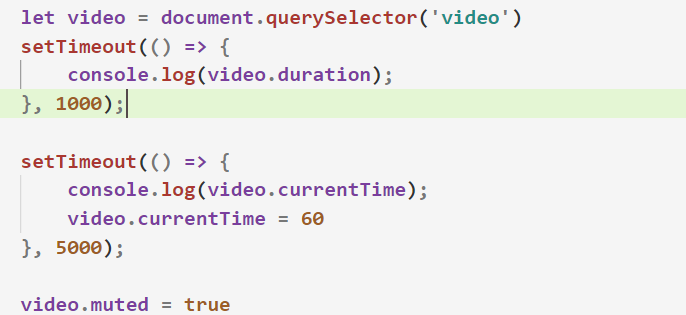

- `video`元素其他的JS属性：
    - `width、height`  :   video元素的尺寸(读写)
    - `videoWidth、 videoHeight`  :   视频的实际尺寸(只读)

### JS相关函数

- `video`和`audio`元素**共同**的JS函数：
    - `ele.play() ` :  媒体播放
    - `ele.pause()`  :  媒体暂停
    - `ele.load()  `:  重新加载媒体

### JS相关事件

- `video`和`audio`元素**共同**的JS**事件名**：
    - `abort`	 在播放被终止时触发
    - `ended`	播放结束时触发。
    - `loadeddata`	媒体的第一帧已经加载完毕后触发
    - `pause`	播放暂停时触发。
    - `play`	在媒体回放被暂停后再次开始时触发。
    - `playing`	在媒体开始播放时触发（不论是初次播放、在暂停后恢复、或是在结束后重新开始）。
    - `timeupdate`	媒体元素的currentTime属性改变时触发
    - `volumechange`	在音频音量改变时触发（既可以是volume属性改变，也可以是muted属性改变）.。

### 音阶导航案例

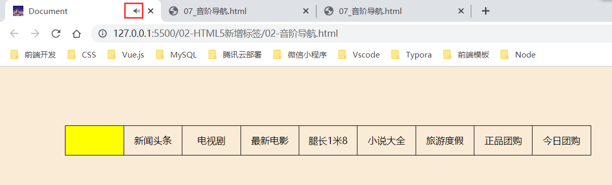

- HTML + CSS 布局

    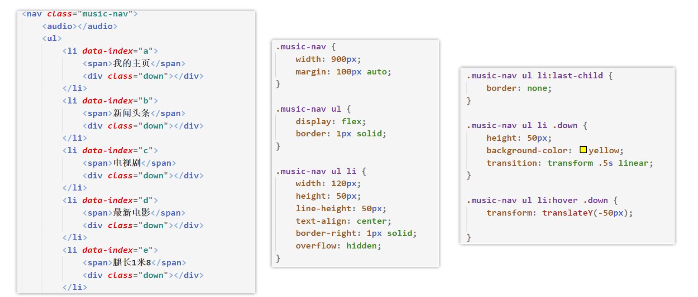

- JS

    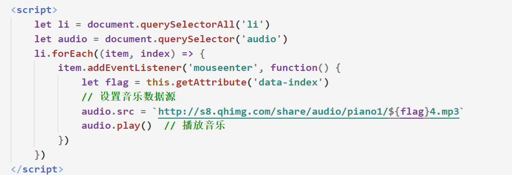

## 1.3 H5新增的事件

### 1.3.1 普通新增事件

- `transitionend`：css过渡动画结束时触发

- `invalid`：提交表单时，如果有一控件不符合它的约束条件，则会触发`invalid`事件

### 1.3.2 鼠标滚轮事件

- `scroll`
    - 当**滚动条**在滚动时会触发 **onscroll 事件**
    - scroll事件一般给**documen(页面)使用**，也可以给元素使用，前提是必须要有滚动条

- `wheel`

    - 当**鼠标滚轮**滚动时，会触发 **onwheel事件**
    - 鼠标滚轮向上滚动：`e.deltaY = -125`，鼠标滚轮向下滚动：`e.deltaY = 125`

    

- `scroll`和`wheel`的区别

    - `scroll`事件必须出现**滚动条**才会触发，而`wheel`事件只是普通的鼠标事件，**滚动滚轴**就可触发。

    - 由于鼠标滚轮滚动时大部分会触发scroll事件 所以时**wheel事件先触发**

# 二、H5高级特效

## 2.1 mac停靠栏

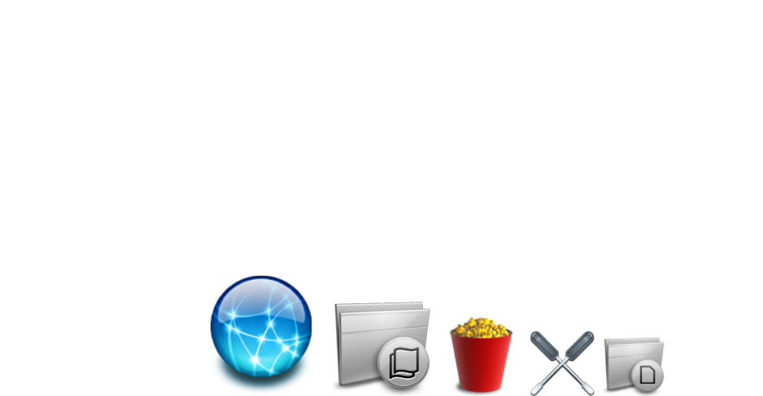

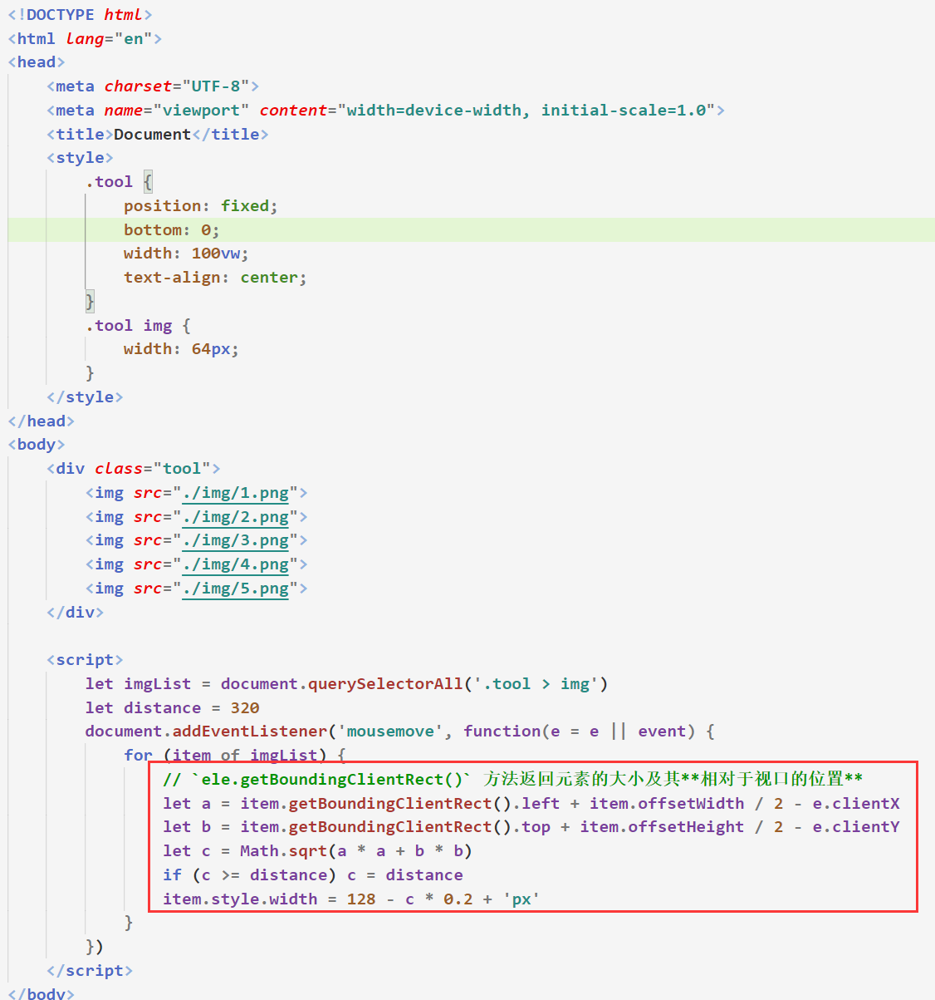

## 2.2 气泡效果

- 效果图

    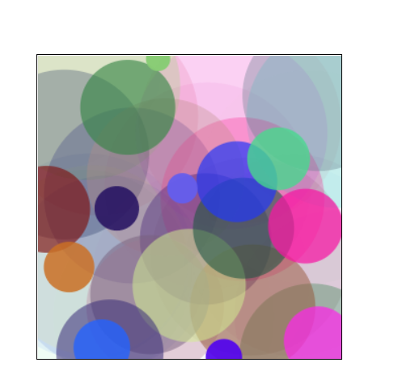

- 代码实现

    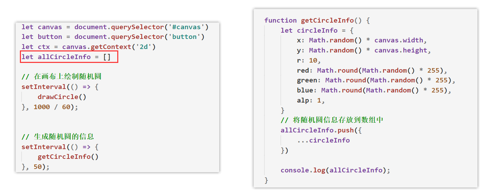

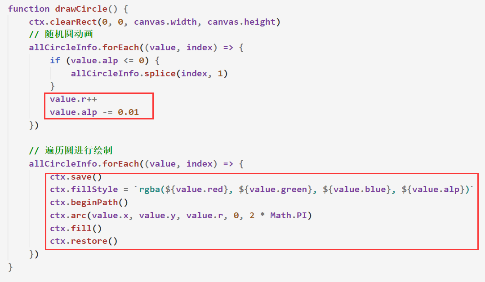

## 2.3 曲线气泡效果

- 效果图

    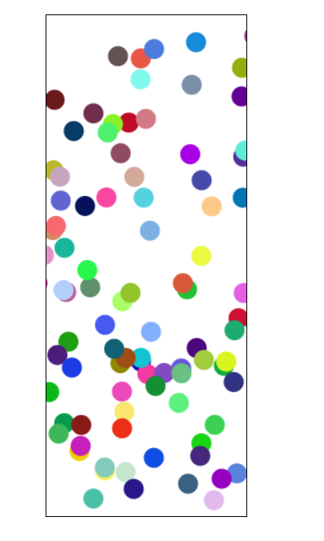

- 在气泡效果的基础上添加如下代码

    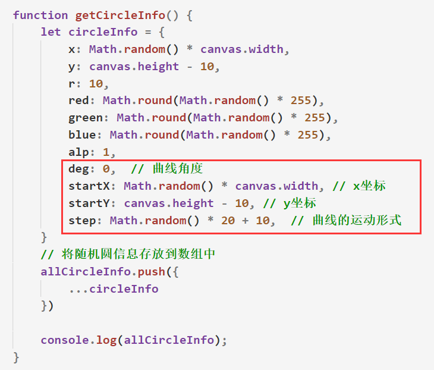

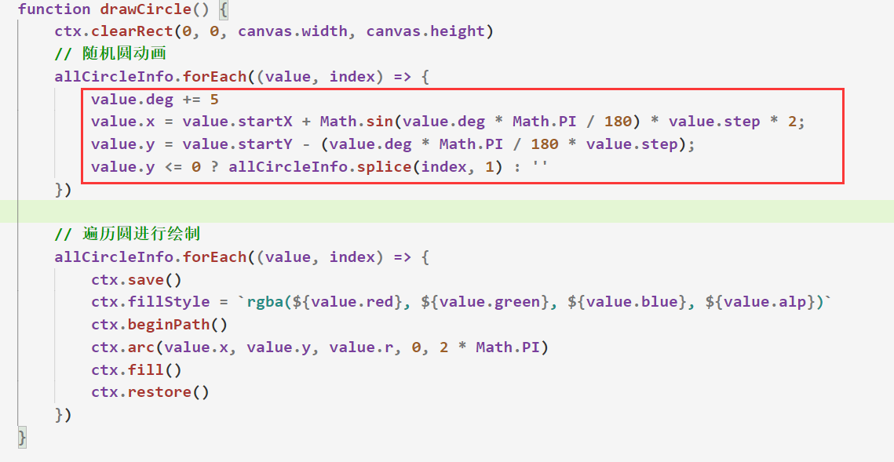

# 三、PC项目实战（一）

## 3.1 头部布局

>实现效果：鼠标经过时，导航菜单从**蓝色变黑色过渡**
>

1. 编写两个导航菜单，其中一个为鼠标经过时要展现的菜单

2. 激活的菜单宽度为0，当鼠标经过时，宽度为100%，提前设置好`transition`过渡动画属性

3. 为激活的导航菜单设置绝对定位 （子绝父相）

4. 通过`overflow:hidden`隐藏激活的导航菜单

    

    

    

## 3.2 头部交互

>需求：点击菜单栏时，下方的小箭头跟着移动，并导航栏菜单为激活效果
>

1. 初始化小箭头的位置
2. 监听导航菜单的点击
3. 为当前点击的li添加 active类名 （排他思想）
4. 为当前点击到li下的偷天换日的菜单内容 设置width (排他思想)
5. 更新箭头位置，`箭头偏移量 = 菜单偏移量 + 菜单宽度 / 2 - 箭头宽度 / 2`

## 3.3 内容区布局

>上图所述，红色区域为**整体**的内容区，蓝色区域为每一屏的**包裹区**，紫色区域为**每一屏**
>

1. 点击菜单栏时，只需要**修改包裹区的偏移量**即可
2. 为整体区域设置`overflow:hidden`即可隐藏多余的屏

## 3.4 内容区交互

>需求1：点击菜单栏滑动到对应位置
>

1. 监听菜单栏的点击，设置`container`的偏移量
2. `容器往上移动的偏移量 = 内容整体区域的高度 * -当前点击菜单的索引值`

3. 为`container`容器设置相对定位，以便于设置偏移量

>需求2：鼠标滚轮，会滚动到上一屏/下一屏
>

1. 监听鼠标滚轮的滚动事件(wheel)
2. 事件处理函数抽离出去，实现防抖函数功能
3. 获取当前活跃菜单栏的索引，往上滚 index--  往下滚index++
4. 根据最新的index，更新菜单栏状态、内容区域、箭头位置

.assets/image-20210204155513064.png)

- 监听页面尺寸的变化，重新更新`container`的偏移量

    

 

## 3.5 第三屏

>核心：机器人动画
>

# 四、PC项目实战（二）

## 4.1 第二屏

>核心：照片墙的3D旋转效果

- html结构

    

- css

    

## 4.2 第四屏

>核心：**图片炸裂效果**
>
>

1. HTML结构分为炸裂层和遮罩层，**分裂层覆盖在遮罩层上**

    

    

2. 动态创建4个img标签，作为分裂的小图片，需要包裹一个div容器

    

3. 设置每个容器的宽高，容器里面的图片路径，以及初始化图片的位置

    

4. 此时的分裂层是由4个小图片形成的

5. 监听鼠标的移入移出，修改每个小图片的`transform`中的`translate`的值

    

6. 记得给图片添加过渡动画

    

## 4.3 出入场动画

- 实现思路

    1. 定义一个数组，该数组中的每一个元素都是一个对象

    2. 每个**对象中存放着每一屏的出场、入场动画**

    3. 执行每一屏的出场动画

    4. 更新当前屏的入场动画

    5. 点击导航菜单、鼠标滚动、点击右侧小圆点时，重复以上3、4步骤

        

## 4.4 音频

>注：暂时无法实现自动播放音频，目前**只能通过点击事件来触发音频**
>

## 4.5 开机动画

- 实现思路

    1. 给line一个过渡动画  width 0vw -> width 100vw

    2. 监听line过渡动画的结束，分别设置up down的top偏移量
    3. 监听up的过渡动画的结束，隐藏所有开机动画的元素

