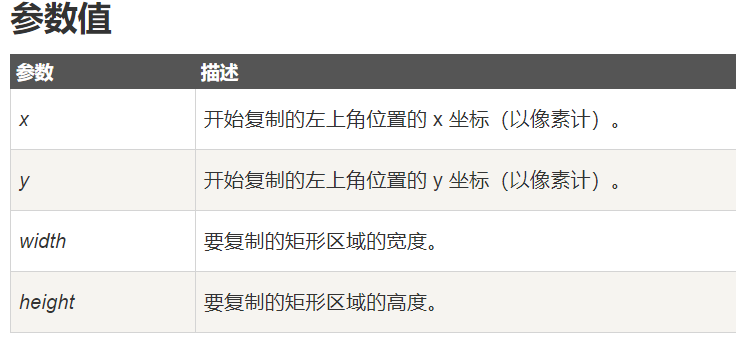

# 一、邂逅Canvas

## 1.1 Canvas的简介

- 什么是**Canvas**？

    - `<canvas>` 是 HTML5 **新增的元素**，用于图形的绘制，可通过使用**JavaScrip**t中的脚本来**绘制图形**

    - `<canvas> `标签只是**图形容器**，您必须使用**脚本来绘制图形**。

      ​    

        ​    

- **canvas参考手册**：https://www.runoob.com/tags/ref-canvas.html


​    

## 1.2 Canvas的特点

- `<canvas>`元素是以**双标签形式**存在

- **canvas元素**默认具有高度和宽度：***width：  300px    height：150px***

- **canvas**元素是**行内级替换元素**，会与其他行内级元素同占一行，并且可以设置宽高

    

    

    

- 在`canvas元素`中**嵌套的元素**不会被渲染到页面上，类似于`display:none`，前提是浏览器**支持**`canvas元素`

    - ```html
        <canvas>
            <!-- 如果浏览器支持canvas元素，则被嵌套的元素不会被渲染到页面上 -->
            <!-- 如果浏览器不支持canvas元素，则被嵌套的元素会被渲染到页面上 -->
            <div>当前浏览器不支持canvas元素，请更换</div>
        </canvas>
        ```

        

- `canvas`元素一般有如下2个属性，都是可选的

    - `width`：画布的宽度，默认值为300

    - `height`：画布的高度，默认值为150

    - 坑：**不要在css中设置canvas元素的宽高**，否则绘制的图形会被等比例拉伸

    - ```html
        <canvas width="500" height="400"></canvas>
        ```

        

>**注意:** 默认情况下 <canvas> 元素没有边框和内容。


## 1.3 Canvas初体验

- canvas 元素本身是**没有绘图能力**的。所有的绘制工作必须在 **JavaScript 内部完成**

1. 获取canvas元素

    - ```js
        let canvas = document.querySelector('#canvas1')
        ```

2. 创建画笔工具对象

    - ```js
        let ctx = canvas.getContext('2d')
        ```

3. 通过**画笔工具**在canvas元素中绘制图形

    - ```js
        ctx.fillStyle="#FF0000";
        ctx.fillRect(0,0,150,75);
        ```

    - 设置fillStyle属性可以是CSS颜色，渐变，或图案。fillStyle 默认设置是#000000（黑色）。

        fillRect(*x,y,width,height*) 方法定义了矩形当前的填充方式。

    

>注：在canvas中**绘制图形**，都必须要通过**画笔工具**来完成


4. 检查canvas元素的**浏览器兼容性**

    - ```js
        // 1. 获取canvas元素对象
        let canvas = document.querySelector('#canvas1')
        // 判断浏览器的兼容性
        if (canvas.getContext) {          
          // 2. 获取画笔工具
          let ctx = canvas.getContext('2d')
          // 3. 通过画笔工具绘制图形
          ctx.fillStyle = '#FF0000'
          ctx.fillRect(0, 0, 150, 75)
        }
        ```

        

# 二、Canvas绘制图形


## 2.1 canvas ---- 绘制矩形

- `ctx.fillRect(x, y, width, height)`
    - 绘制**被填充**的矩形，填充色默认为黑色

- `ctx.strokeRect(x, y, width, height)`
    - 绘制一个**不被填充**的矩形，默认会有1px的黑色边框，也就是**绘制一个轮廓**

- `ctx.clearRect(x, y, width, height)`
    - 清除指定矩形区域，让清除部分完全透明，**只能够作用于矩形**上
    - ***ctx.clearRect(0, 0, canvas.width, canvas.height)***：可用于清除整个画布区域


- 参数说明

    - x与y用于指定**要绘制的矩形的坐标**，坐标**相对于画布的左上角**

    - width和height设置**矩形的尺寸**。（存在边框的话，边框会在width上占据一个边框的宽度，height同理）

    - 以上4个参数都**不需要加单位**

        

- 代码演练

    


- `ctx.strokeRect`边框的问题

    - strokeRect 会绘制一个没有被填充的矩形，也就是展现出一个边框

    - 但是，在渲染边框时，会渲染出2px的黑色边框，如何解决？

    - 在**x y轴坐标上加上0.5**，即可渲染成1px的边框

        

        


- 后一个渲染的图形要是位置与前一个图形**位置冲突**，则会**覆盖前一个图形**

    


## 2.2 canvas ---- 颜色、样式

>注：以下API必须要在**绘制图形之前被调用**，否则不生效
>
>


- `ctx.fillStyle = color|gradient|pattern`
    - 设置图形的**填充颜色**、渐变或模式

- `ctx.strokeStyle = color|gradient|pattern; `
    - 设置**图形轮廓的**颜色、渐变或模式

- `ctx.lineWidth = number`
    - 设置**图形轮廓的粗细大小**

- `ctx.lineJoin = "bevel|round|miter"`

    - 设定线条与线条间接合处的样式（默认是 miter）

    - 	round : 圆角
        	bevel : 斜角
            	miter : 直角


- 注：如果在**绘制图形之后**才添加的画笔颜色、样式，那么这些颜色、样式**不会生效**

    


## 2.3 canvas ---- 绘制路径

### 2.3.1 理解路径

- 在Canvas中绘图，其实就是先按照一定顺序定义一些坐标点，再通过指定的方式，用画笔将这些坐标点连接起来，就形成我们所需要的图形。

    

- Canvas中的所有基本图形，包括线段、矩形、圆弧、贝塞尔曲线等，都是基于路径进行绘制的。


### 2.3.2 绘制路径的步骤


>概念：在某一时刻，c**anvas中只能有一条路径存在**，canvas规范把它称为“**当前路径**”
>


使用路径***绘制图形的一般步骤***为：

1. 调用`beginPath()`方法开始一条新的路径。也称为**当前路径**
2. 调用`moveTo(x, y)`方法设置**当前路径的开始点**，该方法**不会创建线条**
3. 调用`lineTo(x, y) `方法将**开始点与指定坐标**，进行连接（该方法并不会创建线条）

4. 调用`closePath()`方法关闭路径，将**开始点与结束点进行连接**

5. 调用`fill() `方法填充**通过当前路径生成实心的图形**。默认颜色是黑色
    - 如果路径未关闭，那么 `fill() `方法会默认调用`closePath()`方法关闭路径

6. 调用`stroke()`方法绘制通过路径生成的实心图形的**轮廓**
    - 如果路径未关闭，那么**不会自动调用**`closePath()`


### 2.3.3 理解beginPath


- 在上图案列中，我们可以看到第二个通过路径绘制的**图形样式影响到了上一个图形**，如何解决这个影响？

- `beginPath()`方法会**清除当前路径**，但不影响通过当前路径生成的图形，并重新定义一条新路径
    - 也就是说可以通过`beginPath()`方法，消除两个路径图形所产生的影响


>结论：在通过路径绘制第二个图形前，需要**先调用beginPath()**
>


### 2.3.4 绘制矩形

- 绘制矩形也可以使用**路径方式绘制**，语法如下
  
- `ctx.rect(x, y, width, height)`
  
- 通过路径方式绘制完矩形之后，并不会立即看到实心图形

    - 因为需要通过是手动的调用`ctx.fill()`进行填充，**轮廓同理**

        

- `rect`和`fillRect`的区别

    - `rect`是通过**路径绘制**而成的矩形，因此需要先调用`beginPath()`

    - `fillRect`不会影响上一个路径绘制的图形

    - `rect`需要手动进行填充图形

        


### 2.3.5 绘制线段

- 通过路径绘制线段时，**不能关闭路径**，`lineWidth`代表了**线段的粗度**

    


- `ctx.lineCap = "butt|round|square"`

    - 可通过`lineCap`属性设置线条末端的样式

    - "round" 和 "square" 值会使线条略微变长，默认值为butt

        

    

- 如果**仅希望看到路径绘制的过程**，不需要看到路径生成的图形，那么就不需要调用`closePath`，可通过`stroke`展示


### 2.3.6 save && restore

- 当通过路径生成多个图形时，一旦设置填充图形颜色时，其他图形也会跟着共用
    - 我们希望**每个图形有单独的样式以及颜色**，如何做到？


- `canvas`为我们提供了`save`和`restore`，完美解决了路径图形的样式、颜色作用域问题

    

    - 通过`save`和`restore`可以为每个路径图形，**设置单独的样式及颜色**


- `save`和`restore`基本模板

    - ```js
        ctx.save()
        // ---- 编写图形样式、颜色区域 ----
        ctx.beginPath()
        // ---- 编写路径相关区域 ----
        ctx.restore()
        ```

        

>为了规范起见，请遵循`save`和`restore`的模板来**绘制路径图形**
>
>


## 2.4 canvas ---- 绘制圆形


>注：**绘制圆形**也**属于**是通过**路径绘制**的一种方式，因此需要遵循**绘制路径的语法规范**
>


### 2.4.1 ctx.arc

- `ctx.arc(x,y,r,sAngle,eAngle,counterclockwise)`

    - `ctx.arc`：创建弧/曲线（用于创建圆形或部分圆）。

- 参数说明

    


>提示：如需通过 arc() 来创建圆，请把**起始角设置为 0**，**结束角**设置为 **2*Math.PI**。使用 [stroke()](https://www.runoob.com/tags/canvas-stroke.html) 描绘**圆的轮廓**
>


- 顺时针与逆时针方向说明，默认为**逆时针绘制圆形**

    


### 2.4.2 ctx.arcTo

参考文档：https://www.runoob.com/tags/canvas-arcto.html

- `ctx.arcTo(x1,y1,x2,y2,r)`：创建介于两个切线之间的弧/曲线。

- 参数说明

    


- 需要由三个坐标来画弧。下例中由 **(x1,y1),(x2,y2),(100,20)** 三点可确定两条直线的位置再由半径确定弧的位置。

    


## 2.5 canvas ---- 绘制曲线


>注：**绘制曲线**也**属于**是通过**路径绘制**的一种方式，因此需要遵循**绘制路径的语法规范**
>


### 2.5.1 二次贝塞尔曲线

- `ctx.quadraticCurveTo(cpx,cpy,x,y)`
    - 绘制二次贝塞尔曲线，cp1x,cp1y为一个**控制点**，x,y为**结束点**。

    - 需要指定一个**起始点**

        

        

        


### 2.5.2 三次贝塞尔曲线

- `ctx.bezierCurveTo(cp1x, cp1y, cp2x, cp2y, x, y)`

    - 绘制三次贝塞尔曲线，cp1x,cp1y为**控制点一**，cp2x,cp2y为**控制点二**，x,y为**结束点**。

    - 需要指定一个**起始点**

        

        


## 2.6 canvas ---- 签名(案例)


### 1. HTML和CSS


### 2. 核心JS实现

```js
let canvas = document.querySelector('#canvas1')
// 监听画布内鼠标的按下事件
canvas.addEventListener('mousedown', function (e = event) {
  // 获取鼠标在画布内按下的坐标
  let startX = e.clientX - canvas.offsetLeft
  let startY = e.clientY - canvas.offsetTop
  // 获取画笔
  let ctx = canvas.getContext('2d')
  // 设置轮廓（边框）颜色
  ctx.strokeStyle = 'pink'
  // 开始绘制路径
  ctx.beginPath()
  // 路径的起点
  ctx.moveTo(startX, startY)

  // 监听画布中鼠标的移动事件
  canvas.onmousemove = function (e) {
    // 获取鼠标在画布内移动的坐标
    let startX = e.clientX - canvas.offsetLeft
    let startY = e.clientY - canvas.offsetTop
    // 指定与路径起点连接的坐标
    ctx.lineTo(startX, startY)
    // 绘制线段
    ctx.stroke()
  }

  // 当鼠标松开时解绑鼠标移动事件
  canvas.onmouseup = () => canvas.onmousemove = null
})
```


# 三、Canvas转换

>注：与设置图形的**填充颜色**、**轮廓样式**一致，**图形转换**相关的API需要**在绘制图形之前进行编写**


## 3.1 ctx.translate

- 在绘制图形时，我们往往要指定该图形在哪里进行绘制，而图**形的位置**往往参照的就是*画布原点*，**默认为(0, 0)**

- `ctx.translate(x, y)`： **重新设置**canvas画布上的 **原点位置**


>注：在canvas中，如果**多次调用**`translate`，那么**偏移量是会累加的**
>


## 3.2 ctx.rotate

- `ctx.rotate(abgle)`：旋转当前的绘图

    


-  **旋转的中心点**始终**参照**的是canvas**画布原点**

    


- 如果希望**修改旋转的中心点**，那么可以通过`translate`进行修改，注意**顺序问题**

    


>注：与`translate`一样，多次调用`rotate`，**也会累加**
>


## 3.3 ctx.scale

- `ctx.scale(x, y)`：将绘制的图形进行缩放
    - 注：距离原点的**偏移量也会随着缩放**
    - x表示距离原点的**横坐标**，以及绘制图形的**宽度**的**缩放比例**
    - y表示距离原点的**纵坐标**，以及绘制图形的**高度**的**缩放比例**


- 下例中，缩放图形后，相当于`ctx.strokeRect(50 * 2, 50 * 3, 50 * 2, 50 * 3)`


>注：如果多次调用`scale`，那么**缩放比例会累乘**
>


## 3.4 旋转 + 放大动画(案例)


### 1. css实现


### 2. canvas实现


- 核心部分：

    


## 3.5 时针(案列)


>注：**时针旋转30弧度**      **分针、秒针旋转6弧度**
>

- 案例说明

    ```markdown
    1. 初始化
    	将圆心调整到画布的中间
    	由于canvas中画圆与旋转所参照的坐标系于正常坐标系有出入
    	将整个画布逆时针旋转90度
    	初始化一些样式数据
    		  ctx.lineWidth = 8;
    	  	ctx.strokeStyle = "black";
    	  	ctx.lineCap = "round";
    	  	ctx.translate(200, 200);
    	  	ctx.rotate(-90 * Math.PI / 180);
    
    2. 外层空心圆盘
    	圆盘颜色:#325FA2，圆盘宽度:14，圆盘半径:140
    	
    3. 时针刻度
    	长度为20，宽度为8
    	外层空心圆盘与时针刻度之间的距离也为20
    	
    4. 分针刻度
    	宽度为4，长度为3
    	
    5. 时针
    	宽度为14
    	圆心外溢出80 收20
    	
    6. 分针
    	宽度为10
    	圆心外溢出112 收28
    	
    7. 秒针
    	颜色:D40000，宽度为6
    	圆心外溢出83 收30
    	
    	---->中心实心圆盘
    		半径为10
    	---->秒针头
    		96码开外半径为10的空心圆
    		宽度为6
    ```

    


### 1. 表盘

- 通过canvas技术，完成表盘的绘画

    


- 代码实现：遵循`save`、`beginPath`、`restore`规范

    


### 2. 钟表


>核心：获取当前时间，将获取到的**时、分**，**加上秒并除以 / 60** ，作为时、分表座要旋转的弧度
>


- 代码实现

                       


# 四、Canvas 图片&文本&渐变

## 4.1 canvas ---- 绘制图片

>注：在画布中设置图片，需要**等待图片加载完成**后，再进行绘制，因为**图片加载是异步**的
>

- `ctx.drawImage(img/video,x,y,width,height)`：在画布上绘制图像或视频。
    - img/video：*img DOM元素*/*video DOM元素*
    - x：在画布上放置图像的 x 坐标位置。
    - y：在画布上放置图像的 y 坐标位置。
    - width：可选。要使用的图像的宽度（伸展或缩小图像）。
    - height：可选。要使用的图像的宽度（伸展或缩小图像）。


- 投影机效果：

    


## 4.2 canvas ---- 填充背景图片

- `ctx.createPattern(img, "repeat|repeat-x|repeat-y|no-repeat")`：设置画布的**填充方式**

    


## 4.3 canvas ---- 线性渐变

- `ctx.createLinearGradient(x1, y1, x2, y2)`：创建**线性**的**渐变对象**

    - 渐变对象可用于**填充矩形、圆形、线条、文本**等等

    - (x1, y1)：表示渐变的起点

    - (x2, y2)：表示渐变的终点

        

- Tips：

    - 请使用**渐变对象**作为 [strokeStyle](https://www.runoob.com/tags/canvas-strokestyle.html) 或 [fillStyle](https://www.runoob.com/tags/canvas-fillstyle.html) 属性的值。
    - 请使用 [addColorStop()](https://www.runoob.com/tags/canvas-addcolorstop.html) 方法规定不同的颜色，以及在 gradient 对象中的**何处定位颜色**


- `gradient.addColorStop(position, color)`：规定渐变对象中的**颜色**和**位置**
    - addColorStop() 方法与 [createLinearGradient()](https://www.runoob.com/tags/canvas-createlineargradient.html) 或 [createRadialGradient()](https://www.runoob.com/tags/canvas-createradialgradient.html) 一起使用。


## 4.4 canvas ---- 径向渐变

- `ctx.createRadialGradient(x1, y1, r1, x2, y2, r2)`：创建**径向的渐变对象**
    - 前三个参数则定义另一个以(x1,y1) 为原点，半径为 r1 的圆
    - 后三个参数则定义另一个以 (x2,y2) 为原点，半径为 r2 的圆。


## 4.5 canvas ---- 飞鸟(案例)


# 五、Canvas 文本&阴影


## 5.1 canvas ---- 绘制文本

- 绘制文本API:
    - `ctx.fillText(text,x,y,maxWidth)`：在画布上绘制**填色的文本**。文本的默认颜色是黑色。
    - `ctx.strokeText(text,x,y,maxWidth)`：在画布上绘制文本（无填充色）**轮廓**。

- 文本字体、样式API：

    - `ctx.font="italic 12px arial"`：设置画布上文本内容的当前**字体属性**

    - `ctx.measureText(text)`：返回一个文本对象，包含关于**文本尺寸的信息**（例如文本的宽度）

        

- 文本水平对齐API:

    ​                             

    - `ctx.textAlign = "center|left|right"`：设置文本内容的当前**对齐方式**。

    - `ctx.textBaseline="top|middle|bottom"`：设置绘制文本时的当前**文本基线**


## 5.2 canvas ---- 文本水平垂直居中


## 5.3 canvas ---- 阴影

- `ctx.shadowBlur = number`：设置阴影的模糊级数

- `context.shadowColor = color`：设置或返回用于阴影的颜色


- `ctx.shadowOffsetX = number`     `ctx.shadowOffsetY = number`     

    - shadowOffsetX 和 shadowOffsetY 用来设定阴影在图形上 **X 和 Y 轴的延伸距离**

    - 如果是负数则代表在图像的左方向和上方向进行**阴影延伸**

        


# 六、Canvas 像素操作


## 6.1 获取像素数据

>注：**像素点个数 = ImageData.width * ImageData.height**
>


- `ctx.getImageData(x,y,width,height)`：**拷贝**画布内**指定的像素数据**，返回一个*ImageData*对象

    


- 解析*ImageData* 对象

    

    - width：返回 ImageData 对象的宽度。
    - height：返回 ImageData 对象的高度。
    - data：返回一个数组，数组中的**每四个元素**，就代表了*选中区域*的**一个像素点的rgba值**
        - R - 红色（0-255） --> 黑色到白色
        - G - 绿色（0-255）--> 黑色到白色
        - B - 蓝色（0-255）--> 黑色到白色
        - A - alpha 通道（0-255; 0 是透明的，255 是完全可见的）


>注：如果指定的像素数据内，**没有被填充背景颜色**，那么**默认值是透明**的
>


## 6.2 写入像素数据

- `ctx.putImageData(imgData, x, y)`：将图像数据（从指定的 **ImageData 对象**）放回画布上。
    - imgData：**ImageData对象**
    - x：指定放置在画布的X坐标上
    - y：指定放置在画布的坐标上


## 6.3 创建 ImageData对象

- `ctx.createImageData(width, height)`：创建新的 ImageData 对象：
    - width : ImageData 新对象的**宽度**。
    - height: ImageData 新对象的**高度**。
    - 默认创建出来的是***透明的***


## 6.4 操作单个像素点


- **获取**单个像素点的**rgba值**

    ```js
    // 拷贝像素数据
    let ImageData = ctx.getImageData(0, 0, 200, 200)
    let color = getPxInfo(ImageData, 50, 50)  // 获取(50, 50)坐标的像素点的rgba值
    
    // 获取指定位置的像素点的rgba值
    function getPxInfo(ImageData, x, y) {
      let color = []  // 存储像素点的rgba值
      let w = ImageData.width
      // 公式：(x,y)  x*w+y
      // r
      color[0] = ImageData.data[(y * w + x) * 4];
      // g
      color[1] = ImageData.data[(y * w + x) * 4 + 1];
      // b
      color[2] = ImageData.data[(y * w + x) * 4 + 2];
      // a
      color[3] = ImageData.data[(y * w + x) * 4 + 3];
      return color
    }
    ```

    

- **设置**单个像素点的**rgba值**

    - ```js
        // 拷贝像素数据
        let ImageData = ctx.getImageData(0, 0, 200, 200)
        // 设置横坐标为50的所有像素点
        ImageData.data.forEach((v, i) => {
          setPxInfo(ImageData, 50, i, [0, 0, 0, 255])
        })
        
        // 将ImageData放回画布的指定区域内
        ctx.putImageData(ImageData, 0, 0)
        
        // 设置指定位置的像素点的rgba值
        function setPxInfo(ImageData, x, y, color) {
          let w = ImageData.width
          // x:多少列  y：多少行
          // r
          ImageData.data[(y * w + x) * 4] = color[0]
          // g
          ImageData.data[(y * w + x) * 4 + 1] = color[1]
          // b
          ImageData.data[(y * w + x) * 4 + 2] = color[2]
          // a
          ImageData.data[(y * w + x) * 4 + 3] = color[3]
        }
        ```

        


## 6.5 马赛克效果

1. 


2. 


3. 


# 七、Canvas 合成

## 7.1 ctx.globalAlph

- `ctx.globalAlpha = number`：设置所有绘制图形的透明度
    - 有效的值范围是 0.0 （完全透明）到 1.0（完全不透明）
    - 默认是 1.0


## 7.2 ctx.globalCompositeOperation


>注：**画布内的每个像素点的默认透明度为0**，通过合成**清除的像素点rgba值**为*(0, 0, 0, 0)*
>


- `ctx.globalCompositeOperation = "source-in"`

    - 设置如何将一个**源（新的）**图像**层叠**到目标（**已有的）的图像上**。
    - source：新的图像(源)
    - destination：已经绘制过的图形(目标)

    - ```
        source-over(默认值):源在上面,新的图像层级比较高
        source-in  :只留下源与目标的重叠部分(源的那一部分)
        source-out :只留下源超过目标的部分
        source-atop：砍掉源溢出的部分
        
        destination-over:目标在上面,旧的图像层级比较高
        destination-in:只留下源与目标的重叠部分(目标的那一部分)
        destination-out:只留下目标超过源的部分，清除源、源和目标重叠的部分
        destination-atop:砍掉目标溢出的部分
        ```

        


- 注：设置该属性时，需要在**两个图形绘制**的**前后**进行设置，**前一个绘制的图形为目标**，**后一个为源**

    


## 7.2 刮刮卡

>核心：**destination-out**，利用绘制图形和初始图片的**合成关系**，**清除图片超出源的部分**
>


1. 设置画布大小，绘制图片，初始化样式

    

    

2. 监听*手指触摸屏幕事件*
    1. 获取手指在画布内的坐标
    2. 根据手指的坐标来绘制一个圆
    3. 使用 `destination-out`只留下**目标超出源的部分**，绘制的区域变为透明


3. 监听*手指滑动事件*
    1. 获取手指在画布内的坐标
    2. 根据手指的坐标来绘制一个圆
    3. 使用 `destination-out`只留下**目标超出源的部分**，**绘制的区域变为透明**


4. 解决BUG：当手指头快速滑动时，会发现有很多有空隙的小圆点

    

    - 解决方案：将源改成**加粗的线段**

​                        


## 7.3 刮刮卡优化

- 当通过手指滑动的**透明区域**大于画布的一半时，需要让画布隐藏，并移除canvas DOM元素

    1. 监听手指头离开屏幕时的事件
    2. 获取画布内的**像素点个数**
    3. 获取透明度为0的像素点个数
    4. 判断透明度为0的像素点个数是否为总像素点个数的一半

    5. 隐藏画布区域


# 八、Canvas 其他API

## 8.1 canvas.toDataURL()

- **`HTMLCanvasElement.toDataURL()`** 方法返回一个**Canvas图片**展示的 [data URI](https://developer.mozilla.org/en-US/docs/Web/HTTP/data_URIs) 


>Canvas元素**本质上就是一张图片**，可以鼠标右键进行保存，**没绘制的区域默认为透明**
>


## 8.2 ctx.isPointInPath()

- `ctx.isPointInPath(x, y) `：指定的点位于当前路径中，返回 true，否则返回 false。


