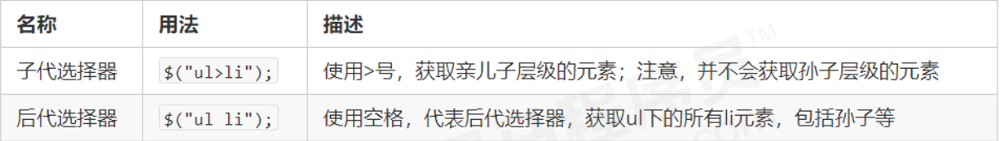

# 一、jQuery 概述

## 1.1 理解 JavaScript 库 

- **仓库**（ library）：   可以把很多东西放到这个**仓库**里面。找东西只需要到**仓库**里面查找到就可以了。
- **JavaScript库**就是一个JS 文件，**该js文件对原生的JS代码进行了封装**。**为开发者提供了各种封装好的方法和属性**
  
    
  
- 区别库、插件、框架

  - 库：封装了原生的JS代码，提供了各种封装好的函数(方法)，**使用库只需要懂得用库里的API**
- 插件：**功能单一**，可以实现某种特定的功能需求
  - 框架：**功能多**，可以解决一整套的功能需求，但是需要学习框架的**语法规范**来写代码

  - **共同性**：都是JS文件

  

- 常见的JavaScript库

  -  jQuery 

  - 移动端的zepto

  - 这些库都是对原生 JavaScript 的封装，**内部都是用 JavaScript 实现的**，**为开发者提供了更便捷的方法和属性**

    

## 1.2 jQuery的概念

- jQuery特点：***封装了 JavaScript 常用的功能代码***，**优化了 DOM 操作**、**事件处理**、**动画设计和 Ajax 交互** 

- 学习jQuery本质： **就是学习使用jQuery中的API**

  

- jQuery的优点：

  - 轻量级。核心文件才几十kb，不会影响页面加载速度 

  -  跨浏览器兼容。基本兼容了现在主流的浏览器 

  - **链式编程、隐式迭代** 

  - 封装了事件、样式、动画方法，**简化了DOM操作** 

  - 支持插件扩展开发。有着丰富的第三方的插件，例如： 树形菜单、日期控件、轮播图等 

    

- jQuery中文文档：https://www.jquery123.com/


## 1.3 jQuery的起步

- 通过外链引入`jQuery库`

    - `<script src="https://cdn.bootcdn.net/ajax/libs/jquery/1.10.0/jquery.js"></script>`

        

- 通过npm安装`jQuery`，在后续学习的Node以及webpack中可以采用这种方式

    - `npm i jQuery`

    

    

## 1.4 jQuery的入口函数

- 写法一：（常用）

  - ```js
    $(function () {        
        ...  // 此处是页面 DOM 加载完成的入口  
    }) 
    ```

- 写法二：

  - ```js
    $(document).ready(function(){    
    	...  //  此处是页面DOM加载完成的入口 
    });   
    ```

- 以上两个写法实现的功能是一样的

- 等待 **DOM 结构渲染完毕**即可执行内部代码，不必等到所有外部资源加载完成， 相当于原生 js 中的 DOMContentLoaded事件，**性能更优**

    

- 原生JS中的load 事件是等页面文档、外部的 js 文件、css文件、图片加载完毕才执行内部代码，**性能较差**


## 1.5 jQuery对象和DOM对象

- 首先我们知道jQuery是一个封装了原生JS的库，他可以帮助开发者更快捷的**获取元素对象**

  

- 通过DOM**获取来的元素对象**叫做 **DOM 对象** 

  - ```js
    var div = document.querySelector('div') // 该div是一个dom对象
    ```

-  **jQuery 方法获取的元素对象**就是 **jQuery 对象**

  - ```js
    $('div')  // 该div是一个jQuery对象，放在伪数组里面进行存储的
    ```

    

- **jQuery获取元素**对象和**DOM获取元素对象**的区别：

  -  ***jQuery 对象只能使用 jQuery 方法，DOM 对象只能使用原生的 JavaScirpt 方法***

  - **jQuery获取到的元素对象永远都是以伪数组形式存储的**， 通***过伪数组的下标，可以获取到DOM对象***

    

    


## 1.6 jQuery对象和DOM对象的转换

-  DOM 对象转换为 jQuery 对象： **$(DOM对象)** 

  - ```js
    $('div')
    ```

-  jQuery 对象转换为 DOM 对象（两种方式） 

  - ```js
    $('div') [index]       index 是索引号
    $('div') .get(index)    index 是索引号 
    ```

    

# 二、jQuery选择器

- 通过jQuery选择器可以帮助开发者更**便捷的获取DOM元素对象**
- 所有通过jQuery选择器获取到的元素对象， **都是以伪数组形式进行存储的，并且只能够使用jQuery库里面的方法**

- 通过jQuery获取DOM元素的原理：

  - ```js
    function $(ele) {
      return document.querySelector(ele)
    }
    console.log($('button'));
    ```

    

## 2.1 基础选择器

- ```js
  $(“选择器”)   //  里面选择器直接写 CSS 选择器即可，但是要加引号
  ```

- 基础选择器
  - 

    

- 层级选择器

  - 

    

## 2.2 筛选选择器

- 通过**css选择器**筛选元素
  - 

    

  - 补充：**$(li:nth-child(2))**可以获取第二个li元素
    
    
    
  
- 通过**jQuery方法**筛选元素***（重点）***

  - 

  

  - ***重点记住： parent()  children()  find()  siblings()  eq()*** 

  - **补充**：`parents(selector)`  ***返回一个指定的祖先元素***

    

- eq方法和eq选择器的区别

  - 在开发中更**推荐使用eq方法** ，因为该方法里面可以放入一个变量

    

## 2.3 表单选择器

- | 语法      | 用法                        | 说明                             |
  | --------- | --------------------------- | -------------------------------- |
  | :enabled  | $('input:enabled')          | 查找所有可用的input元素          |
  | :disabled | $("input:disabled")         | 查找所有不可用的input元素        |
  | :cheched  | $("input:checked")          | 查找所有选中的复选框元素         |
  | :selected | $("select option:selected") | 查找所有选中的选项元素（下拉框） |

  

  

## 2.4 案例

- 淘宝服饰案例

  - ```js
    var index = 0        
    $('#left>li').mouseenter(function() {
        index = $(this).index()  // 通过index方法，可以得到当前触发事件对象的索引号
        $('#content>div').css('display', 'none')
        $('#content>div').eq(index).css('display', 'block') // 通过索引号来显示图片
    })
    ```


# 三、jQuery操作样式、属性、内容

##  3.1 通过css方法修改样式

- jQuery中为我们提供了***`element.css()`方法***，该方法可以修改元素的样式

- 参数只写属性名，则是**返回属性值** ，如果是数值，则返回的是带单位的，**注意返回的不是对象！**

  - ```js
    $(this).css('color')  // 返回的是属性值  不是jQuery对象
    ```

- 参数是属性名和属性值，**则是设置一组样式**，属性名必须加引号，属性值如果是数字可以不用跟单位和引号 

  - ```js
    $(this).css('width', 48);  // 返回的是jQuery对象
    ```
    
    

- 参数可以是对象形式，**方便设置多组样式**。**属性名和属性值用冒号隔开**， 属性名可以不用加引号

  - ```js
    $(this).css(
        { 
        	color:"white",
        	fontSize:20
        }
    ); 
    ```
    
    

- 注意：在jS中操作css样式 **属性名必须采用驼峰命名法**，js修改后的样式**属于内联样式**

  - 如果不想产生行内样式，那么可以设置为空`ele.style.xxx = ''`
  
  

## 3.2 通过类名修改样式

- jQuery可以对元素的**类名进行增删改**操作，通过对类名的操作，就可以修改元素不同的样式，**前提是在style标签中已经定义了这个类的样式**

  

- 添加类，不会覆盖掉先前已有的类名，而是追加一个类

  - ```js
    $(“div”).addClass('current')
    ```

- 移除指定的类

  - ```js
    $(“div”).removeClass('current'); 
    ```

- 切换类

  - ```js
    $(“div”).toggleClass('current'); 
    ```

    

## 3.3 操作元素本身自带的属性

- `element.prop()`方法**只能操作元素本身自带的属性**，比如a元素的href属性

- **获取**属性值语法：

  - ```js
    $('div').prop('属性名')   // 可以返回一个属性值
    ```

- **设置**属性值语法 

  - ```js
    $('div').prop('属性名', '属性值')   // 可以设置元素的属性值
    ```

    

## 3.4 操作元素自定义的属性

- ***`element.attr()` 方法既可以操作元素自带的属性，又可以操作元素中自定义的属性***， 比如下例中的**index属性**就是自定义的：

  - ```HTML
    <div index='1'></div>
    ```

- **获取**自定义的属性值

  - ```js
    $('div').attr('属性名')      // 类似原生 getAttribute() 
    ```

- **设置**元素自定义的属性

  - ```js
    $('div').attr('属性名', '属性值')   // 类似原生 setAttribute() 
    ```
    
    

- `attr`和`prop`方法的区别：

  - 当要操作的元素属性的**属性值为布尔类型**时，需要使用`prop`方法
  - 当操作**非布尔属性值**时，可以使用`attr`方法
  
  
  
  
  
  
  
  

## 3.5 操作普通元素的内容

- `element.html()` 

    - 相当于原生inner HTML，***获取元素中所有的内容***

- `element.html('内容')`   

    - 设置元素的内容，**html方法可以解析标签名**

        

- `element.text()`    

    - （ 相当于原生inner Text，***可以获取元素中所有的文本内容***)      

- `element.text(''文本内容'') `  

    - 设置元素的内容， **无法解析标签名**

      

- ***html()  是W3C规范***  

- 注意：***获取到的元素内容，都是字符串类型***


## 3.6 操作表单元素的值

- `element.val()` 方法可以***操作表单元素中的值，***相当于原生JS中的的value属性

  - ```js
    $('div').val()      // 获取表单的值
    ```

  - ```js
    $('div').val('内容')   // 设置表单的值 
    ```

    

## 3.7 检测复选框是否被选中

- `let flag = $(element).is(':checked')`


# 四、jQuery动画效果


## 4.0 动画函数的参数解析

- speed：
  - **动画执行速度**，可选值：`slow、normal、fast` or **毫秒数值(**如：1000)
  
    
  
- easing（***一般不设置***）：

    - 用来指定切换效果，默认是“swing”，可用参数“linear”。 

        

- fn:  回调函数，在动画完成时执行的函数

    


## 4.1 显示与隐藏效果

- **显示元素**的语法规范：

  - ```js
    $element.show([speed,[easing],[fn]]) 
    ```

- **隐藏元素**的语法规范：

  - ```js
    $element.hide([speed,[easing],[fn]]) 
    ```

- **显示与隐藏元素的切换效果**的语法规范：

  - ```js
    $element.toggle([speed,[easing],[fn]]) 
    ```

  - 一般配合元素对象的监听事件使用， ***如果元素是可见的，切换为隐藏的；如果元素是隐藏的，切换为可见的***

    

- 显示与隐藏的动画**效果原理**：
  
  - 不断的改变元素的**width、height、opacity**来实现的，如果是**隐藏**的话，最后会给元素一个**display：none的样式**
  
    


## 4.2 滑动效果

- **下滑效果**语法规范 

  - ```js
    $element.slideDown([speed,[easing],[fn]]
    ```

- **上滑效果**语法规范 

  - ```js
    $element.slideUp([speed,[easing],[fn]]) 
    ```
    
    

- **滑动的切换效果**的语法规范

  - ```js
    $element.slideToggle([speed,[easing],[fn]]) 
    ```

  - 一般配合事件的监听使用， **如果元素是隐藏的，则下滑效果，如果元素是可见的，则是上滑效果**

  

- 滑动动画的原理

  - 不断的改变元素的**高度**来实现的，如果是上滑效果的话，最后会给元素**display：none的样式**

  - **要注意不要跟flex布局冲突**
  
    

## 4.3 淡入淡出效果

- **淡入**效果

  - ```js
    $element.fadeIn([speed,[easing],[fn]])
    ```

- **淡出**效果

  - ```js
    $element.fadeOut([speed,[easing],[fn]])
    ```

- **淡入淡出切换**效果

  - ```js
    $element.fadeToggle([speed,[easing],[fn]]) 
    ```

    

- 淡入淡出**效果原理**：
  
  - **不断的改变元素的*opacity*来实现的**，如果是淡出，最后会给元素**display：none的样式**
  
    
  
- 以渐**进方式指定元素的不透明度**

  - ```js
    $element.fadeTo([[speed],opacity,[easing],[fn]])
    ```

  - ***speed和opcaty参数必须写***

    

## 4.3 停止动画队列

- 动画效果一旦触发就会执行，如果多次触发，就造成多个元素的动画效果**排队依次执行**

- ```js
  $element.stop()
  ```

  - 停止所有在指定元素上正在运行的动画

    
  
- 注： ***stop() 写到动画方法的前面***， 相当于停止结束上一次的动画

  - ```js
    $(this).siblings().stop().slideToggle('fast')
    ```
    
    

- ***为了规范起见，在执行每个动画方法之前，需要加个stop()方法***

  

## 4.4 自定义动画（animate ）

- 语法规范

  - ```js
    $elment.animate(params,[speed],[easing],[fn])
    ```
    
    

- 参数params : 

  - 该参数必须以一组对象的形式来写， **键是CSS属性名**，可以不加引号，**值是css属性值**，必须加引号，如果是数字则可以不加单位和引号

  - ```js
            $('div').animate({
                left: 400,
                top: 400
            }, 1000)
    ```

    ​       
    
  - 注：所有**指定的属性名必须用驼峰形式**，比如用marginLeft代替margin-left。如果想要更改元素的偏移量，则必须要在style标签中**提前给该元素设置定位**


## 4.5 案例

- 高亮显示案例

  - 首先把页面背景颜色变为黑色，然后通过鼠标的移入移出**来改变元素的透明度**，达到高亮显示效果

  - ```js
    $('img').hover(function() {
    	$(this).siblings().stop().fadeTo(1000, 0.5)
    }, function() {
    	$('img').stop().fadeTo(1000, 1)
    })
    ```

    

- 王者荣耀**手风琴案例**

  - ```js
    $('li').mouseenter(function() {
        // 当鼠标移入时  当前小li 宽度变为 224px， 同时里面的小图片淡出，大图片淡入
        $(this).stop().animate({
            width: 224
        }, 500)
        $(this).find('.small').stop().fadeOut()
        $(this).find('.big').stop().fadeIn()   
    })
    
    
    $('li').mouseleave(function() {
        // 当鼠标移出时， 其余兄弟小li宽度变为69px， 当前元素的 小图片淡入， 大图片淡出
        $(this).stop().animate({
            width: 69
        }, 500)
        $(this).find('.small').stop().fadeIn()
        $(this).find('.big').stop().fadeOut()   
    })
    ```


# 五、jQuery操作元素


## 5.1 遍历元素

- 注意：***隐式迭代是***对同一类元素做了***同样的操作。*** 如果想要给***同一类元素做不同操作***，就需要用到***遍历***。

     

- `$element.each(callback)`

  - ```js
     $("div").each(function (index, domEle) {  }） 
    ```

  - **该方法会遍历指定的DOM元素**，每遍历一次则会执行函数参数一次
  - ***index*** ：每个遍历到的元素的索引号;
  - ***domEle*** ：遍历到的**每个DOM元素对象**，**不是jquery对象** 

  - 所以想要每个遍历到的DOM元素对象使用jquery方法，需要将其转换为jquery对象：`$(domEle)` 

  

- `$.each(object,[callback])` 

  - 不同于遍历 jQuery 对象的 $().each() 方法，此方法可用于遍历任何对象。
  - 回调函数拥有两个参数：第一个为对象的属性名或数组的索引，第二个为对应变量或内容。
  - **object**：需要遍历的对象或数组。

  - **callback**：每个成员/元素执行的回调函数

      

      

## 5.2 创建元素

- ```js
  var li = $('<li></li>'); 
  ```

  - 动态的创建了一个 < li>元素

    

- 单单创建元素是无法直接在页面上渲染的，还需要将**创建的元素添加到页面上这一步**


## 5.3 添加元素

- 将创建好的元素在元素的**内部添加**

  - ```
    $element.append(''内容'')  // 把创建好的元素放入匹配元素内部的最后面
    ```

  - ```
  $element.prepend(''内容'')  // 把创建好的元素匹配元素内部的最前面
    ```
  
    
  
- 将创建好的元素在元素的**外部添加元素**

  - ```
    $element.after(''内容'')        //  将创建好的元素放入目标元素后面 
    $element.before(''内容'')    //  将创建好的元素放入目标元素前面  
    ```
    
    

  ① 内部添加元素，生成之后，它们是***父子关系***。 
  ② 外部添加元素，生成之后，他们是***兄弟关系***


- 注：***如果添加的元素是页面中已经有的，那么会修改原来在页面中的位置***

  


## 5.4 删除元素

- ```
  $element.remove()   //  删除匹配的元素（本身） 
  ```

- ```
  $element.empty()    //  删除匹配的元素集合中所有的子节点 
  ```

  
  
  

# 六、jQuery操作尺寸、位置


## 6.1 操作元素的尺寸

- 


-  参数如果为空，则是**获取相应值**，***并且不带单位***

- 如果参数为数字，则是修改相应值

- ***参数可以不必写单位***

  
  
  

## 6.2 操作元素的位置

### offset()

- `$element.offset()`：**获取或设置**匹配元素在当**前视口的相对偏移量**

-  **获取**匹配元素的偏移量
  -  ` $element.offset().top`：获取匹配元素距离视口顶部的偏移量
  -  ` $element.offset().left`：获取匹配元素距离视口左侧的偏移量

- **设置**匹配元素的偏移量
  
    - `$element.offset({ top: 10, left: 30 })`：设置匹配元素距离视口的偏移量
    
    - `top和left`参数不能为空


>如果想要设置元素**相对于原本位置**的偏移量，那么需要通过`animate`中的css属性设置
>
>


### position()

- `$element.position()` ：获取匹配元素相对于**最近的且开启了定位的祖先元素**的偏移量

  -  如果没有这样的元素，则参照对象是body

  

- ***该方法只能获取偏移量，不能设置***

    

    

### scrollTop()

- `$element.scrollTop()`：设置或获取**匹配元素相对滚动条顶部的偏移量**

- **不跟参数是获取**，跟参数则是**设定垂直滚动条值**

- ***该方法一般给document设置***

    - ```js
        $(document).scrollTop()
        ```

        

- 注：如果需要给页面**添加滚动动画**时，必须给**html元素**添加滚动动画

  - ```js
    // 动画的回到顶部
    $('html').animate({
    		scrollTop: 0
    })
    ```
  
  

# 七、jQuery事件


## 7.1 注册（绑定）事件

- 注册单个事件

  - ```
    $(“div”).click(function(){  事件处理程序 })
    ```

    

- 注册一个或多个事件

  - ```js
    $element.on(events,[selector],fn)
    // 演示
  $('span').on('click mouseover', () => {
    		.....
    })
    ```
    
  - events：***一个或多个用空格分隔的事件类型***，如"click"或"keydown" 。 
  - selector： **元素的子元素选择器 。** 

  - fn：回调函数 即绑定在元素身上的侦听函数

  

- 使用***on方法绑定事件***的优势：

  - 可以绑定多个事件，多个处理事件处理程序

    - ```js
       $(“div”).on({   
           mouseover: function(){},    
           mouseout: function(){},   
           click: function(){}  
       }); 
      ```

  

  - ***可以事件委派操作*** 。把原来加给子元素身上的事件绑定在父元素身上，并且***指定其中的后代元素触发***

    - ```js
      $('ul').on('click', 'li', function() {    // 只有点击ul的后代li时才会触发 
        	alert('hello world!'); 
      })
      ```

      

  - 可以给**未来创建的元素添加事件**，***前提是未来的元素必须是后代元素，并且要进行委派操作***

    - ```js
       $(“div").on("click",”p”, function(){   // p必须是div的后代元素   
       		alert("俺可以给动态生成的元素绑定事件")  
       }); 
       $("div").append($("<p>我是动态创建的p</p>"))
      ```

    - 坑：这里事件委派的**祖先元素**必须**已存在在页面中**！！
    
    

- 绑定***一次性事件***

  - 如果有的事件***只想触发一次***， 可以使用 one() 来绑定事件

  - ```js
    $(“div”).one('click', function(){  事件处理程序 })
    ```

    

## 7.2 解绑事件

-  off() 解绑事件 

  - off() 方法可以***移除通过 on() 方法添加的事件***处理程序

  - ```
    $("p").off() // 解绑p元素所有事件处理程序
    $("p").off( "click")  // 解绑p元素上面的点击事件 
    ```

    

## 7.3 自动触发事件

- jQuery中开发者***提供了自动触发事件的API***，***但是只会自动触发一次！***，如果想要多次自动触发则***需要配合定时器***

  

- 写法一：

  - ```js
    setInterval(function() {
      $element.click()   // 重复触发匹配元素的点击事件
    }, 1000)
    ```

- 写法二：

  - ```js
    $element.trigger("type") // 第二种自动触发模式 
    ```

  - type：要自动触发的事件类型

      

- 写法三：

  - ```js
    $element.triggerHandler("type")  // 第三种自动触发模式
    ```

  - type：要自动触发的事件类型
  
  

## 7.4 事件对象

- ***只要有事件被触发，就会有事件对象的产生***

- ```js
  $element.on(events,[selector],function(event) {})
  ```

  - 阻止默认行为：`event.preventDefault() `  或者 `return  false  `
  - 阻止冒泡： `event.stopPropagation()*`


## 7.5 常见的事件


- 在jQuery中绑定的事件名，其**事件名**前面不需要加`on`


## 7.6 鼠标移入移除事件切换

- ```js
    $element.hover([over,]out)
    ```

    （1）over：鼠标移到元素上要触发的**函数**（相当于mouseenter） 
    （2）out：鼠标移出元素要触发的**函数**（相当于mouseleave） 
    （3）如果只写一个函数，**则鼠标经过和离开都会触发它**


# 八、jQuery插件的使用

## 8.0 jQuery插件的概述

- 什么是jQuery插件？

    - 基于jQuery的JS的插件，就是jQuery插件，所以**必须要先引入jQuery文件**

        

- jQuery 插件***常用的网站***： 
  
  - jQuery 插件库  http://www.jq22.com/      
  
  - jQuery 之家   http://www.htmleaf.com/   
  
      
  
- jQuery 插件使用步骤： 

  1. 查看插件的**功能说明**

  2. **引入相关文件**。（jQuery 文件 和 插件文件）     

  3. **复制相关html、css、js (调用插件）**

  
  
  
  
  

## 8.1 瀑布流插件的使用

1. 下载瀑布流插件

   - 下载地址：http://www.htmleaf.com/jQuery/pubuliuchajian/201601093003.html

     

2. 打开***演示页面的源代码***，引入需要的JS文件和css文件

   - ```html
         <link rel="stylesheet" href="./css/normalize.css">
         <link rel="stylesheet" href="./css/default.css">
     
         <script src="./js/jquery-1.11.0.min.js"></script>
         <script src="./js/pinterest_grid.js"></script>
     ```

     

3. 复制演示页面中的源代码的***HTML结构和CSS结构***（多余的HTML结构可以不用复制）

4. 复制演示页面中的***源代码中的JS结构***

   - ```js
     			$("#gallery-wrapper").pinterest_grid({
           				no_columns: 4,
                     padding_x: 10,
                     padding_y: 10,
                     margin_bottom: 50,
                     single_column_breakpoint: 700 
           			});
     ```

     

5. 查看JS中的相关配置说明
  
   - 
   
     


## 8.2 图片懒加载

- 图片使用延迟加载在可***提高网页下载速度*** ，也能***帮助减轻服务器负载***， 当我们页面滑动到可视区域，再显示图片

- 图片懒加载插件下载地址：http://www.jq22.com/jquery-info11629


1. 打开***演示页面的源代码***，引入需要的文件

   - 注意：***引入的文件必须要放在DOM元素的后面***，***这是该插件的特殊地方***

   - ```HTML
     <script src="http://www.jq22.com/jquery/jquery-1.10.2.js"></script>
     <script src="./dist/EasyLazyload.min.js"></script>
     ```

2. 将需要懒加载的图片的***src 替换为 data-lazy-src***

   - ```html
     
     ```

3. ***复制源代码中的JavaScript代码***

   - ```js
     lazyLoadInit({
       showTime:500,  // 图片加载的时间
       onLoadBackEnd:function(i,e){  // 图片加载结束后的回调函数
         console.log("onLoadBackEnd:"+i);
       }
       ,onLoadBackStart:function(i,e){  // 图片开始加载的回调函数
         console.log("onLoadBackStart:"+i);
       }
     });
     
     ```


## 8.3 bootstrap插件的使用

- bootstrap 框架也是依赖于 jQuery 开发的，因此里面的 js插件使用 ，也***必须引入jQuery 文件***

    

- bootstrap 框架需要引入的相关文件

  

  

  - ***由于bootstrap框架能实现的功能有特别多***，所以基本要去***官方文档上看使用说明***！


- BootStrap轮播图插件：https://v3.bootcss.com/javascript/#carousel


#  九、案例

## 1-购物车案例

- 需求一：实现购物车的全选

  - 分析：***操作元素的属性值、表单选择器(:checked):选中所有被选中的元素***

  - ```js
    $('.allCheck').click(function() {
        // 点击全选按钮时， 获取全选按钮的checked属性值
        var flag = $('.allCheck').prop('checked')
        $('.listCheck').prop('checked', flag)
    })
    
    $('.listCheck').click(function() {
        // 判断被选中的复选框的长度是否等于所有的复选框的长度
        // 表单选择器:checked， 匹配所有选中的被选中元素(复选框、单选框)
    
        var checked =  $('.listCheck:checked').length
    
        if(checked === $('.listCheck').length) {
          $('.allCheck').prop('checked', true)
        } else {
          $('.allCheck').prop('checked', false)
        }
    })
    ```

- 需求二：实现商品数量的增减

  - ```js
    $('.add').click(function() {
        // 1. 将当前商品数量的值赋值给count变量
        var count = $(this).siblings('.count').html()
        // 2. 每次点击add按钮，count变量就自增1
        count++
        // 3. 将count变量自增后的值设置为商品数量
        $(this).siblings('.count').html(count)
    }
                    
     $('.sub').click(function() {
        // 1. 将当前商品数量的值赋值给count变量
        var count = $(this).siblings('.count').html()
    
        // 2. 每次点击sub按钮，count变量就自减1
        count--
        count < 1 ? count = 1 : count  // 如果商品数量小于1 则返回1
    
        // 3. 将count变量自增后的值设置为商品数量
        $(this).siblings('.count').html(count)  
    }
    ```
    
    

- 需求三：实现商品的小计

  - 案例分析：**小计 = 商品的单价 * 商品的数量、获取到的单价不是一个整数，需要转换**

  - ```js
    // 获取当前商品的单价
    var price = $(this).parents('tr').children('.price').html()
    // 因为单价开头有￥，所以需要截取字符串
    price = price.substr(1)
    
    // 获取小计的元素对象
    var $totalPrice = $(this).parents('tr').children('.total-price')
    
    var totalPrice = price * count
    
    // 设置小计的文本值
    $totalPrice.html('￥' + totalPrice.toFixed(2))
    ```
    
    

- 需求四：计算购物车中所有的商品的***数量***和***总价钱***

  - 案例分析：

    - ① 核心思路：把所有小计里面的值相加就是总价钱。总数量同理 
    - ② 如果想要相加需要用到each遍历。声明一个变量，相加即可
    - ③ 点击+号-号，会改变总计和总额
    - ④ 因此可以封装一个函数求总计和总额的， 以上2个操作调用这个函数即可。

  - ```js
    function getSum() {
        var totalCount = 0  // 用于计算总数量
        var allPrice = 0    // 用于计算总价格
    
        $('.count').each(function(i, ele) { // 遍历每个商品的数量
        		totalCount += Number(ele.innerHTML)  // 获取到的是字符串类型，需要类型转换
        })
        $('.pick').html('已选' + totalCount + '件商品  总价：')    
    
        $('.total-price').each(function(i, ele) {
        		allPrice += parseFloat(ele.innerHTML.substr(1)) 
        })
        $('.all-price').html(allPrice.toFixed(2))
    }
    ```

- 需求五：完成购物车***删除模块的功能***

  - ```js
    $('.clear-checked').click(function() {
        // 获取所有被选中的按钮
        var checked = $('.listCheck:checked:checked')
        // 删除所有被选中的商品
        checked.parents('tr').remove()
        getSum()
    })
    
    $('.clear-all').click(function() {
      	$("tr:not('.one')").remove()
          getSum()
    })
    
    $('.del').click(function() {
      	$(this).parents('tr').remove()
          getSum()
    })
    ```


## 2-平滑的回到顶部

- 案例分析：
  - ① 核心原理： 使用animate动画返回顶部。 
  - ② animate动画函数里面有个***scrollTop 属性***，可以设置**滚动位置** 
  - ③ 滚动元素一般都是**html**

- ```js
          $('.back-top').click(function() {
              // 方法一：使用自定义动画，注意是给html元素添加动画
              $('html').stop().animate({
                  scrollTop: 0
              })
            
              // 方法二：通过定时器
              var timer = setInterval(function() {
                   if ($(document).scrollTop() === 0) {
                       clearInterval(timer)
                   } else {
                       $(document).scrollTop($(document).scrollTop() - 20)
                   }
               },15)
              
          })
  ```

  

## 3-电梯导航

- 需求一：当页面滚动到衣服区时，让电梯***导航显示***出来

  - ```js
            function showAside() {
                // 获取衣服区相对于body元素的top值
                var closeTop = $('.box2').offset().top
          
                if ($(document).scrollTop() >= closeTop) {
                    $('.aside').fadeIn('slow')
                } else {
                    $('.aside').fadeOut('slow')
                }
            }
    ```

    

- 需求二：点击电梯导航页面可以***滚动到相应内容区域*** 

  - 案例分析：电梯导航模块和内容区模块一一对应的 ，***要滚动的距离就是对应的内容区模块的top值***

  - 注意点：***页面滚动的距离往往会小于内容区的偏移量***，***因此要加上0.7***，为的是值更接近

  - ```js
            $('.aside a').click(function() {
                // 当点击电梯导航时，关闭节流阀，为的是点击时不触发页面滚动事件
                flag = false
                // 1. 获取当前点击的a的索引
                var index = $(this).index()
          
                // 2. 获取将要滚动到的区域的top值
                var contentTop = $('.content').eq(index).offset().top
                
                // 3. 开始滚动到相应区域
                $('html').stop().animate({
                    scrollTop: contentTop + 0.7
                }, function() {
                    // 当滚动执行完成后，打开节流阀
                    flag = true
                })
          
                // 4.排他思想：给点击到的元素添加背景颜色
                $('.aside a').removeClass('current')
                $(this).addClass('current')
            })
    ```

    

- 需求三（**最难的**）：当我们页面***滚动到内容区域某个模块***， ***左侧电梯导航相对应模块，也会发生背景颜色的变化***

  - ```js
    if (flag) {
        // 1. 遍历每个区域模块
        $('.content').each(function(i, ele) {
            // 2. 获取每个区域相对于body元素的top值
            var contentTop = $(ele).offset().top
            var scrollTop = $(document).scrollTop()
    
            if (scrollTop >= contentTop) {
              $('.aside a').removeClass('current')
              $('.aside a').eq(i).addClass('current')
            }
        })
    }
    ```
    
    

- 注意细节：***需要开启节流锁***，目的是为了点击电梯导航条时***不触发页面滚动事件，当滚动到一定区域时在开启节流锁***

  

## 4-淘宝五星好评

- ​    需求1：鼠标进入哪个li，当前的和之前的所有全部变为实心五角星;

  ​    需求2：鼠标移开ul, 默认全部空心，如果点击过某一个就以他为基准，之前的全部实心;

  ​    需求3：鼠标点击哪个li，这个li就是参考li;

  ```Js
  var red = '★'
  var white = '☆'
  var flag  // 判断是否点击过
  
  $('li').hover(function() {
      flag = false
      $(this).prevAll('li').html(red) // 之前的兄弟元素内容全部替换
      $(this).html(red) 
  },function() {
    	flag ? flag : $('li').html(white) // 如果有点击过，移除时，仍然是点击时的状态
  })
  
  $('li').on('click', function() {
      flag = true
      $(this).prevAll('li').html(red)
  })
  ```

  

## 5-TODILIST

- 案例分析：
  -  **① 存储的数据格式：var todolist =  [{ title : ‘xxx’, done: false}]** 
  - ② 注意点1： 本地存储 ***localStorage 里面只能存储字符串格式*** ，因此需要把对象转换为字符串 **JSON.stringify(data)**。 
  - ③ 注意点2： **获取本地存储的数据，需要把里面的字符串转换为对象格式JSON.parse()** 


- 需求一：***按下回车***把***新数据添加到本地存储里面***

  - ① 切记： 页面中的数据，都要从本地存储里面获取，所以先要把数据保存到本地存储里面。 

  -  ② 先要获取本地存储原来的数据（**声明函数 getLocalData()）**，获取到的是一个数组

  -  ③ 用户输入的文本框的值，追加到获取到的数据中

  - ④  把更新后的数据重新放到本地存储中 **(声明函数 saveLocalData())**

  - ```js
        $('header input').on('keyup', function(e) {
            if (e.keyCode === 13) { // 判断用户是否按下回车键
                // 获取本地存储中的数据 (返回的是一个数组)
                var localData = getLocalData()
                // 更新数据
                localData.push({title: $(this).val(), done: false})
    
                // 把更新后的数据重新放到本地存储中
                saveLocalData(localData)
    
                $(this).val('')
            }
        })
    
        // 获取本地存储中的数据
        function getLocalData() {
            var data = localStorage.getItem('data')
            if (data != null) {
                // 本地存储的数据是字符串格式，需要转换为对象格式
                return JSON.parse(data)
            } else {
                return []
            }
        }
    
        // 保存本地存储数据
        function saveLocalData(data) {
            // 本地存储的数据只能是字符串格式，所以需要转换格式
            localStorage.setItem('data', JSON.stringify(data))
        }
    ```

    

- 需求二：本地存储数据渲染加载到页面

  - ① 因为后面也会经常渲染加载操作，所以**声明一个函数 load()，方便后面调用** 

  - ② 先要读取本地存储数据。

  - ③ 之后遍历这个数据，有几个对象，就生成几个小li 添加到 ol 里面。 

  - ④ 每次渲染之前，先把原先里面 ol 的***内容清空***，然后渲染加载最新的数据 

  - ```js
    // 把本地存储的数据渲染到页面中
    function load() {
        // 调用该函数之前，先把.todo-list和done-list下的所有子元素清空
        $('.todo-list, .done-list').html('')
    
        var localData = getLocalData()
        // 遍历获取到的数据
        for(var i = 0; i < localData.length; i++) {
            var title = localData[i].title
    
            var li = $("<li><input type='checkbox'><span>.......")
            $('.todo-list').prepend(li)
      	}
    ```

    

- 需求三：删除清单列表操作

  - ① 点击里面的a链接，不是删除的li，而是***删除本地存储对应的数据***。 
  - ② ***核心原理***：先获取本地存储数据，***删除对应的数据，保存给本地存储，重新渲染列表li***

  - 我们可以给***a元素自定义属性记录当前的索引号***，根据这个***索引号删除相关的数据***

  - ```js
        $('.todo-list').on('click', 'a', function() {
            // 获取本地存储数据
            var localData = getLocalData()
            // 修改数据
            var index = $(this).prop('id')
            localData.splice(index, 1)
            
            // 更新数据到本地存储
            saveLocalData(localData)
    
            // 重新渲染页面
            load()
        })
    ```

    

- 需求四：点击复选框完成清单

  - ① ***当我们点击了小的复选框，修改本地存储数据，再重新渲染数据列表***。 
  - ② ***修改对应数据属性 done 为当前复选框的checked状态。***  
  - ③ load 加载函数里面，新增一个条件,如果当前数据的done为true 就是已经完成的，就把列表渲染加载到 done-list下面

  - ```js
        $('.todo-list, .done-list').on('click', 'input', function() {
            // 获取本地存储数据
            var localData = getLocalData()
            // 更改本地数据中的done值
            var index = $(this).siblings('a').prop('id')
            localData[index].done = $(this).prop('checked')
        
            // 更新数据到本地存储
            saveLocalData(localData)
            // 重新渲染页面
            load()
        })
    
        // 把本地存储的数据渲染到页面中
        function load() {
            for(var i = 0; i < localData.length; i++) {
                var title = localData[i].title
    
                if (localData[i].done) { // 如果done的值为true就是已完成的事项
                    var li = $("<li><input type='checkbox' checked>....")
                    $('.done-list').prepend(li)
                } else {
                    var li = $("<li><input type='checkbox'><span>...")
                    $('.todo-list').prepend(li)
                }
            }
        }
    ```

    


   

# 细节补充

## 1. 隐式迭代（重要）

- 遍历内部 DOM 元素（伪数组形式存储）的过程**就叫做隐式迭代**

- jQuery获取到的元素对象是以伪数组形式存储的，**jQuery内部会帮助我们遍历元素对象**，简化开发者的操作

- ```js
  $('div').click(() => {})  // 在jQuery内部给每个div元素绑定了click事件
  ```

- 注意：隐式迭代是对同一类元素做了***同样的操作。*** 如果想要给***同一类元素做不同操作***，就需要用到***遍历***。 

  

## 2. jQuery中的this

- ***绑定事件中的回调函数的this***永远指向**触发事件的元素对象**，**是DOM对象！！！**

  - ```js
    $('a').mouseenter(function() {
        // this永远指向触发了当前事件的元素对象，这里的this是DOM对象
        $(this).css('background', 'pink')
    })
    ```
    
    

- jQuery***动画中的回调函数的this*** 指向的是***调用动画的 DOM元素对象***


## 3. 链式编程

- 在使用jQuery的时候，jQuery元素对象是**可以连续调用多个方法的**

- 连续调用多个方法的编程我们**称为链式编程**

  - ```js
    $("div").width("100px").height("100px")
    ```

- 链式编程实现**原理**：

  - ```js
    let fun = {
        fun1: function() {
            console.log("fun1")
            return this
        },
        fun2: function() {
            console.log("fun2")
            return this
        }
    }
     
    fun.fun1().fun2()
    ```

  - **每调用一次对象里面的方法，就会返回一个this，该this就是对象本身**，因此每次调用完方法就都会返回对象本身


## 4. jQuery 拷贝对象

- `$.extend([deep], target, object1, [objectN])`：将两个或更多对象的内容合并到第一个对象。 

**代码演示**

- ```js
  let obj1 = { name: 'kobe', age: 18}
  let obj2 = { name: 'zhanmusi', info: {address: '福州市'}, sex: '男' }
$.extend(obj1, obj2)
  console.log(obj1); // {name: "zhanmusi", age: 18, info: {…}, sex: "男"}
  ```
  
  - deep:：如果设为true 为***深拷贝***， ***默认为false***  ***浅拷贝***  

  - target：要拷贝的目标对象 
  
  - object1：被拷贝的对象。 
  
  - objectN：被拷贝的第N个对象
  
      
  
      
  
- 浅拷贝：

  - 将被**拷贝对象的简单数据类型以及复杂数据类型的内存地址**拷贝给目标对象
  - 因此拷贝后，修改了目标对象身上的复杂数据类型数据，**原来被拷贝对象的数据也会发生变化**

  - ```js
      let obj1 = {  }
      let obj2 = { info: { address: '福州市' }}
      
      $.extend(obj1, obj2)
      console.log(obj1.info === obj2.info); // true 表明两个对象中的复杂数据类型地址一样
      obj1.info.address = '长乐区'
      console.log(obj1); // { info: { address: '长乐区' } }
      console.log(obj2); // { info: { address: '长乐区' } }
      ```

      

  

- 深拷贝：
  
  - 深拷贝把里面的数据***完全复制一份给目标对象*** ，修改目标对象**不会影响被拷贝对象**
  
  - ```js
      let obj1 = {  }
      let obj2 = { info: { address: '福州市' }}
      
      $.extend(true, obj1, obj2,)
      console.log(obj1.info === obj2.info); // false表明两个对象中的复杂数据类型地址不一样
      obj1.info.address = '长乐区'
      console.log(obj1); // { info: { address: '长乐区' } }
      console.log(obj2); // { info: { address: '福州市' } }
      ```
  
      


## 6. jQuery命名冲突

- 问题概述： jQuery使用$作为标示符，如果''$''已被开发者作为变量使用， 这样一起使用会引起冲突。


- 解决方案：
  - ***给jQuery 变量规定新的名称***：**$.noConflict()**        ***var xx = $.noConflict()***


## 7. jQuery中的index()

- 搜索匹配的元素，并返回相应元素的索引值，从0开始计数。

- ```js
  <li>
      <div>132</div>
      <a href="#"></a>
  </li>
  
  console.log($('a').index());  //  1
  ```

- 如果不传递参数，***索引的位置是参照父元素的***


