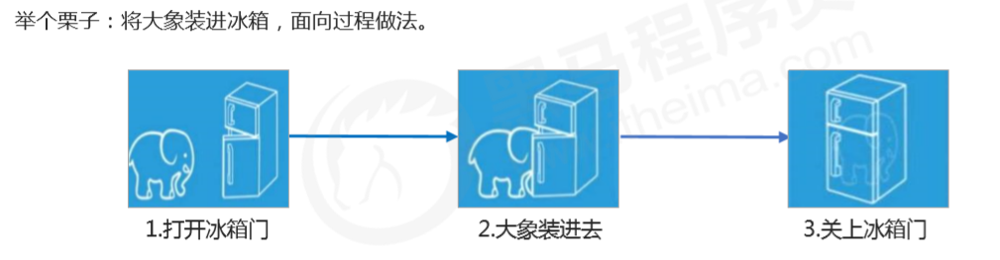
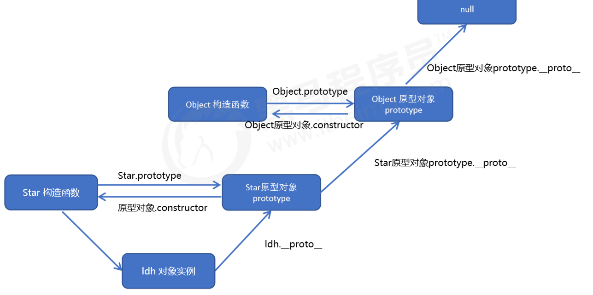
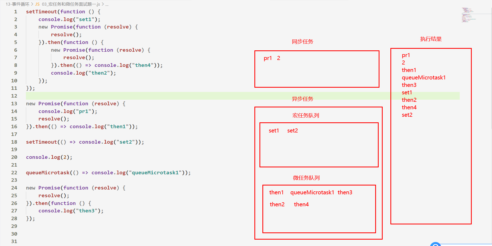

# 一、JavaScript 编程思想


## 1.1 面向过程编程

- 面向过程

  - ***面向过程***就是***分析出解决问题所需要的步骤，然后用函数把这些步骤一步一步实现***

  - 面向过程，就是***按照我们分析好了的步骤，按照步骤解决问题***

    

  

  

  


## 1.2 面向对象编程

- ***面向对象***

  - ***面向对象***是把事务***分解成为一个个对象***，***然后由对象之间分工与合作***

  - ***面向对象***是以***对象功能来划分问题***，***而不是步骤***

    

- ***面向对象的特性***： 

  - 封装性  

  - 继承性 

  - 多态性

    

- 面向对象的***思维特点***:  
  1. ***抽取***对象***共用的属性和行为组织(封装)成一个类(模板)*** 
  2. ***对类进行实例化, 获取类的对象***

- ***面向对象编程***考虑的是有哪些对象，按照面向对象的思维特点,***不断的创建对象,使用对象,指挥对象做事情***. 


## 1.3 两大编程思想的对比


## 1.4 面向对象版 tab 栏切换 
- 封装一个tab对象

  1. 该对象具有切换功能 
  2. 该对象具有添加功能 
  3. 该对象具有删除功能 
  4. 该对象具有修改功能

  - ```js
    class Tab {
        constructor(id) { 
            // 获取元素 只能获取到初始的元素，无法获取到后来创建的元素
            this.main = document.querySelector(id)
        }
    
        // 获取所有的li、section、删除选项
        updateEle() { }
    
        // 初始化操作，让相关元素绑定事件
        init() { }
    
        // 清除所有li和section的样式
        clearClass() { }
    
        // 1. 切换tab功能
        toggleTab() { }
    
        // 2. 添加tab功能
        addTab() { }
    
        // 3. 删除tab功能
        removeTab(e) { }
    
        // 4. 修改tab内容功能
        amendTab() { }
    }
    
    let tab = new Tab('#tab')
    ```


# 二、ES6新增的类


## 2.1 类的概念

- 什么是***对象***？
  
  - 在JS 中，**对象是一组相关属性和方法的集合**，所有的事物都是对象，例如字符串、数值、数组、 函数等 
  
  - 对象是由属性和方法组成的
  
    
  
- 什么是***类***？

  - 在 ES6 中新增加了类的概念，可以使用 class 关键字声明一个类，之后以这个类来实例化对象

  - **类的本质就是一个函数**，完全可以**看作构造函数的另一种写法**

  - 类有**prototype属性** 指向**原型对象**，类可以**通过原型对象添加方法**

  - 类的**原型对象**中有 **constructor 属性指向类本身**

    

- ***类抽象了对象的公共部分***，它***泛指***某一大类（class） ，比如手机

- ***对象特指某一个***，通过***类实例化一个具体的对象***，比如苹果手机

  

- 面向对象的***思维特点***:  
  1. 抽取对象***共用的属性和行为组织(封装)成一个类(模板)*** 
  
  2. ***对类进行实例化, 获取类的对象***
  
     

-  在 ES6 中***类没有变量提升***，所以***必须先定义类***，***才能通过类实例化对象***. 


## 2.2 类的创建

- **创建类**的语法：

  - ```js
     class Person {   
       constructor(name, age) {   // constructor函数 用于初始化对象的属性       
         this.name = name;       
         this.age = age;     
       }
     }
    ```

  -  通过class 关键字创建类，**类名遵循首字母大写**
  - **constructor() 方法是类的构造函数**，**用于传递参数，返回实例对象**，**通过 new 命令生成对象实例时 自动调用该方法。**

  - 语法规范：创建类 **类名后面不要加小括号**，**constructor构造函数不需要加function**

    

- ***通过类，实例化一个对象***

  - ```js
    let ldh = new Person('刘德华', 18);  
    console.log(ldh.name)
    ```

  - ***类必须使用`new`调用，否则会报错***
  
  

## 2.3 类中添加方法

- 在ES6之前，构造函数添加方法，需要通过**prototype属性**在**原型对象上添加方法**
- 而在ES6的类中**添加方法语法**  就相当于   **在原型对象中添加方法**，***语法更简洁***

- ```js
   class Person {   
     constructor(name,age) {   // constructor函数就是为了初始化对象的属性 
       this.name = name;       
     }
     // 类中添加方法
     say(song) {       
       console.log(this.name + song);    
     } 
  }
  // 通过类 创建实例对象
  let ldh = new Person('刘德华', 18);  
  ldh.say(‘李香兰’)
  ```
  - 规范起见，***类的共有属性，统一放到constructor构造函数中***

- ***类中方法之间不能加逗号分隔***，***同时方法不需要添加 function 关键字***

  

## 2.4 类的继承

- ***子类***可以***继承父类***的一些属性和方法

- 使用***extends关键字继承***

  - ```js
    class Father{   // 父类 }  
    class Son extends Father {  // 这样子类就继承了父类的属性和方法  }  
    ```

- 继承中的属性或者方法查找原则：***就近原则***
  - ***先看子类有没有这个方法,如果有就先执行子类的***
  - ***如果子类里面没有,就去查找父类有没有这个方法,如果有,就执行父类的这个方法***


- 子类必须在`constructor`方法中调用`super`方法，***否则新建实例时会报错***

  - ```js
    class Son extends Father{
      constructor() {
        super()   // 必须调用super方法
      }
    }
  let son = new Son()  
    ```
    
    

- ***super 关键字***

  - `super`这个关键字，既可以***当作函数使用***，也可以***当作对象使用***。在这两种情况下，它的用法完全不同

    

  - `super`***作为函数调用时***，***代表父类的构造函数***。ES6 要求，***子类的构造函数必须执行一次`super`函数***。

  - ***在子类的构造函数中***，只有调用`super`函数之后，才可以使用`this`关键字，***否则会报错***

  - 作为函数时，`super()`***只能用在子类的构造函数之中***，用在其他地方就会报错。

    - ```js
      class Son extends Father{
        constructor(x) {
          	super()     // 必须执行一次super函数，只有调用了super函数之后，才能使用this
            this.x = x
        }
      }
      let son = new Son()  
      ```

      

  - `super`***作为对象时***，可以***调用父类中的方法***

    - ```js
      class Father {
          say() {
            	console.log('我是爸爸');
          }
      }
      
      class Son extends Father{
          say() {
          		return super.say();  // 调用了父类中的say方法
          }
      }
      let son = new Son('刘德华')
      son.say()
      ```


## 2.5 类中的this指向

- ***constructor函数中的this***  指向的是 ***创建的实例对象***

  - ```js
    class Father {
       constructor() {
        	console.log(this)
      }
    }
    let father = new Father()  // constructor函数中的this  指向的是 father这个对象
    ```

    

- ***类中方法的this***   指向的是  ***这个方法的调用者***

  - ```js
            class Father {
                constructor() {
                    let btn = document.querySelector('button')
                    btn.onclick = this.bar
                }
                bar() {
                    console.log(this);   // 方法中的this指向的是这个方法的调用者
                }
            }
            let father = new Father()
            father.bar()
    ```

    
    
    

# 三、构造函数和原型


## 3.1 构造函数的概述

- ***构造函数是一种特殊的函数***，**主要用来初始化对象**，需要用**new关键字来调用构造函数**

  

- ***调用构造函数时***，会执行以下步骤
  - ① 在内存中创建一个新的空对象
  - ② 让 this 指向这个新的对象
  - ③ 执行构造函数里面的代码，给这个新对象添加属性和方法 
  - ④ ***返回这个新对象***（所以构造函数里面不需要 return ）

```js
        function Person(name, age) {
            this.name = name
            this.age = age
        }
        let ldh = new Person('刘德华', 18)
```


- **实例成员**：在构造函数内部通过this添加的成员 叫做**实例成员**，只能**通过实例化的对象来访问**

- **静态成员**：在构造函数本上添加的成员称为**静态成员**，只能由**构造函数本身来访问** 

  

## 3.2 构造函数的缺陷

- 通过构造函数来创建对象，**会存在浪费内存的问题**
  - 通过构造函数创建对象时，如果**对象中有方法**（复杂数据类型），会**重新开辟一个内存空间**用于存放该方法
  - 如果创建了多个对象，就会造成浪费内存的问题
  - 检验方法：比较两个对象中**复杂数据类型的地址值**是否相等


## 3.3 构造函数的原型

- JavaScript 规定，每一个**构造函数**都有一个 **prototype 属性**，该**属性值就是一个对象**，**这个对象的所有属性和方法，都会被构造函数所拥有**

  
- 通常把prototype的值，称为**原型对象**
- 一般情况下，**公共的属性定义到构造函数中**，**公共的方法定义到构造函数的原型对象上**，解决浪费内存的问题
- 原型对象的作用：
  
  - **共享方法，节约内存空间**

```js
        function Person(name, age) {
            this.name = name
        }
        Person.prototype.sing = function() {
            console.log('我会唱歌');
        }
        let person = new Person()
        let person2 = new Person()
        console.log(person.sing === person2.sing); // 比较的是内存地址  true
```


## 3.4 对象上的原型

- 问题：为什么使用构造函数创建的对象，能够使用构造函数中原型对象上的方法？

  - 每个使用**构造函数创建的对象**都会有一个属性：` __proto__ `，该属性指向的值就是构造函数的 **prototype 原型对象**

  - 对象查找方法的规则：**首先查找自身的方法**，**如果没有则去` __proto__ `属性中去查找方法**


## 3.5  原型对象中的constructor

- 每个**原型对象**里面都有一个 **constructor 属性** ，该属性值**指向的是构造函数本身**
- **constructor** 主要用于记录**当前对象是由哪个构造函数创建**的，它可以让**原型对象重新指向原来的构造函数** 

- 如果给**原型对象重新赋值了一个对象**，则必须设置 **constructor 指向原来的构造函数**

- ```js
          function Person(name) {
              this.name = name
          }
          Person.prototype = { // 相当于把原先的属性与方法全都覆盖掉，此时没了constructor
              sing: function() {
                  console.log('我会唱歌');
              },
              movie: function() {
                  console.log('我会演电影');
              },
              constructor: Person // 重新指向原来的构造函数
          }
          let person = new Person()
          console.log(person.__proto__);
  ```

  

## 3.6 原型链

- JS中属性和方法的的**查找机制**（**就近原则**）

  ​	① 当访问一个对象的属性（包括方法）时，**首先查找这个对象自身有没有该属性**。 
  ​	② 如果没有就查找**实例上的原型**
  ​	③ 如果还没有就查找**原型对象的原型**
  ​	④ 原型对象的意义就在于**为对象成员查找机制提供一条路线**

- Object的原型对象，就是**原型链的尽头**，因此我们可以往**原型链的尽头添加共享方法**





## 3.7 原型对象中的this指向

- 什么是原型对象？

  - 构造函数中的**prototype属性值**是**原型对象**

  - 实例对象中的`__proto__`属性值是**原型对象**

    

- 构造函数中的this **指向的是实例对象**

- 原型对象中，我们一般添加共享的方法，而这些方法中的this，**指向的是方法的调用者**

  - ```js
        Person.prototype = {
          sing: function() {
            console.log(this); // 谁调用了该方法 this就指向谁
          }
        }
    ```

    

## 3.8 构造函数的继承

- call（）方法

  - ```js
    函数名.call(thisPoint, arg1, arg2, ...)
    ```

  - call（）可以**调用函数**，并且修**改函数运行时的 this 指向** 

  - thisPoint：当前调用函数 **this 的指向对象** 

  - arg1，arg2：传递的其他参数

  - ```js
    function bar(x, y) {
        console.log(this.name); // 张三 
        console.log(x + y);  // 100
    }
    let obj = {name: '张三'}
    bar.call(obj, 50, 50)  // 修改了bar函数的this指向，指向为obj对象，并且调用函数
    ```

    

- 继承父类属性

  - 核心原理： 通过 call() 把父类型的 **this 指向修改为子类型的 this** ，这样就可以实现子类型**继承父类型的属性**

  -  

    ```js
    function Father(name, age) {
        this.name = name
        this.age = age
    }
    
    function Son(name ,age, sex) {
        Father.call(this, name, age) // 调用Father构造函数，父类的this指向修改为子类
        this.sex = sex
    }
    let son = new Son('张三', 18, '男');     
    console.dir(son);
    ```

    

- 继承父类方法

  - 构造函数中的**方法**一般都是**定义在原型对象上**

  - **① 子类的 prototype 原型对象 = new 父类()**   
    ② 将子**类的 constructor 从新指向子类的构造函数** 

    

  - ```js
    // 父类构造函数
    function Father(name, age) { }
    
    // 父类的方法
    Father.prototype.say = function() {
    		console.log('我是爸爸会唱歌');
    }
    
    // 子类构造函数
    function Son() { }
    
    // 把创建的Father实例对象的地址值 赋值给了 Son原型对象
    Son.prototype = new Father() 
    
    // 给原型对象赋值给一个新的对象，需要设置constructor属性
    Son.prototype.constructor = Son
    
    // 子类的方法
    Son.prototype.exam = function() {
    		console.log('我是儿子会考试');
    }
    
    let son = new Son()
    son.exam()
    son.say()
    ```

    
    
    

# 四、ES5新增的数组方法


## 4.0 数组新增方法的参数解析

- `function`：为数组中每个元素**执行的函数**，该函数接收一至三个参数

  - `currentValue`（必选）：数组中正在处理的当前元素

  - `index`（可选）：数组中正在处理的当前元素的索引
  - `arr`（可选）：正在操作的数组


## 4.1 Arrary.foreach()

- foreach() 方法：**遍历当前的数组**

  - ```js
    array.forEach(function(currentValue, index, arr))
    ```

  - foreach() 方法**没有返回值**，**会改变原来的数组**

  - ```js
  let arr = [1,2,3]
    arr.forEach((value, index) => {
    		console.log(value, index);
    })
    ```
  
  
  
- foreach()实现原理：

  - ```js
    Array.prototype.myforeach = function(callback) {  
      // 通过for循环  来调用传入进来的函数
      for(let i = 0; i < this.length; i++) {   // this指向的是方法的调用者
        callback(this[i], i)  // 执行传递进来的回调函数，并且传递实参
      }
    }
    ```

    

## 4.2 Arrary.filter()

- filter() 方法：**筛选原数组的元素返回一个新数组**

  - ```js
    let newArr = array.filter(function(currentValue, index, arr))
    ```

  - filter() 方法中的回调函数有一个要求：**必须返回一个布尔值**

  - 如果返回的值是**true**，**则将数组中正在处理的当前元素放入到新数组，继续下一次的迭代**

  - 如果返回值为**false**，**则直接开始下一次的迭代**

  - ```js
  let arr = [112,1561,231561231,7]
    let nreArr = arr.filter(function(v) {
    		return v < 10 // 返回值为true时，会将匹配到的元素放入到新数组中，继续下次的遍历
    })
    ```
    
    
  
- filter方法实现原理：

  - ```js
    Array.prototype.myfilter = function (callback) {
      let newArr = []   // 此方法需要返回一个新数组
      for (let i = 0; i < this.length; i++) {
        // 核心：先执行传递过来的回调函数
        // 如果返回值为false，进入下一次循环，如果返回值为true则把元素添加到新数组中
        callback(this[i], i) && newArr.push(this[i])
      }
      return newArr
    }
    ```


## 4.3 Arrary.some()

- some()：查找数组中是否有满足条件的元素，返回值是一个布尔值

  - ```js
    let flag = array.some(function(currentValue, index, arr)) 
    ```
    
    - some()方法中的回调函数有一个要求：**必须返回一个布尔值**
  
    - **如果回调函数的返回值为true时，结束迭代，并且返回值为true**
  
    - **如果回调函数的返回值为false时，继续下一次的迭代，如果遍历完数组没有返回true，则该方法的返回值是false**
  
    - ```js
      let arr = [112,1561,231561231,7]
      let flag = arr.some(function(v) {
        		return v < 10 // 当return中的值为true时，直接返回true
      })
      ```
  
      
  
- some方法**实现原理**：

  - ```js
    Array.prototype.mysome = function (callback) {
      let flag  // 返回一个布尔值
      for (let i = 0; i < this.length; i++) {
        callback(this[i], i) ? flag = true : flag = false
        if (flag) {
          break
        }
      }
      return flag
    }
    ```

  >如果用一个**空数组**进行测试，在任何情况下它返回的都是`false`。
  >
  
  
  
  
  
  

## 4.4 Array.map()

- map()：**创建一个新数组**，**新数组中的元素为回调函数的返回值**

  - 非常有用，多数用于**重新整理数据结构**
  
  - ```js
  let newArr = array.map(function(currentValue, index, arr)) 
    ```

  - map()方法中的回调函数有一个要求：**必须要有返回值(return)**。每次`return`后的值都会作为新数组的元素

  - ```js
  let arr = [123,123,51,2,3,5,10,10]
    let newarr = arr.map(function(value, i) {
    		return value * 2  // 每进行一次迭代，就会把回调函数的返回值，放入到新数组中
    })
    ```
  
    
  
- map 方法的原理：

  - ```js
    Array.prototype.mymap = function (callback) {
      // map方法需要返回一个新数组
      let newArr = []
    
      for (let i = 0; i < this.length; i++) {
        let items = callback(this[i], i)  // 调用传递进来的函数，并且接受他们的返回值
        newArr.push(items) // 将返回值添加到新数组中去
      }
      return newArr
    }
    ```


## 4.5 for ..of...

- 当我们只想要**遍历数组中的元素时**，可以通过`for of语法`实现

  - ```js
    let arr = [1, 2, 3]
    for(let value of arr) {
    	console.log(value);  // 1, 2, 3
    }
    ```

    

## 4.6 Array.reduce()

- 语法`arr.reduce(callback(pre, items, [index]), 0)`
    - `pre`：是上一次遍历时，回调函数的返回值，初始化是0
    - `items`：当前遍历的每一项 
    - `reduce`方法必须要有一个返回值，最后一次遍历时回调函数的返回值，就是该方法的返回值

    - ```js
        let a = [1, 2, 3, 5, 4, 8, 4,]
        let result = a.reduce((pre, value) => {
        		console.log(pre); // pre为上一次回调函数的返回值，初始值为0
        		return pre + value
        }, 0)
        console.log(result);  // 27
        ```

        


# 五、函数进阶


## 5.1 函数的定义和调用

### 5.1.1 函数的定义方式

- 命名函数 （**用的最多**）

  - ```js
    function bar() {}
    ```

- 匿名函数表达式

  - ```js
    let bar = function() {}
    ```

    

- new Function()  ------ **基本不用**

  - ```js
    let fn = new Function('参数1','参数2'..., '函数体') 
    
    let fn = new Function('x','y', 'console.log(x + y)') 
    fn(1,2)
    ```

  - Function 里面参数都必须是**字符串格式** 
  - ***所有的函数都是Function构造函数的实例对象***
  - 因此每个函数都有`__proto__`属性，***该属性值就是Function构造函数的原型对象***
  - 


### 5.1.2 函数的调用方式

- 普通函数 

  - ```js
    function fn() {}
    fn()  // 调用函数
    ```

- 对象的方法 

  - ```js
    let obj = {
    		getName: function() {}
    }
    obj.getName()  // 调用对象上的方法
    ```

- 构造函数 

  - ```js
    function Person() {}
    let person = new Person()  // 调用构造函数 需要用new关键字，返回一个对象
    ```

- 绑定事件函数 

  - ```js
    btn.onclick = function() {}  // 这是回调函数，当触发点击事件时自动调用函数
    ```

- 定时器函数 

  - ```js
    setInterval(function() {
    		alert('test')   // 回调函数，每3秒自动触发一次该函数
    }, 3000)
    ```

- 立即执行函数

  - ```js
    ;(function() {
    		alert(123)  // 当页面加载完成后，自动调用函数
    })()
    ```

    

## 5.2 函数中的this

### 5.2.1 函数中的this指向

- 一般情况下，**函数中的  this指向  的是  函数的调用者**
- 改变函数内部 **this 指向** ，常用的有 **bind()、 call()、apply() 三种方法**。 


### 5.2.2 fn.call()

- call()

  - call() 方法可以**调用一个函数** 并且 **改变函数的 this 指向**

  - ```js
    fun.call(thisArg, arg1, arg2, ...)  
    ```

  - thisArg：**设置 fun 函数内部的 this指向**

  - arg1，arg2：传递的其他参数 

  - **返回值 就是函数的返回值**

  - 构造函数上属性的继承 就是通过 call() 实现的

  - ```js
    let obj = {name: '张三'}
    function bar(x, y) {
        console.log(x, y);  // 1, 10
        console.log(this);  // obj
    }
    bar.call(obj, 1, 10)  // bar函数中的this指向了obj
    ```

    


### 5.2.3 fn.apply()

- apply() 方法可以**调用一个函数** 并且 **改变函数的 this 指向**

- ```js
  fun.apply(thisArg, [argsArray])
  ```

  - thisArg：**设置 fun 函数内部的 this指向**
  
  - argsArray：传递的值，**必须包含在数组里面**，函数的***形参对应的就是数组中的值***
  
  - **返回值 就是函数的返回值**
  
- ```js
  let obj = {name: '张三'}
  function bar(x, y) {
      console.log(x, y);  // 1, 10
      console.log(this);  // obj
  }
  bar.apply(obj, [1, 10])  // bar函数中的this指向了obj，传递的实参必须是以数组形式
  ```

  
  

### 5.2.4 fn.bind()

- bind() 方法**不会调用函数**。但是能**改变函数内部this 指向**

- bind() 方法**有返回值**。**返回一个 修改this指向后 的新函数**

- ```js
  let newFun = fun.bind(thisArg, arg1, arg2, ...)                    
  ```

- ```js
  for(let i = 0; i < btn.length; i++) {
      btn[i].onclick = function() {
        this.disabled = true
  
        setInterval(function() {
          this.disabled = false// 由于定时器中的this指向的window对象，我们需要修改指向
        }.bind(this), 3000)
      }
  }
  ```

  


### 5.2.3 call  apply  bind 总结 

- 相同点:   

  - **都可以改变函数内部的this指向**. 

- 区别点:   

  - call 和 apply  **会调用函数**, 并且**改变函数内部this指向**

  - call 和 apply **传递的参数不一样**， **apply 必须数组形式[arg]传递参数** 

  - **bind  不会调用函数**，**可以改变函数内部this指向.** 

    

- 主要应用场景:   

  1. call 经常用于**构造函数的继承.**  
  2. apply 经常**跟数组有关系.**
  3. bind  多数用于**修改回调函数中的this指向**


## 5.3 闭包

### 5.3.1 闭包的概念

- ***闭包（closure）指有权访问另一个函数作用域中变量的函数***

- **被访问的变量所在的函数就是一个闭包函数**

- ```js
  function bar() {
      let num = 10
      function foo() {
      		console.log(num); // foo函数访问了bar函数中的变量，bar就是一个闭包函数
      } 
  }
  ```

- 开发中尽量少用闭包，闭包容易造成内存泄漏，***学习闭包主要是为了应付面试题以及解释一些现象***


### 5.3.2 闭包的作用

- 闭包作用：***延伸变量的作用范围***

  


### 5.3.3 闭包引发的思考


- 如果我们想要***打印当前点击按钮的索引值***，怎么完成？

  - 可以通过立即执行函数 + 闭包实现

  - 

    

- ***为什么***通过***立即执行函数 + 闭包*** 能够获取到当前点击按钮的索引？
  
  - 首先我们知道***立即执行函数******只会被调用一次***，每执行一次循环，就会把***i的值存入到立即执行函数中***
  - 当打印i时，***会从上一级函数作用域下查找i***这个变量(***闭包现象***)
  - 其次，再次继续循环时，**无论外部的i如何变化**，**打印的i永远都只是上级函数作用域下的i**
  - 核心原理：通过立即执行函数 + 闭包 ***产生了一个作用域***，***让i的值不指向全局作用域***
  - 


## 5.4 递归

- 如果一个***函数在自身内部可以调用其本身***，那么这个函数就是**递归函数**

  - ```js
    function bar() {
        console.log(1);
        bar() // 在自身函数内部，调用了其本身,此时bar就是一个递归函数
    }
    bar() 
    ```

- **递归函数必须要有退出条件(return)，否则将会死循环**

- 开发中尽量**避免递归调用**

- ***递归调用如果没有写好结束条件，意味着会无限调用***

- ***递归调用非常占据栈空间的内存，效率还非常低***

  


# 六、正则表达式


## 6.1 正则表达式的概述

- 正则表达式是***用于匹配字符串中字符组合的模式***。在 JavaScript中，***正则表达式也 是对象***

- 学习正则表达式主要是***用于进行表单验证***

- 正则表达式的特点
  - 灵活性、逻辑性和功能性非常的强
  - 实际开发，一般都是***直接复制写好的正则表达式***。
  - 需要能**看得懂正则表达式**，对一些细节进行修改


## 6.2 正则表达式的创建

- 方式一： ***通过调用 RegExp 对象***的构造函数创建 

  - ```js
    let 变量名 = new RegExp(/正则表达式/)
    ```

- 方式二：通过字面量创建 

  - ```js
    let 变量名 = /表达式/;
    ```

    

## 6.3 正则表达式的使用

- 正则表达式主要是***创建一个匹配字符串的规则***

- test() 方法

  - 正则对象有test(param) 方法，用于***检测字符串是否符合该规则***，***返回值是布尔值***，其***参数是字符串*** 

  - ```js
    let flag = regexObj.test(str)  
    ```

  - regexObj 是写的***正则表达式*** 
  2. str 我们要测试的***文本*** 
  3. 检测str文本***是否符合我们写的正则表达式规范***，返回布尔值


## 6.4 正则表达式中的特殊字符

- 边界符

  - 正则表达式中的***边界符用来提示字符所处的位置***，主要有两个字符。

  - 

  - 如果 ^ 和 $ 在一起，表示必须是***精确匹配***

    

- 方括号

  - 方括号表示有一系列字符可供选择，***只要匹配其中一个就可以了***

  - ```js
    // 字符串只要包含 abc 中任意一个字符，都返回 true 
    /[abc]/.test('andy')     // true  
    ```

- 范围符

  - ```js
     /^[a-z]$/.test('c')     // true
    ```

  - 方括号内部加上 - 表示范围，这里表示 a 到 z 26个英文字母都可以

- 取反符

  - ```js
    /[^abc]/.test('andy')     // false
    ```

  - 方括号内部加上 ^ 表示取反，***只要包含方括号内的字符***，都返回 false 

-  字符组合

  - ```js
     /[a-z1-9]/.test('andy')     // true 
    ```

  - 方括号内部可以使用***字符组合***，这里表示包含 a 到 z 的26个英文字母和 1 到 9 的数字都可以

    

- 量词符
  - 量词符用来设定某个模式***出现的次数***
  - 


- 简写模式
  -  


## 6.5 正则表达式中的替换

- ***replace() 方法***可以实现替换字符串操作，用来替换的参数可以是一个***字符串***或是一个***正则表达式***。

  - ```js
    let newstr = stringObject.replace(regexp/substr,replacement)
    ```

  - 第一个参数:   被替换的字符串 或者  正则表达式 
  - 第二个参数:   ***替换为的字符串*** 
  - 返回值是一个替换完毕的新字符串 

  

- 正则表达式修饰符

  - ```js
    /表达式/[switch] 
    ```

  - switch(也称为修饰符) 按照什么样的模式来匹配. 有三种值： 
  - g：全局匹配  
  - i：忽略大小写  
  - gi：全局匹配 + 忽略大小写

  

## 6.6 匹配没有数字的字符串并提取

- ```js
    let title = 'aaa123456'
    let reg = /\D*/
    title = title.match(reg).join('')
    console.log(title); // aaa
    ```

    


# 七、ES5新增的对象方法

## 7.1 Object.defineProperty()

- `Object.defineProperty()`：**定义对象新属性或修改原有的属性值**，并返回此对象

- ```js
    Object.defineProperty(obj, prop, descriptor)
    ```

    - **obj**：目标对象  

    - **prop**：要定义或修改的属性的名称

    - **descriptor**：要定义或修改的**属性描述符**。以对象形式书写

    

- **descriptor**可填配置选项

    - `enumerable:`：如果为false，则该对象的属性不允许遍历，**默认值是false**
    
    - `configurable`:：**目标属性是否可以被删除或是否可以再次修改特性** true | false  **默认值为false**
    
    - `value`：设置属性的值 
      
    - `writable`：属性值是否可以重写。true | false  **默认为false**
    
    - `get`函数。当**访问目标属性**时，会调用此函数。该函数的返回值会被用作属性的值。
      
    - `set`函数，当**目标属性值被修改**时，会调用此函数。该方法接受一个参数（也就是被赋予的新值)
    
    - **set函数会比get函数先被调用**
    
      ​    
    
- ```js
  var obj = {name: '张三', age: 18}
  name.sex = '男'  // 以前添加和修改对象属性的方式
  
  Object.defineProperty(obj, 'sex', {
      writable: false,   // 不允许修改这个属性值   默认值为false
    	enumerable: false,  // 如果为false，则不允许遍历，默认值是false
    	configurable: false  // 默认值为fasle，属性不可以被删除
  })
  name.sex = '女'    // 无效
  ```

  

## 7.2 Object.keys()

- Object.keys() 方法：用于遍历对象的属性名，**返回一个由属性名组成的数组**

- 类似于for in 遍历对象

  - ```js
    var objName = Object.keys(obj)  // 返回一个由属性名组成的数组
    ```

     

    

# 八、JS的执行机制


## 8.1 进程和线程的概念

- 进程和线程的概念：
    - 进程：我们可以认为，启动一个**应用程序**，就会默认启动**一个进程**（也可能是多个进程）
    - 线程：每一个进程中，都会启动一个**线程**用来**执行**程序中的**代码**，这个线程被称之为主线程
    - 所以我们也可以说进程是线程的容器


## 8.2 JavaScript的单线程

- JavaScript是一门***单线程的语言，***执行JavaScript代码**只在一个单独的线程中**执行

    - ***也就是说，同一个时间只能做一件事***

      

- 单线程意味着：如果在同个时间有多个任务的话，这些任务就需要进行排队，前一个任务执行完，才会执行下一个任务，如果有其中一个任务执行时间过久，就会**导致页面堵塞**

    

- 为了解决单线程问题，**js将执行的任务分成了 同步任务 和 异步任务**

- 而其中**异步任务**又分为了**宏任务**和**微任务**

    

    

## 8.3 同步任务和异步任务

- 同步任务

    - **同步任务是指在主线程（执行栈）上排队执行的任务**，只有前一个任务执行完毕，才能继续执行下一个任务

    - 当我们打开网站时，网站的渲染过程、元素的渲染，其实就是一个同步任务

        

- 异步任务

    - **异步任务**不进入主线程(执行栈)、而是先进入**异步进程处理**，当异步任务执行完毕就会进入**"任务队列"**中

    - **当主线程上的任务执行完毕**，就会去**任务队列中**取出异步任务，**然后放在主线程上执行**，这个过程称为'**事件循环**'

    - 像回调函数，什么时候被回调，这就是一个异步任务

        

- **总结：JavaScript中优先执行所有的同步任务，当同步任务执行完成后，在执行异步任务**

    


## 8.4 JS的执行机制流程图


```
（1）所有同步任务都在主线程上执行，形成一个执行栈（execution context stack）。

（2）主线程之外，还存在一个"任务队列"（task queue）。只要异步任务有了运行结果，就在"任务队列"之中放置一个事件。

（3）一旦"执行栈"中的所有同步任务执行完毕，系统就会读取"任务队列"，看看里面有哪些事件。那些对应的异步任务，于是结束等待状态，进入执行栈，开始执行

（4）主线程不断重复上面的第三步。
```


## 8.5 宏任务和微任务

- **异步队列**中要执行的任务又分为了两类：**宏任务**和**微任务**

    - 宏任务队列（macrotask queue）：ajax、setTimeout、setInterval、DOM监听、UI Rendering等 

    - 微任务队列（microtask queue）：Promise的then回调、 Mutation Observer API、queueMicrotask()等

        

- 那么异步队列中宏任务和微任务的**优先级**又是怎样的？
    1. 先执行**同步任务**
    2. 执行异步队列中的**微任务队列**
    3. 当微任务队列执行完毕后，在执行**宏任务队列**


- 宏任务微任务补充：
    - 可以将await关键字后面执行的代码，看包裹在`(resolve,reject) => {函数执行}`中的代码
    - awiat的下一条语句，可以看做是`then(res => {函数执行})`中的代码
    - 总结：**await()这个过程是同步的**，a**wait的下一条语句会放到异步队列的微任务中**
    - 注：使用`async`声明的函数，在调用时，**依旧是同步任务**，不会变成异步任务


- 宏任务和微任务**面试题**

    


## 8.6 循环中绑定事件


- 代码如上图所示，**问题：为什么打印是3**？

    - 首先，我们需要知道JS中执行任务的顺序（同步任务和异步任务），优***先执行同步任务，然后在执行异步任务***

    - ***js中所有的事件绑定所对应的回调函数都是异步任务***

    - 当绑定onclick事件后，不需要等待执行，继续执行下一个循环任务，每进行一次循环任务，全局变量的i都在不断的变化

    - 当点击的时候，外层循环已经结束，然后执行 console.log(i) 时，由于i不是私有变量，***便会找到上一级window作用域全局的i***，最终打印的i会指向全局变量的i，所以输出是3

      ​    

- **问题：为什么会出现上图中的情况？**

    - 在for循环中使用var声明的变量是没有块级作用域的，只有全局作用域，***也就是说每一次循环，用var声明的变量不会保存到本次循环中，而是保存到全局作用域***

      ​    

    - 模拟上图中**for循环的基本流程**

        - 

          ​    

    

- **问题：为什么使用let声明变量可以解决问题？**

    - 使用｛｝包裹起来的代码我们称之为代码块，{}里面就是块级作用域

    - ***let声明的变量具有块级作用域，也就是说每一次循环 使用let声明的变量 会保存到本次循环体中，而本次循环体就是一个块级作用域***

    - 当访问变量时，**优先访问自身作用域的下的变量**，所以此时的i并不是外部全局变量下的i

    - 模拟for循环中使用let初始化变量的流程：

        

        

        

        

## 8.7 循环中按顺序处理异步任务

>如果希望在循环中**按顺序依次处理**异步任务，最好使用 **await + for** 循环，而**不是 await + forEach循环**
>


- 使用**await + for**循环可以**按照顺序依次处理异步任务**

    


>坑：使用**await + forEach**循环***无法***  **按照顺序依次处理异步任务**
>

- 首先需要了解forEach的实现原理

    - 由下图可知，forEach方法中传入的**回调函数是按顺序依次执行**的

    - 但是，即使回调函数**函数体**中有await，也不会阻止回调函数的执行

    - **await只会阻塞当前函数体内代码的执行**

        


# 细节补充

## 1. 语法糖

- 什么是语法糖？
  - **语法糖就是一种便捷的写法**，如果有两种方法可以实现同一种功能， 但是其中一种写法更简洁、方便，那么这个方法就是语法糖
  - ES6中的**类就是一个语法糖**


## 2. JS中的严格模式

- 什么是严格模式？

  - **ES5 的严格模式是采用具有限制性 JavaScript 变体的一种方式，即在严格的条件下运行 JS 代码** 

  - **消除了 Javascript 语法的一些不合理**之处，减少了一些怪异行为。 

  - 提高编译器效率，**增加运行速度**。 

  - 禁用了一些语法，为未来新版本的 Javascript 做好铺垫。比 如一些**保留字如：class, enum, export, extends, import, super 不能做变量名**

    

- 如何**开启严格模式**

  - **为整个脚本 (script标签) 开启严格模式**，只需要在所有语句之前放一个特定语句***'use strict'***

    - ```js
      <script>
        "use strict"
      </script>
      ```

  - **为函数开启严格模式**，严格模式只作用于当前的函数体

    - ```js
      function bar() {
      		"use strict"
      }
      ```

  - ***开启严格模式的作用域，必须要安装严格模式的规范来写代码***

    

- 严格模式下的规范

  - 变量都必须先用 var、let、const 命令声明，然后再使用，否则报错
  -  严禁删除已经声明变量。例如，delete x; 语法是错误的
  - **严格模式下**全局作用域中**函数中的 this 是 undefined** 
  -  严格模式下，**构造函数必须通过new调用** 

  - **函数中不能有相同名字的形参**

  - **在非函数的代码块中声明函数是没有效果的**

    

- 更多严格模式要求参考：https://developer.mozilla.org/zh-CN/docs/Web/JavaScript/Reference/Strict_mode 


## 3. 高阶函数

- **高阶函数是对其他函数进行操作的函数**，它**接收函数作为参数**或将**函数作为返回值**输出

  

  - 此时的***fn就是一个高阶函数***


## 4. 浅拷贝和深拷贝

- 浅拷贝：

  - ```js
    Object.assign(target, sources)
    ```

  - target：要拷贝的目标对象 

  - sources：被拷贝的对象

  - 修改了目标对象身上的复杂数据类型数据，**原来被拷贝对象的数据也会发生变化**

    ​    

    ​    

- 深拷贝(**递归实现**)：

  - 深拷贝把里面的数据***完全复制一份给目标对象*** 如果里面有不冲突的属性,***会合并到一起*** 

  - 在原生JS中没有给我们提供深拷贝的API，***因此需要手写***

  - ```js
    		function deepClone(ladel){
                var obj = {}
                for(var i in ladel){
                    if(typeof ladel[i] == "object"){
                        obj[i] = copy(ladel[i])//递归
                    }else{
                        obj[i] = ladel[i]
                    }
                }
                return obj
            }
    ```

    
  	​	
  
- 深拷贝(**粗暴方法**)：

  - ```js
    var obj = { a: {a: "hello"}, b: 33 };
    // 将obj对象深拷贝到newObj对象上
    var newObj = JSON.parse(JSON.stringify(obj)); 
    console.log(newObj);
    ```


​    


## 5. 防抖函数

- 防抖函数(**debounce**)的介绍
  
  - 如果一个事件被频繁触发多次，并且触发的时间间隔过短，则**防抖函数可以使得对应的事件处理函数只执行最后触发的一次**。
  
- ***防抖函数***的教程：https://zhuanlan.zhihu.com/p/71532099

- ***实现防抖函数***

    - ```js
        function debounce(func, time) {
          let timer;
          return function(...arg) {
            // 注意这里是清除上一次缓存的旧timer
            clearTimeout(timer);
            timer = setTimeout(() => {
              func.apply(this, arg);
            }, time);
          };
        }
        ```

​        

- ***使用防抖函数***

    - ```js
        const suggest = () => {
          console.log('fetch')
        }
        
        const debounceSuggest = debounce(suggest, 500)
        
        let inputSearch = document.getElementById('search')
        inputSearch.addEventListener('input', () => {
          console.log('input')
          debounceSuggest()
        })
        ```

    - 这里将 `suggest` 函数传入 `debounce` 函数，并设置延迟时间为 500 毫秒。 `debounce` 返回的函数赋给 `debounceSuggest` , 然后在搜索框 `inputSearch` 的 `input` 事件回调中执行 `debounceSuggest`.


- 防抖函数的总结：**将一定时间内的多次操作，减少为一次，去除冗余，节约资源。**


- **防抖函数使用场景**
    - 


