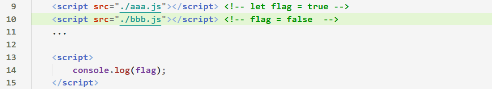

# 一、ES6的概述

## 1.1 什么是ES6？

- ***ES 的全称是 ECMAScript*** , 它一项***脚本语言的标准化规范***

- ***ECMAScript是JavaScript的组成部分***，前者是后者的规格，后者是前者的一种实现

- 每年6月份，都会发布一个小版本（小语法的变革）

  

  

- ***ES6 实际上是一个泛指，泛指  ES2015 及后续的版本***，**ES6也称为ESnext**

  

- ES6`参考文档`：https://es6.ruanyifeng.com/


## 1.2 为什么要学习ES6?

- 在***早期的ECMAScript中，很多语法存在着缺陷，ES6的推出，就是为了解决这方面的缺陷***

- ***ES6***中推出了许多***简写方式***，提高程序员开发效率，同时***统******一代码规范***

  

## 1.3 ES6的运行环境

- **在老版本的浏览器中，并不是完全支持ES6的写法**，通过后期学习到的webpack、babel，可以完全把ES6代码转换为ES5代码提供给浏览器支持

- **谷歌浏览器、火狐浏览器**基本完全支持ES6写法


# 二、新增的变量声明


## 2.1 块级作用域

- 在ES6之前，JavaScript***只有全局作用域和函数作用域***，ES6**新增了一个块级作用域**
  
  - 在花括号｛｝内属于**块级作用域**
  
- 常见的块级作用域：***for循环、if语句***
  
  ​    
  
- 使用***let、const关键字***声明的变量**才具有块级作用域**，使用**var声明的变量不具备块级作用域特性** 


## 2.2 let

- **以后声明变量用let**  放弃var，var可以看做是一个语法缺陷

- 使用***let声明的变量具有块级作用域***，外部无法访问以及修改

  - ```js
    for (let i = 0; i < 10; i++) {
    		let b = 10
    }
    console.log(i);  // i is not defined
    console.log(b);  // b is not defined
    ```
    
    

- 使用***let声明的变量不存在变量提升***

  - ```js
    console.log(b);  // undefined
    console.log(a);  // Cannot access 'a' before initialization
    let a = 0
    let b = 0
    ```

  - 注意：**使用let声明的变量  凡是在声明之前就使用这些变量，就会报错**

  

- **let声明的变量具有暂时性死区特征**

  - 只要***块级作用域***内存在`let`命令，它所声明的变量就***“绑定”这个区域***，**不再受外部的影响。**

  - ```js
    let a = 123
    if (true) {
        a = 456  // 在代码块内，只要let声明的变量，在声明之前使用，都会报错
        let a = 123
    }
    ```
    
    

- `let`***不允许在相同作用域内，重复声明同一个变量***

  - ```js
            if (true) {
                let a
                let a  // Identifier 'a' has already been declared
            }
            console.log(a) 
    ```

    

- 注意：**for循环里面的初始化变量是存放在上一级的块级作用域下**

  - ```js
    for (let i = 0; i < 2; i++) {
    		let i = 10
    }
    
    // 模拟for循环的执行流程如下
    {
      let i = 0 
      {
        let i = 10
      }
    }
    
    {
      let i = 1
      {
        let i = 10
      }
    }
    ```

  - 因此，在for循环中，声明一个和初始化变量一样名字的变量，是不会有冲突的，**因为不在同一个作用域下**

  


## 2.3 const

- 常量：不能被修改的值

- `const`***声明一个只读的常量***。一旦声明，***常量指向的那个内存地址***所保存的数据**无法修改**。

  - ```js
    const a = 10
    a = 20  // Assignment to constant letiable
    console.log(a);
    
    const obj = {name: '张三'}
    obj.name = 123
    console.log(obj);  // 正常输出
    ```

    

- ***使用const声明的常量就必须立即初始化***，不能留到以后赋值

  - ```js
    const a  // Missing initializer in const declaration
    console.log(a);  
    ```


- **const声明的常量的其余特征**

  - 使用const声明的变量具有**块级作用域**
  - 使用const声明的变量**不存在变量提升**
  - const声明的变量具**有暂时性死区特征**
  - `const`不允许在相同作用域内，重复声明同一个变量


## 2.4 变量声明的总结

- 以后用**let代替var**声明变量
- **const**主要用于声明一些不可用被更改的值，比如网络ip地址

- 


# 三、解构赋值

## 3.1 什么是解构赋值？

- ES6 ***允许按照一定模式***，**从数组和对象中提取值**，**对变量进行赋值**，这被称为***解构***

- **解构赋值**的写法属于“**模式匹配**”，只要等号两边的模式相同，**左边的变量就会被赋予对应的值**

- 在解构赋值中**如果等号的右边不是可遍历的结构**，那么将会**报错**

  - ```js
    // 报错
    let [foo] = 1;
    let [foo] = false;
    let [foo] = NaN;
    let [foo] = undefined;
    ```

- 在解构语法下，= **左右两边的结构格式要保持一致**
- 在解构赋值的语法下如果左边的**变量名没有对应的值**，则默认**值为undefined**


## 3.2 数组的解构赋值

- **数组**的解构赋值写法：

  - ```js
    let [a, b, c, d, e] = [1, 2, 3, 4]
    ```
    
  - 上面代码表示，可以**从数组中提取值，按照对应位置，对变量赋值。**

  - 变量e没有对应的值，值为undefined

  - 注意：等号左右两边的**结构格式(模式匹配)一定要保持一致**

    


##3.3 对象的解构赋值

- **对象**的解构赋值写法：

  - ```js
    let { name, age, sex, say} = { name: '张三',age: 18, sex: '男 '}
    ```

  - 在对象的解构赋值下，**左边模式中的变量名必须与右边模式中对象的属性名相同**，才能取到正确的值

  - 变量say没有对应的值，值为undefined

  

- 如果我们想让左边模式中的变量名，与解构对象中的属性名不一致，则需要用到**别名语法**

  - ```JS
    let { name: myName, age: myAge } = { name: '张三',age: 18 }
    ```
  
  - 上图代码中，**真正被赋值的是myName这个变量**
  
    
    
    

## 3.4 函数参数的解构赋值

- 函数的参数也可以使用***解构赋值语法***
    - ```js
        function add([x, y]){
          return x + y;
        }
        
        add([1, 2]); // 3
        
        function foo({ name }) { // 相当于在函数体中 let name = obj.name
          return name 
        }
        
        let obj = { name: '张三' }
        foo(obj) // 张三
        ```

        

    

    

## 3.5 解构赋值指定默认值

- 解构赋值允许左边的变量**指定一个默认值**

  - ```js
    let [foo = true] = [];
    foo // true
    
    let [x, y = 'b'] = ['a', undefined]; // x='a', y='b'
    ```

  - 只有左边的变量的值为undefined时，默认值才会生效

      

- 注意：如果右边模式下有个成员是`null`，默认值就不会生效

  - ```js
    let [x = 1] = [null];
    x // null
    ```

  

## 3.6 解构赋值的应用场景

- 交换变量的值

  - ```js
    let a = 1;
    let b = 2;
    
    [a, b] = [b, a]
    ```

- 接收函数返回的多个值

  - ```js
    function example() {
      return [1, 2, 3];
    }
    let [a, b, c] = example();
    ```
    
    

- 提取对象数据

  - ```js
    let jsonData = {
      id: 42,
      status: "OK",
      data: [867, 5309]
    };
    
    let { id, status, data: number } = jsonData;
    ```

    

  


# 四、箭头函数


## 4.1 箭头函数的概述

- ES6中**新增的定义函数的方式**

- 箭头函数是用来**简化函数定义语法的**

- 箭头函数的使用场景：

    - 在没有用到`this`的情况下，可以使用箭头函数

    - 如果有涉及到`this指向`，最好别用箭头函数

        

## 4.2 箭头函数的基本语法

- **箭头函数语法**如下：

  - ```js
    const ccc = (参数列表) => { 函数体 }
    ```

- 当函数体中**只有一句代码**，且代码的**执行结果就是返回值**，可以**省略花括号**

  - ```js
    // 传统的定义函数方式
    function num(a, b) {
    		return a + b
    }
    // 箭头函数方式
    const num = (a, b) => a + b  // num就是一个函数
    
    console.log(num(50, 10)) // 60
    ```
    
    

- 如果**形参只有一个**，可以**省略小括号** 

  - ```js
    // 传统的定义函数方式
    function num(a) {
    		return a
    }
    // 箭头函数方式
    const num = a => a  // num就是一个函数
    
    console.log(num(5)) // 5
    ```

    

##4.3 箭头函数中的this

- **箭头函数中的this永远指向的是上一级作用域下的this**

    

- ```js
  btn.onclick = function() {
    console.log(this); // btn
    (() => {
      console.log(this);  // btn
    })()
  }
  ```

  - 上图代码中箭头函数的**上一级作用域指向的是函数作用域**

  - 函数作用域中的this指向的是btn，因此箭头函数中的this就是btn

    

- ```js
  let obj = {
      say: () => {
      		console.log(this); // window
      }
  }
  ```

  - 箭头函数的**上一级作用域指向的是全局作用域**

  - 全局作用域下的this指向的是window对象，因此箭头函数中的this也指向window

    

- ```js
  let obj = {name: '张三'}
  function bar() {
      console.log(this); // obj
  
      return () => {
      		console.log(this);  // obj
      }
  }
  
  let newBar = bar.call(obj)  // 修改了bar函数的this指向
  newBar() // 调用箭头函数
  ```

  - 箭头函数的**上一级作用域指向的是bar函数的作用域**

  - 但是**通过call方法bar函数作用域下的this指向了obj对象**，因此箭头函数中的this为obj对象


##4.4 箭头函数的注意事项

- ***箭头函数适合于无复杂逻辑的纯函数场景下***，例如：用在 map、reduce、filter 、定时器的回调函数定义中

- （1）箭头函数体内的`this`指向的是上一级作用域下的this

    （2）不可以当作构造函数，也就是说，不可以使用`new`命令，否则会抛出一个错误。

    （3）不可以使用`arguments`对象，该对象在函数体内不存在。如果要用，可以用 rest 参数代替。


# 五、函数的拓展

## 5.1 函数形参的默认值

- ES6 之前，不能直接为函数的参数指定默认值，只能采用变通的方法

  - ```js
    function log(y) {
        y = y || 'World';
        console.log(y);
    }
    ```

    

- ES6 允许为函数的参数设置默认值，即直接写在参数定义的后面

  - ```js
    function foo(x = 0, y = 1) {
      console.log(x + y); // 2
    }
    foo(1)
    ```

  - 如果有传递实参，则默认值不生效，如果没有对应的实参，则默认值生效

      

- **函数的参数默认已经定义了**，所以不能用`let`或`const`再次声明

  - ```js
    function foo(x = 5) {
      let x = 1; // error
      const x = 2; // error
    }
    ```


## 5.2 rest参数

- **ES6引入 了rest 参数**（语法为`...变量名`），用于***获取函数的剩余参数***，**以数组的形式存储**

  - ```js
     function sum (first, ...args) { 
         console.log(first); // 10 
         console.log(args); // [20, 30]  
     } 
     sum(10, 20, 30) 
    ```

  - **rest参数必须定义在形参的最后一位**，如果放到中间则会报错

    


- **rest参数配合解构赋值**
  
  - ```js
    let students = ['wangwu', 'zhangsan', 'lisi']; 
    let [s1, ...s2] = students;  
    console.log(s1);  // 'wangwu'   
    console.log(s2);  // ['zhangsan', 'lisi'] 
    ```
  
  
  
- 当与解构赋值组合使用时，***rest参数***用于***接收右边模式中剩余的值***，**存储在对应的数据结构中**.
  
  
  
  

## 5.3   函数参数的尾逗号

- ES2017 [允许](https://github.com/jeffmo/es-trailing-function-commas)函数的最后一个参数有尾逗号

  - ```js
    function foo(a,b,c,) {}
    foo(1,2,3,)
    ```


# 六、数组的扩展

## 6.1 扩展运算符

- 扩展运算符与rest参数的区别

  - **rest参数用在函数的形参中**，用于***接收剩余的实参***，以数组形式存储
  - r**est参数用在解构赋值的左边模式中**，用于***接收右边模式下剩余的值***，**存储在对应的数据结构中**

  - **扩展运算符用在数组上**，将一个数组转为用逗号分隔的参数序列。


- 扩展运算符可以将***数组或者对象转为用逗号分隔的参数序列***

  - 拆分后**内部的值其实是有逗号的**，只不过**打印的时候把逗号解析成了参数分隔符号**

  - ```js
    let ary = [1, 2, 3]; 
    console.log(...arr)
    // 1 2 3
    ```

    

- 扩展运算符***合并数组***

  - ```js
    const arr1 = ['a', 'b'];
    const arr2 = ['c'];
    const arr3 = ['d', 'e'];
    
    // ES5 的合并数组
    arr1.concat(arr2, arr3);
    // [ 'a', 'b', 'c', 'd', 'e' ]
    
    // ES6 的合并数组
    [...arr1, ...arr2, ...arr3]
    // [ 'a', 'b', 'c', 'd', 'e' ]
    ```

    

- 扩展运算符 实现**对象的浅拷贝**

  - ```js
    let person = {name: '张三', age: 20}  
    ...person  // 将person这个对象拆分成了：name:'张三',age:20
    
    let person2 = {...person}  
    console.log(person2); 
    ```

  - **通过扩展运算符拷贝的对象是浅拷贝**，会拷贝对象中的复杂数据类型的内存地址值

    

- 扩展运算符**实现对象合并**

    - ```js
        let obj1 = { name: '张三', age: 18 }
        let obj2 = { sex: '男', hobbiese: '打羽毛球' }
        let obj3 = { ...obj1, ...obj2 }
        
        console.log(obj3); // name: "张三"  sex: "男" age: 18 hobbiese: "打羽毛球"
        ```

        

- 扩展运算符 **实现伪数组的装换**

  - ```js
    let btn = document.querySelectorAll('button')
    btn = [...btn]
    ```

    

##6.2 Array.from()

- **伪数组对象的特征**：（拥有一个 `length` 属性和若干索引属性的任意对象）

- `Array.from()` 方法**可以将一个伪数组对象，转换成一个真正的数组**

  - ```js
    let arr = Array.from(伪数组对象)
    ```

  - ```js
  let arr = {  // 自定义一个伪数组对象
        '0': 1,
        '1': 2,
        '2': 3,
        length: 3
    }
    // 将伪数组对象转换为真正的数组
    let newArr = Array.from(arr) 
    console.log(newArr); // [0, 1, 2]
    ```
  
    
  
- 在ES6之前可以通过其他方法转换伪数组对象

  - ```js
    let newArr = Array.prototype.slice.call(arr)
    ```

    


##6.3 Array.find()

-  `find()` 方法**返回数组中满足回调函数条件的第一个元素的值**

  - ```js
    arr.find(function(value, index))
    ```

  - find() 方法中***回调函数的返回值必须为布尔值***

  - 返回值为true时，**结束迭代**，并且将**当前遍历到的元素当做返回值**

  - 如果数组迭代结束后，没有符合条件的数组元素，则**返回undefined**

  - ```js
    let arr = [
        {id: 10, name: '张三'},
        {id: 5, name: '李四'},
        {id: 10, name: '王五'}
    ]
    // 遍历对象 输出id为10的数组元素
    let result = arr.find(value => value.id === 10)
    console.log(result);  // {id: 10, name: '张三'}
    ```

    

##6.4 Array.findIndex()

- `findeIndex`方法和`find`一样，只不过**返回值是元素所在数组的索引值**

- ***如果找不到符合条件的元素，则默认返回-1***

  

##6.5 Array.includes()

- `includes`方法返回一个布尔值，表示某个数组是否包含给定的值

- ```js
  let arr = [1, 2, 3, 3, 4]
  let result = arr.includes(5)  // false
  ```

  


# 七、字符串的扩展

## 7.1 模板字符串

- 在ES6之前，我们定义一个字符串类型是通过`双引号`或者`单引号`来实现的

  - ```js
    let str = '我是用单引号，定义' + '字符串'
    ```

  - 但是，会带来很多繁琐的地方，比如**字符串与变量的拼接**

  - **以后用模板字符串来代替原先定义字符串的方式**

    

- **模板字符串是增强版的定义字符串的形式**，用`反引号`标识字符串

  - ```js
    let name = `张三`
    console.log(typeof name); // string
    ```
    
    

- 模**板字符串中嵌入变量**，需要将变量名写在`${}`之中

  - ```js
    let name = `张三`;
    let sayHello = `hello,my name is ${name}`; // hello, my name is 张三
    ```

    

- **模板字符串中可以换行** 

  - ```js
    let result = {name: 'zhangsan',age: 20,sex: '男'}
    
    let html = `
    <div> 
        <span>${result.name}</span> 
        <span>${result.age}</span> 
        <span>${result.sex}</span> 
    </div> `;
    ```

    

- **模板字符串中可以调用函数** 

  - ```js
    function foo() {
      	return '钻石王老五'
    }
    let str = `大家好，我叫${foo()}`  // 大家好，我叫钻石王老五
    
    ```

    

##7.2 字符串的新增方法

- **startsWith()**：表示参数字符串是否在原字符串的头部，**返回布尔值** 

- **endsWith()**：表示参数字符串是否在原字符串的尾部，**返回布尔值**

- **includes()**：返回布尔值，表示是否找到了参数字符串，**完全可以代替原先的indexof方法查找字符串**

  - ```js
     let str = 'Hello world!'; 
     str.startsWith('Hello') // true  
     str.endsWith('!')       // true
     str.includes('a') // false
    ```


# 八、对象的扩展

## 8.1 对象的简写语法

- 属性的简写
  - 当对象中的**属性名与变量名相同时**，可以只写一个

  - ```js
    let name = '张三', age = 18
    let obj = {
        name,  // 等价于 name: name
        age
    }
    ```

- 方法的简写

  - ```js
    let obj = {
      showA() {
        return '我是A'
      },
    
      // 等价于
      showA: function() {
        return '我是A'
      }
    }
    ```

    

## 8.1 Object.is()

- `Object.is()` 方法判断**两个对象所指向的内存地址值**是否是***相同的值***

- ```js
  let flag = Object.is(value1, value2);
  ```

- 返回值是一个布尔值


## 8.2 keys()，values()，entries()

- ES2017 [引入](https://github.com/tc39/proposal-object-values-entries)了跟`Object.keys`配套的`Object.values`和`Object.entries`

  - `Object.keys`：把遍历到的每个属性名 存入到一个数组中

  - `Object.values`：把遍历到的每个值 存入到一个数组中

  - `Object.entries`：把遍历到的每个键值对集合，存入到一个数组中

      

- ```js
  let { keys, values, entries } = Object
  let obj = {name: '张三', age: 18}
  keys(obj); // [name, age]
  values(obj); // ['张三', 18]
  entries(obj); // [{name:'张三'}, {age:18}]
  ```

  


# 九、Promise

## 9.1 初识Promise

- Promise是什么？
  
  - Promise是异步编程的一种**解决方案**
  
  - **把异步代码，转换为同步编码的形式书写**
  
      
  
- 什么情况下会用到Promise？
  
  - **当有异步编程时**，使用Promise对这个异步编程进行封装
  
      
  
- `异步编程`的***处理结果***，分别使用Promise对象的`then方法`和`catch方法`定义
  
    
  
- 模拟异步编程中的***回调地狱***

  - 定时器中的回调函数是一个异步任务，如果异步任务中嵌套了其他的异步任务，则就会出现**回调地狱**

  - 下图的代码中不容易维护，此时可以通过Promise的用法来***解决异步编程层层嵌套的问题***

  
  
  
  
  
  

## 9.2 Promise基本使用

- `Promise`是一个构造函数，需要用`new`来调用，会返回一个`Promise`实例

  

- `Promise`构造函数***接受一个函数作为参数***，该函数在`new Promise()`时会被***立即调用***

  - ```js
    new Promise(() => {
      	console.log(1)
    })
    console.log(2)  // 依次输出 1、2
    ```

  - 也就是说`new Promise`这个过程是`同步`的，会被**立即执行**

    

- `Promise`接收的函数，有两个参数，分别为`resolove`和`reject`，这两个参数都是函数，分别处理异步操作时，成功的结果和失败的结果

  - `resolve`：在异步操作成功时调用，**只能传递一个参数！**
  - `reject`：在异步操作失败时调用，**只能传递一个参数**

  - ```js
    new Promise((resolve, reject) => {
      	if (true) resolve('异步操作成功')
      	else reject('异步操作失败')
    })
    ```

    

- 调用`resolve`函数实际上就是在调用`Promise`对象上`then`方法的第一个函数参数
- 调用`reject`函数实际上就是在调用`Promise`对象上`catch`方法的第一个函数参数


## 9.3 Promise.then()

- 调用`resolve`函数实际上就是在调用`Promise`对象上`then`方法的**第一个参数**

  

- `Promise`实例生成以后，可以用`then`方法**指定**`resolve`状态函数

  - ```js
    new Promise((resolve, reject) => {
        setTimeout(() => {
            resolve('我是数据')  // 调用了then方法的第一个参数(函数)
        }, 1000)
    }).then((data) => {
      	// 定义 resolve状态的函数
        console.log(data);
    })
    ```
    
    

- `then`方法中第一个参数函数的返回值的是一个新的`Promise`实例（注意，不是原来那个`Promise`实例），`return`后的返回值，将会作为`新Promise`实例的`resolove`状态的参数

  - ```js
  new Promise((resolve, reject) => {
        setTimeout(() => {
            resolve('我是数据') 
        }, 1000)
    }).then((data) => {
        console.log(data);
      	return data + '123'
    }).then(newData => {
    		console.log(newData);  // 我是数据123
    })
    ```
  
  - 如果返回的是我们自定义的`Promise`对象，则以我们定义的`Promise`对象为准
  
  
  
  

## 9.4 Promise.catch()

- 调用`reject`函数实际上就是在调用`Promise`对象上`catch`方法的第一个参数

  

- `Promise`实例生成以后，可以用`catch`方法**指定**`reject`状态函数

  - ```js
    new Promise((resolve, reject) => {
        setTimeout(() => {
            reject('发生了错误')  
        }, 1000)
    }).catch(err => {
      	// 定义 resolve状态的函数
        console.log(err);
    })
    ```

  - 注意：`catch`方法可以捕获前面`then`方法执行中的错误
  
  

## 9.5 Promise案例

- 

  

  

  

## 9.6 Promise的三种状态


- 在Promise对象中包裹了的异步编程，则该**异步编程的处理结果有三种状态**：
  - pending：等待状态，比如正在进行网络请求，或者定时器没有到时间
  - fulfill：满足状态，当我们主动回调了resolve时，就处于该状态，并且会回调.then()
  - reject：拒绝状态，当我们主动回调了reject时，就处于该状态，并且会回调.catch()


## 9.7 Promise.all()

- `Promise.all()`方法用于将多个 Promise 实例，包装成一个新的 Promise 实例

- ```js
  const p = Promise.all([p1, p2, p3]);
  ```
  - `Promise.all()`方法接受一个**数组**作为参数，数组中的每个元素**都必须是Promise实例对象**，且为**resolve状态**

  - 该方法**有返回值**，返回的是一个新的Promise实例。当`p1,p2,p3的状态都resolve时`，该新的`promise`对象的`resolve`才会被调用

  - 在任何情况下，`Promise.all` 返回的 `promise` 的**完成状态的结果都是一个数组**，它包含所有的传入迭代参数对象的值

  - ```js
  let p1 = new Promise((resolve, reject) => {
        setTimeout(() => {
          	resolve('111')
        }, 1000)
    })
    let p2 = new Promise((resolve, reject) => {
        setTimeout(() => {
          	resolve('222')
        }, 2000)
    })
    let p3 = new Promise((resolve, reject) => {
        setTimeout(() => {
          	resolve('333')
        }, 3000)
    })
    
    Promise.all([p1, p2, p3]).then(res => {
      console.log(res); // ['111', '222', '333']
    })
    ```
  
  - 上图代码中，只有p1,p2,p3这些`promise实例状态都为reslove`时，`Promise.all()`方法返回的Promise实例的`reslove`函数才会被调用
  
  
  
  
  

## 9.8 async     await

### 1. async 

- `async`和`await`的配合使用，可以看做是`Promise`的***语法糖***

- async 关键字

  - 普通函数定义前加  async  关键字 ***普通函数变成异步函数***

  - 注：使用`async`声明的函数，在调用时，**依旧是同步任务**，不会变成异步任务

  - a***sync函数***的**返回值为promise对象**

    - ```js
      async function fn1() {
          return 1
      }
      console.log(fn1())  // 输出结果为Promise类型
      ```

      

  - async函数返回的***promise的结果由函数执行的结果决定***

  - 在异步函数***return关键字代替了resolve方法***，`return`语句返回的值，会成为`then`方法中函数的参数

    - ```js
      async function fn1() {
          return 1  // 返回resolve状态的Promise,值为1
      }
      fn1().then(res => console.log(res)) // 1
      ```

      

  - 在异步函数内部使用***throw关键字抛出程序异常***

  - 调用异步函数再链式调用***catch方法获取异步函数执行的错误信息***

    - ```js
      async function fn1() {
          throw 'err not found'  // 返回reject状态的Promise,值为'err not found'
      }
      fn1.catch(err => console.log(err)) // 'err not found'
      ```

      

### 2. await 

- await 关键字

  - await  关键字***只能出现在异步函数中***

  - await   后面只能写***promise对象*** 

  - **await()这个过程是同步的**，a**wait的下一条语句会放到异步队列的微任务中**

  - await    会一直等待`Promise`对象为`resolve`状态，并且返回`resolve`状态的值
  
  - ```js
    function fn2() {  
      return new Promise((resolve, reject) => {  
      	resolve(1)  
      })  
    }  
    
    (async function(){  
    	const r1 = await fn2()  // 返回的是Promise对象中resolve状态下的值
    	console.log(r1) 
    }()
    ```
    


### 3. await的异步队列

- 宏任务微任务补充：
    - 可以将await关键字后面执行的代码，看包裹在`(resolve,reject) => {函数执行}`中的代码
    - awiat的下一条语句，可以看做是`then(res => {函数执行})`中的代码
    - 总结：**await()这个过程是同步的**，a**wait的下一条语句会放到异步队列的微任务中**
    - 注：使用`async`声明的函数，在调用时，**依旧是同步任务**，不会变成异步任务


- 语法糖与原始语法对比

    


>优雅解决async await的**异常处理**，通过 ***try catch***

- ```js
    try {
    		let res = await ....
    } catch(err) {
    		......
    }
    ```

    


# 十、模块化

## 10.1 模块化的概述

### 10.1.1 早期JS的缺陷

- 在早期的JavaScript中我们通常会将***代码组织在多个js文件中***，进行维护，但是这种组织代码的方式，会造成一些不可避免的灾难！
  - 
  
  - 在上图代码中，引入的两个JS文件***存在着命名冲突问题***。因为`script`标签没有作用域

  - 而且上面这种代码的编写方式对js文件的***依赖顺序几乎是强制性***的，***对JS文件引入的顺序要求过高***
  
    
  
- 在早期可以通过IIFE写法来**解决引入的JS文件命名冲突**的问题

  - 

  - ***但是依然解决不了引入的JS文件过多的问题！***

    

### 10.1.2 模块化规范的好处

- 在ES6中推出了***模块化语法规范***，完全可以取代先前的CommonJS 和 AMD 模块化规范

- 模块化语法的推出，**完美解决了早期引入JS文件命名冲突等问题**

- 模块化的好处：

  - 部署简单

  - 避免命名冲突

  - **无需在页面中引入多个JS文件，按照模块化语法规范来引入**

    

## 10.2 模块的定义

- 什么是模块？

  - 一个***模块***就是一个***独立的JS文件***。该文件内部的所有变量，外部无法获取。

  - ***任何能够编写JS代码的区域，都能使用`ES6模块化`规范的相关语法***

      

- 注意：如果在HTML页面引入的JS文件或者直接编写的JS代码中有包含`ES6模块化`语法规范，则需要在***script 标签***中加入`type="module"`属性
  
  - 


>注：声明了`type=module`的**script**标签，相当于在script标签上也加上了 **async 属性**，其**加载过程是异步**的
>


- 注意：ES6 的***模块自动采用严格模式***，不管你有没有在模块头部加上`"use strict";`
  - 参考：`严格模式下的编码规范`


## 10.3 模块的导出

- 一个模块就是一个独立的JS文件。该文件内部的所有变量，外部无法获取。

- 如果你希望***外部能够读取模块内部的某个变量***，就必须使用`export`关键字导出变量。

  

- 语法一：分别导出

  - export  要导出的内容

  - ```js
    export let name = '张三'
    export let age = 10
    export let sex = '男'
    ```

- 语法二：统一导出(**用的最多**)

  - ```js
    let name = '张三'
    let age = 10
    let sex = '男'
    export { name, age, sex }
    ```

  - `export { xxx,  yyy }` 其中xxx和yyy***分别为模块中要导出的变量名***，这是***固定写法***，**不能写成键值对**

  - 通常情况下，`export`输出的变量就是本来的名字，但是可以使用`as`***关键字重命名***
  
    - ```js
      export {
          name as myname, 
          age as myage,
          sex as mysex
      }
      ```
  
    - 以上这种写法，导出的变量分别为`myname、myage、mysex`


- 语法三：`export default xxx`

  - 某些情况下，一个模块中包含某个的功能，我们并不希望给这个功能命名，而且让导入者可以自己来命名，这个使用就可以用`export default xxx`语法

      

  - 注意：`export default`在同一个模块中，***不允许同时存在多个***。否则报错

      - - 

      


## 10.4 模块的导入

- `import`指令用于***导入其他模块中导出的变量***
  - ```js
    import {name, age, sex} from './aaa.js'
    ```

  - 上面代码的`import`命令，用于加载`aaa.js`文件。`import`命令接受一对***大括号***，大括号**里面的变量名**，必须与被导入模块（`aaa.js`）中**导出的变量名称相同**

    

- 如果想为导入的变量重新取一个名字，`import`命令要使用`as`关键字，将输入的变量重命名

  - ```js
    import {name as myname } from './aaa.js';
    ```

  

- 如果采用`export default`方式导出的变量则要采取以下写法导入

  - `export default` 默认**只能导出一个变量**，在导入时，我们可以直接为该变量**重命名**

  - ```js
    import module3 from './module3'
    ```

    

- `import`命令输入的**变量都是只读**的，**不能改写**，如果对其重新赋值，则会报错

  - 如果**import的是一个对象**，则这个对象上的属性可以被修改，不会报错

  - ```js
    import { objA } from './aaa.js'
    objA = 20  // error: Assignment to constant letiable.
    objA.age = 20 // success
    ```

- `import`命令具有提升效果，会***提升到整个模块的头部***，首先执行。


- 在导入模块内容时，可以用星号（`*`）指定一个对象，所有导入的变量都放在这个对象上面

  - ```js
    import  * as mymodule from './aaa.js'
    mymodule.Perons
    mymodule.foo
    mymodule.objA
    ```

    

- 注意：目前阶段只能够导入本地JS文件，无法导入第三方模块，否则会报错，在后续学习的`Vue --> webpack` 中 可以使用ES6模块规范导入第三方模块


## 10.5 import()

- 如果要根据判断条件来加载不同的模块的话，需要采用`import()`方法来导入模块

  - ```
    import('加载的模块路径')
    ```

  - `import`方法的参数为指定所要***加载的模块的位置***

    

- `import()`返回一个 Promise 对象。**加载的模块的导出的变量**都在该对象上的`resolve`状态下

  - ```js
    let pro = import('./aaa.js')
    pro.then(res => {
        console.log(res); // 模块下所有导出的变量都在res对象上
    })
    ```

    

- import() 使用场景：

  - 按需加载：

    - ```js
      if (condition) {
        import('moduleA').then(...);
      } else {
        import('moduleB').then(...);
      }
      ```

      


# 十一、Set数据结构(了解)

## 11.1 Set数据结构的基本语法

- ES6 提供了新的数据结构 Set。它类似于数组，但是成员的值都是唯一的，没有重复的值

- Set本身是一个构造函数，用来生成  Set  数据结构。 

  - ```
    const s = new Set(); 
    ```

- Set函数可以接受一个数组作为参数，用来初始化。 

  - ```
    const set = new Set([1, 2, 3, 4, 4]);
    ```

- 通过Set数据结构的特性，可以去除数组的重复成员

  - ```js
    let set = new Set([1, 2, 3, 4, 5, 6, 4, 5, 7, 8, 1, 9])
    console.log([...set]); // 1 2 3 4 5 6 7 8 9
    ```

    

## 11.2 Set数据结构的方法

- add(value)：添加某个值，返回 Set 结构本身

- delete(value)：删除某个值，返回一个布尔值，表示删除是否成功

- has(value)：返回一个布尔值，表示该值是否为 Set 的成员

- clear()：清除所有成员，没有返回值 

  - ```js
    const s = new Set();  
    s.add(1).add(2).add(3); // 向 set 结构中添加值   
    s.delete(2)             // 删除 set 结构中的2值   
    s.has(1)                // 表示 set 结构中是否有1这个值 返回布尔值   
    s.clear()               // 清除 set 结构中的所有值 
    ```

    


