# 一、网络通信基础

- **网络通信基础是每个接触计算机行业人士所必备的知识**

- 通过网络通信基础知识，我们可以了解到**客户端和服务器之间的交互流程**

- **在搭建服务器之前，我们必须要懂得网路通信的一些基础知识**

  

## 1.1 客户端和服务器

- 什么是`客户端`？

  - ***用户看到并且与之交互的页面或程序***：就是`客户端`

  - `客户端`通常是指***浏览器、APP应用***

  

- 什么是`服务器`？

  - ***负责存储数据和处理数据逻辑的机器***，为客户端提供服务的机器就是`服务器`
- 当应用程序（客户端）需要某一个资源时，可以向一个台服务器，通过Http请求获取到这个资源；提供资源 的这个服务器，就是一个**Web服务器**；

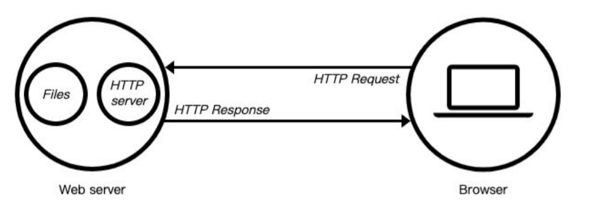

- 通过`Node.js`技术我们可以把自己的电脑变为一台服务器

## 1.2 IP地址、域名、端口号、URL

### 1.2.1 IP地址

- `IP地址`的概述：

  - 前言：计算机要实现网络通信，就必须要有一个用于快速定位的网络地址

  - **`IP地址`就是计算机在网络中的唯一身份ID**

  - **通过`ip地址`才可以访问到另一台计算机**

  - `IP地址`又分为**公网IP**和**私网IP**

    

- 什么是`公网IP`？

  - 公网地址又称为`外网`，是全球唯一的IP地址

  - 可以通过`公网IP`，可以访问`不同的局域网下(wifi)`下的一台计算机

      

- 什么是`私网IP`？

  - 私网IP又称为`内网`，是`当前局域网(wifi)`下唯一的IP地址

  - 通过`私网IP`，只能访问`同一局域网(wifi)下`的一台计算机

  - 默认计算机只有`私网IP`，也就是说默认只能访问`同一局域网下`的计算机，`公网IP`需要申请

    

- 如何查看当前电脑`IP地址`?

  - 在命令行窗口输入`ipconfig/all`指令

  - 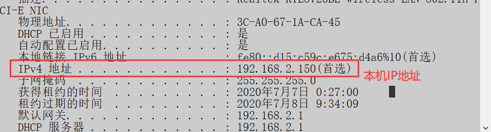

    

    

### 1.2.2 域名

- 什么是`域名`？

  - `域名`实际上就是`ip地址`的转换，比如`www.baidu.com`这个网址，就是一个`域名`

  

- 域名和IP地址的关系：

  - ***域名的本质其实就是IP地址***，只是域名更方便让人记住

  - 虽然平时输入的是`域名`，但是最终还是会将`域名转换为ip地址`来访问指定的服务器

  - 比如输入`www.baidu.com`这个域名，他会自动帮我们解析成`36.152.44.95`IP地址

  - 也就是说可以通过`ip地址`来访问百度页面

    

- 如何***通过域名来获取其对应的IP地址***？

  - 在命令行窗口输入`ping 域名`

  - 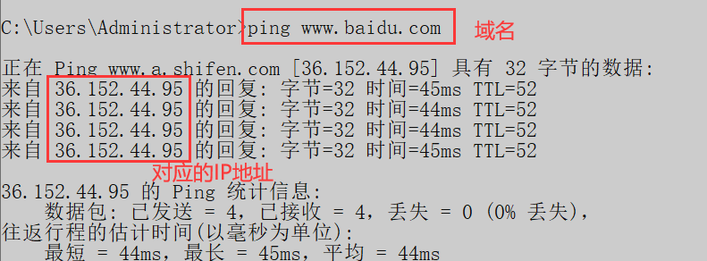

-  ***localhost、127.0.0.1 和 本机IP*** 三者之间的关系
   - `127.0.0.1`所对应的域名就是`localhost`，该域名和IP地址**只能由当前的计算机访问**
   - `在同一局域网下`，其他计算机可以通过`本机IP`来访问当前的计算机
   - ***三者都可以访问当前的计算机***，**区别是看谁访问**

### 1.2.3 端口号

- 什么是`端口号`？

  - `端口号`可以理解为电脑上应用程序的编号

      

- **一个电脑上有多个应用程序**，**每个应用程序对应着一个`端口号`**

  - 根据`IP地址`可以找到互相通信的`计算机`，根据`端口号`可以找到互相通信的`应用程序`

  - `IP地址`冒号后面跟的就是`端口号`，格式：`ip地址:端口号`

    

- 当访问其他计算机时***只指定 IP 是不够的，必须指定`端口号`***

  

- 问题：为什么有些网址无需加`端口号`也能访问？

  - 每个`域名`所对应的`IP地址`都有`端口号`，默认为`80端口`

  - 因此通过`IP地址`访问百度，相当于`36.152.44.95:80`，端口号为80时，默认不显示

    

### 1.2.4 URL

- `URL`的概述

  - `URL是统一资源定位符`，***是互联网上标准资源的地址***

  - 通过`URL`，我们可以访问其他计算机上的资源

  - `URL`就是平时上网的一个***完整的网址***

    

- `URL`的组成

  - `传输协议://服务器IP或域名:端口/路由?地址栏参数`

  - `https://www.baidu.com/index?name=张三&age=18`

      

- 端口号可以不加，默认为`80端口`

- 传输协议也可以不加，默认为`http协议`

- 路由和地址栏参数可加可不加

## 1.3 HTTP协议

### 1.3.1 HTTP协议的概念

- `HTTP协议`也叫***超文本传输协议***，这个协议详细***规定了浏览器和服务器之间互相通信的规则***
- 即`HTTP协议`定义了浏览器如何去请求服务器，服务器怎样把数据传递给浏览器

- 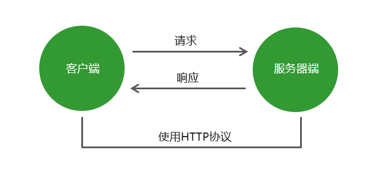

### 1.3.2 请求方式

- `HTTP`协议规定了客户端向服务器发送的`请求方式`，最常用的请求方式是`GET`和`POST`

  

- `GET`请求的使用场景：

  - 单纯的请求数据时使用

    

- 常见的`GET`请求：

  - 浏览器地址栏输入网址时，默认向服务器发送的就是`GET`请求，无法手动修改

  - 使用`ajax`时，可以指向服务器发送`GET`请求，该请求可以修改

  - `form`表单提交时，如果没有指定请求方式，则默认为`GET`请求

    

    

- `POST`请求的使用场景：

  - **传递的数据要写入数据库时**使用

    

- 常见的`POST`请求：

  - `form`表单提交时，指定向服务器发送`POST`请求
  - 使用`ajax`时，可以指向服务器发送`POST`请求，该请求可以修改

- GET请求和POST请求的区别：
  - GET请求所携带的参数，是**放在地址栏上**传递给服务器的，较不安全
  - POST请求所携带的参数，是**放在请求体中**传递给服务器的，相对来说比较安全

## 1.4 报文

### 1.4.1 报文的概念

- 客户端（浏览器）与服务端通信时传输的内容我们称之为`报文`

  - 客户端(浏览器)发送给服务器的数据，称为`请求报文`

  - 服务器发给浏览器的数据，称为`响应报文`

  - `HTTP协议`规定了`请求报文`和`响应报文`的格式

    

    

### 1.4.2 Fiddler抓取报文

- `Fiddler`是一个http协议调试代理工具，使用它我们可以**抓取网页的所有请求报文与响应报文**

- 官网下载地址：https://www.telerik.com/download/fiddler

- 当打开浏览器时，`Fiddler`会自动抓取电脑上所有的网络请求

  - 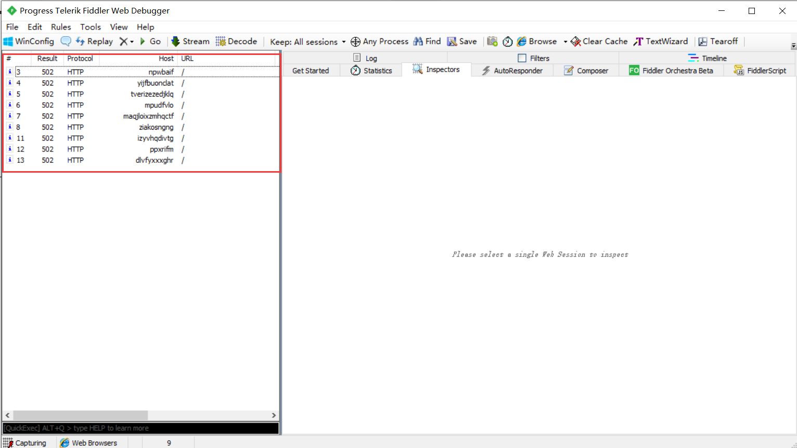

    

- 这里以`form表单发送网络请求`为例子

  

- 获取报文

  - 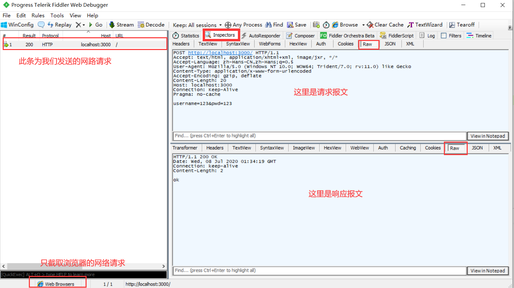

    

- 解决谷歌浏览器抓不到数据：

  - https://www.pianshen.com/article/23931284824/;jsessionid=2BB0DE946D7EDF1CBDC4DCD9EF48E6F3

    

### 1.4.3 报文分析

- **GET请求报文**（客户端发送给服务器的数据）------- 通过form表单发送的GET请求

  - 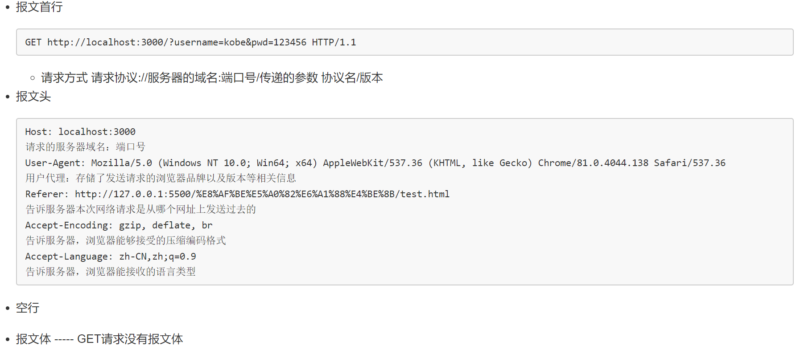

    
    
    

- **POST请求报文**（客户端发送给服务器的数据）------- 通过form表单发送的POST请求

  - 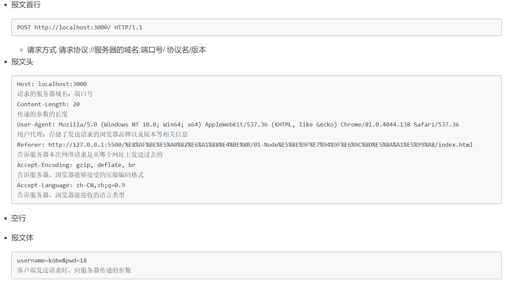

- **响应报文**（服务器发送给客户端（浏览器）的数据）

  - 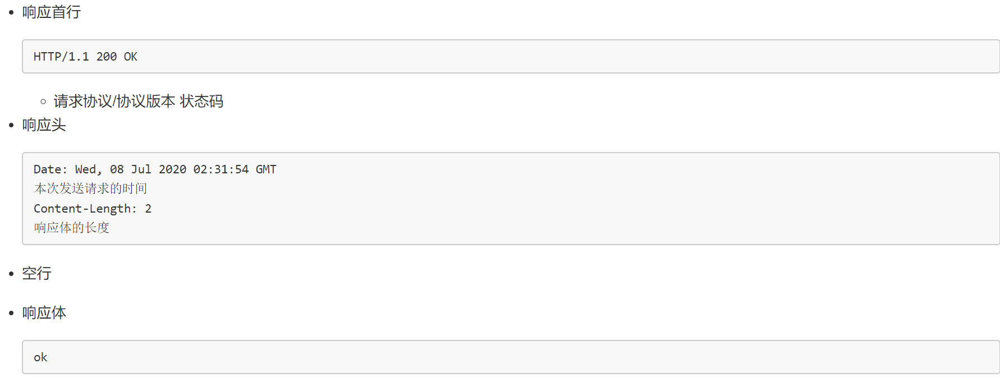

  

  

### 1.4.4 响应报文中的状态码

- `状态码`的作用：告诉客户端（浏览器），当前服务器处理请求的结果

- 常见的`状态码`：
  - 200 请求成功
  - 404 请求的资源没有被找到
  - 500 服务器端错误（后端问题）
  - 400 客户端请求有语法错误（前端问题）

## 1.5 传递参数和路由

### 1.5.1 传递参数的概述

- 客户端向服务器端`发送请求`时，有时需要携带一些客户信息，客户信息需要通过`传递参数`的形式传递到服务器端，服务器需要判断`传递的参数`，来响应给客户端(浏览器)对应的数据

  

- **传递参数的请求方式**又分为两种：使用`GET请求`传递参数和使用`POST请求`传递参数

    

- 注：使用`key=value&key=value`格式传递的参数，称为`urlencoded`格式参数

    

    

### 1.5.2 GET请求传递参数

- 通过`GET请求`传递的参数，参数都会被放置在`URL地址栏中`进行传递

- 以下为`GET请求`传递参数的形式，使用`GET请求`传递的参数也叫做`地址栏参数`

- `?`后面的参数就是地址栏参数

  - 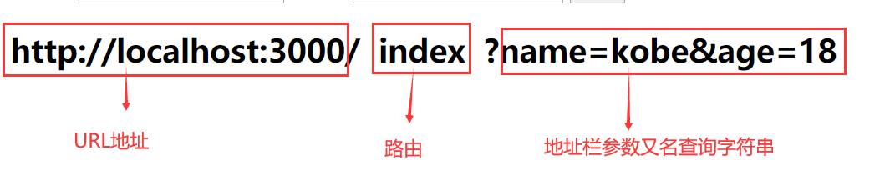

  

  - `URL`的组成：`传输协议://服务器IP或域名:端口/路由?地址栏参数`。

      
    
    

### 1.5.3 POST请求传递参数

- 通过`POST`请求传递的参数，参数会存放在`请求体`中进行传递，不会在`URL地址栏`上显示，相对安全

    

- `POST`请求传递的参数，其参数格式与`GET请求`的参数一样

    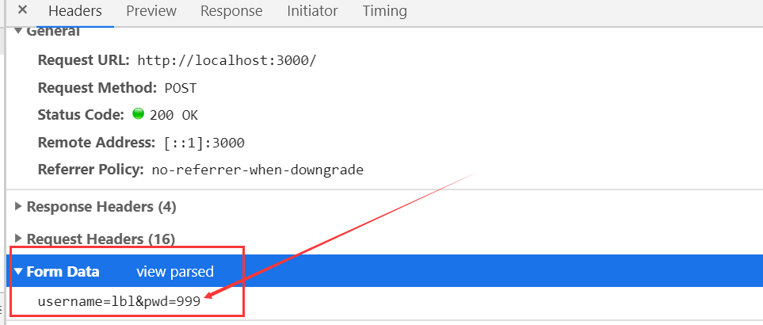

### 1.5.4 路由的概念

- 在浏览器与服务器进行交互时，**服务器会根据浏览器的请求地址**，来响应不同的数据返回给浏览器

- ***路由是***指客户端请求地址与服务器响应内容的***对应关系***

    

      

    - `URL`的组成：`传输协议://服务器IP或域名:端口/路由?地址栏参数`。

        

- ***服务器需要根据路由来返回不同的页面给浏览器***，路由的默认值为`/`

    

- 注：**路由也可以被称为路径**

### 1.5.5 路由参数

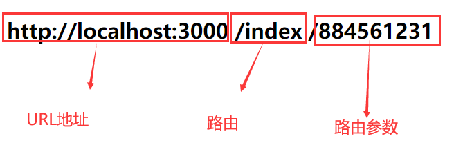

- `路由参数`：

  - **在路由后面的路径可以被当做路由参数**。例：`路由/路由参数`

    

    
  
    

## 1.6 静态资源和动态资源

- **静态资源**

  - 服务器端不需要处理，可以直接响应给浏览器的资源就是***静态资源***
  - ***静态资源***一般放置在`public`文件夹下
  - 简单来说，静态资源就是服务器根据***浏览器中的路由***所返回的资源
  - `localhost:3000/index.html` 直接给浏览器返回首页

  

- **动态资源**

  - 服务器需要进行加工处理，然后响应给浏览器的数据就是***动态资源***
  
  - 简单来说，***动态资源***就是服务器根据***浏览器携带的参数***所返回的资源
  
  - `localhost:3000/index/?id=1`，根据浏览器请求携带的参数，返回不同的资源
  
      
  
      

## 1.7 内网穿透

- 什么是**内网穿透**？
    - **内网穿透**就是一项能把自己家**电脑私网IP地址转换为公网IP**地址的技术

>以下为实现**内网穿透技术**的**步骤**
>
>

1. 在`ngrok`平台注册一个账号，并且购买免费的服务器

    - https://www.ngrok.cc/login.html

    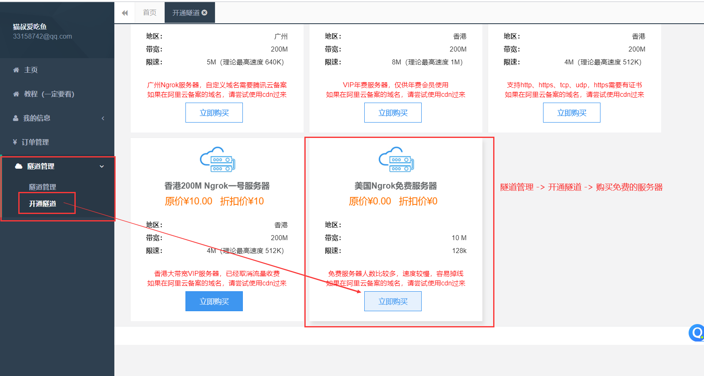

2. 进入`隧道管理` -> `编辑` -> `设置需要映射的本地IP地址以及端口号`

    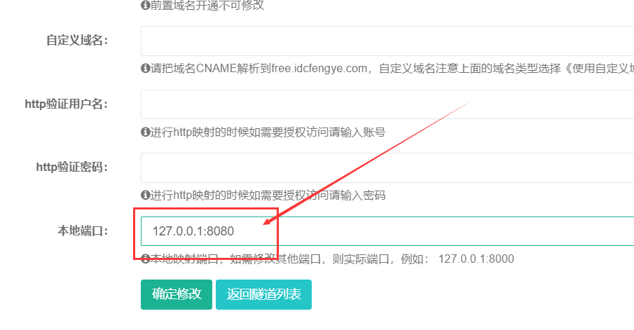

3. 下载本地客户端

    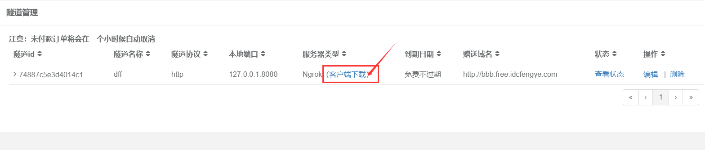

4. 启动压缩后的***.bat***文件

    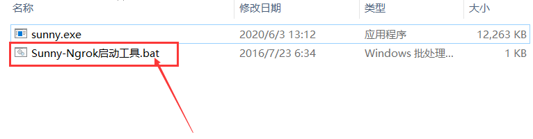

5. 隧道管理  ->复制隧道id -> 在启动的 ***.bat*** 文件中输入

6. 通过映射的**公网IP地址**来**访问本地的特定应用**

    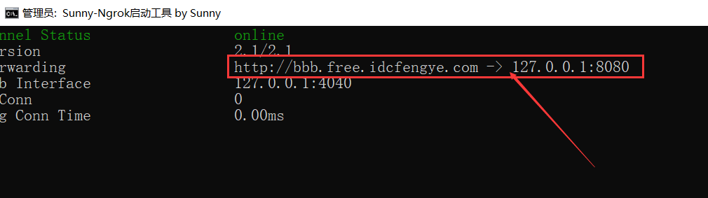

## 1.8 经典面试题

* 问题：从用户输入URl按下回车，一直到用户能看到界面，期间经历了什么？
  

一、DNS解析（缓存）：

1. 找浏览器**DNS缓存解析域名**

2. 找本机DNS缓存：

3. 找路由器DNS缓存

4. 找运营商DNS缓存（百分之80的DNS查找，到这一步就结束）
  
  

二、**进行TCP（协议）连接，三次握手**（根据上一步请求回来的ip地址，去联系服务器）

​		第一次握手：由浏览器发给服务器，我想和你说话，你能“听见”嘛？

​		第二次握手：由服务器发给浏览器，我能听得见，你说吧！

​		第三次握手：由浏览器发给服务器，好，那我就开始说话。

三、发送请求（请求报文）

四、得到响应（响应报文）

五、**浏览器开始解析html**

1. 预解析：将所有外部的资源，发请求出去

2. 解析html，生成DOM树

3. 解析CSS，生成CSSOM树

4. 合并成一个render树

5. js是否操作了DOM或样式
    - 有：进行重绘重排
    - 没有：null

6. 最终展示界面
  
  

六、**断开TCP连接，四次挥手**（确保数据的完整性）

​		第一次挥手：由浏览器发给服务器，我的东西接受完了，你关闭吧。

​		第二次挥手：由服务器发给浏览器，我还有一些东西没接收完，你等一会，我接收好了我告诉你

​		第三次挥手：由服务器发给浏览器，我接收完了，你断开吧

​		第四次挥手：由浏览器发给服务器，好的，那我断开了。

  

