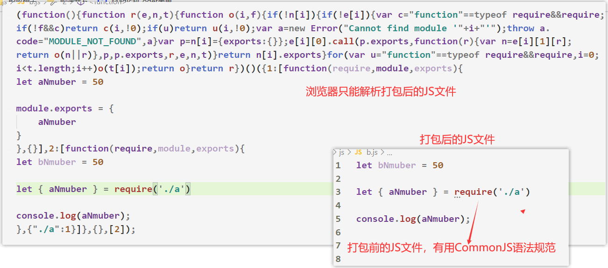

# 一、构建化工具——gulp


##1.1 什么是gulp？

- `gulp`是一个基于`Node.js`技术开发的**自动化构建工具。**官网地址：https://www.gulpjs.com.cn/

    - `gulp`是属于`npm`下的一个第三方包

        

- 什么是**自动化构建工具**？

  - 简单来说，**自动化构建工具就是一个打包项目的工具**
  - 在我们编写好代码之后，需要对浏览器进行兼容、压缩文件大小，但是这些事不需要开发者来做。统统可以使用自动化构建工具来帮助开发者完成

      

- **gulp**能做些什么？

  - 当项目上线时，**自动化的完成HTML、CSS、JS文件压缩合并**，节约文件大小

  - **语法转换**，比如可以将**ES6语法转换为ES5语法**，以此来**兼容大多数浏览器**

    

- gulp的特点：
  
  - 代码优于配置的策略，Gulp 让简单的任务简单，复杂的任务可管理


- 问题：打包项目前JS文件用的是箭头函数中的this，打包后转换为了普通函数，this指向不就不一样了吗？

  - 打包工具会自动帮你处理好this指向问题的，比如给函数挂个`call`修改this指向
  - 所以凡是正常运行的项目，通过打包工具进行打包后，并不会影响其运行效果

  

- 总结：**学习自动化构建工具的使用，就是为了提高开发的效率**


## 1.2 gulp的准备工作

1. 创建项目的文件夹结构

   - ```
     |- dist ----- dist文件夹下存放的是构建后的文件
     |- src ----- src文件下存放的是源代码，没有经过任何处理的代码
     |- gulpfile.js ------ gulp的配置文件
     ```

2. 局部安装`gulp`：`npm i gulp`（先初始化当前文件夹`npm init -y`）

3. 全局安装gulp：`npm i gulp -g`

4. 在gulpfile.js文件中编写任务

   - ```js
     // 引入gulp模块
     const gulp = require('gulp');
     
     gulp.task('default', function() { //default为任务名，可以更改
       // 将你的默认的任务代码放在这
     });
     ```

5. 在命令行工具中执行`gulp 任务名`


## 1.3 gulp插件的使用

- gulp是一个轻量级自动化构建工具，因此需要使用插件来配合完成打包项目的任务
- gulp中常用的插件
  - gulp-htmlmin ：html文件压缩
  - gulp-csso ：压缩css
  - gulp-babel ：JavaScript语法转化
  - gulp-less: less语法转化
  - gulp-uglify ：压缩混淆JavaScript
  - browsersync：浏览器实时同步

  

  

- 插件官网：https://gulpjs.com/plugins/， **可查看插件使用步骤**

- `gulp`常用插件大全：https://www.jianshu.com/p/90077f4bc12f

    

## 1.4 压缩html文件

1. 安装插件：`npm i gulp-htmlmin`

2. 在`gulpfile.js`文件下引入安装的插件，并且定义任务

   - ```js
     // 引入
     const htmlmin = require('gulp-htmlmin')
     // 定义HTML文件的任务
     gulp.task('htmlmin', () => {  // 任务名为htmlmin
       return gulp.src('src/index.html') // 需要打包的文件
         .pipe(htmlmin({
         collapseWhitespace: true ,//去除空格
         removeComments:true //去除注释
       }))
         .pipe(gulp.dest('dist')); // 打包到指定目录下
     });
     ```

3. 执行运行命令：`gulp htmlmin`


## 1.5 压缩CSS文件

1. 安装插件：`npm i gulp-cssmin`

2. 在`gulpfile.js`文件下引入安装的插件，并且定义任务

   - ```js
     // 引入
     const cssmin = require('gulp-cssmin')
     // 定义CSS文件的任务
     gulp.task('cssmin', function () {  // 任务名为cssmin
       return gulp.src('src/css/base.css') // 指定需要打包的文件
         .pipe(cssmin()) // 执行css文件压缩
         .pipe(gulp.dest('dist/css'));  // 打包到指定目录下
     });
     ```

3. 执行运行命令：`gulp cssmin`


## 1.6 less语法转换

1. 安装插件：`npm i gulp-less`

2. 在`gulpfile.js`文件下引入安装的插件，并且定义任务

   - ```js
     const less = require('gulp-less');
     // 定义less文件的任务
     gulp.task('less', function () {
       return gulp.src('./src/less/*.less') // 指定less文件夹下的所有less文件
         .pipe(less())  // 执行less语法转换
         .pipe(gulp.dest('./dist/css')); // 打包到执行文件夹下
     });
     ```

3. 执行运行命令：`gulp less`


## 1.7 JS文件打包

1. 安装插件：`npm i gulp-babel @babel/core @babel/preset-env gulp-uglify`

2. 在`gulpfile.js`文件下引入安装的插件，并且定义任务

   - ```js
     const babel = require('gulp-babel');
     const uglify = require('gulp-uglify')
     // 定义JS文件的任务
     // 1.es6语法转换  2.压缩JS文件代码
     gulp.task('jstest', () =>
         gulp.src('./src/js/*.js') //指定JS文件夹下所有的JS文件
             .pipe(babel({  // ES6语法转换
                 presets: ['@babel/env']
             }))
             .pipe(uglify())  // 压缩JS文件
             .pipe(gulp.dest('./dist/js'))
     );
     ```

3. 执行运行命令：`gulp jstest`


## 1.8 配置默认任务

- 每定义一个gulp任务，我们就要依次去执行，这样有点麻烦，那么有没有一次性执行全部任务的语法呢？

- `gulp.js`中可以配置默认任务，依次执行多个任务

  - ```js
    gulp.task('default', gulp.series('htmlmin', 'cssmin', 'less', 'jstest'))
    ```

  - 第一个参数为默认任务的名字

- 执行运行命令：`gulp default`


## 1.9 模块化规范转换

- 浏览器无法解析`CommonJS`模块化规范，只能解析`ES6`的模块化语法规范。因此我们需要通过`browserify`将其模块化规范转换为浏览器所能解析的形式
- `browserify`属于第三方模块，并不属于`gulp的插件`，主要用于将模块化语法规范转换为浏览器所能识别的形式

1. `npm i browserify`
2. 在命令行窗口执行：`browserify  ./src/js/a.js -o ./dist/js/a.js`

3. 在HTML页面中引入打包后的JS文件，测试是否可以显示





