# 一、Node.js的概述

## 1.1 Node简介

### 1.1.1 Node.js是什么？

- Node.js（软件）**一种javascript的运行环境**，能够使得javascript代码脱离浏览器运行

    - 官方解释：Node.js是一个**基于V8 JavaScript引擎的JavaScript运行时环境。**

    

- 什么是**代码运行环境**？

  - 浏览器（软件）能够运行JavaScript代码，**浏览器就是**JavaScript代码的**运行环境**

  - Node.js（软件）能够运行JavaScript代码，**Node.js就是**JavaScript代码的**运行环境**

    

- 理解**JavaScript**和**JS引擎**的关系

    - JavaScript是一门高级语言，最终需要转换为机器语言来被CPU执行
    - **JavaScript转换为机器语言**的这一过程需要**通过JS引擎**

    

- **浏览器内核**与**JS引擎**的关系

    


### 1.1.2 为什么要学习Node.js？

- 通过学习Node.js，我们可以学习到**开发服务端的基础**
- **学习Node.js能够和后端程序员更加紧密的配合**
- 通过Node.js技术，我们可以**对数据库进行增删改查操作**
- Node现在已经成为了**前端必不可少**的一部分


## 1.2 Node.js运行环境安装

- Node.js官网：https://nodejs.org/en/

    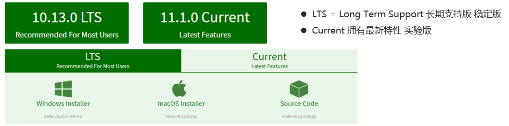


- 一键傻瓜式安装，一直点击next下一步
- 安装完成之后，**Node会自动配置系统环境变量**，打开命令行窗口，输入`node -v`查看当前node版本

  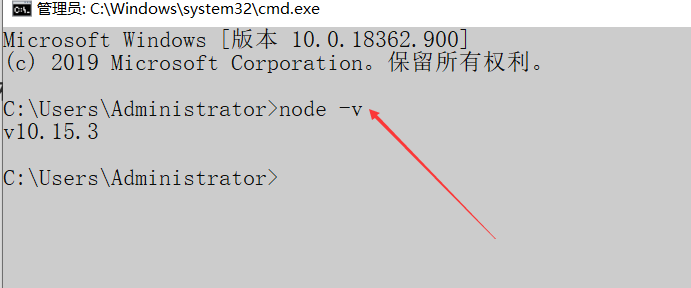


- 弹出版本则表示安装成功

>如果希望用**编辑器的终端**执行Node命令，那么**需要重启一下编辑器**
>


## 1.3 浏览器和Node.js架构区别

- **浏览器**包含HTML、CSS、JS三大模块，而**Node**只有JS这一模块

    


- **浏览器**中的JavaScript 由三部分组成，**ECMAScript**，**DOM**，**BOM。**
- **Node.js**中的JavaScript是由 **ECMAScript**及**Node 环境**提供的一些**附加API**组成的，包括文件、网络、路径等等一些更加强大的 API。


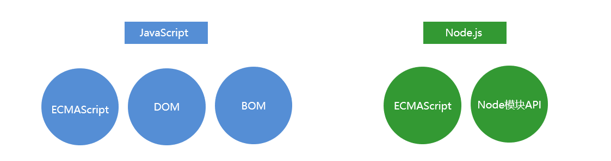


- **ECMAScript**：JavaScript的**基础语法**
- 在Node环境下编写的JS代码，并**不具备BOM、DOM提供的API**


## 1.4 Node.js的初体验

### 1.4.1 Node中运行JS文件

- 在之前学习阶段中，我们都是通过在**HTML文件中引入JS文件**，让浏览器加载HTML页面时，顺带加载JS文件

- 通过Node.js的学习，我们可以完全脱离浏览器，可以**让独立的JS文件在Node.js环境下运行**

- 以下为**Vscode**编辑器为例

  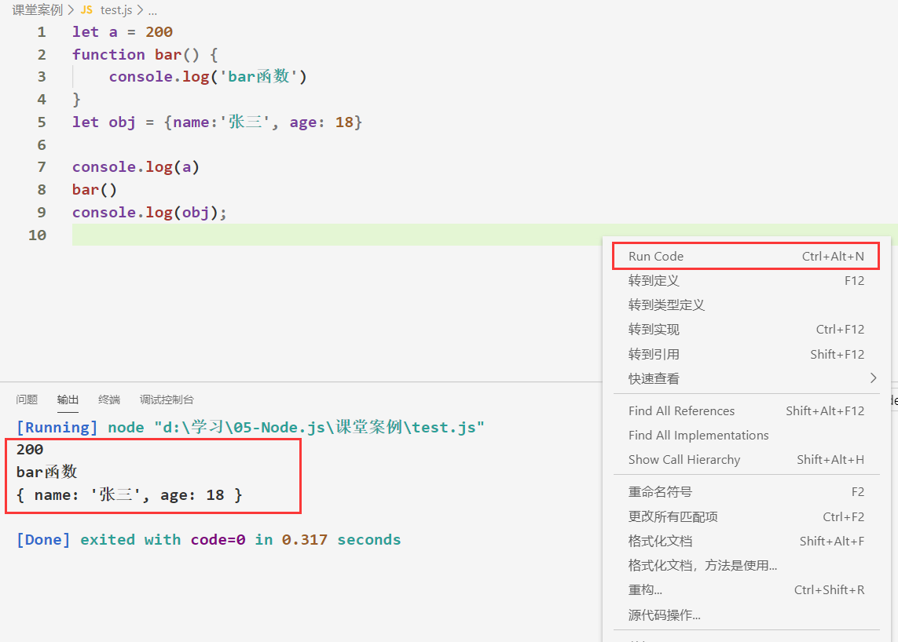

  

  - 前提是安装好：`Code Runner`插件和`Node.js`运行环境，才能右键执行JS文件

> 或者在**命令行窗口**通过***node xxx.js***命令来运行指定的**js文件**
> 


### 1.4.2 Node的REPL

- 什么是REPL呢？
    - REPL是Read-Eval-Print Loop的简称，翻译为“读取-求值-输出”循环
    - REPL是一个**简单的、交互式的编程环境**

- 浏览器的**控制台**就可以看成一个**REPL**
- Node也给我们提供了一个**REPL环境**，我们可以在其中演练简单的代码
- 


## 1.5 Node.js下的全局对象

### 1.5.1 常见的全局对象

- 在**浏览器**中全局对象是**window**，在**Node**中全局对象是**global**
- Node中全局对象下有以下**方法和属性**，可以在任何地方使用，**global可以省略**
  - console.log()   在控制台中输出
  
  - setTimeout()   设置超时定时器
  
  - clearTimeout() 清除超时时定时器
  
  - setInterval()   设置间歇定时器
  
  - clearInterval()  清除间歇定时器
  
  - process：`process` 对象是一个全局变量，它提供当前 Node.js **进程的有关信息**
  
      

>可以将**global对象**看做是一个**单例模式**，**一个Node运行环境只有一个global**，其**作用与Vuex类似**
>


### 1.5.2 特殊的全局对象

- 为什么称之为特殊的全局对象呢？ 
    - 这些全局对象可以在**JS模块中**任意**使用**，但是**在命令行交互中是不可以使用**的
    -  包括：`__dirname`、`__filename`、exports、module、require()

- `__dirname`：获取当前**文件所在的文件夹路径**
    - 注意：**不包括**后面的文件名 
- `__filename`：获取当前文件所在的路径和文件名称
    - 注意：**包括**后面的文件名称
- 


# 二、Node.js模块化开发

## 2.1 Node.js的模块化规范

### 2.1.1 CommonJS模块规范

- 在`Node.js环境下`JS代码遵循的是`CommonJS`模块规范（**规范即规定如何导入导出**）

  

- Node.js规定一个**JavaScript**文件**就是一个模块，模块**内部定义的变量和函数**默认情况下在**外部无法得到

  - `CommonJS`模块规范下，***导入和导出的永远都是`exports`对象***

    

- 注意：`Node环境下`不支持ES6的模块化语法规范，支持`CommonJS`语法规范

    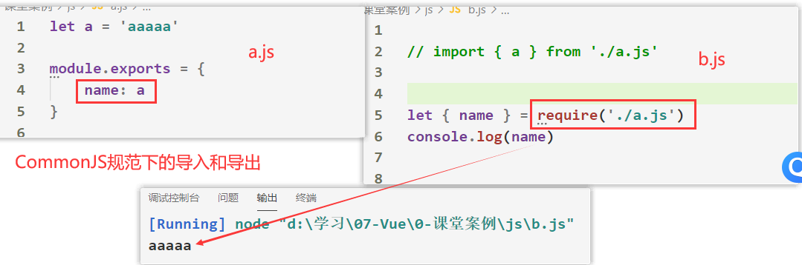


### 2.1.2 CommonJS的导出

- 方式一：`exports.xxx = 要导出的内容`

  - ```js
    // 导出数据
    exports.obj = {name: '张三'}
    ```
    
    
  
- 方式二：`module.exports = 要导出的内容`

  - ```js
    module.exports = {name: '王五'}
    ```

    

- 在`CommonJS`模块规范下，默认导出的是一个`exports`对象

    

- 如果以上两种方式**同时导出**，**导出对象最终以`module.exports`为准**


### 2.1.3 CommonJS的导入

- 语法：

  - ```js
    let a = require(xxx)
    ```
    
  - `require`方法有返回值，返回值是导入的模块中的`exports`对象
  
  - 引入**自定义模块**时，xxx是路径位置，引入**第三方模块**时，xxx是模块名
  
  - 导入模块时文件**后缀名可以省略**，***在Node环境下***默认寻找`以JS`为后缀名的文件
  
  - 注意：用`require(xxx)`导入模块时，**会执行导入模块中的代码**
  
      
  
- `require`允许我们引入其他文件，比如`json`文件，返回的是一个对象，可以使用`解构赋值`语法进行解构

    - ```js
        let { name } = require('./test.json')
        ```

        

>注：**CommonJS**加载模块是**同步**的，而且**模块被多次引入**时，会**缓存**，最终只加载（运行）**一次**

- 当***module***全局对象的属性：***loaded***为false表示还没有加载，为true表示已经加载


### 2.1.4 ESModule和CJS的交互

- 结论一：通常情况下，**CommonJS不能加载ES Module** 
    - 因为CommonJS是同步加载的，但是ES Module必须经过静态分析等，无法在这个时候执行JavaScript代码
    - 但是这个并非绝对的，某些平台在实现的时候可以对代码进行针对性的解析，也可能会支持
    - **Node当中是不支持的**


- 结论二：多数情况下，**ES Module可以加载CommonJS** 

    - ES Module在加载CommonJS时，会将其**module.exports导出的内容作为default**导出方式来使用

    - 这个依然需要看具体的实现，比如***webpack***中是支持的、***Node最新的14.0版本***也是支持的

       


## 2.2 系统模块

### 2.2.1 什么是系统模块？

- ***系统模块就是Node运行环境提供的API***
- **系统模块无需下载**，引入的时候不需要跟路径，只需要跟模块的名字


### 2.2.2 文件模块

- 操作文件模块时，**文件路径都采用绝对路径方式**

    

- 引入文件 **fs模块**
  - ```js
    let fs = require('fs')
    ```
  
    
  
- 简单的**文件读取**：

  - ```js
    fs.readFile('文件路径', callback(err,data));
    ```

  - 第二参数为回调函数，当文件读取成功或失败时，会自动调用该函数

      
  
  
  
- 简单的**文件写入**：

  - ```js
    fs.writeFile('文件路径', '要写入的内容', callback(err));
    ```

  - 回调函数中只有一个参数，该参数为**当文件写入失败时的报错信息**

      
  
  

- 文件写入时，**换行追加内容**

    


- **文件夹**的**创建**与**遍历**

    - 注：创建文件夹时，**其文件夹的父文件夹必须存在**，否则报错
    
    
    
    


### 2.2.3 路径模块

- 引入路径模块(path)

  - ```js
    let path = require('path')
    ```

- 路径**拼接操作**：

  - ```js
    let filePath = path.join('public', 'uploads', 'test')
    // 拼接成的路径：public\uploads\test
    ```

  - 注意：**路径拼接一般配合当前文件的绝对路径使用**

  - ```js
    let filePath = path.join(__dirname, '文件路径')
    ```


- **path模块**的常见API
    - dirname：获取文件的父文件夹
    - basename：获取文件名
    - extname：获取文件扩展名
    - 补充：**path模块**也可以**对图床链接进行操作**

         


- 注：**运行在Node环境下的JS代码**，一旦需要操作一些路径相关，则必须要采用**绝对路径**

- 在Node环境下拥有`__dirname`全局变量，该变量用于存储**当前文件所在的文件夹的绝对路径**


### 2.2.4 事件模块

- 类似于Vue中的中央事件总线

    - 在这个体系中，某些对象（发射器（Emitters））发出某一个 事件

    - 我们可以监听这个事件，并且传入回调函数，这个回调函数会在监听到事件时调用

        

>注：Node中的**事件总线**只能在**同一个JS文件中使用**，有点鸡肋
>


### 2.2.5 工具模块

- `util.promisify(fnName)`
    - 传入一个常见的错误优先的回调风格的函数（即以一个 `(err, value) => ...` 回调作为最后一个参数）
    - 并且**返回一个返回 promise** 的版本。


### 2.2.6 URL模块

- 使用**url模块**可以**解析**我们想要的**网址链接**

    


## 2.3 Node中模块的分类

- **系统模块**

  - 又称为核心模块，是Node中自带的模块

  - 无需下载，引入的时候不需要跟路径，只需要跟***模块的名字***

  - 比如`require('fs')`

    

- **自定义模块**

  - 自己写的JS文件，通过` CommonJS`模块规范向外导出内容

  - 通过`require`引入时，必须跟上***模块文件相对路径***

  - 比如`require('./a.js')`

    

- **第三方模块**

  - 通过npm 下载的模块，称为第三方模块
  
  - 通过`require`引入时，必须跟上***模块的名字***
  
  - 比如`require('express')`
  
      
  
- 在现阶段，引入第三方模块只能通过`CommonJS规范`引入，在后续学习的Vue中，通过`vue-cli`搭建的项目可以使用`ES6模块规范`引入

  
  
  

## 2.4 第三方模块的加载机制

- 模块查找规则：**当引入的模块拥有路径但没有后缀时**

  - ```js
    require('./b')
    ```

  - 优先级100：查找**当前文件夹**下的**同名JS文件**
  - 优先级90：查找当**前文件夹下的同名文件夹**下的`index.js`文件
  - 优先级80：查找**文件夹根目录**中的`package.json`文件中的**主入口文件**

  - 如果都没有找到则报错


- 模块查找规则：**当引入的模块只有模块名时**

  - ```js
    require('vue')
    ```

  - 优先级100：去**Node系统模块下查找**是否有该名字的模块 （**系统模块**）
  
  - 优先级90：去`node_modules`文件夹下**查找同名的JS文件**

  - 优先级80：去`node_modules`文件夹下**查找同名的文件文件夹**下的`index.js`文件
  
  - 优先级80：去`node_modules`文件夹下**查找同名的文件文件夹**下的`package.json`文件中的**入口文件**
  
  - 如果都没有找到则报错
  
      

>注：以上模块的**查找机制**也适用于**ES6语法**的`import`的查找
>


# 三、第三方模块

## 3.1 第三方模块与npm

### 3.1.1 什么是第三方模块？

- **别人写好的、具有特定功能的、我们能直接使用的模块就是第三方模块**，第三方模块有时有称为**包**。

  

- **第三方模块**有两种存在形式：

  - 以**js文件**的形式存在，**提供具体功能的API接口**，其内部JS文件通过`CommonJS`规范**导出**
  
  - 以**命令行工具**形式存在，**辅助项目开发**
  
    

- 通过`npm install xxx` 指令，我们可以下载第三方模块


### 3.1.2 什么是npm？

- `npm`：是'Node package manager'的简写，俗称**Node的包管理者**，这里的包也称为第三方模块

- 安装Node后会自动安装npm

- `npm`是用于管理第三方模块的，**他是通过命令行窗口的指令来对第三方模块进行操作**

  

- `npm`官网：www.npmjs.com  可以查找有哪些第三方模块，以及包的使用说明

  


### 3.1.3 npm其他命令

- **卸载**某个依赖包：：`npm uninstall xxx`
- 强制**重新构建**依赖包：`npm rebuild`
- **清除缓存**：`npm cache clean`
- `  npm ls xxxx` ：查看我们所安装的xxxx包的版本
- 更多npm命令，请查阅文档：https://docs.npmjs.com/cli-documentation/cli/


## 3.2 配置文件说明

### 3.2.1 package.json文件

- 在下载第三方模块之前，我们**需要对使用第三方模块的文件夹进行一个初始化**

  - `npm init -y` 指令可以对当前文件夹进行初始化，并且生成一个`package.json`文件，前提是当前文件夹的`名字只能是英文`
  - 或通过`npm init project-name`指令填写文件夹信息，可以只填写项目名，其他一路回车

  

- `package.json`文件的作用：

  - 该文件记录了项目名称、版本、作者、当前项目依赖了哪些第三方模块等项目信息
  - 当下载好第三方模块后，当前文件夹下会自动创建`node_modules`文件夹，**所有第三方模块都在存放在该文件夹下**。

  - 当我们在传递项目时，无需复制`node_modules`文件夹给别人，只需要在当前项目下执行`npm i `命令，则`npm`会自动查找到该项目根目录下的`package.json`文件中**所有依赖的第三方模块**，**并且自动下载他们**

  

- `package.json`文件解析

  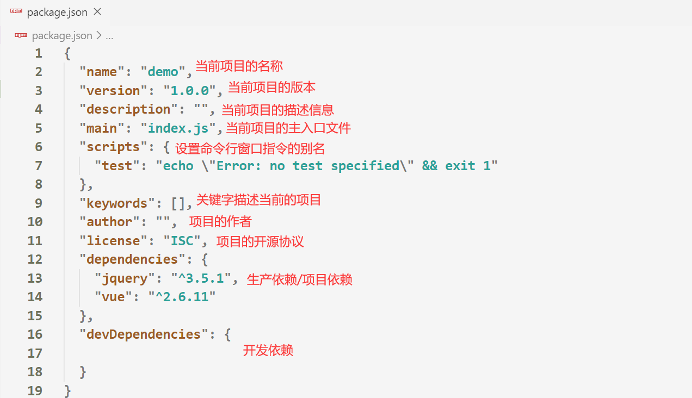


### 3.2.2 package-lock.json文件

- 安装完第三方模块会自动产生一个`package-lock.json`文件
  - 该文件里面记**录的是每个下载过的模块的下载地址**
  - ***用途***是当他人通过`npm i `安装项目**所需的依赖包**时，可以根据下载地址进行下载，**加快安装速度**

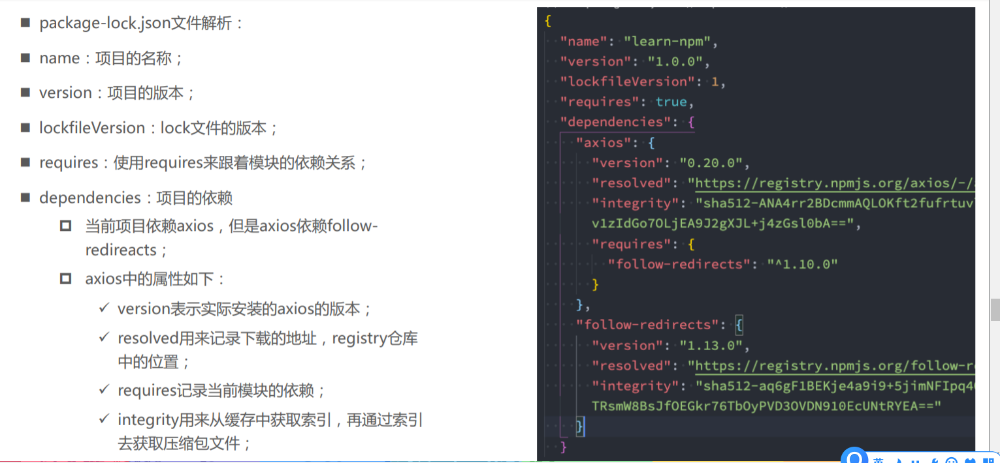


### 3.2.3 项目依赖和开发依赖(了解)

- 什么是**项目依赖**？

  - 项目部署到服务器上，必须要依赖的第三方模块，就是项目依赖 -----   例如：jquery、vue

  - `npm i 包名`命令下载的文件会被自动添加到 `package.json `文件的`dependencies`  （***项目依赖中***）

    

- 什么是**开发依赖**？

  - ***在项目的开发阶段需要依赖，线上运营阶段不需要依赖的第三方包，称为开发依赖。***
  - 例如：语法检查库、压缩代码、扩展css前缀的库

  - `npm i 包名 -D` 命令下载的模块会被添加到`package.json `文件的`devDependencies`(***开发依赖中***) 

  

- 为什么要区分项目依赖和开发依赖？
  - 在开发项目时，许多第三方模块都只是辅助开发人员开发使用，比如语法检查
  - 当把项目直接给客户时，已经不需要开发依赖中的模块了，此时应该直接删除开发依赖中所有的模块
  - **区分项目依赖和开发依赖，是为了让项目的结构更清晰，项目体积更小**


## 3.3 第三方模块的安装

### 3.3.1 安装步骤

- 安装第三方模块：（安装之前必须保证**文件夹已被初始化**）

  - 安装第三方模块的指令为：`npm i 模块名称`
  
    
  
- 安装后会在当前文件夹下自动创建一个`node_modules`文件夹，所有第三方模块都在存放在该文件夹下

  

- **安装多个第三方模块**，只需要在模块名称之间加个空格
  
  - `npm i 模块名称 模块名称`

      
  
- 指定模块的版本下载：`npm i 模块名称@版本号`


### 3.3.2 全局安装和局部安装

- 全局安装的第三方模块**在任何项目(文件夹)**下都能够使用，指令为:`npm i 模块名称 -g `

  - 一般都是**命令行工具**才需要**全局安装**

  - 查看全局安装的**位置**：`npm root -g`

  - 查看全局安装的包的**版本**：`npm ls 包名 -g`或者`包名 --version`

  - **全局安装时无需初始化项目**

  >注：如果**全局安装的包**在项目中通过`CommonJS`等规范**进行导入**的话，是**无法被查找**到的
  >

  

- 局部安装的第三方模块只能**在当前项目(文件夹)**下能够使用

  - 默认安装的都是局部安装，**JS文件一般都是局部安装**


### 3.3.3 npm install 原理图

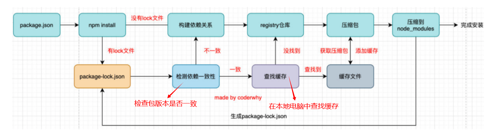


>**查看**本地电脑npm包的**缓存地址**：`npm config get cache`


## 3.4 常用的第三方模块

### 3.4.1 第三方模块 -- nrm

- nrm模块功能：**可以切换npm下载地址**

- npm默认的下载地址在国外，国内下载速度慢，因此我们要切换npm的下载地址

  

- 步骤一：**全局安装** nrm 模块

  - `npm i nrm -g`

- 步骤二：查询可用下载地址列表 
  - `nrm ls`
  
    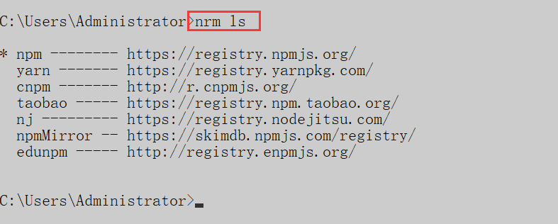
  
- 步骤三：切换 npm下载地址 
  - `nrm use 下载地址名称`
  
      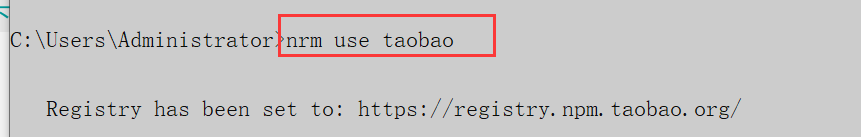


- 查看当前npm远程仓库地址：``` npm config get registry ```


### 3.4.2 第三方模块 -- nodemon

- ***nodemon是一个命令行工具，用以辅助项目开发。***

  - 当运行在Node环境下的JS代码发生了变化时，我们需要手动的重新运行该JS文件，非常的繁琐，使用`nodemon`可以监听JS代码的变化，并**自动帮助我们重新运行修改后的JS文件**

    

1. 使用***npm install nodemon –g*** 下载它

    

2. 在命令行工具中用***nodemon命令替代node命令执行文件***，**执行一次后，就会开始监听该文件是否发生变化**

    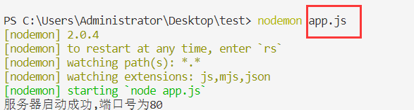


### 3.4.3 第三方模块 -- dateformat

- 该模块可以帮助我们获取当前的时间，以及处理时间的格式

    - ```js
        let  dateFormat  = require ('dateformat') ; 
        // 获取当前时间 格式为'年-月份-日期'
        let now = dateFormat (new Date, 'yyyy-mm-dd ') 
        ```

        


# 四、Node原生服务器

## 4.1 Node原生服务器

### 4.1.1 基本搭建

- 搭建`原生的Node服务器`步骤

  - ```js
    const http = require('http')
    const server = http.createServer()
    server.on('request', (request, response) => { // 当浏览器有请求时，自动调用该函数
      //设置响应报文中返回给客户端的的内容类型
      response.setHeader('content-type','text/html;charset=utf-8')
      response.end('我是你人生中的第一个服务器')  // 给客户端(浏览器响应)
    })
    
    server.listen(80, err => {
      console.log('服务器启动成功, 可以通过localhost来进行访问')
    })
    ```
    
    

>注：**一次请求只能对应一个响应**，因此在`res.end()`前最好**加上return**，阻止代码继续向下执行
>


### 4.1.2 请求和响应对象的方法

- 获取请求的`路由+参数`、`请求方式`、`设置响应报文`

  - ```js
    server.on('request', (request, response) => {
      request.url  // 获取到请求的URL地址的 /路由+参数
      request.method  // 获取请求的方式
      request.headers  // 请求头信息
      response.setHeader('content-type','text/html;charset=utf-8') // 设置响应报文
    })
    ```
  
- 所有**请求报文**信息都在`request`上，所有**响应报文**数据都在`response`上


### 4.1.3 获取GET请求参数

- 获取`GET请求`的参数

  - `GET请求`的参数会放在URL地址栏上进行传递，`localhost:3000/index?name=kobe&age=18`

  - 需要想办法将**路由和传递的参数**进行分离

  - ```js
    const url = require('url') // 引入 url 系统模块  该模块用于处理url地址
    server.on('request', (request, response) => {
      	let { query, pathname } = url.parse(request.url, true)
        console.log(query);  // 传递的参数：{ username: 'zhanmusi', pwd: '999' }
        console.log(pathname);  // 路由：/index
    })
    ```


### 4.1.4 获取POST请求参数

- 获取`POST请求`的参数

  - `POST`请求的参数是`存放在请求体中`的，所以无法通过地址栏获取参数

  - ```js
    const querystring = require('querystring');
    server.on('request', (request, response) => {
        let postData = '';
        // 监听参数传输事件
        request.on('data', (postParam) => postData += postParam);
    
        // 监听参数传输完毕事件
        request.on('end', () => { 
            console.log(postData); // POST请求的参数：username=lbl&pwd=999  
            console.log(querystring.parse(postData));// 将POST请求参数解析成对象形式
        });  
    })
    ```

    
    
    

### 4.1.5 给浏览器发送文件

- 服务器给客户端`发送文件`

  - ```js
    server.on('request', (request, response) => {
      		let filePath = path.join(__dirname, 'public', 'index.html')
          fs.readFile(filePath, (err, data) => response.end(data))
    })
    ```

    

### 4.1.6 页面重定向

- 服务器响应给浏览器新的链接(`重定向`)

  - ```js
    server.on('request', (request, response) => {
      response.writeHead(301, {'Location': 'https://www.baidu.com'})
      response.end()
    })
    ```

    
    
    

## 4.2 第三方模块 —— router

### 4.2.1 router模块的功能

- 在Node原生服务器中，我们需要在`监听浏览器请求的回调函数`中来判断`请求的方式`以及请求地址中的`路由`

  - ```js
    server.on('request', (request, response) => {
      	if (request.method === 'GET'){
    				if (路由 === '/index')		
    		}
    })
    ```

  - 多个`if语句嵌套`，必然维护起来也十分困难，代码也不够优雅

    

- 使用`router模块`，就是帮助我们***实现请求方式和路由的分离***，不再让他们嵌套在`同一个回调函数中`

  

### 4.2.2 router的基本使用

1. 获取路由对象
2. 拦截路由以及请求方式
3. 在`Node原生服务器`监听浏览器请求的回调函数中  ***启用路由，使路由生效***

- ```js
  const getRouter = require('router')  // 引入路由模块
  const router = getRouter();   // 获取路由对象
  // 拦击请求方式以及路由
  router.get('/index', (request, response) => {
      response.end('你好啊')
  })
  
  server.on('request', (request, response) => {
      router(request, response, () => {})  // 启动路由拦截
  })
  ```
  
  


## 4.3 第三方模块 —— serve-static

### 4.3.1 HTML加载时引发的问题

- 当服务器返回给浏览器一个`html页面`，在浏览器加载html页面时，html页面中会有***引入js和css样式的标签和一些图片***，在加载到这些标签时，`会向服务器再次发送请求`，**如果浏览器没有返回给服务器对应的文件**，则`html页面`得不到`css样式和js`的渲染

    

    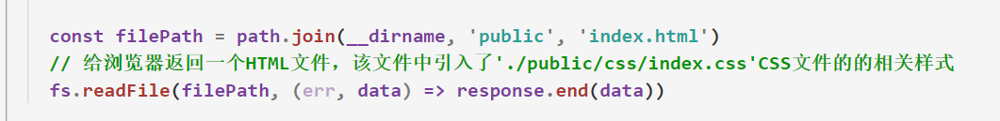

    

    - 上图代码中，服务器返回给浏览器一个`html页面`，在浏览器加载html页面时，会遇到引入的`CSS样式标签`，在加载`CSS样式标签时`，`会向服务器再次发送请求`

    - 如果服务器不给浏览器返回对应的`CSS文件`，则`HTML页面`将会得不到渲染

      

      

- 如何解决上图代码中`html页面加载不到css文件`的问题？

  - 在加载`CSS样式标签时`，浏览器`会向服务器再次发送请求`，其请求地址是：`http://localhost/css/index.css`   

  - 截取路由中`.`后面的后缀名，用来判断请求的文件类型，根据文件类型，返回给浏览器对应的文件

    - ```js
      let { pathname } = url.parse(request.url) // 获取请求路由
      // 截取路由中'.'后面的所有字符串
      let type = pathname.substr(pathname.lastIndexOf('.') + 1) 
      if (type === 'css') { // 如果请求类型为CSS文件
          let static = path.join(__dirname, 'public', pathname)
          // 响应给浏览器请求的CSS文件
          fs.readFile(static, (err, data) => response.end(data)) 
      }
      ```

      

### 4.3.2 静态资源访问的概述

- 在浏览器加载html页面时，html页面中会有其他引入的文件，这些文件我们称为`静态资源`

- 当加载html页面`静态资源`时，服务器需要通过判断`静态资源`的文件类型，来返回不同的文件给浏览器

- 如果要加载的`静态资源`过多，则在服务器中要写的`判断条件响应文件数据`的代码也就越来越多，这样势必会影响开发效率。

    

- 那么有没有当加载`静态资源`时，服务器会`自动返回静态资源给浏览器`的方法呢？
  
  - 答案是有的，就是使用第三方模块`serve-static`


### 4.3.3  serve-static的使用

1. 引入`serve-static模块`
2. 调用`serveStatic`方法创建静态资源服务并指定静态资源服务目录
3. 在`Node原生服务器`监听浏览器请求的回调函数中 ***启动静态资源访问服务***

- ```js
  const serveStatic = require('serve-static')  // 引入静态资源访问模块
  let staticPath = path.join(__dirname, 'public')
  const static = serveStatic(staticPath) // 配置静态资源文件夹目录
  server.on('request', (request, response) => {
      let  { pathname } = url.parse(req.url)
      if (pathname === '/') {
          let html = template('index.art', {})
          res.end(html) // 发送模板文件和数据拼接好的HTML文件
      }
      static(req, res, () => {})  // 启动静态资源访问服务
  })
  ```

- 当返回给浏览器HTML页面时，该HTML页面加载了CSS文件(`静态资源文件`)，则浏览器会再次向服务器发送请求
  
- 开启了静态资源访问服务后，他会判断当前的浏览器请求是否是请求`静态资源文件`，如果是请求`静态资源文件`，则会`根据请求的地址`返回给浏览器其对应的`静态资源文件`

    

    


## 4.4 学生档案管理案例

- 涉及到的知识点：http请求响应、数据库、模板引擎、静态资源访问。
  - 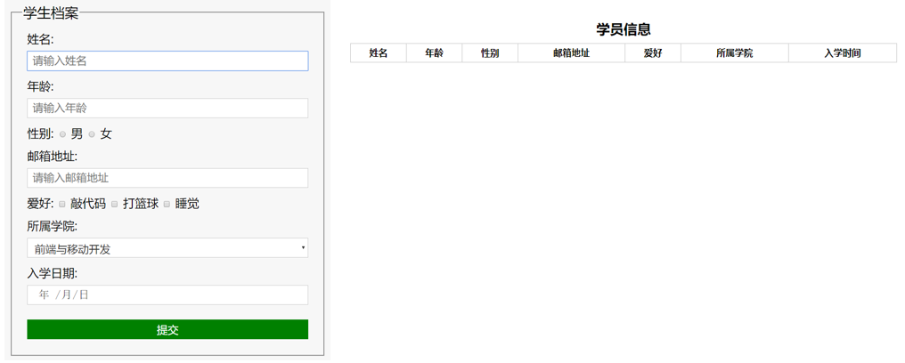

- 制作流程：

  1. 建立项目文件夹并生成项目描述文件（`npm init -y`）

  2. 创建服务器实现客户端和服务器端通信

  3. 连接数据库并创建集合规则创建学生`集合对象`

  4. 创建路由对象，拦截路由，返回浏览器一个初始化的页面（`添加页面`和`学生档案列表页面`）
     - `学生档案列表页面`中的数据需要在数据库中拿取然后渲染

  5. 实现`静态资源访问`

  6. 实现学生信息添加功能
     1. 为每个表单添加`name`属性，并且指定表单的`提交方式以及提交路由`
     2. 服务器接收浏览器传递过来的`POST请求参数`，将该参数以对象形式添加到数据库中
     3. 将页面`重定向`到学生信息列表页面

  7. 实现学生信息展示功能

     1. 从数据库中将所有的学生信息查询出来

     2. 通过`模板引擎`将学生信息和HTML模板进行拼接

     3. 将拼接好的HTML模板响应给浏览器


# 五、模板引擎

## 5.1 模板引擎的概述

- 什么是**模板引擎**？
  
- 模板引擎是为了使用户界面与业务数据（内容）分离而产生的，它可以生成特定格式的文档，通过模板引擎生成一个标准的文档，**就是将模板文件和数据通过模板引擎生成一个HTML代码**
  
  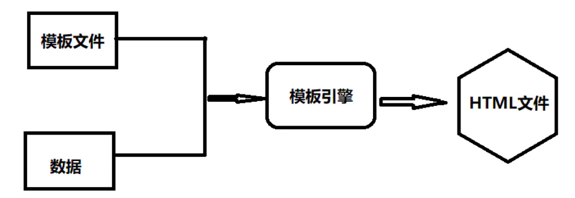
  


## 5.2 模板引擎的安装

- 模板引擎是**第三方模块**，因此需要通过npm下载：`npm i art-template `

- 引入模板引擎模块：`const template = require('art-template')`

- 告诉模板引擎要**拼接的数据**和**模板文件**在哪 

  - ```
    const html = template(‘模板文件路径’, {数据})
    ```

  - 注意：模板文件是以`art`为后缀名，模板文件路径要用`绝对路径`
  - `template`会返回一个拼接好的`HTML文件`

- 使用`模板文件语法`告诉模板引擎，`模板文件`与`数据`应该如何进行拼接 


## 5.3 模板引擎的初体验

- JS代码

  - ```js
    const template = require('art-template')  // 导入模板引擎
    const path = require('path')
    
    // 获取模板文件所在的绝对路径
    const views = path.join(__dirname, 'view', 'index.art')
    
    // 1. 模板文件所在的绝对路径
    // 2. 模板文件中显示的数据
    const html = template(views, { // 将特定模板文件与特定数据进行拼接返回一个HTML文件
        data: {
            name: '张三',
            age: 18,
            sex: '男'
        }
    })
    ```

  - 返回的html变量就是一个`HTML文件`，可以通过服务器发送给浏览器

  

- `.art`文件代码：

  - ```js
    // 先生成HTML骨架
    <div>
        {{data.name}}
        {{data.age}}
        {{data.sex}}
    </div>
    ```

    

## 5.4 模板文件的语法

- 在模板文件中`输出数据`

  - ```html
    <h2>{{ 数据 }}</h2>
    <a href="http://localhost:3000/index?name={{ data.name }}"></a>
    ```

  - 输出数据语法可以嵌套在`引号`中

    

- 解析HTML标签`输出数据`

  - ```html
     <h2>{{@ value }}</h2>
    ```

- 条件判断

  - ```
    {{if 条件}} ... {{/if}}
    {{if v1}} ... {{else if v2}} ... {{/if}}
    ```

- 循环

  - ```
     {{each 循环的数据}}
         {{$index}} {{$value}} 
     {{/each}}
    ```

  - `$value` 是当前遍历的每一项，循环体内的`HTML标签`也会被循环

- 原始语法循环

  - ```
      <!-- 原始语法 -->
     <% for(var i = 0; i < target.length; i++){ %>
         {{ i }}
     <% } %>
    ```

    

 

## 5.5 子模板和继承

- **子模板**

  - 使用子模板可以将模板文件中`公共部分`抽离到单独的文件中。再用其语法引入到子模板中

  - ```
     {{include './header.art'}}
    ```

    

- **模板继承**

  - 使用模板继承可以将网站***HTML骨架抽离到单独的文件中***，其他页面模板可以`继承骨架文件`
  
    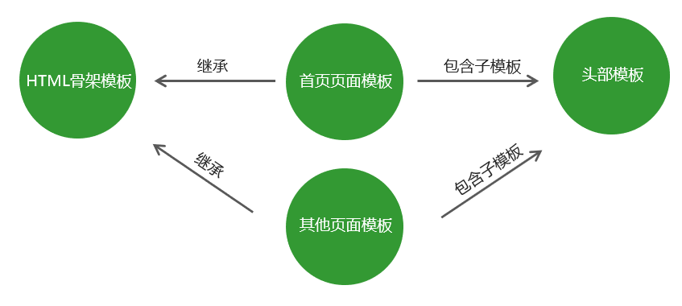
  
    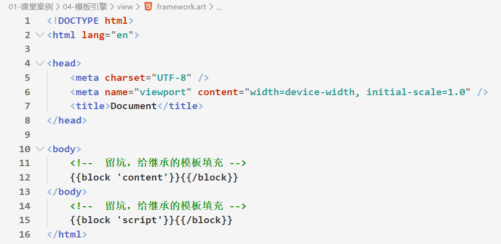
  - ```
    <!--index.art 首页模板-->
    {{extend './framework.art'}}  // 继承骨架模板
        {{block 'head'}} // 填充骨架中名为'head'的坑
            <link rel="stylesheet" href="custom.css"> 
        {{/block}}
        {{block 'content'}} // 填充骨架中名为'content'的坑
            <p>This is just an awesome page.</p> 
        {{/block}}
    ```

    


## 5.6 模板文件的配置

- 向`模板文件`中**导入变量**

  - 例子：当我们想要在模板文件中输出`当前时间数据`时，所输出的格式不是我们想要的，因此需要借助`dateformat`模块下的方法，将该模块下格式化时间的方法导入到模板文件中，模板文件就能够直接使用该方法

  - ```js
    // 向模板文件中导入变量，导入之后就可以在模板文件中使用该方法格式化时间
    template.defaults.imports.dateFormat = dateFormat
    ```

    

- 设置模板文件的`根目录` 

  - 设置完模板文件的根目录之后，***模板文件会在指定的根目录下查找***

  - ```js
    template.defaults.root = path.join(__dirname, 'view')
    // 模板文件会在指定的根目录下查找
    const html = template('index.art', {})
    ```

    

- 设置模板文件的默认`后缀名`

  - 设置完默认后缀名之后，模板文件不需要在加后缀名

  - ```js
    template.defaults.extname = '.art'
    const html = template('index', {})
    ```

    

- 注：以上配置均在**JS文件下编写**


# 六、Node - 爬虫


## 6.1 爬虫的简介

### 6.1.1 认识爬虫

- 什么是爬虫？

    - 爬虫可以理解为**通过程序去获取web页面上自己想要的数据并保存到自己电脑上**

    - 只要**能通过浏览器访问的数据都可以通过爬虫获取并保存**

        

        

- 爬虫的**原理**是什么

    1. 通过后端语言，**向其他服务器发送网络请求**，其他服务器会返回该网站的**html静态资源**
    2. **解析/分析html代码**，获取我们想要的数据，可以是图片链接、视频链接等等
    3. 将爬取好的数据**存储到数据库**中

    - 注：以上原理只适用于`服务端渲染的页面(ssr)`，`客户端渲染的页面(csr)`则是通过**接口分析**


### 6.1.2 常见的网页类型

>浏览器打开的网页一般分为两种：`服务端渲染的页面(ssr)`和`客户端渲染的页面(csr)`
>

- **服务端渲染的页面(ssr)**：就是服务端已经返回了**完整的 html 片段**

    


- **客户端渲染的页面(csr)**：常见的**单页面应用(基于前端路由技术开发)**就是**客户端渲染**

    ​	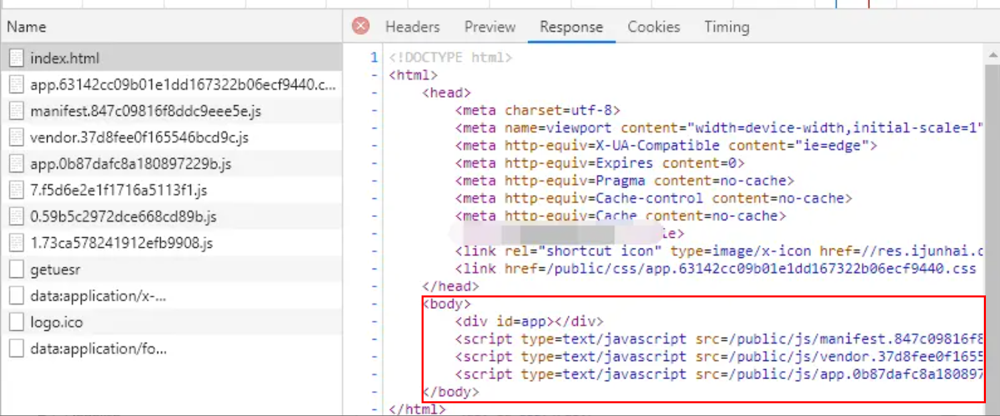


### 6.1.3 爬虫的实现原理

>对于不同的网页类型，**爬虫的实现原理也各不相同**
>

- 爬取**服务端渲染的页面(ssr)数据**
    1. 通过后端语言，**向其他服务器发送网络请求**，其他服务器会返回该网站**完整**的**html静态资源**
    2. **分析html结构**，确定要爬取的内容，可以是图片链接、视频链接等等
    3. 将爬取好的数据**存储到数据库**中


- 爬取**客户端渲染的页面(csr)数据**
    1. 通过后端语言，**向其他服务器发送网络请求**，其他服务器会返回该网站的**单页面应用**
    2. **分析该页面的请求接口数据**，根据请求接口去**请求数据**
    3. 将请求好的数据**存储到数据库**中


### 6.1.4 爬虫流程总结

#### 1-目标：确定你想要获取的数据

1. 确定想要的数据在什么页面上（一般详细的数据会在详情页）
2. 确定在哪些页面可以链接到这些页面（一般分类列表页面会有详情页的链接数据）
3. 寻找页面之间和数据之间的规律


#### 2-分析页面

1. 获取数据的方式（正则 or cherrio）
2. 分析页面是**客户端渲染**还是服务端渲染的
3. 如果是通过客户端渲染的页面，那么需要获取**ajax请求**的链接，一般请求到的数据都为JSON格式数据
4. 如果是**服务器端渲染**的页面，那么就用**cherrio**通过选择器将内容选中


#### 3-编写单个数据获取的案例

1. 解析出分类页的链接地址
2. 解析出列表页的链接地址
3. 解析出详情页的链接地址
4. 解析详情页里面想要获取的数据
5. 将数据进行保存到本地或者是数据库


#### 4-如果遇到阻碍进行反爬虫对抗

1. User-Agent是否是正常浏览器的信息
2. 将请求头设置成跟浏览器一样的内容
3. 因为爬虫的爬取速度过快，会导致封号。1那么可以降低速度进行解决，2可以使用代理进行解决
4. 如果设置需要凭证，那么可以采用无界浏览器真实模拟。


## 6.2 axios和cheerio的使用

### 6.2.1 Node中发送网络请求

>目前在Node中发送网络请求的**主流方式有两种**：**axios**和**request** 包

- 使用axios（**主流**）

    - 优势：支持pormise、**前后端通用**

        

    

- 使用request（知道就好）

    


### 6.2.2 cheerio解析html

- 获取到html代码后，如果希望解析html获取我们想要的资源有两种实现方式
    - 方式一：通过**正则表达式**提取符合的资源，**比较麻烦**
    - 方式二：使用第三方包`cheerio`将html代码**转换成可以操作的DOM元素**，从而对元素属性进行**获取**


- `cheerio`第三方包的基本使用

    - `cheerio.load`解析html代码后，会**返回一个jQuery对象**
    - cheerio 使用跟 jq 一致，可以**直接获取到DOM上的属性值**

    

    

    

    

### 6.2.3 axios结合cheerio案例

- `axios`结合`cheerio`来获取**某一个网站上**的**所有图片外链地址**

    


## 6.3 爬虫小案例

### 1. 爬取图片并下载到本地(ssr页面)

- 流程分析

    1. 分析页面结构，确定要爬取的内容

    2. node 端 http 请求获取到页面内容

    3. 用 cheerio 得到图片外链地址数组

    4. 遍历图片数组，并下载到本地

      ​    

1. 分析页面结构后，通过`cheerio`获取i**mg标签的src属性值**


2. **遍历**图片的**url数组**，发送请求然后用 fs 保存到本地

    


3. 请求优化


### 2. 爬取表情包(ssr页面)

>目标：获取所有表情包标题和表情包图片
>

- 流程分析

    1. 分析页面结构，了解首页 -> 分类详情页 之间的嵌套关系

    2. 提取首页的表情包分类链接，以及每个分类对应的标题，根据标题来创建文件夹
    
    3. 每次遍历首页分类时，发送网络请求获取详情页的图片外链地址
    4. 遍历图片外链地址，根据分类标题将图片进行保存
    5. 获取分页 -> 遍历分页数据 -> 获取网站上**所有表情包资源**

>建议：在爬取数据时，先**完成一个分页的爬取流程**，然后再去爬取全部分页的数据
>


1. 分析页面结构，了解首页 -> 分类详情页 之间的**嵌套关系**


2. 提取首页的表情包分类链接，以及每个分类对应的标题，根据标题来**创建文件夹**

        


3. 每次遍历首页分类时，**发送网络请求获取详情页的图片外链地址**


4. 遍历图片外链地址，根据**分类标题将图片进行保存**

    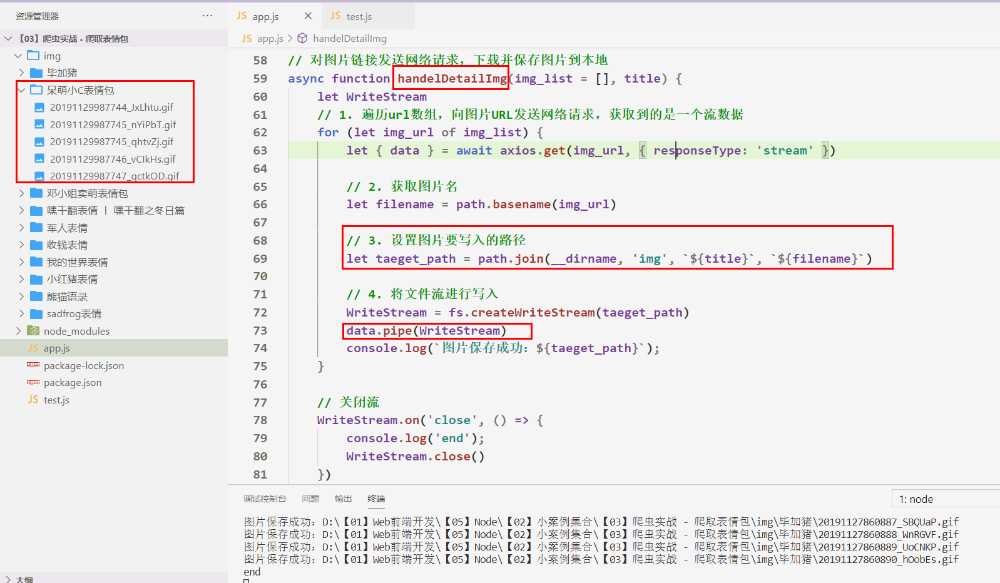


5. 获取分页总数

    


6. 遍历分页总数，对每个首页发送网页请求，获取该网站上所有的表情包资源

    

    - 上图代码中的定时器里的**2000毫秒需要乘以i**


### 3. 爬取音乐(csr页面)

>目标：获取音乐页面的**所有音频资源**
>

1. 分析页面结构，判断是否为`客户端渲染页面`，如果是的话则通过**接口分析**去爬取数据
  
2. 分析接口，从网络请求中**查找我们想要的数据在哪个接口**上

    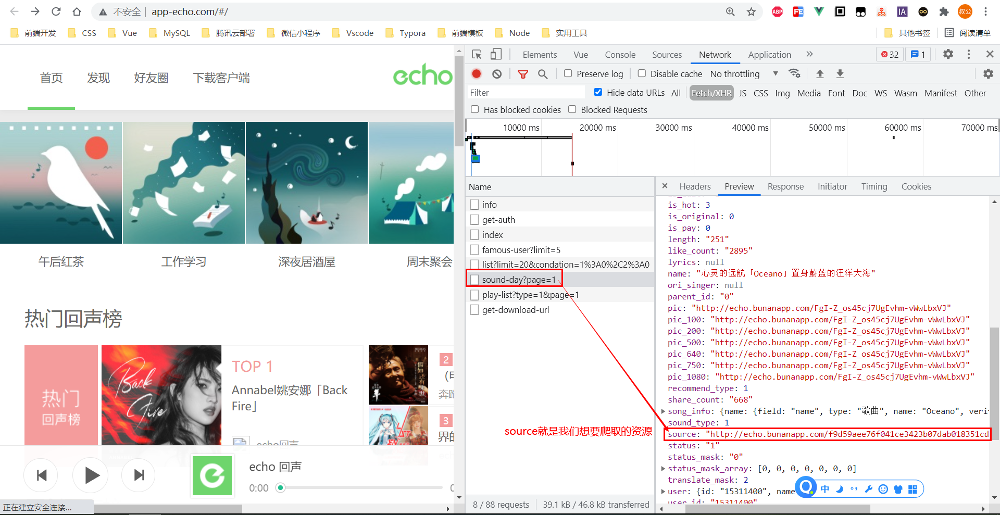


3. 通过代码**爬取音频文件**

    


## 6.4 Puppeteer

### 6.4.1 Puppeteer的介绍

- 什么是**puppeteer**？

    - **Puppeteer**是谷歌官方出品的一个通过DevTools协议**控制Chrome的Node库**。
    - **Puppeteer** 默认以 [headless](https://developers.google.com/web/updates/2017/04/headless-chrome) 模式运行，但是可以通过修改配置文件运行“有界面”模式。
    - 可以通过Puppeteer的提供的api控制Chrome浏览器模拟大部分用户操作来**访问页面收集数据**。

    - [puppeteer中文文档](https://zhaoqize.github.io/puppeteer-api-zh_CN/#/)


- puppeteer能做什么？

    - 生成页面 **PDF**。

    - 抓取 SPA（单页应用）并**生成服务端渲染内容**

    - **模拟用户操作**：自动提交表单、键盘输入等。

    - 创建一个时时更新的自动化测试环境：**实现自动化网页操作**

        


### 6.4.2 Puppeteer的基本使用

1. 安装`puppeteer`：`npm i puppeteer`

2. 编写代码：

    `puppeteer.launch([options])`：具体可传入的[配置对象](https://zhaoqize.github.io/puppeteer-api-zh_CN/#?product=Puppeteer&version=v10.2.0&show=api-puppeteerlaunchoptions)

    ​      

    

    

3. 通过`node xxx.js`启动项目，会自动打开浏览器，并**模拟代码流程**


### 6.4.3 Puppeteer操作页面数据

- 补充：在操作元素前，最好**等待该元素在DOM中被加载**后在进行获取

    - ```js
        // 等img元素出现在dom中并且可以看到
        await page.waitForSelector('img', { visible: true, timeout: 99999 } 
        ```

        

- 使用`page.$$eval()`和`page.$eval()`可以获取页面上的**DOM信息**

    

    - 注：这两个方法中的**回调函数将会在浏览器页面中被执行**

    - 在这个回调函数中，你**不能输出和操作外面作用域的变量**，浏览器**只会解析这一个回调函数**，**他不会解析外层的JS代码**
    
        


### 6.4.4 Puppeteer模拟用户操作

>注：**在模拟用户操作时**，只能通过`page.$(selector)`和`page.$$(selector)`来获取DOM对象
>

- 模拟用户**点击**操作

    


- 模拟**用户搜索**操作

    


### 6.4.5 Puppeteer API总结

**打开浏览器**

```js
let options = {
    headless:true,//是否是无界面浏览器
    slowMo:250,//调试时可以减慢操作速度
    defaultViewport:{
        width:1200,//设置视窗的宽高
        height:800
    },
    timeout:3000，//默认超时3秒
}
let browser =await puppeteer.launch(options);
```

**打开新标签页**

```js
let page = await browser.newPage()
```

**获取所有浏览器中的页面**

```js
let pages = await browser.pages()
```

**关闭浏览器**

```js
browser.close()
```

**将页面跳转至**

```js
await page.goto(url)
```

**获取页面的对象,并进行操作**

```js
let btn = await page.$(selector)
let input = await page.$(selector)
//点击按钮
btn.click()
//聚焦到输入框
input.forcus()
```

**在页面上写入内容或者键盘按键**

```js
await page.keyboard.type('Hello World!');
await page.keyboard.press('ArrowLeft');
await page.keyboard.down('Shift');
```

**设置鼠标的移动**

```js
await page.mouse.move(0, 100);
await page.mouse.down();
```

**截获页面请求**

```js
await page.setRequestInterception(true);
page.on('request', request => {
    request.url()// 可以获取请求的网址，request，包含了所有的请求信息
    if(你想要的条件){
        // 放行请求
        request.continue()
    }else{
      	// 拦截这次请求不发送
        request.abort([errorCode])
    }
});
```

**获取浏览器的信息和内容**

```js
page.$eval(selector,(item)=>{return item})
page.$$eval(selectors,(items)=>{return items})
```

**等待浏览器的DOM元素被渲染**

```js
await page.waitForSelector('selector', { visible: true })
```


# 细节补充

## 1. Node.js中路径的相关问题

- 在Node环境下，最好使用***绝对路径***

    - 在Node下，**所有文件的相对路径**相对的是**命令行工具的当前工作目录**，可通过`process.cwd`查看

    - **用相对路径容易造成许多麻烦**

        

- 在Node中，提供了`__dirname`这个变量，***该变量可以获取当前文件所在的文件夹的绝对路径***

- 注意：`require()`中的相对路径永远**相对的是当前文件所在的路径**，因此**可以不用绝对路径**

    


- 绝对路径一般配合和路径模块中的`join`方法配合使用

  - ```js
    const path = require('path')
    let filePath = path.join(__diranem, '文件路径')
    ```

  - **以上方法得到的文件的路径是一个绝对路径**


>想要获取**上一级**目录下文件，则采用以下方法进行路径拼接

- ```js
    let filePath = path.join(__dirname, '../', '02_fs', 'abc.txt')
    ```

    


## 2. 静态资源访问服务的补充

- 开启了`静态资源访问服务`后，其引入的相关文件必须采用如下格式

  - ```
    ./静态资源所在的文件夹/文件名
    ```

  - 在浏览器解析HTML页面时，会**根据静态资源文件夹和文件名**向服务器发送请求
  
  - 如上写法，相当于加载静态资源时，服务器会返回给浏览器`public文件夹 => 静态资源所在文件夹 => 文件名`下的文件
  
      
  
     


## 3. 模块化导入json数据

>注：不论是**CommonJS**规范，还是**ES6规范**，都**不需要在json中向外导出**，**直接引入json文件即可**
>

- `CommonJS`语法

    - ```js
        // 该data为导入的json文件下的最外层对象
        const data = require('mock/data.json')
        ```

        

- `ES6模块化`语法

    - ```js
        // 该data为导入的json文件下的最外层对象
        import data from 'mock/data.json'
        console.log(data.name) // 可直接作为js对象使用，不会报错
        ```
```
        
        

>导入JSON模块后，**会直接返回一个JS对象**，无需再进行`json -> js对象`这一步骤
>


```