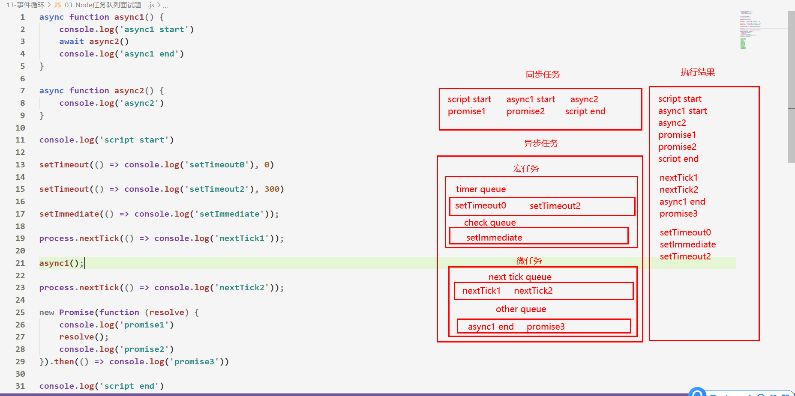

#   一、实现脚手架工具

## 1.1 认识脚手架

- 开发项目的痛点：
    1. 没有划分清晰的目录结构
    2. 需要自己重复编写配置等代码
    3. 基于axios的二次封装
    4. element-ui、vant等第三方组件库的配置

- 每当我们重新开发一个项目时，都需要重复以上的步骤进行开发，重新构建目录结构，这些系列非常繁琐，那么有没有一种优雅的方式能够解决以上痛点？

- **脚手架**可以看做是一个开发者自定义的**目录结构**，通过脚手架，我们可以**快速生成**我们想要的**目录结构**，只需要在命令行中敲入一个**简单的命令**，便可帮我们快速的生成一个**初始项目文件夹**


- 举例：
    - 当我们在命令行窗口输入`long create projectname`时，会自动安装指定的**目录结构**


## 1.2 自定义终端命令

>我们希望通过`long -v / long --help`等指令在窗口中查看一些信息，以下是**实现步骤**

1. 在项目中新建 ***index.js*** 文件
2. 初始化仓库：`npm init -y`
3. 在 ***package.json中***添加 **bin**字段

4. 在***入口文件(index.js)***中,添加如下指令

    

5. 执行`npm link`命令 生成 ***package-lock.json***文件

6. 执行`long`命令，查看***index.js***文件是否被执行

    


>坑：无法加载文件 D:\nodejs\npm.ps1，因为在此系统上禁止运行脚本

1. 打开该项目的`powershell`

2. 执行`set-ExecutionPolicy RemoteSigned`

3. 选择Y

    


## 1.3 Commander的使用

>**Commander**包主要用于帮助我们在**命令行窗口**上**展现一些信息**
>

1. 安装Commander模块，导入到***index.js*** 中

2. 使用该模块的api，**展示**我们想展现的**信息**

3. 在命令行窗口中**输入指定命令**，查看显示的信息是否一致

    


>注：**program.parse(process.argv)**这个代码必须放到  ***index.js***  中的最后一行
>


## 1.4 创建项目指令

- 创建项目指令的思路如下： 
    1. 创建命令行窗口指令 `long create xxx`
    2. 通过`download-git-repo`第三方模块从代码仓库中下载模板 
    3. 进入目录，并且执行 `npm install`

### 1. 创建指令

1. 封装一个创建命令行窗口命令的方法，并在 ***index.js***中调用

    

    

    


### 2. 下载代码

1. 将创建指令后的回调函数**单独抽离**到一个JS文件中

2. 定义好需要拉取的模板的**github仓库URL地址**

3. 判断用户输入的命令行窗口的信息，**动态决定URL地址**

4. 使用`download-git-repo`包**clone项目到指定的文件夹中**

    

    


### 3. 终端执行命令

1. 当项目clone后，进入目录，并且执行`npm install`命令


## 1.5 发布项目

1. **注册**npm账号： 
    - https://www.npmjs.com/ 
    - 选择sign up

2. 在个人中心里**验证邮箱**
3. 将npm下**载**地址**切换为官网**的

  - 指令命令：`npm config set registry=http://registry.npmjs.org`

4. 修改**package.json**

    


5. 执行`npm login`进行登录

    - 注：填写密码时虽然无法显示，但是是正常输入，无需纠结

        

6. 发布到npm registry上：`npm publish`

7. 查看发布的包信息：`npm view coderlong-cli`，如果能成功查到则说明上传成功


7. 下载我们上传好的脚手架`npm i coderlong-cli -g`


>坑：npm 全局安装报 **code EEXIST** 的**错误**
>
>
>
>
>
>
>
>
>
>
>
>
>
>
>
>
>
>
>
>
>
>


# 二、Node中的JS执行机制

## 2.1 Node中的宏任务与微任务

- Node中的**异步任务**更复杂，它也分为**微任务**和**宏任务**： 

    - 宏任务（macrotask）：setTimeout、setInterval、IO事件、setImmediate、close事件

    -  微任务（microtask）：Promise的then回调、process.nextTick、queueMicrotask

        

- 但是，Node中的**宏任务**和**微任务**，又可以**细分为其他的任务队列**

>以下分别为Node中**宏任务**和**微任务**的**中具体任务队列的优先级**，**优先级从上往下**
>

- 微任务队列：

    - ***next tick queue***：process.nextTick 

    - ***other queue***：Promise的then回调、queueMicrotask

        

- 宏任务队列：

    - ***timer queue***：setTimeout、setInterval；
    - ***poll queue***：IO事件
    - ***check queue***：setImmediate
    - ***close queue***：close事件


## 2.2 Node任务队列面试题

- 面试题1：main script、setTimeout、Promise、then、queueMicrotask、await、async、setImmediate、 process.nextTick




- 面试题二：setTimeout(回调函数, 0)、setImmediate(回调函数)执行顺序分析

    


# 三、Express框架（一）


## 3.1 邂逅Express框架

- 什么是Express框架？

    - Express是一个**基于Node平台**的`服务器开发框架`，同时也是一个`第三方模块`，通过`npm i express`下载

    - `Express`官方文档：http://expressjs.jser.us/3x_zh-cn/api.html#app.use

    - 目前在Node中比较流行的Web服务器框架是**express、koa**；

        

- Express框架搭建的服务器***特性***：

    - 对获取HTTP`请求参数`进行了简化处理

    - 提供了简洁的`拦截请求方式以及路由定义`写法

    - 提供了`中间件机制`有效控制HTTP请求

        

        

- 总结：

    - 原生http在开发服务器时，会较为复杂

    - 有URL判断、Method判断、参数处理、逻辑代码处理等，都需要我们自己来处理和封装；

    - 并且所有的内容都放在一起，会非常的混乱；

    - `express`框架开发的服务器，**语法更加简写**

        

        

- Node原生服务器和Express框架对比

    

    


## 3.2 Express的基本使用

1. 安装express包：`npm i express`

2. 通过express框架快速搭建服务器

    - ```js
        const express = require('express')  // 引入express框架
        const app = express()  // 创建服务器对象
        // 客户端以get方式访问/路由时
        app.get('/', (req, res) => {
            res.send('我不会再乱码了')  // 对浏览器做出响应 send方法会根据内容的类型自动设置请求头
        })
        // 监听3000端口号
        app.listen(3000, () => console.log('服务器启动成功，端口为3000'))
        ```

        

- 注：也可以通过**脚手架**方式快速搭建`express框架`目录结构，**建议**还是自己**从0搭建目录结构**，这样更清晰
    1. 安装脚手架 `npm install -g express-generator `
    2. 创建项目 `express express-demo `
    3. 安装依赖 `npm install `
    4. 启动项目 `node bin/www`


>注：**一次请求只能对应一个响应**，因此在`res.send()`前最好**加上return**，***阻止代码继续向下执行***
>


## 3.3 中间件

### 3.3.1 什么是中间件？

- 服务器接收浏览器发来的请求、对该请求做出响应，这一系列的过程可以看成是`中间件处理`的过程

    


- ```js
    app.get('请求路由', calback)  // 接收并处理get请求
    ```

    - 上述的代码中的就可以看做是一个`中间件`，其包含**处理请求**的**过程**

    


- 中间件包括哪些内容？
    - 请求对象（request对象）
    - 响应对象（response对象）
    -  next函数（在express中定义的用于执行下一个中间件的函数）


- 中间件中可以执行哪些任务呢？
    -  更改请求（request）和响应（response）对象
    -  结束请求-响应周期（`res.send()`）
    - 调用栈中的下一个中间件：`next()`


### 3.3.2 next()用法

- 可以针对**同一个请求**设置`多个中间件`，对同一个请求进行多次处理

    - 默认情况下，请求从**上到下依次匹配中间件**，**一旦匹配成功，终止匹配**。

    - 可以调用`next方法`将请求的控制权交给**下一个中间件**，直到遇到**结束请求**的中间件。

    - 注：**一次请求**只能对应一个**响应结果，**即一个`res.send()`

      ​    

- ```js
    let obj = {}
    app.get('/index', (req, res, next) => {
        obj.name = '张三'
        next()  // 匹配下一个中间件
    })
    app.get('/index', (req, res, next) => {
        res.send(obj) // 结束请求
    })
    ```

>注：在调用**next()**前最好**加上return**，阻止代码继续向下运行，防止**多次响应报错**
>

>如果当前中间件功能没有结束请求，则必须调用next()将控制权传递给下一个中间件功能，否则，请求将被挂起


### 3.3.3 全局中间件用法

- `app.use()`中间件用于匹配`所有的请求方式和所有的请求路由`

    - ```js
        app.use((req, res, next) => {
             console.log('请求走了app.use中间件');
             next(); 
         });
        ```

        

- `app.use()`第一个参数也可以传入请求地址，拦截所有以该**请求地址开头的路由**

    - ```js
        app.use('/index', (req, res, next) => {
             console.log('请求走了app.use /index 中间件');
             next();
         });
        ```

    - 注意：上述匹配的是以`/index开头`的路由

    


### 3.3.4 全局中间件的应用

1. 网站维护公告，使用`全局中间件`拦截网站内`所有的请求`，并且响应给浏览器当前网站正在维护

2. 自定义404页面，在**中间件的末尾**添加`全局中间件`，当请求地址无效时，响应给浏览器`当前页面不存在`并且设置`状态码`

    - ```js
        app.use((req, res, next) => {
            res.status(404).send('你访问的页面不存在')
        })
        ```

        

3. ***捕获错误***的全局中间件

    1. **中间件的末尾**添加`错误中间件`
    2. 在全局中间件的**next()**中，**只能传入一个参数**，该**参数**可以作为**错误中间件**的处理函数的**第一个形参**
    3. 当中间件出现错误时，**调用next()方法**，并且将**错误信息**通过**参数**的形式传递给**next()**方法
    4. 当**next()方法中携带参数**时并**不会跳转到下一个中间件**，而是直接跳转到**错误中间件**
    5. 错误中间件**必须要**定义四个形参`(err, req, res, next)`，否则报错
    
    - ```js
        app.get('/index', (req, res, next) => {
            fs.readFile('./main.js', (err, data) => {
                err ? next(err) : res.send(data)
            })
        })
        app.use((err, req, res, next) => {
            // err参数为上一个中间件next传递的参数
            res.status(500).send(err)
        })
        ```
    
    
    
    

### 3.3.5 中间件的多个回调函数

- 在一个中间件中允许**存在多个回调函数**，使用`next()`，可以**依次调用**这些回调函数

    

    

- 当一个中间件的回调函数中的**业务逻辑太多**时，可以通过**多个回调函数**进行**代码拆分**

>如果希望在下一个回调函数中**使用上一个回调函数处理好的数据**，那么上一个回到函数可以**将数据放到请求头**中

- ```js
    app.get('/', (req, res, next) => {
        let a = 1
        let b = 2
        let c = a +b
        req.c = c
        return next()
    }, (req, res, next) => {
        console.log(req.c); // 3
    })
    ```

    


## 3.4 请求参数的获取

### 3.3.1 客户端发送请求的方式

- 客户端传递到服务器参数的方法常见的是5种： 

    - 方式一：通过get请求中的URL的**params**

    - 方式二：通过get请求中的URL的**query**

    - 方式三：通过post请求中的body的**json**格式

    - 方式四：通过post请求中的body的**x-www-form-urlencoded**格式

    -  方式五：通过post请求中的**form-data**格式

        

        

### 3.4.2 GET请求参数获取

- `GET请求参数`的获取

    - ```js
        app.get('/', (req,res) => {
            // http://localhost:3000/?name=z&age=18
            res.send(req.query)// 获取地址栏参数，以对象形式进行存储{name: 'z',age: '18' }
        })
        ```

        

- `路由参数`的获取

    - ```js
        app.get('/find/:id', (req,res) => {
          	// 访问地址：http://localhost:3000/find/123
            res.send(req.params.id)  // 获取路由参数，以对象形式进行存储 { id: 123 }
        })
        ```

        

>**路由参数**和**POST请求参数**可以配合着使用


### 3.3.3 POST请求参数获取

- `POST请求参数`的获取

    - Express中接收post请求参数需要借助第三方包 `body-parser`

    - ```js
        // 引入body-parser模块
        const bodyParser = require('body-parser');
        // 解析 application/json axios库发送的就是json格式
        app.use(bodyParser.json())
        // 解析 application/x-www-form-urlencoded xhr自带的是这种格式
        app.use(bodyParser.urlencoded({ extended: false }))
        // 接收请求
        app.post('/', (req, res) => {
          console.log(req.body);// 获取POST请求参数，以对象形式进行存储
        }) 
        ```

    - 在最新版的`express`框架中，**无需借助第三方包**也能对post请求参数进行解析

    

    

    

- 解析 **form-data**格式需要采取 ***multer*** 第三方模块 [文档地址](https://github.com/expressjs/multer/blob/master/doc/README-zh-cn.md)

    


>使用**postman**发送**post请求**并携带**json数据格式**的**参数**
>


   

# 四、Express框架（二）

## 4.1 构建模块化路由

- 在开发中我们需要用不同的**中间件**来处理不同的**网络请求**

    - 我们需要对一些**同类型的中间件**做出**区分**(模块化开发)

    - 这样我们在中间件中编写的逻辑代码就会非常清晰

        

- 我们可以使用 **express.Router** 来创建一个**路由处理程序**：

    -  一个Router实例拥有完整的中间件和路由系统

    - ```js
        // 创建路由对象
        let home = express.Router()  
        // 设置路由对象的一级路由js
        app.use('/index', home)  
        // 设置路由对象的二级路由
        home.get('/home', (req,res) => {  
            // 访问二级路由： /index/home
            res.send('欢迎来到博客首页')
        })
        ```

        

    

    


## 4.2 form-data文件上传处理

>文件上传处理需要**下载并引入**第三方模块 **multer**   [官方文档](https://github.com/expressjs/multer/blob/master/doc/README-zh-cn.md)
>

- multer模块可以帮助我们**将用户上传的文件解析**然后**存放到指定的目录**下

    

- 补充：前端在上传文件时，要将**form表**单的**enctype**属性修改为：***multipart/form-data***

    

### 1. 上传文件(不带后缀名)

- 上传**单个文件**
    - `req.file`可以**获取上传的单个文件的相关信息**


- 上传**多个文件**

    - `req.files`可以**获取上传的多个文件的数组信息**

    


- *req.file*的文件信息说明

    


### 2. 上传文件(携带后缀名)

- 上传单个文件（**保存文件时携带后缀名**）
    - 注：以下方法的**存储目录**并不会被自动创建，需要我们去**手动创建**，***否则会报错***


- 上传多个文件，保存时携带后缀名，**配置与上传单个文件一致**


## 4.3 静态资源访问

- 通过Express内置的**express.static**方法可以方便地`托管静态文件`，例如img、CSS、JavaScript 文件等

    - ```js
        app.use(express.static(path.join(__dirname, 'public')));
        ```

    - 注意：设置了`静态资源访问`后，访问根路由默认相应`静态资源文件夹`下的`index.html`文件

    

- 当浏览器解析的HTML文件需要加载静态资源文件时，会向服务器发送请求，通过静态资源访问，可以自动接收静态资源文件请求，并且响应给浏览器其请求的静态资源文件


>注：静态资源文件夹下**必须要有一个index.html文件**，作为入口文件
>


## 4.4 模板引擎

- 为了使art-template模板引擎能够更好的和Express框架配合，模板引擎官方在原art-template模板引擎的基础上封装了`express-art-template`

- 使用`npm i art-template express-art-template`命令进行安装

    

- express框架中模板引擎的基本使用：

    - ```js 
        // 当渲染后缀为art的模板时 使用express-art-template
        app.engine('art', require('express-art-template'));
        app.set('views', path.join(__dirname, 'views'));  // 设置模板文件的存放目录
        app.set('view engine', 'art');  // 渲染模板时不写后缀 默认拼接art后缀
        
        app.get('/', (req, res) => {
          // 将模板文件渲染成HTML文件并且返回给浏览器
          res.render('index.art', { 数据 });
        }); 
        ```

    

- app.locals 对象

    - 将变量设置到`app.locals`对象下面，这个数据在所有的模板文件中都可以获取到

    - ```js
        app.locals = {name: 'public'}
        {{ name }}  // public
        ```

    - 当多个模板中需要**抽取公共的数据时**，可以使用以上方法


## 4.5 请求对象和响应对象上的方法

- `request`对象上的方法：

    - ```
        request.query	获取get请求的参数，拿到的是一个对象
        request.params	获取get请求的路由的参数，拿到的是一个对象
        request.body	获取post请求的参数，拿到的是一个对象（要借助第三方模块）
        request.url  获取请求的路由（包括地址栏参数：/list/label/count=1&offset=5）
        req._parsedUrl.pathname（不包括地址栏参数：/list/label）
        ```
    
    
    
- `response`对象上的方法：

    - ```
        response.send()	给浏览器做出一个响应
        response.download()	告诉浏览器下载一个文件
        response.sendFile()	给浏览器发送一个文件
        response.redirect()	重定向到一个新的地址
        res.status(code)	设置响应状态码
        ```

        

- 注：

    - 使用`send`方法，服务器会默认返回给浏览器`200状态码`
    - 如果只是单纯的用**Node写接口**，**响应状态码一般都是设置为200**， 只不过响应的数据不一样


# 五、Node.js操作MySQL —— mysql

## 5.1 邂逅mysql包

### 5.1.1 认识mysql包

- 如何可以在Node的代码中执行操作MySQL数据库？这里我们可以借助于`mysql`库

    - `mysql`是Node操作MySQL的**驱动程序**。它用JavaScript编写，可以对MySQL数据库进行操作

        

- [mysql库的中文文档](https://www.breword.com/mysqljs-mysql#introduction)


### 5.1.2 mysql的基本使用

1. **安装**MySQL第三方包：`npm install mysql --save`

2. **引入**MySQL包 

3. **创建数据库连接对象**：`mysql.createConnection()`

4. 调用**连接对象**的`connect方法`开始**连接MySQL数据库**

5. 调用**连接对象**的`query()`执行SQL语句即可

    

    

- 建立连接时，可以设置以下选项：

    


>注：只有与数据库**建立连接**之后，才能对数据库**执行sql语句**
>


### 5.1.3 预处理语句

- 直接执行SQL语句会带来**SQL注入**的漏洞
    - 在使用SQL语句查询数据库数据时，一般都需要携带**浏览器**传递过来的**参数**进行查询，比如一个id
    - 如果浏览器传递的参数是`or 1 = 1`，那么在**SQL语句**中会拼接上`or 1 = 1`再进行查询，直接查询表里的**所有数据**
    - 以上这种**非法操作数据库**的行为称之为 **SQL注入**


- Prepared Statement（**预编译语句**）：
    - 直接使用SQL语句**性能较低**
        - SQL的执行过程：**解析、优化、转换、执行**，不断重复执行这4步
    - 预编译语句可以**提高性能**
        - 将创建的语句让MySQL编译（**解析、优化、转换**），并且进行缓存
        - 但是不执行，只有通过实际参数代替`?`占位符才会执行
        - 就算多次执行，也只会编译一次，所以性能是更高的
    - **防止SQL注入**：SQL注入的内容不会被执行


- 在mysql中使用预编译处理语句：`db.query(sql, values, callback)`

    


### 5.1.4 连接池使用

- 当使用`query()`执行SQL语句时，会默认创建一个与数据库的**连接**

    - 当长时间(8小时)没有执行`query()`方法时，与**MySQL数据库的连接会自动断掉**

    - 后台与数据库建立的连接一般都是**不希望中断**的

        

- mysql 给我们提供了连接池（**connection pools**）：

    - 连接池可以在需要的时候自动创建连接，并且**创建的连接不会被销毁**

        


### 5.1.5 理解ORM架构

- ORM全称Object Relational Mapping：**对象关系映射**，是一种**程序设计的方案**： 

    - 它提供了一个可在编程语言中，使用 **虚拟对象数据库** 的效果

    - 比如在**Java**开发中经常使用的ORM包括：**MyBatis**

      ​    

- Node当中的**ORM设计方案**我们通常使用的是 **sequelize**，他的原理如下

    - 将MySQL数据库映射成一个对象/类
    - 使用**sequelize**提供的**API**对**映射后的对象**进行操作
    - **sequelize**内部会将这些操作**解析为SQL语句**，然后再借助`mysql/mysql2`包执行SQL语句

    

- ORM**架构图解**


>这里我们只简单了解下**ORM架构**，对**sequelize**只做个流程认识，后面项目开发我们还是**采用开发方式一**


## 5.2 Promise封装的SQL语句

- 使用Promise对`query()`方法进行封装时，可以**解决**回调函数带来的**回调地狱**问题，使**代码更优雅**

    >建议以后都使用**预处理语句来执行SQL**
    >


## 5.3 MySQL_数据增删改

>我们需要在基于**连接池对象(pool)**的基础上，对MySQL数据库进行增删该查


### 1. SQL语句

- 与**MongoDB**不同的是：
    - 在Node下对**MongoDB**数据库进行增删改查操作都是**基于现有的API操作**
    - 而在Node下对**MySQL**数据库进行增删改查操作都是通过**SQL语句**


- 在连接**MySQL**数据库后，可以通过**连接对象**的`query`方法，对数据库进行**增删该查**的操作

    - ```js
        // pool为连接MySQL数据库连接池对象
        pool.query('sql语句', (err, res) => {
          if (err) ....
          console.log(res)
        })
        ```

        

- `query`方法接收两个参数，**第一个参数**为字符串类型的**SQL语句**，**常见的SQL语句**如下

    - 新增表中数据：`insert into 表名(字段,字段) values(值,'值')`

    - 删除表中数据：`delete from 表名 where 条件`

    - 修改表中数据：`update 表名 set 字段=值 where 条件    `
    - 查询表中数据：`select 字段,字段/* from 表名 where 条件`


- `query`方法接收两个参数，**第二个参数**为**回调函数**，该回调函数会在SQL语句执行完成后调用，并且**接收二个参数**
    - 第一个参数：**错误信息**，如果SQL语句执行失败，会会有相应的错误提示
    - 第二个参数：SQL语句执行成功时，**返回的对应数据**，根据**不同的操作会有不同的返回数据**


### 2. 添加数据

- **添加行数据**的SQL语句：`insert into 表名(字段,字段) values(值,值)`

    - ```js
        // 1. 添加数据
        let addSQL = `insert into user (name, age) values (?, ?)`
        let addSqlParams = ["张源", 18]
        pool.query(addSQL, addSqlParams, (err, result) => {
            if (err) {
                return console.log('[INSERT ERROR] --', err.message)
            }
        console.log('------------INSERT-----------------')
            console.log(result)
        })
        ```
    
- 执行成功后，查看数据表，即可以看到添加的数据
  


- 如果添加的数据其字段类型是`datetime`时间格式类型，那么在js文件中，需要将**当前时间格式进行转换**，然后再**执行SQL语句**，才能**添加时间数据**

    - ```js
        // 时间格式转换方法
        function timeFommater(value) {
            var dateee = new Date(value).toJSON();
            var date = new Date(+new Date(dateee) + 8 * 3600 * 1000).toISOString().replace(/T/g, ' ').replace(/\.[\d]{3}Z/, '')
            return date;
        }
        
        let date = timeFommater(Date.now())
        let sql = `insert into wish( time) value('${date}')`
        ```

        


### 3. 删除数据

- **删除行数据**的SQL语句：`delete from 表名 where 条件`

    - ```js
        // 删除user表中 id字段为118的数据
        let delSQL = 'delete from user where id = ?'
        let delSQLParams = [118]
        pool.query(delSQL, delSQLParams, (err, result) => {
            if (err) {
                return console.log('[DELETE ERROR] - ', err.message)
            }
            console.log('--------------------------DELETE-------------------')
        console.log('DELETE affectedRows', result.affectedRows)
        })
        ```
        
        

- 打开**Navicat**工具，**查看**删除的行数据是否还存在数据表中


### 4. 更新数据

- **修改行数据中单个字段**的SQL语句：`update 表名 set 字段 = 值 where 条件`

    - ```js
        // 将 users 表 中id字段为‘121’行数据，将该行数据的name字段值修改为了‘张老元’
        let updateSQL = 'update user set name = ? where id = ?'
        let updateSQLParams = ['张老元', 121]
        pool.query(updateSQL, updateSQLParams, (err, result) => {
            if (err) {
                return console.log('[UPDATE ERROR] - ', err.message)
            }
            console.log('--------------------------Update--------------------')
        console.log('UPDATE affectedRows', result.affectedRows)
        })
        
        ```
        
        

- **修改行数据中多个字段**的SQL语法：`update 表名 set 字段 = 值, 字段 = 值 where 条件`

    - ```js
        // 将name为张三的行数据中的age字段改为了88， name字段改为了王五
        const sql = "update studentinfo set age = 88, name=‘王五‘ where name = '张三' "
        ```

        

- 打开**Navicat**工具，**查看**修改的行数据是否生效

    


## 5.4 MySQL_数据查询

### 1. 基本查询

- **查询数据表数据**的SQL语句：`select * from 表名 where 条件`

    - ```js
        const sql = 'select * from studentInfo' // 查询数据表中所有数据
        
        pool.query(sql, (err, res) => {
            if (err) return console.log(err); 
            console.log(res);
        })
        ```

        

- 执行以上代码输出的结果为：

    


### 2. 条件查询

- user表中查询**name = ‘long‘并且age = 18**的数据

    - ```js
        let filterFindSQL = `select * from user where name = ? and age = ?`
        let filterFindSQLParams = ['long', 18]
        pool.query(filterFindSQL, filterFindSQLParams, (err, result) => {
            if (err) {
                return console.log('[SELECT ERROR] - ', err.message);
            }
        console.log('------Filter SELECT-------')
        console.log(result)
        ```

        

        

### 3. 模糊查询

- user表中查询**age字段**中所有**包含1的数据**
    - ```js
        let matchFindSQL = `select * from user where age like "%${1}%"`
        ```


- 在模糊查询时，如果使用预处理语句**传入一个字符串**进行查询，会发现**查询不到数据**

    

    - 因此在模糊查询时，**不要使用预处理语句传入参数**，而是**直接使用模板字符串传入参数**

        - ```js
            let matchFindSQL = `select * from user where age like "%${'王'}%"`
            ```

            

    

### 4. 分页查询

>坑：在mysql库中，分页查询的**参数必须是数字类型**，不能为字符串类型，**否则会报错**
>

- 从user表中的**第三个记录开始查找**，不包括第三个记录，**查询四条记录(4 ~ 4)**

    - ```js
        let pageFindSQL = `select * from user limit ?, ?`
        let pageFindSQLParams = [3, 4]
        pool.query(pageFindSQL, pageFindSQLParams, (err, result) => {
            if (err) {
                return console.log('[SELECT ERROR] - ', err.message);
            }
        
            console.log('---------------Page SELECT----------------------------')
            console.log(result)
        })
        ```

        
        

### 5. 查询最大的自增id

```js
let maxID = await sqlQuery(`SELECT max(id) FROM user_info`)
maxID = maxID[0]['max(id)'] + 1
```


### 6. 多表查询结果转换的坑

>mysql库在进行多表查询**结果转换**之后，转换的结果会是一个**json类型**，需要**依次迭代成对象类型**才能正常提取
>


# 六、Node.js操作MySQL —— mysql2

## 6.1 认识mysql2

- 在Node的代码中执行SQL语句来，这里我们可以借助于两个库： 
    -  mysql：最早的Node连接MySQL的数据库驱动
    - mysql2：在mysql的基础之上，进行了很多的优化、改进； 
- **mysql2兼容mysql的API**，并且提供了一些附加功能 
- 在使用mysql后，在上手mysql2可以说是相当容易了


## 6.2 mysql2的基本使用


## 6.3 Promise封装预处理语句

>虽然mysql2为我们提供了promise形式，但我们依然希望自己来封装一个Promise执行SQL语句


## 6.4 MySQL_数据增删改

>基于上一步**封装好的SQL语句方法**对数据表数据进行**增删改**操作


## 6.5 MySQL_数据查询

>注：在**mysql2**的**分页查询**中，传入的参数**可以是字符串类型**，也可以是**数字类型**，不会报错
>


>与mysql不同的是：mysql2库在进行多表查询**结果转换**之后，转换的结果会是一个**对象类型**，**可以直接正常提取**
>


# 七、会话控制

## 7.1 会话控制


### 7.1.1 认识无状态协议

- web开发中，我们使用最多的协议是http，但是http是一个**无状态的协议**。 

- **无状态协议**的概述

    - HTTP协议规定了**一次请求对应一次响应的规则**

    - 在完成了一次请求和一次响应后，**浏览器就与服务器断开了**，不再有任何关系

        

- 举个例子

    - 我们登录了一个网站 www.coderhub.com

    - 登录的时候我们需要输入用户名和密码

    -  登录成功之后，我们要以登录后的用户名身份去访问该网站的其他的数据，还是通过http请求去访问

        - 网站服务器会问：你谁呀？ 
        -  coderwhy说：我是coderwhy呀，刚刚登录过呀
        - 网站服务器：怎么证明你刚刚登录过呀？
        -  coderwhy说：这。。。，http没有告诉你吗？
        - 网站服务器：http的每次请求对我来说都是**一个单独的请求**，和之前请求过什么没有关系。

        

- 以上就是http的无状态，也就是**服务器没法与浏览器建立一个长连接**，必须得有一个办法可以证明我们登录过

    

    

### 7.1.2 会话控制的理解

- 一次浏览器请求与一次服务器响应，我们可以看做是**一次会话**

    - **跟踪浏览器请求与服务器响应**的技术手段我们称之为**会话控制**
    - 简单来说**会话控制**主要用于**让服务器和浏览器建立一个长连接**，**记录用户的登录状态**

    

- 记录用户的登录状态有两种实现方式
    1. `cookie` + `session`
    2. `token令牌` (流行)


>**会话控制**也可以叫做**登录凭证**，他们的**作用**其实是**一样**的，都是用于**记录用户的登录状态**
>


## 7.2 cookie

### 7.2.1 cookie的理解

- 什么是cookie？

    - **cookie**里面包含着**浏览器和服务器沟通**的数据（交互时产生的信息）

    - **cookie以**：key-value的形式存储。**Cookie总是保存在客户端中**

    - **cookie**是有过期时间的，超过时间数据会被浏览器自动删除

        

        

        

        

- cookie工作原理：

    - 当浏览器第一次请求服务器的时候，**服务器可能返回一个或多个cookie给浏览器**

    - 浏览器再次向服务器发送请求时**会携带cookie**，以便于服务器认证

        


### 7.2.2 操作cookie

- **客户端**操作cookie

    

    

- **服务器**操作cookie

```
npm i cookie-parser
const cookieParser = require('cookie-parser')
app.use(cookieParser())

返回给浏览器一个cookie：
       * res.cookie('username','peiqi',{maxAge:1000*60*60})

       备注：1.cookie是以：key-value的形式存在的，前两个参数分别为：key、value。
            2.maxAge用于配置cookie有效期(单位毫秒)。
            3.如果不传入maxAge配置对象，则为会话cookie，随着浏览器的关闭cookie自动会消失。
            4.如果传入maxAge，且maxAge不为0，则cookie为持久化cookie，即使用户关闭浏览器，
              cookie也不会消失，直到过了它的有效期。

接收浏览器传递过来的cookie：
        * req.cookies.xxx ：获取cookie上xxx属性对应的值
        
删除指定的cookie：
				* res.clearCookie('demo') //删除一个名为demo的cookie
```


### 7.2.3 cookie保存登录凭证

- 在登录后给浏览器种下cookie

    

    

1. 在全局中间件中，获取**cookie**
2. 判断请求路径**是否需要验证cookie**， 一般登录、注册接口不需要验证cookie

3. 判断cookie是否存在
    1. 不存在：响应给浏览器 `cookie已失效，请重新登录`的相关信息
    2. 存在：跳到下一个中间件


>注：单纯使用cookie存储**登录凭证**是**不安全**的，因为cookie是以**明文形式**进行存储
>


## 7.3 session

### 7.3.1 session的理解

>**session**的主要作用就是对**cookie**进行一层**加密**
>

- 关于***session***：

    - **存储在服务器中**，存储的是**浏览器与服务器之间沟通的一些数据**

    - ***session***存储在服务器的内存中，每当一个浏览器发来新的请求，服务器都会新开辟出一块空间用于存储***session***，***当服务器关闭或重启时session就会丢失***

      
      
        

- **session工作流程**：

    1. 第一次浏览器请求服务器的时候，服务器会开闭出一块**内存空间**，用于存储***session***

    2. 返回响应的时候，会自动给浏览器种下一个***cookie***，**cookie**里面包含着***session***对象中的数据**且加密过**

    3. 浏览器再次请求的时候，会携带着该***cookie***给服务器

    4. 服务器根据该**cookie中的session中的数据**，去服务器匹配相关的数据

    5. 服务器根据匹配信息，决定响应给浏览器什么

      ​    

- 注意：

    - ***cookie一定要配合着session使用***，因为这样**cookie才不是明文**
    - 服务器一般会做***session的持久化***，**防止由于服务器重启，导致session的丢失**


### 7.3.2 操作session

```js
1. npm i express-session --save 
2. npm i connect-mongo --save 用于将session写入到MongoDB数据库（session持久化)
3.const session = require('express-session');
4.const MongoStore = require('connect-mongo')(session);

5.编写全局配置对象：
    app.use(session({
      name: 'userid',   //设置cookie的key，默认值是：connect.sid
      secret: 'atguigu', 
      store: new MongoStore({
      	// 将session存储到MongoDB数据库中，这样服务器重启也不会丢失
        url: 'mongodb://localhost/cookies_container', 
      }),
      cookie: {
        maxAge: 1000*30 // 设置cookie的过期时间
      },
      resave: true,
      saveUninitialized: true,
}));
```

- 编写session全局配置对象时，做了以下事情

    1. 服务器拦截浏览器的所有请求，服务器开闭出一块**内存空间**，用于存储***session***

    2. `req.session.userid= yyy`时会自动给浏览器种下一个***cookie***

    3. **cookie**里面包含着***session***对象中的***数据并且加密过***

      

- 向***session***中`添加`一个属性：`req.session.userid= yyy`

- `获取`***session***上的xxx属性：const {xxx} = req.session


### 7.3.3 session+cookie登录凭证

>无非就是在cookie保存登录凭证基础上，**加一层session对cookie进行加密**
>


## 7.4 token


### 7.4.1 cookie和session的缺陷

- 使用cookie和session进行会话控制有很多的缺点： 
    - Cookie是明文传递的，所以存在安全性的问题
    -  Cookie的大小限制是4KB，对于复杂的需求来说是不够的
    - 对于浏览器外的其他客户端（比如iOS、Android），他们设置cookie和session的方法都不统一
    - 对于**分布式系统**和**服务器集**群中如何可以保证其他系统也可以正确的解析**session**？


### 7.4.2 理解token

>在目前的前后端分离的开发过程中，使用**token**来进行身份验证的是最多的情况
>

- **什么是Token** ？ 

    - **token是服务端生成的一串字符串**，可以看作是客户端进行请求的一个**令牌**

    - 简单来说，Token 就是服务器 验证客户端 **用户的唯一令牌标识**

        

- **token**的**优势**

    - 在浏览器和**其他客户端**有统一的编写规范

    - 可以采用**非对称加密或对称加密**颁发签名，供其他服务器/子系统**解密**

        

- **token**的**流程**说明

    -  在验证了用户账号和密码正确的情况，给用户颁发一个 **token**

    - 这个**token**作为后续用户访问一些接口或者资源的**凭证**

    - 我们可以根据这个**凭证**来判断用户是否有权限来访问

        

- 所以token的使用应该分成**两个重要**的步骤：
    - 生成token：登录的时候，**颁发token**
    - 验证token：访问某些资源或者接口时，**验证token**

​      


### 7.4.3 JWT实现Token机制

>在Node中**使用token**需要借助第三方包：`jsonwebtoken`，简称为`jwt`
>

- JWT生成的Token**由三部分组成**：


- JWT**最终**生成的**token**是**经过加密**处理的：`加密后的header.加密后的payload.加密后的Singature`

    

    


### 7.4.4 token的生成与验证

>在Node中**使用token**需要借助第三方包：`jsonwebtoken`
>
>
>
>

- **生成**token

    - ```js
        const jwt = require('jsonwebtoken')
        const singnKey = 'zgs_first_token';  // 签名
        
        // 登录接口
        app.get('/login', (req, res, next) => {
            // 编写好登录接口后...........
            // 用户信息
            const user = { id: 1, name: '张三' }
            // 根据用户信息与签名生成token
            const token = jwt.sign(user, singnKey, {
                expiresIn: 10 // expiresIn：设置token过期时间，值：10(s) '2 days', "10h"
            })
            res.send(token)
        })
        ```

    

- **验证**token

    - ```js
        const jwt = require('jsonwebtoken')
        const singnKey = 'zgs_first_token';  // 签名
        
        // 验证token
        app.get('/info', (req, res, next) => {
            // 获取客户端传递过来的token，一般都会放到headers中的authorization字段里
            const token = req.headers.authorization
            // 根据签名来验证token是否有效
            jwt.verify(token, singnKey, (err, data) => {
                if (err) {
                    console.log(err);
                    return res.send('token已失效，请重新登录')
                }
                res.send(data) // { id: 1, name: '张三' }
            })
        })
        ```

        

    

### 7.4.5 非对称加密(公钥和私钥)

- 当token中的**签名**被**暴露**出去，是一件很**危险**的事情

    - 比如在分布式系统中，每一个子系统都需要获取到**密钥**来验证token是否过期，**秘钥也称为签名**

    - 如果**密钥暴露**的话，一旦有人**恶意模拟**用户数据，再**通过密钥生成token**

    - 就可以通过token访问其他资源接口

    - 最好的方法就是使用**非对称加密**，保证密钥的**私有性**

        

- 对称加密和非对称加密：
    - 对称加密：生成token和验证token使用的是**同一密钥**
    - 非加密加密：生成token和验证token使用的**不同密钥**（公钥和私钥）
        - 私钥（private key）：用于**生成**token
        -  公钥（public key）：只能**验证**token，不能发布token


- 在**window**下生成**私钥**和**公钥**

    1. 在项目文件夹下新建`keys`文件夹，用于存放**私钥**和**公钥**

    2. 在`keys`文件夹下打开**Git终端**

    3. 先执行 一次**genrsa** 生成私钥，然后在执行下面的命令分别生成**私钥**和**公钥**，并写入到指定文件中

        ```gas
        openssl
        > genrsa -out private.key 1024
        > rsa -in private.key -pubout -out public.key
        ```

        


- JWT实现**非对称加密**

    

    


### 7.4.6 token的封装

>基于一个**Token类**来封装**生成token**和**校验token**的方法


- **非对称加密**方式的封装


- **对称加密**方式的封装

    


### 7.4.7 token保存登录凭证

1. 用户登录后根据用户id、name等信息来**生成token**，并返回给客户端

2. 在全局中间件中，获取请求头中的`authorization`字段
3. 判断请求路径**是否需要验证token**， **登录、注册**接口**不需要验证token**

4. 判断token是否存在
    1. 不存在：响应给浏览器 `没有token`的相关信息
    2. 存在：验证token是否**已经失效**，如果失效了则响应给浏览器 `token`的相关信息
    3. 存在：如果token**没有失效**则**跳到下一个中间件**


#  细节补充

## 1. 接收request payload参数

- post请求常见的参数格式：`request payload`、`Form Data`

- 在`express`中解析以上**两种格式参数**需要进行如下配置

    - ```js
        // 配置body-parser模块 解析urlencoded格式的请求参数
        app.use(bodyParser.urlencoded({extended: false}));  // Form Data
        // 解决json格式的请求参数
        app.use(bodyParser.json())  // request payload
        ```

        

    >注：**axios库**发送的就是**request payload数据格式**


​    

## 2. cookie、session失效


>当**Node.js**中使用了**cors解决跨域**后，就会导致**cookie、session失效**（非权威，等以后深入测试）


- 解决方案：
    - 方案一：通过**前端**来解决**跨域问题**
    - 方案二：在`Node.js`后端中，通过`global.xxx`**全局对象属性**来**模拟cookie、session**


