# 一、数据库介绍


## 1.1 数据库概述

- 什么是**数据库**？

    - **数据库(DataBase)**  是按照一定的数据结构来组织、存储和管理数据的**仓库**。

        

- 什么是**数据库管理系统**？

    - **数据库管理系统（Database Management System，简称DBMS）**是为管理数据库而**设计的电脑软件系统**，一般具有存储、截取、安全保障、备份等基础功能。

        

- **数据库管理系统**主要分为以下两类：

    - **关系型数据库**和**非关系型数据库**

        

    

## 1.2 关系型数据库

- 什么是**关系型数据库**？
    - **关系型数据库：**结构化数据集，由**行和列**组合而成的**二维表**结构的数据。

- 主流的**关系型数据库**：
    - Oracle：运行稳定、功能齐全、性能超群，适用于大型企业。
    - DB2：速度快、可靠性好、处理海量数据急速高效，适用于大中型企业。
    - MySQL：开源、体积小、速度快，适用于中小型企业。
    - SQL server：适用于中小型企业，它的特点是全面高效、界面友好易操作，但是不跨平台。


## 1.3 非关系型数据库

- **非关系型数据库：**键值对形式的非结构化数据**集合**

- 常用的**非关系型数据库**：NOSQL、mongoDB等。

    


## 1.4 DB、DBMS、SQL三者之间的关系

- **数据库**是长期存储在计算机内、有组织的、统一管理的相关数据的集合。

- **数据库管理系统**（DBMS）是用于管理数据库的**软件**，它对数据库进行统一的管理和控制，以保证数据库的安全性和完整性。

- **SQL**是一种结构化**查询语言**，与**数据库通讯的语言**


## 1.5 数据库与后端语言的关系

- **后端语言可以操作数据库的数据**，对其数据进行**增删改查**的操作

    


- 前端、后端、数据库 三者之间的**交互流程图**

    


- 现在**遵循前后端分离原则**，前端需要向后端发送请求，**后端需要在数据库中拿数据响应给前端**，然后前端根据数据对页面进行渲染


# 二、邂逅 MongoDB

## 2.1 MongoDB 简介

- 什么是`MongoDB` ?
    - `MongoDB` 是由C++语言编写的，是一个基于分布式文件存储的开源**数据库系统**。


- `MongoDB` 主要特点

    - MongoDB支持各种编程语言：Node，PYTHON，JAVA，C++，PHP，C#等多种后端语言。

    - MongoDB安装简单。

        

        

## 2.2 MongoDB 相关概念

| SQL术语/概念 | MongoDB术语/概念 | 解释/说明                           |
| :----------- | :--------------- | :---------------------------------- |
| database     | database         | 数据库                              |
| table        | collection       | 数据库表/集合                       |
| row          | document         | 数据记录行/文档                     |
| column       | field            | 数据字段/域                         |
| index        | index            | 索引                                |
| table joins  |                  | 表连接,MongoDB不支持                |
| primary key  | primary key      | 主键,MongoDB自动将_id字段设置为主键 |

- 在一个数据库软件中可以包含多个`数据库（database）`

- 在每个数据库中可以包含多个`数据集合(collection)`，一个集合可以看成是一个表格

- 每个数据集合中可以包含`多条文档（JSON格式存储）(document)`，一个文档可以看成是表格中的行

- 每个文档中可以包含多个`字段(field)`，字段可以看成是表格中的列

    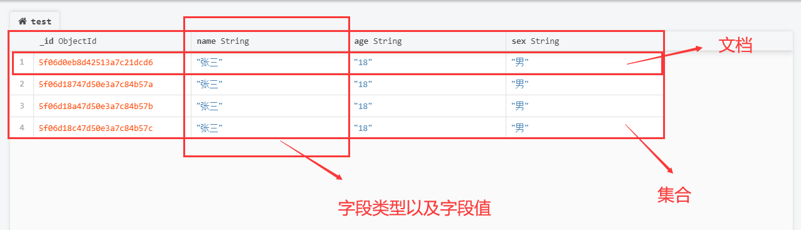


## 2.3 MongoDB 安装

1. `MongoDB`官网下载地址：https://www.mongodb.com/try/download/community

    


2. 下载完成后，双击打开安装包，选择自定义安装，配置`MongoDB`的安装目录

    

    

    

    

    

    

3. 下一步安装 **"install mongoDB compass"** 不勾选，`MongoDB Compass` 是一个**图形界面管理工具**，我们可以在后面自己到官网下载安装

    


4. 安装成功后，在命令行窗口输入`net start mongoDB`，启动服务，如果启动成功了则说安装成功！

    


- 注：`MongoDB`服务会默认占用27017端口号


## 2.4 mongoDB数据库导入数据

1. 找到`mongoimport.exe`文件所在的目录

    - `C:\Program Files\MongoDB\Server\4.1\bin`

        

2. 把`mongoimport.exe`文件夹所在的目录添加到系统变量的`path`中

    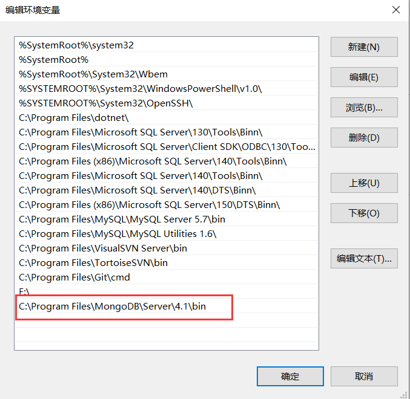

    

    

3. 在命令行窗口输入以下指令

    - `mongoimport –d 数据库名称 –c 集合名称 –—file 要导入的数据文件`

        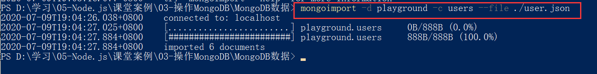


## 2.5 MongoDB GUI 工具

- `MongoDB GUI` 介绍

    - `MongoDB GUI`是**图形界面管理工具**，以图形界面管理的方式，可以让我们更加轻松的操作`MongoDB`数据库

    - 比起使用命令行窗口指令操作数据库，图形界面操作方式更加的友好

    - 常见的`MongoDB GUI` 工具有：RockMongo、MongoDB Compass、Navicat for MongoDB

        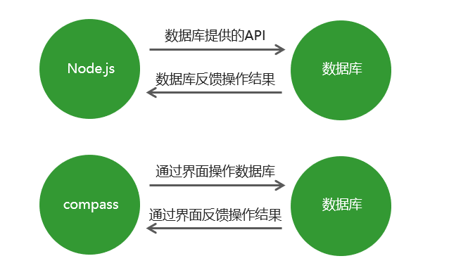

        

        


## 2.6 MongoDB Compass 使用

### 1. 安装


1. `MongoDB Compass`下载地址：https://www.mongodb.com/try/download/compass

    

    

2. 双击运行下载好的.exe 程序，进入正在安装界面

    


3. 安装完MongoDB Compass后，打开软件，进入连接到主机界面，输入必要的信息**进行数据库的连接**

    

    

    

### 2. 数据库主页


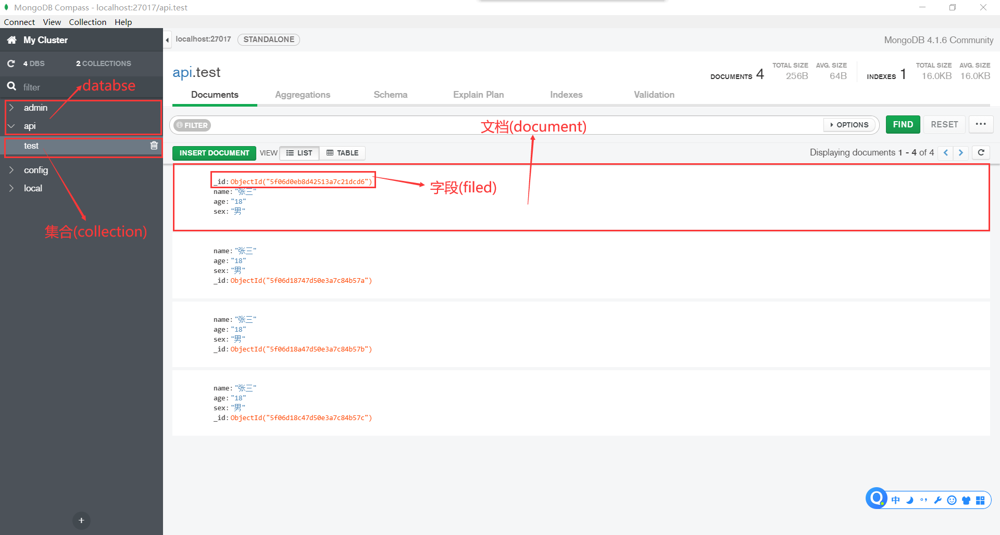


### 3. 创建数据库

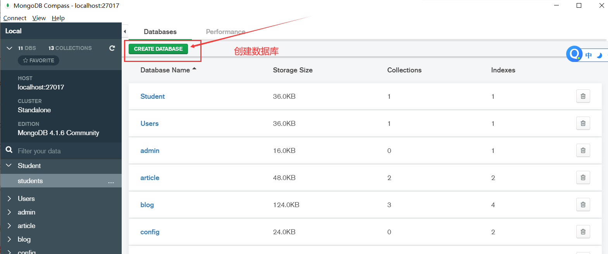


### 4. 创建集合


### 4. 查看集合


### 5. 删除集合


### 6. 集合的导入导出

- `MongoDB Compass`的导入和导出


- `Navicat Premium 15`的导入和导出 ---- 单个集合

    


- `Navicat Premium 15`的导入和导出  ---- 多个集合


# 三、Node.js操作MongoDB (一)

- 前言：除了可以用`MongoDB GUI `图形界面对MongoDB数据库进行操作，还可以用**后端语言**所编写的代码对MongoDB数据库进行操作

    


## 3.1 连接MongoDB 数据库

1. 下载`mongoose`第三方包

    - `npm i mongoose`

        

2. 调用**第三方包的connect方法**连接MongoDB数据库

    ```js
    // 引入mongoose模块
    const mongoose = require('mongoose')
    
    // 连接数据库
    mongoose.connect('mongodb://localhost/playground', { useNewUrlParser: true, useUnifiedTopology: true  })
            .then(() => console.log('数据库连接成功'))
            .catch(err => console.log('数据库连接失败', err))
    ```

    

`connect`方法参数解析

- 第一个参数为你要连接的数据库，格式为`数据库协议://主机地址:端口号/数据库名`，如果没有该名字的数据库，则`MongoDB`软件会自动创建一个该名字的数据库

- `27017`是**mongodb协议的默认端口**，所以可以不写

- 第二个参数，是为了解决终端里的报错信息(不用了解)

    

`connect`该方法会返回一个Promise实例

- 当数据库连接成功时，该Promise实例会变为`resolve`状态

- 当数据库连接失败时，该Promise实例会变为`reject`状态

    

注：只有与数据库**建立连接**之后，才能对数据库进行**增删改查**的操作


## 3.2 创建集合

- 创建集合分为两步，一是**对集合设定规则**，二是**创建集合**

    - 集合可以看成是一个表格，对集合设置规则，就是对`字段进行约束`

    - ```js
        // 1. 设定集合规则 (设置字段的类型)
        const courseSchema = new mongoose.Schema({
          name: {
            type:String,  // 该字段必须为字符串类型
            required:true,  // 该字段必须填写
          },
          author: String, // 该字段类型必须为布尔值
          isPublished: Boolean,  // 该字段类型必须为布尔值
        })
        
        // 2. 使用集合规则去创建集合，会返回一个集合对象，该集合对象可以对数据库集合进行操作
        const Course = mongoose.model('course', courseSchema); // 'courses'是集合名
        ```

    - 使用集合规则去创建集合时会返回一个集合对象，该**集合对象可以对数据库集合进行增删改查操作**

    

- 创建集合时的`规则`：

    - ```
        required: true 该字段为必传字段，否则报错
        minlength：3    字符串类型字段的最小长度为3
        maxlength: 20   字符串类型字段最大长度为 20
        min: 18     数值类型字段最小长度为3
        max: 30			数值类型字段最小长度为30
        enum: ['html', 'css', 'javascript', 'node.js']  只能传递数组中的值
        default: Date.now()   默认值为当前时间
        ```

        

- 注：创建集合时，数据库会默认将**集合名字变为`复数形式`，**建议创建集合时，其集合名就是复数形式


## 3.3 添加文档数据（方式一）

- 需要创建好`集合`，才能往集合中添加`文档数据`

    - ```js
        // 1. 往集合中添加一条文档数据
        const document = new Course({  
                name: 'Node.js course',
                author: '黑马讲师',
                isPublished: true
        })
        // 2. 将数据保存到数据库中
        document.save()
        ```

    - 上图代码中的`Course`为创建好的集合对象

    - 插入的文档数据中的`字段类型必须与集合规则一致`

        

- 如果想要往集合中添加多条文档数据，则需要不断的`new 集合对象`

    - ```js
        // 1. 往集合中添加第二条文档数据
        const document2 = new Course({  
                ......
        })
        // 2. 将数据保存到数据库中
        document2.save()
        ```

        

## 3.4 添加文档数据（方式二）

- 通过`集合对象`的`create`方法创建一条文档数据

    - ```js
        Course.create({name: 'JavaScript基础', author: '黑马讲师', isPublish: true}, (err, doc) => {  // 当添加文档数据
             //  错误对象
            console.log(err)
             //  当前插入的文档数据
            console.log(doc)
        });
        ```

        

- 集合对象.`create`方法接收两个参数

    - 第一个参数是一个对象，里面传入要添加的文档数据
    - 第二个参数是回调函数，当添加文档数据成功或失败时，就会被调用

    

- `create`的方法会返回一个Promise对象

    - ```js
        Course.create({name: 'HTML', author: 'lbl', isPublished: false})
              .then(doc => console.log(doc))
              .catch(err => console.log(err))
        ```

    - 当添加文档数据成功时，该Promise实例会变为`resolove`状态，并且传入所写入的文档数据

    - 当添加文档数据失败时，该Promise实例会变为`reject`状态，并且传入错误信息

        

- `create`方法添加文档数据`更推荐`，因为他能够检查我们是否添加文档数据成功


## 3.5 查询数据

- 以查询导入的`users`集合为例，准备工作：

    - ```js
        // 连接数据库
        mongoose.connect('mongodb://localhost/playground').....
        
        // 创建集合规则
        let userSchema = new mongoose.Schema({...})
        
        // 使用集合规则来创建集合对象
        let User = mongoose.model('users', userSchema)
        ```

    - 如果只是单纯的查询文档数据，不做其他操作，集合里面的规则可以不写

    

- `集合对象.find()`

    - ```js
        User.find({查询条件}).then(res => console.log(res[0]))
        ```

    - 该方法会返回一个Promise对象，且**符合查询条件的所有文档数据**是存放在`数组中`的

    - ```js
        // 查找所有name字段为王五的文档数据
        User.find({name: '王五'}).then(res => console.log(res))
        // res: [ {name: '王五', age: 18 ........}, {name: '王五',age: 19....} ]
        ```

        

- `集合对象.findOne`

    - `findOne`***只会查询到一条***符合`查询条件`的文档数据，且查询到的文档数据是`存放在对象中的`

    - ```js
        // 查询一条name字段为王五的文档数据
        User.findOne({name: '王五'}).then(res => console.log(res))
        // res: {name:'王五',........} 
        ```

        

- 通过`筛选`的方式查询文档数据

    - ```js
        // 查找age字段 大于20 且小于50 的文档数据
        User.find({age: {$gt: 20, $lt: 50}}).then(result => console.log(result))
        ```

    - ```js
        // 查找 hobbies字段 中包含 ‘敲代码’ 的文档数据
        User.find({hobbies: {$in: ['敲代码']}}).then(result => console.log(result))
        ```

    - ```js
        // 查询指定的字段  
        User.find().select('name email').then(result => console.log(result))
        ```

    - ```js
        //  skip 跳过多少条数据  limit 查找几条数据
        User.find().skip(2).limit(2).then(result => console.log(result))
        ```

        

    

## 3.6 删除文档数据

- `集合对象.findOneAndDelete()`

    - ```js
        User.findOneAndDelete({删除条件}).then(result => console.log(result))
        ```

    - `findOneAndDelete`方法`只会删除一个`符合删除条件的文档数据

    - 该方法会返回一个Promise对象，当删除数据成功时，会变为`resolove`状态，值为删除的数据

    

- `集合对象.deleteMany()`

    - ```js
        // 删除多个
        User.deleteMany({删除条件}).then(result => console.log(result))
        // result:  { n: 2, ok: 1, deletedCount: 2 }
        ```

        

        

## 3.7 修改文档数据

- 更新**单个**文档数据：只更新第一条符合查询条件的文档数据

    - `集合对象.updataOne()`

    - ```js
        User.updateOne({查询条件}, {要修改的值}).then(result => console.log(result))
        ```

        

- 更新**多个**文档数据：更新多条符合查询条件的文档数据

    - `集合对象.updateMany()`

    - ```js
        User.updateMany({查询条件}, {要更改的值}).then(result => console.log(result))
        ```


# 四、Node.js操作MongoDB (二)


## 4.1 集合关联

- 通常`不同集合的数据之间是有关系的`，例如文章信息和用户信息存储在不同集合中，但文章是某个用户发表的，要查询文章集合里用户的信息，就需要用到`集合关联`

    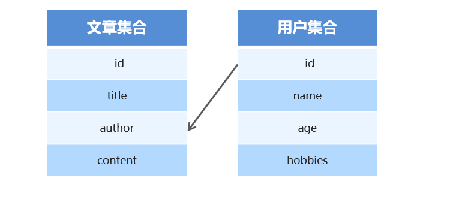

    - 用户集合的`_id字段`与文章集合的`anthor`字段进行关联
    - 这样`author字段`的值，就是用户集合中`_id字段`所在的***那条文档数据***


- 集合关联的实现

    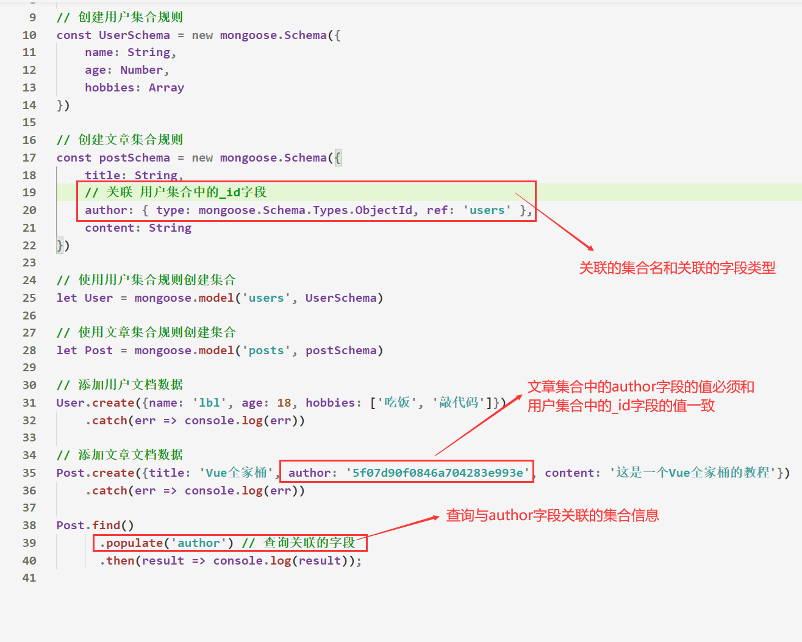

    

    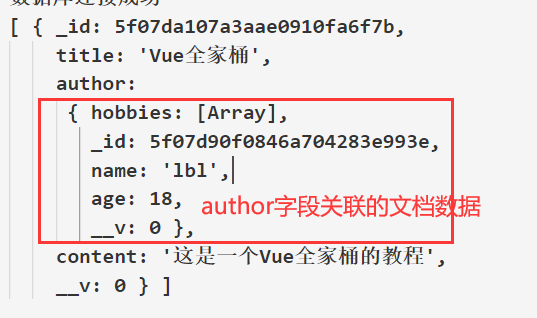

​	 	

## 4.2 获取文档数据的长度

- `集合对象.countDocuments({}) `

    - ```js
        let count = await User.countDocuments({}) // 获取User集合中数据的总数
        ```

        


## 4.3 用户信息增删改查案例

- 本案例设计到的**知识点**：

    - Node原生服务器
    - Node操作MongoDB

    

    

1. 搭建网站服务器，实现客户端与服务器端的通信（模块化）

2. 连接数据库，创建用户集合对象，向集合中插入文档（模块化）

     

3. 当用户访问`/list`时，**将数据库所有用户信息查询出来，**并且渲染到页面中

    1. 以`模板字符串`形式存储静态页面数据

    2. 遍历`文档数据`，有几条`文档数据`，就生成几个`tr标签`(`list += ...`)

    3. 遍历`每个文档数据`中的`hobbies`字段，动态的生成`span标签`

    4. 最终将存储静态页面数据的`模板字符串`响应给浏览器

         

4. 当用户访问`/add`时，呈现**表单页面**，并实现添加用户信息功能

    1. `GET请求访问/add`时，直接发送一个`add.html`静态文件给浏览器

    2. 表单提交时，发送`POST请求`，并提交到`/add`路由上

    3. 拦截`POST请求所携带的表单参数`，并且解析成对象形式，写入到数据库中

    4. 页面**重定向**，重新跳转到`/list`下

         

5. 当用户访问`/modify`时，呈现修改页面，并实现修改用户信息功能

    1. 在点击修改按钮的时候 将用户ID以`地址栏参数`形式传递到当前页面

        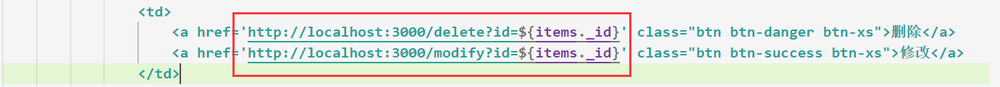

        

    2. 从数据库中查询当前要修改的用户信息 将用户信息展示到`修改页面`中

    3. 指定`修改页面的表单`的提交地址以及请求方式

        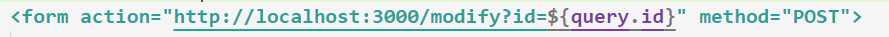

        

    4. 拦截`POST请求所携带的表单参数`，并且解析成对象形式，更新到数据库中

    5. 页面**重定向**，重新跳转到`/list`下

         

6. 当用户访问`/delete`时，实现用户删除功能

    1. 在点击`删除按钮`的时候 将用户ID以`地址栏参数`形式传递到当前页面
    2. 从数据库中删除对应的信息
    3. 页面**重定向**，重新跳转到`/list`下

