# 博客项目实战(一)  ----- 用户管理

## 1.1 项目初始化

1. 建立项目所需文件夹

   ```
   - public 静态资源文件夹
   - model  存放模块的文件夹
   - route  后端路由文件夹
   - views  存放模板文件的文件夹
   ```

   

2. 初始化项目描述文件

   - `npm init -y`

3. 下载项目所需第三方模块

   - `npm install express mongoose art-template express-art-template`

4. 搭建服务器

    

5. 构建模块化路由对象

   - 博客`首页`路由和博`客管理页面`路由

     

6. 构建博客`管理页面模板`

   1. 获取所需要的**静态页面文件**

   2. 将静态文件夹中所有`HTML`文件剪切到`模板文件夹中`并且设置后缀名为`art`

       

7. 开放静态资源访问服务

    


## 1.2 模板文件路径问题

- 访问`一级路由`时，模板文件**外链的其他文件能够正常显示**，是因为其请求路径没有问题

  - 访问地址：http://localhost:3000/index  

  - ```
    <link rel="stylesheet" href="./admin/css/base.css">  // 模板文件
    Request URL: http://localhost:3000/admin/css/base.css  // 浏览器发送的请求
    ```

  - `静态资源访问服务`会响应给浏览器`public文件夹 > admin文件夹 > css文件夹 > base文件`

    

- 当访问`二级路由`时，模板文件外链的其他文件`无法正常显示`，是因为其**请求路径有问题**

  - 访问地址：http://localhost:3000/index/demo

  - ```
    <link rel="stylesheet" href="./admin/css/base.css">  // 模板文件
    Request URL: http://localhost:3000/index/admin/css/base.css  // 浏览器发送的请求
    ```

  - `静态资源访问服务`会响应浏览器`public文件夹 > index文件夹 > admin文件夹 > css文件夹 > base文件`

  - 由于无法找到该静态资源文件，html页面得不到渲染


- 当访问`二级路由`时，其静态资源文件的请求地址会变为：`http://localhost:3000/一级路由/静态资源文件所属的文件夹/静态资源文件`，则导致无论如何也找不到该静态资源文件

  

- 解决方案：

  - 将模板文件中引入的文件的`相对路径`替换成`绝对路径`

  - ```
    <link rel="stylesheet" href="/admin/css/base.css">  // 模板文件
    Request URL: http://localhost:3000/admin/css/base.css  // 浏览器发送的请求
    ```

    

- 总结：***在模板文件中外链资源要写`绝对路径`***


## 1.3 优化模板

- 抽离模板文件中**公共的区域部分**

  - 在views|admin|文件夹下创建一个`common文件夹`，该文件夹专门存放`管理页面`的模板文件中的`公共区域`

      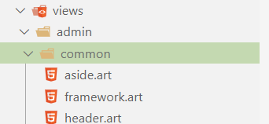

      

  - 将所有`管理页面（除了登录页面）`的**头部以及侧边栏**，剪切到common|header.art和aside.art文件下

  - 通过`子模板语法`，将其头部和侧边栏引入

    - ```
      {{include './common/header.art'}}
      
      <!-- 主体内容 -->
      <div class="content">
      		{{include './common/aside.art'}}
      ......
      ```

      

- 抽离模板文件中的**HTML骨架**

  - common|***framework.art***文件中存放的就是HTML骨架
  
      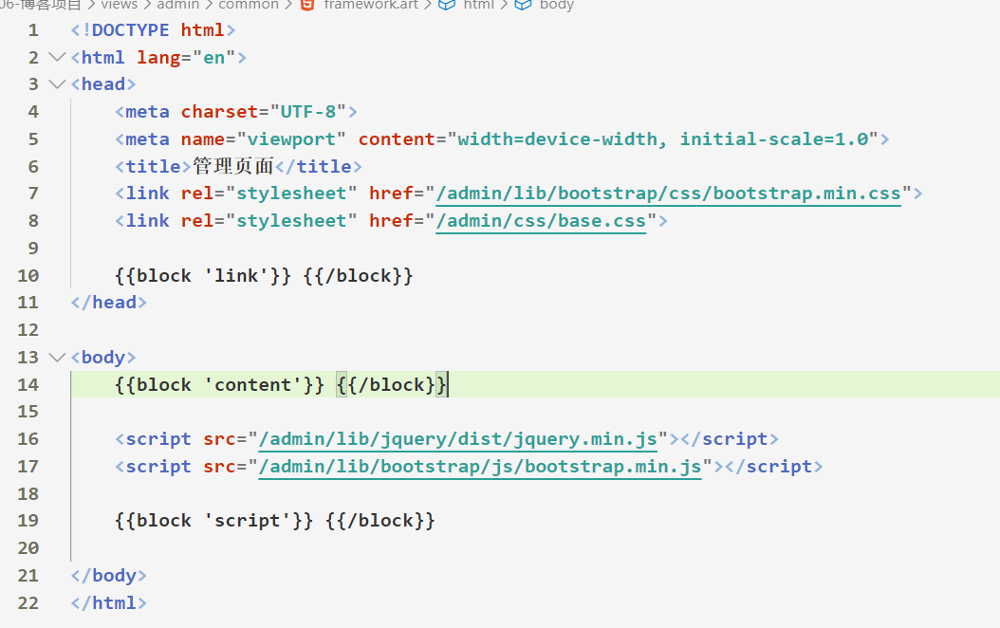


- 最终的模板文件页面

  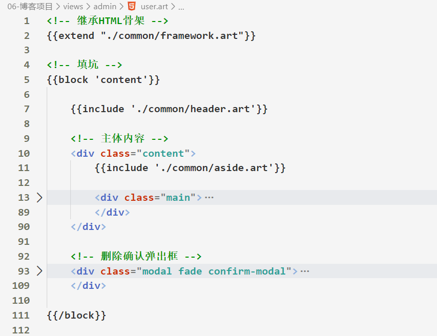


## 1.4 初始化用户信息

- 连接`blog`数据库

- 创建`user`集合

  - ```js
    // 创建集合规则
    const userSchema = new mongoose.Schema({
        userName: type: String,
        email: {
            type: String,
            require: true,
            unique: true
        },
        password: String,
        role: String, // admin: 管理员身份  normal: 普通用户
        state: {  // 0：启动状态  1：禁用状态
            type: Number,
            default: 0
        }
    })
    ```

    


## 1.5 登录

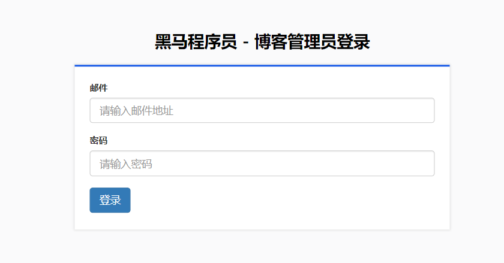

1. 为登录表单项设置**请求地址、请求方式以及表单项name属性**

    

2. 当用户点击登录按钮时，客户端验证用户是否填写了邮件和密码

   - 如果其中一项没有输入，阻止表单提交，并且**弹窗提示**

     

3. 服务器端接收请求参数，进行**二次验证**

   - 如果其中一项没有输入，为客户端做出响应，5秒后自动跳转到登录页面

     

4. 根据邮箱地址查询用户信息

   - 如果用户不存在，为客户端做出响应，阻止程序向下执行

   - 如果用户存在，将用户输入的密码和数据库中的密码进行比对

   - 比对成功，用户登录成功

   - 比对失败，用户登录失败

     

5. 登录成功，保存登录状态

   - 登录成功时，将登录的用户信息存储到`app.locals`这个对象上，并且将用户名字存入到`app.session.userName属性下`
   - 并且修改用户信息页面的数据，将用户名改成当前登录的用户的名字
   - 登录成功后跳转到用户页面`res.redirect('http://localhost:3000/admin/user')`

6. 判断当前登录用户的身份

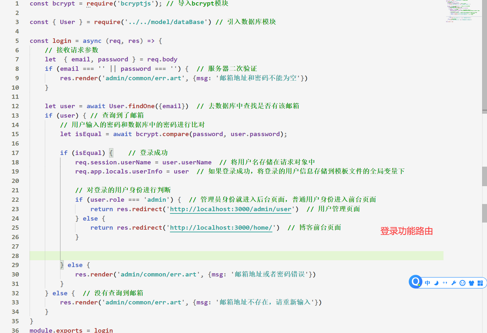


## 1.6 密码加密

- 数据库中存储的用户密码一般都是加密后的密码，这样可以提高密码的安全性

- 密码加密需要使用到第三方模块：`bcryptjs`

- `bcryptjs`依赖的其他环境

  1. 安装目录需要写到`系统环境变量中的path下`

  2. `npm install -g node-gyp`

  3. `npm install --global --production windows-build-tools`

     

- 生成`加密密码`

  - ```js
    const bcrypt = require('bcryptjs'); // 导入bcryptjs模块
    // 生成随机字符串
    let salt = await bcrypt.genSalt(10);
    // 使用随机字符串对密码进行加密  pass变量为加密后的密码
    let pass = await bcrypt.hash('明文密码', salt);
    ```

- **加密后的密码**与**原始密码**进行比对

  - ```js
    let isEqual = await bcrypt.compare('原始密码', '加密密码');
    // isEqual为true则比对正确 否则不比对
    ```
    
    

- 将数据库中的所有用户密码进行加密操作：

  - ```js
    async function createUser() {
        let salt = await bcrypt.genSalt(10);
        let pass = await bcrypt.hash('977654321', salt);
    
        const user = await User.create({
            userName: '李四',
            email: '49947276123@qq.com',
            password: pass,
            role: 'normal'
        })
    }
    createUser()
    ```

    


## 1.7 拦截请求

- 当用户访问除`/admin/login`以外的页面，需要判断用户登录状态

  - 如果请求对象中有***session***对象的`userName`属性，则说明用户已经登录过了，可以**直接访问用户管理页面**

  - ***如果session***对象的`userName`属性为空，则说明用户还没有登录，**响应给浏览器登录页面**

    

  - ```js
    app.use('/admin', (req, res, next) => {
        console.log(req.session.userName);
        if (req.url != '/login' && !req.session.userName) { // 判断用户的登录状态
             res.redirect('/admin/login') 
        } else {
            next()
        }
    })
    ```

  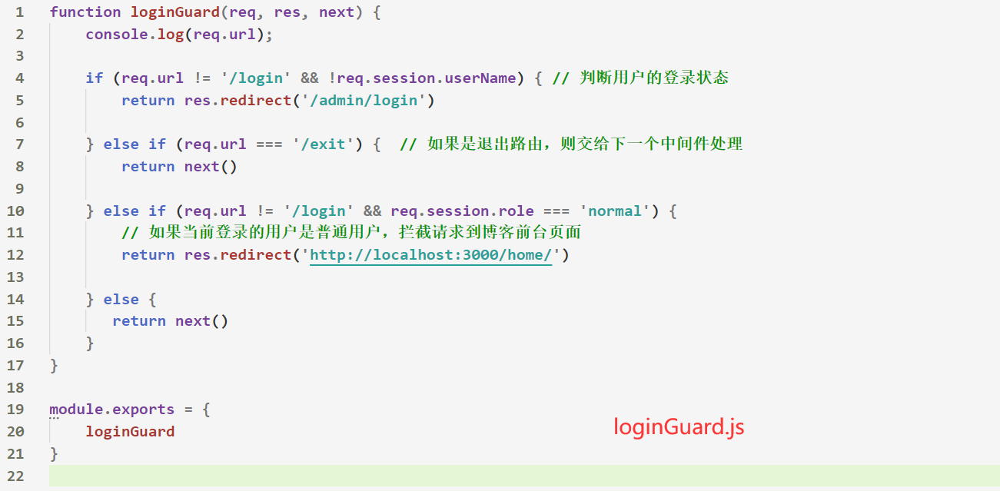

  

  

## 1.8 代码优化

- 在项目的根目录下创建一个`middleware`文件夹，该文件夹专门用于存放`全局中间件的回调函数`
  - 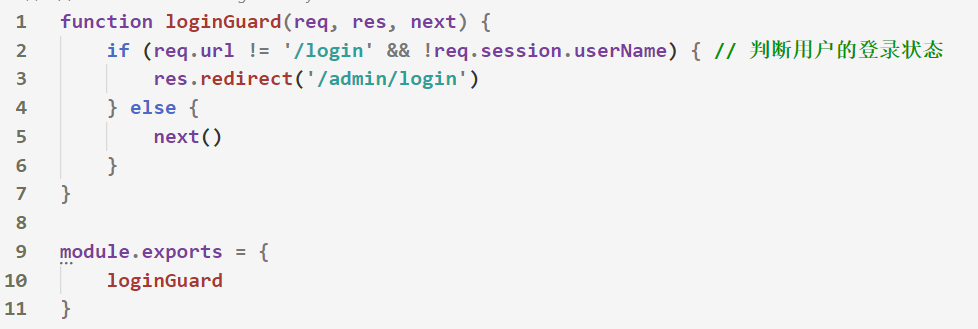


- 在|route|文件夹下创建一个`admin`文件夹，该文件夹专门用于存放`管理页面中所有请求的回调函数`
  - 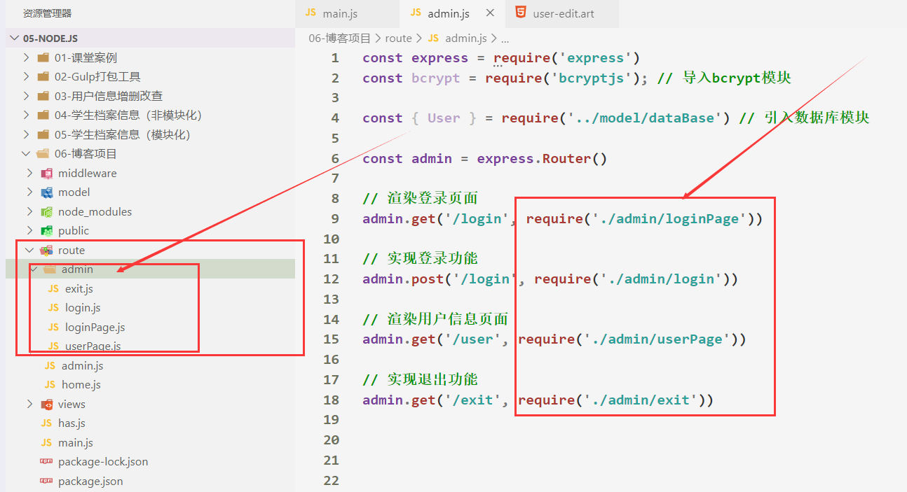
  - ​	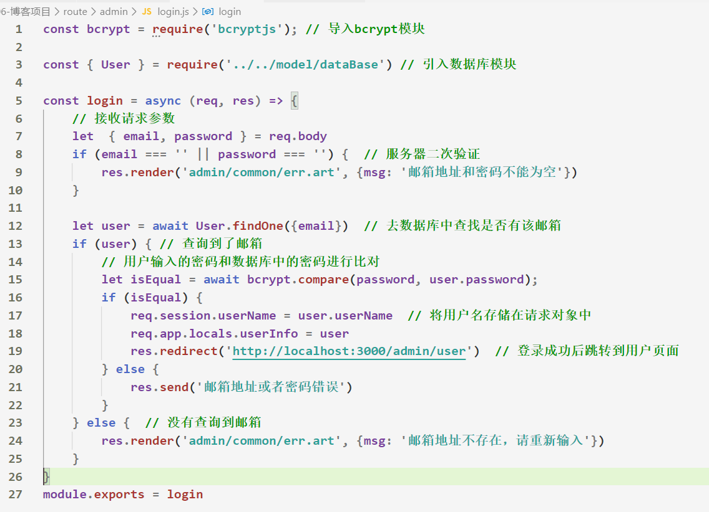


# 博客项目实战(二) ----- 用户管理


## 2.1 新增用户

1. 为用户管理页面的**新增用户按钮添加链接**

2. 添加一个连接对应的路由，在路由处理函数中***渲染新增用户模板页面***

   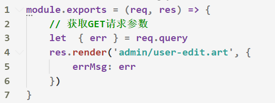

   

3. 为**新增用户表单**指定请求地址、请求方式、为表单项添加name属性

4. 增加实现**添加用户的功能路由**

5. 接收到浏览器传递过来的**POST请求参数**

6. **对请求参数的格式进行验证**

7. 验证当前要注册的邮箱地址是否已经注册过

8. 对密码进行加密处理

9. 将用户信息添加到数据库中

10. 重定向页面到用户列表页面

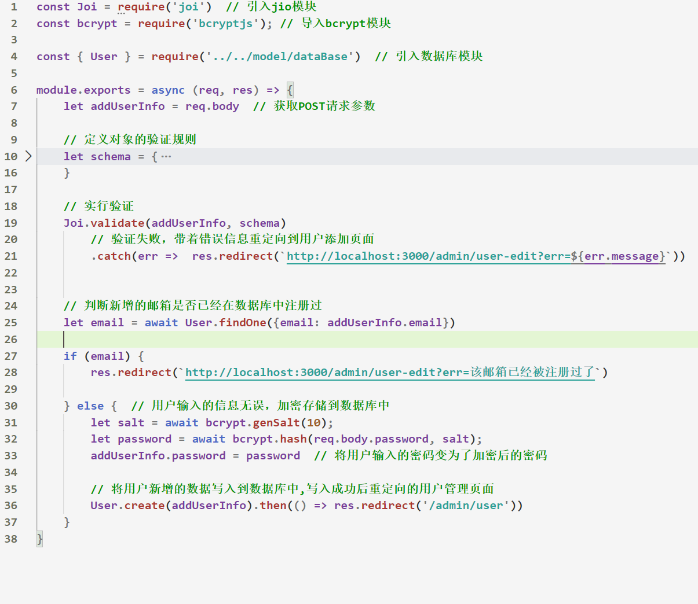


- 注意点：服务器响应给浏览器数据时，前面一定要跟上`return`,以便于终止后面的代码


## 2.2 Joi

- JavaScript对象的规则描述语言和***验证器***

  - `npm i joi@14.3.1`，这里需要安装14.3.1版本

- ```js
  const Joi = require('joi')  // 引入joi模块
  // 定义对象的验证规则
  const schema = {
      username: Joi.string().min(3).required().error(new Error('用户名不正确')),
      email: Joi.string().email().error(new Error('邮箱输入错误'))
  };
  // 实行验证
  Joi.validate({username: '123456', email: '222'}, schema)
      .then(res => console.log(res))
      .catch(err => console.log(err.message))  // 邮箱输入错误
  ```

  - 如果验证失败，则`catch`会捕获自定义的错误信息
  - 如果验证成功，`then`方法里面会有验证成功的对象信息


## 2.3 优化新增用户模块的代码

- **对POST请求参数的格式进行验证**的代码抽离到**数据库模块**中，**数据库模块导出验证请求参数的方法**

  - 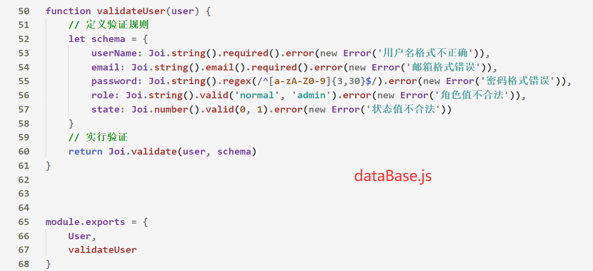

    

- 验证代码封装到`try...catch中`，这样可以防止先执行下面的代码

- 将用户新增时的错误处理代码交给`错误中间件处理`

  - 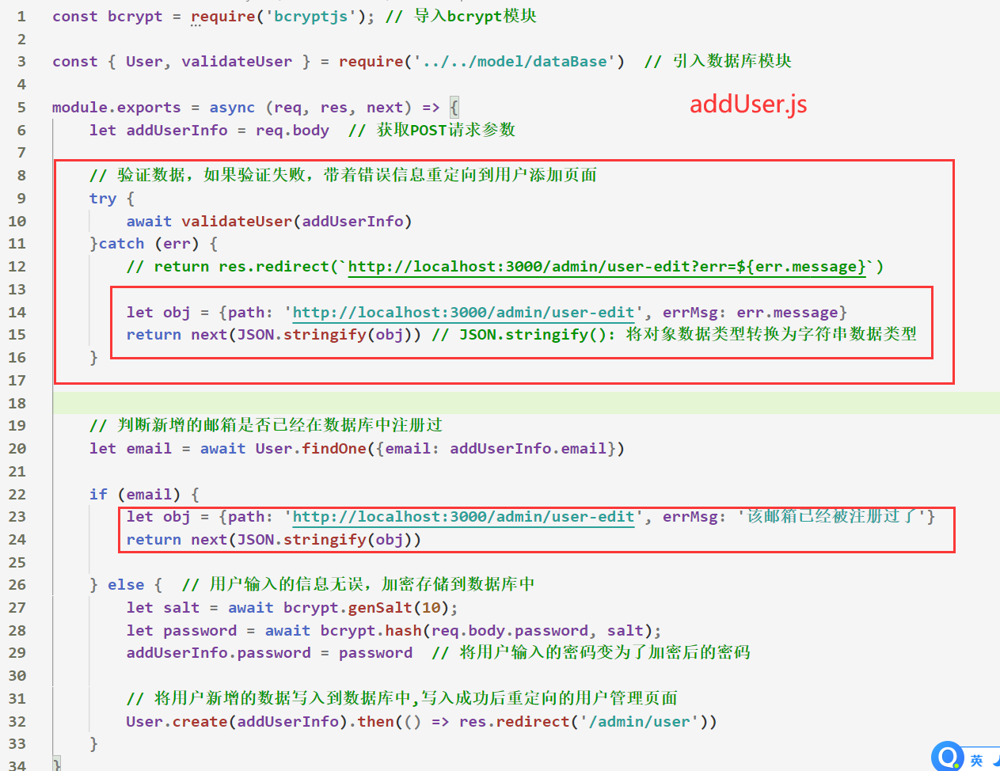

  - 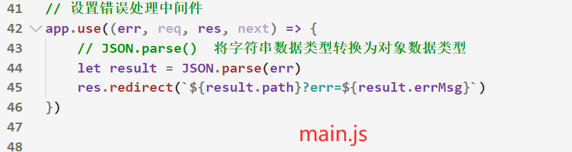


## 2.4 展示用户信息

- 获取数据库中所有的用户信息，并且作为模板数据

  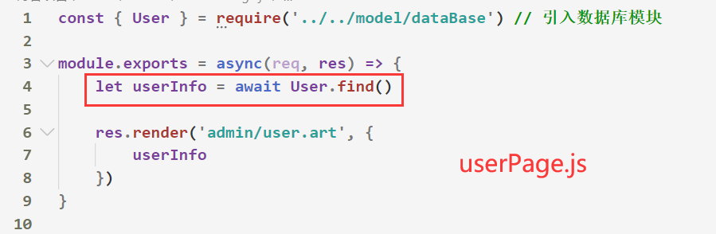

- 在模板文件中使用`循环语法`遍历数据库数据

  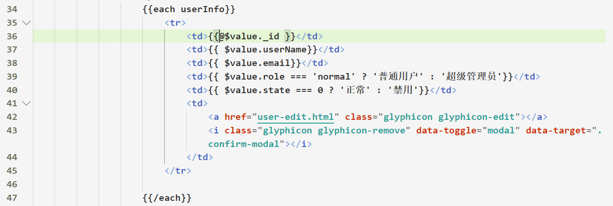


- 需要注意的是***模板文件中遍历的数据名，不能与模板文件中公共的变量名同名***


## 2.5 数据分页

- 当数据库中的数据非常多，数据需要分批次显示，这时就需要用到数据分页功能

  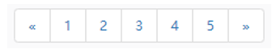

  

- 分页功能核心要素：

  1. 当前页，用户通过点击上一页或者下一页或者页码产生，***浏览器通过get参数方式传递到服务器端***
  2. 总页数，根据总页数判断当前页是否为最后一页，根据判断结果做响应操作

- 总页数：Math.ceil（总文档数据 / 每页显示数据条数）

  - 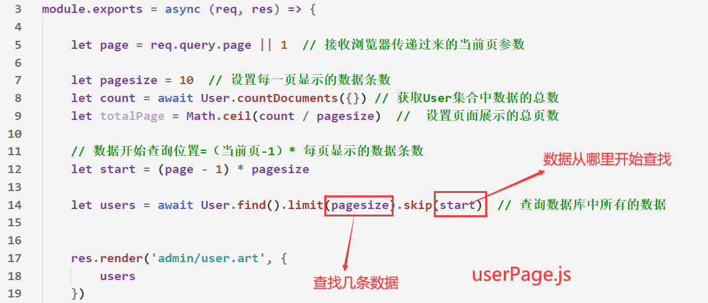


- 根据总页数遍历分页页数
  - 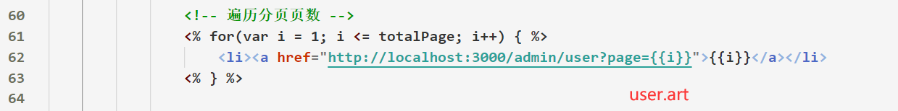


- 数据分页功能完善：

  - 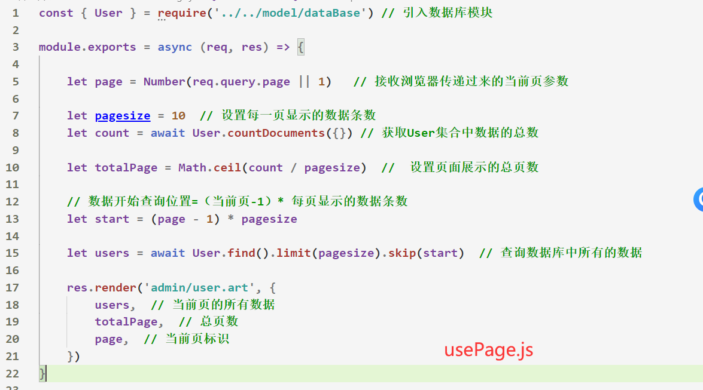

  - 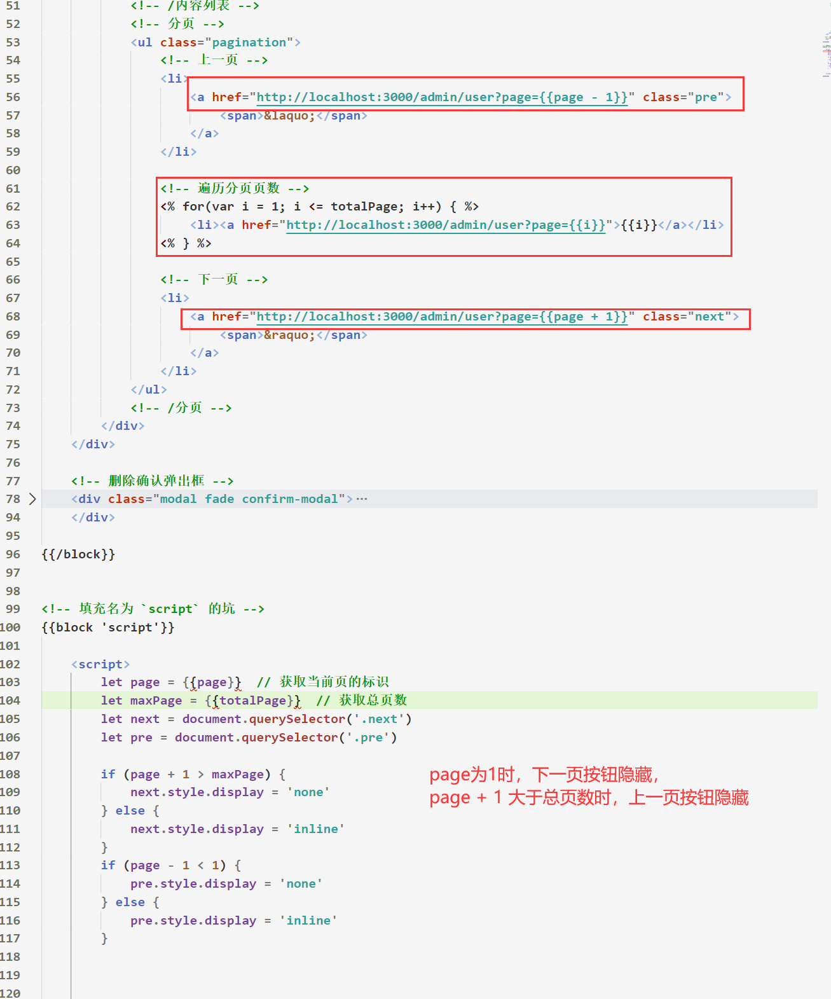


## 2.6 用户信息修改


1. 当点击修改按钮时，跳转到`用户编辑页面`，并且将`id作为地址栏参数`传递到服务器

   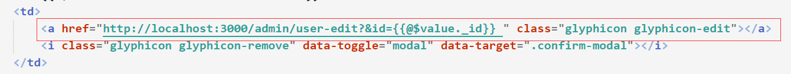

   - 传递id时，前面需要用`@符号`解析

       

2. 接收浏览器传递过来的id参数，根据`id`去数据库查询到对应的数据，并且展示到页面上

   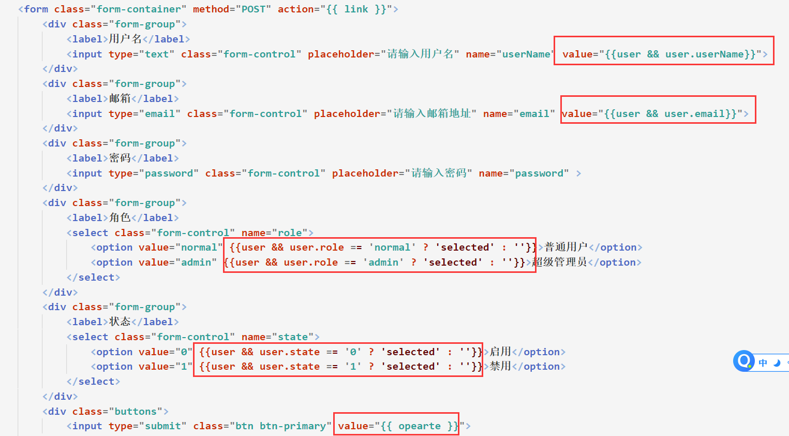

   

3. 由于修改用户的表单和添加用户的表单页面是同一个，因此需要传递参数，区分表单的提交地址

   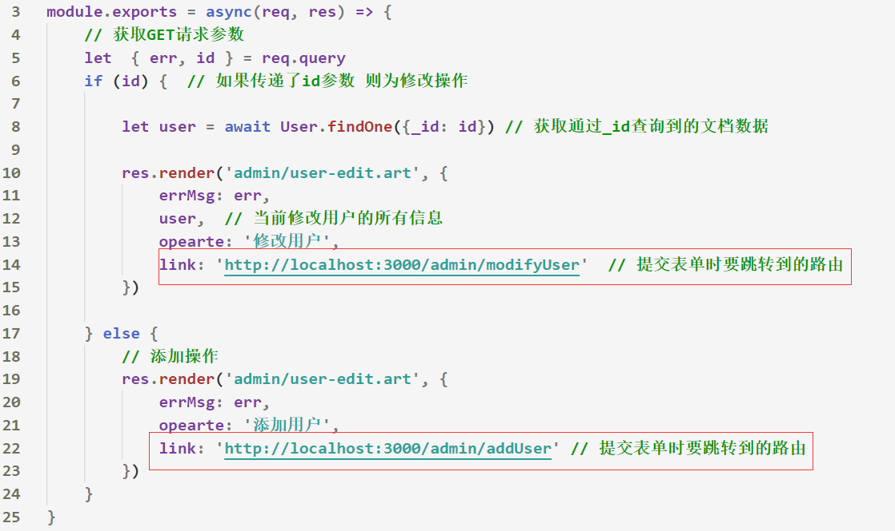


4. 提交修改用户的表单时，需要传递`id地址栏参数`，将用户输入的密码与数据库中的密码进行比对
5. 如果比对失败，对客户端做出响应

6. 如果密码对比成功，将用户信息更新到数据库中

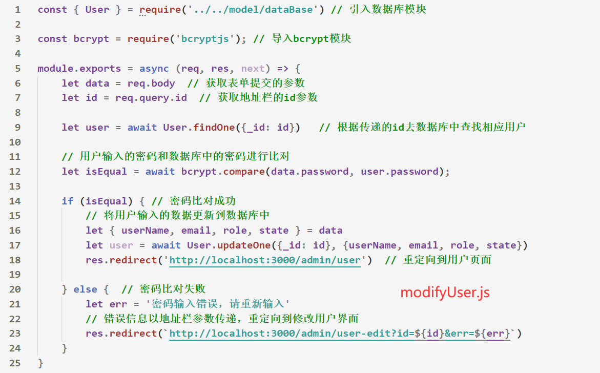


## 2.7 用户信息删除

1. 在确认删除框中添加`隐藏输入框`用以存储要删除用户的ID值

2. 为删除按钮添自定义属性用以存储要删除用户的ID值

3. 为删除按钮添加点击事件，在点击事件处理函数中获取自定义属性中存储的ID值并将ID值存储在表单的隐藏域中

4. 为删除表单添加提交地址以及提交方式

5. 在服务器端建立删除功能路由

6. 接收客户端传递过来的id参数

7. 根据id删除用户

   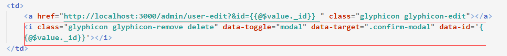

   

   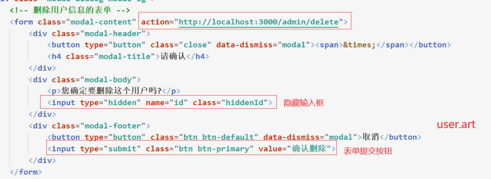


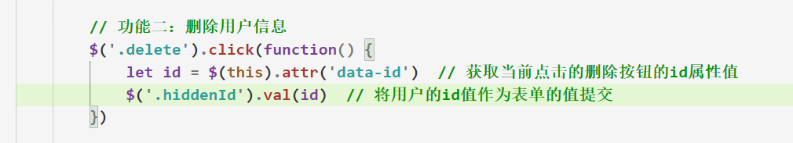


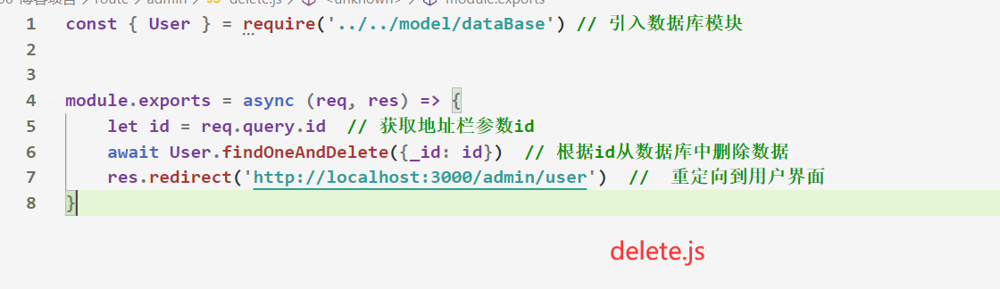


## 2.7 实现用户退出登录功能


1. 新增一个退出用户登录的功能路由

   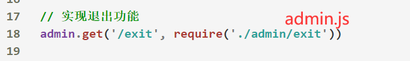


2. 退出用户登录后，服务器需要与浏览器断开连接

   - 服务器与浏览器之间的`cookie`与`session`将会被清空
   - 登录成功后在模板引擎下存储的全局变量，也设置为null
   - 重定向到登录页面

   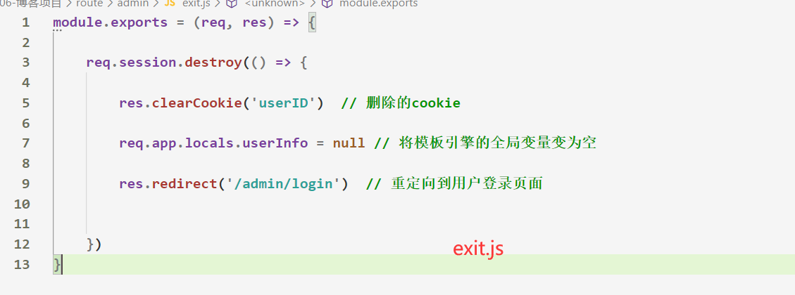


# 博客项目实战(三) ----- 文章管理

## 3.1 文章管理页面渲染

1. 新增`文章列表路由`和`文章编辑路由`，并且为浏览器渲染其对应的模板文件

   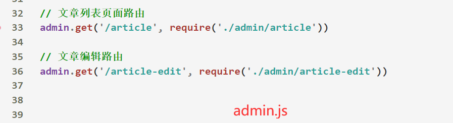

2. 为用**户管理页面**和**文章管理页面**所涉及到的***路由***，分别设置模板引擎的***全局变量***，以便于区分当前访问的页面属于哪一种

   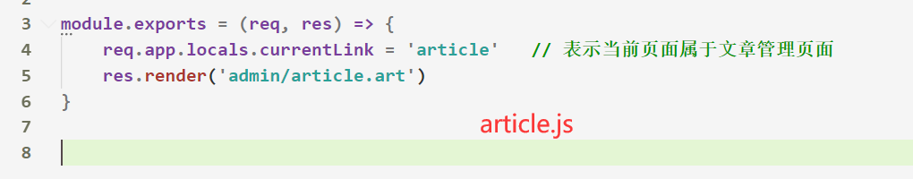


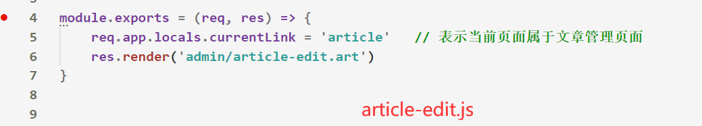


3. 在***侧边栏模板文件***中，判断当前的页面属于哪一类型的页面

   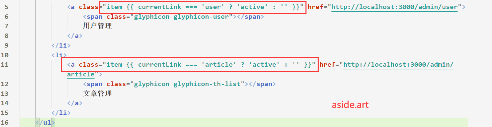


## 3.2  创建文章集合对象

1. 创建文章集合规则
2. 根据文章集合规则创建文章集合对象
3. 将文章集合对象作为模块成员进行导出

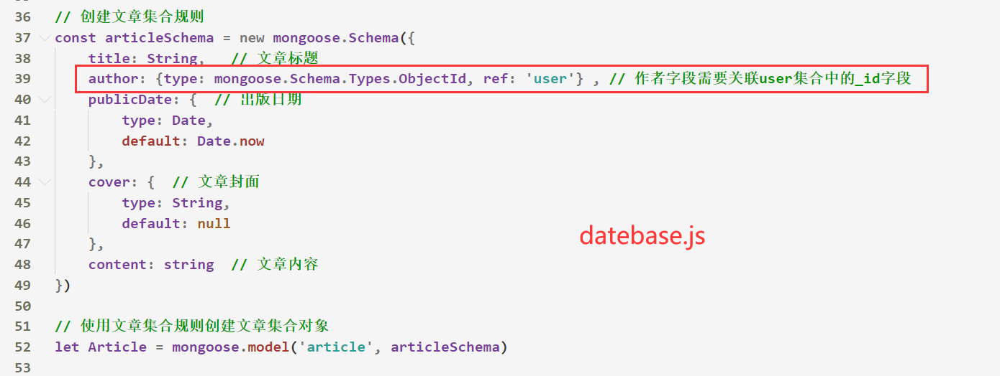


4. 使用文章集合对象往数据库中添加一条数据

   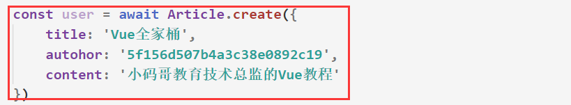

   

   

   

   

## 3.3 实现文章添加功能

1. 为**文章列表页面**的***新增文章按钮添加请求地址***

   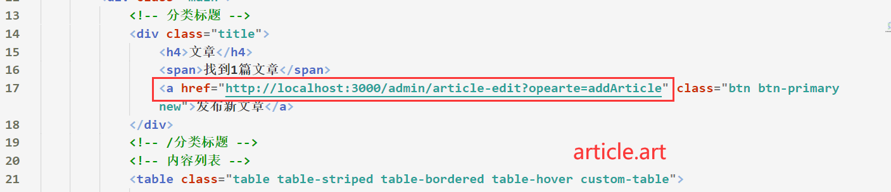

   

2. 为***新增文章表单***指定请求地址、请求方式、为表单项添加name属性

   - 由于添加文章和修改文章操作的是同一个表单，为了进行区分，这里以GET请求参数来判断当前属于哪种操作

   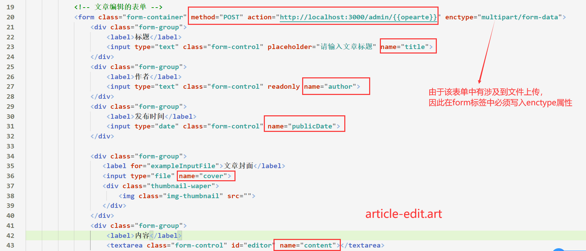

   

3. 增加实现***添加文章***的功能路由

   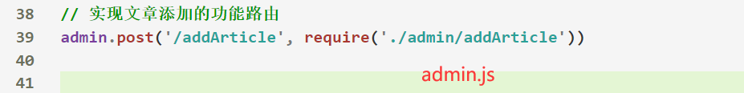

   

4. 接收到浏览器传递过来的请求参数

   - ***req.body***无法解析带有文件上传的表单，因此需要借助到第三方模块`formidable `

   - ```js
     const formidable = require('formidable');
     
     // 1. 创建表单解析对象
     const form = new formidable.IncomingForm(); 
     // 2. 配置上传文件的存放位置(绝对路径)
     form.uploadDir = path.join(__dirname, "../../public/uploads")
     // 3. 是否保留表单上传文件的扩展名
     form.keepExtensions = true;  
     
     // 4. 对表单进行解析
     form.parse(req, (err, fields, files) => { 
       // 1. err: 错误对象，如果表单解析失败 err里面则会存储错误信息，如果表单解析成功，err将会是null
       // 2. fields: 保存的是普通表单数据(不包括上传的文件) 以对象形式进行存储
       // 3. files: 保存的是上传文件相关的数据 以对象形式进行存储
     });
     ```

   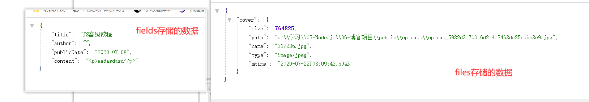

   

   

   

   

5. 设置***文章编辑表单***中作者的值

   - 作者的值是当前登录的`用户信息的_id字段`
   - 在前面实现登录功能时，如果登录成功，则将登录的用户信息数据存储到模板文件下的***全局对象***下

   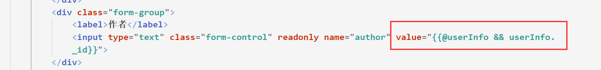


6. 当用户选择完`文章封面图片文件`后，将选择的图片渲染到`文章编辑页面`中

   - 该功能需要通过`文章编辑页面中`的`jS`完成

   - ```js
     // 实现选择图片  渲染到页面的功能
     let file = document.querySelector('.file')  // 选择文件的表单按钮
     let coverImg = document.querySelector('.img-thumbnail')  // img标签
     // 当选择完文件后触发事件
     file.onchange = function() {  
       // 获取用户选择的第一个文件的相关信息
       let selectFile = this.files[0]
     
       // 1. 创建文件读取对象
       let reader = new FileReader()
       // 2. 读取文件
       reader.readAsDataURL(selectFile)
       // 3. 监听onload事件
       reader.onload = () => {
         // 将文件读取的结果显示在页面中
         coverImg.src = reader.result
       }
     }
     ```

     

     

7. 接收到浏览器中传递参数，并且***保存到数据库中***

   - `文章封面图片`是以路径形式，存储到数据库中的

   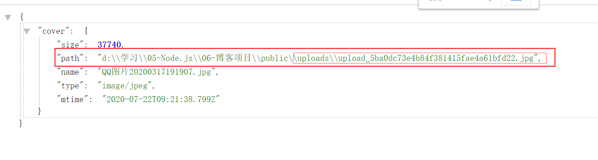

   - 需要注意的是：浏览器是通过网址来访问服务器的，如果需要访问服务器的中的一张图片，则必然是以`静态资源访问`形式访问的，因此图片路径需要截取`uploads`之后的路径，来存储到数据库中

     


## 3.4 实现文章列表数据的展示

1. 获取数据库中所有的文章数据，并且作为模板数据

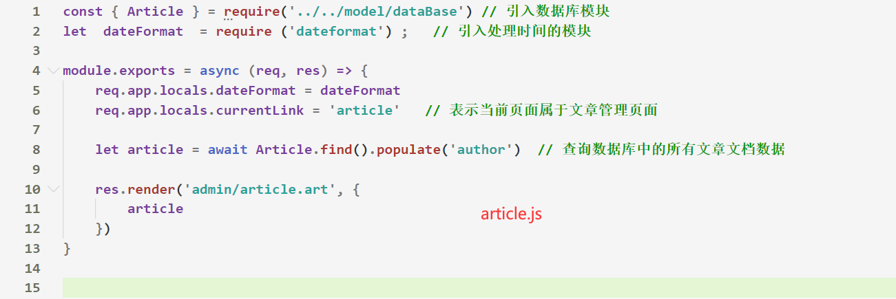


2. 在模板文件中使用`循环语法`遍历数据库数据

   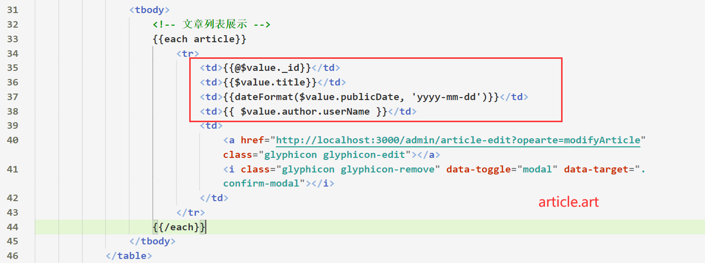


## 3.5 文章数据分页

1. ```js
   const pagination = require('mongoose-sex-page'); // 引入第三方模块，用于处理数据分页
   pagination(集合对象).find().page(1).size(2).populate('author').exec()
   ```

   

2. `let article = await pagination(Article).find().page(1).size(2).populate('author').exec()  `

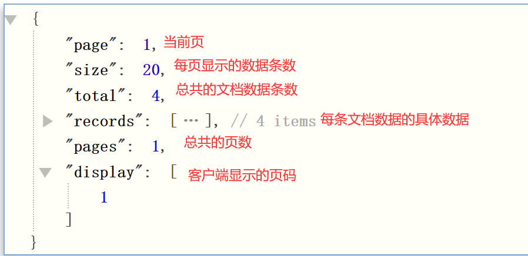


3. 完善文章数据分页功能

   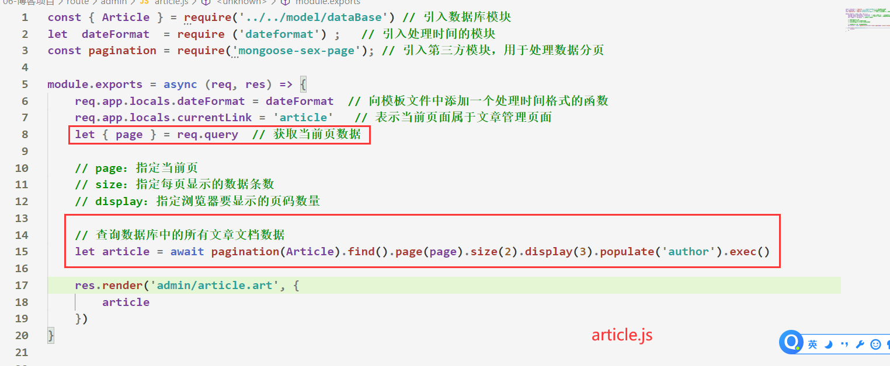


4. 实现文章列表的页码展示以及上一页和下一页页码的功能

   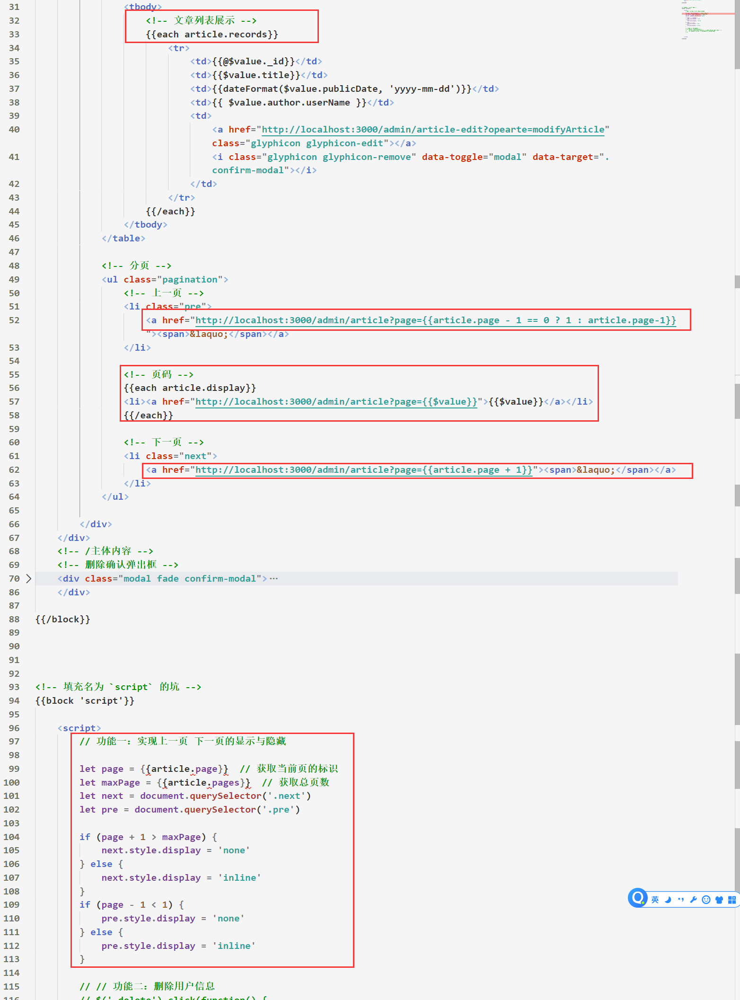


## 3.6 实现文章修改功能

1. 击修改按钮时，跳转到`文章编辑页面`，并且将`id作为地址栏参数`传递到服务器

   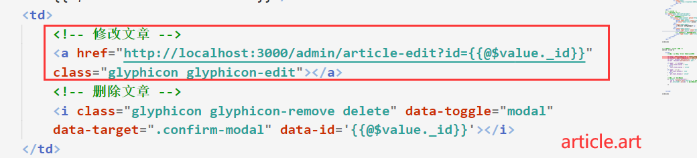

   - 传递id时，前面需要用`@符号`解析

     

2. 接收浏览器传递过来的`文章id参数`，根据`id`去数据库查询到对应的数据，并且展示到页面上

   - 由于修改用户的表单和添加用户的表单页面是同一个，因此需要传递参数，***区分表单的提交地址***

   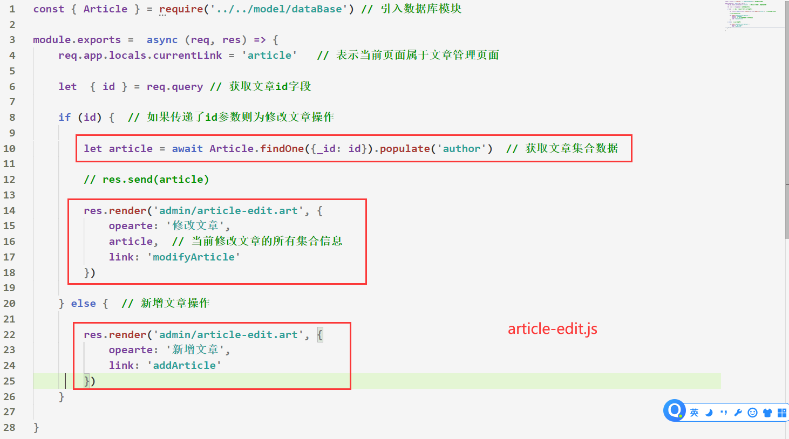

   

   

   

   

3. 创建修改文章表单的`路由`，通过地址栏参数传递的`文章_id字段`来`更新`对应的文章数据

   - 更新数据完成之后，***重定向到文章管理列表页面***

   

   

   ​	


## 3.7 实现文章删除功能

1. 在确认删除框中添加`隐藏输入框`用以存储要删除用户的ID值

   

   

2. 为删除按钮添自定义属性用以存储要删除用户的ID值

   

   

3. `为删除按钮添加点击事件`，在点击事件处理函数中获取自定义属性中存储的ID值并将ID值存储在表单的隐藏域中

   

   

4. 为删除表单添加提交地址以及提交方式

   

   

5. 在服务器端建立删除功能路由

6. 接收客户端传递过来的id参数

7. 根据id删除用户

   

   


# 博客项目实战(四) ----- 前台展示


## 4.1 初始化前台路由


- 为博客前台首页与前台文章详情页面，分别添加对应的路由，**渲染其对应的模板文件**

  


## 4.2 模板优化


1. ***将模板文件中所有外链的文件，都修改为绝对路径***

   


2. 抽离模板公共区域到`views/home/common`文件夹下

   

   

3. 抽离模板骨架

   


4. 通过**模板语法**分别将`公共区域的模板`和骨架，引入到当前模板下

   

   

   


## 4.3 渲染数据到前台首页

1. 获取文章集合中所有的数据，并且作为模板文件的数据

   

   

2. 在模板文件中遍历文章集合的数据

   


## 4.4 实现数据分页功能

1. 引入第三方模块`mongoose-sex-page`

   


2. 遍历总共的页数，实现上一页与下一页的功能

   


## 4.5 实现文章列表的详情页面

1. 点击封面图片时，跳转到文章详情路由，并且***传递当前文章的id字段***

   


2. 根据传递的id去获取数据库中对应的文章集合数据（一条文档数据）

   

   

3. 渲染数据到文章详情页面的模板文件中

   


## 4.6 实现文章评论功能

1. 创建评论集合

   

   

2. 判断用户是否登录，如果用户登录，再允许用户提交评论表单

   

   

3. 在服务器端创建文章评论功能对应的路由，指定表单的提交地址以及方式，为每个输入框添加`name`属性

   

   

   

    

   

   

4. 在路由请求处理函数中接收客户端传递过来的评论信息

5. 将评论信息存储在评论集合中

6. 将页面重定向回文章详情页面

   

   

7. 在文章详情页面路由中获取文章评论信息并展示在页面中

   


​	


