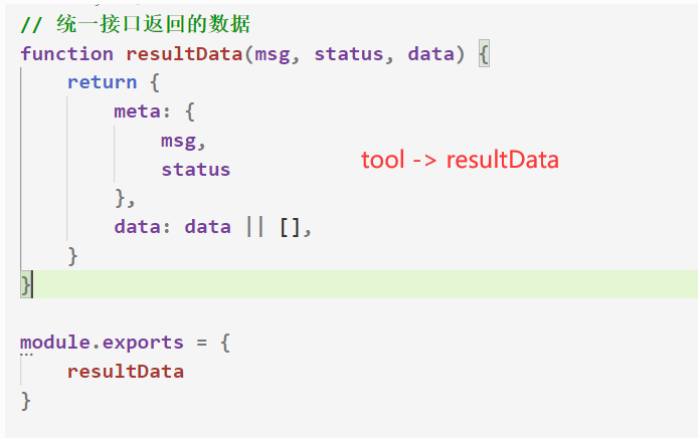
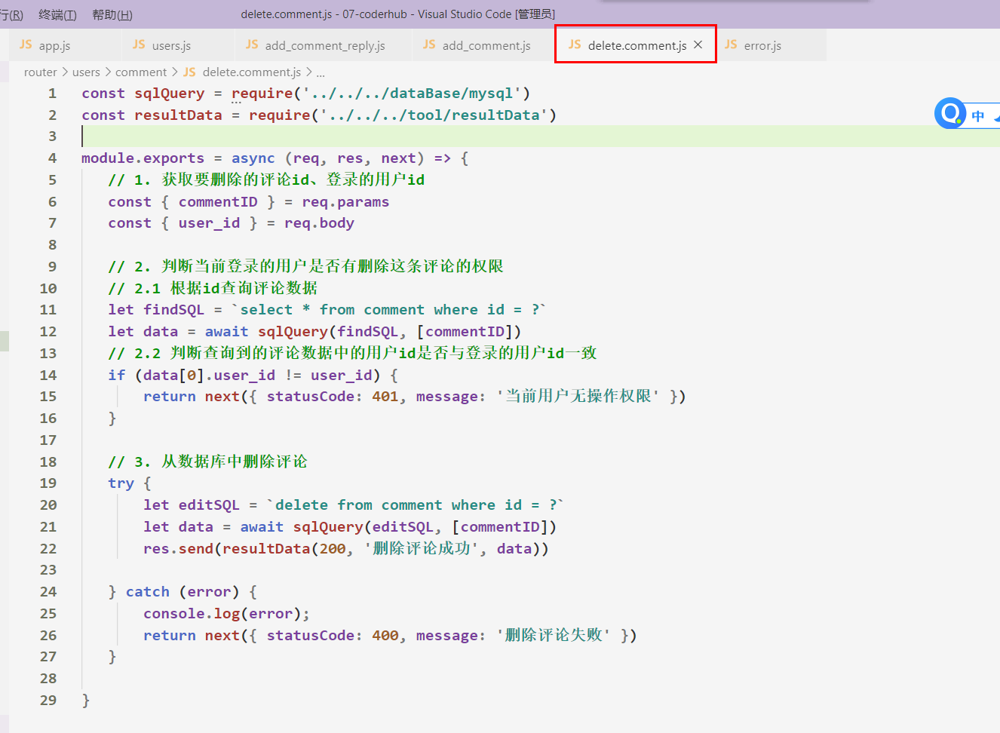

# 一、准备工作

## 1.1 coderhub功能接口说明

- Coderhub旨在创建一个程序员**分享生活动态**的平台。 （类似于QQ空间、掘金社区等平台）
-  完整的**项目接口**包括： 
    -  **面向用户**的业务接口
    -  **面向企业**或者内部的后台管理接口
-  具完成的功能如下
    1. 用户管理系统
    2. 内容管理系统
    3. 内容评论管理
    4. 内容标签管理 
    5. 文件管理系统 


>在开发项目前**需要掌握**如下技术栈

- 前端：`Ajax` 
- 后端：`Node`  `Express`  `mysql`
- 数据库：`MySQL`  `SQL语句`
- 测试接口工具：`postman`


>该项目的**接口**统一使用`postman`工具进行**测试**
>


## 1.2 目录结构划分


>重新目录结构：将源代码放入到src文件夹下


## 1.3 配置信息写入到环境变量

1. 编写**.env**文件，项目的**根目录下创建**
2. 通过**dotenv**加载配置的变量
3. 在项目开源时，**忽略 .env** 文件后在进行上传
4. 这样可以**维护**相关配置的**隐私性**


## 1.4 创建服务器

1. 基于express创建app

2. 解析post请求参数

3. 解决跨域问题

4. 启动服务器

    


## 1.5 二级路由的构建和结构划分

- 将**同一类型的路由**进行统一管理

    


- 将每一个中间件的**回调函数**作为JS模块**抽离出去**，再统一进行导入

    

    


## 1.6 数据库连接和预处理语句封装

- **数据表**创建

    


- 在 ***dataBase -> mysql.js*** 中编写**连接数据库**的代码

    


- **预处理**语句的**封装**及**导出**

    


## 1.7 统一接口返回的数据

>需要**统一接口数据的规范**
>

- 以下两种**数据返回格式都**可以，具体看个人喜好




## 1.8 错误处理中间件

- 在 ***middleware -> error.js***中编写**错误处理中间件**的**回调函数**代码

    


- 错误处理中间件的**调用**

    


# 二、用户管理系统 - 登录、注册

## 2.0 密码加密

- 使用第三方包`bcryptjs`

- 生成`加密密码`

    - ```js
        const bcrypt = require('bcryptjs');
        // 生成随机字符串
        let salt = await bcrypt.genSalt(10);
        // 使用随机字符串对密码进行加密  pass变量为加密后的密码
        let pass = await bcrypt.hash('明文密码'.toString(), salt);
        ```

- **加密后的密码**与**原始密码**进行比对

    - ```js
        let isEqual = await bcrypt.compare('原始密码', '加密密码');
        // isEqual为true则比对正确 否则不比对
        ```

        


## 2.1 用户注册接口

- 用户**注册**流程如下
    1. 接收 **name，password** 参数
    2. 用户名或密码**不能为空** 
    3. 用户名在数据库中**没有被注册**过
    4. 对密码进行**加密**处理
    5. 将用户信息**添加**到数据库中

- **密码加密**

    


- 方案一：将所有业务逻辑放在**一个中间件**的**一个回调函数**中**处理**，比较适合新手，**逻辑容易理清**

    

    


- 方案二：将所有业务逻辑放在**一个中间件**的**多个回调函数**中**处理**

    


## 2.2 token封装


## 2.3 登录接口

- 用户**登录**流程如下
    1. 接收 **name，password** 参数
    2. 用户名或密码**不能为空** 
    3. 用户名在数据库中**是否存在**
    4. 校验密码**是否一致**
    5. 登录成功返回**凭证**：
        - cookie+session
        -  Token令牌


## 2.4 登录后颁发token

>在用户登录后需要颁发**token**，保存用户的**登录状态**
>


## 2.5 验证token的全局中间件

>需要**验证token**，客户端在后续的请求中需要在请求头的`Authorization`字段中**携带token**
>


# 三、用户管理系统 - 动态管理

## 3.1 用户动态表设计

>用户需要发布动态，因此需要准备一张`moment`表，需要使用**外键关联**对users表进行关联
>
>
>
>


## 3.2 动态接口的目录划分


## 3.3 添加动态


## 3.4 分页查询动态

>坑1：**分页查询**传入的**参数**必须是**Number类型**

>坑2：从Node —> mysql包中获取**JSON类型**会是**String类型**，需要**手动的进行迭代**，mysql2则不会

>注：在分页查询时，**不需要校验token**，因为不管用户有没有登录，动态都需要展示在首页


- 需求：需要查询到moment表中的数据以及**外键字段对应的具体数据**

- 最好先在`Navicat`中调试SQL语句，调试好后在放入到代码中

    - ```mysql
    select 
        		moment.id, moment.content, moment.createTime,moment.updateTime,
        		json_object("id", users.id, "name", users.name) as user_info
        from moment 
        left join users on moment.user_id = users.id
        limit 3, 3;
      ```
      
        
    
    


## 3.5 修改动态

- **修改动态**的逻辑如下

    1. 获取当前登录的用户id、修改内容、动态id

    2. 判断用户是否有修改这条动态的权限（只能本人修改动态）
    3. 从数据库中修改动态


## 3.6 删除动态

- **删除动态**的逻辑如下

    1. 获取当前登录的用户id、要删除的动态id

    2. 判断用户是否有删除这条动态的权限（只能本人删除动态）
    3. 从数据库中删除动态


## 3.7 展示动态的评论个数

>完成评论表设计后(第四大步)，再实现该功能

- 每条用户动态底下都应该**展示该条动态的评论个数**，比如知乎

    - 因此我们在**分页查询用户动态**时，**返回的数据**需要包括该条动态的**评论个数**

    


- 在分页查询用户动态时，**添加子查询**，查询动态的评论个数

    - ```mysql
        select 
        		moment.id, moment.content, moment.createTime,moment.updateTime,
        		json_object("id", users.id, "name", users.name) as user_info,
        		(select count(*) from comment where `comment`.moment_id = moment.id) as commentCount
        from 
        moment left join users on moment.user_id = users.id
        limit 0, 10;
        ```

        


- 完善：展示动态的标签个数

    


# 四、用户管理系统 - 评论管理

## 4.1 用户评论表设计

>理解：每一条动态下都会有一些用户的评论，因此需要新建一个`comment`表**存放评论数据**


- 创建`comment`表

- >注：当user_id、moment_id、comment_id外键**发生改变/删除时**，其**对应的记录**也要跟着**改变/删除**

    - 举例：当用户动态或者用户被删除时，其对应的评论也要跟着被删除

    


## 4.2 评论接口的目录划分


## 4.3 添加评论


## 4.4 添加回复评论


## 4.5 修改评论

- **修改评论**的逻辑如下

    1. 获取要**修改**的评论id、评论内容、登录的用户id

    2. 判断当前登录的用户是否有**修改**这条评论的**权限**
    3. 从数据库中**修改评论**


## 4.6 删除评论

>补充：当用户动态或者用户被删除时，其**对应的评论也要跟着被删除**
>

- **删除评论**的逻辑如下

    1. 获取要**删除**的评论id、登录的用户id

    2. 判断当前登录的用户是否有**删除**这条评论的**权限**
    3. 从数据库中删除评论




## 4.7 动态评论的查询接口

>在进入**动态详情页**时，需要查询到该**动态**下的**所有评论**
>

- SQL语句实现

    - ```mysql
        select 
        	comment.id, comment.moment_id, comment.content, comment.createTime, 		       comment.updateTime,
        	json_object('id', users.id, 'name', users.name) as user_info
        from comment 
        left join users on comment.user_id = users.id
        where comment.moment_id = 1
        ```

        


- 代码端实现

    


>注：在查询动态的评论时也**不需要验证token**


# 五、用户管理系统 - 标签管理


## 5.1 标签表的设计


## 5.2 标签接口的目录划分

>因为标签接口与用户并没有直接的关系，因此我们**重新创建**一个**属于标签接口的二级路由**
>
>


## 5.3 添加标签接口


## 5.4 创建标签与动态的中间表

- SQL语句创建中间表

    - ```mysql
        # 创建中间表（标签表和动态表的联系表）
        create table if not exists `moment_label`(
        	id int primary key auto_increment,
        	moment_id int not null,
        	label_id int not null,
        	createTime timestamp default current_timestamp,
        	updateTime timestamp default current_timestamp on update current_timestamp,
        	
        	foreign key (moment_id) references moment(id) on delete cascade 
          																							on update cascade,
        	foreign key (label_id) references label(id) on delete cascade 
          																						on update cascade
        )
        ```

        


>标签与动态**中间表**的**理解**

- **一个动态**可以有**多条标签**，**一条标签**可以属于**多个动态**


## 5.5 给动态添加标签（难点）

>给动态添加标签的**实现逻辑**如下

1. 校验当前的登录用户权限操作（用户**只能给自己发布的动态添加标签**，逻辑与动态修改/删除类似）

    

    

    

    

    

2. 校验用户添加的标签是否已存在label数据表中（难点）

    1. **遍历**用户添加的标签数组

    2. 在遍历标签数组前，**定义一个数组**，用于**存放要添加的标签数据**，方便后期**插入中间表**

    3. **查询**数组中的每个元素(标签名字)是否在数据库中已经存在

        - 不存在：将当前遍历到的**标签名添加到数据表label**中，并且保存插入后的id到数组中

        - 存在：将用户添加的标签查询到的id保存起来

    4. 每一次遍历都需要往数组中追加`{用户添加的标签名, 数据表label主键}`对象

        

        


3. **添加**中间表的**关系数据**（标签id和动态id的组合必须是唯一的）

    

    1. 获取**动态id**和上一个中间件处理函数处理好的**标签数组**

    2. 遍历标签数组，判断标签id与动态id是否已经在中间表中存在（**标签id和动态id的组合必须是唯一的**）

        - 存在：不插入数据

        - 不存在：将**标签id**与**动态id**插入到**中间表**中


## 5.6 展示标签列表接口

>展示标签列表也需要**分页展示**，用户在没有登录的情况下也可以访问标签，因此**无需验证token**
>
>


## 5.7 动态详情页展示标签信息接口

>在进入**动态详情页**时，需要查询到该**动态**下的**所有标签信息**
>

- SQL语句实现

    - ```mysql
        # 进入动态详情页时，展示标签列表的具体信息
        select 
        		label.id, label.name
        from  label
        left join moment_label on moment_label.label_id = label.id
        where moment_label.moment_id = 9
        ```

        


- 代码端实现

    .assets/image-20210814100855907.png)


# 六、用户管理系统 - 文件管理


## 6.1 文件上传的逻辑

>以用户**上传头像图片**举例说明，该**接口**的**实现逻辑**如下
>

1. 图片（文件）上传：/upload/avatar 

    - 目的：服务器端可以**保存用户上传的图片** 

        

2. 返回图片信息，可以让**客户端获取图片** 

    - 访问：/1/avatar --> 找到图片 --> 读取图片 --> 设置响应类型：content-type: image/jpeg 

    - 返回图像的信息 

        

3. 将图片的URL**存储**到`users表 --> avatarURL字段`中

    - avatarURL: 头像的地址 

        

4. 查询到用户信息时，需要加上`avatarURL`字段返回给客户端


>文件上传的接口 目录模块划分如下


## 6.2 上传头像的图片处理

- 使用第三方库`multer`来解析并保存用户上传的文件

    


## 6.3 保存头像信息到数据库

- 思路：
    1. 配置静态资源访问，让浏览器**输入网址**能够直接访问**uploads下的文件**
    2. 获取当前登录的用户id、保存后的图片名字
    3. 将**图片名字**与**服务器主机**进行拼接，生成一个URL地址(**静态资源访问地址**)
    4. 将**图片URL地址**保存到 **users**表 --> **avatar_url** 字段中
    5. 将**静态资源访问地址**返回给浏览器


.assets/image-20210815095204218.png)


.assets/image-20210815095418897.png)


## 6.4 上传动态的多张图片处理

- 使用第三方库`multer`来解析并保存动态**上传的多张图片**


## 6.5 保存多张动态图片到数据库

- 思路：
    1. 获取当前登录的用户id和要上传图片的动态id
    2. 获取保存后的多张图片信息
    3. **重构**图片信息数组 --> 数组元素中只**需要图片URL名字**
    4. **遍历**图片名字数组 --> 将图片名字与服务器主机进行拼接，**生成一个图片URL数组**(静态资源访问地址)
    5. 将图片URL**数组转换成字符串**，然后**保存到moment表**中
    6. 将生成好的URL数组返回给浏览器


>由于MySQL**不能**存储**数组类型**的**数据**，所以在存储数据时，需要**转换为字符串形式**
>


## 6.6 对图像大小进行处理

>**图像大小处理**需要使用到第三方库：`jimp`


- PS:这里只是对**图像大小**处理做个**简单的代码逻辑处理**，并不实现该完整的接口

    


.assets/image-20210815093520517.png)


# 七、项目部署


>准备知识：购买云服务器、配置云服务器、安装Node环境、部署页面项目

参考文档：前端知识点总结 -> 项目部署


## 7.1 连接远程MySQL服务


>连接**远程MySQL服务**
>
>

1. 在远程服务器上的navicat -> 的查询中**修改连接权限**

    - ```mysql
        # 使⽤mysql数据库
        use mysql;
        
        # 查看user表中，连接权限，默认看到root是localhost
        select host, user from user;
        
        # 修改权限
        update user set host = '%' where user = 'root';
        
        # 刷新MySQL的系统权限相关表
        flush privileges;
        ```

2. 在远程服务器配置 -> 防火墙中**开放3306端口**


3. 在本地服务器上**使用 navicat** 连接**远程服务器的MySQL**服务

    


4. **查看**远程服务器的MySQL中的数据库

    


## 7.2 MySQL数据迁移

>我们需要将之前项⽬中（本地）MySQL的数据库迁移到服务器中的MySQL数据库中。
>

1. 在服务器MySQL中**创建coderhub的数据库**

2. 在Navicat⼯具中**本地MySQL**直接**导出数据库**

    

    

3. 在Navicat⼯具中**服务器MySQL**中执⾏**SQL文件**


## 7.3 项目部署的三种方式

- 方式一：直接拷贝项目到服务器中，然后通过**node app.js**启动项目

    

- 方式二：（公司用的最多）

    1. 将项目代码上传到git仓库(github、gitee)

    2. 服务器通过 **git clone**克隆项目代码

    3. 然后在通过 **node app.js**启动项目

        

- 方式三：（部署前端项目(html页面)时的场景） -> **自动化部署**

    1. 将项目代码上传到git仓库(github、gitee)

    2. 服务器每次**自动下载**git仓库**最新的代码，并自动启动项目**

        


## 7.4 项目部署的具体实现

>由于方式一(拷贝项目)比较简单，方式三(自动化部署)需要配置**Jenkins**，因此这里**只对方式二进行演练**
>

1. 配置上传的忽略文件 -> 将**项目代码上传到git仓库**(github、gitee)


2. 将云服务器创建一个文件夹，然后通过`git clone url`命令**克隆git仓库中的代码**到该文件夹下
    - 前提是**云服务器**需要**安装好git环境**

.assets/image-20210815172540619.png)


3. 在云服务器的控制台 -> 防火墙中，添加规则加入该项目的服务端口(8883)

.assets/image-20210815172807776.png)


4. 在云服务器中修改项目配置，然后启动项目

    


5. 使用postman**请求远程接口**查看是否生效

    .assets/image-20210815174516957.png)


