# 一、爬取网页数据

## 1.1 分析页面

>一：**分析页面结构**，确定要爬取的数据
>

.assets/image-20210822213805246.png)

- 分析后我们就确定了想要爬取的数据：1. 分类列表   2. 分类下的小说列表  3. 小说列表的页码  4. 小说的详情页信息 

    
  
  

## 1.2 设计数据结构

>二、爬取数据后，需要对数据进行**有规律的存储**，最好存储到***json文件***下
>

- 因此需要在**爬取数据前**，最好**先设计好存储数据的数据结构**

1. 用一个**数组存储分类信息**：每个分类信息*包裹在一个对象*上

    - ```json
        [
          {
            "category_href": "https://sobooks.cc/xiaoshuowenxue",
            "category_name": "小说文学",
            "data": []
          },
          {
            "category_href": "https://sobooks.cc/lishizhuanji",
            "category_name": "历史传记",
            "data": []
          }
          .....
        ]
        ```

2. 在*每个分类对象*上，**定义data数组**，用于***存储当前分类下的小说基本信息***，**小说基本信息存储到对象上**

    - ```json
        [
          {
            "category_href": "https://sobooks.cc/xiaoshuowenxue",
            "category_name": "小说文学",
            "data": [
              {
                "bookName": "外研社博雅文库大全集（套装共24本）",
                "bookAuthor": "费孝通等",
                "bookURL": "https://sobooks.cc/books/18708.html",
                "bookImg": "https://sobooks.cc/wp-content/timthumb.php",
                "bookDetialInfo": {}
              },
              {},
              {}
            ]
          }
        ]
        ```

3. ***data数组中的每个对象都是小说的基本信息***

    - 在小说基本信息对象中，添加 ***bookDetialInfo*** 字段，**存储当前小说的详情信息**

    - ```json
        [
          {
            "category_href": "https://sobooks.cc/xiaoshuowenxue",
            "category_name": "小说文学",
            "data": [
              {
                "bookName": "外研社博雅文库大全集（套装共24本）",
                "bookAuthor": "费孝通等",
                "bookURL": "https://sobooks.cc/books/18708.html",
                "bookImg": "https://sobooks.cc/wp-content/timthumb.php",
                "bookDetialInfo": {
                   "bookName": "外研社博雅文库大全集（套装共24本）",
                   "categoryName": " 小说文学",
                   "author": "费孝通等",
                   "tag": "文学",
                   "time": "2021-08-20",
                   "bookIntroduce": "《中国士绅:城乡关系论集》",
                   "imgUrl": "https://i.loli.net/wZ4tdWS2s.jpg"
                }
              },
              {},
              {}
            ]
          }
        ]
        ```

        

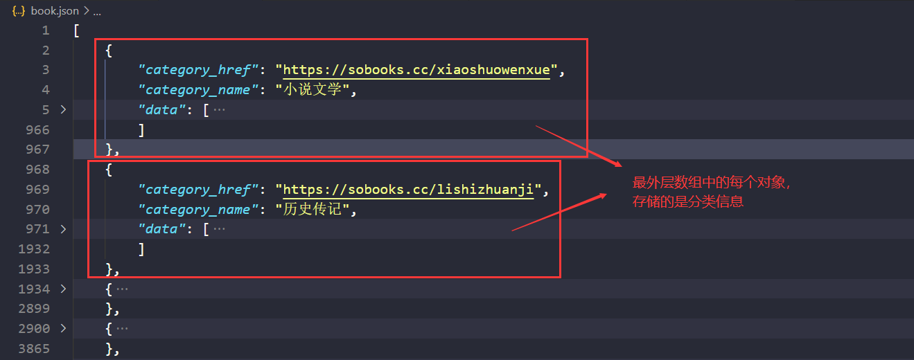

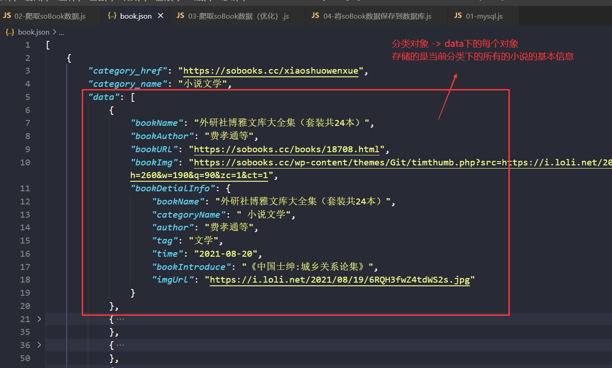


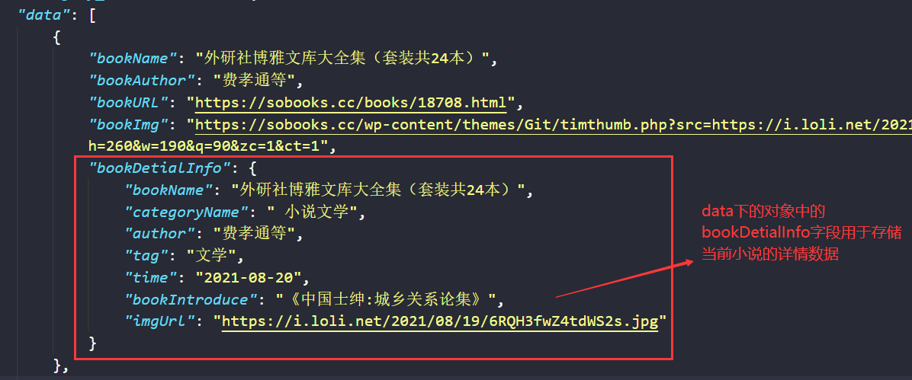


## 1.3 puppeteer - 爬取数据

>在**立即函数**的函数体中编写爬取数据的相关代码

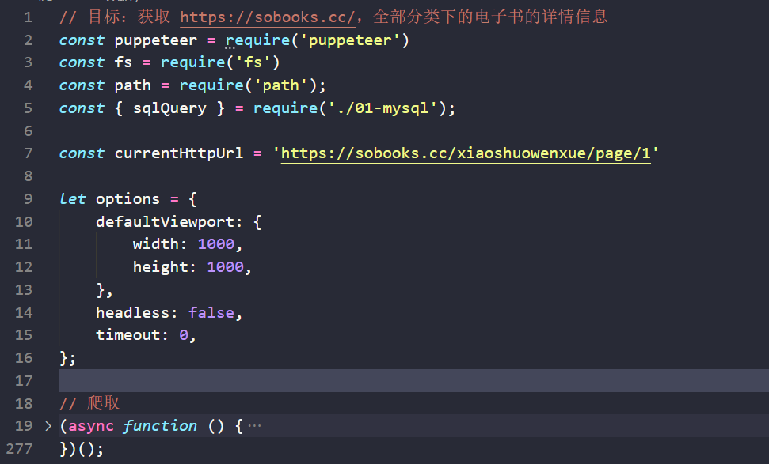


1. 获取**页面数量**和小说**分类信息**

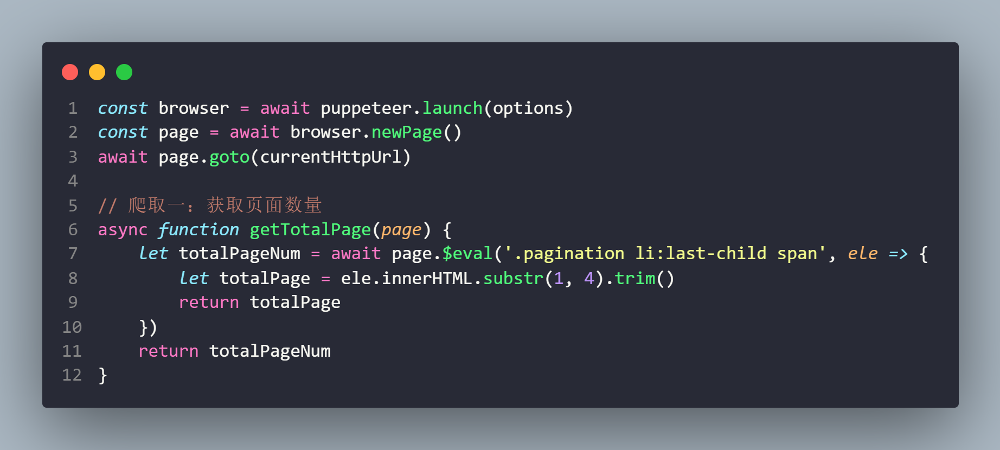


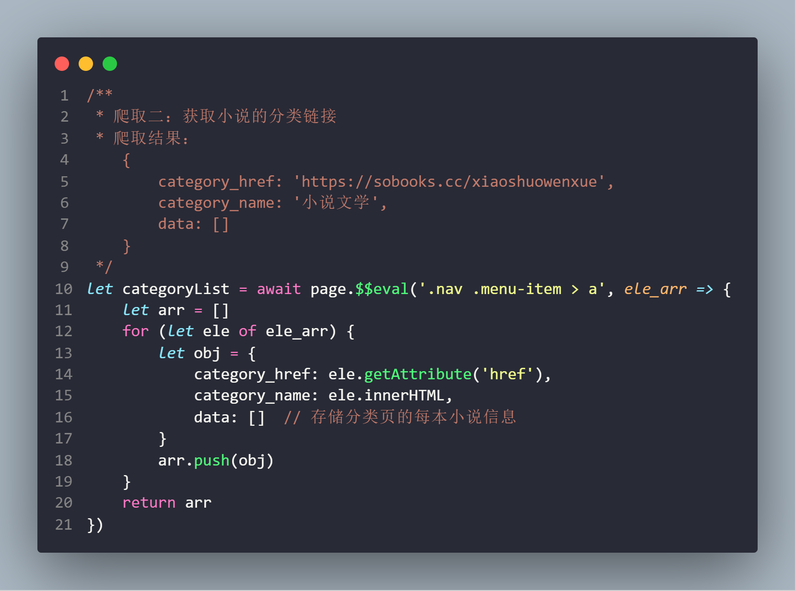


3. 获取**每个分类**下小说的**基本信息**

    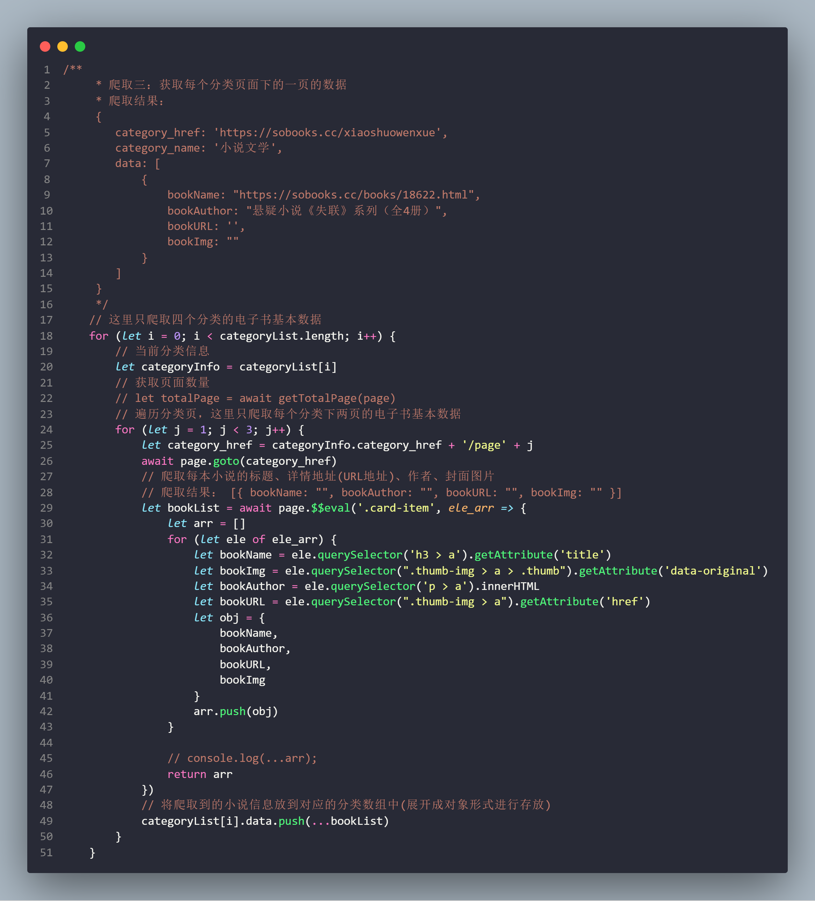


3. 获取每本小说的**详情信息**

    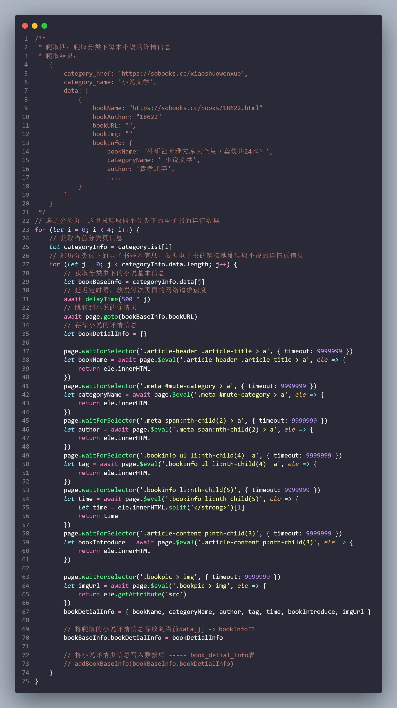


4. 将爬取完成的数组**写入到json文件**中

    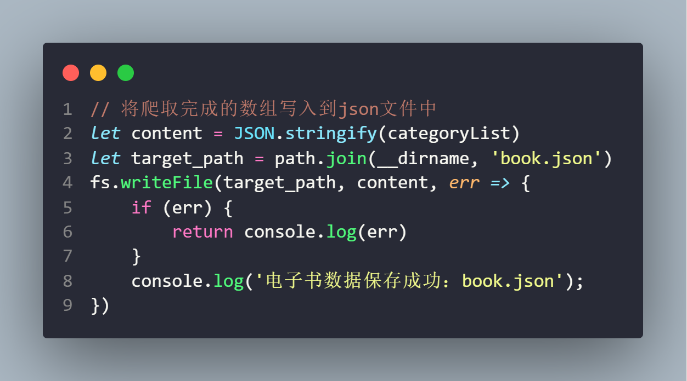


## 1.4 将数据保存到数据库

- 在爬取数据后，将**数据保存到数据库**的方式有两种

    - 方式一：在爬取数据的过程中，依次将获取到的数据写入到数据库中
    - 方式二：在爬取数据结束后，分析爬取的数据结构，依次将数据写入到数据库中

    - 个人是比较偏向第二种，因为第一种需要在爬取数据过程中加入数据库的操作代码，会造成**代码冗余**

    - 第二种可以新建一个js文件，单独对爬取结果进行分析，然后再保存到数据库中，也**更符合模块化定义**

        

1. 新建`so_book`数据库用于爬取到的小说数据
    - **并创建三张表**，分别用于存放*分类列表*、*小说基本信息*、*小说详情信息*

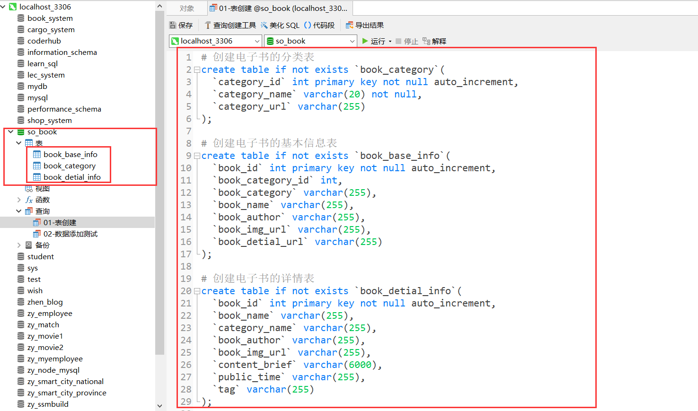


2. **基于mysql2**做一层**Promise的封装**

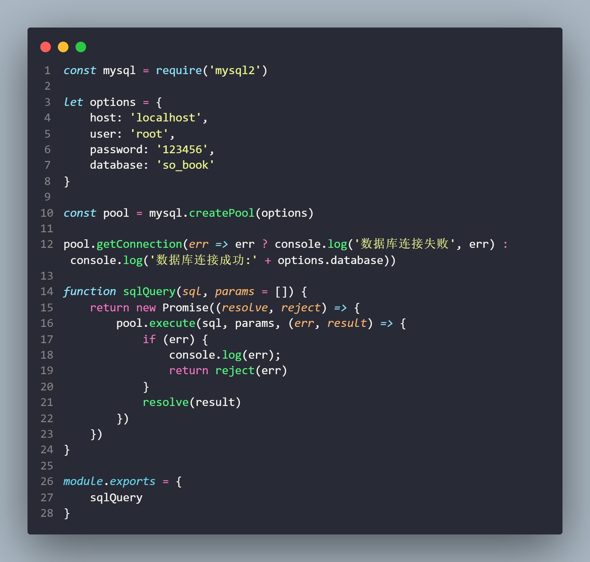


3. 将爬取数据所存储的**json文件进行导入**

    1. 将**小说分类链接**写入到数据库中 ----- book_category表

        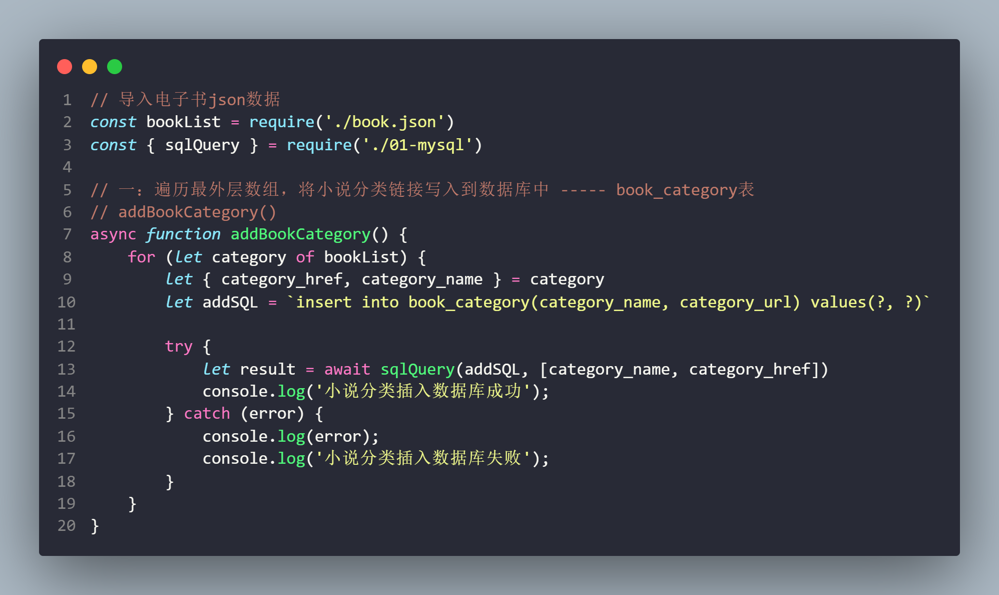

    2. 将小说**基本信息**存储到数据库中---- book_base_info表

        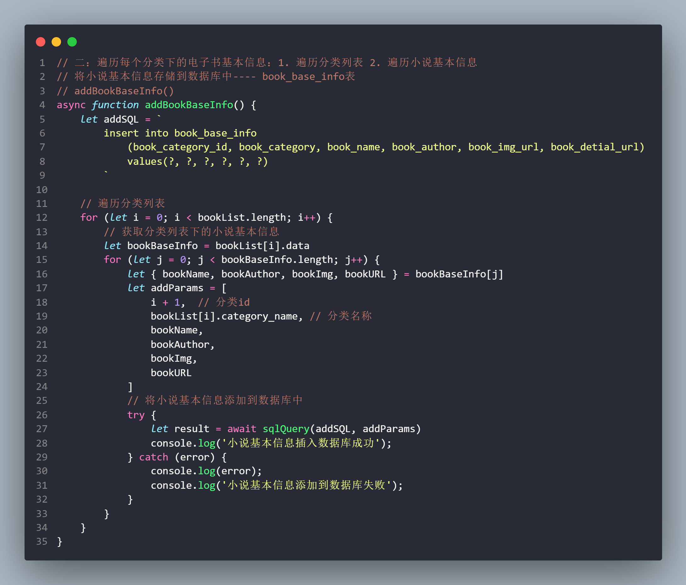

        

    3. 将小说**详情页信息**写入数据库----- book_detial_info表

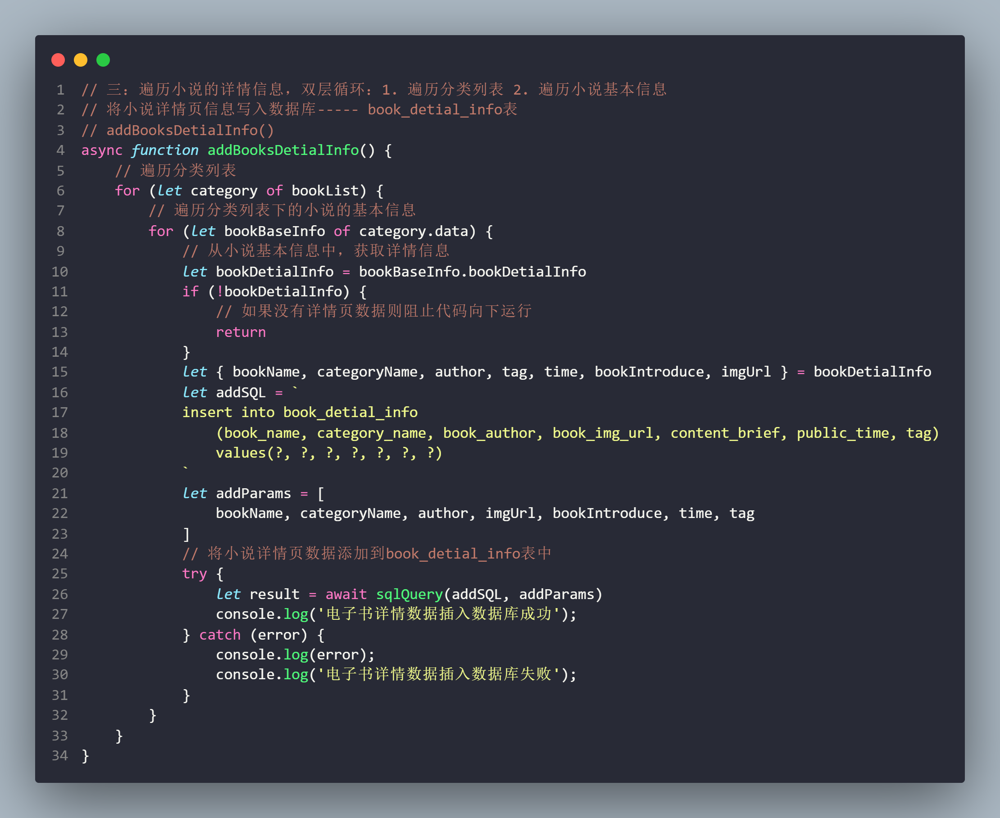

​			


4. 封装一个函数，用于按顺序**依次添加数据库数据**

    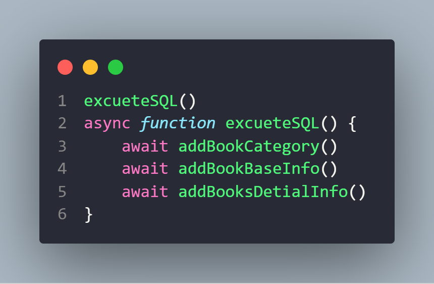


