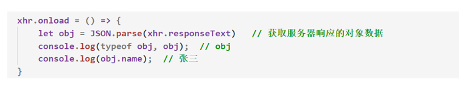

# 一、邂逅Ajax

## 1.1 Ajax简介

- Ajax：标准读音 [ˈeɪˌdʒæks] ，中文音译：阿贾克斯

- Ajax是***浏览器提供的一套方法***，可以实现页面`无刷新更新数据`，提高用户浏览网站应用的体验。

- 简单理解：Ajax就是`浏览器`提供的一套 `发送网络请求的API`

- 使用`Ajax`发送网络请求，属于***异步操作***

  

## 1.2 Ajax的应用场景

1. 页面上拉加载更多数据
  
   - 拉到底部时，发送`Ajax请求`，在原有的数据上添加数据
2. 表单项离开焦点数据验证

   - 表单失去焦点时，发送`Ajax请求`，判断用户输入的是否合法，在不刷新页面的情况下，反馈给客户

   

## 1.3 Ajax的运行环境

- 使用`AJAX技术`的网页***必须通过服务器的静态资源访问方式来打开***，而不能直接双击HTML文件打开

- 这是因为由于`同源政策`的限制，***Ajax只能够向本地服务器发送网络请求***

  

  

  

## 1.4 Ajax的工作原理

- Ajax的工作原理相当于在***用户和服务器之间加了一个中间层***(Ajax引擎)，以实现在不影响用户浏览页面的情况下，局部更新页面数据，从而提高用户体验。


## 1.5 Ajax的优缺点

- Ajax的优点

  1. 可以***无需刷新页面***而与服务器端进行通信。

  2. 允许根据用户事件来向服务器发送网络请求

- AJAX的缺点

  1. 没有浏览历史，不能回退

  2. ***存在跨域问题***

  3. SEO不友好


# 二、Ajax基础编程

## 2.1 Ajax的基本使用

1. 创建Ajax对象

   - ```js
     let xhr = new XMLHttpRequest(); 
     ```

   - ***请求报文以及响应报文，都在xhr这个对象上面***

2. 告诉设置请求地址以及请求方式，如果发送`POST请求`则必须要***设置请求头信***息

   - ```js
     xhr.open('get', 'http://www.example.com');
     ```

3. 发送请求

   - ```js
     xhr.send(); 
     ```

4. 获取服务器端给与浏览器响应数据

   - ```js
     xhr.onload = function () {  // 当xhr对象接收完服务器响应的数据后触发该回调函数
       console.log(xhr.responseText);  // 响应的数据都在responseText属性下
       xhr.status  // 获取服务器返回给浏览器的状态码
     }
     ```
   
   - **可以服务器响应的不同状态码，做出不同的操作**
   
   
- 注意：一般服务器返回给浏览器的都是`JSON对象数据`，但是浏览器会将该数据***解析为字符串类型***，因此需要使用`JSON.parse()`来***解析服务器返回的数据***

  

  

## 2.2 Ajax请求参数传递

- `GET请求`方式传递参数

  - ```js
    xhr.open('get', 'http://www.example.com?name=zhangsan&age=20');
    ```

​    

- `POST请求`方式传递参数

  - ```js
    xhr.open('get', 'http://localhost:3000/post');
    
    // 使用post请求必须设置其请求头信息，告诉服务器当前请求参数的格式是什么
    xhr.setRequestHeader('Content-Type', 'application/x-www-form-urlencoded') 
    
    xhr.send('name=zhangsan&age=20');
    ```
    
    

- 总结：

    - `GET请求携带的参数`需要写在请求地址的后面
    - `POST请求携带的参数`需要先设置请求头，参数写在`send`方法里面


## 2.3 请求参数的格式 

- 在发送网络请求时，传递的请求参数往往有两种格式，分别为`urlencoded`和`json`格式

   

- ```
   name=zhangsan&age=20&sex=男
  ```

  - 上述的请求参数属于`application/x-www-form-urlencoded`格式

       
  
- ```
   {name: 'zhangsan', age: '20', sex: '男'}
  ```

  - 上述的请求参数属于`application/json`格式

     
  
- 注意：**get 请求是不能提交 json 对象数据格式的**，get 请求只能提交`urlencoded`格式的请求参数，只有`POST`请求才能提交`json`格式的请求参数，并且还要**配置如下设置**

   - ```js
      let param = {name: 'zhangsan', age: '20', sex: '男'}
      xhr.open('post', `http://localhost:3000/post`)
      
      // 发送post请求必须设置其响应头，并且告诉服务器当前请求参数的格式是什么
      xhr.setRequestHeader('Content-Type', 'application/json') 
      // 对象需要转换为字符串类型传递给服务器
      xhr.send(JSON.stringify(param)); 
      
      ********app.js*********
       // 配置body-parser模块，并且解析json格式的请求参数
      app.use(bodyParser.json({ extended: false }));
      // 配置body-parser模块，解析urlencoded格式数据
      app.use(bodyParser.urlencoded({ extended: false }));  
      ```
   
   1. 使用`JSON`格式的请求参数传递给服务器时，由于***服务器只能接受字符串类型数据***，因此需要将`JSON对象`格式转换为`字符串类型`
   
   2. 获取`post请求参数`的配置模块也需要设置为解析`JSON`格式的请求参数
   
    
   
    
   
    

## 2.4 Ajax的封装

- 问题：发送一次请求代码过多，发送多次请求代码冗余且重复

- 解决方案：将请求代码***封装到函数***中，发请求时调用函数即可

  - ```js
    ajax({
        type: 'post',  // 请求方法
        url: 'http://localhost:3000/abc',  // 请求地址
        param: {name: '张三', age: 18},  // 传递的参数
    
        success(data) {  // 服务器响应成功所调用的函数
          	console.log(data);
        }
    })
    ```

​    

1. 请求参数位置的问题
   - get 请求，请求参数放置在`请求地址`的后面
   
   - post请求，请求参数放置在`send()`方法中

​     

2. 请求参数格式的问题
   - `urlencoded`格式：***key=value&key=value***
   
   - `对象`格式：***{key:  value, key:  value}***
   
   - 在调用封装好的`ajax`函数时，传递对象格式作为请求参数，更加友好
   
   - 在函数内部需要将`对象数据`格式，转换为`urlencoded`数据格式

  

3. 判断服务器返回的数据是否是***JSON数据***，如果是，则解析为***对象数据类型***


# 三、模板引擎


## 3.1 模板引擎概述


- 在传统的网站中，浏览器向服务器发送请求，服务器都是将***数据***与***模板文件文件***拼接好，再将拼接好的HTML字符串发送给浏览器

    

    

    

- 在之前练习的项目中，我们都是在***服务器端完成数据拼接***，现在有了**ajax**作为中间件，因此我们需要在***浏览器端完成数据拼接***然后响应给浏览器


## 3.2 模板引擎的基本使用

1. 在HTML 页面中引入`art-template`JS库文件

    - ```js
        <script src="./js/template-web.js"></script>
        ```

2. 在HTML 页面中 编写 ***art-template 模板文件***，需要在script标签中***设置id用来标识模板文件***，**所有的数据需要放置在模板文件中**

    - ```Js
        <script id="test" type="text/html">
            <h1>{{ name }}</h1>
        	 <h1>{{ age }}</h1>
        </script>
        ```

        

3. 告诉模板引擎将哪个***模板文件***和哪个***数据***进行拼接，***根据id来选择对应的模板文件***，`template()`的返回值就是拼接好的***HTML字符串***

    - ```js
        <script>
            let html = template('test', {name: '张三', age: 18})
            console.log(html)
        	 // 将拼接好的HTML字符串展示到HTML页面中
        	 document.getElementById('container').innerHTML = html;
        </script>
        ```

        


## 3.3 验证邮箱地址案例

1. 获取文本框并为其添加离开焦点事件
    - `onblur事件`

2. 离开焦点时，检测用户输入的邮箱地址是否符合规则
    - 邮箱正则： `^[A-Za-z\d]+([-_.][A-Za-z\d]+)*@([A-Za-z\d]+[-.])+[A-Za-z\d]{2,4}$`

3. 如果不符合规则，阻止程序向下执行并给出提示信息
    - 先修改信息的`p元素`的内容在修改类名，然后`return`

4. 向服务器端发送请求，检测邮箱地址是否被别人注册

5. 根据服务器端返回值决定客户端显示何种提示信息 

```js
ajax({
    type: 'get',
    param: {email: emailInput.value},
    url: 'http://localhost:3000/verifyEmailAdress',
    success(data) {
        info.innerHTML = data.message
        info.className = 'bg-success'
    },
    error(data) {
        info.innerHTML = data.message
        info.className = 'bg-danger'
    }
})
```


## 3.4 搜索框内容展示案例

1. 获取搜索框并为其添加用户输入事件

  ​	`oninput事件：当文本框输入时触发的事件`

2. 获取用户输入的关键字

3. 向服务器端发送请求并***携带关键字作为请求参数***

    - ```js
        ajax({
            type: 'get',
            url: 'http://localhost:3000/searchAutoPrompt',
            param: {this.value},
        })
        ```

        

4. 将响应数据显示在搜索框底部 ，需要使用**模板引擎遍历服务器传递过来的数据**

    - 

    - 


## 3.5 省市区三级联动

1. 通过接口获取省份信息

    - ```js
               ajax({  // 初始化省份数据的请求
                   type: 'get',
                   url: 'http://localhost:3000/province',
                   success(data) {
                       // 响应的数据是数组，里面包含了省份相关信息
                       let html = template('provinceTpl', {data})
                       province.innerHTML = html
                   }
               })
        ```

2. 使用JavaScript获取到省市区下拉框元素

    - ```js
               let province = document.querySelector('#province')
               let city = document.querySelector('#city')
               let area = document.querySelector('#area')
        ```

3. 将服务器端返回的省份信息显示在下拉框中

4. 为下拉框元素添加表单值改变事件（onchange）

5. 当用户选择省份时，根据省份id获取城市信息

    - ```js
               province.onchange = function() {
                   // 清空县城下拉框和城市下拉框的所有数据
                   city.innerHTML = template('cityTpl', {})
                   area.innerHTML = template('areaTpl', {})
            
                   // 获取当前选中省份的id信息
                   let id = this.value
                   ajax({
                       type: 'get',
                       url: 'http://localhost:3000/cities',
                       param: {id},
                       success(data) {
                           // 获取到选中省份的城市数据
                           let html = template('cityTpl', {data})
                           city.innerHTML = html
                       }
                   })
               }
        ```

6. 当用户选择城市时，根据城市id获取县城信息

    - ```js
               city.onchange = function() {
                   let id = this.value
                   ajax({
                       type: 'get',
                       url: 'http://localhost:3000/areas',
                       param: {id},
                       success(data) {                   
                           let html = template('areaTpl', {data})
                           area.innerHTML = html
                       }
                   })
               }
        ```

        

- 模板文件数据代码：
    - 


# 四、Ajax上传文件

## 4.1 FormData的概述


- `FormData`是浏览器提供的API

- 作用：

    - 可以将***HTML表单映射成表单对象***，自动将表单对象中的数据拼接成请求参数的格式

    - 通过`FormData`可以解析表单上传的二进制文件(视频、图片)然后在通过`ajax`向服务器发送请求，

        

## 4.2 FormData的基本使用

1. 准备HTML表单

    - ```html
        <form id="from">
            账号：<input type="text" name="userName">
            密码：<input type="password" name="password">
            <input type="submit">
        </form>
        ```

2. 编写JS代码：将 HTML 表单转化为 ***formData 对象***

    - ```js
        let form = document.getElementById('form'); 
        let formData = new FormData(form);
        ```

        

3. 通过`Ajax技术`提交表单对象

    - 注意：这是使用`FormData`独有的提交方式，不需要设置响应头

    - ```js
        let xhr = new XMLHttpRequest()
        xhr.open('post', 'http://localhost:3000/formData')
        xhr.send(formData)
        xhr.onload = () => {
        	console.log(JSON.parse(xhr.responseText));
        }
        ```
        
        

4. 服务端代码 ---- `formidable模块`

    - ```js
        const formidable = require('formidable');
        // 1. 创建表单解析对象
        const form = new formidable.IncomingForm(); 
        // 2. 配置上传文件的存放位置(绝对路径)
        form.uploadDir = path.join(__dirname, "../../public/uploads")
        // 3. 是否保留表单上传文件的扩展名
        form.keepExtensions = true;  
        
        // 4. 对表单进行解析
        form.parse(req, (err, fields, files) => { 
      // 1. err: 错误对象，如果表单解析失败 err里面则会存储错误信息，如果表单解析成功，err将会是null
          // 2. fields: 保存的是普通表单数据(不包括上传的文件) 以对象形式进行存储
          // 3. files: 保存的是上传文件相关的数据 以对象形式进行存储
        });
      ```
    
    
    
    
    
    

**注意：**

1. Formdata 对象不能用于 get 请求，因为对象需要被传递到 send 方法中，而 get 请求方式的请求参数只能放在请求地址的后面。

2. 服务器端 bodyParser 模块不能解析 formData 对象表单数据，我们***需要使用 formidable 模块进行解析***


## 4.3 FormData实例对象的方法

- ```js
    formData.get('key');
    ```

    - 获取指定表单中`name属性`的值

        

- ```js
    formData.set('key', 'value');
    ```

    - 通过表单的`name属性`设置他的`value`


- ```js
    formData.delete('key');
    ```

    - 删除指定的`name属性`的表单的值

        

- ```js
    formData.append('key', 'value');
    ```

    - 向表单对象中***追加属性名和属性值***


## 4.4 FormData二进制文件上传


- 浏览器端代码

    - ```js
                // 当用户选择文件的时候
                file.onchange = function() {
                    // 创建空表单对象
                    let formData = new FormData();
            
                    // 将用户选择的二进制文件追加到表单对象中
                    formData.append('attrName', this.files[0]);
            
                    // 配置ajax对象，请求方式必须为post
                    xhr.open('post', 'http://localhost:3000/upload');
                    xhr.send(formData);
                    xhr.onload = () => {
                        console.log(xhr.responseText)
                    }
                }
        ```

        

- 服务器端代码

    - ```js
        app.post('/upload', (req, res) => {
        	// 创建formidable表单解析对象
        	const form = new formidable.IncomingForm();
        	// 设置客户端上传文件的存储路径
        	form.uploadDir = path.join(__dirname, 'public', 'uploads');
        	// 保留上传文件的后缀名字
        	form.keepExtensions = true;
        	// 解析客户端传递过来的FormData对象
        	form.parse(req, (err, fields, files) => {
        		res.send(files)
        	});
        });
        ```

        

## 4.5 文件上传进度条展示

- HTML代码：

    - ```html
        <!-- 上传二进制文件 -->
        <input type="file" class="file">
        <div class="progress">
          <div class="progress-bar" style="width: 0%;" id="bar">0%</div>
        </div>
        ```

        

- JS代码：

    - ```js
        let bar = document.querySelector('.progress-bar') 
        // 当用户选择文件的时候
         file.onchange = function () {
             // 文件上传过程中持续触发onprogress事件
             xhr.upload.onprogress = function (ev) {
                 // 当前上传文件大小/文件总大小 再将结果转换为百分数
                 // 将结果赋值给进度条的宽度属性 
                 bar.style.width = (ev.loaded / ev.total) * 100 + '%';
                 bar.innerHTML = (ev.loaded / ev.total) * 100 + '%'
             }
         }
        ```

        

## 4.6 图片上传及时预览

- 浏览器端代码：

    - ```js
        file.onchange = function () {
        	...
          xhr.onload = () => {
            let result = JSON.parse(xhr.responseText)
            img.src = result.path
          }
        }
        ```

        

- 服务器端代码：

    - ```js
        app.post('/upload', (req, res) => {
        	....
        	form.parse(req, (err, fields, files) => {
        		// 将客户端传递过来的文件地址响应到客户端
        		res.send({
        			path: files.attrName.path.split('public')[1]
        		});
        	});
        });
        ```

        


# 五、同源政策

## 5.1 Ajax请求限制

- **Ajax 只能向自己的服务器发送请求**。
  
    - 比如现在有一个A网站、有一个B网站，A网站中的 HTML 文件只能向A网站服务器中发送 Ajax 请求，B网站中的 HTML 文件只能向 B 网站中发送 Ajax 请求
    
        
    
- 但是 A 网站是不能向 B 网站发送 Ajax请求的，同理，B 网站也不能向 A 网站发送 Ajax请求。
  
  ​      
  
- 当我们想要通过Ajax技术向其他服务器发送请求时，默认是不被允许的，这带来了极大困扰，因为有些数据往往需要通过其他服务器获取

    

- 为什么Ajax发送请求会有限制？

    - 需要涉及到`同源政策`

        

## 5.2 同源政策的概述

- 同源策略(Same-Origin Policy)最早由 Netscape 公司提出，**是浏览器的一种安全策略**。

- 如果两个页面拥有**相同的协议、域名和端口**，那么这两个页面就属于同一个源，其中只要有一个不相同，就是不同源，**只要两个页面不同源就是跨域**

  - ```
    http://www.example.com/dir/page.html
    ```
    
  - ```
    http://www.example.com/dir2/other.html：同源
    http://example.com/dir/other.html：不同源（域名不同））
    http://www.example.com:81/dir/other.html：不同源（端口不同）
    https://www.example.com/dir/page.html：不同源（协议不同）
    ```
  
      

- 随着互联网的发展，同源政策也越来越严格，在不同源的情况下，规定无***法向非同源地址发送Ajax 请求***，***如果请求，浏览器就会报错***，这种现象称为`同源限制`，也称为`跨域问题`


## 5.3 JSONP解决跨域问题（了解）

- JSONP(JSON with Padding)，**是一个非官方的跨域解决方案**，纯粹凭借程序员的聪明才智开发出来，***只支持get请求。***

- JSONP的工作原理：
    - 在网页有一些**标签天生具有跨域能力**，比如：img link iframe script。JSONP就是利用script标签的跨域能力来发送请求的


1. 将不同源的服务器端请求地址写在 ***script 标签的 src 属性中***

    - ```javascript
        <script src="http://localhost:3000/jsonp"></script>
        ```

2. 服务器端***响应数据必须是一个函数的调用***，真正要***发送给客户端的数据需要作为函数调用的参数***

    - ```js
        app.get('/jsonp', (req, res) => {
            let data = `fn({name: '张三', age: 18})`
            res.send(data) 
        })
        ```

3. 在客户端全局作用域下定义函数 fn

    - ```js
        <script>
        	function fn(data) {
              console.log('我是fn函数，我被调用了')
              console.log(data);  // {name: '张三', age: 18}
        	}
        </script>
        
        <script src="http://localhost:3000/jsonp"></script>
        ```

        

- ***JSONP代码优化***

    1. 客户端需要将函数名称传递到服务器端

        

        

    2. 将 script 请求的发送变成动态请求。点击按钮时，动态的生成`script标签`

        

        

    3. 封装 jsonp 函数，方便请求发送。

        - ```js
            function jsonp(opation) {
              // 获取配置信息
              let { url, param, success } = opation
              // 创建script标签
              let script = document.createElement('script')
              // 生成随机的函数名
              let fnName = 'fnName' + Math.random().toString().replace('.', '')
              // 拼接请求参数的字符串
              let params = ''
              for(let attr in param) {
                params += attr + '=' + param[attr] + '&'
              }
              params = params.substr(0, params.length - 1)
            
              // 设置src属性
              script.src = url + '?callback=' + fnName + '&' + params
            
              // 将函数定义在全局对象下
              window[fnName] =  success
            
              // 往body元素下追加一个script标签
              document.body.appendChild(script) 
              // 当script标签加载完之后，将其删除掉
              script.onload = () => {
                document.body.removeChild(script)
              }
            }
            
            jsonp({
                url: 'http://localhost:3000/test',
                param: {name: 张三, age: 18}
                success(data) {
                  	console.log(data);
                }
            })
            ```

            

        

    4. 服务器端代码优化之 res.jsonp 方法

        - ```js
            app.get('/test', (req, res) => {
                let obj = {name: '李四', age: 18}
                // 使用jsonp方法响应给浏览器数据，会默认调用传递进来的函数名字，并且传递参数
                res.jsonp(obj)
            })
            ```

            


## 5.4 腾讯天气案例

1. 通过封装好的`JSONP`文件，向腾讯天气接口发送请求

    - ```js
        import { jsonp } from './js/jsonp.js'
        let table = document.querySelector('table')
        jsonp({
        	url: 'https://wis.qq.com/weather/common',
        	param: {
        		source: 'pc',
              weather_type: 'forecast_1h',
              province: '福建省',
              city: '福州市'
        	},
        	success(data) {
        		let html = template('weather', {
        			info: data.data.forecast_1h
        		})
              // 将模板文件中拼接好的HTML作为表格的内容值
        		table.innerHTML = html
        	}
        })
        ```

2. 将接口数据放入到模板文件中进行遍历
  
    - 


3. 向模板中开放外部变量，用于处理时间格式

    - ```js
        // 向模板中开放外部变量
        template.defaults.imports.dateFormat = dateFormat
        // 定义一个处理时间格式的函数
        function dateFormat(date) {
            let year = date.substr(0, 4)
            let month = date.substr(4, 2)
            let day = date.substr(6, 2)
            let hour = date.substr(8, 2)
        	 return year + '年' + month + '月' + day + '日' + hour + '时'
        }
        ```

        

## 5.5 CORS解决跨域

- CORS是什么？
    - CORS（Cross-Origin Resource Sharing），跨域资源共享。C**ORS是官方的跨域解决方案**，它的特点是不需要在客户端做任何特殊的操作，**完全在服务器中进行处理**，支持get和post请求


- CORS怎么工作的？
  
  - CORS是通过**服务器设置一个响应头**来告诉浏览器，该请求允许跨域，浏览器收到该响应以后就会对响应放行
  
  ​      
  
- **CORS使用步骤**：

    - ```js
        // 拦截所有请求
        app.use((req, res, next) => {
            // 允许所有的客户端访问该浏览器
            res.header('Access-Control-Allow-Origin', '*'); 
          	// 允许客户端使用哪些请求方式访问该服务器
            res.header('Access-Control-Allow-Methods', 'GET, POST， *');  
            next() // 给下一个中间件处理
        })
        ```

        


## 5.6 粗暴解决所有跨域方案

1. 基于Node -> epxress框架下的解决跨域方案

    - ```js
        const cors = require('cors')
        const app = express()
        // 解决跨域
        app.use(cors())
        ```

        

>注：该方案可以解决**axios库**所带来的**跨域问题**
>


## 5.7 CORS所带来的坑

- 在`Node`中如果使用了`cors`来**解决跨域**，就会导致**cookie、session失效**，**无法响应给浏览器cookie、session**

- 解决方案：
    - 方案一：通过**前端**来解决**跨域问题**
    - 方案二：在`Node.js`后端中，通过`global.xxx`**全局对象属性**来**模拟cookie、session**


# 六、jQuery封装的ajax

## 6.1 $.ajax()发送网络请求

- 使用**jQurey发送Ajax**请求的基本步骤
    - ``` js
        $.ajax({
            type: 'get',  // 请求方式
            url: 'http://localhost:3000/test',  // 请求地址
            data: {name: 'kobe', age: 18},  // 携带的参数
            beforeSend() {   // 在发送网络请求之前会调用该函数
                 return false
             },
            success(data) {  // 请求成功后该函数会被调用，data为服务器响应的数据
            		console.log(data);
            }
        })
        ```

        

    

- $.ajax()发送`jsonp请求`

    - ```js
        $.ajax({
            dataType: 'jsonp',  // 发送的是jsonp请求
            url: 'http://localhost:3000/jsonp',  // 请求地址
            success(data) {
              	console.log(data);
            }
        })
        ```


>坑：**只有服务器返回的状态码为200时**，才会**调用success回调函数**

- 如果希望对**服务器响应的其他状态码**做出其他函数的调用，则可以通过`statusCode`选项

    - ```js
        $.ajax({
            ...
            statusCode: {
                401: function (res) {
                    console.log(res.responseTex, '111');
                }}
        });
        ```

        


## 6.2 $.get()\$.post()

- `$.get()方法和$.post()方法`可以看做是发送`Ajax`请求的一种***简写方式***

- `$.get`方法用于发送***get请求***，`$.post`方法用于发送***post请求。***

    

- ```
    $.get/post(url, [data], [callback])
    ```

    - url：请求的URL地址。
    
    - data：请求携带的参数。**对象类型**

    - callback：响应状态码为200时会自动调用该函数
    
        
    
- $.get()

    - ```js
        $.get('http://localhost:3000/get', {name: 'kobe', age: 18}, (data) => {
        		console.log(data);
        })
        ```
        
        

- $.post()

    - ```js
        $.post('http://localhost:3000/post', {name: 'kobe', age: 18}, (data) => {
        		console.log(data);
        })
        ```

        

## 6.3 TodoList案例

- 前言：该案例是为了巩固`Ajax发送网络请求`，因此后端代码以及接口不是我们所要重视的，直接复制粘贴，该案例重视的是发送网络请求，并且渲染页面

    

### 1.1 准备工作

1. 初始化数据库数据，将用户的***代做的事情以及完成的状态***存储到数据库中

    

    

2. 启动服务器，并且完成服务器的相关配置

    


### 1.2 展示任务列表

1. 准备一个放置任务列表的数组

2. 向服务器端发送请求，获取已存在的任务

3. 将已存在的任务存储在任务列表数组中

4. 通过模板引擎将任务列表数组中的任务显示在页面中


### 1.3 添加任务

1. 为文本框绑定键盘抬起事件，在事件处理函数中判断当前用户敲击的是否是回车键

2. 当用户敲击回车键的时候，判断用户在文本框中是否输入了任务名称

3. 向服务器端发送请求，将用户输入的任务名称添加到数据库中，同时将任务添加到任务数组中

4. 通过模板引擎将任务列表数组中的任务显示在页面中

    

### 1.4 删除任务

1. 为删除按钮添加点击事件

2. 在事件处理函数中获取到要删任务的id

3. 向服务器端发送请求，根据ID删除任务，同时将任务数组中的相同任务删除

4. 通过模板引擎将任务列表数组中的任务重新显示在页面中


### 1.5 更改任务状态

1. 为任务复选框添加onchange事件

2. 在事件处理函数中获取复选框是否选中

3. 向服务器端发送请求，将当前复选框的是否选中状态提交到服务器端

4. 将任务状态同时也更新到任务列表数组中

5. 通过模板引擎将任务列表数组中的任务重新显示在页面中并且根据任务是否完成为li元素添加completed类名


### 1.6 修改任务名称

1. 为任务名称外层的label标签添加双击事件，同时为当前任务外层的li标签添加editing类名，开启编辑状态

2. 将任务名称显示在文本框中并让文本框获取焦点

3. 当文本框离开焦点时，将用户在文本框中输入值提交到服务器端，并且将最新的任务名称更新到任务列表数组中

4. 使用模板引擎重新渲染页面中的任务列表。


### 1.7 计算未完成的任务数量

1. 准备一个用于存储未完成任务数量的变量

2. 将未完成任务从任务数组中过滤出来

3. 将过滤结果数组的长度赋值给任务数量变量

4. 将结果更新到页面中


### 1.8 显示未完成的任务

1. 为active按钮添加点击事件

2. 从任务列表数组中将未完成任务过滤出来

3. 使用模板引擎将过滤结果显示在页面中


### 1.9 清除已完成的任务

1. 为clear completed按钮添加点击事件

2. 向服务器端发送请求将数据库中的已完成任务删除掉

3. 将任务列表中的已完成任务删除调用

4. 使用模板引擎将任务列表中的最后结果显示在页面中


## 6.4 Ajax全局事件

- 只要页面中有Ajax请求被发送，对应的全局事件就会被触发

- ```js
    $(document).on('ajaxStart', () => {  // 当Ajax请求开始发送时触发
    		console.log('请求还没被发送');
    })
    
    $(document).on('ajaxComplete', () => {  // 当Ajax请求完成时触发
    		console.log('请求结束了 ');
    })
    ```

    

- **NProgress**插件

    - 功能：纳米级进度条，使***用逼真的涓流动画来告诉用户发送网络请求的进度条***

    - ```html
        <link rel='stylesheet' href='nprogress.css'/>
        <script src='nprogress.js'></script>
        ```

    - ```js
        $(document).on('ajaxStart', () => {
        		NProgress.start();  // 进度条开始运动 
        })
        
        $(document).on('ajaxComplete', () => {
        		NProgress.done();  // 进度条结束运动
        })
        
        $('button').click(() => {
            $.post('http://localhost:3000/post', data => {
            		$('p').text(data.name)
            })
        })
        ```

- 注意：服***务器端发送请求需要延迟5秒，就能看到该插件的动画效果***


# 七、RESTful

## 7.1 RESTful的简介

- 传统请求地址的回顾

    - ```
        GET http://www.example.com/getUsers         // 获取用户列表
        GET http://www.example.com/getUser?id=1     // 比如获取某一个用户的信息
        POST http://www.example.com/modifyUser      // 修改用户信息
        GET http://www.example.com/deleteUser?id=1  // 删除用户信息
        ```

- 使用传统的请求地址从功能上讲没有什么问题，***但是会有语义不明，规范不一等问题产生***

    

- `RESTful`的出世，就是为了**规范请求地址**，**让请求地址更加语义化**


## 7.2 RESTful API 概述

- `RESTful API`一套关于设计请求地址的规范

- Ajax技术除了支持`GET请求和POST请求`，还支持**PUT和DELETE请求**

    

- RESTful API 的***规范***

    - | 请求方式 | 请求地址                       | 请求说明                |
        | -------- | ------------------------------ | ----------------------- |
        | GET：    | http://www.example.com/users   | 获取用户列表数据        |
        | POST：   | http://www.example.com/users   | 创建(添加)用户数据      |
        | GET：    | http://www.example.com/users/1 | 获取用户ID为1的用户信息 |
        | PUT：    | http://www.example.com/users/1 | 修改用户ID为1的用户信息 |
        | DELETE： | http://www.example.com/users/1 | 删除用户ID为1的用户信息 |

        


## 7.3 RESTful的实现

- 核心：请求参数要用`路由参数`的格式

- 服务器端代码：

    

    >注：**修改用户时**，后端不但要通过**req.params**来获取修改的对象，还要通过**req.body**获取修改后的数据
    >

    

    

- 客户端

    


## 7.4 接口数据的规范

- 除了要请求地址要规范，我们还需要统一接口数据的规范

    ​	


# 八、JSON

## 8.1 认识JSON

- 什么是`JSON`？

    - `JSON`是一种数据格式。用于数据传输(如HTTP请求与响应)，或者用于配置文件(如package.json)。**作为一种文本类型的数据格式**，JSON与具体的编程语言无关

    - 服务器端响应给客户端的数据，一般都会以`JSON`数据格式返回

        

- `JSON`数据格式如下：

    - ```json
        var people1 = { "name": "hehe", "age": 18 }; 
        ```

        

- `JSON`格式下的**属性名必须有双引号**，如果值是字符串，也必须是双引号


## 8.2 JSON与JS对象的区别

- JavaScript对象是JavaScript编程语言中的一种值类型，仅在JS中存在。

- ```js
    var str = {"name":"张三","age":23}; // 这种我理解的是json的对象，键和值都是加引号的。
    var str1={name:"李四",age:23};// 这种我理解的是js对象，就是键不加引号，值加引号
    ```

    

- **json用来定义前后端交互的数据**，**而js对象用来定义属性和方法**。


## 8.3 JSON与JS对象的转换

- 我们知道了**JSON是一种前后端交互的数据格式**，当我们通过Ajax发送网络请求时，服务器响应的数据格式一般都是`JSON`格式，能否直接在网页中使用`JSON`数据？

    - 

        

    - 答案是在**页面上无法直接使用JSON数据格式**，因为**JSON数据格式并不是JS对象**，不能用JS对象的语法来操作JSON数据格式，那么如何将JSON数据格式转换为JS对象供开发者操作数据呢？


- JSON数据格式 --> JS对象

    - `JSON.parse(string)`：会将指定的**JSON数据格式转换为JS对象**，并且**返回一个新的JS对象**

    - ```js
        // 定义一个JSON数据格式
        let jsonData = '{"name": "张三", "age": "18", "sex": "男"}'
        let obj =  JSON.parse(jsonData)
        console.log(typeof obj);  // object
        ```

    


- JS对象/数组 --> JSON数据格式

    - `JSON.stringify(obj)`：会将指定的**JS对象转换为JSON数据格式**，并且**返回一个JSON数据格式**

    - ```js
        // 定义一个JS对象
        let obj = {name: "张三", age: "18", sex: "男"}
        let jsonData = JSON.stringify(obj)
        console.log(typeof jsonData);  // json数据格式
        ```

    - 该方法可以用来**检测一个JS对象是否为空**

        - ```js
            let obj2 = {}
            JSON.stringify(obj2) === '{}' ? console.log(1): console.log(2); // 1
            ```

            

