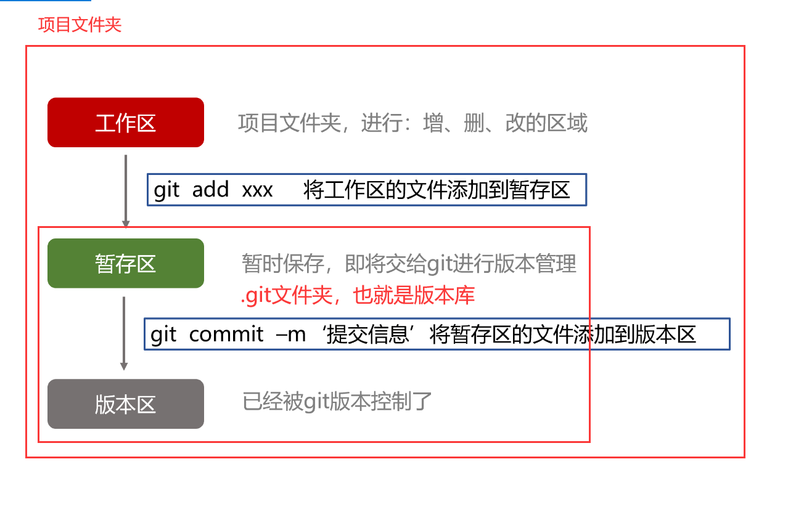
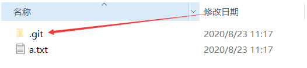
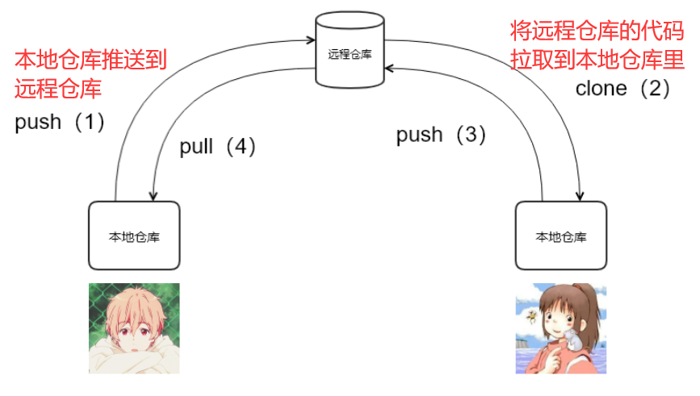
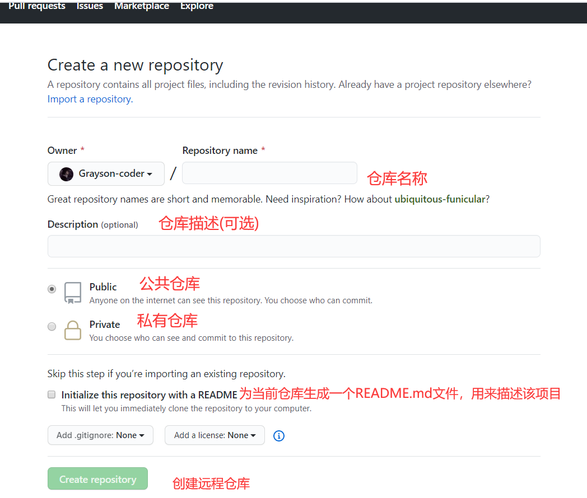

# 一、Git

## 一、Git基础

### 1.1 版本管理

- 什么是版本管理？

    - 版本管理又称为版本控制。版本控制（Revision control）是一种在开发的过程中用于管理我们对文件、目录或工程等内容的修改历史，方便查看更改历史记录，**备份以便恢复以前的版本的软件工程技术**

    - 简单说就是用于**管理多人协同开发项目的技术**

        

- 在实际开发中， 我们的项目不单单只有一个版本，有多个版本，通过学习`Git`，我们可以使用`Git`来帮助我们管理项目的所有版本，并且可以恢复到之前的版本


- 目前市场上主流的版本控制工具有`svn`和`git`


### 1.2 Git的安装和配置

- Git下载地址：https://git-scm.com/
- 淘宝镜像下载地址：http://npm.taobao.org/mirrors/git-for-windows/
    - 一键`next`式安装，不需要更改任何操作，一直点击下一步
    - 安装完成后，在桌面上鼠标右键打开`Git Bash Here` ，输入`git --version`，弹出版本即表示安装成功
    
        


- 在使用`Git`前需要在**Git命令行窗口**进行如下配置

    - 配置提交人姓名：`git config --global user.name 提交人姓名`

    - 配置提交人邮箱地址：`git config --global user.email 提交人邮箱`

    - 查看git配置信息：`git config --list`。或者通过C:\Users\Administrator 下的`.gitconfig`文件查看

        

- 注意：

    1. 如果要对配置信息进行修改，重复上述命令即可。或者到`.gitconfig`文件中修改配置

    2. **配置只需要执行一次**

    


### 1.3 Git的工作流程(重要)

- 理解：工作区、 暂存区、版本库

    - 首先我们会使用 `git init`命令，为当前文件夹项目初始化一个`仓库`，即`版本库`

        

- 工作区：

    - **当前文件夹项目中所有的文件以文件夹**，但不包括`.git`文件夹

- 暂存区：
  
    - 暂存区属于**版本库存储的一块区域**。`git add`命令会将文件或文件夹从**工作区添加到暂存区**
- 版本库：
  
    - `.git`文件夹就是版本库。当使用`git commit` 会将**暂存区的文件提交到仓库里**,，暂存区的文件就会清空。





- git的***工作流程***一般是这样的：

    １、在工作目录中添加、修改文件；

    ２、将需要进行版本管理的文件放入暂存区域；

    ３、将暂存区域的文件提交到git仓库。


### 1.4 Git的使用

- 提交文件/文件夹到 版本库中的流程

    1. `git init` 初始化git仓库，会在当前项目中生成`.git`文件夹，该文件夹就是版本库

        

        

    2. `git status [filename]` 查看当前项目所有文件的状态 

        

        

    3. `git add 文件名` 将文件添加到**暂存区**中， `git add .`将项目中所有的文件添加到**暂存区**

    4. `git commit -m 提交信息` 将`暂存区`中所有的文件提交到`版本库`

    5. `git log` 查看提交记录


- 撤销流程
    - 用**暂存区中的文件覆盖工作目录中的文件**： `git checkout 文件`
    - 将文件从暂存区中删除： `git rm --cached 文件`
    - 如何从暂存区中的文件撤销回工作区：`git reset HEAD -- filename`


### 1.5 Git忽略清单

- 将不需要被git管理的文件名字添加到此文件中，在执行git命令的时候，git就会忽略这些文件。
- git忽略清单文件名称：**.gitignore**

- 有些时候我们不想把某些文件纳入版本控制中，比如`node_module`，临时文件，设计文件等

- 在主目录下建立"`.gitignore`"文件，此文件有如下规则：

    - ```
        #为注释
        *.txt        #忽略所有 .txt结尾的文件,这样的话上传就不会被选中！
        !lib.txt     #但lib.txt除外
        /temp        #仅忽略项目根目录下的TODO文件,不包括其它目录temp
        build/       #忽略build/目录下的所有文件
        doc/*.txt    #会忽略 doc/notes.txt 但不包括 doc/server/arch.txt
        ```

        

    


## 二、Git进阶


### 2.1 分支

- 分支在GIT中属于**相对较难的概念**

- 什么是分支？
    - 分支存在于`版本库中`，实际上`暂存区`中的文件，都会被推送到**指定的分支**下
    - 在首次将暂存区文件推送到版本库中，**默认**会创建一个`主分支（master）`，该分支用于存放推送的文件
    - 在Git中，如果没有创建新分支，则默认会将暂存区的文件推送到版本库的`主分支(master)`中


- 在实际项目开发中`master主分支`应该非常稳定，一般情况下不允许在上面工作
- 工作一般情况下在新建的`dev分支`上工作，工作完后，测试`dev分支`代码稳定后再合并到`主分支master`上来。然后将`主分支master`推送到远程仓库的`master分支下`


### 2.2 分支命令

- git分支常用命令

    - ```
        # 列出当前项目所有的分支
        git branch  ps：需要先将暂存区文件提交到指定分支中，该命令才能起效果
        
        # 列出所有远程仓库的分支
        git branch -r
        
        # 新建一个本地仓库的分支，但依然停留在当前分支
        git branch [branch-name]
        
        # 新建一个分支，并切换到该分支
        git checkout -b [branch]
        
        # 合并指定分支到当前分支
        $ git merge [branch]
        
        # 删除分支
        $ git branch -d [branch-name]
        
        # 删除远程分支
        $ git push origin --delete [branch-name]
        $ git branch -dr [remote/branch]
        ```

        

## 三、Git命令总结

- 查看关联的远程仓库信息

    - ```
        git remote -v   查看关联的远程库的详细信息
        ```

- 将项目文件提交到`git的版本区`中

    - ```
        【git init】  把当前的目录变成可以管理的git仓库，生成隐藏的.git文件夹
        【git add .】 把所有文件添加到暂存区
        【git commit -m ‘xxx’】  将暂存区文件全部提交到版本区中
        git status：查看仓库状态
        ```

        

- 关联远程仓库，将版本区中的代码/`本地仓库` 提交到`远程仓库`里

    - ```
        【git remote add origin 远程仓库地址】   关联一个远程库
        【git push -u origin master】  把本地master分支推送到远程库的master分支下
        
        或者  git push 远程仓库地址 分支名称
        ```

        

- 拉取远程仓库代码

    - ```
        【git pull origin master 】   将远程库的更新拉取到本地并自动合并
        【git clone 远程仓库地址 】   从远程库中克隆
        ```

        

- 如果关联错远程仓库了，要如何修改？

    - ```
        git remote remove origin  清除已关联的仓库
        ```

        

- 如果远程仓库上已经被其他本地仓库项目关联了，并且还进行了推送，那么其他本地仓库的项目就会导致推送远程仓库失败，解决方案：

    - ```
        git push origin master -f
        ```

    - **强制将当前本地仓库的项目推送到远程仓库master分支上**，**会覆盖远程仓库master分支上原有的项目**


# 二、远程仓库


## 2.1 GitHub


### 2.1.1 什么是GitHub

- GitHub是一个***基于Git的代码托管平台***，我们可以将本地`git仓库中的代码`推送到远程的仓库平台，方便和其他同事多人开发。远程仓库也可以理解为`公共仓库`

### 2.1.2 注册

1. 访问[github](https://github.com/)首页，点击 Sign up 注册。


2. 填写用户名、邮箱地址、GitHub登陆密码

    

3. 选择计划

    

4. 填写GitHub问题

    


5. 验证邮箱


### 2.1.3 多人协作开发流程

- A在自己的计算机中创建本地仓库
- A在github中创建远程仓库
- A将本地仓库推送到远程仓库
- B克隆远程仓库到本地进行开发
- B将本地仓库中开发的内容推送到远程仓库
- A将远程仓库中的最新内容拉去到本地




### 2.1.4 远程仓库的推送的拉取

- **创建远程仓库**



​					

​	

- **本地仓库推送到远程仓库命令**
    - 方式一：`git push 远程仓库地址 分支名称` ：将本地仓库的代码推送到远程仓库的指定分支下

    - 方式二：`git remote add origin 远程仓库地址 `：关联一个远程库

        ​			 	`git push -u origin 分支名称`：

        - `origin`为关联好的远程仓库的别名

        

    - 若在成功推送过一次代码后，电脑不能够自动记住github的账户和密码

        - 执行以下命令解决：`git config --global credential.helper store`

    

- 拉取远程仓库
    - 方式一：`$ git clone 远程仓库地址`
    - 方式二：`git pull 远程仓库地址 分支名称`：指定远程仓库的分支上代码合并到本地**master分支**上

    

    - 方式二：  `git fetch origin`：获取所有远程仓库的所有分支拉取到本地仓库
        				`git fetch origin master:dev`：新建了一个本地dev分支，与远程仓库的master分支上代码合并

    ​    

    ​    


## 2.2 码云

- GitHub是一个国外网站，因此有时需要翻墙才能进行访问，由于是纯英文网址，对英语不过关的人非常的不友好

    

- ***码云***是一个国内的基于`Git`的**代码托管平台**，相当于国内版本的`GitHub`，在GitHub上所能实现的功能，在码云上均能实现。**我们可以将远程仓库设立在码云上**。

    

- 码云官网：https://gitee.com/

- 码云是一个纯中文的代码托管平台，因此新建远程仓库非常的方便，不需要阅读英语，其他使用方法和GitHub上一样，因此这里不作过多的讲解

    

- **在之后的项目练习中，统一将项目代码推送到码云平台进行管理**


