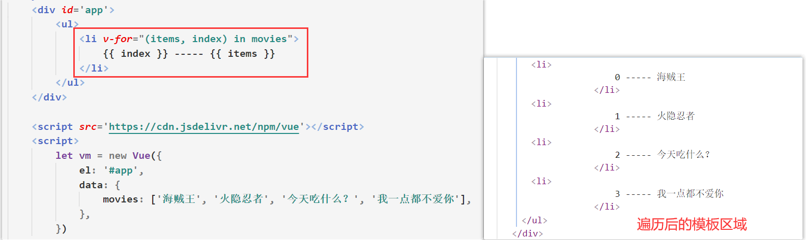
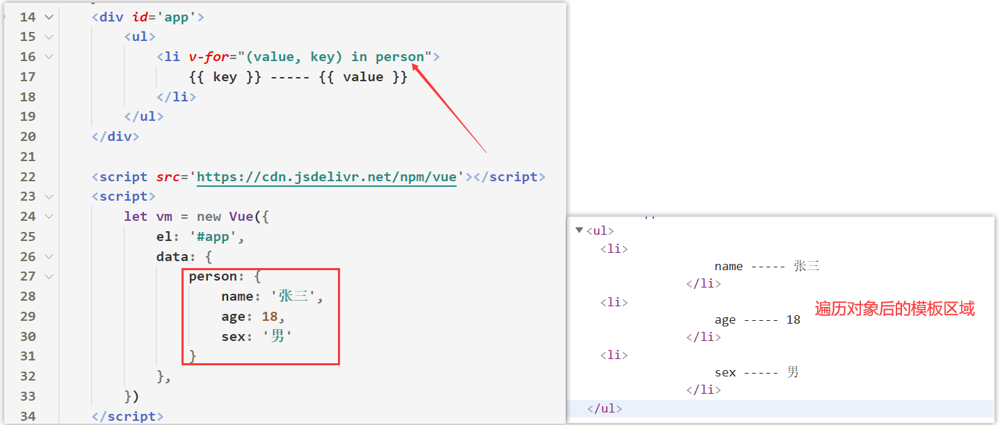
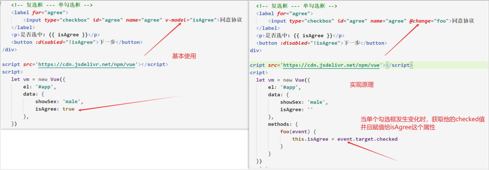
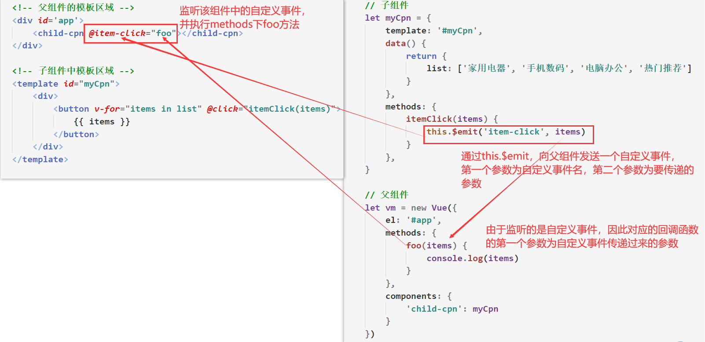

# 一、邂逅Vue.js

## 1.1 Vue起步

### 1.1.1 Vue的介绍

- 为什么学习Vue？
    - Vue目前非常火，可以说**是前端必备的一个技能**。
    - 招聘前端的需求中，10个有8个都对Vue有或多或少的要求。
    
- 什么是Vue？
  
  - Vue是一个前端中**渐进式的开发框架**。使用者要按照**框架所规定的某种规范进行开发**（查阅文档）
  
- Vue的特点

    - 最大的特点是：**我们不需要像以往一样操作DOM元素**

    - ①解耦视图和数据、②可复用的组件、③前端路由技术、④状态管理、⑤虚拟DOM

      ​    

- Vue官方文档：[https://cn.vuejs.org/v2/guide/#%E8%B5%B7%E6%AD%A5](https://cn.vuejs.org/v2/guide/#起步)


### 1.1.2 Vue的引入

- **Vue是一个前端框架**，实际上他的**本质就是一个JS文件**，需要对其进行引入，才能使用

- 方式一：通过CDN引入 （学习时推荐使用该方式引入）

    - ```html
        <!-- 开发环境版本，包含了有帮助的命令行警告 -->
        <script src="https://cdn.jsdelivr.net/npm/vue/dist/vue.js"></script>
        <!-- 生产环境版本，优化了尺寸和速度 -->
        <script src="https://cdn.jsdelivr.net/npm/vue"></script>
        ```

        

- 方式二：通过下载引入 （不推荐）

    - ```html
        开发环境下载地址： https://vuejs.org/js/vue.js 
        生产环境下载地址：https://vuejs.org/js/vue.min.js
        ```

        
        
        

- 方式三：通过NPM下载包导入

    - `npm i vue`

    - 后续通过webpack和CLI的使用，我们使用该方式。

    


### 1.1.3 Vue的初体验


- 很明显**Vue是一个构造函数**，需要通过`new`来进行调用，这个构造函数需要**传入一个对象(opation)来初始化实例**

- 浏览器执行代码的`流程`：

    - 执行到10~14行代码显然出对应的HTML

    - **执行第17行代码创建Vue实例，并且对原HTML进行解析和修改**
    
        
    
- 将Vue中定义的数据展示到页面上，需要用**双大括号表达式**，很像我们以前学习的`art模板引擎`解析数据语法

    

- **Vue是响应式的，响应式意味着当Vue实例中的数据发生改变时，页面也会重新被渲染**


### 1.1.4 Vscode中配置Vue代码片段

- 打开 `文件` =》 `首选项` =》`用户代码片段` =》 `新建全局代码片段文件 `=> `输入vue 然后回车`

- 在`JSON`文件中复制如下代码：

    - ```json
        	"vue-template": {
            		"prefix": "vuekj", // 设置代码片段的快捷键
            		"body": [    // 设置代码片段
            			"    <div id='app'>",
            			"        {{ msg }}",
            			"    </div>",
            			"",
            			"    <script src='https://cdn.jsdelivr.net/npm/vue'></script>",
            			"    <script>",
            			"        let vm = new Vue({",
            			"            el: '#app',",
            			"            data: { ",
            			"                msg: 'Vue'",
            			"            },",
            			"        })",
            			"    </script>",
            		],
            		"description": "my vue template"  // 当前代码片段的描述
            	}
        ```

        


## 1.2 Vue中的MVVM

- 什么是MVVM？

    - **MVVM**（**Model–view–viewmodel**）是一种软件[架构模式](https://zh.wikipedia.org/wiki/架构模式)。MVVM有助于将[图形用户界面](https://zh.wikipedia.org/wiki/图形用户界面)的开发与[业务逻辑](https://zh.wikipedia.org/w/index.php?title=业务逻辑&action=edit&redlink=1)或[后端](https://zh.wikipedia.org/wiki/前端和后端)逻辑（*数据模型*）的开发[分离](https://zh.wikipedia.org/wiki/关注点分离)开来

    - 而Vue框架中，采用的就是MVVM思想

        

- MVVM的组成

    - View层（**视图层**）：

        - 在我们前端开发中，通常就是DOM层。
        - 主要的作用是**给用户展示各种页面。**

    - Model层（**数据层**）：

        - 数据可能是我们固定的死数据，更多的是来自我们服务器，**从网络上请求下来的数据**。

    - ViewModel层（**视图模型层**）：

        - **视图模型层是View和Model沟通的桥梁**。

        - 一方面它实现了Data Binding，也就是**数据绑定**，将Model的改变实时的反应到View中

        - 另一方面它实现了DOM Listener，也就是**DOM监听**，当DOM发生一些事件(点击、滚动、touch等)时，可以监听到，并在需要的情况下改变对应的Data。


- 解析Vue中的MVVM思想：
    - 


## 1.3 Vue的生命周期

- 什么是Vue的生命周期？
    - 每个 ***Vue/组件 实例***在被创建到销毁时都要**经过一系列的过程**。在这个过程中Vue内部源码会自动调用一些叫做**生命周期的钩子函数**。
    - **钩子函数也称为回调函数**，都是别人帮助我们调用的

- 示例

    - ```js
        let vm = new Vue({
          el: '#app',
          created: function() {
            console.log('created被调用了');
          },
          mounted: function() {
            console.log('mounted被调用了');
          }
        })
        ```

        

- Vue的生命周期图示（暂时先做了解，到组件化时会详细讲这张图）

    - 参考：`Vue 高级 -> 细节补充 -> 回顾生命周期`

    
    
      


# 二、Vue的配置选项


## 2.1 配置选项的介绍

- 我们在创建Vue实例的时候，会传入一个对象***options***（选项）。

    - ```js
        let vm = new Vue({
        		// 选项
        })
        ```

- 这个`options`中可以包含哪些***属性***呢？

    - 详细解析： [https://cn.vuejs.org/v2/api/#%E9%80%89%E9%A1%B9-%E6%95%B0%E6%8D%AE](https://cn.vuejs.org/v2/api/)

      ​    

## 2.2 选项 / 数据

### date

- **类型**：`Object | Function`

- **限制**：组件的定义只接受 `function`

- 作用：主要用于定义数据，数据多数来源于服务器上返回的数据

- 详细：

    - Vue 实例对象**代理了 data 上所有的 属性以及方法**，因此访问 `vm.a` 等价于访问 `vm.$data.a`。
    - `data如果是对象类型`则**this指向的是**window对象
    - 修改了Vue实例对象下的属性以及方法，原始数据`data`也会跟着发生变化，Vue内部会监听数据是否发生变化，如果发生了变化，会重新渲染页面

- 示例：

    - ```js
        let vm = new Vue({
          data: {  // 定义数据
            a: 1
            b: this  // 这里的this指向的是window
          }
        })
        vm.a // => 1
        vm.$data === data // => true
        
        // 设置 property 也会影响到原始数据
        vm.a = 2
        data.a // => 2
        // ……反之亦然
        data.a = 3
        vm.a // => 3
        ```

        

        

### methods

- **类型**：`{ [key: string]: Function }`

- 作用：***定义属于Vue的一些方法***，***内部方法***可以在其他地方调用，也可以在指令中使用。

- 详细：

    - Vue 实例对象**代理了 methods 上所有的 方法**。

    - `内部方法中`的 `this` 自动绑定为 ***Vue 实例对象。******内部函数不能用箭头函数来定义***，使用箭头函数定义的话，this会指向window对象

        

- 示例：

    - ```js
        let vm = new Vue({
          data: { a: 1 },
          methods: {
            plus: function () {
              this.a++   // this指向的是vue实例对象，data下的属性/方法都会被vue实例对象代理
            }
          }
        })
        vm.plus()
        vm.a // 2
        ```

        

### computed

>注：**当computed中的函数中的内部数据发生变化时，就会重新调用其函数**
>

- **类型**：`{ [key: string]: Function }`

- 详细：

    - **Vue实例会将 computed 的内部方法 转换为属性，并且代理**。内部方法中**this指向的是Vue实例对象**
    - `computed`中的内部方法，必须要有返回值`return`

    - 注意：虽然`computed`内部是写方法，但是挂载到Vue实例上时，他却是一个属性而不是一个方法
        - 

- 示例：

    - ```js
        <div id='app'>
          <h2>{{ fullName }}</h2>
        </div>
        
        let vm = new Vue({
          data: {
            firstName: 'kobe',
            lastName: '詹姆斯',
          },
          computed: {
            fullName: function () {
              return this.firstName + this.lastName
            }
          },
        })
        vm.fullName  // kobe詹姆斯
        ```

        

- computed 和 methods的区别

    - **Vue实例会代理 methods 下所有的方法**，在模板区域中需要**通过调用方式**，才能展示返回值数据

    - Vue实例会将 computed 下的**所有方法转换为 属性**，并且代理，在模板区域中，不需要通过调用即可展示数据
    - 


### filters

- **类型**：`{ [key: string]: Function }`

- 详细：

    - `filters`：过滤器。`filters`主要用于将数据转换为我们想要的形式(格式)然后展示到页面上
    - 语法：`{{ 数据 | 内部函数名}}`
    - `filters`内部函数必须要有返回值，作为最终展示在页面上的数据。**内部函数的形参**就是`|`前面的数据

    

- 示例：

    - ```js
        <div id='app'>
          	{{ "过滤器" | finalDate }}  // 最终展示：过滤器123
        </div>
        ...
        filters: {
            finalDate: function(data) {  // data 是模板区域中 | 前面的值（过滤器）
            		return data + '123'
            }
        }
        ```

        

### props

- **类型**：`Array | Object`

- **详细**：
  
  - `props `可以是数组或对象，用于注册组件的自定义属性，接收来自父组件的数据。其自定义属性会被组件实例所代理
  
- 示例：

    

    

- 参考：`父子组件通信`


### watch

- **类型**：`{ [key: string]: Function }`
- **详细**：
  
  - 一个对象，***键是需要观察的Vue实例下的数据***，值是对应回调函数。值也可以是方法名。**当观察的数据发生变化时，会执行对应的回调函数以及方法**
  
- 示例：

    - 

        

- `watch`一般可用来初始化父组件传递给子组件的数据


## 2.3 选项 / DOM

### el

- **类型**：`string | Element`

- 详细：

    - 可以是 CSS 选择器，决定Vue实例会**管理哪一个DOM元素区域**
    - **被挂载的DOM元素区域属于模板区域**，Vue中的模板语法，只在该区域中生效
    - 不可以直接挂载在`body`或`HTML`元素上

- 示例：

    - ```html
        <div id='app'>
           <!-- 这里是模板区域 -->
        </div>
        
        <script>
            let vue = new Vue({
                el: '#app',  // 用于挂载要管理的区域
                data: { msg: '李银河',}  // 定义数据
            })
        </script>
        ```

        

### components

- **类型**：`Object`

- **详细**：

    - 包含当前Vue实例中**所挂载的模板区域内可用的组件**

- 示例：

    - ```js
        let vm = new Vue({
          el: '#app',
          components: {
          	// 在 '#app'的模板区域内  注册一个名为 father 的组件
          	'father': {
              // ....opation....
            }
          }
        })
        ```

- 参考：`组件化开发`


### template

- **类型**：`string`

- **详细**：

    - 在组件对象中，`template`用于指定该组件的***模板区域***

    - 在Vue实例下，`template`也是用于指定属于Vue实例的***模板区域***，

    - 如果Vue实例中同时指定了`template`和`el`，那么`template`模板的内容会替换`el`所挂载的区域

        

- 示例：

    - 

        

- 注意：在Vue实例下，如果没有指定`el`所挂载的区域，并且`HTML`中没有编写其挂载的区域，那么`template`不会生效
  
    - 


### render

- **类型**：`Function`

- 详细：
    - 和`teamplate`相似。用于指定Vue实例的模板区域
    - Vue 选项中的 `render` 函数若存在，则 `render`函数中传入的***组件对象指定的模板区域***会覆盖 `template` 选项或 `el` 选项挂载的模板区域

- 示例：

    - 

        

        

- 和`template`一样。如果没有指定`el`所挂载的区域，那么`redner`函数***所指定的模板区域就不起效果***

- 使用`render`函数指定模板区域时，不需要注册组件


## 2.4 选项 / 生命周期函数

- 前言：所有的生命周期的函数中的`this`都**指向Vue实例/组件对象**。因此不可以用`箭头函数`来定义生命周期函数，会导致this的指向发生变化


### created

- **类型**：`Function`

- **详细**：

    - 在实例创建完成后被立即调用，**此时挂载的模板区域和vue实例并没有进行关联**

- **参考**：生命周期图示

  ​    

### mounted

- **类型**：`Function`
- **详细**
    - **将编译好的的HTML页面 (模板区域 + 数据) 挂载到页面**上就会被调用
    - 该阶段一般用于获取服务器的数据


## 2.5 选项 / 混入

### 混入的介绍

- Vue允许我们在其他***JS文件中定义一个混入对象***
- 混入对象可以**包含任意的Vue配置选项**。当组件使用混入对象时，所有混入对象的选项将被**“混合”进入该组件本身的选项**


- 示例：

    

    


## 2.6 实例API

### vm.$mount()

- **参数**：`[elementOrSelector]`
- **返回值**：`vm` 实例自身

- **用法**：
  
  - `vm.$mount()`和`el`选项功能一样，都是用来指定要挂载的模板区域。如果两者同时出现，则以`el`所挂载的区域为准
  
- 示例：

    - ```js
        new Vue({
          data: {
          	msg: 'Vue'
          },
        }).$mount('#app')
        ```

        

### vm.$refs.xxx

- `ref` 是**作为元素的属性**写入元素标签或子组件标签中。

- 组件可以通过`this.$refs.ref值`。获取**DOM元素或组件实例**

    ```html
    <!-- `vm.$refs.p` will be the DOM node -->
    <p ref="p">hello</p>
    
    <!-- `vm.$refs.child` will be the child component instance -->
    <child-component ref="child"></child-component>
    ```

    

### vm.$el

- **类型**：`Element`

- **详细**：

    - 获取Vue 实例或组件对象使用的***根 DOM 元素***。

    

- 示例：

    - ```js
        this.$refs.tabControl.$el.offsetTop
        // 获取tabControl组件中的根DOM元素
        ```

        

### vm.$nextTick(callback)

- **参数**：
  
    - `{Function} [callback]`
- **用法**：
  
    - 将回调延迟到**下次 DOM 更新循环之后执行。**
- 详细：
    - Vue 在更新 DOM页面 时是**异步**执行的。只要侦听到数据变化，Vue 将开启一个队列，用于存放异步任务
    - 有时我们希望在DOM渲染完成之后在做一些事情，比如组件中控制了DOM元素的显示和隐藏，当显示时，就要重新计算better scroll 可滚动的高度，这时候就要使用`this.$nextTick`，等DOM渲染后 在刷新滚动的高度

- 示例：

    - ```js
        methods: {
            imgLoad() {
                // 等DOM重新渲染完成之后在计算可滚动的高度
                this.$nextTick(() => {
                		this.detailBScroll.refresh()
            		})
            },
        }
        ```

        


# 三、模板语法

## 3.1 数据展示

### 3.1.1 Vue的模板区域

- **在创建Vue实例时，需要挂载一个DOM元素作为模板区域，在该模板区域内才能使用Vue的模板语法**
    - 


### 3.1.2 模板区域可渲染的数据

- 在Vue上，我们往往将数据定义到`data`中，有时数据也会定义到`computed`中，将方法定义到`methods`下

- 实际上，在`data`、`computed`、`methods`下定义的所有属性以及方法，**都会被挂载到Vue实例对象上**

- 

    

- 总结：我们在***Vue模板区域内所能渲染的数据就是Vue实例对象下所有的属性以及方法***

    

### 3.1.3 Mustache

- 双大括号表达式（Mustache）

    - 
    
    - 在双大括号表达式内可以是一个表达式：**三元表达式、非与或表达式**

    - 括号里面需要放入**Vue实例下的属性或方法名**，如果**是方法**则需要用`()`调用
    
        - 
    
            
    
            
    
        

### 3.1.4 v-once

- `v-once`指令

    - **该指令表示元素和组件(组件后面才会学习)只渲染一次**，不会随着数据的改变而改变。

    - ```html
        <h3 v-once>{{ a }}</h3>
        ```

        

### 3.1.5 v-html

- `v-html`指令

    - 语法：`v-html='Vue实例下的属性/方法'`

    - **该指令用于解析HTML格式的数据**

    - ```html
        <h3 v-html='link'></h3>
        .....
        data: {
            link: '<a href="#">百度一下</a>'
        },
        ```

        


## 3.2 动态绑定元素的属性

### 3.2.1 v-bind 绑定基本属性

- 除了HTML元素内容需要动态来决定外，某些**元素的属性我们也希望动态来绑定**。也就是说元素的属性值不是写死的，而是**Vue实例下的数据**

- 在Vue中，可以通过`v-bind`指令来**控制元素属性的值**

- `v-bind`

    - **缩写**：`:`

    - 语法：`v-bind:要绑定的属性名='Vue实例下的属性/方法'`

    - 示例：

        - ```html
            <a v-bind:href="url">百度一下</a>
            
            <!-- v-bind语法糖形式 -->
            <a :href="url">百度一下</a> 
            ```
            
            
### 3.2.2 v-bind 绑定类名

- 在实际开发中绑定类名的方式，并不像绑定普通属性那样，基本都是采用`对象语法`形式***绑定class***

- 用法一：通过判断传入多个类名（最常用）

    - ```html
        <h2 class='wrap' :class="{'active': isActive, 'key': value}">H</h2>
        ```
    
    - `key`是个类名，`value`是Vue实例下的属性或方法，`value`的值为布尔值
    
    - `value`也可以是一个表达式，前提是这个表达式返回的是一个布尔值。
    
    - 当`value`的值为true时，对应的类名才会生效。否则类名不生效
    
    - 如果`v-bind`绑定的类名和普通的类名同时存在，***并不冲突***，如果isActive为true，那么会有title/active两个类


​    

​    

- 用法二：如果传入的类名数量过于多， 可以放在一个methods或者computed中。注：classes是一个计算属性

    - ```html
        <h2 class="title" :class="classes">Hello World</h2>
        ....
        computed: {
            classes() {
            		return { 'red': this.isRed, 'blue': this.isBlue }
            }
        },
        ```

        


### 3.2.3 v-bind 绑定样式（很少用）

- 绑定元素的内联样式，我们也采用的是对象语法形式，跟绑定类名相似

- `:style="{样式名: Vue实例下的属性/方法}"`

    - 对象的key是CSS属性名称

    - 对象的value是具体赋的值，值来自于Vue实例下的属性

    - ```html
        <h2 :style="{color: finalColor}">我是一个H2标签</h2>
        ```

        

### 3.2.4 v-bind 注意要点


- 注意点一：只有通过`v-bind`绑定的属性，**属性值才能是Vue实例下的数据**，否则无法解析出来
    - 


- 注意点二：`v-bind`绑定的属性**其对应的属性值**可以是`表达式`，`表达式`的返回值作为***属性值***

    - 

    

- **以上两点是刚学Vue时，容易犯错的地方，需要记住**


## 3.3 事件监听


### 3.3.1 v-on 基础

- 在Vue中可以用 `v-on` 指令监听 DOM 事件，并在触发时运行一些 JavaScript 代码。事件所触发的JS代码，必须写在`methods`里面

    

- `v-on`指令

    - 原始写法：`<a v-on:事件名称="Vue实例下的方法">a标签</a>`
    - 语法糖写法：`<a @事件名称="Vue实例下的方法">a标签</a>`
    - 用法：用在DOM元素上时，只能监听[**原生 DOM 事件**](https://developer.mozilla.org/zh-CN/docs/Web/Events)。比如click、mousemove、mouseleave这些事件

- 示例:

    - ```html
        <!-- 点击a元素 触发Vue实例下的foo方法 -->
        <a v-on:click="foo">a1</a>
        <!-- 语法糖写法 -->
        <a @click="foo">a2</a>
        
        <!-- 监听鼠标移入事件 -->
        <a @mouseover="foo">a1</a>
        ```

- 注意：
    - `v-on:event`后触发的方法，可以不加括号调用，Vue源码会自动帮你调用。
    - 这一特点只有`v-on`指令具备，**其他指令**都必须要加括号才能调用Vue实例下的方法


### 3.3.2 v-on 传递参数

- 在使用`v-on`绑定事件监听且调用方式时，要**注意调用方法时是否需要传递参数**

- 情况一：如果调用方法时**不需要额外参数**，那么调用方法时后面的()可以不添加。

    - ```html
        <!-- 调用foo方法时后面括号可加可不加 -->
        <a @click="foo">a1</a>
        
        methods: {
            foo(event) {  // event 是事件对象
            		console.log(name);
            }
        }
        ```

    - 但是注意：如果定义的方法中有一个形参，那么会默认将原生事件event对象参数作为实参传递进去

        

- 情况二：如果调用方法时需要传入某个参数，同时需要事件对象时，可以通过`$event`传入事件对象，此时要加括号调用方法并且传递参数

    - ```html
        <a v-on:click="foo('a', $event)">a1</a>
        
        methods: {
            foo(a, event) {
                console.log(a);  // a
                console.log(event);  // 事件对象
            }
        }
        ```

        

- 注意：在使用`v-for`指令遍历数据并且使用`v-on`调用方式时，**可以传入当前遍历的项以及索引值作为实参**

    - ```html
        <li v-for="(items, index) in movies" @click="foo(index/items)"></li>
        ```

        


### 3.3.3 v-on 修饰符

- 在某些情况下，我们拿到**事件对象(event)**的目的可能是进行一些事件处理。
    - 比如取消DOM元素的冒泡行为、默认行为、判断用户键盘上按下的键盘等一系列操作


- Vue.js 为 `v-on` 提供了**事件修饰符**。为了便于操作事件对象
    - .stop：调用 event.stopPropagation()。
    - .prevent：调用 event.preventDefault()。
    - **@keyup.{keyCode | keyAlias}** - 只当事件是从特定键触发时才触发回调。
    - ***.native：监听组件根元素的原生事件***。（组件化开发时再研究这个修饰符）
    - .once：只触发一次回调

- 修饰符示例：

    - ```html
        <!-- 停止事件冒泡行为 -->
        <a @click.stop="doThis"></a>
        
        <!-- 阻止表单按钮提交的默认行为 -->
        <input type="submit" @click.prevent="submit">
        
        <!-- 表单提交时不再重载页面，后面可以不跟表达式 -->
        <form @submit.prevent="onSubmit"></form>
        
        <!-- 串联修饰符(停止事件冒泡并且阻止了默认行为) -->
        <a @click.stop.prevent="doThat"></a>
        
        <!-- 判断是否在表单中按下enter键 （键别名） -->
        <input @keyup.enter='key'>按键</input>
        
        <!-- enter键代码 -->
        <input @keyup.13='key'>按键</input>
        ```

        


### 3.3.4 v-on 和 v-for 结合案例

- 需求：

    - 遍历`data`中的***movies数组***并展示到**模板区域中**
    - 点击列表中的哪一项，那么该项的文字就会变成红色

- 实现：

    - 

        

    - 模拟上图中`v-for`和`v-bind`的流程

        


## 3.4 条件渲染

### 3.4.1 v-if 和 v-else

- `v-if` 指令用于**条件性地渲染一块内容**。
    - 语法：`v-if="表达式"`
    - 这块内容只会在指令的表达式返回`true`值的时候被渲染。 
    - 表达式为`false`时，会渲染`v-else`下的DOM元素。且`v-if`所在的DOM区域会被销毁，不存在body标签里
    - **表达式内的变量为Vue实例中的属性**

- `v-else` 元素必须紧跟在**上一个**带 `v-if` 的元素的后面，否则它将不会被识别。

- 示例：

    - ```html
        <h1 v-if="score>80">优秀</h1>
        <h1 v-else>垃圾</h1>
        ```

        - 当Vue实例下的score属性的属性值大于80时，会渲染`v-if`所在的DOM区域，否则渲染`v-else`所在的DOM区域


### 3.4.2 用 key 管理可复用的元素

- Vue 会尽可能高效地渲染元素，通常会复用已有元素而不是从头开始渲染

    


- 在上面的代码中切换 `user` 将不会清除用户已经输入的内容。因为两个模板使用了相同的元素，

    - ` input`不会被替换掉——仅仅是替换了它的 `placeholder`。

    - 因此我们在有输入内容的情况下，切换了类型，我们会发现**文字依然显示之前的输入的内容**。

        

- 这样也不总是符合实际需求，所以 Vue 为你提供了一种方式来表达“这两个元素是完全独立的，不要复用它们”。只需为元素添加一个具有唯一值的 `key` 属性即可：

    ​	


### 3.4.3 v-show

- `v-show`的用法和`v-if`非常相似，也用于决定一个元素是否渲染

- 示例：

    - ```html
        <h1 v-show='isShow'>我是一个h1标签</h1>
        ```

    - 当表达式的值为`true`时，`v-show` 的元素将会显示在页面中
    - 当表达式的值为`false`时，`v-show` 的元素的  CSS `display`属性将会为`none`


- `v-if`和`v-show`的对比
    - `v-if`当条件为false时，压根不会有对应的元素在DOM中。**也就是body标签中，不会有对应的元素**
    - `v-show`当条件为false时，仅仅是将元素的**display属性设置为none**而已。

- 开发中如何选择呢？
    - 当需要在显示与隐藏之间切片很频繁时，使用`v-show`
    - 当只有一次切换时，通过使用`v-if`


## 3.5 循环遍历

### 3.5.1 v-for  遍历数组

- 当我们***需要遍历数据渲染到模板区域***内时，我们就可以使用`v-for`指令来完成
- `v-for`指令类似于`.art`模板文件中的`{{ each }}`语法

- `v-for`语法：`v-for="(items, [index]) in Vue实例下的数组"`

- 演示：

    -    

    - `items`是当前遍历数组的**每一项的值**，`index`是当前遍历到的**项的索引值**

    - 我们可以使用`Mustache语法`，**将数组中每一项的值和对应索引，展示到页面上**


### 3.5.2 v-for 遍历对象

- `v-for`也可以遍历对象，语法如下
    - `v-for="(value, key) in Vue实例下的对象"`

- 演示：

    - 

    - `value`是对象上的属性值， `key`是对象上的属性名


### 3.5.3 key属性

- 官方推荐我们在使用`v-for`时，给对应的元素或组件**绑定上一个**`:key属性`

- 为什么需要绑定`key属性`？

    - **这里涉及到Vue底层关于虚拟DOM的知识以及Diff算法**

    - 我们不必关心Vue底层方面，只需要知道一句话：***key的作用主要是为了高效的更新虚拟DOM***

        

- 以后在使用`v-for`遍历数据时，统一绑定`:key="唯一的值"`属性

    - ```html
        <div v-for="item in movies" :key="item">
          <!-- 内容 -->
        </div>
        ```

        


### 3.5.4 数组更新检测

- 因为Vue是响应式的，所以当**Vue实例下的数据发生变化时**，**Vue会自动检测数据变化，视图会发生对应的更新**。

- Vue中包含了***一组观察数组编译的方法***，**使用它们改变数组才也会触发视图的更新**。
    - `push()`、`pop()`、`shift()`、`unshift()`、`splice()`


- ​	`splice(参数1, 参数2, [参数3]...)`：可以对数组进行***增删改***操作

    - **参数1表示从数组的第几个元素开始操作**

    - 删除元素：**参数2传入你要删除几个元素**

        - ```js
            arr.splice(1, 2)
            ```

    - 替换元素：参数2表示我们要替换几个元素，后面是用于替换前面的元素

        - ```js
            arr.splice(1, 2, '张三', '老王')
            ```

    - 添加元素：参数2插入0，并且后面跟上要插入的元素

        - ```js
            arr.splice(1, 0, '1111111')
            ```

            

- `Vue.set(要修改的数组, 索引值, 修改后的值)`

    - ```js
        Vue.set(this.arr, 1, '我不爱你了啊')
        ```

    - 将Vue实例下的`arr`数组中`索引为1的元素`，值修改为了`我不爱你了啊`


### 3.5.5 循环绑定事件

- `v-for`遍历数据时，我们可以为使用`v-for`的**元素或者他的子元素**，**绑定事件监听**
    - 注意：**绑定事件监听调用方法时**，可以将`v-for`遍历到的`items`和`index`作为实参，传递进去


### 3.5.6 循环动态绑定元素属性

- `v-for`遍历数据时，我们可以为使用`v-for`的**元素或者他的子元素**，**动态的绑定元素属性**

    - 注意：在`v-for`遍历的元素中，如果想让遍历的元素属性值是遍历到的数组的元素，就要动态的绑定元素属性，要通过`v-bind`

    

    

    

    

    


### 3.5.7 图书购物车案例


- 整体页面
    - 


- 代码实现：

    - 

    - 


## 3.6 表单输入绑定

### 3.6.1 v-model 表单绑定

- 在Vue中使用`v-model`指令来实现**表单元素和数据的双向绑定**。

- 在实际开发中，我们往往要获取到用户在表单中输入的值，通过`v-model`指令，我们可以很方便的获取到用户输入的值

- 

    - 当我们在输入框输入内容时，因为input中的`v-model`绑定了**msg**，所以会实时将表单输入的内容传递给**msg**，**msg**发生改变。
    - 当**msg**发生改变时，由于**msg是Vue实例下的数据**，因此会重新渲染页面

    - 所以，通过`v-model`实现了双向的绑定。（用户在表单中输入的值与Vue实例下的数据进行了绑定）


- `v-model`也可以绑定多行文本框元素
    - 


### 3.6.2 v-model 实现原理

- `v-model`其实是一个语法糖，它的背后本质上是包含两个操作：

    1. `v-bind`绑定一个**value**属性。

    2. `v-on`指令给当前表单元素绑定**input事件**。用于**触发表单发生变化时的方法**

- 实现流程：
    1. 绑定表单发生变化时的事件。
    2. 获取表单每次发生变化后的**value**值，**并且将获取到的value值 赋值给Vue实例下的show属性**
    3. 给表单绑定一个value属性，值为Vue实例下的show属性
    4. 当Vue实例下的show属性发生变化时，页面会被重新渲染，表单的值就是show的属性值，实现双向绑定


- `v-model`实现原理：
    - 


### 3.6.3 v-model  单选按钮

- `v-model`配合单选按钮（radio）使用
    - 


- 其实现原理：
    - 


### 3.6.4 v-model 复选框

- 复选框分为两种情况：***单个勾选框***和***多个勾选框***


- `v-model`配合单个勾选框的使用
    - `v-model`即为**布尔值**
    - 


- `v-model`配合**多个勾选框**使用

    - 当是多个复选框时，因为可以选中多个，所以`v-model`对应的数据是一个数组
    - 

    - 


### 3.6.5 v-model 下拉框

- 和复选框一样  下拉框也分单选和多选的情况

- `v-model`配合下拉框***单选***

    - 单选：只能选中一个值。

    - `v-model`绑定的是一个值。

    - 当我们选中option中的一个时，会将它对应的value赋值到`fruit`中

    - 

        

    - 


- `v-model`配合下拉框多选

    - 多选：可以选中多个值。

    - `v-model`绑定的是一个数组。

    - 当选中多个值时，就会将选中的option对应的value添加到数组`fruits`中
    - 


### 3.6.6 v-model 修饰符

- 除了`v-on`指令有修饰符，`v-model`也有修饰符

- `.lazy`修饰符：

    - 默认情况下，`v-model`指令是当文本框一旦发生变化，就会将文本框的值更新给Vue实例下的数据

    - `lazy`修饰符可以让***文本框在失去焦点或者回车时才会把值进行更新***

    - ```html
        <input type="text" v-model.lazy="msg">
        ```

        

- `.number`修饰符：

    - 默认情况下，在输入框中无论我们输入的是字母还是数字，都会被当做**字符串类型**进行处理。

    - `number`修饰符可以让在输入框中输入的内容自动转成数字类型

    - ```html
        <input type="text" v-model.number="msg">
        ```

        

- `.trim`修饰符

    - 如果要自动过滤用户输入的首尾空白字符，可以给 `v-model` 添加 `trim` 修饰符

    - ```html
        <input v-model.trim="msg">
        ```

        


# 四、组件化开发

## 4.1 认识组件化

### 4.1.1 什么是组件化？

- 我们知道一个完整的项目是由`CSS`+`HTML`+`JS`构成的。如果我们将一个页面中所有的处理逻辑全部放在一起，处理起来就会变得非常复杂，而且不利于后续的管理以及扩展。

    

- 但如果，**我们将一个页面拆分成一个个小的组件**（Component）， 每个组件都有属于他自己的`CSS`+`HTML`+`JS` ，那么之后整个页面的管理和维护就变得非常容易了

   


### 4.1.2 Vue组件化思想

- ***组件化是Vue.js中的重要思想***   

    - 它提供了一种拆分思想，让我们可以开发出一个个***独立可复用的小组件***来构造我们的项目。

    - 任何的项目都会被拆分成一颗组件树。             

    - 

        ​            

- 组件化思想的应用：
    - 尽可能的**将页面拆分成一个个小的、可复用的组件**(Component)。
    - 这样让我们的代码更加方便组织和管理，并且扩展性也更强。


## 4.2 注册组件


### 4.2.1 全局组件注册

1. 注册全局组件

    - ```js
        // 注册一个名为 my-cpn 的组件 (全局注册)
        Vue.component('my-cpn', { // ... options ...
          // 定义组件的模板区域
          template: `<div>我是组件</div>`
        })
        ```

2. 在Vue实例所挂载的的模板区域内，**将注册后的组件名作为HTML元素**并且使用

    - ```html
        <div id='app'>
            <!-- 使用组件 -->
            <my-cpn></my-cpn>
        </div>
        ```

- **全局组件可以在任何Vue实例中的模板区域内使用**
    - 


- 全局组件注意点：***注册全局组件时需要在Vue 实例被创建之前***


### 4.2.2 局部组件注册

1. 注册局部组件

    - ```js
        let vm = new Vue({
          el: '#app',
          // 注册一个名为 my-cpn 的组件
          components: {
            'my-cpn': {  // ... options ...
              // 定义组件的模板区域
              template: `<div>我是一个组件</div>`
            }
          }
        })
        ```

2. 在被注册的**模板区域**内，**将注册后的组件名作为标签名**并且使用

    - ```html
        <div id='app'>
           <!-- 使用组件 -->
        	<my-cpn></my-cpn>
        </div>
        ```

        

- `局部组件`只能够在***当前注册的Vue实例中的模板区域内使用***


### 4.2.3 组件模板的分离写法

- 在注册组件时，我们需要在`template`中编写HTML代码，这容易造成嵌套，不易阅读

- 如果我们能将其中的HTML分离出来写，然后挂载到对应的组件上，必然结构会变得非常清晰。

    

- Vue提供了两种方案来***定义组件的模板内容***

    - 使用`<script>`标签

    - 使用`<template>`标签


### 4.2.4 组件的配置选项

- 每个组件都是一个单独功能模块的封装。他有一套属于自己的`HTML`+`CSS`+`JS`。

    - 因此组件除了要有自己的`HTML模板`，也应该有属性自己的`JS`

        

- 在注册组件时，除了要传入***组件名***，还要传入组件的***配置对象***
    - `每个组件可以看做是Vue实例的分身`，所以组件的配置选项与 `new Vue` 时的配置选项相同
    - 例如 `data`、`computed`、`watch`、`methods` 以及生命周期钩子等。
    - 仅有的例外是像 `el` ***只有根实例特有的选项***。
    - 组件中的`data`**必须是一个函数**，而且这个函数返回一个对象，对象内部保存着数据

- 示例：


- **所有的组件可以看做是Vue实例的分身**
    - 因此组件中定义的数据和方法都会***被挂载到组件对象身上***。
    - 其方法中的`this指向`也会指向组件对象


### 4.2.5 组件中的data解析

- 为什么data在组件中必须是一个函数呢?

    - 首先：组件在页面中是可以多次复用的。这就意味着**一个页面中可能多次使用到同一个组件**。
    - 如果每个组件所绑定的数据是一样的，那么其中一个组件的数据在发生变化的同时，其他组件的数据也会跟着变化。组件之间会相互影响

    

- 在使用组件时，Vue内部会调用组件的`data`函数。且`data`函数的***返回值将会作为组件对象上的数据***

    - 因此在组件中定义数据，必须让`data`函数返回一个新对象，这样组件之间就不会导致冲突

    - ```js
        data() {
        	return {
        		// 组件中定义的数据写在这里面
        	}
        }
        ```

        

### 4.2.6 组件的注意点

1. 不论是全局组件还是局部组件，都**只能在其对应的Vue实例的模板区域内使用**。一旦在Vue的模板区域外使用这些组件，则渲染不出来


2. **每个组件的模板区域必须只有一个根元素**
- 注册组件时，我们往往要传入很多配置项，其中一个配置项就是`template`。
  
- `template`主要用于定义组件的`模板区域`。***但是该模板区域内必须只能有一个根元素***


## 4.3 父子组件


### 4.3.1 理解父子组件

- 在Vue中允许**组件和组件之间存在层级关系**。也就是说一个组件里可以嵌套另外一个组件

    - 而其中一种非常重要的关系就是**父子组件关系**

        

- 在Vue中，我们可以把**一个Vue实例看成是一个根组件**。
  
    - 因为所有的局部组件都要在**Vue实例配置项里**的`components`进行注册


- 在组件中，除了可以传入`template`定义模板内容，还可以传入`components`，用于注册其他组件
    - 在一个组件内注册另外一个组件，这样的组件关系我们称为`父子组件`
    - 


### 4.3.2 组件的使用范围

- ***全局组件***可以在**任何组件的模板区域和Vue实例下的模板区域**内使用

    - 

        

- 在Vue实例和组件下注册的所有组件都为`局部组件`。`局部组件`在哪个模板区域内被注册，就只能在那个模板区域内使用
  
    - 


### 4.3.3 理解父子组件的通信

- 在之前的学习过程中，我们了解到子组件是不能引用父组件或者Vue实例的数据的

- 但是，在开发中，往往一些数据确实需要从父组件传递到子组件：

    - 比如在一个页面中，我们从服务器请求到了很多的数据。

    - 其中一部分数据，并非是我们整个页面的大组件来展示的，而是需要下面的子组件进行展示。

    - 这个时候，并不会让子组件再次发送一个网络请求，***而是直接大组件(父组件)将数据传递给小组件(子组件)*****。**

    - 

        

        

- 如何进行父子组件间的通信呢？

    - 通过`props（自定义属性）`向子组件传递数据 （父组件向子组件传递数据）

    - 通过`自定义事件`向父组件发送消息 （子组件向父组件传递数据）


### 4.3.4 父级向子级传递数据

1. 组件中的`props`选项用于***注册***`组件标签`中的一些`自定义属性`。

    - ```html
        <!-- title为自定义属性 -->
        <my-cpn title="xxx"></my-cpn>
        
        
        'my-cpn': {
            template: '#myCpn',
            props: ['title'],  // 在当前组件标签中注册一个 title 自定义属性
        }
        ```

2. **在父组件中使用子组件**时，如果对**子组件的自定义属性进行动态绑定**`v-bind`，那么其自定义属性和属性值，就会被传递且挂载到子组件实例下。可以在`methods`的内部函数中，通过`this`进行访问


- `props`的值有两种方式：`Array || Object`

    - ```js
        // 数组写法
        props: ['title', 'items', 'course'] // 在组件标签中分别注册了三个自定义属性
        
        // 对象写法
        props: {
            // 注册了 title 自定义属性，并且对该自定义属性，做了一些限制
        		title: {  
        				type: String,
        				required: true,
        				default: 'abc'
        		}
        }
        ```

- 注意：`props`下注册的自定义属性名尽量以小写形式，别用驼峰标识！
  
    - 参考：`细节 => props命名规范`


### 4.3.5 父传子的数据无法直接修改

- 父组件是通过子组件的`自定义属性`来传递数据的，传递数据后的`自定义属性`将会被子组件实例所代理

    - 

    - 也就是说`props`下**所有注册的自定义属性都会被当前组件实例所代理**

        

- 但是当我们试图修改组件实例中通过父组件传递给子组件的数据时，会发现报错
  
    - 


- Vue在设计时规定：
    - **所有通过父组件传递给子组件的数据，虽然会被其子组件实例所代理**，但是并不能直接去修改他们，否则报错
    - 如果要修改这些数据，就要把传递的数据存放到子组件的`data`选项中。通过`data`选项对传递的数据进行初始化，修改时只修改`data`下定义的数据，这样就不会报错了


### 4.3.6 子级向父级传递数据

- 当子组件需要向父组件传递数据时，就要用到`自定义事件`了。**子级向父级传递数据，一般都是发生在DOM事件中**

- 我们之前学习的`v-on`不仅可以用于监听原生的DOM事件，也可以用于**监听**`组件间的自定义事件`

- 自定义事件的流程：

    1. 在子组件中，通过`this.$emit('自定义事件名', 要传递的参数)`来发射`自定义事件`。

    2. 在父组件中使用子组件标签中，通过`v-on`来监听`子组件发射的自定义事件`。并执行父组件中对应的方法

- 自定义事件代码
  
    - 


- 如果在监听组件中的自定义事件时，其执行的方法需要传入其他参数，那么可以通过`$event`获取自定义事件传递的参数
    - 


- 注意：在当前阶段，**自定义事件名尽量以`kobe-cast`格式命名。**
    - 参考：`细节 => 自定义事件命名规范`


### 4.3.7 父子组件通信案例

1. 将父组件的数据传递给子组件
2. 子组件对传递的数据进行修改，然后展示到子组件的模板区域上
3. 子组件将修改后的数据传递给父组件，父组件将修改后的数据展示到父组件模板区域上


### 4.3.8 父子组件间的访问

#### 1. 父组件访问子组件

- `this.$children[下标值]`（用的很少）
    - `this.$children`是一个数组类型，它包含了当前组件下所有子组件对象

  


- `this.$refs`的使用：**(用的很多)**

    - `$refs`和`ref`指令通常是一起使用的。

    - 首先，我们通过`ref`给某一个`子组件标签`绑定一个特定的值

        - ```html
            <child-cpn ref="cpn1"></child-cpn>
            ```

    - 其次，在`父组件`中通过`this.$refs.值`就可以访问到该组件了

        - ```js
            this.$refs.cpn1
            ```

    - `this.$refs`使用图示：

        - 

    

- 注意：虽然`this.$children`和`this.$refs`可以修改子组件里的数据，但是尽量别这么做，一般都只拿来用于`访问子组件数据`


#### 2. 子组件访问父组件

- `this.$parent`（做个了解，尽量少用）

    - 尽管在Vue开发中，我们允许通过`this.$parent`来访问父组件，但是在真实开发中尽量不要这样做。

    - 子组件应该尽量避免直接访问父组件的数据，因为这样耦合度太高了。


#### 3. 访问根组件

- `this.$root`用于获取`根组件`，也就是`Vue实例`


### 4.3.9 非父子组件通信

- 在`Vue2.x`中，有一种方案是通过**中央事件总线**，来实现非父子组件之间的数据传递

    - 但是这种方案和直接使用Vuex的状态管理方案还是逊色很多。

    - 在这里暂时先做个了解


# 细节

## 1. 三种命名规范

- 常见的命名规范有

    - `kebab-case`：单词全部小写，每个单词之间以-隔开，比如`head-left`
    - `大驼峰`：每一个单词的首字母都采用大写字母，比如`HeadLeft`

    - `小驼峰`：第一个单词以小写字母开始，第二个单词的首字母大写。例如：firstName、lastName。


## 2. 组件的命名规范

- 在**注册一个组件**的时候，我们始终需要给它一个名字。组件名将会被作为自定义元素，渲染到模板中

- ***组件名规范***：字母全小写且必须包含一个连字符`-`

- 定义组件名的方式有三种： `kebab-case`、`大驼峰`、`小驼峰`

    - ```js
        // 使用 kebab-case
        components: {
        		'my-component': { /* ... */}
        }
        // 使用大驼峰
        components: {
        		MyComponent: { /* ... */}
        }
        ```

        

- 当使用 `大驼峰或小驼峰` 定义一个组件名时，你在**使用组件**时必须将其**组件名字**转换成`kebab-case`格式使用。也就是说模板区域内只能接受 `<kebab-case>`规范的标签名 

    - ```js
        // 使用 'MyComponent' 组件
        <my-component></my-component>
        
        components: {
            // 注册一个名为 'MyComponent' 的组件
        		MyComponent: { /* ... */}
        }
        ```

        

- `大驼峰/小驼峰`转换成`kebab-case`格式的要点：

    - ```
        // 大驼峰
        MyCpn  => my-cpn
        MyCpnShow => my-cpn-show
        // 小驼峰
        myCpn => my-cpn
        ```
        
    - 除首字母外，每个大写字母的前面加一个中划线`-`，把每个大写字母转换为小写字母


## 3. 组件模板的根元素

- Vue中规定：**(每个组件的模板区域必须只有一个根元素)**

    - ```html
            <template id="tel">
                <!-- 必须只能存在一个根元素 -->
                <div>
                    <!-- 编写组件的HTML内容 -->
                </div>
            </template>
        ```


## 4. props的命名规范

- HTML的 `attribute` 名是大小写不敏感的，**所以浏览器会把所有大写字符解释为小写字符**。
- `props`中注册的***自定义属性名***如果是`大驼峰或小驼峰`格式。在动态绑定自定义属性时则需要转换为等价的 `kebab-case` 格式


- 建议：`props`下注册的自定义属性，***尽量全部小写***，最好别用驼峰规范


- 在后续的`Vue脚手架`中，`props`下注册的自定义属性可以是`驼峰`命名，使用自定义属性时也无需转换命名规范


## 5. 自定义事件的命名规范

1. 子组件通过`this.$emit('自定义事件名', 要传递的参数)`向父组件发射一个自定义事件，以及要传的参数

    - ```js
        methods: {
            modify() {
                this.$emit('自定义事件名', 要传递的参数)
            }
        },
        ```

2. 父组件通过`v-on:自定义事件名=‘父组件中的方法’`。来监听子组件发射的自定义事件，并执行对应的方法

    - ```html
        <child-cpn @自定义事件名="changeNumber"></child-cpn>
        ```

- ***自定义事件命名规范***：只支持`kebab-case`格式或`全部小写`

    

- 在后续的`Vue脚手架`中，自定义的事件名格式可以是`驼峰`命名

    

## 6. 编译作用域

- 每个组件都有属于自己的一套`HTML(模板区域) + CSS +JS(数据)`

- 每个组件的模板区域，只能够编译***属于当前组件的数据***，默认不能跨组件通信

    


## 7. 获取触发事件的DOM元素

1. 触发事件时传递`$event`参数
2. `$event.currentTarget`可以获取到触发事件的DOM元素


## 8. 父子通信补充

- 父组件传递给子组件数据时，如果**没有动态绑定子组件标签上的自定义属性**时，那么传递的值默认都是**字符串类型**

    


