# 一、组件化高级

## 1.1 单文件组件

### 1.1.1 模块方式引入Vue

- 在我们之前学习阶段中，我们都是在HTML页面上通过`script`标签来引入Vue文件的。
  
- 但我们已经知道了`Vue.js`本身实际上就是一个Vue对象。因此我们可以通过***模块化方式***`导入Vue`
  
  
  
- **模块化方式引入Vue的预备知识**：

    1. 学习ES6的模块化 （导入和导出的规范），参考：`ES6 => 模块化`

    2. 要有Node运行环境，懂得如何下载第三方包。 参考： `Node => 第三方模块`

    3. 运行代码时，要使用webpack打包工具（解析模块化规范）。 

        - 只有通过该打包工具，我们才能够在**开发阶段用ES6模块规范导入第三方模块**。参考：`webpack`

            

1. 安装第三方模块vue：`npm i vue`

2. 在`webpack.config.js`中，指定要使用的***vue版本***

    - ```js
        module.exports = {
            resolve: {
                alias: {
                    'vue$': 'vue/dist/vue.esm.js'
                }
            }
        }
        ```

3. 在入口JS文件中导入`vue`模块，然后编写Vue相关代码
  
    - 


### 1.1.2 模拟单文件组件

1. 我们可以在一个JS文件中，导出一个组件对象。这样一个JS文件就是一个组件对象

    

2. 在入口JS文件中，**导入组件对象**，**将其注册并且使用**

    


- 但是这样定义组件所带来的***弊端***也是显而易见

    - 组件对象在`template`中定义HTML模板区域，***缺乏语法高亮***，并且***缺少HTML代码提示***
    - HTML模板区域和组件数据，写在同一个对象上，***没有实现真正意义上的数据和页面分离***

    - ***组件对象不支持编写CSS 样式***。意味着当 HTML 和 JavaScript 组件化时，CSS 明显被遗漏

        

- 文件扩展名为 `.vue` ***(单文件组件)*** 为以上所有问题提供了解决方法。
  
    - 但是该文件无法直接被浏览器所识别，意味着必***须要用到webpack打包工具将其解析加载***


### 1.1.3 .vue文件的介绍

- 每一个`.vue`文件都可以看做一个组件或组件对象

    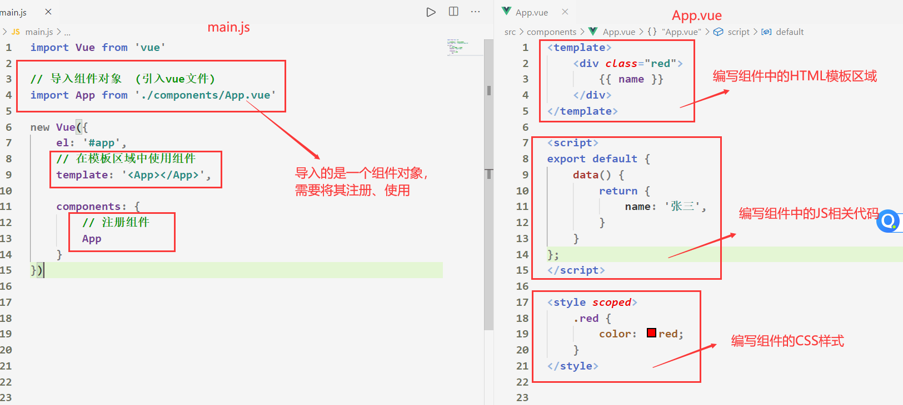

    

- `.vue`文件特点：①**完整语法高亮**   ②**ES6模块**   ③**组件作用域的 CSS**   ④**模板区域和数据实现分离**

    

- 注意：`webpack`无法解析加载`.vue`文件，需要使用`loader`插件对`vue`文件进行解析加载
  
  - 参考：`webpack => 使用loader => vue文件处理`
  
  ​      
  
- 如果不想在vscode中手动编写`vue`文件的初始化代码，那么可以***添加一个代码片段***
  
    - 参考：`vscode基本使用 => 配置Vue文件代码片段`


- 建议所有的`.vue`文件的命名方式：都是以**首字母大写**

    

- 在Vue单文件组件中，如果给style标签添加**scoped**属性，则表明当前组件**编写的CSS样式具有组件作用域**，CSS样式只对当前组件生效，与其他组件不冲突


## 1.2 插槽

### 1.2.1 为什么要使用插槽？

- 当我们使用其子组件时，我们往往都是通过`子组件标签`来展示`子组件内容`的。
    - 有时我们希望子组件里面能够给我们***预留一些空位***，以便**于父组件填充**，这样的子组件则更加灵活。
- **插槽可以使组件更具备扩展性**！

- Vue[插槽文档](https://cn.vuejs.org/v2/guide/components-slots.html#%E4%BD%9C%E7%94%A8%E5%9F%9F%E6%8F%92%E6%A7%BD)


### 1.2.2 插槽的基本使用

- 在子组件的模板区域中，使用特殊的元素`<slot>`就可以为子组件开启一个插槽。
    - 该`slot元素`中插入什么内容***取决于父组件如何使用***。
    - 子组件定义的`slot元素`最终都是被***父组件所替换掉***的！


1. 给子组件定义一个插槽：`slot`元素

2. 父组件在使用子组件时，***填充子组件的插槽***。在`子组件标签`中编写的HTML内容，会替换掉子组件的`slot`元素

3. 可以给`<slot>`中***设置默认要展示的内容***，如果父组件没有在子组件中插入任何内容，就默认显示该内容


### 1.2.3 具名插槽的使用

- 有时***子组件的插槽`slot元素`不止一个***，且每个插槽用于实现不同的功能。
    - 那么当父组件往`子组件标签`里填充内容时，如何替换**指定**的***`slot元素`？***
    - 这时候就要用到`具名插槽`


1. 给子组件中的插槽取一个名字。给插槽`solt元素`添加一个`name`属性

    


2. 父组件往`子组件标签`中填充内容时，可以**通过slot属性指定插槽的名字**来替换子组件中***指定的`slot元素`***。

    


- vue2.6起更新了具名插槽的用法

    - 在向`具名插槽`提供内容的时候，我们可以在`template`元素上使用 `v-slot` 指令，并以 `v-slot` 的参数的形式提供其名称：

    - 

        


### 1.2.4 作用域插槽的使用

- 有时父组件在往`子组件标签`中填充内容时，需要使用到**子组件中的数据**来进行展示
    - 这个时候就要用到`作用域插槽`


1. 子组件需要在`slot元素`上绑定一个`自定义属性`。该`自定义属性`就是传递给父组件的`变量`

2. 父组件在`子组件标签`中编写`template元素`，并为它添加`v-slot="slotProps"`属性
3. 此时子组件***传递的变量***就存放在`slotProps`身上了，父组件可以将其展示

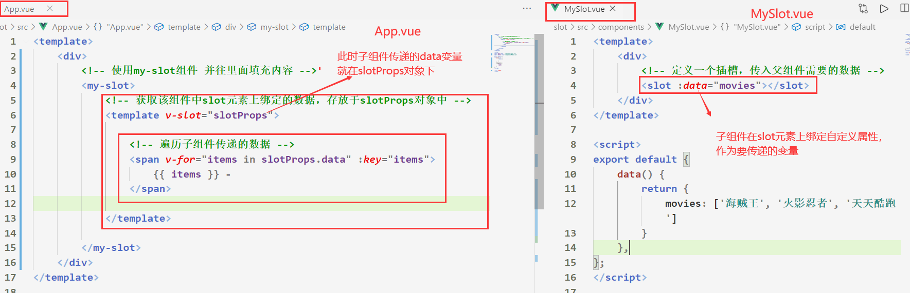


### 1.2.5 插槽封装技巧

- 使用插槽封装一些组件的目的是为了让这个组件更具备***扩展性***！其组件内填充的东西可以让***使用者来定义***

- 以封装`tab-bar`组件为例，下面总结封装该组件的***流程***

    1. 先编写好`tab-bar`组件的相关样式，以及html代码

        

2. 在`tab-bar`组件中，使用`slot元素`包裹住我们希望被***父组件替换掉的元素***

    


3. 父组件使用子组件时可以填充想要的内容

    


- 注：子组件定义的`slot元素`最终都是被***父组件所替换掉***的！！因此要注意***类名***不能添加到`slot元素上`。否则替换时，样式就不起效果了！


# 二、Vue Cli

## 2.1 Vue Cli 介绍 及 使用

### 2.1.1 Vue Cli的介绍

- 什么是`Vue Cli`？

    - `Vue CLI`是一个官方发布 vue.js 项目**脚手架**

    - 使用 `vue cli `可以**快速搭建Vue开发环境（项目目录结构）以及对应的webpack配置.**


- `Vue CLI ` 使用前的预备知识：
    - 要有`Node运行环境`，了解Node的第三方模块。参考：`Node => 第三方模块`
    - 全局安装`webpack`，了解`webpack`的相关配置。参考： `webpack`


- `Vue Cli`原理：
    - 基于`webpack`所搭建的项目，最好先去学习以下`webpack`


### 2.1.2 Vue Cli 的使用

- `Vue Cli`可以快速帮助我们搭建**Vue项目的目录结构**以及对应的`webpack`配置

- `Vue Cli`的使用
    1. 全局安装Vue脚手架：`npm i @vue/cli@3.2.1 -g`，这里全局安装的是`Vue Cli3`版本
    2. 现阶段我们不仅要看`Vue Cli3 `搭建的**项目结构**，也要看`Vue Cli2`所搭建的**项目结构**
        - 全局安装`npm i @vue/cli-init -g`：拉取`Vue Cli2`所搭建的项目结构模板


- `Vue CLI2`初始化项目
  
  - 在项目中执行`vue init webpack 项目名称`命令
  
  ​      
  
- `Vue CLI3`初始化项目
  
  - 在项目中执行`vue create 项目名称`命令
  
  ​      
  
- **项目名称统一英文小写**


## 2.2 Vue Cli2

### 2.2.1 初始化项目过程

- `Vue Cli2` 初始化项目***过程***，先执行`vue init webpack 项目名称`命令
    - 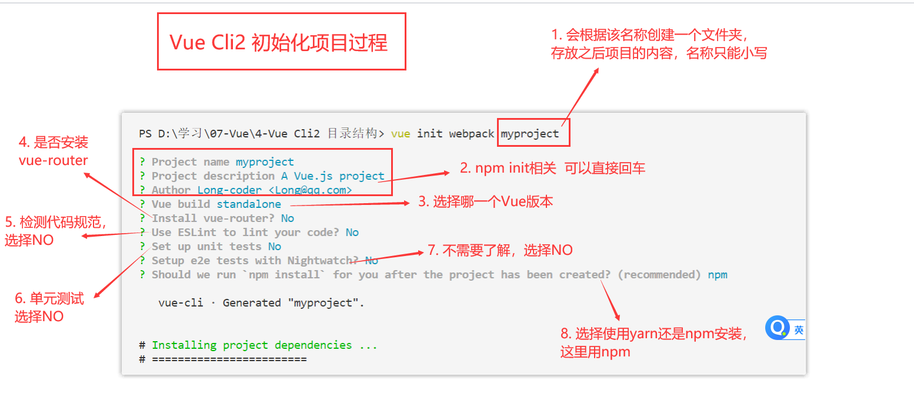


### 2.2.2 项目目录结构

- `Vue Cli2` ***目录结构详解***
    - 


- `package.json`的脚本命令
    - 


### 2.2.3 解决打包后页面空白

- 解决`Vue Cli2`打包项目后，打开`index.html`文件空白问题

    - 找到`build`文件夹，在`webpack.prod.conf.js` 第25行左右 有一个对象为 `output`,增加一个属性

    - ```js
        publicPath: './',
        ```

        


### 2.2.4 Vue版本的区别

- 在使用`Vue Cli2`初始化项目时，会发现他会要求我们选择一个***Vue版本***进行开发
    - 


- 下面我们来分析***Runtime-Compiler***和***Runtime-only***的区别

    - 

    - 我们会发现一个是使用`tamplate`替换`el`所挂载的区域，一个是使用`render`函数替换`el`挂载的区域

    - 参考：`Vue （一） => Vue的配置选项 => 选项 / DOM => tamplate或render `

        

- 简单总结：

    - 如果在入口JS文件中，你依然使用`template`来替换`el`所挂载的区域，就需要选择***Runtime-Compiler***版本

    - 如果在入口JS文件中，你使用的是`render`函数来替换`el`所挂载的区域，那么可以选择***Runtime-only***版本


- Runtime-Compiler版本**渲染页面过程**：
    - `template -> ast -> render -> vdom -> UI`

- Runtime-only 版本（1. 性能更高 2. 该版本的代码量少  推荐）
    - `render -> vdom -> UI`
    - 无法在入口JS文件中通过`template`替换`el`所挂载的区域


- Vue程序运行过程 （了解）
    - 


## 2.3 Vue Cli3

### 2.3.1 Vue Cli2和3的区别

- vue-cli 3 的设计原则是“0配置”，移除了配置文件`build`和`config`等目录
- vue-cli 3 提供了 vue ui 命令，提供了可视化配置，更加人性化
- 移除了`static`文件夹，新增了`public`文件夹，**并且index.html移动到public中**
- vue-cli2 的入口JS文件，使用的是`el`选项挂载模板区域，而vue-cli3中却是使用`$mount()`进行挂载
- vue-cli2在初始化项目时，可以让我们选择vue的版本，vue-cli3则是默认选择`Runtime-only`版本


### 2.3.2 初始化项目过程

- `Vue Cli3` 的初始化过程。 先执行`vue create 项目名称`命令
    - 


### 2.3.3 项目目录结构

- `Vue Cli3`目录结构详解
    - 


- `pakcage.json`中的脚本命令
  
    - 
    
    - 在`serve`属性中添加一个`--open`，执行npm run serve 命令后会自动打开项目页面


### 2.3.4 解决打包后页面空白

- 解决`Vue Cli3`打包后，页面空白问题

    - 在项目根目录下新建`vue.config.js`文件，然后写入如下配置

    - ```js
        module.exports = {
            publicPath: './'
        }
        ```

    - 重新打包即可正常显示页面了


### 2.3.5 Vue Cli3 的配置文件

- vue-cli3 将配置文件被隐藏起来的初衷：1. 为了不希望开发者随意的更改配置相关信息  2. 简化了项目目录结构

- 如果我们真的需要更改其`webpack`相关的配置文件，vue-cli3为我们提供了两个方案


- 方案一：在命令行中执行`vue ui`命令，会打开一个浏览器窗口，导入用`vue-cli3`所创建的项目
    - 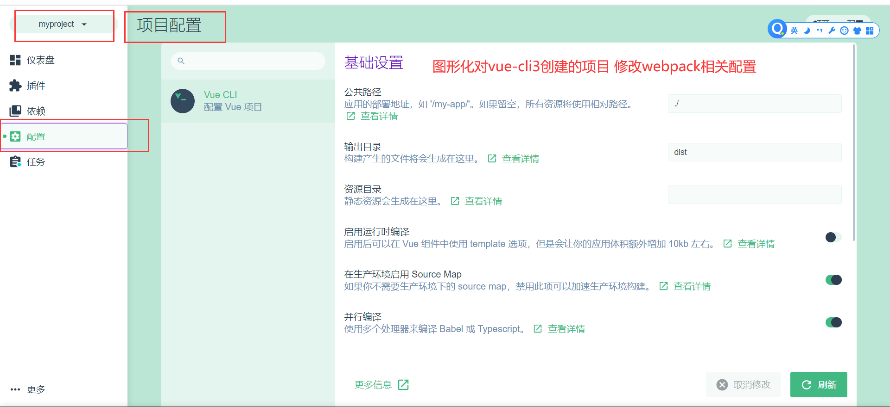


- 方案二：在项目的根目录下新建`vue.config.js`文件，在该文件下编写要修改的`webpack`相关配置
    - 


- 在`VUE-CLI3`中**配置路径别名**，要在`vue.config.js`中写入如下配置

    - ```js
        module.exports = {
            configureWebpack: {
                resolve: {
                    // 在HTML模板中使用`路径别名`引入文件时，需要在别名前在`~`符号
                    // 在JS中使用`路径别名`引入文件时，可以直接使用`路径别名`
                    alias: {
                        'src': '@',
                        'components': '@/components',
                        'content': 'components/content',
                        'common': 'components/common',
                        'assets': '@/assets',
                        'network': '@/network',
                        'views': '@/views',
                }
                }
            },
        }
        ```
        
        

- 在***HTML***模板中使用`路径别名`引入文件时，需要在***别名前***在`~`符号

    - ```html
        
        ```

- 在***JS***中使用`路径别名`引入文件时，可以直接使用`路径别名`

    - ```js
        import TabBar from '@/components/TabBar/TabBar'
        ```

        


### 2.3.6 Vue Cli3 解决跨域

1. 在`vue.config.js`中写入如下配置

    


2. 在发送网络请求时，通过`api`来代替**真实的接口地址**

    


>注：**vue.config.js**中解决的跨域仅在**npm run serve时有效**，当项目发布后则失效，**最好还是后端解决跨域问题**
>


# 三、Vue-Router

## 3.1 认识路由

### 3.1.1 什么是路由？

- `URL`的概述

    - `URL是统一资源定位符`，***是互联网上标准资源的地址***

    - 通过`URL`，我们可以访问其他计算机上的资源

        

- `URL`的组成

    - `传输协议://服务器IP或域名:端口/路由(路径)?地址栏参数(查询字符串)`

    - `https://www.baidu.com/index?name=张三&age=18`

    

    

- `路由`可以理解为用来跟后端服务器进行交互的***一种方式***，通过url中不同的路由部分，来请求不同的页面
    - 
    
    - 不同的url路径 对应着不同的页面，这种对应方式，我们也可以理解为路由


### 3.1.2 后端路由

- 早期的网站开发整个HTML页面是由***服务器来渲染***的。其交互过程是这样的

    1. 浏览器发出网络请求

    2. 服务器监听到80端口（或443）有请求过来，并解析url路径

    3. 拦截`url的路由部分`，给浏览器返回对应的数据（可以是 html 字串，也可以是 json 数据，图片等）

        

- 在之前通过`Node.js编写的所有页面`（博客项目），全是由后端路由渲染完成的

- 一个完整的HTML页面里包含了许多个小的页面，每个页面对应着不同的url地址，服务器会根据不同的url地址响应给浏览器不同的页面数据


- 后端路由的缺点:
    - 整个页面的模块由后端人员来编写和维护的


### 3.1.3 前后端分离阶段

- 随着Ajax的出现, 有了**前后端分离**的开发模式.

    - 后端只提供API来返回数据,，前端通过Ajax发送网络请求获取数据, 并且可以通过JS将数据渲染到页面中

    - 这样做最大的优点就是前后端责任的清晰, 后端专注于数据上, 前端专注于交互和可视化上.

    - 目前很多的网站依然采用这种模式开发.


- 在之前写的`Ajax`***相关案例***，都是采用前后端分离形式实现的。参考：`Ajax -> Ajax案例` 


### 3.1.4 SPA阶段

- SPA阶段：**单页面富应用阶段**

    - SPA最主要的特点就是在*前后端分离的基础上加了一层**前端路由**.*
    
        
    
- 在单页应用中, ***URL的改变会引起组件的改变***, 且**不与服务器有任何交互**
  
  
  
  ​      
  
- 之后通过`Vue.js + Vue-Router`开发的项目，都属于`SPA`页面


### 3.1.5 前端路由的核心

- 前端路由的核心：
    - 由浏览器拦截URL中路径的的变化，且URL的改变***不会向服务器发送请求***
    
    - 浏览器***解析URL的变化***，并且为其***渲染对应的组件***

    - 此时：URL中的路径和组件就***形成了映射关系***。这种关系我们可以称为前端路由
    
        
    
- 总结：前端路由本质上就是检测 url 的变化，截获 url 地址***阻止向服务器发生请求***，然后解析来**匹配路由规则**。
  
    - 参考文档：`https://www.zhihu.com/question/53064386`


### 3.1.6 前端路由的实现

  

- **前端路由一共有两种实现模式:**

    1. **hash 模式**

    2. **history 模式**

        

- 通过`location.hash`来改变url，但是页面不发生刷新

    - 就是类似于：`http://www.taobao.com#/foo`
    - 这种 `#`后面 hash 值的变化，并不会导致浏览器向服务器发出请求，每次 hash 值的变化，会触发 `hashchange` 事件，通过这个事件我们就可以知道 hash 值发生了哪些变化

    - 


- `history.pushState()`也可以实现修改url 页面不刷新。（有历史回退）
    - 

- `history.replaceState()`
    - 


- 在`vue-router`源码中，会自动监听`url中路由部分`的改变。当他改变时，会读取`vue-router`的配置文件，根据其`路由与组件的映射关系`，决定给浏览器渲染哪个组件


## 3.2 vue-router 基础

### 3.2.1 认识vue-router

- `vue-router`是Vue.js官方的路由插件，适合***用于构建单页面应用(SPA页面)***。
  
  - 学习文档： https://router.vuejs.org/zh/
  
      
  
- `vue-router`是基于**前端路由**和**组件**的

    - 在`vue-router`的单页面应用中，页面中**url的路由部分的改变就是组件的切换.**

    ​      

    

### 3.2.2 使用vue-router

- 之后的学习阶段中，我们都通过**Vue脚手架生成项目**，进行开发学习

1. 安装： `npm i vue-router`

2. 创建组件对象，为了与路由进行映射

    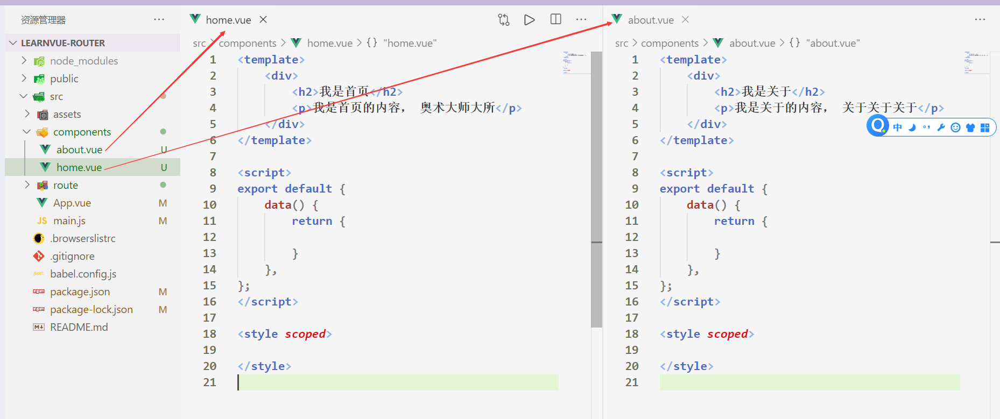

    

2. 在`src文件夹`下新建一个`router文件夹`，在`router文件夹下`新建一个`index.js文件`。**配置组件和路由的映射关系**

    


4. 将导出的`router`实例，挂载到入口JS文件中的**Vue实例选项**中

    


5. 在`App.vue`中创建可以修改当前页面URL的标签，用于渲染和路由对应的组件
    - `router-link`标签用于指定要跳转到的路由，`router-view`标签用于展示和当前路由匹配的组件。**二者缺一不可**


4. 最终效果如下，实现了根据不同路由，渲染不同组件的效果

    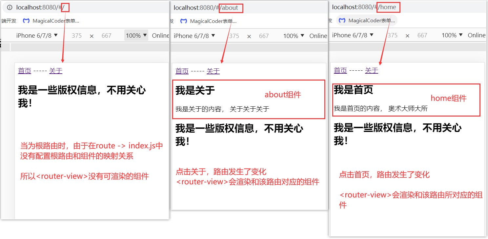

    

- 上图中可以看到`router-link`标签，实际上是修改了URL中hash的值，**这样修改URL不会让页面向服务器发送请求**。***实现了前端路由***


### 3.2.3 路由重定向和修改路径模式

- 可以为`根路由`重定向到`/home`路由下，这样页面就可以展示`/home`所***对应的组件***了
    - 


- **实现前端路由**的方式有两种：①修改URL的`hash`值   ②通过HTML5的`history`模式

    - `router-link`标签***默认***使用的是修改`hash`值的方式修改URL

    - 如果希望使用`history`模式，则要写入如下配置

        

>坑：使用 **history**打包的单页面应用，刷新页面后会根据**history**的路径**发送网络请求**，**会导致获取不到资源**
>
> 

- **因此推荐使用hash模式，兼容性更高**


### 3.2.4 router-link属性

- `router-link`标签主要用于修改URL，且修改URL后不会向服务器发送请求，该标签有如下***属性***

    - `to`：指定要跳转的路由。   `to='/home'`

    - `tag`：可以指定`router-link`标签之后渲染成什么标签。`tag='button'`：最终渲染成button标签

    - `replace`：不会留下历史记录，指定replace的情况下，***无法回退页面***。`replace`

    

- 如果当前页面的路由与`router-link`标签中`to`的值一样，那么当前的`router-link`元素为***活跃状态***。活跃状态下会自动添加一个`router-link-active`类名

    

    

    - 该class具体的名称也可以通过***router实例的属性进行修改*** 
    
        - ```js
            const router = new VueRouter({
                routes,
                mode: 'history',
                linkActiveClass: 'active'
        })
            ```
    
            

### 3.2.5 JS代码实现路由跳转

- 之前我们是通过`router-link`标签形式跳转路由的。有时我们希望跳转路由是通过JS代码手动进行跳转的，那么如何实现？
    - ```js
        this.$router.replace('要跳转的路由')
        this.$router.push('要跳转的路由')
        ```

    - `replace`无回退历史，`push`有回退历史

        

- 需要注意的是：如果通过***JS代码跳转路由***，那么不能重复跳转到同一个路由下，否则会报错
  
    - 


### 3.2.6 路由懒加载

- 每个路由对应着不同的组件，这些***与路由对应的组件最终会被打包到一个js文件***中
    - 如果多个组件放在一个js文件中， 必然会造成这个页面非常的大.

    - 当从服务器访问打包后的页面时，由于加载体积过大的JS文件。可能需要花费一定的时间, 甚至用户的电脑上还出现了短暂空白的情况.

        

- 路由懒加载做了什么？**项目性能优化**

    - 路由懒加载的主要作用就是将***路由对应的组件打包成一个个的js文件***

    - 懒加载：用到时再加载。只有在这个路由被访问到的时候，才会加载对应的组件(JS文件)
    - 使用路由懒加载，实际上就是**优化打包后的项目文件**


- 在配置***路由与组件的映射关系文件***中，引入组件对象的方式***统一采用路由懒加载形式***。这样可以***优化打包后的项目文件***


### 3.2.7 路由嵌套 

- 嵌套路由是一个很常见的功能

    - 比如在`home组件`中, 我们希望通过/home/news和/home/message访问一些内容。但是却又不想丢失`home组件`展示的页面，这就要**涉及到子级路由**

        

- 路由和组件的关系如下

    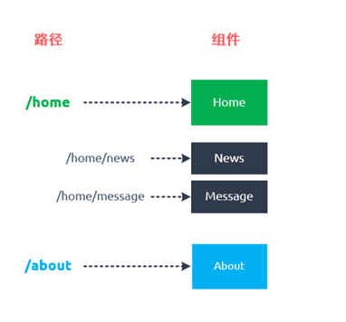

- 实现嵌套路由有两个步骤:

    - 创建对应的组件，并且在路由***映射中配置对应的子路由.***

    - 在组件内部使用< router-view >标签.


1. 


​														


- 注：**以 `/` 开头的嵌套路径会被当作根路径**，因此在配置或使用子路由时，不能加`/`


## 3.3 前端路由传递参数

### 3.3.1 传递参数的概述

- **前端路由中传递参数**的使用场景：

    - 当路由发生改变时会渲染对应的组件到页面中。我们希望路由发生改变时，会携带一些参数，而该路由所对应的**组件可以获取到这些参数**，来决定展示哪些数据。

    - 这种需求就需要用到`前端路由传递参数`技术

        

- 前端路由`传递参数`的形式有两种，分别是`路由参数`和`查询字符串参数`。

    - 

    

    

    

### 3.3.2 前端路由参数的传递和获取

***传递***`路由参数`

1. 配置路由和组件映射关系。路由格式如下：

    - ```js
        {
          // 匹配带有路由参数的路由
          path: '/user/:userID',
          component: User
        },
        ```

2. 通过`router-link`标签跳转路由，并且***携带路由参数***。PS：`不要忘了添加<router-view>标签展示组件噢`

    - ```html
        <!-- 跳转路由时，携带路由参数  写法1 -->
        <router-link to="/user/kobe" >用户</router-link>
        
        <!-- 写法2 等价于上面写法 -->
        <router-link :to="{path: '/user/kobe'}" >用户</router-link>
        ```

    - 生成的URL：`http://localhost:8080/user/kobe`

        

***获取***`路由参数`

1. 可以在组件中通过`this.$route.params.xxx`获取到传递过来的`路由参数`

    - ```html
        <!-- User组件 -->
        <h2>尊贵的{{ $route.params.userID }}用户，你好</h2>
        ```

    - `xxx`是配置路由格式时，指定的路由参数变量名

    

    

### 3.3.3 地址栏参数的传递和获取

***传递***`地址栏参数`

1. 配置路由和组件映射关系。路由格式和普通配置一样

    - ```js
        {
          // 接收传递的查询字符串参数
          path: '/user',
          component: User
        }
        ```

2. 通过`router-link`标签跳转路由，并且***携带地址栏参数***。PS：`不要忘了添加<router-view>标签展示组件噢`

    - ```html
        <!-- 跳转路由时，传递查询字符串参数 写法1 -->
        <router-link to="/user?name=kobe&age=32" >用户</router-link>
        
        <!-- 写法2 等价于上面写法 -->
        <router-link :to="{path: '/user', query: {nakome: 'kobe', age: 32}}" >用户</router-link>
        ```

    - 生成的URL：`http://localhost:8080/user?name=kobe&age=32`

        

***获取***`地址栏参数`

1. 在组件中通过`this.$route.query.xxx`获取到传递过来的`地址栏参数`

    - ```html
        <h2>尊贵的{{ $route.query.name }}用户，你好</h2>
        <h2>{{ $route.query.age }}</h2>
        ```

    - `xxx`是查询字符串参数中的***属性名***


### 3.3.4 通过JS传递参数

- ***传递***`查询字符串参数`

    - ```js
        // 跳转到/user路由下 并携带查询字符串参数
        this.$router.push({
            path: '/user',  // 要跳转到的路由
            query: {name: 'sb', age: 33}  // 要携带的地址栏参数
        })
        
        // 生成的URL:http://localhost:8080/user?name=sb&age=33
        ```

        

- ***传递***`路由参数`

    - ```js
        // 跳转到/user路由下 并携带路由参数
        this.$router.push({
            path: '/user/kobe',  // 要跳转到的路由以及携带的路由参数
        })
        
        // 生成的URL:http://localhost:8080/user/kobe
        ```

        

- 需要注意的是：如果通过***JS代码跳转路由***，不能重复跳转到同一个路由下，否则会报错

    - ```js
        let path = window.location.pathname
        if(path === '/user') {  // 判断当前页面的路由与要跳转的路由是否一致
          // ....
        }
        ```

        
        
        

### 3.3.5 $router 与 $route

- `$router`
  
    - `$router`为***VueRouter***实例，想要导航到不同的URL，则使用`$router.push`方法
    - **每个组件都是继承于Vue实例的原型**。组件中的`this.$router`实际上指向就是***入口JS文件***中导入的`router`***实例***。
    
    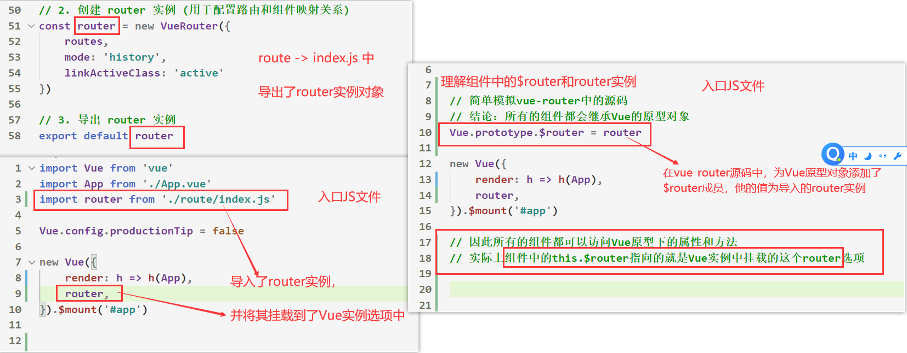


- `$route`

    - 每一个路由与组件的映射关系，我们可以看做是一个***路由对象***
    - 在使用了` vue-router `的应用中，路由对象会被注入到每个组件中，赋值为` this.$route` ，并且当**路由切换时，路由对象会被更新。**
    - `$route`为**当前活跃的路由对象**。他可以获取当前`URL`中的`路由参数`、`查询字符串参数`等

    


## 3.4 导航守卫

### 3.4.1 什么是导航守卫？

- `vue-router`提供的**导航守卫**主要用来监听***路由的进入和离开的。***类似于`express`里的`中间件`

- 导航守卫又分为三种类型：

    - 全局守卫：监听`所有的路由`的进入和离开

    - 路由独享守卫：监听`当前的路由`的进入和离开

    - 组件守卫：监听`组件对应的路由`的进入和离开

        

- 所有在`进入路由前`触发的回调函数，都要调用`next()`方法，将拦截到的路由进行放行，匹配下一个中间件


### 3.4.2 全局守卫

- 当有路由发生变化时，***全局守卫会最先对该路由进行拦截***
- 全局守卫提供了`beforeEach`和`afterEach`的回调函数
    - 它们会在路由即将改变前和改变后触发.


- `router.beforeEach((to, from, next) => {})`：在***进入路由前***触发

    - `to`：即将要进入的路由对象
    - `from`：当前正准备要离开的路由对象
    - `next()`：将这次所拦截的路由放行，让该路由进行匹配。也可以传入一个路由参数，用于跳转指定的路由

    


- `router.afterEach((to, from) => {}`：在进***入路由后***触发
    - 没有`next`参数


### 3.4.3 路由独享守卫

- `路由独享守卫`只会监听`当前路由`的进入和离开

- 路由配置上直接定义 `beforeEnter` 守卫：

    - ```js
        {
            path: '/foo',
            component: Foo,
            // 只有在进入 /foo 路由之前 才会触发的回调函数
            beforeEnter: (to, from, next) => {
            		// ...
              	next()
            }
        }
        ```

        


### 3.4.4 组件守卫

- 组件守卫只会监听`当前组件对应的路由`的进入和离开。
    - 如果没有匹配**组件和路由的映射关系**，那么组件守卫无效


## 3.5 理解 keep-alive


### 3.5.1 实例/组件的诞生与销毁

- 有一个`Help.vue`组件，他所对应的路由是`/help`，我们可以通过路由的跳转，看看一个组件实例是如何`诞生`与`销毁`的。

    

    

    - 每当进入到`/home`路由时，`Help.vue`组件就会重新被`创建`渲染，每当离开`/home`路由时，`Help.vue`组件就会被`销毁`

        

- 我们可以得出结论：

    - `<router-view>`标签用于**切换与当前路由匹配的组件**
    - 当组件被渲染到DOM上(body标签中)即为`创建`状态
    - 当组件从DOM中被移除了，则该组件为`销毁`状态。销毁后组件对象里所有的***数据都将清空***


- 有时我们并不想让一个组件由于路由跳转的原因，频繁的`创建`和`销毁`。

    1. 比如在`Help.vue`中，我们添加了一个计时器效果

    2. 但是因为路由跳转了，`<router-view>`切换了其他组件渲染到DOM中。

    3. 因为`Help.vue`组件被销毁了，原有的数据将被清空。在再次创建该组件时，计时器是从0开始的

    4. 我们希望即使路由发生了跳转，**组件也不会被重新销毁和创建**，而是保存原有的状态。如何做到？


###3.5.2  认识 keep-alive

- `keep-alive`是Vue的**内置组件**，能在组件切换过程中将状态保留在内存中，***防止重复渲染DOM***。

- `router-view` 也是一个组件，如果直接被包在 `keep-alive `里面，所有路由匹配到的视图***组件***都会被`缓存`，不会被频繁的`销毁`和`创建`。所以数据也不会被清空

    - ```html
        <keep-alive>
            <!-- 所有与路由匹配的相关组件都会被缓存，不会被频繁销毁和创建 ！ -->
            <router-view></router-view>
        </keep-alive>
        ```

    - 可以通过`created`和`destoryed`函数来检测是否会被频繁的销毁和创建


### 3.5.3 keep-alive 对应的钩子函数

- `keep-alive`中包裹的`组件`有着其对应的**生命周期函数**，用于***监听被缓存的组件是否处于活跃和非活跃状态***

- 注意：只有当组件被包裹在` <keep-alive>` 内，才会有`activated `和` deactivated` 这两个钩子函数

    

- ***activated***

    - **类型**：`Function`

    - **详细**：

        - 被 `keep-alive` 缓存的组件激活(处于`活跃`)时调用，也可以理解为进入**与当前路由匹配的组件**时调用

        

- ***deactivated***
    - **类型**：`Function`
    - **详细**：
        - 被 `keep-alive` 缓存的组件`非活跃`时调用，也可以理解为离**开当前路由切换组件**时调用。
        - `deactivated`函数里面可以用于存储组件离开前的一些状态和数据

    

### 3.5.4 keep-alive 属性

- `include`：字符串或正则表达式。***只有匹配的组件会被缓存***。
- `exclude`：字符串或正则表达式。***任何匹配的组件都不会被缓存***。

- ```html
    <keep-alive exclude="about,user">
        <!-- 除了name为about和user的组件，其他所有与路由匹配的相关组件都会被缓存 -->
        <router-view></router-view>
    </keep-alive>
    
    <keep-alive include="about">
        <!-- 只缓存name为about的组件 -->
        <router-view></router-view>
    </keep-alive>
    ```

    

- 注意：如果需要指定哪些组件被缓存，那么必须为该组件添加一个`name选项`

    

    


## 3.6 封装TabBar


### 3.6.1 TabBar的外观

- 如果在页面下方有一个单独的TabBar(选项卡)组件，你如何封装？

    

    

    

### 3.6.2 TabBar的实现步骤

1. 在`src`文件夹中创建***目录结构***

    

2. 自定义TabBar组件，在APP组件中使用


3. 让TabBar组件处于底部，并且设置相关的样式

    

    

4. 传入 高亮图片，定义一个变量isActive，通过v-show来决定是否显示对应的图片

5. TabBarItem绑定路由数据，完成router/index.js的内容，以及创建对应的组件

6. APP组件中加入`< router-view >`组件

7. 点击item跳转到对应路由，并且动态决定`currentLink`

8. 监听item的点击，通过this.$router.replace()跳转路由


- ***代码实现***：


# 四、Vuex


## 4.1 认识Vuex

### 4.1.1 什么是Vuex？

- `Vuex`是一个**状态管理模式**。
- 他可以将多个组件间***需要共享的数据(状态)***，保存在一个容器中(store)。
  
- 每个组件可以直接***获取***和***修改***这些**共享的数据**(状态)
    - Vuex 的**状态存储是响应式**的，若 容器(store) 中的**数据发生变化**，则会**重新渲染对应页面视图**


- 有哪些数据需要在多个组件间共享？
  
  - 用户登录状态、用户名称、头像等等
  
  ​      
  
- `Vuex`学习文档：https://vuex.vuejs.org/zh/guide/actions.html


### 4.1.2 单组件状态管理

- 在单个组件中进行状态管理是一件非常简单的事情

- 每个组件有属于自己的数据(data)、行为(methods)、视图(html模板)
    - data往往是通过methods进行改变，data改变后其组件的视图也会发生更新


- 可以通过`计时器案例`加深对这张图的理解


### 4.1.3 多组件状态管理

- 多页面状态管理核心：多个视图都依赖**同一个状态(数据)**（一个状态改了，多个界面需要进行更新）
  
- Vuex就是为我们提供***存储多个共享状态***的工具。
  
  ​      
  
- 全局单例模式（大管家）

    - 我们现在要做的就是将共享的状态抽取出来，交给Vuex统一进行管理。

    - 之后每个组件，按照Vuex制定的规范，进行访问和修改等操作。

    - 这就是Vuex背后的基本思想。


- `Vuex`状态管理图例


### 4.1.4 Vuex的基本使用

1. 通过`vue-cli`搭建项目时，选择`vuex`包，或者自己手动下载`vuex包`

2. 在`src`目录下，新建一个`store`文件夹，里面新建一个`index.js`文件，用于存放`Vuex`相关代码

    


3. 编写`Vuex`相关代码

    


4. 在项目的入口JS文件中，导入Vuex实例，并写入Vue的配置选项中

    
    
    - 将`Vuex`实例挂载到`Vue`的配置选项上时，其他所有组件的`$store`其实就是入口JS文件中导入的`store`
    
        
    
        

- 在其他组件中，可以通过`this.$store`的方式，获取到这个***store对象***了

    
    
    - 上图中methods下的方法的`return`可以去掉
    
    
    
- 注意事项：`Vuex`并**不允许直接在组件中改变共享的数据**，而是要通过`提交mutation`的方式来修改共享的数据

    - 只有这样，谷歌浏览器插件`Vue.js devtools`才能够实时记录共享数据的改变

        

    

    

## 4.2 Vue核心概念

- `Vuex`有几个比较核心的概念，而这几个**核心概念**正是创建`Vuex`实例时，所要传入的***配置对象***

    - ```js
        // 创建Vuex实例
        const store = new Vuex.Store({
            state: {},
        		getters: {},
            mutations: {},
            actions: {},
            modules: {}
        })
        ```

        

### 4.2.1 State

- **类型**：`Object`

- 详细：

    - 用于定义`Vuex`中一些**共享的状态(数据)**，其他组件可以通过`this.$store.state.xxx`来获取共享的数据

- 示例：

    - ```js
        const store = new Vuex.Store({
            state: {
                count: 0
            }
        }
        // 其他组件可以访问this.$store.state.count数据
        ```

        


### 4.2.2 Getters

>与组件中的getters一样，**当函数体的内部数据发生变化时，会自动调用其函数**
>

- **类型**：`{ [key: string]: Function }`

- 详细：

    - `Getters`类似于组件的**计算属性**，用于对`state`中的数据进行**加工过滤操作**，所有组件都可以通过`this.$store.getters.xxx`访问getters下所有定义的属性

        

- `Getters`中的内部方法可以接受**两个参数**

    - 第一个参数为`state`，可以直接通过`state.xxx`获取定义在`state`下的属性

    - 第二个参数为`getters`，可以通过`getters.xxx`获取定义在`getters`下的属性
    
    - `Getters`中的内部方法，必须要有`返回值`
    
    - 虽然`Getters`内部是写的方法，但是`Vuex`会将他内部的方法解析为`store.getters`下的***属性***
      
        

​    


- 示例：

    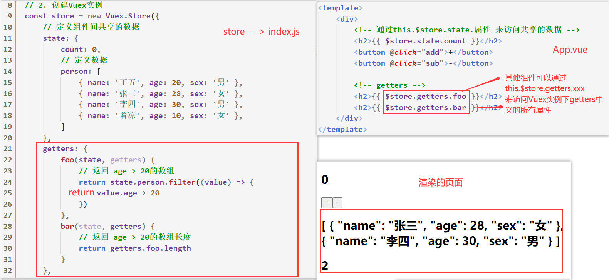

    


- 如果希望`getters`下定义的方法能够***接受参数***，则要使用如下写法

    


#### 辅助函数

- `mapGetters` 辅助函数仅仅是将 ***store 中的 getter 映射到组件的计算属性中***

    

    
    
    - 上图代码中，将**Vuex -> getters -> cartLength** 计算属性**映射**为组件中的  **this.cartLength**


- 如果你想将一个 getter 属性另取一个名字，使用**对象形式**：

    - ```js
        ...mapGetters({
          // 把 `this.doneCount` 映射为 `this.$store.getters.doneTodosCount`
          doneCount: 'doneTodosCount'
        })
        ```

        

- 除了`mapGetters`辅助函数，Vuex还提供了`mapActions`、`mapState`辅助函数，用法一致，都是采用**映射原理**！


### 4.2.3 Mutations

#### 1. mutations基本使用

- **类型**：`{ [key: string]: Function }`

- 详细：

    - `mutations`里主要定义一些方法，用于***修改Vuex中store状态(数据)***。

    - `mutations`中的内部方法会接受`state` 作为第一个参数，可以通过`state.xxx`获取***store数据***

    - 当其他组件想要修改***修改Vuex中store状态(数据)***时
        - ***Vuex不允许在组件中直接调用`this.$store.mutations.xxx()`方式来修改store状态***
        - 必须通过`this.$store.commit('mutations下的方法名', 要传递的参数)`来执行mutations下对应的方法修改数据


- 示例：

    

    - 上图中methods下的`return`可以去掉


#### 2. mutations其他提交方式

- 提交`mutations`的另外一种风格
  
    - 除了`this.$store.commit('xxx')`可以提交mutations之外，Vuex还为我们提供了另外一种提交方式
    
    
    
    - 这种提交风格**比较少用**


#### 3. mutations响应规则

- 当我们使用`mutations`更新store中的数据时，必须遵守`Vuex`对应的一些规范

- `mutations`更新数据**规范**
1. 最好***提前***在你的 **store --> state 中初始化好所有所需属性**
  
2. 当需要在对象上***添加新属性***时，应该使用`Vue.set(obj, 'newProp', value)`方式更新数据


#### 4. mutations常量（了解）

- 当`mutations`中方法过多时， 使用者需要花费大量的经历去记住这些方法名，甚至是多个文件间来回切换, 查看方法名称
- `Vuex`允许我们可以创建一个文件: `mutation-types.js`，并且在其中定义`mutations`中方法名的常量，然后将其导出

- 导入定义的常量时, 我们可以使用ES2015中的风格，使用一个常量来作为函数的名称

    

- ***mutation-types.js***

    - ```js
        export const SOME_MUTATION = 'SOME_MUTATION'
        ```

- ***store.js***
    - ```js
        import Vuex from 'vuex'
        import { SOME_MUTATION } from './mutation-types'
        
        const store = new Vuex.Store({
          state: { ... },
          mutations: {
            // 我们可以使用 ES2015 风格的命名功能来使用一个常量作为函数名
            [SOME_MUTATION] (state) {
              // ...
            }
          }
        })
        ```

- ***App.vue***

    - ```js
        import * as type from './store/mutation-types'
        export default {
            methods: {
                add(number) {
                    this.$store.commit(type.SOME_MUTATION)
                }
            }
        }
        ```

        

- Vuex官网说道：
    - 用不用常量取决于你
    - 但是在需要***多人协作的大型项目中***，这会很有帮助。但如果你不喜欢，你完全可以不这样做。


#### 5. mutations必须是同步函数

- Vuex要求我们Mutation中的方法必须是***同步方法***.
    - 如果Mutations中的方式是一个异步操作，则在***Vue devtools***中将会无法记录到更新后的状态


- 上图中你会发现state中的count数据一直没有被改变，因为vue devtools无法追踪到

- **So,** ***不要再mutation中进行异步的操作***


### 4.2.4 Actions

#### 1. actions的理解

- Action 类似于 mutation，不同在于：
  
  - **Action 提交的是 mutation**，***而不是直接变更状态***。Action 可以包含任意异步操作
  
- 先回顾一下`Vuex`的状态管理图

    

    

- `Vuex`**不允许**我们在mutations中进行异步操作，**允许**我们将***异步相关操作写在actions***中

    

- 但是！***直接修改数据***的操作还是要在mutations中定义，实际上**actions中只是存放异步操作**，并且在异步操作中通过`commit`方式提交mutations，完成异步操作数据的更新

    

- 说起来有点难以理解，接下来我们看代码的展示！


#### 2. actions的基本使用

- **类型**：`{ [key: string]: Function }`

- 详细：

    - `actions`里主要定义一些方法，用于存放***异步相关操作***

    - `actions`中的内部方法会接受`context` 作为第一个参数。`context`是和**store**对象***具有相同方法和属性的对象***。

        - 因此你可以调用 `context.commit` 提交一个 mutation，或者通过 `context.state` 和 `context.getters` 来获取 state 和 getters

        - 当我们在之后介绍到 [Modules](https://vuex.vuejs.org/zh/guide/modules.html) 时，你就知道 context 对象为什么不是 store 实例本身了

            

    - 组件中可以通过`this.$store.dispatch('actions下的方法名')`，**执行对应的actions方法**

        

- 示例：

    


#### 3. actions传参

- 组件在调用actions中的方法时，同样支持***传递参数***

    

    


#### 4. 解构context形参

- 我们会经常用到 ES2015 的 [参数解构](https://github.com/lukehoban/es6features#destructuring) 来简化代码（特别是我们需要调用 `commit` 很多次的时候）：

    - ```js
        actions: {
          adelay({ commit, getters, state }, payload) {
            setTimeout(() => {
              commit('delay', payload)
            }, 2000);
          }
        },
        ```

        

#### 5. actions返回Promise

- 当我们通过actions执行异步操作时，我们希望能够知道这个异步操作什么时候结束。

- 首先，你需要明白 `store.dispatch('xxx')`，将会调用actions下的处理函数，因此我们可以让其处理函数返回一个`Promise实例`

- 在Action中, 我们可以将异步操作放在一个Promise中, 并且调用对应的resolve或reject

    

    


### 4.2.5 Module (了解)

#### 1. 认识Module

- `Vuex`允许我们**将store分割成模块**, 而每个模块拥有自己的state、mutations、actions、getters等
- **每个模块拥有自己的局部状态(数据)**。与store定义的全局状态(数据)不会冲突


#### 2. 模块命名空间

- 默认情况下，**模块内部的 action、mutation 和 getter 是注册在store下的**
  
  - 这意味着模块内部的方法名与store中的方法名不能冲突
    
    
  
- 你可以通过添加 `namespaced: true` 属性的方式使其成为带命名空间的模块。开启命名空间后，组件需要通过***特定的语法***去访问mutations、actions、以及getters

    - 组件访问模块的***state***：`this.$store.模块.属性名`

    - 组件访问模块的***getters***：`this.$store.getters['模块名/属性名']`

    - 组件提交模块的***mutations***：`this.$store.commit('模块名/方法名')`

    - 组件提交模块的***actions***：`this.$store.dispatch('模块名/方法名')`

        


#### 3. 模块的局部状态

- 对于模块内部的 mutations 和 getters，接收的第一个参数是**模块的局部状态对象**。

- 对于模块内部的 actions，局部状态通过 `context.state` 暴露出来，全局状态则为 `context.rootState`，对于模块内部的 getter，全局状态会作为第三个参数暴露出来

    - ```js
        const moduleA = {
          actions: {
            add ({ state, commit, rootState }) {
              	// 这里的state为局部状态，rootState为全局状态
                commit('increment')
            },
          getters: {
            moduleAbar(state, getters, rootState) {
                // 这里的 `state`是模块的局部状态 `rootState`是全局状态
                return state.name + 111
              }
            },
          }
        }
        ```

        


## 4.3 Vuex项目结构划分

- Vuex的相关代码我们都是存放在`store`文件夹下的`index.js`中
- 当`index.js`文件代码量太多时，只需将 actions、mutations 和 getters 分割到单独的JS文件。并用模块化导入到`index.js`中，这样的代码更好维护


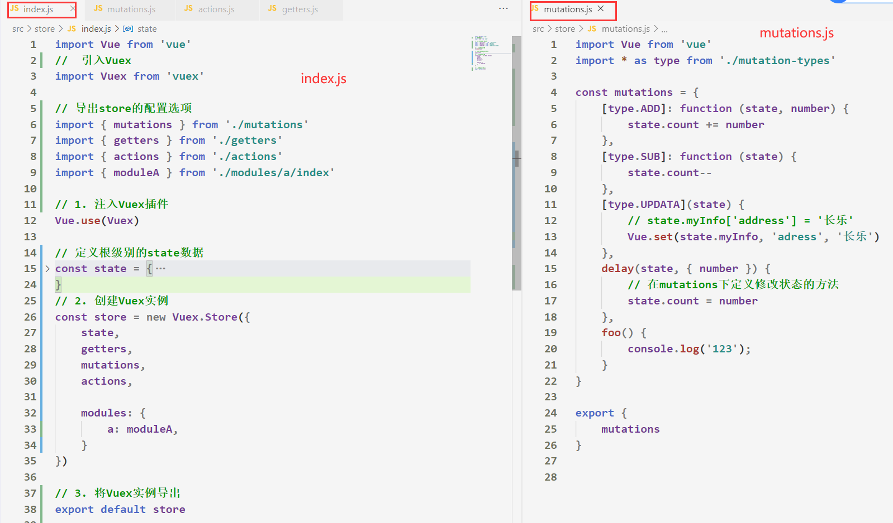


## 4.4 vuex数据改变，页面不渲染

- 如果将`vuex`中的数据赋值到**组件**的`data`下，当后续`vuex`中状态发生改变，并不会再次赋值给到`data`下，除非页面刷新重新加载，组件生命周期重新开始，才能拿到最新的值

    >注：**组件中的data**只有在**组件渲染**时才会被执行
    >


- 解决方案：
    - 在组件的**HTML模板**中直接使用`$store.state.xxx`，这样就能**随时拿到最新的状态值了**


# 细节补充

## 1. 回顾Vue生命周期

- ***Vue/组件 实例***从创`建到销毁的过程`，就是生命周期。在这个过程中Vue内部会自动调用一些叫做**生命周期的钩子函数**。

    

- 问：组件/Vue实例什么时候被`创建`，什么时候被`销毁`？

  - 当组件渲染到DOM(body标签)上的过程，我们可以叫做创建的过程，**刷新页面也是重新创建组件**
  
  - 当组件从DOM上移除的时候，那么该组件就是被销毁了


## 2. vue-router内置组件

- `<router-link>和<router-view>`分别为**vue-router**中注册的***全局组件***
- `<router-link>`：最终会被渲染成a标签，他的to属性用于跳转到指定的路由
- `<router-view>`：用于切换和**当前路由匹配的组件**


## 3. Vue-Router项目

- 使用`vue-router`开发的项目，通过`webpack`打包后，**其打包后的文件必须放在服务端上才能够运行**！
- 我们可以用Node中的express框架开发一个本地服务器，并打包后的文件作为`静态资源文件`进行配置。通过访问ip地址形式，检测项目是否可以正常运行


- 如果希望直接运行`dist -> index.html`文件
    1. 前端路由模式修改为 **history**
    2. ***vue.config.js***中设置：`publicPath: './'`


## 4. 触发子组件事件

- 父组件在使用子组件时，往往是以***标签名形式***进行使用

    - ```html
        <template>
            <div>
            		// 在父组件的模板区域中使用子组件
                <cpn></cpn>
            </div>
        </template>
        ```

        

-  在父组件的模板区域内，任何元素都可以使用Vue的指令：`v-if`、`v-for`、`v-show`等等

- 子组件标签也能够使用这些`指令`，直接在子组件标签中使用这些指令，***相当于在子组件内部模板区域的根元素中使用这些指令***

    - ```html
        <cpn @click.native="foo" v-show="false" :class="'aaa'"></cpn>
        ```

    - 上图代码可以相当于在**子组件模板区域内的根元素**中使用这些`指令`

    - 因此也可以在父组件中来控制子组件是否展示到页面中

        

- 如果要**监听子组件根元素的事件**，必须要添加`.native`修饰符，否则不起效果


## 5. Vue-Cli 配置文件

- 当我们修改了`Vue-Cli`中的配置文件时，热更新并不会重新解析配置文件
    - 必须要重新进行一次`npm run serve`才行


## 6. 中央事件总线的使用

- 在访问非父子组件时，除了可以通过**Vuex**进行访问，还可以通过Vue提供的**中央事件总线**来进行**访问非父子组件**

- ***中央事件总线的基本使用***

1. 在**Vue实例下**的原型对象中添加**$bus**

    - ```js
        // 添加事件总线
        Vue.prototype.$bus = new Vue()
        ```

        

2. **组件**可以通过`this.$bus.$emit('事件名', 传递的参数)`**发射中央事件**

    - ```js
        // 发射了一个名为'checked'的中央事件总线并且携带了参数
        this.$bus.$emit('checked', result)
        ```

        

3. **其他组件**可以在`mounted`生命周期函数中通过`this.$bus.$on('监听的事件名', callback)`监听**中央事件总线**

    - ```js
        mounted() {
            // 监听checked中央事件总线
            this.$bus.$on('checked', result => {
            		result ? this.active = true : this.active = false
            })
        },
        ```

        


## 7. Vue的风格指南


- Vue官网为我们提供了一些语法和命名规范上的一些要求：https://cn.vuejs.org/v2/style-guide

- 其他规范要求：https://www.jianshu.com/p/3ee284c64028

1. `props`最好以对象形式
2. 必须用 `key` 配合 `v-for`

3. 永远不要把 `v-if` 和 `v-for` 同时用在同一个元素上。

4. [为组件样式设置作用域](https://cn.vuejs.org/v2/style-guide/#为组件样式设置作用域必要)

3. 永远不要把 `v-if` 和 `v-for` 同时用在同一个元素上。

4. 在单文件组件中为组件样式设置私有作用域 --- scoped

5. 单文件组件名最好以大驼峰命名规范

6. 在单文件组件中，可以使用***自闭合标签***，但是在DOM中千万别这么做！！

    - ```html
        <!-- 在单文件组件、字符串模板和 JSX 中 -->
        <MyComponent />
        ```


## 8. CSS样式穿透


- 上图代码中 父组件是否能够成功修改 子组件下的按钮样式呢？

    - 答案是**父组件无法直接修改子组件下的元素的相关样式**，因为vue组件编译后，会将 template 中的每个元素加入 [data-v-xxxx] 属性来确保 **style scoped** 仅本组件的元素而不会污染全局

        

- 因此 **父组件最终的css**编译出来是这样的

    - ```css
        .son[data-v-6142968a] .son-btn[data-v-6142968a]
        ```

    - 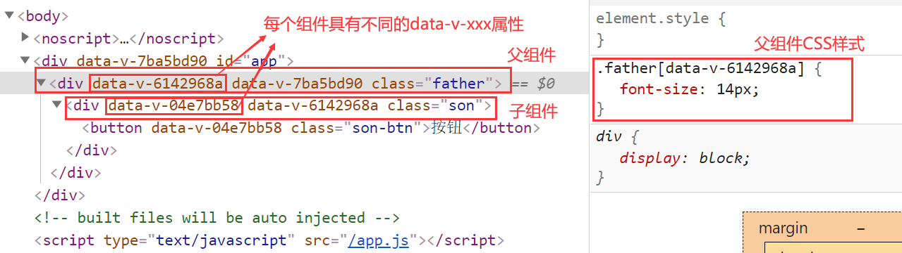


- 父组件如果想要更改**子组件下特定元素的样式**，可以使用**深度作用选择器**

    - ```css
        .son >>> .son-btn { CSS样式 }
        ```

    - 


## 9. Vue项目中引入css样式

- 方案一：

    - 在**main.js**中 通过导入方式，**引入全局CSS样式**

    - ```js
        import "./styles/global.scss";
        ```

        

- 方案二：在**App.vue中 的style**标签中，**引入全局样式**

    - ```css
        <style>
        		@import url("../test.css");
        </style>
        ```

        

>坑：**@import**引入css导致**全局作用域**，如果在组件中需要将抽离的css样式引入，需要采用如下写法
>
>


- 也可以在`.vue` 文件中的`script`标签中 通过`import`来导入css样式

    


## 10. 解决路由跳转重复问题

- 在`vue-router`中当通过**编程式导航**跳转路由时，如果重复跳转同一个路由就会报错，如果每次跳转路由都要判断跳转的路由与当前路由是否相同，那么必然会很麻烦

- 优雅解决方式：在**router --> index.js** 中写入如下代码

    - ```js
        import Vue from 'vue'
        import VueRouter from 'vue-router'
        Vue.use(VueRouter)
        
        const originalPush = VueRouter.prototype.push
        VueRouter.prototype.push = function push(location) {
        	return originalPush.call(this, location).catch(err => err)
        }
        ```

        

>注：`push`可以修改为`replace`,具体看**前端路由跳转**的方式
>


## 11. Vue项目常见报错问题

- `Cannot read property 'xxx' of null"`
    - 原因：
        - 在发送网络请求**获取后台接口数据**时，该步骤是**异步**的，而vue组件会**提前解析**`HTML模板`
        - 第一次解析`HTML模板`时如果没有数据，那么就会报一些的错误
        - 即使数据能够渲染出来，那也是第二次`HTML模板`解析后渲染出来的，**控制台依然会有之前的错误**
        - 如果数据是`obj`，那么 `obj.xxx.xxx`就会报错
        - 如果数据是`arr`，那么`arr[0].xxx`就会报错
    - 解决：
        - 方案一：通过`v-if` 判断 `obj.xxx`是否在值，在决定解析`HTML模板`
        - 方案二：使用`&&`运算符号


