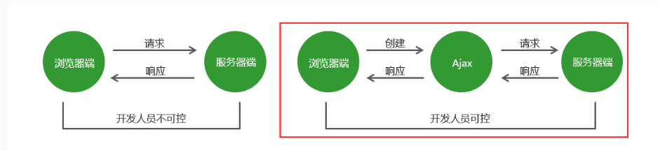
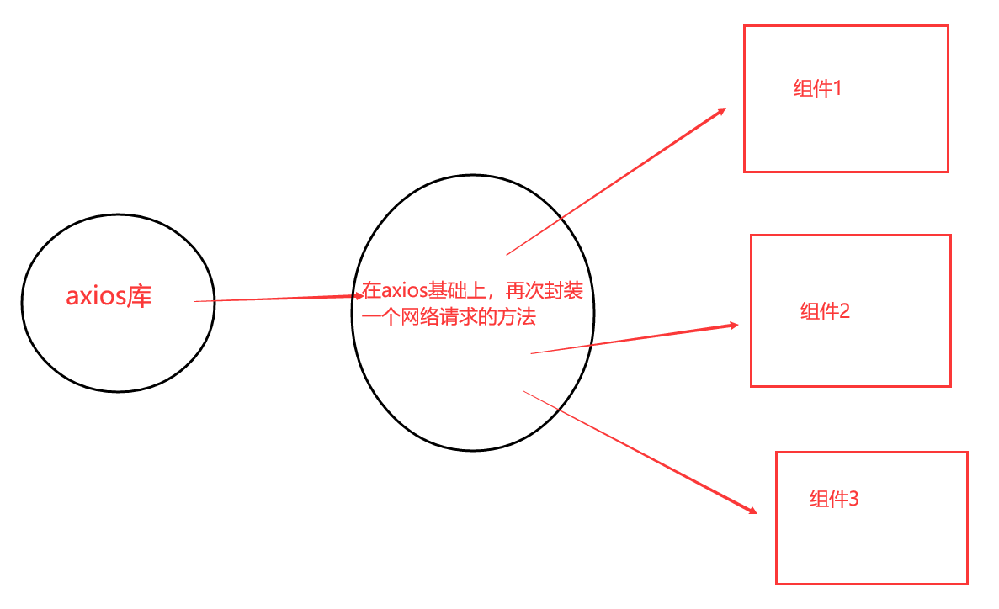
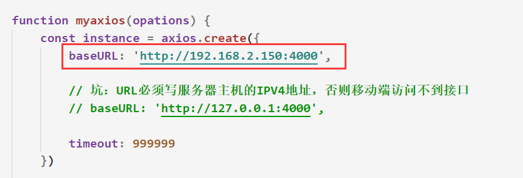
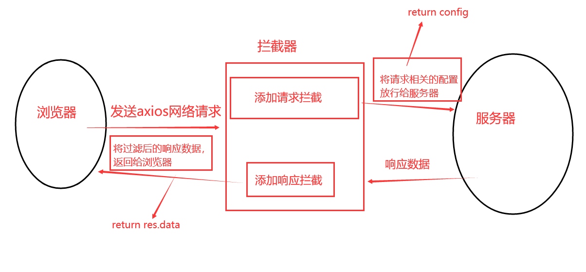
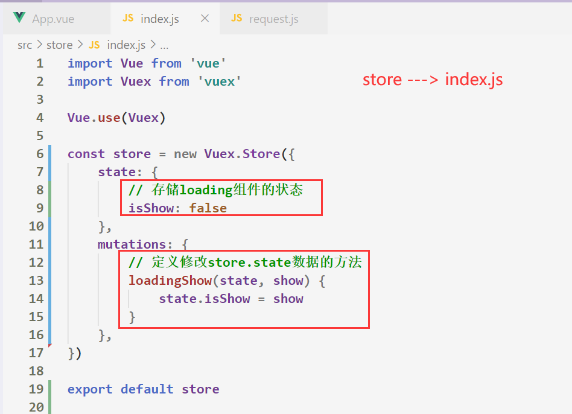
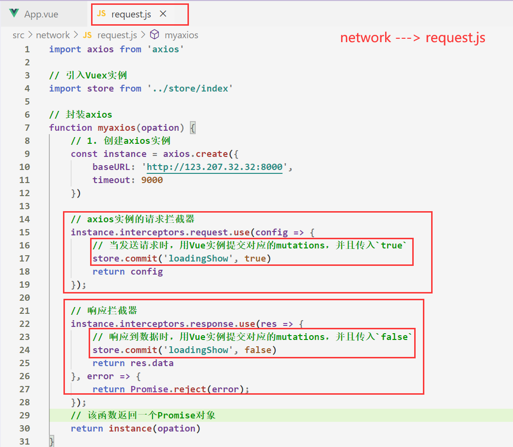
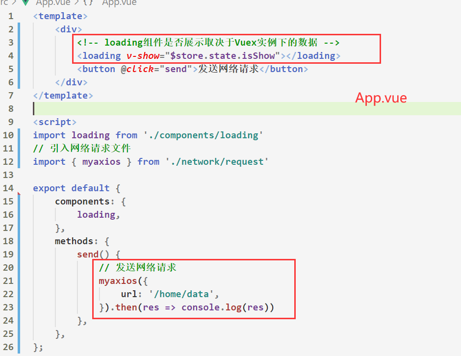

# 一、邂逅Axios

## 1.1 Axios简介

- 什么是***Axios***？
    - Axios 是一个基于 **promise** 的 **HTTP 库(JS库**)，可以用在**浏览器**和 **node.js** 中

    

- axios的特性：

    - 从浏览器中创建 [XMLHttpRequests](https://developer.mozilla.org/en-US/docs/Web/API/XMLHttpRequest)

    - 从 node.js 创建 [http](http://nodejs.org/api/http.html) 请求

    - 支持 [Promise](https://developer.mozilla.org/en-US/docs/Web/JavaScript/Reference/Global_Objects/Promise) API

    - 拦截请求和响应

    - **自动转换 JSON 数据**

        

- 使用`Axios`发送网络请求，属于***异步操作***

    

- `Axios`学习文档：http://www.axios-js.com/zh-cn/docs/


## 1.2 Axios原理

- axios 原理还是属于 **XMLHttpRequest**， 所以***axios***库是由***原生的Ajax封装***而来的

    - 参考 `Ajax`

        

- `axios`的工作原理实际上和`ajax`一致，相当于在***用户和服务器之间加了一个中间层***(***封装Ajax引擎的axios库***)
    - `axios`在这基础上，封装了一层`Promise`
    - 


- `axios`具体实现原理：https://blog.csdn.net/luchuanqi67/article/details/81329358

    

## 1.3 Axios安装

- 使用 `npm`: 开发项目阶段

    - ```
        npm install axios
        ```

        

- 使用 `cdn`: 学习阶段

    - ```html
        <script src="https://unpkg.com/axios/dist/axios.min.js"></script>
        ```


# 二、Axios编程基础

## 2.1 Axios API

- `axios`提供的API，***支持发送多种网络请求方式***

    

- 最***常用的网络请求方式***是`GET请求`和`POST请求`
    - `axios(config)`

    - `axios(url, [config])`

    - `axios.post(url, [data], [config]])`

    - `axios.get(url, [config])`

        

- 以下是不常用的网络请求方式
    - axios.put(url[, data[, config]])

    - axios.patch(url[, data[, config]])

    - axios.request(config)

    - axios.delete(url[, config])

    - axios.head(url[, config])

        

- 在使用`axios`发送网络请求后，会返回一个`promise`对象，
    - `axios`内部会在请求成功时，调用`resolve`并且传入请求成功后的数据
    - 在请求失败时`axios`内部会调用`reject`，并且传入请求失败的错误信息


## 2.2 发送网络请求

### 2.2.1 发送Get请求

- 发送`Get`请求，***不携带参数***

    - ```js
        // 写法一
        axios.get('http://123.207.32.32:8000/home/data')
          .then(res => console.log(res))
          .catch(err => console.log(err))
        
        // 写法二 等价于上面写法
        axios({
          //  传入配置选项...
          method: 'get', // 指定请求方式，不写默认为get方式
          url: 'http://123.207.32.32:8000/home/data', 
        })
          .then(res => console.log(res))
          .catch(err => console.log(err))
        ```

        

- 发送`GET`请求并且***携带查询字符串参数***

    - ```js
        // 写法一
        axios.get('http://123.207.32.32:8000/home/data', {
          	// 传入配置选项...
            params: {
                ID: 12345,
                page: 2
            }
        }).then(res => console.log(res))
        
        // 写法二
        axios({
            // 传入配置选项... 默认为get请求
            url: 'http://123.207.32.32:8000/home/data',
            params: {
                ID: 12345,
                page: 2
            }
        }).then(res => console.log(res))
        ```

    - 形成的URL：` http://123.207.32.32:8000/home/data?ID=12345&page=2`

    

### 2.2.2 发送POST请求

- ***发送post请求，不携带参数***

    - ```js
        // 写法一
        axios.post('http://123.207.32.32:8000/home/data')
          .then(res => console.log(res))
        
        // 写法二
        axios({
          //  传入配置选项...
          method: 'post', // 指定请求方式，不写默认为get方式
          url: 'http://123.207.32.32:8000/home/data', 
        })
          .then(res => console.log(res))
        ```

        

- 发送`post`请求，并且`携带参数`

    - ```js
        // 写法一
        axios.post('http://123.207.32.32:8000/home/data', {
          name: '张三'
        }).then(res => console.log(res))
        
        // 写法二
        axios({
          // 传入配置选项......
          method:'post',
          url: 'http://123.207.32.32:8000/home/data',
          data: {
            name: '张三'
          }
        })
        ```

    - **post请求**携带的参数，会放在***请求体***中进行传递
    

>注：使用axios发送post请求**所携带的参数**属于***request payload格式***，注意后端配置**该json参数**
>

  


### 2.2.3 发送并发请求

- 有时候, 我们可能需求同时发送两个请求。并且等待这两个请求响应的数据，然后在进行下一步

- 使用`axios.all([network1, network2, ....])`
  
- 该方法中传入***一个数组***，***数组中用于存放多个网络请求***
  
- 当使用`axios.all([])`方法时，内部会返回一个`Promise`对象

    - 当数组中所有的网络请求，**请求成功**时，会调用`resolve`，并传入一个数组，该数组里存放了**多个网络请求的响应数据**
    - 当数组中所有的网络请求，**请求失败**时，会调用`reject`，并传入错误信息

    - `axios.spread` 可以将`resolve`传递的数组展开为 res1, res2

        

- `axios.all`示例：

    - ```js
        axios.all([
          // 存放两个网络请求
          axios.get('http://123.207.32.32:8000/category'),
          axios.get('http://123.207.32.32:8000/home/multidata')
        ]).then(axios.spread((res1, res2) => {
            console.log(res1);
            console.log(res2);
        }))
        ```

        


## 2.3 配置选项

### 2.3.1 配置选项总结

- 在通过`axios`发送网络请求时，往往要传入***配置选项***，这里我们总结了所有可传入的配置选项

    - ```js
        axios({
        	// 配置选项...
        })
        ```

- 更详解的配置选项请到官网查看：

    http://www.axios-js.com/zh-cn/docs/#%E9%85%8D%E7%BD%AE%E9%BB%98%E8%AE%A4%E5%80%BC

- 请求地址
  
  - `url: '/user'`
  
- 请求方式

    - `method: 'get'`，不填默认为get请求

        

- 请求根路径

    - `baseURL: 'https://some-domain.com/api/'`

    - 他会自动加在 `url` 前面

        

- 请求前的数据处理

    -   `transformRequest` 允许在向服务器发送前，修改请求数据

    - 只能用在 'PUT', 'POST' 和 'PATCH' 这几个请求方法

    - ```js
        transformRequest: [function (data) {
            // 对 data 进行任意转换处理
            return data;
        }]
        ```
        
        

- 请求后的数据处理

    - 在`axios`调用then之前，允许通过`transformResponse`修改响应数据

    - ```js
        transformResponse: [function (data) {
            // 对 data 进行任意转换处理
            return data;
        }]
        ```
        
        

- 定义请求头：

    - ```js
        headers: {'X-Requested-With': 'XMLHttpRequest'}
        ```
        
        

- ***传递查询字符串参数***

    - ```js
        params: {
            ID: 12345,
            page: 2
        }
        ```
        
        

- 传递请求体请求参数，只支持'**PUT', 'POST', 和 'PATCH'**这三种请求方式

    - ```js
        data: {
            ID: 12345,
            page: 2
        }
        ```
        
        

- 请求超时设置

    - ```js
        // 当请求时长超过了1秒，则请求中断
        timeout: 1000
        ```
        
        

- 发送请求时是否携带Token

    - ```js
        withCredentials: false
        ```

        
        
        

### 2.3.2 全局配置

- 在实际开发中，使用`axios`发送网络请求时，很多配置都是相同的
    - 这时候我们可以将一些***公共的配置***，定义在`axios`的全局配置下
    - 使用`axios.default.配置选项 = xxx`，可以定义`axios`的全局配置


- 示例：

    - ```js
        // 定义全局配置
        axios.defaults.baseURL = 'http://123.207.32.32:8000';
        
        // 发送网络请求时，定义的全局配置会自动添加到配置选项中
        axios.get('/category')
        		.then(res => console.log(res))
        
        axios.get('/home/data')
        		.then(res => console.log(res))
        ```

        


## 2.4 axios的实例

### 2.4.1 axios实例的作用

- 在实际的开发中，请求的服务器不单单只有一台，这就意味着***需要请求不同的IP地址或域名***

- 当我们使用***全局配置***时，则每个请求地址都对应着一样的IP地址

    - 如果需要***请求不同的IP地址时***，还要在自身配置中进行设置

        

- 创建`axios实例`，该实例不仅可以用来发送网络请求，还可以***拥有属于自己的默认配置***
  
- 所以在开发中很少使用全局配置，而是***创建axios实例***，使用***实例的默认配置***
  
- 注意：使用`axios`实例发送网络请求时，同样会返回一个`Promise对象`


### 2.4.2 axios实例的基本使用

- 在创建`axios`实例时，可以传入属于**该实例的默认配置**

    - ```js
        const instance = axios.create({
          	// 设置axios实例的默认配置
            baseURL: 'http://123.207.32.32:8000',
            timeout: 5000,
        })
        ```

        

- 使用`axios实例`发送网络请求。使用`axios`实例发送网络请求时，同样会返回一个`Promise对象`

    - ```js
        instance({
            // 指定的配置将与实例的默认配置合并
        		url: 'home/data'
        }).then(res => console.log(res))
        ```

        

### 2.4.3 axios实例方法

- 以下是可用的实例方法。***指定的配置将与实例的默认配置合并***

    - `instance(config)`

    - `instance(url, [config])`

    - `instance.post(url, [data], [config]])`

    - `instance.get(url, [config])`

        

- 使用`axios实例`发送网络请求，实际上和`axios`直接发送请求***使用的方法一致***

    - *只不过`axios`实例能够有**属于自己的一套默认配置***

    - 使用`axios`实例发送网络请求时，同样会返回一个`Promise对象`

    

## 2.5 封装axios

### 2.5.1 为什么要封装axios？

- 我们已经知道`axios库`是基于`原生Ajax`进行封装的。其功能也是非常的完善，那么为什么我们还要进一步的对`axios`库进行封装呢？

    

- 答案很简单：如果又一天`axios库`不再***维护***了，那么对于项目***将会是毁灭性的打击***
  
    - 如果直接引入`axios库`，对项目直接进行开发，那么多个组件间一旦有需要发送网络请求的需求，就必须引入`axios`这个库，这样的话项目对`axios库`的依赖性太高了，如果有一天`axios库`不再更新维护了，那么我们就需要一个个找使用`axios库`的组件并对它进行修改，这样维护项目的成本代价太大了


- *所以我们可以在`axios库`上进行二次封装，让组件里使用我们自己**封装好的网络请求方法**。当`axios库`不再维护时，我们**只需要修改我们自己封装好的网络请求方法***




### 2.5.2 实现axios的封装

- 在项目中新建`network`文件夹，在该文件夹下新建`request.js`文件，用于存放**封装axios的代码**

- 方法一：以`Promise`进行包装

    - ```js
        // 封装axios
        function myaxios(option) {
          // 1. 创建axios实例
          const instance = axios.create({
            baseURL: 'http://123.207.32.32:8000',
            timeout: 9000
          })
        
          // 返回一个Promise对象
          return new Promise((resolve, reject) => {
            instance(option)
              .then(res => resolve(res))
              .catch(err => reject(err))
          })
        }
        
        myaxios({
          url: '/home/data'
        }).then(res => console.log(res))
        ```

        

- 方法二：通过`async await`让函数返回一个`Promise`对象

    - ```js
        // 封装axios
        async function myaxios(opation) {
            // 1. 创建axios实例
            const instance = axios.create({
                baseURL: 'http://123.207.32.32:8000',
                timeout: 9000
            })
            // 返回Promise对象成功后的数据 并为其包裹一个Promise对象
            return await instance(opation)
        }
        ```

        

- 方法三：直接返回`axios`实例（**推荐！**）

    - ```js
        function myaxios(opation) {
            // 1. 创建axios实例
            const instance = axios.create({
                baseURL: 'http://123.207.32.32:8000',
                timeout: 9000
            })
            // 直接返回一个Promise对象
        		return instance(opation)
        }
        ```

        

- 坑：
    - 如果**请求接口在本地服务器**上，那么`baseURL`最好是写本地服务器的**IPv4地址**
    - 否则**移动端在测试项目**时，将**无法访问到接口地址**



​	

​	


## 2.6 axios拦截器

- `axios`为我们提供了一套请求拦截和响应拦截的***API***，可以让我们在发送**请求之前或者是得到响应之前**，***对数据进行对应的处理。***

    

- 添加***请求拦截器***

    - ```js
        // 发送请求时，拦截请求的相关配置信息
        instance.interceptors.request.use(function (config) {
          	// config是发送请求时的一些配置信息
            // 1. 当发送网络请求时，在页面添加一个loading组件，作为动画(用Vuex管理状态)
          	// 2. 某些请求要求用户必须登录，判断用户是否有token，如果没有则跳转login页面
          
            return config; // 拦截网络请求之后，必须要将其放行！
        });
        ```

        

- 添加***响应拦截器***

    - ```js
        instance.interceptors.response.use(response => {
            // 拦截响应的数据，这里主要对响应的数据进行过滤
            return response.data // 拦截响应的数据之后，必须要将其放行！
        }, error => {
        		return Promise.reject(error);
        });
        ```

        

- **拦截器的流程图**
  
    - 


## 2.7 Vuex + axios 实现loading案例


1. 


2. 


3. 


