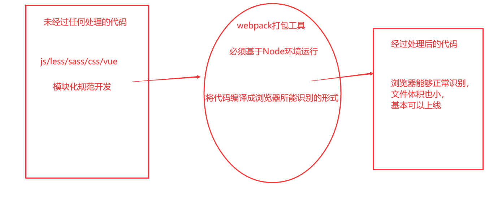

# 一、自动化构建工具 —— Webpack

## 1.1 认识Webpack

### 1.1.1 什么是webpack？

- `webpack`和`gulp`一样是一个基于`Node.js`技术开发的**自动化构建工具。**也称为打包工具

    - webpack 官网地址：https://www.webpackjs.com/

    - `webpack`也属于**Node下的第三方包**

        

- 什么是**自动化构建工具**？

    - 简单来说，**自动化构建工具就是一个打包项目的工具**
    - 在我们编写好代码之后，需要对浏览器进行兼容、压缩文件大小，但是这些事不需要开发者来做。统统可以使用自动化构建工具来帮助开发者完成

    

    

    

### 1.1.2 webpack的核心

- `webpack`其中一个核心就是让我们可能进行模块化开发，并且会自**动帮助我们处理模块间的依赖关系**。
    - 并且***任何文件都可以被当做模块使用***。不单单局限于`JS文件`，也可以是`CSS`文件、`vue`文件等

        

- `webpack`能做些什么？
    - 在我们开发中，我们要采用到许多模块化规范，但是有些浏览器并不能够识别模块化语法规范。`webpack`可以帮助我们将其模块化规范转换为浏览器所能识别的形式！
    - 当项目上线时，**自动化的完成HTML、CSS、JS文件压缩合并**，节约文件大小等等...


- 只有通过`webpack`打包工具，我们才能够在开发阶段通过**ES6的模块化规范来导入第三方包**


### 1.1.3`webpack`和`gulp`的对比

- `gulp`更加**强调的是前端流程的自动化**，解析模块化不是它的核心。因此`gulp`无法将模块化规范转换为浏览器所能识别的形式，要借助另一个包才能转换：`Browserify`

    

- `webpack`更加**强调模块化开发管理**，而文件压缩合并、预处理等功能，是他附带的功能。`webpack`可以将模块化规范解析为浏览器所能识别的！

    

- `webpack`工作流程图
  
    - 


### 1.1.4 webpack的准备工作

1. 创建项目的文件夹目录

    - ```
        |- dist ----- dist文件夹下存放的是打包后的文件
        |- src ----- src文件下存放的是源代码，没有经过任何处理的代码
            |- main.js ---- 项目的入口文件(引入其他JS文件入口)
        |- index.html ---- 浏览器打开展示的首页文件
        |- webpack.config.js ---- webpack的配置文件
        ```
    
2. 局部安装`npm i webpack@3.6.0`
    - 安装第三方包之前记得先初始化当前项目：`npm init`
    - 指定版本号3.6.0，是为了配合后续的`vue cli2`，更方便我们学习

3. 全局安装`npm i webpack@3.6.0 -g`

    

- 注：在终端中执行`webpack`命令时，会在当前目录查找`webpack.config.js`文件读取配置


## 1.2 模块化规范转换

- JS文件中编写的模块化代码，是无法被浏览器识别出来的。我们需要通过`webpack`将JS文件中模块化代码转换为浏览器所能识别的代码

1. 在命令行窗口执行：`webpack  ./src/main.js ./dist/main.js`
  
  - 将src下的main.js文件进行编译，编译到dist文件夹下的main.js文件中

​      

2. 在HTML页面中引入打包后的JS文件，测试是否可以显示


- 我们会发现`webpack`会自动帮助我们处理好模块之间的依赖关系。
    - **所有依赖的相关文件，最终都会被打包到一个JS文件下**


## 1.3 配置入口文件和出口文件

- 在`webpack.config.js`文件中编写好`入口文件`和`出口文件`配置，就不用在终端上重复写**要打包后的文件路径**了

    

- `webpack.config.js`文件将会在**Node环境**下运行，因此该文件中遵循的是`CommonJS`模块规范
  
    - ```js
        // webpack配置文件将会在Node环境下所运行，因此该文件中的路径相关最好写绝对路径
        const path = require('path') // 引入Node的系统模块
        
        module.exports = {
            // 配置入口文件：打包哪个文件
            entry: path.join(__dirname, 'src/main.js'),
            // 配置出口文件
            output: {
                path: path.join(__dirname, 'dist'), // 将入口文件打包到哪个文件夹下
                filename: 'main.js'  // 打包后的文件名
            }
        }
        ```
    
    
    
- 在终端执行`webpack`命令，则会在当前目录查找`webpack.config.js`文件读取配置。将入口文件自动打包到指定的出口文件夹下

    

- 细节：在进行打包时，`webpack`会将`入口文件`所依赖的所有文件，统一打包到`出口文件`下

    - 

        

        

## 1.4 局部webpack的使用

- 在`终端`中执行的`webpack`相关命令，都是在使用**全局下的webpack**
  
    - 但是有些项目需要依赖特定的`webpack版本`，**全局的版本**可能很这个项目的webpack版本不一致
    
- 所以通常一个项目，都有自己**局部的webpack**。但是要如何使用**局部下的webpack**呢？
  
  ​      
  
- 这里我们先回顾一下`package.json`文件解析

    - 

    - `package.json`中的scripts的脚本在执行时，会**按照一定的顺序寻找命令对应的位置**。

        1. 首先，会寻找本地的`node_modules/.bin`路径中对应的命令。

        2. 如果没有找到，会去全局的环境变量中寻找
        
            

- 给`scripts`键，添加一个`webpack`指令别名

    - ```json
        "scripts": {
          "test": "echo \"Error: no test specified\" && exit 1",
          "build": "webpack"
        }
        ```

    - 在命令行窗口执行`npm run build`，这样使用的就是局部安装的`webpack`了


## 1.5 使用Loader

### 1.5.1 理解Loader

- `loader`是`webpack`中一个非常核心的概念。
  
- `loader`使用文档：https://www.webpackjs.com/loaders/
  
- `Webpack` 本身只能加载JS/JSON模块，如果要加载其他类型的文件，就需要使用对应的`loader `进行转换/加载

    

- `webpack` 的核心是***任何文件都可以被当做模块使用***。不单单局限于`JS文件`，也可以是`CSS`文件、`vue`文件等
    - 如果在入口文件(`main.js`)中引入其他`CSS`文件，在进行打包的时候会发现报错。
    
    - 原因就是`webpack`**默认只能解析加载JS文件。**

    - 因此当加载其他文件时，必须要用对应的`loader`
    
        
    
- `loader`使用过程：

    - 步骤一：通过npm安装需要使用的`loader`

    - 步骤二：在`webpack.config.js`中的`module`关键字下进行配置

    - ```js
        module.exports = {
            entry: path.join(__dirname, 'src/main.js'),
            output: {
                path: path.join(__dirname, 'dist'), 
                filename: 'main.js',  
            },
            module: {
                rules: [
                    // loader相关配置写在这里面
                ]
            }
        }
        ```

        

        

        

### 1.5.2 CSS文件处理

- `webpack` 的核心是***任何文件都可以被当做模块使用***。不单单局限于`JS文件`，也可以是`CSS`文件、`vue`文件等
  
- 
  
  ​      
  
- 但是引入其他`CSS文件`后，重新打包会报错。因为`webpack`默认只能够打包加载的`JS文件`。当加载其他文件时，必须要用对应的`loader`


1. 安装解析css文件的包：`npm i css-loader@2.0.2 style-loader@0.23.1 -D` 

2. 在`webpack.config.js`文件中写入如下配置

    - ```js
        module.exports = {
            entry: ...
            output: {...},
            
            module: {
                rules: [
                    { test: /\.css$/, use: ['style-loader', 'css-loader'] },
                ]
            }
        }
        ```

    - 写入配置时，需要注意的是`style-loader`和`css-loader`位置不能反

        

3. 终端执行`npm run build`命令，打包文件
4. 在HTML页面中引入打包后的`JS`文件，看看其CSS文件代码是否会生效


### 1.5.3 less文件处理

1. 安装：`npm i less-loader@4.1.0 less@3.9.0 css-loader@2.0.2 style-loader@0.23.1 -D`

3. 在`webpack.config.js`文件中写入如下配置
  
    - ```js
        module.exports = {
         	 // ....
            module: {
                rules: [
                    {
                        test: /\.less$/,
                        use: [{
                            loader: "style-loader" 
                        }, {
                            loader: "css-loader" 
                        }, {
                            loader: "less-loader" 
                        }]
                    }
                ]
            }
        }
        ```
    
4. 在入口js中引入less文件：`require('./less/nav.less')`

4. 终端执行`npm run build`命令打包文件
5. 在HTML页面中引入打包后的`JS`文件，看看其LESS文件代码是否会生效


### 1.5.4 图片资源处理

1. 安装：`npm i  file-loader@3.0.1 -D`

2. 在`webpack.config.js`文件中写入如下配置

    - ```js
        module.exports = {
          // .....
          module: {
            rules: [
              // 图片资源处理
              {
                test: /\.(png|jpg|gif)$/,
                use: [{
                    loader: 'file-loader',       
                    options: {
                      limit: 8192,  
                      outputPath:'img', // 图片最终输出的文件夹
                      name:'[name].[hash:5].[ext]'// 修改图片名称
                    }
                  }]
              }
            ]
          }
        }
        ```

3. 在入口js中引入css文件，且该CSS文件里面引入了图片资源：`    background-image: url('../img/1.jpg');`

4. 终端执行`npm run build`命令打包文件
5. 在HTML页面中引入打包后的`JS`文件，看看其图片是否正常加载成功


### 1.5.5 ES6语法处理

1. 安装`babel-loader`：`npm il -D babel-loader@7 babel-core babel-preset-es2015`

2. 在`webpack.config.js`文件中写入如下配置

    - ```js
        module.exports = {
          // .....
          module: {
            rules: [
                // ES6语法转换
                {
                    test: /\.js$/,
                    exclude: /(node_modules|bower_components)/,
                    use: {
                        loader: 'babel-loader',
                        options: {
                        presets: ['es2015']
                    }
                }
          }
        }
        ```

3. 在入口js中引入`ES6语法的`JS文件

4. 终端执行`npm run build`命令打包文件

5. 在HTML页面中引入打包后的`JS`文件，看看其JS文件是否正常加载成功


### 1.5.6 Vue文件处理

1. 安装：`npm i  vue-loader@13.0.0 vue-template-compiler css-loader@2.0.2`

2. 修改`webpack.config.js`的配置文件：

    - ```js
        module.exports = {
            // ....
            module: {
                rules: [
                    {
                        test: /\.vue$/,
                        use: ['vue-loader']
                    }
                ]
            }
            resolve: {
                alias: {
                    'vue$': 'vue/dist/vue.esm.js'
                }
            }
        }
        ```

3. 在***JS入口文件***中引入`.vue`文件。并且将该文件导出的组件对象进行***注册***

4. 执行`npm run build`命令，打包文件

5. 查看打包后的`.vue`文件是否正常被加载


## 1.6 使用Plugin

### 1.6.1 理解plugin

- `plugin`也属于webpack里的核心概念
  
- `plugin`可以用于执行范围更广的任务。比如**打包优化**和**文件压缩**等等
  
  
  
- `plugin`和`loader`的区别

    - `loader`主要用于解析加载非`JS`的文件，并将其模块化规范转换为浏览器所能识别的形式

    - `plugin`主要用于对打包的项目进行优化，比如代码压缩

        

- `plugin`的**使用过程**：

    - 步骤一：通过npm安装需要使用的plugins

    - 步骤二：在`webpack.config.js`中的`plugins`中配置插件。

    - ```js
        module.exports = {
            entry: path.join(__dirname, 'src/main.js'),
            output: {
                path: path.join(__dirname, 'dist'), 
                filename: 'main.js',  
            },
            plugins:[
            		// plugin相关配置写在这里
            ]
        }
        ```

        

### 1.6.2 添加版权

- 为打包的`出口文件`添加版权声明

1. 在`webpack.config.js`中进行如下配置

    - ```js
        // webpack配置文件将会在Node环境下所运行，因此该文件中的路径相关最好写绝对路径
        const path = require('path') // 引入Node的系统模块
        const webpack = require('webpack') // 引入webpack模块
        
        
        module.exports = {
            plugins: [
                // 为打包后的JS文件添加版权
                new webpack.BannerPlugin('最终版权归json-coder所有')
            ]
        }
        
        ```
    
2. 执行`npm run build`命令，查看打包后的**JS文件**


### 1.6.3 打包HTML

- 目前，我们的`index.html`文件是存放在项目的根目录下的。

    - 我们知道，在真实发布项目时，发布的是`dist文件夹`中的内容，但是`dist文件夹`中如果没有`index.html`文件，那么打包的js等文件也就没有意义了。

    - **所以，我们需要将index.html文件打包到dist文件夹的根目录下**
    
        

1. 安装`npm i html-webpack-plugin@3.2.0`

2. 在`webpack.config.js`中进行如下配置

    - ```js
        const HtmlWebpackPlugin = require('html-webpack-plugin')
        module.exports = {
            entry: 
            output: {},
            module: {},
                
            plugins: [
                new HtmlWebpackPlugin({
                    template: 'index.html'
                })
            ]
        }
        ```

3. 执行`npm run build`命令，开始打包文件

4. 打包后的`index.html`文件会存放到`dist`文件夹的***根目录***下，同时自动帮我们引入打包后的`出口文件`


- 注意：打包时项目的根目录下一定要有`index.html`文件，作为打包的参照模板


### 1.6.4 压缩JS文件

1. 安装`npm i uglifyjs-webpack-plugin@1.1.1 -D`

2. 在`webpack.config.js`中进行如下配置

    - ```js
        const uglifyjsPlugin = require('uglifyjs-webpack-plugin')
        module.exports = {
            entry: 
            output: {},
            module: {},
                
            plugins: [
                new uglifyjsPlugin()
            ]
        }
        ```

3. 执行`npm run build`命令，开始打包文件
4. 


## 1.7 搭建本地服务器

### 1.7.1 打包所带来的问题

- 前言：我们在开发时，往往需要采用模块化规范来开发项目。但是我们必须要通过`打包文件`后才能看到我们所写的代码是否生效
    - 


- 每当我们修改一下源代码（`src文件夹下`），就要打包一次查看运行结果，这必然会影响开发效率。
- 而且每次打包都是打包到磁盘中，打包的速度会比较慢。同样影响开发效率


### 1.7.2 本地服务器的使用

- `webpack`提供了一个可选的本地服务器，这个本地服务器基于node.js搭建，内部使用express框架，可以实现我们想要的让浏览器自动刷新显示我们修改后的结果。

    - 

    - 该本地服务器会实时监听项目根目录的`index.html`文件以及他引入的文件是否发生修改

        

- `webpack`中提供的本地服务器，解决了我们每次修改源代码都要手动进行打包的烦恼。

    - 也解决了打包速度过慢的问题，因为打包后的文件是存放到内存里面的，相较于存放磁盘会更快


1. 安装`npm install webpack-dev-server@2.9.3 -D`

2. 在`webpack.config.js`中进行如下配置

    - ```js
        const path = require('path') // 引入Node的系统模块
        
        module.exports = {
            entry: ,
            output: {},
            module: {},
            plugins: [],
            devServer: {
                contentBase: path.join(__dirname, 'dist'),  
                inline: true,  
            }
        }
        ```

    - `contentBase`：为哪一个文件夹提供本地服务，我们这里要写打包到的文件夹路径（dist文件夹路径）

        `port`：指定服务器的端口号（默认为8080）

        `inline`：页面实时刷新（监听项目根目录的`index.html`文件以及他所依赖的文件是否发生修改）

        `historyApiFallback`：在SPA页面中，依赖HTML5的history模式
        
        

3. 在`package.json`文件中配置脚本命令

    - ```json
          "scripts": {
            "build": "webpack",  // 打包文件命令
            "dev": "webpack-dev-server --open" // 启动本地服务器命令
          },
      ```

4. 执行`npm run dev`命名，他会自动帮助我们打开打包后的文件夹下的`index.html`页面，也就是原来`dist文件夹下的index.html文件`
5. 修改项目根目录下的`index.html`文件以及他所引入的文件，看看页面是否会实时刷新


## 1.8 webpack总结

1. 构建项目的文件夹目录
  
- 
2. 写入webpack配置

    - ```js
        // webpack配置文件将会在Node环境下所运行，因此该文件中的路径相关最好写绝对路径
        const path = require('path') // 引入Node的系统模块
        const webpack = require('webpack')
        const HtmlWebpackPlugin = require('html-webpack-plugin')
        const uglifyjsPlugin = require('uglifyjs-webpack-plugin')
        
        module.exports = {
            // 配置入口文件：文件的绝对路径
            entry: path.join(__dirname, 'src/main.js'),
            // 配置出口文件
            output: {
                path: path.join(__dirname, 'dist/js'), // 将入口文件打包到哪个文件夹下
                filename: 'main.js',  // 打包后的文件名
            },
            // 配置loader
            module: {
                rules: [
                    // CSS文件的处理
                    { test: /\.css$/, use: ['style-loader', 'css-loader'] },
                    // less文件的处理
                    {
                        test: /\.less$/,
                        use: [{
                            loader: "style-loader"
                        }, {
                            loader: "css-loader"
                        }, {
                            loader: "less-loader"
                        }]
                    },
                    // 图片资源处理
                    {
                        test: /\.(png|jpg|gif)$/,
                        use: [{
                            loader: 'file-loader',
                            options: {
                                limit: 8192,
                                outputPath: 'img', // 图片最终输出的文件夹
                                publicPath: 'img', // css图片资源路径
                                name: '[name].[hash:5].[ext]'// 修改图片名称
                            }
                        }]
                    },
                    // ES6语法转换
                    {
                        test: /\.js$/,
                        exclude: /(node_modules|bower_components)/,
                        use: {
                            loader: 'babel-loader',
                            options: {
                                presets: ['es2015']
                            }
                        }
                    }
                ]
            },
            // 配置plugins
            plugins: [
                new webpack.BannerPlugin('最终版权归json-coder所有'),
                new HtmlWebpackPlugin({
                    template: 'index.html'
                }),
                // new uglifyjsPlugin()
            ],
            // 配置本地服务器
            devServer: {
                contentBase: path.join(__dirname, 'dist'),  
                inline: true,  
            }
        }
        ```

        

## 1.9 配置路径别名

- 在`webpack.config.js`中写入如下配置

    - ```js
        module.exports = {
            resolve: {
                // 引入文件时，可以不写如下的后缀名
              	extensions: ['.js', '.vue', '.json']
              	// 为路径配置别名 @：相当于src文件夹
                alias: {
                  '@': 'src',
                  'assets': 'src/assets',
                  'views': 'src/views',
                }
            }
        }
        ```

        

- 在***HTML***模板中使用***路径别名***引入文件时，需要在***别名前***在`~`符号

    - ```html
        
        ```

- 在***JS***中使用***路径别名***引入文件时，可以直接使用路径别名

    - ```js
        import TabBar from '@/components/TabBar/TabBar'
        ```

        


## 配置文件的分离（了解）

- 这里的配置分离可以只做一个了解，为`VueCli2`脚***手架中的配置分离做一个铺垫***

- 我们可以把`webpack.config.js`文件分离成`生产配置文件`和`开发配置文件`

1. 创建一个用于存放配置文件的文件夹
    - 

2. `npm i webpack-merge@4.1.5 -D`


3. 编写`base.config.js`文件代码，该文件用于存放不论是生产还是开发都需要的配置代码

    - 

    - 注意：由于配置文件路径发生了改变，里面的配置路径也要跟着修改

4. 编写`生产配置文件`和`开发配置文件`代码
    - 


5. 对`package.json`中的脚本命令进行修改，当我们执行`webpack`命令时，我们希望他能够找到我们所配置的文件

    - 

    

6. 执行`npm run build`或`npm run dev`测试配置文件是否生效


