# Element-UI 开发 (一) --- 基本使用

## 1.1 Element-UI的介绍

- 为什么要使用**element-ui** ？ 
    - 我们学习VUE，知道它的核心思想是**组件开发**和**数据驱动**(MVMM)，但是每一个组件都需要自己编写模板、样式、添加事件、数据等是非常麻烦的，所以饿了吗推出了基于**VUE2.0的组件库**，提供**现成的PC端组件**


- 什么是**Element-UI** ?
    - **Element-Ul**是`饿了么`前端团队推出的一款基于`Vue.js 2.0` 的**组件库**，该组件库提供了丰富的**PC端组件**
    - **手机端**有对应组件库是**Mint UI** 和 **Vant**


- `element-ui`官方文档：https://element.eleme.cn/#/zh-CN/component/installation

    - 参考文档：https://www.jianshu.com/p/e672b246d9d1


## 1.2 Element-UI的起步

1. 通过**Vue脚手架3**创建项目
  
  - `vue create project_name`
  
2. npm 安装第三包 

    - `npm i element-ui`

3. 在项目的***src***文件夹下新建 ***plugins*** 文件夹，该文件夹用于存放组件库相关的JS代码

    

4. ***plugins文件夹***下 新建 ***element.js 文件***，该文件用于导入`element-ui`，在该文件下**写入如下配置**

    - ```js
        import Vue from 'vue';
        // 1. 导入组件库
        import ElementUI from 'element-ui';
        // 2. 导入组件相关样式 
        import 'element-ui/lib/theme-chalk/index.css';
        // 3. 注入插件
        Vue.use(ElementUI);
        
        // 4. 在main.js中引入该JS文件
        import './plugins/element.js'
        ```

        

5. 在`App.vue`文件中复制如下代码，如果显示对应的样式，则说明引入组件库成功

    - ```vue
        <el-row>
          <el-button>默认按钮</el-button>
          <el-button type="primary">主要按钮</el-button>
          <el-button type="success">成功按钮</el-button>
        </el-row>
        ```

    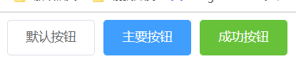


- 导入**element-ui**后，在单文件组件的模板区域上编写以`el`开头的元素，都可以被看做是`element-ui`**提供的组件**

    


## 1.3 按需导入Element-UI

- 按需求分别导入不同的`Element-UI`组件，可以达到减小项目体积的目的，**提升项目性能**

- 如果你只希望引入部分组件，比如 element 中的**Button按钮**、**icon图标**。那么需要在 ***element.js***  中写入以下内容：

    - ```js
        import Vue from 'vue'
        // 1. 按需导入elemen-ui组件库
        import { Button, Icon } from 'element-ui'
        // 2. 导入eleme-ui组件样式库
        import 'element-ui/lib/theme-chalk/index.css'
        // 3. 注入插件
        Vue.use(Button)
        Vue.use(Icon)
        
        // 4. 在main.js中引入该JS文件
        import './plugins/element.js'
        ```

        

- 如何确定要导入的**element-ui中的组件名称**？

    


- 每个以`el`开头的元素都可以看做是一个**element-ui**为开发者提供的组件，按需导入就是**使用什么组件导入什么组件**

    - ```vue
        <!-- 单文件组件模板区域 -->
        <el-form>
            <el-form-item label="活动名称">
            		<el-input></el-input>
            </el-form-item>
        </el-form>
        <el-button>默认按钮</el-button>
        ```

    - ```js
        // element.js
        import Vue from 'vue'
        // 按需导入
        import {
            Button,
            Form,
            FormItem,
          	Input
        } from 'element-ui'
        
        
        // 导入eleme-ui组件样式库
        import 'element-ui/lib/theme-chalk/index.css'
        
        // 注入插件
        Vue.use(Button)
        Vue.use(Form)
        Vue.use(FormItem)
        Vue.use(Input)
        ```

    - `el-xxx`：将xxx转换为`大驼峰`命名规范就是要导入的**组件名称**


## 1.4 一般组件的使用

- element-ui的基本使用还是十分简单的，你只需要找到你想要的样式，然后点开详细代码，复制到你的`.vue`文件里那么就可以了，例如直接复制官方提供的radio组件([链接](https://links.jianshu.com/go?to=https%3A%2F%2Felement.eleme.cn%2F2.0%2F%23%2Fzh-CN%2Fcomponent%2Fradio))的第一个代码：

    


- 在理想情况下，只需要以下步骤：
    1. 找想要的样式组件
    2. 复制代码到对应的`.vue`文件
    3. 修改对应的数据


## 1.5 字体图标的使用

- 官方提供了很多图标样式（[链接](https://links.jianshu.com/go?to=https%3A%2F%2Felement.eleme.cn%2F2.0%2F%23%2Fzh-CN%2Fcomponent%2Ficon)），通过阅读文档可以发现：一般情况下，使用`i`标签，并将`class`属性设置成对应的图标名即可

    

    


- 而对于有`icon`属性的组件时，例如`el-button`，设置`icon`属性为对应的图标名即可 （[链接](https://element.eleme.cn/#/zh-CN/component/button)）


## 1.6 指令组件的使用

- 例如`Loading加载`（[链接](https://links.jianshu.com/go?to=https%3A%2F%2Felement.eleme.cn%2F2.0%2F%23%2Fzh-CN%2Fcomponent%2Floading)），其提供的是一个指令`v-loading`，而非一个组件，举例：

    - ```vue
        <template>
          <div>
            <div v-loading="isLoading">这块内容使用v-loading指令</div>
            <el-button @click=handle>{{ clickText }}</el-button>
          </div>
        </template>
        
        <script>
        export default {
          data() {
            return {
              isLoading: true,
              clickText: "取消loading"
            }
          },
          methods:{
              handle(){
                  this.isLoading = !this.isLoading
                  if (this.isLoading) {
                      this.clickText = "取消loading"
                  } else {
                      this.clickText = "继续loading"
                  }
              }
          }
        };
        </script>
        ```

    - 默认状况下，**Loading 遮罩会插入到绑定元素身上**

    


- 在绑定了`v-loading`指令的元素上添加`element-loading-text`属性，其值会被渲染为加载文案，并显示在加载图标的下方。类似地，`element-loading-spinner`和`element-loading-background`属性分别用来设定图标类名和背景色值

    - ```vue
        <div
            v-loading="isLoading"
            element-loading-text="拼命加载中"
            element-loading-spinner="el-icon-loading"
        >这块内容使用v-loading指令，true时loading</div>
        ```

    


- 全屏遮罩需要添加`fullscreen`修饰符（遮罩会插入至 body 上），此时若需要锁定屏幕的滚动，可以使用`lock`修饰符

    - ```vue
        <div
            v-loading.fullscreen.lock="isLoading"
            element-loading-text="拼命加载中"
            element-loading-spinner="el-icon-loading"
        >这块内容使用v-loading指令，true时loading</div>
        ```

    


## 1.7 事件触发组件使用

- 例如`Message消息提示`（[链接](https://links.jianshu.com/go?to=https%3A%2F%2Felement.eleme.cn%2F2.0%2F%23%2Fzh-CN%2Fcomponent%2Fmessage)），其提供是的不是一个组件，而是一个方法，通过**调用方法来触发消息弹窗的展示**

    - ```vue
        <template>
          <el-button :plain="true" @click="open">打开消息提示</el-button>
        </template>
        
        <script>
          export default {
            methods: {
              open() {
                this.$message('这是一条消息提示'); // 全局使用
                Message('xxx')  // 局部使用
              },
          }
        </script>
        ```

        

- 全局使用`Message`组件，在任意组件中都可以通过`$message`方法来展示消息提示框

    - ```js
        // element.js
        import { Message } from 'element-ui'
        Vue.prototype.$message = Message
        ```
    
    
    
- 局部使用`Message`组件，只有导入该方法的组件，才能够展示消息提示框

    - ```js
        // xxx.vue
        import { Message } from 'element-ui'
        ```
    
     
    
- `element-ui`允许我们调用**Message**时，**传入一些配置选项**，[具体配置选项可以查看官网介绍](https://element.eleme.cn/2.0/#/zh-CN/component/message)

    - ```js
        Message({
            message: '消息文字', // 显示文字
            type: "success",  // 主题 可选值：success/warning/info/error
            duration: 5000,  // 显示时间，默认为3000
            showClose: true,  // 是否显示关闭按钮
            center: true  // 文字是否居中
        });
        ```

        

- `element-ui`也为每个 type 定义了各自的方法，如 `Message.success(options)`。

    

    

    

# Element-UI 开发 (二) --- 阅读说明

## 2.1 文档阅读

- element-ui文档提供了很多示例代码，一般情况下我们直接拷下示例代码稍微看着改改数据之类的就够用了。

- 但是在某些场景下，我们可能又需要使用到一些特殊的功能和属性，而这些功能属性一般在**官方提供的组件中都已经内置了**，所以我们可以直接先**从文档中寻找查看是否有属性或者方法**等能够满足我们的需求，从而避免重复造轮子。

- 下面就来说明下文档里提供的**属性、方法等**如何阅读以及使用。

    

## 2.2 Attribute 阅读


- 顾名思义，就是官方提供的属性，使用很简单，直接在**组件标签上设置属性**和对应的值就行了，直接拿`el-input`组件([链接](https://links.jianshu.com/go?to=https%3A%2F%2Felement.eleme.cn%2F2.0%2F%23%2Fzh-CN%2Fcomponent%2Finput))来说，例如其提供的Input Attributes里面有`prefix-icon`和`clearable`属性，代码例子：

- ```vue 
    <template>
        <div>
            <el-input placeholder="请输入内容" v-model="name" clearable prefix-icon="el-icon-info"  />
        </div>
    </template>
    
    <script>
    export default {
        data() {
            return {
                name: ''
            }
        },
    };
    </script>
    ```


## 2.3 slot 阅读


- 如果插**槽名字为空或者为-**，则表示在该组件中可**以填充任意插槽**


- 其Input slots下提供了`prepend`（输入框头部内容，只对 type="text" 有效）**具名插槽**，下面是使用该`slot`的代码示例：

    - ```vue
        <template>
            <div>
                <el-input v-model="name">
                    <span slot="prepend">aaa</span>
                </el-input>
            </div>
        </template>
        
        <script>
        export default {
            data() {
                return {
                    name: ""
                };
            }
        };
        </script>
        ```

        


## 2.4 Scoped Slot 阅读

- `Scoped Slot`表示**作用域插槽**。当我们使用`Element-UI`提供的第三方组件时，有的组件允许我们填充任意插槽
- 我们再填充插槽时，有时希望能够获取到当前**第三方组件内部的数据**，这时候就要通过***作用域插槽语法来实现***


- 其`table-column`组件提供了**作用域插槽**，下面是使用该`作用域插槽`的代码示例：
    - 


- 展示效果如下
    - 


## 2.5 Events 阅读

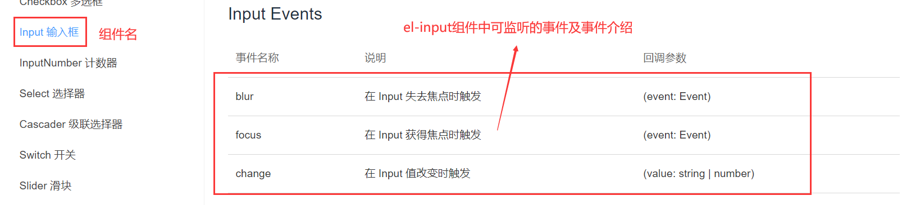


- event就是**element组件提供的监听事件**，例如`el-input`组件的Input Events下提供了`change`方法，并且看到回调参数里包括`value`，下面使用该事件举例：

    - ```vue
        <template>
            <div>
                <el-input v-model="name" @change="inputChange" />
            </div>
        </template>
        
        <script>
        export default {
            data() {
                return {
                    name: ""
                };
            },
            methods: {
                inputChange(value) {
                    console.log(value);
                }
            },
        };
        </script>
        ```

        


## 2.6 Methods 阅读

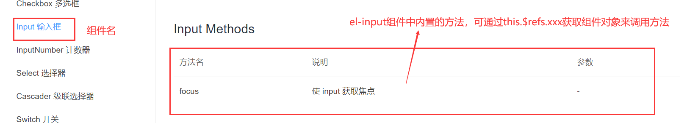


- `methods`就是该组件内置的方法，例如`el-input`组件提供了`focus()`方法，举例如下：

    - 通过`this.$refs.ref属性名.方法()`调用组件自身的methods方法。参考：`父子组件通信`

    - ```vue
        <template>
            <div>
                <el-input v-model="name" ref="input" />
                <el-button @click="focus">聚焦到表单上</el-button>
            </div>
        </template>
        
        <script>
        export default {
            data() {
                return {
                    name: ""
                };
            },
            methods: {
                focus() {
                  	// 调用属性ref为input的组件上的focus方法
                    this.$refs.input.focus()
                }
            },
        };
        </script>
        ```

        


## 2.7 Options 阅读

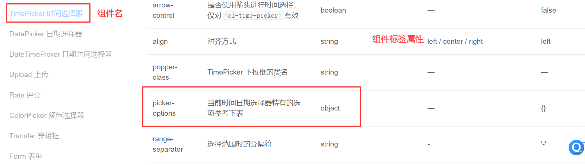


- option一般是一些**attribute**的类型为`object`类型时，**该attribute对象里的键值参考**，这里拿`el-time-select`组件（时间选择器，[链接](https://links.jianshu.com/go?to=https%3A%2F%2Felement.eleme.cn%2F2.0%2F%23%2Fzh-CN%2Fcomponent%2Ftime-picker)）举例，该组件里的`picker-options`属性是`object`类型，而文档也提供了Time Select Options的参数说明，下面是使用示例：

    - ```vue
        <template>
          <div>
            <el-time-select
              v-model="value1"
              :picker-options="{
                start: '08:30',
                step: '00:15',
                end: '18:30'
          }"
            ></el-time-select>
            <!-- 直接照搬官方文档提供了...这里加下说明：picker-options是object类型，option里则提供了各种该对象里的参数 -->
          </div>
        </template>
        
        <script>
        export default {
          data() {
            return {
              value1: ""
            };
          }
        };
        </script>
        ```

        


## 2.8 子组件 阅读

- 很多**提供的组件里都含有子组件**，比如`el-form`下就有子组件`el-form-item`，不论是父组件还是子组件在使用时都**必须按需导入**，而对应子组件的`attributes`、`slot`等的**使用阅读方式**也是一样的

    

- 这里提供`el-form`结合子组件`el-form-item`的使用示例：

    - ```vue
        <template>
            <div>
                <el-form ref="form" :model="form">
                    <el-form-item>
                        <el-input v-model="form.name" />
                    </el-form-item>
                </el-form>
            </div>
        </template>
        
        <script>
        export default {
            data() {
                return {
                    form: {
                        name: '',
                    }
                }
            },
        }
        </script>
        ```

    - ```js
        // 按需导入
        import { Form, FormItem }
        Vue.use(Form)
        Vue.use(FormItem)
        ```

        


## 2.9 Element-UI提供的类名

- 当我们使用`Element-UI`的组件时，其组件为我们提供了一个和**组件标签名一样的类名**，以便于开发者能够直接修改第三方组件中的**根div样式**

    - ```vue
        <el-button>我是第三方组件按钮</el-button>
        <el-link>主要链接</el-link>
        
        <style scope>
          .el-button { xxx }
          .el-link { xxx }
        </style>
        
        ```

        
        
        


# Element-UI 开发 (三) --- 常用组件 ①


## 3.1 面包屑导航

### 基础用法

- [面包屑导航参考](https://element.eleme.cn/#/zh-CN/component/breadcrumb)

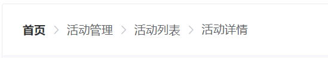

- 面包屑导航**实现代码**

    - ```html
        <el-breadcrumb separator-class="el-icon-arrow-right">
          <el-breadcrumb-item :to="{ path: '/' }">首页</el-breadcrumb-item>
          <el-breadcrumb-item>活动管理</el-breadcrumb-item>
          <el-breadcrumb-item>活动列表</el-breadcrumb-item>
          <el-breadcrumb-item>活动详情</el-breadcrumb-item>
        </el-breadcrumb>
        ```

        

- 组件代**码说明**：
  
    - 在`el-breadcrumb`中使用`el-breadcrumb-item`标签表示从首页开始的每一级。Element 提供了一个`separator`属性，在`el-breadcrumb`标签中设置它来**决定分隔符**，默认为斜杠`/`。


### Breadcrumb Attributes


### Breadcrumb Item Attributes

- 


## 3.2 Butto按钮


### 基础用法

- [Button 按钮](https://element.eleme.cn/#/zh-CN/component/button)


- 上图实现代码如下
    - 


- `Button` 组件说明
    - 可以使用`type`、`plain`、`round`和`circle`属性来定义 Button 的样式。


### Button Attributes


## 3.3 Tag标签


### 基础用法

- [Tag标签](https://element.eleme.cn/#/zh-CN/component/tag)

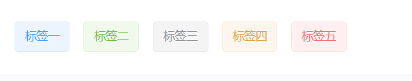


- 上图实现代码

    - ```html
        <el-tag>标签一</el-tag>
        <el-tag type="success">标签二</el-tag>
        <el-tag type="info">标签三</el-tag>
        <el-tag type="warning">标签四</el-tag>
        <el-tag type="danger">标签五</el-tag>
        ```

        

- `Tag`组件使用说明
  
    - 由`type`属性来选择tag的类型，也可以通过`color`属性来自定义背景色。


### Tab Attributes


### Tab Events


## 3.4 Alert 警告

### 基础用法

- [Alert 警告](https://element.eleme.cn/#/zh-CN/component/alert)：用于页面中展示重要的**提示信息**

    

    

- 上图实现代码

    


- `Alert`组件使用说明
    - Alert 组件提供四种主题，由`type`属性指定，默认值为`info`。


### Alert Attributes


### Alert Slot


### Alert Events


# Element-UI 开发 (四) --- 常用组件 ②

## 4.1 Card卡片

### 基础用法

- [Card参考](https://element.eleme.cn/#/zh-CN/component/card)


- 上图实现代码

    - ```html
        <el-card>
          <div v-for="o in 4" :key="o">
            {{'列表内容 ' + o }}
          </div>
        </el-card>
        ```

        


###  Card Attributes

- 


## 4.2 Tooltip 文字提示

### 基础用法

- [文字提示组件](https://element.eleme.cn/#/zh-CN/component/tooltip)

    - 效果：常用于展示鼠标 hover 时的提示信息

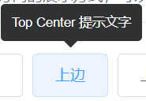

- 上图代码实现

    - ```html
        <el-tooltip effect="dark" content="提示文字" placement="top">
        		<el-button>上边</el-button>
        </el-tooltip>
        ```

        

### Tooltip Attributes


## 4.3 Dialog 对话框

### 基础用法

[Dialog 对话框](https://element.eleme.cn/#/zh-CN/component/dialog)


- 上图代码实现如下

    - 

      
      
      

- `Dialog`组件使用说明
    - 需要设置`visible`属性，它接收`Boolean`，当为`true`时显示 **Dialog**。
    - Dialog 分为两个部分：`body`和`footer`，`footer`需要具名为`footer`的`slot`。`title`属性用于定义标题，它是可选的，默认值为空


### Dialog Attributes

- 


### Dialog Slot


### Dialog Event

​	


## 4.4 MessageBox 弹框

### 基础用法

- `弹框`和`对话框`的区别

    - 从场景上说，MessageBox 的作用是美化系统自带的 `alert`、`confirm` 和 `prompt`，因此适合展示较为**简单的内容**。如果需要弹出较为复杂的内容，请使用 Dialog

    

    [MessageBox弹框](https://element.eleme.cn/#/zh-CN/component/message-box)


- 上图实现代码
    - 


- `MessageBox`组件使用说明
    - 该组件并不是通过组件标签来进行展示的，而是**通过JS代码进行展示**，如果是局部导入element-ui组件，必须要在**Vue的原型上挂载一些方法**，Vue组件才能该通过该方法来展示`MessageBox`组件


- 按需导入使用`MessageBox`组件

    - ```js
        // element.js
        import { MessageBox } from 'element-ui';
        // 注册全局方法
        Vue.prototype.$alert = MessageBox.alert
        Vue.prototype.$confirm = MessageBox.confirm
        Vue.prototype.$prompt = MessageBox.prompt
        ```

        

- `MessageBox` API
    - `$msgbox(options)`
    - `$alert(message, title, options)` 或 `$alert(message, options)`
    - `$confirm(message, title, options)` 或 `$confirm(message, options)`
    - `$prompt(message, title, options)` 或 `$prompt(message, options)`


### MessageBox Opation


## 4.5 Tabs 标签页

### 基础用法

- [Tabs 标签页](https://element.eleme.cn/#/zh-CN/component/tabs)

    


- 上图代码实现
    - 


- `Tabs`组件使用说明

    - `el-tabs`组件用于展示**标签页区域**，`el-tab-pane`组件用于展示标签页中**每个标签页的标题以及内容区域**
    - `el-tabs`组件需要**双向绑定**一个值，并且该值为`el-tab-pane`组件中**name**属性值，用于**指定当前选中**的标签页
    - **当标签页发生切换时，其双向绑定的值就会切换为当前处于活跃下的标签页的name属性值** 
    - `el-tab-pane`组件的label属性用于指定**标签页标题**，**标签页内容直接在该组件中填写插槽即可**

    

### Tabs Attributes


### Tabs Events


### Tab Pane Attributes


## 4.6 Timeline 时间线

### 基础用法

- [时间线](https://element.eleme.cn/#/zh-CN/component/timeline)：可视化地呈现时间流信息。

    


- 上图代码实现

    


- `el-timeline`组件使用说明

    - `el-timeline`用于创建时间线区域，其嵌套的`el-timeline-item`用于渲染时间线中的**每一个节点**

    - 需要**预先在date下定义一个数组**，作为时间线的数据源，数组中的每一个对象就是`el-timeline-item`所要渲染的节点

    - `el-timeline-item`中填充的插槽内容，就是节点内容

        


### Timeline Attributes

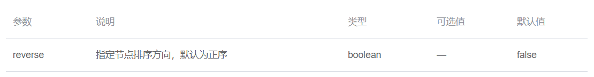


### Timeline-item Attributes


### Timeline-Item Slot


# Element-UI 开发 (五) --- 常用组件 ③

## 5.1 Menu 导航菜单

### 基础用法


- `Element-UI`提供的**导航菜单基本布局结构**，参考：[导航菜单组件](https://element.eleme.cn/#/zh-CN/component/menu)

    - ```html
        <el-menu>
            <el-submenu index="1">
              	<!-- 通过插槽形式来填充一级菜单的内容模板 -->
                <div slot="title">
                    <i class="el-icon-user-solid"></i>
                    <span>用户管理</span>
                </div>
                <!-- 在一级菜单中，可以通过MenuItem组件来嵌套二级菜单 -->
                <el-menu-item index="1-1" >
                    <i class="el-icon-menu"></i>
                    <span>用户列表</span>
                </el-menu-item>
              
              	<!-- 如果想在二级菜单下嵌套三级菜单，则需要通过Submenu组件来完成 -->
                <el-submenu index="1-2">
          					<!-- 通过插槽形式来填充二级菜单的内容模板 -->
                    <div slot="title">
                        <span>个人中心</span>
                    </div>
                  	<!-- 在二级菜单中，可以通过MenuItem组件来嵌套三级菜单 -->
                    <el-menu-item index="1-2-1">
                        <span>帮助</span>
                    </el-menu-item>
                </el-submenu>
              
            </el-submenu>
        </el-menu>
        ```

        


### Menu Attribute

- 


### SubMenu Attribute


### Menu Item Attribute


## 5.2 Form表单

### 基础用法

- 表单由输入框、选择器、单选框、多选框等控件组成，用以收集、校验、提交数据，[Form表单参考](https://element.eleme.cn/#/zh-CN/component/form)


- 代码说明：

    - 在 **Form** 组件中，每一个**表单域**由一个 **Form-Item** 组件构成，**表单域中可以放置各种类型的表单控件**，包括 Input、Select、Checkbox、Radio、Switch、DatePicker、TimePicker组件等

    - 必须为**Form组件**动态绑定**model属性**，用于**绑定表单数据源**，为每个**Form-Item组件双向绑定数据源中的属性**

      ​    

- 上图实现代码：

    

    

    

### 表单验证

- **表单验证**：在防止用户犯错的前提下，尽可能让用户更早地发现并纠正错误

    - ①在 `data` 下定义`rules`对象，用于**定义表单验证规则**。
    - ②在`Form`组件中绑定`rules`属性，并指向`data`下定义的`rules对象`
    - ③**将 Form-Item** 的 `prop` 属性设置`rules对象上的`的字段名即可


​    


- 表单验证对象中的**字段解析**

    - `required`： 是否必填，bool类型
    - `message`：验证失败时的错误提示，string类型
    - `trigger`：在什么事件下显示错误提示，可以是一个数组存储多个事件名称，也可以是一个字符串
    - `type`：指定表单的输入类型   例：`type: 'number'`


- 表单验证时必须保证`Form-Item`组件中`prop`绑定的**字段名**与其对应的表单控件`双向绑定`的字段名**一致**

    - 


- 注：如果为`el-form-item`指定的校验规则为必填字段，那么该`el-form-item`的**标签文本**(label)前面就会有**红色的星号**，如果没有为其指定标签文本(label)，则就不会有红色的星号


### 自定义验证规则

1. 定义一个**函数**作为验证规则，该函数的具体语法要查看官方文档
2. 在验证规则对象中 通过`validator`属性指定自定义的验证规则


### Form Attributes

- 


### Form Methods

- 


### Form Item Attributes

- 


### Form Item Slot

- 


- 表示在`Form-Itme`组件中可以填充任意插槽


## 5.3 Table表格

### 基础用法

- [表格参考](https://element.eleme.cn/#/zh-CN/component/table)


- 上图实现代码
    - 


- `Table`组件使用说明

    - 为`el-table`元素中**动态绑定**`data`属性，指定表格的**数据源**

    - 在`el-table-column`组件表示表格的每一列数据

        - `prop`属性用于指定**当前列要渲染哪些数据**，直接填写**数据源中指定的字段**即可

    - `label`属性用于定义**表格的首列名**

    - 如果希望**自定义每一列数据**，则需要通过**填充插槽**来代替prop属性指定的数据内容

        ​      

- 解决`Table`组件的边框线没有对齐问题

    - ```css
        .el-table th.gutter {
          display: table-cell >>> !important
        }
        ```

        

### Table Attributes

- 


### Table Column Attributes

- 

  ​    

    - 当`type =“expand” `时可以实现表格行**展开效果**


### Table Column Scoped Slot

- 

  ​    

  ​    

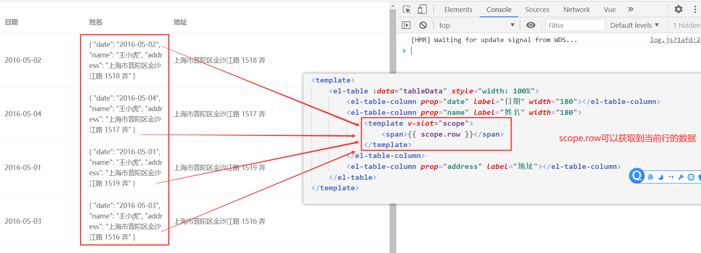


## 5.4 Pagination 分页

### 基础用法

[分页组件](https://element.eleme.cn/#/zh-CN/component/pagination)

- 展示效果如下
    - 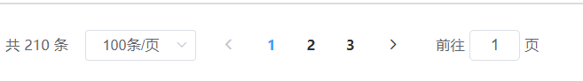


- 上图具体代码实现

    - 

        ​    

### Pagination Attributes

- 


### Pagination Events

- 


## 5.5 Tree 树形控件

### 基础用法

- [树形控件](https://element.eleme.cn/#/zh-CN/component/tree)


- 上图代码实现

    - 

      ​    

        

        

- `Tree`组件使用说明

    - 使用`Tree`组件时，必须动态绑定`props`属性，然后传入**配置项**

    - 在配置项中指定**数据源**中的**文本数据的属性名，**以及**子级节点数据的属性名**
    - 数据源中的**每一个对象可以看做一颗树**，也可以看做是一个**节点**


- 解决改变了`:default-checked-keys`，也不能改变渲染结果问题

    - ```js
        // 手动强制刷新默认选中的节点数组
        this.$refs.rightsTree.setCheckedKeys(this.defKeys);
        ```

        


### Tree Attributes

- `node-key`：指定每个**树节点**用来作为唯一标识的属性

- `default-checked-keys`：值是一个数组，数组中存放**需要默认勾选的树节点的唯一标识的属性**


### Tree Optaion


## 5.6 Steps 步骤条

### 基础用法

- [步骤条](https://element.eleme.cn/#/zh-CN/component/steps)：引导用户按照流程完成任务的分步导航条，可根据实际应用场景设定步骤，步骤不得少于 2 步。

    


- 上图代码实现

    


- `el-steps`组件使用说明

    - 给`el-steps`组件设置`active`属性，接受一个`Number`类型，表明**步骤的 index**，从 0 开始。
    - 给`el-steps`组件设置`finish-status`属性可以**改变已经完成的步骤的状态**。

    - 每一个`el-step`组件就是每一个步骤，可以通过`title`属性来指定步骤内容


### Steps Attributes


### Step Attributes


# Element-UI 开发 (六) --- 常用组件 ④

## 6.1 Input 输入框

### 基础用法

- [input输入框](https://element.eleme.cn/#/zh-CN/component/input)

    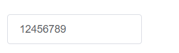


- 上图实现代码

    


- `el-input`组件使用说明
    - 必须为`el-input`双向绑定一个值


### Input Attributes


### Input Slots


### Input Events


### Input Methods


## 6.2 Select 选择器

### 基础用法

[Select 选择器](https://element.eleme.cn/#/zh-CN/component/select)


- 上图实现代码
    - 


- `Select`组件说明
    - `el-select`中的`v-model`的值为当前被选中的`el-option`的 **value 属性值**


### Select Attributes


### Select Events


### Select Slots


### Option Attributes


## 6.3 Switch开关

### 基础用法

- [Switch开关](https://element.eleme.cn/#/zh-CN/component/switch)

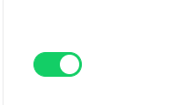


- 上图实现代码

    - ```html
        <el-switch
          v-model="value"
          active-color="#13ce66"
          inactive-color="#ff4949">
        </el-switch>
        
        <script>
          export default {
            data() {
              return {
                value: true  // 双向绑定开关数据
              }
            }
          };
        </script>
        ```

        

- `Switch`组件使用说明

    - 绑定`v-model`到一个`Boolean`类型的变量。可以使用`active-color`属性与`inactive-color`属性来设置开关的背景色。


### Switch Attributes

- 


### Switch Event

- 


## 6.4 Cascader 级联选择器

### 基础用法

- [Cascader 级联选择器](https://element.eleme.cn/#/zh-CN/component/cascader)

    


- 上图代码实现

    


- `Cascader`组件使用说明
    - 使用`Cascader`组件时，必须动态绑定`props`属性，然后传入**配置项**
    - 在配置项中指定**数据源**中的**每个节点所绑定值的属性名**，以及要**每个节点要展示内容的属性名**


### Cascader Attributes


### Cascader Events


### Cascader Config


## 6.5 Checkbox 多选框

### 基础用法

- [多选框](https://element.eleme.cn/#/zh-CN/component/checkbox)

    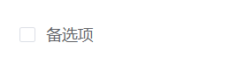


- 上图代码实现

    


- `el-chechbox`组件使用说明
    - 在`el-checkbox`元素中定义`v-model`绑定变量，单一的`checkbox`中，默认绑定变量的值会是`Boolean`，选中为`true`。


### 多选框组

- 多选框组描述：适用于**多个勾选框绑定到同一个数组**的情景，通过是否勾选来表示这一组选项中选中的项。

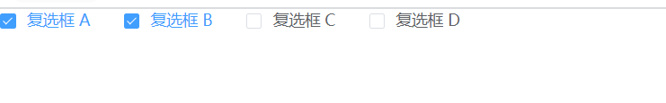


- 上图代码实现

    


- `el-checkbox-group`组件使用说明
    - `el-checkbox-group`元素能把多个` el-checkbox` 管理为一组
    - 需要为`el-checkbox-group`元素双向绑定一个数组类型的数据
    - ` el-checkbox` 中**label**的值与`el-checkbox-group`绑定的数组中的元素值相对应，如果存在指定的值则为选中状态，否则为不选中。
    - 当`el-checkbox`没有被选中时，其`el-checkbox-group`**双向绑定的数据就会发生变化**


### Checkbox Attributes


### Checkbox Events


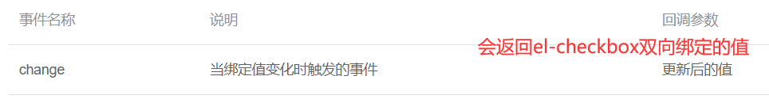


### Checkbox Group Attributes


### Checkbox Group Events

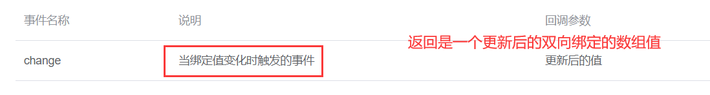


## 6.6 Upload 上传


### 基础用法

- [图片文件上传](https://element.eleme.cn/#/zh-CN/component/upload)

    


- 上图实现代码

    


- `el-upload`组件使用说明

    - 必须为`el-upload`元素指定**action**属性，该属性用于指定图片上传到哪个服务器下

    - 在`el-upload`元素中嵌套的`el-button`按钮会**自动发送网络请求**，将图片上传到指定的URL地址下

    - 在`el-upload`元素中的**list-type**属性用于选择上传后的图片列表的展示类型

        - 可选值：text/picture/picture-card，**默认值为展示文本类型列表**

    - 使用`el-upload`上传文件的默认请求方式为`post`

      

      

### Upload Attribute


- 代码演示：

    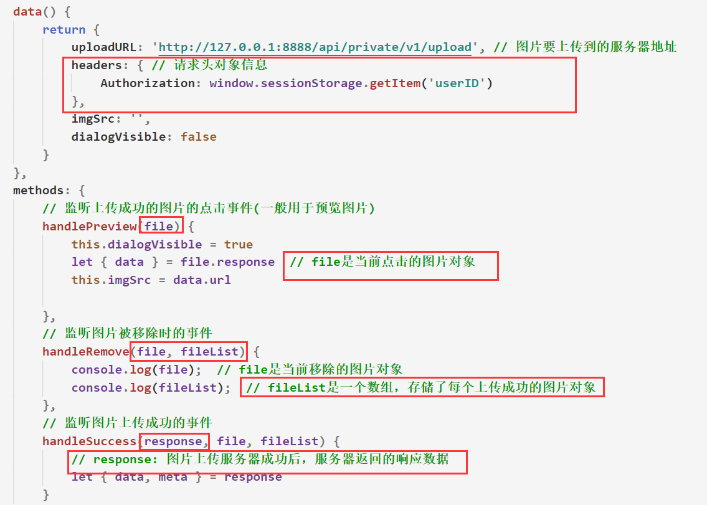


- file、fileList、response所存储的数据

    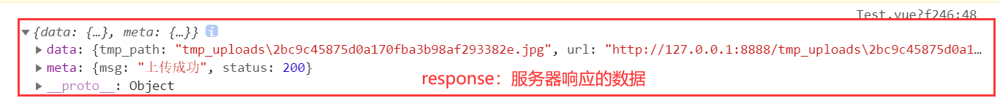


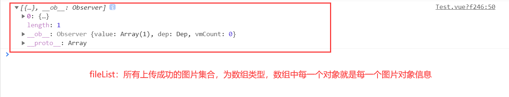


### Upload Methods

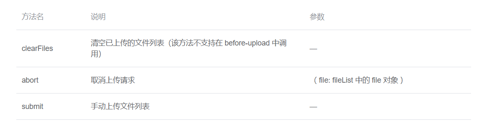


# Element-UI 开发 (七) --- 布局


## 7.1 Layout 布局

### 基础用法

- [Layout布局参考](https://element.eleme.cn/#/zh-CN/component/layout)


- **栅栏布局**代码实现：

    - ```html
        <el-row>
          <el-col :span="24"><div class="grid-content bg-purple-dark"></div></el-col>
        </el-row>
        <el-row>
          <el-col :span="12"><div class="grid-content bg-purple"></div></el-col>
          <el-col :span="12"><div class="grid-content bg-purple-light"></div></el-col>
        </el-row>
        ....
        ```

        

- **栅栏布局**代码说明：
    - 使用 row 和 col 组件，`el-row`表示行 ，`el-col`表示在行中的列，通过 col 组件的 `span` 属性可以指定**列在行中所占的宽度**。
    - `el-row`将每一行分成了24份，以便于`el-col`分配


### Row Attributes

- 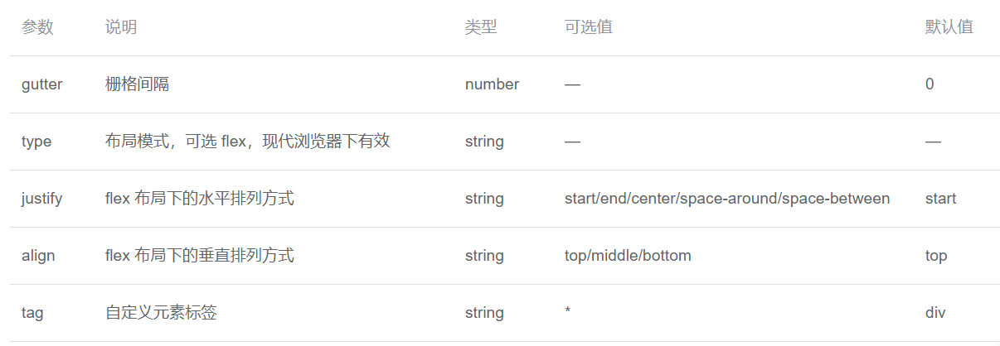


### Col Attributes

- 


## 7.2 Container 布局容器

### 基础用法


- 上图实现代码

    - ```html
        <el-container>
          <el-header>Header</el-header>
          <el-container>
            <el-aside width="200px">Aside</el-aside>
            <el-main>Main</el-main>
          </el-container>
        </el-container>
        ```

        

- Container 布局容器**说明**

    - 可以方便快速搭建页面的基本结构

    - `el-container`：外层容器。当子元素中包含 `el-header` 或 `el-footer` 时，全部子元素会垂直上下排列，否则会水平左右排列。

    - `el-header`：顶部容器

    - `el-aside`：侧边栏容器。

    - `el-main`：主要区域容器。

    - `el-footer`：底栏容器

        

- 如果希望`Main`区域滚动时，`header和aside`区域会**固定在页面**中，则需要给`el-container`元素一个固定高度

    - ```css
        .el-container {
            height: 90vh;
        }
        ```

        


### Container Attributes

- 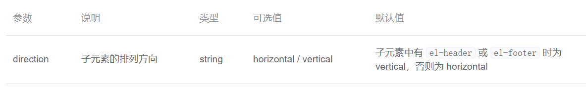


### Header Attributes

- 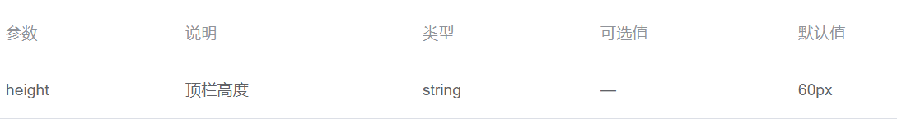


### Aside Attributes

- 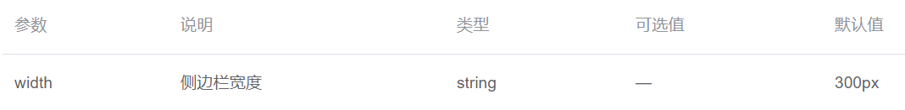


### Footer Attributes

- 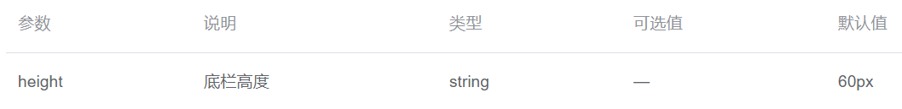


