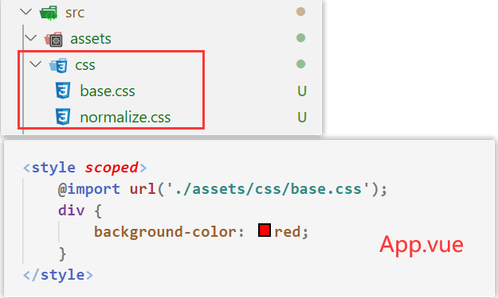
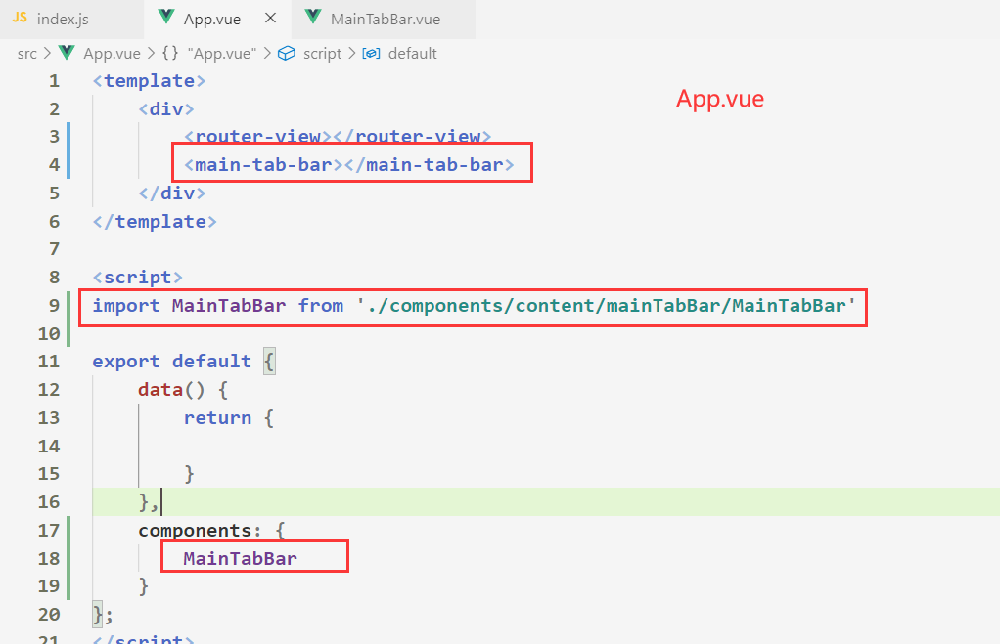
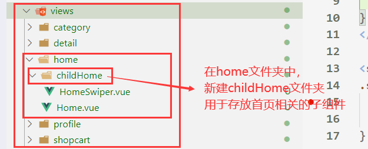
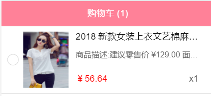

# 一、Vue项目实战（一）--- 首页

## 1.1 项目初始化

1. 使用`vue-cli3`搭建项目结构：`vue create 项目名称`

  ​    

2. 将项目代码交给git托管，指定`码云平台`的***远程仓库***进行推送

    

    ​    

3. ***划分目录结构***

    


4. 引入初始化的CSS文件和img图片资源

    		  1 


5. 添加`vue.config.js` 和 `editorconfig` 配置文件

    

    - 注意：修改了***配置文件***必须重新执行一次`npm run serve`，***配置文件才会生效***


## 1.2 引入MainTarbBar组件


1. 在APP.vue中引入之前***Vue-router***项目中封装好的`TabBar`组件，并且配置路由映射关系
    - 需要在App.vue中添加`router-view`标签，***根据路由展示对应的组件***





2. **项目模块的划分**
    - 核心：`MainTabBar.vue `---> 路由映射关系


- **每一个tabbar下的item对应着不同的视图组件**

​	


## 1.3 封装导航栏

1. 封装一个导航栏组件


2. 在`Home组件`中引入导航栏组件

    


## 1.4 引入网络请求文件和loading组件


- 在这次Vue项目中，我们采用`axios`库进行网络请求，与此同时，我们希望

    - 一旦有网络请求发送，就展示`loading组件`
    - 一旦网络请求结束了，就让`loading组件隐藏`

    - 核心：`axios的拦截器`和`Vuex状态管理`

- 实现代码：

    


## 1.5 请求首页的数据

1. 在`network`文件夹下新建一个`home.js`文件，该文件用于***存放请求首页相关数据的方法***
2. 在`Home.vue`文件下，导入请求首页数据的方法，并且调用，***将请求到的数据赋值到当前组件实例下***


3. 重新整理请求到的首页数据

    


4. 在浏览器`vue devtools`插件中查看 Home组件是否有了相关数据

    


## 1.6 轮播图展示


1. 在`components ---> common`文件夹中引入已经封装好的轮播图组件


2. 在`views ---> home`下新建一个`childHome`文件夹，该文件夹中用于存放首页视图相关的**子组件**

    


3. 在`childHome`文件夹中新建`HomeSwiper.vue`文件，该文件用于存放**首页**中***轮播图的相关视图组件***

    


4. 在`Home.vue`文件中将`HomeSwiper.vue`组件注册使用，并且传递该组件所需要的轮播图数据

    


## 1.7 推荐区展示

- 在`home --> childHome`文件夹中新建`HomeRecommend.vue`文件，用于存放**首页**中***推荐区视图组件***

    


- 在`Home.vue`文件下，使用该组件并且传递该组件需要的数据

    


## 1.8 流行区域展示

1. 在`home --> childHome`文件夹中新建`HomePopular.vue`文件，用于存放**首页**中***流行区视图组件***

    


2. 在`Home.vue`中引入并使用该组件

    


## 1.9 TabControl的封装

1. components -> content -> tabControl 下，新建`TabControl.vue`文件，该文件主要用于存放选项卡组件

    


2. 在`Home.vue`中使用该组件，并传递给该组件一些数据

    


3. 在`Home`组件中，将选项卡设置为***粘性定位***，设置粘性定位时，父组件不能设置为***100vh***

    


# 二、Vue项目实战（二）--- 首页

## 2.1 保存商品的数据结构

1. 在network ---> home.js中，封装一个***请求首页商品数据***的***网络请求方法***，并且将该方法导出

    


2. 在`home.vue`中设计一个保存商品列表的***数据结构***

    - ```js
        // 首页商品列表的数据结构，页数默认为第一页，
        goods: {
            pop: { page: 1, list: [] },
            new: { page: 1, list: [] },
            sell: { page: 1, list: [] },
        }
        ```

        

3. 将`home.vue`中发送***网络请求***的代码封装到`methods`下，`mounted`生命周期函数中只负责调用`methods`下的方法

    

    

4. 在`methods`下封装一个***请求和保存商品数据的方法***

    - ```js
        // 调用该方法时，需要传入请求商品的类型
        get_HomeGoods(type) {
            // 获取当前请求商品类型的页数
            const page = this.goods[type].page
            // 根据商品类型和页数，发送网络请求
            getHomeGoods(type, page).then(res => {
              	 // 获取到的数据是一个数组，追加到对应的商品类型下的list中
            		this.goods[type].list.push(...res.list)
                  // 每次获取商品数据后，就要将请求的商品类型的页数加1
              	 // 以便于下次请求+1后的页码数据
            		this.goods[type].page ++
            })
        }
        ```

        

5. 在`home.vue`的`mounted`生命周期函数中，分别调用方法，获取`流行`、`新款`、`精选`商品的第一页数据

    


6. 通过浏览器的`vue tools`插件，查看是否获取到了数据

    


## 2.2 展示商品列表

1. 在componetns --> content ---> goodList文件夹下 新建`GoodList.vue`，该文件主要用于展示商品列表组件

    

    


2. 在`Home.vue`中引入`GoodList.vue`组件并且使用，***默认传入类型为pop的商品数据***

    


## 2.3 TabControl点击切换商品

1. 监听每个TabControl-items的点击事件，当触发点击事件时，***传入v-for遍历的索引值，并作为参数发射给父组件***

    


2. 在`Home.vue`中监听`TabControl.vue`发射的事件，***根据子组件传递的索引值，动态决定要展示的商品内容***

    


## 2.4 封装 Scroll 组件

1. 在 components -> common -> scroll 中新建**scroll.vue**文件

2. 我们采用的是 better-scroll 对项目的**滚动条进行重构**，因此最好先去过一遍 **Better Scroll的基本使用**

3. 在`scroll.vue`文件中写入如下代码，并预留插槽

    

    

4. 在***home.vue***文件中，引入***scroll***组件，并将**需要用到滚动条的内容区域填充到scroll组件中**

    

    

5. ***指定scroll组件的高度***

    - ```css
        #home .scroll-wrap {
        	height: calc(100vh - 93px);
        }
        ```

        

- 出现的小BUG：由于商品的图片时异步加载的，因此**可滚动的内容元素的高度小于预期**，会出现滚动不正常的情况。
    - 此时你应该在图片加载完成后，比如 **onload 事件回调**中，调用 `bs.refresh` 方法，它会重新计算最新的滚动距离。


## 2.5 封装BackTop组件

1. 在 components -> common -> ***backTop*** 中新建**BackTop.vue**文件

    


2. 在`home.vue`文件中引入该组件，并且实现***点击***后**回到better scroll所指定的区域顶部**

    


3. 实现BackTop组件的***显示和隐藏功能***

    


## 2.6 实现上拉加载更多功能

1. 在`home.vue`下的`mounted`生命周期函数中，调用实现上拉加载更多的方法

    - ```js
        mounted() {
            // 调用监听pullingUp事件，实现上拉加载更多的方法
            this.loadMore()
        },
        ```

        

2. 在`home.vue`下的`methods`中，***定义实现上拉加载更多的方法***

    - ```js
        methods: {
            // 上拉加载更多
            loadMore() {
                // 监听better scroll 滚动区域是否滚动到了最底部
                this.BScroll.on('pullingUp', () => {
                    // 发送网络请求，获取当前商品类型的商品数据
                    this.get_HomeGoods(this.currentType)
                    // 结束本次的pullingUp事件，继续下一次的pullingUp事件
                    this.BScroll.finishPullUp()
                    // 由于DOM中加载了新的商品数据，因此需要重新计算最新的可滚动区域
                    this.BScroll.refresh()  
                })
              },
          }
        ```

        


## 2.7 解决可滚动区域问题

- 渲染商品列表数据，是通过发送网络请求渲染的，而加载这些通过网络请求获取的图片，属于异步操作
    - 而此时，better scroll 在计算可滚动区域的高度时，由于图片还没加载到页面上，因此可滚动区域的高度是不包含图片的，这样一来可滚动区域就会变得非常小
    - 此时你应该在图片加载完成后，监听图片的 **onload 事件**，调用 `bs.refresh` 方法，它会重新计算最新的滚动距离。


- 解决方案：
    1. 将`better scroll 实例`存放到`home.vue`组件下
    2. 给滚动区域内商品列表的img元素绑定**load**事件，当图片加载完后**向父组件发射事件**
    3. 父组件拦截子组件发射的事件，然后重新计算可滚动区域的高度


## 2.8 重新实现TabControl的吸顶效果

- 出现的问题：

    - 当使用better-scroll包裹首页的可滚动区域时，我们会发现之前封装好的TabControl组件的**吸顶效果没有**了

    - 这是因为在better-scroll中，***内容区的子元素的定位效果是无法生效的***

    - ```html
        <div ref="wrap">
            <div class="content">
            		// 在content区域内的子级元素的定位是无法起效果的
            </div>
        </div>
        ```

        

- 解决方案

    - 在***scroll组件***外部，复制一个TabControl组件，该组件默认不展示，当**滚动到一定区域时，该组件会被会展示**

    


## 2.9 Home离开时记录状态和位置

- 我们希望在跳转到其他路由页面时，`home.vue`组件不要被频繁的销毁和创建，并且再次进入到home组件时，能够直接**停留在上次离开的位置**，如何做到？

1. 在App.vue中，给路由视图标签包裹一个`keep-alive`标签

    - ```html
        <keep-alive include="Home">
        	<router-view></router-view>
        </keep-alive>
        ```

        

2. 如果跳转其他路由后，再次进入home组件没有回到离开前的位置，那么多半是better-scroll的问题，我们可以通过`activated`和`deactivated`生命周期函数，来在home组件离开前和进入前做一些记录

    - ```js
        data: {
        	return {
        		saveY: 0  // 记录home首页离开前的y坐标
        	}
        activated() { // 进入home组件时，直接跳转到上次离开时记录的y坐标
        		this.homeBScroll.scrollTo(0, this.saveY, 0)
          	 this.homeBScroll.refresh()
        },
        deactivated() { // 离开home组件时，记录离开时的滚动的y坐标
        		this.saveY = this.homeBScroll.y
        },
        ```

        


# 三、Vue项目实战（三）--- 详情页

## 3.1 跳转详情页并且带路由参数

1. 为每个商品列表添加点击事件，并且传入**商品的iid作为参数**
2. 点击商品时，跳转到`/detail`路由下，将传入的***iid作为路由参数***，进行传递


3. 在 views --> detail ---> 新建***Detail.vue***文件。该组件用于展示**商品的详情页**相关视图

4. 在 router ---> index.js 中，**配置与Detail.vue组件映射的路由**

    


5. 在***Detail.vue***中可以通过`$route.params.iid`来查看路由参数是否正常传递

    


## 3.2 详情页的导航栏封装

- 实现效果：

    

1. 在detail文件夹中，新建***childDetail***文件夹，该文件夹用于存放***详情页相关视图的子组件***

2. 在***childDetail***文件夹中，新建**DetailNavBar.vue**文件，该组件用于存放***详情页的导航栏视图***

    ​	


3. 在**Detail.vue**文件中引入导航栏组件，并使用

    


## 3.3 请求详情页数据

1. 在***netwroak***文件夹中新建**detail.js**文件。该文件用于封装一些请求详情页数据的方法

    

    

2. 在***Detail.vue***文件中导入请求详情页数据的方法，将请求数据的方法定义在`methods`下，并在`mounted`生命周期函数中调用

    


## 3.4 详情页轮播图展示

1. 在**childDetail**文件夹中，新建**DetailSwiper.vue**文件，该文件用于存放详情页的轮播图相关视图

2. 在***Detail.vue***中 引入***DetailSwiper***组件，并将网络请求来的**轮播图数据，传递给该组件**

    ​	

3. DetailSwiper组件**引入封装好的轮播图组件**，将**父组件传递的轮播图数据，进行遍历**

    


## 3.5 整合详情页的基本信息数据


- 我们要在**childDetail**文件夹下新建***DetailBaseInfo.vue***文件，用于存放商品基本信息相关视图
- 上图就是 **DetailBaseInfo.vue** 组件中所要展示的**商品基本数据**，但是后端在返回这些数据时，并没有将这些数据整合到一起，而是分散到不同的对象身上
- 我们需要对这些**数据全部存放到一个对象**身上，让**DetailBaseInfo.vue**面向这一个对象提供的数据来渲染页面


1. 在***network --> detail.js***文件中，封装一个构造函数，该**构造函数用于存储商品的基本数据**

    - ```js
        // 整合DetailBaseInfo组件需要的数据
        class GoodsInfoBase {
            constructor(itemInfo, columns, shopInfo) {
                this.title = itemInfo.title  // 商品的描述信息
                this.nowPrice = itemInfo.lowNowPrice // 商品的新价格
                this.oldPrice = itemInfo.oldPrice // 商品的老价格
                this.discountDesc = itemInfo.discountDesc // 商品的折扣信息
                this.columns = columns  // 销量、收藏等数据 是一个数组
                this.services = shopInfo.services // 商品的服务信息，是个数组
            }
        }
        ```

2. 在**Detail.vue**组件中，调用该构造函数，并且传入构造函数需要的参数，初始化`goodsBaseInfo`数据

    


3. 在`vue tool`插件中查看***DetailBaseInfo.vue***所需要的数据是否整合到了**goodsInfoBase**对象身上

    


## 3.6 详情页商品基本数据的展示

1. **Detail.vue**组件将***goodsInfoBse***数据传递给**DetailBaseInfo.vue**组件上

    


2. **DetailBaseInfo.vue**组件对父组件传递过来的***数据进行展示***

    


## 3.7 整合详情页的店铺数据并且展示

1. 在***childDetail***下 新建***DetailShop.vue***组件，该组件用于存放**商家店铺相关视图**

2. 在network --> detail.js文件中，封装一个构造函数，该构造函数用于**整合商家店铺数据**

    - ```js
        // 整合商家店铺数据
        class ShopInfo {
            constructor(shopInfo) {
                this.shopLogo = shopInfo.shopLogo // 店铺logo
                this.shopName = shopInfo.name // 店铺名称
                this.shopSell = shopInfo.cFans // 销售量
                this.shopGoodsCount = shopInfo.cGoods // 店铺的商品数量
                this.shopScore = shopInfo.score  // 店铺的评分信息  是个数组
            }
        }
        ```

        

3. 在***Detail.vue***中初始化商家店铺数据，并且传递给***DetailShop.vue***组件中

    


4. ***DetailShop.vue***将父组件***传递过来的数据进行渲染***

    


- 最终实现效果如下

    


## 3.8 商品详情数据展示

1. 在 ***childDetail*** 下 新建 ***DetailGoodInfo.vue*** 组件，该组件用于存放**商品详情图相关视图**

2. 在 ***Detail.vue*** 组件中 声明一个 **goodsDetailInfo** 变量，用于作为传递给 ***DetailGoodInfo.vue***组件的数据

    - ```js
        // 4. 商品详情数据
        this.goodsDetailInfo = res.detailInfo
        ```

        

3. ***DetailGoodInfo.vue*** 组件接收到父组件传递过来的数据，将其渲染展示

    


## 3.9 商品参数的展示

1. 在 ***childDetail*** 下 新建 ***DetailGoodParams.vue*** 组件，该组件用于存放**商品参数相关视图**

2. 在 ***Detail.vue*** 组件中 声明一个 **goodParams** 变量，用于作为传递给 ***DetailGoodParams.vue***组件的数据

    - ```js
        // 5. 商品参数信息
        this.goodParams = res.itemParams
        ```

        

3. ***DetailGoodParams.vue*** 组件接收到父组件传递过来的数据，将其渲染展示

    


- 该组件渲染的效果如下

    


# 四、Vue项目实战（四）--- 详情页


## 4.1 评论信息的展示

1. 在 ***childDetail*** 下 新建 ***DetailComment.vue*** 组件，该组件用于存放**用户评论相关视图**

2. ***Detail.vue*** 组件中将网路请求到的**评论数据**，传递给 ***DetailComment.vue***组件

    - ```js
        // 6. 用户评价数据
        this.commentInfo = res.rate
        ```

        

3. ***DetailComment.vue***组件根据父组件传递过来的数据进行页面渲染

    


4. 最终实现效果如下

    


## 4.2 推荐商品列表的展示

1. 在 ***childDetail*** 下 新建 ***DetailRecommendInfo.vue*** 组件，该组件用于存放**用户评论相关视图**

2. 在 network --> **detail.js** 中封装一个获取推荐商品列表数据的方法

    - ```js
        // 获取详情页中的推荐商品列表的数据
        function getDetailRecommendGoods() {
            return myaxios({
                url: '/recommend',
            })
        }
        ```

3. ***Detail.vue*** 组件中将网路请求到的**推荐商品列表数据**，传递给 ***DetailRecommendInfo.vue***组件

    - ```js
        // 7. 请求 推荐商品列表 的数据
        get_DetailRecommendGoods() {
            getDetailRecommendGoods().then(res => {
                this.recommendGoods = res.list
            })
        }
        ```

        

4. ***DetailRecommendInfo.vue***组件根据父组件传递过来的数据进行页面渲染

    


## 4.3 底部导航栏的展示

- 实现效果：

    


1. 在 ***childDetail*** 下 新建 ***DetailBottomBar.vue*** 组件，该组件用于存放**底部导航栏视图**

2. 该组件**不需要通过服务器返回的数据进行渲染**，因此我们可以直接写一个组件

    


## 4.4 顶部标题和内容的联动效果

- 需求：

    1. 我们希望当点击顶部导航栏的选项时，页面会滚动到对应位置

    2. 当我们滚动到指定位置时，顶部导航栏的状态也会跟着动态发生变化


- 点击标题**滚动到对应位置**

    


- **滚动内容时，显示正确的标题高亮**
    - 


## 4.5 点击加入购物车

1. 在`detailBottomBar.vue`中，**监听加入购物车的事件**，并且传递给父组件

    

2. ***Detail.vue*** 组件监听子组件发射的事件，并将当前详情页商品数据，以及购物车需要展示的商品数据，**整合到一个对象身上**

    


3. 在Vuex中的**state**下，定义一个**cartList**属性，该属性为***数组类型***，***用于存放购物车商品列表***

    


4. 在Vuex中的**mutations**下，定义一个**addToCart**方法，该方法用于***更新cartList状态***

    


5. 在 ***Detail.vue***中如果想将**加入购物车的商品交给Vuex管理**，那么必须经过**提交mutaions**这一步！

    


6. 在**mutations**中的**addToCart**方法下，判断当前要加入购物车的商品是否已经存在 ***cartList*** 中，

    - 如果存在，则该***商品不会被追加到数组中***，并且cartList中存放该商品元素的count属性会+1
    - 如果不存在则将当前商品加入到 ***cartList*** 数组中

    

    

- 现在我们完成了**加入购物车商品交给Vuex管理的步骤**


# 五、Vue项目实战（五）--- 购物车

## 5.1 购物车导航栏的展示


- 在上一步中，我们将要添加到购物车的商品信息全部存储到了**Vuex中的cartList数组中**

- 现在，购物车页面的开发，都是**面向于Vuex中存储的catList数组进行开发**


1. 购物车导航栏需要**展示当前购物车商品的个数**，因此可以在**Vuex中的getters**中计算好商品的数量

    


2. ***Shopcart.vue***组件直接引入公共的导航栏组件，并且使用

    

    

- 购物车导航栏实现效果
    - 


## 5.2 购物车商品的展示


1. 在 ***childShopCart*** 文件夹下，新建 ***ShopCartList.vue*** ，该组件用于展示购物车商品的相关视图

2. **遍历Vuex中的cartList数据**，展示购物车商品列表视图

    


- 购物车商品列表实现效果如下

    


## 5.3商品的选中和不选中切换


- 商品的选中和不选中状态，同样也是**需要放在Vuex下进行管理**

1. 在 ***Detail.vue*** 组件中在添加到购物车的商品对象中，添加一个***checked属性***，该属性用于记录商品是否处于选中状态，默认为不选中状态

    


2. 为每个选中图标按钮绑定一个点击事件，并且**传入当前迭代的元素**，当触发点击事件时，***提交对应的mutations***，用于**修改当前点击对象的checked属性**。

    - 核心：每一次点击，对应的商品对象的checked就取反

    


3. 给选中图标动态的绑定 **active** 类名，遍历的商品对象的checked属性值，决定这个类名是否生效

    


- 以上步骤就**完成了商品选中和不选中的切换了**


## 5.4 底部工具栏的汇总


1. 在***childShopCart***下新建 ***ShopCartBottomBar.vue***，该组件用于展示购物车底部工具栏视图

    

    

2. 底部工具栏要展示**选中商品的总价钱**以及**选中的商品的数量**，为此，我们可以在`getters`中定义这两个计算属性

    


3. 购物车底部工具栏实现效果

    


## 5.5 实现全选按钮的功能


- 当点击底部工具栏的全选按钮时，**提交mutations并且传入全选按钮的状态**，用于修改每个商品对象的checked值

    


## 5.6 实现单选和多选按钮的联动效果

- 如果当前**选中的商品数量**等于Vuex -> **cartList数组的长度**，则说明全部商品都被选中了，此时多选按钮应该高亮显示，如果实现？

    

1. 在`ShopCartList.vue`中每点击一次单选按钮时，就判断当前选中的商品数量是否等于cartList数组长度，并且将判断的结果，发射给中央事件总线。

    


2. 在底部工具栏组件中的`mounted`生命周期函数中，监听名为***checked***的中央事件总线，根据其传入的参数，判断多选按钮是否为高亮状态

    


# 六、Vue项目实战（六）--- 购物车

## 6.1 优化mutations代码

- 一般情况下，mutations下都是**用于存放直接修改Vuex状态的代码**，如果`mutations`下的方法逻辑判断过于复杂时，可以抽离到`actions`中

  ​    

- 现在，我们将`mutations`中更新购物车数据的逻辑判断代码，抽离到`actions中`

    


## 6.2  actions返回Promise

- 我们希望当点击加入购物车时，在Detail.vue组件中能够知道`actions`中完成了什么样的操作，并且希望当`actions`提交`mutations`后，能够反馈给Detail.vue

- 这时候我们就要为**actions包装一个Promise**

    


- 当detail组件点击加入购物车时，会调用updataCart方法，该方法会返回一个Promise对象

    


- 这个时候我们就能够知道actions下的updataCart方法什么时候执行完毕


## 6.3 封装Toast  -- 普通封装


1. 在components --> common -> toast -> 新建Toast.vue组件，该组件用于展示加入购物车后**显示的弹窗视图**

    

2. 在Toast.vue组件的***methods***下，封装一个方法，用于让**父组件决定要展示的内容**，以及时间等

    


3. Detail.vue组件引入 Toast组件，并且使用，当**点击加入购物车并且actions内部提交mutaions后，展示toast组件**

    


## 6.4 封装Toast -- 插件封装


- 如果Toast组件用的非常频繁，那我们需要反复的引入组件，注册组件， 使用组件
- 通过插件封装的方式封装组件，可以省去以上步骤，直接调用即可

1. 在toast文件夹下新建**index.js**文件，并写入如下代码

    - ```js
        import Toast from './Toast.vue'
        const obj = {}
        
        obj.install = function(Vue) {
          // 1. 创建组件构造器，传入组件对象
          const toastConstructor = Vue.extend(Toast)
        
          // 2. 根据组件构造器创建一个组件对象
          const toast = new toastConstructor()
        
          // 3.将组件对象，手动挂载到一个元素上
          toast.$mount(document.createElement('div'))
        
          // 4. 添加到DOM结构中
          document.body.appendChild(toast.$el)
        
          // 5. 添加$taost 属性
          Vue.prototype.$toast = toast
        }
        
        export default obj
        // 6. 在main.js中 注入 Vue.use(toast)
        ```

        

2. 当其他组件想要使用toast组件时，不需要通过引入、注册、使用等步骤，而是直接通过`this.$toast.show()`直接使用组件，决定组件的展示

    - ```js
        // 提交actions 传入要加入购物车的商品数据
        this.$store.dispatch('updataCart', good).then(res => {
        		this.$toast.show(res, 2000)
        })
        ```

        


## 6.5 scroll封装购物车

​	


# 七、Vue项目实战（七）--- 分类

## 7.1 获取分类页面数据

- 


# 八、项目优化

## 8.1 解决better scroll覆盖bug

- 我们在浏览器测试项目运行时，项目没有问题，当我们用手机测试查看项目时，会发现手机里的滚动区域直接覆盖了导航栏和底部工具栏，这时候我们就需要为**scroll组件设置为固定定位**

- 凡是使用scroll包裹的区域，都必须给scroll元素设置被固定定位

    - ```css
        #home .scroll-wrap {
            position: fixed;
            top: 44px;
            height: calc(100vh - 93px);
        }
        ```

        

>最好为**scroll-wrap**组件中**末尾处**插入多个**br元素**，这样滑动到最底部的时候会美观一些
>


## 8.2 解决移动端300ms延迟

- `fastclick`插件教程：https://github.com/ftlabs/fastclick

- 使用步骤：在main.js中写入下面代码

    - ```js
        // 解决移动端300ms延迟
        import FastClick from 'fastclick'
        FastClick.attach(document.body)
        ```

        


## 8.3 图片懒加载

- 图片懒加载的概述：
    - 图片延迟加载在可***提高网页下载速度*** ，也能***帮助减轻服务器负载***， 当我们页面滑动到可视区域，再显示图片

>注：如果**vue-lazyload失效**了，**要考虑是否与其他UI冲突**，需要**将lazyload配置放在其他UI库前面**
>

- 图片懒加载插件教程：https://github.com/hilongjw/vue-lazyload

1. 在main.js文件中 安装、使用插件

    - ```js
        // main.js
        import VueLazyload from 'vue-lazyload'
        Vue.use(VueLazyload, {
            // 必须通过require导入加载时图片的src
            loading: require('./assets/img/common/lazyloading.png'),
        })
        ```

        

2. 在Vue模板区域中 将需要懒加载的图片的***src属性***替换为`v-lazy`指令

    - ```html
        <ul>
          <li v-for="img in list">
            
          </li>
        </ul>
        ```

        


## 8.4 css单位转换


- 我们可以通过插件来帮助我们实现**px单位根据不同屏幕尺寸，转换为vw单位**，进行**布局自适应**

1. 安装插件

    - `npm i postcss-px-to-viewport D`

2. 在一级目录中新建**postcss.config.js**，然后在文件中添加以下代码

    - ```js
        module.exports = {
            plugins: {
                autoprefixer: {},
                "postcss-px-to-viewport": {
                    viewportWidth: 375, // 视口的宽度，对应的时设计稿的宽度/2，一般为750
                    viewportHeight: 667, // 视口的高度，对应的是设计稿的高度
                    unitPrecision: 5, // 指定‘px’转换为视口单位值的小数位数
                    viewportUnit: 'vw', // 指定需要转换成的视口单位，建议使用vw
                    selectorBlankList: ['ignore', 'tab-bar'], // 指定不需要转换的类
                    minPixelValue: 1, // 小于或等于‘1px’不转换为视口单位
                    mediaQuery: false,// 允许在媒体查询中转换为‘px’
                    exclude: [/MainTabBar/]  // 不需要转化的组件文件名正则
                }
            }
        }
        ```

        


# Better Scroll的使用

## 1.1 Better-Scroll 起步

### 1.1.1 Better-Scroll 介绍

- **BetterScrol**l 是什么？

    - **BetterScroll** 是一款解决移动端（已支持 PC）各种**滚动场景需求的JS插件**。

    - ***better-scroll2***：中文文档：https://better-scroll.github.io/docs/zh-CN/

      ​    

      ​    

### 1.1.2 Better Scroll 安装

- **script标签加载**

    - ***不具备插件功能***：不具备上拉加载功能，需要额外下载插件

        - ```js
            <script src="https://unpkg.com/@better-scroll/core@latest/dist/core.js"></script>
            
            let bs = new BScroll() // 创建better scroll实例
            ```

            

    - ***具备插件功能***

        - ```js
            <script src="https://unpkg.com/better-scroll@latest/dist/better-scroll.js"></script>
            
            let bs = BetterScroll.createBScroll() // 创建better scroll实例
            ```

            

    

- **NPM下载**

    - ***不具备插件功能***：不具备上拉加载功能，***需要额外下载插件***

        - ```js
            npm install @better-scroll/core --save
            
            import BScroll from '@better-scroll/core' // 引入
            let bs = new BScroll('.wrapper', {}) // 创建better scroll实例
            ```

    - ***具备插件功能***

        - ```js
            npm install better-scroll --save
            
            import BScroll from 'better-scroll'  // 引入
            let bs = new BScroll('.wrapper', {}) // 创建better scroll实例
            ```

            

    

    

### 1.1.3 Better Scroll 基本使用

1. 使用Better-scroll插件时，需要有**特定的HTML结构**

    - ```html
        <div class="wrap">
          <ul class="content">
            <li>...</li>
            <li>...</li>
            ...
          </ul>
        </div>
        ```

    - 对需要使用 BetterScroll 的内容区在外层包裹一个div 作为***父容器（wrapper）***

    - 父容器（wrapper）下只能有一个***子元素（content）***，该子元素里存放的就是内容区

    - 必须给***父容器(wrapper)设置一个固定高度***


2. 实例化***Better-scroll***

    - ```js
        new BScroll('.wrap', {
        	// opation....
        })
        ```

    - 实例化的第一个参数可以是一个***原生的 DOM 对象***。如果传递的是一个字符串，***BetterScroll 内部会尝试调用 querySelector 去获取这个 DOM 对象。***

    - 传入的**DOM对象就是父容器**，用于***指定要使用better-scroll***的区域


### 1.1.4 Better Scroll 滚动原理


- 蓝色部分为 ***wrapper***，也就是父容器，它会有**固定的高度**。
- 黄色部分为 ***content***，它是父容器的**第一个子元素**，**它的高度会随着内容的大小而撑高**。
- **当 content 的高度不超过父容器的高度，是不能滚动的**，而它一旦超过了父容器的高度，我们就可以滚动内容区了，这就是 BetterScroll 的滚动原理。


## 1.2 Better Scroll 配置项

- 在***实例化better scroll*** 时，需要传入许多***配置选项***

    - ```js
        new BScroll('.wrap', {
        	// opation....
        })
        ```

        

- 具体可传入的***配置选项***：https://better-scroll.github.io/docs/zh-CN/guide/base-scroll-options.html#startx

- 以下我们只列举常用的配置选项


### click

- **类型**：`boolean`

- **默认值**：`false`

- **作用**：

    - 在 ***better-scroll*** 区域内的点击事件默认是不生效的，该配置项可以让 ***better-scroll区域内的点击事件生效***

- **示例**：

    - ```js
        new BScroll('.wrap', {
        	click: true  // 在better-scroll区域内的点击事件是否生效 ----- true
        })
        ```

        


###  probeType

- **类型**：`number`

- **默认值**：`0`

- **可选值**：`1|2|3`

- **作用**：

    - 默认情况下 ***better-scroll*** 是不可以实时的监听滚动的位置，`probeType`配置选项用于***侦测滚动区域的位置***
    - 当 probeType 为 0或1的时候，***不侦测实时的位置***
    - 当 probeType 为 2 的时候，会在屏幕滑动的过程中实时的***派发 scroll 事件*** ），**手指松开不触发**
    - 当 probeType 为 3 的时候，不仅在屏幕滑动的过程中，而且会在滚动***动画运行过程中实时派发 scroll 事件***
    
- ***示例***：

    - ```js
        let bs = new BScroll('.wrap', {
          click: true,  // 在better-scroll区域内的点击事件是否生效 ----- true
        	probeType: 3  // 在better-scroll区域内是否实时监测滚动位置
        })
        
        bs.on('scroll', position => { // 触发时机：正在滚动，接收一个参数作为滚动的坐标
          console.log(position.x, position.y)
        })
        ```

        


###  pullup 插件

- `pullup` 插件为 BetterScroll 扩展**上拉加载的能力。**

- 安装：`npm install @better-scroll/pull-up --save`

- 使用：

    - ```js
        import BScroll from '@better-scroll/core'
        import Pullup from '@better-scroll/pull-up'
        
        // 注册插件
        BScroll.use(Pullup)
        
        // 实例化 BetterScroll 时需要传入 pullUpLoad 配置项
        let bs = new BScroll('.bs-wrapper', {
            pullUpLoad: true  // 当滚动到底部时，会派发pullinggUp事件
        })
        
        // 触发时机：当底部下拉距离超过阈值
        bs.on('pullingUp', () => {
          // 实现上拉加载更多功能
          bs.finishPullUp()  // pullingUp事件默认只会调用一次，如果想多次调用则要调用该方法
        })
        ```

- **警告**：

    - `pullingUp`事件默认只会调用一次，如果想多次调用则要调用`bs.finishPullUp()`方法


## 1.3 Better Scroll API

- better scroll API就是**better scroll实例的方法**
- 如果想要彻底了解 BetterScroll，就需要了解其实例的常用属性、灵活的方法以及提供的事件与钩子。
- **API文档**：https://better-scroll.github.io/docs/zh-CN/guide/base-scroll-api.html#%E5%B1%9E%E6%80%A7


### refresh()

- **参数**：无
- **返回值**：无
- **作用**：**重新计算 BetterScroll**，当 DOM 结构发生变化的时候务必要调用确保滚动的效果正常。


### scrollTo(x, y, time)

- **参数**：
    - {number} x 横轴坐标（单位 px）
    - {number} y 纵轴坐标（单位 px）
    - {number} time **滚动动画执行的时长**（***单位 ms***）

- ***坐标永远相对于better scroll 所指定的区域***


### on(type, fn)

- **参数**

    - {string} type 事件名
    - {Function} fn 回调函数

- **返回值**：无

- **作用**：监听当前实例上的回调函数。如：scroll、scrollEnd 等。

  ​    


## 1.4 在vue文件中使用 Better Scroll

1. 引入 ***better scroll 包***

    - ```js
        import BScroll from 'better-scroll'  
        ```


2. 编写 要使用 better scroll 的***HTML模板区域***，需要给 ***.wrap 设置高度***

    - ```html
        <template>
            <div class="wrap">
                <div class="content">
                    // ..内容区域
                </div>
            </div>
        </template>
        ```

        

3. 在`mounted`生命周期函数中，***实例化 better scroll***

    - ```js
        mounted() {
          let bs = new BScroll('.wrap', {  // 创建better scroll实例
            click: true,
            probeType: 2,
            pullUpLoad: true
          }) 
          bs.on('scroll', position => {
            console.log(position.x, position.y);
          })
          bs.on('pullingUp', () => {
            console.log('上拉加载更多');
            bs.finishPullUp()  
          }
        },
        ```

        

4. 如果父组件需要使用当前组件的  ***better scroll 实例时***，可以将`mounted`生命周期中创建的实例，***赋值给data下的数据***


## 1.5 温馨提示


- **任何时候如果出现无法滚动的情况，都应该首先查看 content 元素高度/宽度是否大于 wrapper 的高度/宽度**。这是内容能够滚动的前提条件。

- 如果内容存在图片的情况，可能会出现 DOM 元素渲染时图片还未下载，因此内容元素的高度小于预期，出现滚动不正常的情况。此时你应该在图片加载完成后，比如 **onload 事件回调**中，调用 `bs.refresh` 方法，它会重新计算最新的滚动距离。


