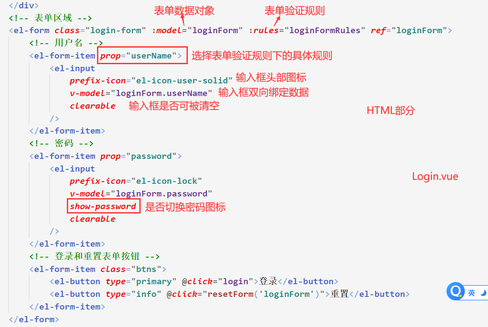
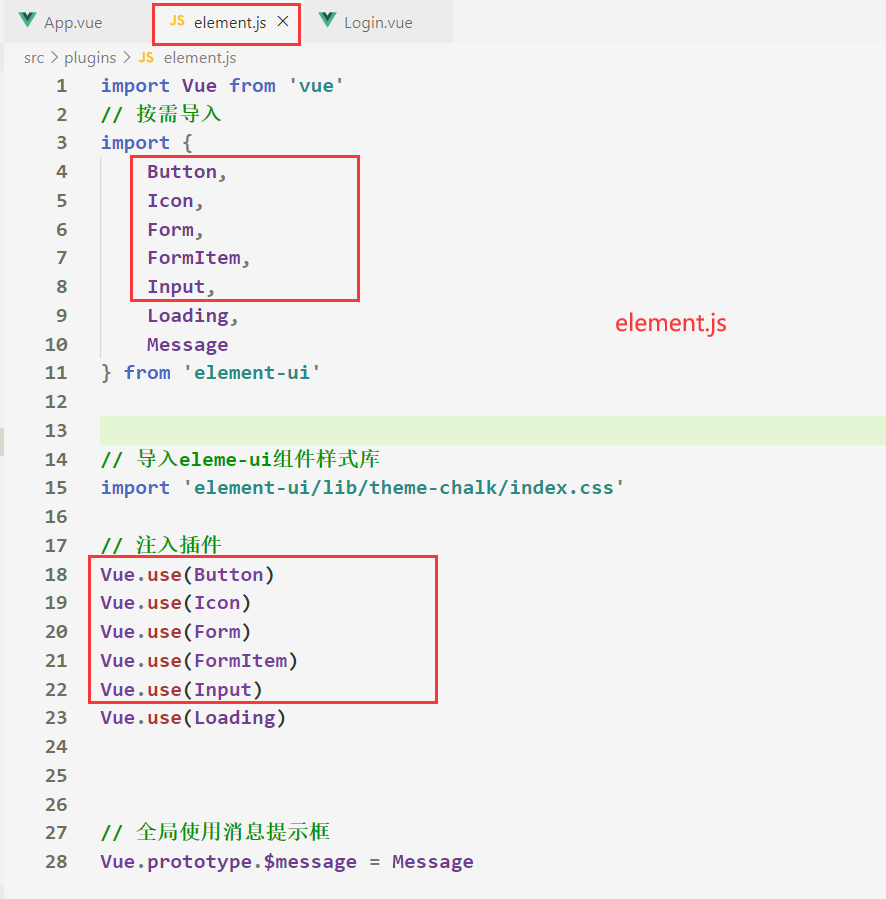
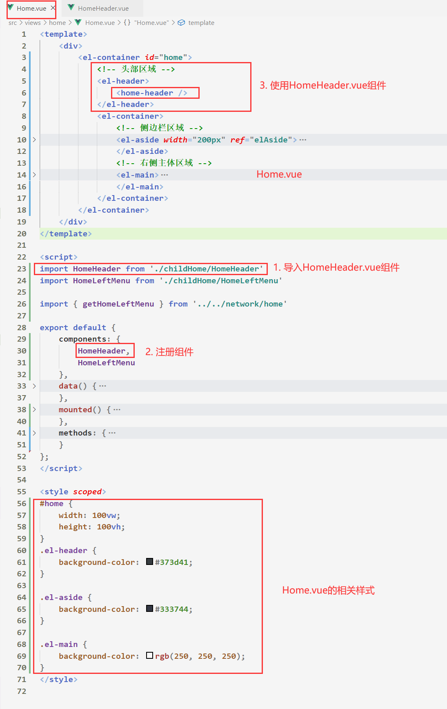
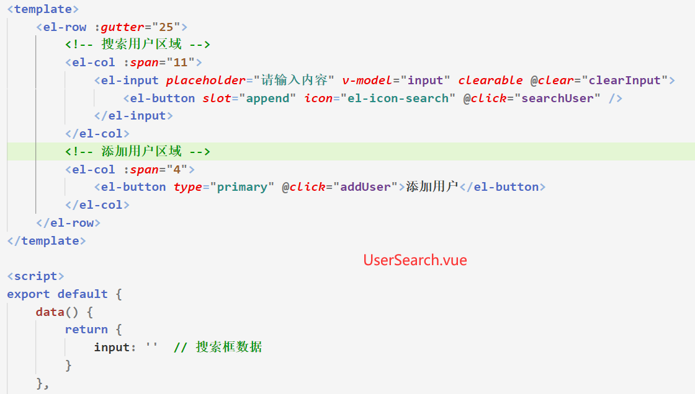
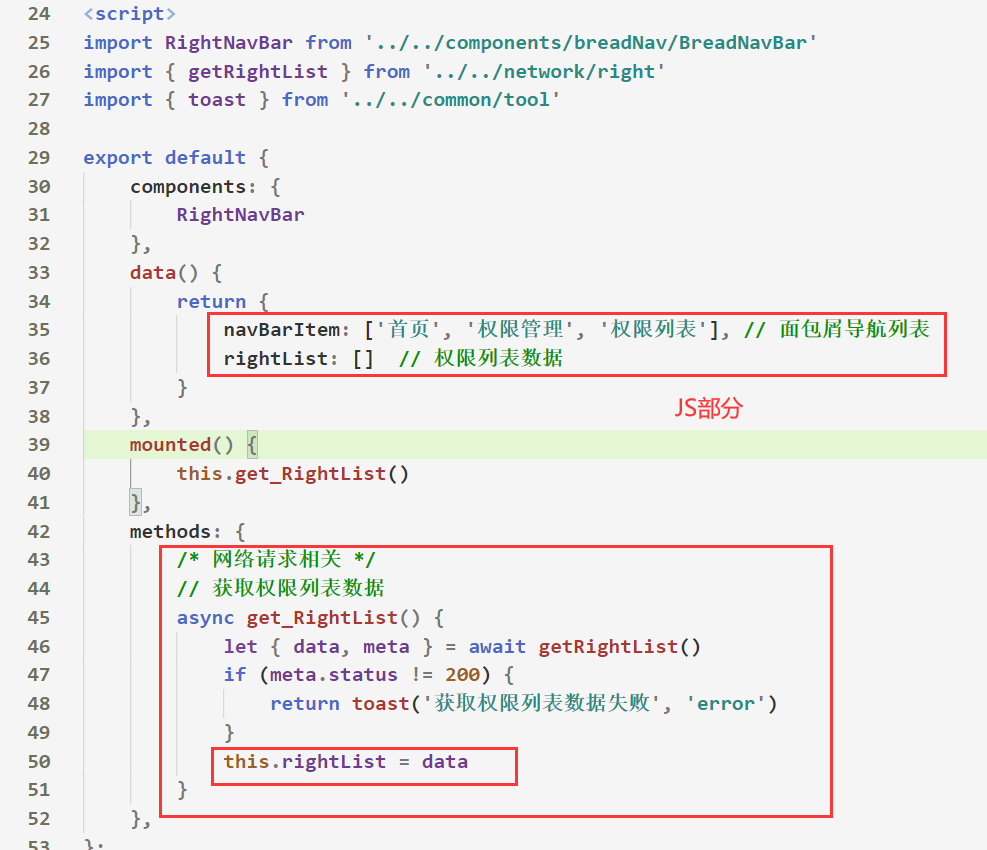

# 电商管理系统 (一) --- 项目初始化

## 1.1 项目概述

- 电商后台管理系统的**功能** 

    - 电商后台管理系统用于管理用户账号、商品分类、商品信息、订单、数据统计等业务功能。 

    


- 电商后台管理系统的**开发模式**

    - 电商后台管理系统整体采用**前后端分离的开发模式**，其中前端项目是基于 **Vue 技术栈的 SPA 项目**。 

    


- 电商后台管理系统的**技术栈**

    1. 前端项目技术栈 

        - Vue 、Vue-router 、Element-UI 、Axios 、Echarts 

    2. 后端项目技术栈 

        - Node.js 、Express 、Jwt 、Mysql 、Sequelize 


## 1.2 前端项目初始化

1. 通过 Vue 脚手架创建项目 

    - `vue create vue_shop`

        

2. 划分项目**目录结构**

    

3. 配置 Vue 路由 

    

4. 配置 Element-UI 组件库 

    

    

    

5. 配置 axios 库 

    

    

6. 在**main.js**中引入**CSS全局样式表**

    

    - 注：JS文件**只能够导入本地资源**，如果想要**导入外链的CSS样式**，则需要通过**HTML文件或style标签**

    

    

7. 将本地项目托管到 Github 或 码云 中 


## 1.3 后端项目的环境配置

- 在**Vue电商项目素材**中将`vue_api_server`文件夹，**作为后台的项目代码**

① 安装 MySQL 数据库 

- 参考：`Node -> 04-MySQL数据库`

- 将`vue_api_server --> db --> mydb.sql `导入到**MySQL**数据库下的**mydb数据库**中，通过`navicat`客户端

    

    

    

② 安装 Node.js 环境 

③ 配置项目相关信息 

- 通过vscode打开`vue_api_server`文件夹，该文件夹作为后端代码

- 修改 ***vue_api_server --> config --> default.json*** 文件，**配置本机相关数据库信息**

    

    

④ 启动项目

- 运行 ***vue_api_server --> app.js*** 文件(先运行`npm i ` 下载依赖的包)，如果不报错并且显示数据库数据，则说明启动成功

    

    

⑤ 使用 **Postman** 测试后台项目接口是否正常 

- 运行 ***Postman*** 文件，根据***Vue电商项目素材--> 电商管理后台 API接口文档***，测试是否能够请求到数据

    


# 电商管理系统 (二) --- 登录/退出 功能

## 1. 登录功能概述

1. 登录业务流程 
        ① 在登录页面输入用户名和密码 
   
      ② 调用**后台接口**进行验证 
   
      ③ 通过验证之后，根据后台的**响应状态**跳转到项目主页 

  

2. 登录业务的相关技术点 
        ① http 是**无状态**的 
   
      ② 通过 **cookie** 在客户端记录状态 
   
      ③ 通过 **session** 在服务器端记录状态 
   
      ④ 通过 **token** 方式维持状态 


3. 登录页面布局

    


## 2. 理解Token

- **什么是Token** ？ 
  
  - **token是服务端生成的一串字符串**，以作客户端进行请求的一个令牌，当第一次登录后，服务器生成一个Token便将此Token返回给客户端，以后客户端只需带上这个Token前来请求数据即可，无需再次带上用户名和密码
  
  ​      
  
- 基于 Token 的身份验证**流程**
    1. 客户端使用用户名跟密码发送网络请求
    2. 服务端收到请求，去验证用户名与密码
    3. 验证成功后，服务端会签发一个 **Token**，再把这个 **Token** 发送给客户端
    4. 客户端收到 Token 以后可以把它存储起来，比如放在 Cookie 里或者 Local Storage 里
    5. 客户端每次向服务端请求资源的时候需要带着服务端签发的 **Token**
    6. 服务端收到请求，然后去验证客户端请求里面带着的 Token，如果验证成功，就向客户端返回请求的数据


- Token **原理**分析 

    

    - 简单来说，Token 就是服务器 验证浏览器 **用户的唯一令牌标识**


## 3. 配置登录页面路由

1. 在 component -> login -> 新建**Login.vue** 文件 ，该组件用于渲染登录页面视图

2. 在router -> index.js 中 导入**Login.vue**组件并且配置该**组件与前端路由映射关系**


## 4. 绘制登录表单区域


- [表单组件参考](https://element.eleme.cn/#/zh-CN/component/form)

1. 绘制默认头像以及基本登录框架视图

    

    


2. 使用***element-ui***绘制**表单区域**




3. 别忘了**按需导入**用到的element-ui 组件

    


## 5. 登录验证请求


- 参考：[消息提示框组件](https://element.eleme.cn/#/zh-CN/component/message)

1. 点击登录按钮时，先判断表单是否校验合法，如果不合法则弹出消息提示框，并且阻止程序向下执行

    ①在***src --> common --> 新建tool.js***文件，该文件用于存放一些公共的方法，比如封装`Message`组件

    

    ②在Login.vue中使用Form组件内置的方法，检查表单是否填写正确，并展示弹窗提示

    


2. 在network 文件夹中新建 ***login.js*** 文件，该文件用于存放***登录验证接口请求***的方法

    - ```js
        import myaxios from './request'
        
        // 登录验证接口请求，接收的参数为表单数据对象
        function loginVerify(LoginInfo) {
            return myaxios({
                url: '/login',
                method: 'post',
                data: {
                    username: LoginInfo.userName,
                    password: LoginInfo.password
                }
            })
        }
        
        export {
            loginVerify
        }
        ```

        

3. 在 Login.vue 中 引入发送网络请求的方法，并且**在表单校验正确后，发送登录验证网络请求**，获取响应数据，根据响应数据下的**meta.status状态码**，来判断用户是否登录成功，并且**展示对应的消息提示框**

    


4. 成功登陆之后，获取服务器返回的**Token**，因为**Token**只应该在**当前网站打开的期间生效**，所以要将该**Token**保存在浏览器的 `sessionStorage`中，参考：`JavaScript API ==> 本地存储`

    - ```js
        toast(meta.msg, 'success') // 消息提示框
        // 将服务器返回的token 存储到sessionStorage对象下
        window.sessionStorage.setItem('userID', data.token) 
        ```

        

    

5. 通过前端路由跳转到`/home`路由下，并且配置**Home.vue与前端路由**的映射关系

    - ```js
        // 跳转到Home首页中
        this.$router.push('/home')
        ```

    


## 6. 配置路由独享守卫

- 如果用户没有登录，但是直接通过URL访问首页，需要重新导航到登录页面。 

    - ```js
        	{
            		path: '/home',
            		component: Home,
            		beforeEnter: (to, from, next) => {
            			// 进入/home路由前判断是否存储Token，如果有则跳转到/home路由,如果没有则跳转到/login路由
            			window.sessionStorage.getItem('userID') ? next() : next('/login')
            		}
            	}
        ```

        


## 7. 实现退出功能

- 在Home.vue中添加`el-button`组件，该**组件实现退出首页功能**
  
- 核心：删除本地存储下的Token，然后跳转/login
  
- ```js
    // 实现退出功能
    exit() {
    		// 删除本地存储的token数据
        sessionStorage.removeItem('userID') 
        // 跳转前端路由
        this.$router.push('/login')
    }
    ```

    


# 电商管理系统 (三) --- 主页布局

## 1. 整体布局


- 使用`Element-UI`提供的布局容器进行布局：[Container 布局容器](https://element.eleme.cn/#/zh-CN/component/container)

    

    - ```vue
        <el-container id="home">
          <!-- 头部区域 -->
          <el-header>Header</el-header>
          <el-container>
            <!-- 侧边栏区域 -->
            <el-aside width="200px">Aside</el-aside>
            <!-- 右侧主体区域 -->
            <el-main>Main</el-main>
          </el-container>
        </el-container>
        ```

    - ```css
        /* CSS样式部分 */
        #home {
            width: 100vw;
            height: 100vh;
        }
        .el-header {
            background-color: #373d41;
        }
        
        .el-aside {
            background-color: #333744;
        }
        .el-main {
            background-color: rgb(250, 250, 250);
        }
        ```

        

    

## 2. 完成Header区域

- HTML部分

    - ```html
        <!-- 头部区域 -->
        <el-header>
            <div class="top">
                <div class="left">
                    
                    <span>电商后台管理系统</span>
                </div>
                <div class="right">
                		<el-button @click="exit" type="info">退出</el-button>
                </div>
            </div>
        </el-header>
        ```

        

- CSS部分：

    - ```css
        .el-header .top {
            display: flex;
            justify-content: space-between;
            align-items: center;
        }
        
        .el-header .top .left {
            display: flex;
            align-items: center;
            font-size: 25px;
            color: white;
        }
        
        .el-header .top .left img {
            margin-right: 20px;
        }
        ```

        

- 实现效果如下：

    


## 3. 重构Home组件代码

- 将**Header区域内的代码抽离到一个组件中**

1. 在views -> home文件夹中新建一个`childHome`文件夹，该文件夹用于存放**Home.vue组件相关的子组件**

    - ```
        ├── views
        │   ├── home
        │   	└── childHome
        |   	└── Home.vue
        ```

        

2. 在***childHome***文件夹下，新建**HomeHeader.vue**组件，该组件用于存放**首页中头部的相关视图**

    


3. 在***Home.vue***中引入***HomeHeader.vue***组件，并且将该组件放在**首页头部区域下**

    


## 4. 左侧菜单布局


- 可以通过`Element-UI`提供的导航栏菜单组件，来帮助我们快速开发，参考：[导航菜单](https://element.eleme.cn/#/zh-CN/component/menu)

- 第三方组件**基本布局结构**如下

    - ```html
        <el-menu background-color="#545c64" text-color="#fff">
            <!-- 一级菜单-->
            <el-submenu index="xxx">
                <div slot="title">
                    <i class="xxx"></i>
                    <span>用户管理</span>
                </div>
                <!-- 二级菜单 -->
                <el-menu-item index="xxx">
                    <i class="el-icon-menu"></i>
                    <span>用户列表</span>
                </el-menu-item>
            </el-submenu>
        </el-menu>
        ```

        


## 5. 请求左侧菜单数据

1. 在***network下新建home.js*** 文件，该文件用于存放**首页发送网络请求相关的方法**

    

    

2. 通过axios请求拦截器添加token，保证**拥有获取数据的权限** 

    


## 6. 渲染左侧菜单导航视图

1. 在 views --> home --> childHome 下 新建 ***HomeLeftMenu.vue*** 组件，该组件用于**展示左侧菜单栏视图**
2. 在Home.vue中引入***HomeLeftMenu.vue*** 组件并使用

3. 在Home.vue中发送网络请求，获取左侧菜单栏数据，并且将获取到的数据传递给***HomeLeftMenu.vue***组件

    


4. ***HomeLeftMenu.vue*** 组件对父组件传递过来的数据进行**双重for循环渲染**

    


5. 实现**点击折叠菜单栏功能**

    


## 7. 分配路由映射关系

- 需要为每一个二级菜单添加一个点击事件，并且跳转到指定的前端路由上，访问子路由路径：`home/xxx`
- 在**获取二级菜单的数据中**，就包含了要跳转的路由，并且`Element-UI`为我们提供了`Menu Item`组件可以**根据index属性跳转到指定的路由**的功能，因此我们无需手写点击事件，只需为`Menu-Item`组件的index值绑定路由


- 我们需要在***Home.vue***组件中，根据二级菜单跳转到的不同路由，来决定***Home.vue中的主体区域*****渲染不同的组件视图**

    1. 在router --> index.js 中配置**首页子路由**

        


2. 在**Home.vue组件的主体区域**使用***< router-view >标签.***

    


## 8. 解决刷新页面后二级菜单高亮问题

- 点击二级菜单栏时，有高亮显示，但是重新刷新页面时，其高亮显示就消失了，如何解决？

1. `Menu`组件提供了`default-active`属性，该属性根据当前激活菜单的 index 来决定哪个菜单高亮显示的

2. 当刷新页面时，会重新创建组件，此时可以截取`/home`后面的子路由

3. 为`default-active`属性动态绑定当前的子路由，这样刷新页面就会根据当前页面的子路由来高亮显示

  ​    


## 9. 解决顶部和侧边区域滚动问题

- 当主内容区域滚动时，会发现顶部和侧边栏区域也会跟着滚动，这是我们不愿意看到的，如何解决？

    - ```css
        .el-container {
            height: 90vh;
        }
        ```

        


## 10. 解决重复跳转前端路由报错问题

- 在***router --> index.js*** 中写入如下代码

    - ```js
        const originalPush = Router.prototype.push
        Router.prototype.push = function push(location) {
          	return originalPush.call(this, location).catch(err => err)
        }
        ```

        


# 电商管理系统 (四) --- 用户管理


- 在**views文件夹下新建user**文件夹，该文件夹用于存放用户管理页面的相关视图

    - 

        


## 1. 用户信息列表展示

### 1.1 用户列表布局


- 面包屑导航 el-breadcrumb 
- Element-UI 栅格系统基本使用 el-row 
- 表格布局 el-table
- 分页组件：el-pagination


### 1.2 获取用户列表数据


1. 在network --> user.js中封装一个请求用户列表数据的方法

    


2. 在**User.vue**中定义请求列表的参数，并发送网络请求，将请求来的数据存放到**data下的userListInfo中**

    


### 1.3 搜索与添加用户区域展示

- 展示效果
    - 


- 代码实现
    - 


### 1.4 用户列表展示

- 展示效果
    - 


1. 在***User.vue***中将请来的用户列表数据，传递给***UserList子组件***上

    

    

    

2. ***UserList.vue***可以通过`Table`组件对用户列表数据进行渲染

    


### 1.5 状态列的展示

1. 通过`table-column`组件提供的作用域插槽，获取到当前**行中的数据**

2. **根据当前行中的数据，来决定开关的展示**


### 1.6 分页的展示

1. 在***User.vue***中将**当前页码、每页展示的条数、用户列表的总数量**，传递给***UserPage.vue***

    


2. 在***UserPage.vue***中接收父组件传递的数据，并完成分页视图的展示

    

    


### 1.7 完善分页功能

1. 当**页码选择器**或**当前页码**发生变化时，获取到**最新的每页可展示的数据条数**，以及**发生变化后的页码**

    


2. 当**页码选择器**或**当前页码**发生变化时，将父组件**发射事件**，并且将变化后的数据作为形参传递

    


3. 在***User.vue***中监听***UserPage.vue***传递过来的事件，根据传递的参数，**修改请求列表数据中对应的数据**，然后重新发送网络请求，**重新请求列表数据**

    


## 2. 修改用户状态


1. 在***network --> user.js*** 中 封装一个**请求修改用户状态的方法**

    


2. 在***UserList.vue***中监听`Switch`组件的改变，并且传入**当前行的数据对象**

    


3. 在***UserList.vue***中**引入请求修改用户状态的方法**

    

4. `Switch`组件双向绑定了当前用户的`mg_state`属性，因此改变`Switch`组件的同时，`mg_state`属性也会跟着发生变化，发送网络请求时，需要将最新的`mg_state`属性传入进去

    

5. 根据`用户id`以及修改后的`mg_state`，发送网络请求，修改用户状态

    


## 3. 实现搜索功能

1. 在***UserSearch.vue***中监听**点击搜索按钮**和**清空文本框事件**，触发事件时，发射事件给父组件，并且**携带表单的数据**

    

    


2. 在***User.vue***中监听***UserSearch.vue***发射的事件，将表单中的值赋值**请求列表数据**的`query`下，然后重新发送网络请求，请求用户列表数据

    ​	


## 4. 添加用户对话框视图

1. 在main.js中注册中**央事件总线**

    - ```js
        Vue.prototype.$bus = new Vue()
        ```

2. 当**UserSearch.vue**点击添加用户时，发射中央事件总线

    


3. 在***AddUserInfo.vue***中通过`Dialog`和`Form`组件，渲染添加用户的**对话框视图**

    


4. 在***AddUserInfo.vue***中的**mounted**中，监听`addUser`中央全局事件，并且**控制对话框的显示与隐藏**

    


5. 完善添加用户的**表单验证功能**

    


## 5. 实现添加用户功能

1. 在***network --> user.js*** 中 封装一个**请求添加用户的方法**

    


2. 在***AddUserInfo.vue*** 中，监听确认按钮的点击事件，当表单验证无误后，在发送网络请求，添加用户，这里需要另外判断状态码是否为400，如果状态码为400则说明用户名已存在

    


​													


4. 当服务器返回的响应码正确时，则说明用户已经添加到后台的数据库中了，发射事件给***User.vue***组件，让***User.vue***组件重新获取用户列表数据

    

    

5. 在***AddUserInfo.vue***中完善后续操作

    


## 6. 实现修改用户功能

1. 渲染修改用户的**表单对话框视图**，以及添加表单验证功能

    

    ​		                    


2. 在***UserList.vue***中，监听修改用户按钮的点击，发射**中央事件总线**，并携带当前行的**用户数据作为参数**

    


3. 在network --> user.js 中封装一个**请求修改用户的方法**和**根据id获取用户的方法**


4. 在***ModifyUserInfo.vue*** 中的mounted下，监听`modifyClick`中央事件总线，通过当前用户的id发送网络请求，查询要修改的用户信息，将用户数据渲染到表单上

    

    

    

5. 在***ModifyUserInfo.vue*** 中 发送**修改用户的网络请求**

    


6. 如果服务器响应的状态码等于200，则说明用户数据在后台的数据库中已经修改成功了，此时我们可以发射事件，让父组件更新用户列表，并且完善后续操作

    


## 7. 实现删除用户功能

1. 在network --> user.js 中 封装一个**请求删除用户的方法**，根据用户id进行删除

    


2. 在**UserList.vue**中监听删除按钮的点击事件，并且传入当前行的用户数据的id

    

3. 在**UserList.vue**中引入删除用户的网络请求方法，并且使用`MessageBox`组件来提示用户是否要删除当前用户，当点击确定按钮时，根据用户的id发送网络请求，请求删除用户数据

    

    

4. ***User.vue***中监听***UserList.vue***发射的事件，根据发射的事件**重新获取用户列表数据**

    


## 8. 代码优化

- 将**添加用户**和**修改用户**的的表单验证规则以及自定义规则，抽离到***tool.js***文件中

    - 

    

- 在添加用户和修改用户的表单对话框组件中，导入验证规则对象，并使用
  
    - 


- 二次封装面包屑导航组件

    - 在common --> breadNav 下新建 BreadNavBar.vue组件，其他组件在使用该组件时，只需要传递导航列表数据

    - 

        


## 9. 分配角色

1. 在***UserList.vue***中监听**分配角色的点击事件**，并且将用户信息数据，作为参数传递到中央事件中

    


2. 在***AllotRole.vue***中监听分配角色的点击事件，并且渲染**分配角色的对话框**页面

    


​												


3. 在***user.js***中封装一个分配角色的网络请求方法，当点击确定按钮时，发送网络请求，更新用户对应的角色数据

    


4. 监听**对话框**的关闭事件，当对话框关闭时，清空`el-select`双向绑定的数据

    


# 电商管理系统 (五) --- 权限管理

## 1. 权限列表渲染

1. 配置`/home`下的**子路由与权限列表组件的映射关系**

    


2. 在***network中新建right.js***文件，该文件用于存放**请求权限列表数据**的方法

    


3. 在 ***Right.vue***中发送网络请求，**获取权限列表数据**，将获取到的数据以`el-table`组件进行渲染

    





- 最终渲染效果如下

    


## 2. 角色列表渲染

1. 在***router --> index.js*** 中配置 **/home下的子路由与角色列表组件的映射关系**

    

2. 在***network --> role.js*** 中封装一个**请求角色列表基本数据**的方法

    


3. 在***Role.vue***中，**发送网络请求，获取角色列表**，并且通过`el-table`组件进行展示数据

    


- 角色列表组件最终渲染效果如下
    - 


## 3. 角色的CRUD

### 实现添加角色功能

1. 在***network --> role.js*** 中 封装一个**添加角色**的网络请求方法

    

    

2. 在***childRole***文件夹下新建一个`AddRole.vue`组件，该文件用于展示添加角色的**表单对话框视图**，并**完善表单验证**

    

    
    
    ​						


3. 在***Role.vue***中导入并使用`AddRole.vue`组件，并且**监听添加角色的点击事件**，一旦点击添加用户则展示对话框

    

    


4. 在***AddRole.vue***中，监听对话框的确认按钮点击事件，一旦发生点击，首先校验表单填写是否合法，然后再发送网络请求，添加角色

    


5. 在Role.vue中监听AddRole.vue发射的事件，并且重新获取角色列表数据

    

6. 完善关闭添加用户对话框之后的操作

    


### 实现修改角色功能

1. 在childRole下新建***MofidyRole.vue***组件，该组件用于渲染**编辑角色的表单对话框**，完善表单验证

    

2. 在***Role.vue***中监听编辑角色按钮的点击事件，并且携带当前修改的角色数据**发射中央事件总线**

    

3. 在***network --> role.js***中，封装**根据id查找角色信息**和**编辑角色信息**的网络请求方法，并且在***ModifyRole.vue***中导入

    

    

3. 在***ModifyRole.vue***中监听编辑角色按钮的**中央全局事件**，展示对话框并**根据id初始化要修改的用户数据**

    


4. 在***ModifyRole.vue***中监听对话框中**确定按钮的点击事件** ，发送网络请求，修改角色数据

    


5. 完善关闭对话框之后的操作

    


### 实现删除角色功能

1. 在***network --> role.vue*** 中封装一个**删除角色**的网络请求，并在Role.vue中导入

    

    

2. 在***Role.vue***中监听删除按钮的点击事件，配合`MessageBox`组件  ①发送网络请求②删除角色③重新更新角色列表

    


## 4. 优化角色列表组件


> 将角色列表的表格区域**单独抽离到一个组件中**


## 5. 分析角色列表数据

- 当请求角色列表数据时，服务器会给我们响应如下数据

    
    
    
    
    - 第一层为**角色信息**
    - 第二层开始为**权限说明**，权限一共有 3 层权限
    - 最后一层权限，不包含 `children` 属性


- 也就是说，我们需要通过**三层**`v-for`嵌套循环的方式，渲染出角色权限列表


## 6. 角色的权限列表展示（难点）

- 权限列表**UI结构**
    - 


1. 首先遍历**一级权限**，并通过`el-row`组件渲染行，**有多少个一级权限就遍历多少行**
2. 在行中分为了两列，**第一列**存放一级权限，**第二列**存放二级和三级权限
3. 在**第二列**中，又分为了两大列，**第一列存放二级权限**，**第二列存放三级权限**


- 具体实现代码如下
    - 


## 7. 实现删除角色权限功能

1. 在***network --> role.js*** 中 定义一个发送删除角色权限的网络请求方法，并在***RoleList.vue***中引入

    


2. 在***RoleList.vue***中监听每个权限**标签的关闭事件**，并传入当前行的**角色数据**以及当前点击的**权限ID值**

    

    

3. 点击删除角色权限时，出现确认/取消弹窗，根据用户的点击，实现**删除指定角色权限功能**

    
    
    
    
    

- 重点：
    - 直接发送网络请求更新数据，会让组件重新被渲染创建，这样就导致每次删除角色权限后表格会默认显示不折叠的状态
    - 我们可以直接让服务器返回的最新的角色权限数据，**赋值到当前点击的用户的children属性下**


## 8. 实现分配权限功能（难点）

- 实现步骤如下

  ①实现角色分配权限对话框布局
  ②控制对话框的显示和隐藏
  ③对话框显示时调用后台接口加载权限列表数据
  ④完成树形权限菜单的展示
  ⑤选中默认的权限
  ⑥保存选中的权限，调用后台接口完成角色权限的分配


1. 为每个分配权限按钮绑定一个点击事件，并且将当前点击的角色数据作为参数传递

    

2. 在***role --> childRole***下 新建***SetRight.vue***组件，该组件用于展示分配权限的对话框视图，并在***Role.vue***中引入使用

3. 在***SetRight.vue***中监听**分配权限的点击事件**，并控制对话框的显示与隐藏

    

4. 在***network --> role.js*** 中 封装请求所有权限列表数据的方法，并在***SetRight.vue***中引入

    

    

5. 在***SetRight.vue***中发送网络请求，获取所有权限列表，并通过`Tree`组件进行展示

    


## 9. 默认选中角色已有权限


1. 在`Tree`组件标签中写入需要用到的属性


2. **递归获取**当前角色所拥有的**三级权限id值**，并存储到**默认选中的节点数组**中

    - ```js
            // 通过递归函数，获取当前角色所拥有的三级权限id
            getDefKeys(node) {
                if (!node.children) {  // 递归函数结束条件
                    return this.defKeys.push(node.id)
                }
                node.children.forEach(items => {
                    this.getDefKeys(items)
                })
            },
        ```

    

    


3. 关闭对话框时，**清空默认被选中的节点数组**

    


4. 在***network --> role.js*** 中封装一个**更新角色权限**的网络请求，并在***SetRight.vue*** 中引入，当点击确认按钮时，发送网络请求，**更新角色权限**


# 电商管理系统 (六) --- 商品分类


- 前戏：

    ​	①在views --> category 下新建`Category.vue`组件，该组件主要用于**渲染商品分类视图**

    ​	②在router --> index.js中 配置`Category.vue`组件与前端路由的映射关系

    

    

## 6.1 获取商品分类数据

1. 在***network --> category.js*** 中封装一个获取商品分类数据的网络请求方法

    


2. 在***Category.vue***中将获取商品列表数据的方法引入，并且在`data`下定义该请求所要发送的参数

    


3. 在***Category.vue***中根据定义好的**携带参数**发送网络请求，获取**商品分类数据**

    

    

4. 将网络请求来的**商品分类数据传递**给***CategoryList.vue***组件中

    


## 6.2 商品分类列表渲染（一）

- 这里使用***第三方组件***：**vue-table-with-tree-grid**。来完成**商品分类列表格**的渲染。[教程地址](https://www.npmjs.com/package/vue-table-with-tree-grid)

1. `npm i vue-table-with-tree-grid`

2. 在**main.js**中写入如下代码

    

    

4. 在***CategoryList.vue***中使用**vue-table-with-tree-grid**组件，并且将父组件传递的商品分类数据进行渲染

    

    


5. 最终渲染出来的效果如下，**每一个对象配置的就是每一列的数据**

    


6. `columns`可传入的配置如下：

    


## 6.3 商品分类列表渲染（二）

- 使用**vue-table-with-tree-grid**组件渲染表格时，有些**列的内容需要我们自己定义**，此时就要对用到自定义内容的列进行一些配置


1. 在***CategoryList.vue***中，**是否有效这一列**，是展示字体图标的，并且根据当前**行数据**的`cat_deleted`来决定渲染不同的字体图标

    


2. 通过自定义列模板内容分别**渲染排序以及操作列**

    


3. 补充CSS样式

    


4. 最终**商品分类表格**渲染效果如下

    


## 6.4 实现分页功能


1. 在**Category.vue**中通过`el-pagination`完成分页视图以及功能

    


2. 监听**当前页码**以及**页码展示的条数**发**生变化时的事件**，并且重新发送网络请求，获取新的商品分类列表数据

    


## 6.5 渲染添加分类的对话框

1. 在***AddCate.vue***中通过`el-dialog`组件渲染要展示的**对话框内容**，并且**完善表单的验证功能**

    


​													


2. 在***Category.vue***中**监听添加分类按钮的点击**，发送网络请求，**获取父级分类列表的数据**，将请求来的数据传递给***AddCate.vue***组件，同时控制添加分类**对话框的展示与隐藏**

    

    


3. 在***AddCate.vue***中，通过`el-cascader`组件，渲染父级分类的**级联选择器**

    


 		 


4. 最终**级联选择器**实现效果如下

    


## 6.6 实现添加分类的功能

1. 在***AddCate.vue***中，监听级联选择器中**选中节点时的事件**，并且将选中的各个节点组成的数组，赋值到`SelectCate`下

    


2. 在***network --> category.js*** 中  封装一个添加分类的网络请求方法，并在 **AddCate.vue**中引入

    

    

3. 在***AddCate.vue***中监听对话框的**提交**，点击提交按钮时，通过**判断选中节点的长度**，来决定在**根分类**下添加分类，还是在**指定的层级和父级分类**下添加分类

    


4. 对话框关闭之后，需要**清空表单数据**，以及清空`el-cascader`组件双向绑定的数据

    


## 6.7 编辑分类功能

1. 在***EditCate.vue***中渲染好对话框内容，并且完善表单的**校验功能**，以及表单的**数据对象**，然后在***Category.vue***中引入该组件并使用

    


​											

​	

2. 在***CategoryList.vue***中监听编辑按钮的点击事件，点击编辑按钮时，**发射中央事件总线**，并且传入**当前分类的id值**

    


3. 在***network --> category.js*** 中封装一个**根据id查询分类数据**的网络请求方法，并在***EditCate.vue***中引入该方法

    


3. 在***EditCate.vue***中的`mounted`下监听中央全局事件，根据传递过来的id值，**查询分类数据**，并将查询到的分类名称，展示到编辑分类的对话框中，然后**展示编辑分类的对话框**

    


4. 在***network --> category.js*** 中封装一个**修改分类数据**的网络请求方法，并在***EditCate.vue***中引入该方法

    

5. 在***EditCate.vue***中监听确定按钮的点击，点击确定按钮时：①判断表单输入是否合法 ②发送网络请求修改分类名称 ③更新分类列表数据  ④吐司弹窗提示 ⑤关闭对话框

    


6. 编辑分类对话框关闭后，清空表单数据

    


## 6.8 删除分类功能


1. 在***network --> category.js*** 中 封装一个**删除分类**的网络请求方法，并在***CategoryList.vue*** 中引入

    

    


2. 并在***CategoryList.vue*** 中监听删除按钮的点击，并且传入当前分类的id值

    


3. 点击删除按钮时，**弹出确认框**，当点击确认框的确认时：① 发送网络请求删除分类 ③更新分类列表数据  ④吐司弹窗提示 

    


