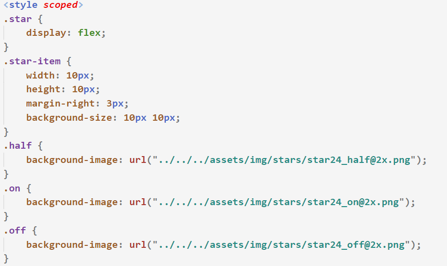
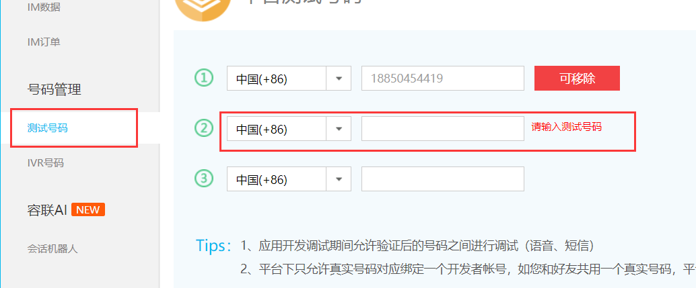

# 一、准备工作

## 1.1 项目描述

1. 此项目为外卖**Web App (SPA)**
2. 使用**Vue 全家桶+ES6+Webpack** 等前端最新最热的技术
3. 采用**模块化、组件化、工程化**的模式开发


## 1.2 项目功能界面


## 1.3 技术选型

- 前端：

    - **Vue全家桶**：`vue`、`vue-router`、`vuex`、`vue-cli`、`vue-lazyload`

    - **第三方插件**：`better-scroll`、`swiper`、`moment`

    - **UI组件库**：`mint-ui`

    - **数据模拟/网络请求**：`mock.js`、`axios`

        

- 后端：`node`  `express`  `mongoDB`

- 测试：`postman`


## 1.4 目录结构解析


## 1.5 项目初始化

- 前端项目初始化

    1. 引入css初始化文件 （全局引入）

    2. 引入图片相关资源

    3. 配置路由与组件映射关系

    4. 项目模块的划分 -> 底部导航栏 -> `MainTabBar`的封装

        

- 后端项目初始化

    1. 创建MongoDB数据库，**导入数据集合**：导入 data --> 所有json文件 

    2. 更改 db -> models.js 中的**数据库配置**，写入要连接的数据库名
    3. 后端解决跨域问题
    4. `npm run start`启动后台项目


# 二、首页

## 2.1 封装底部TabBar

1. 点击item实现路由跳转 -> 编程式导航 -> 解决路由重复跳转问题

2. data下定义currentLink，用于记录当前处于活跃的路由

3. 动态判断item与currentLink是否对应，动态的添加active类名

    


## 2.2 封装NavBar

- 编写好该组件的**具体样式**，通过`slot`插槽形式用于父组件填充内容


## 2.3 轮播图展示

1. 网络请求  --> 基于axios的二次封装 
2. 封装一个发送网络请求获取轮播图数据的函数
3. Home.vue 中获取轮播图数据，并**整理数据**，**整理成二维数组**

4. 轮播图数据传递给子组件，让子组件展示
    1. 编写静态样式
    2. 通过`swiper`插件完成轮播图


- **swiper在vue中的使用步骤如下**

    1. `npm i swiper`

        


## 2.4 商家店铺展示


1. 根据经度、维度发送网路请求获取商家列表
2. 将商家列表数据传递给子组件进行展示

3. 子组件提前编写好样式，进行渲染


## 2.5 start组件的封装


>核心：根据评分信息，动态的决定要生成的**星星的个数**以及**类名**
>
>​	

- html

    


- js

    


- css

    


## 2.6 底部TabBar的动态展示

- 并不是每个页面都要展示底部`TabBar`的

1. 为需要展示`底部TabBar`的**路由对象**设置`meta`对象
2. 在`meta`对象中通过`isShowTabBar`来表示**该路由对象**是否展示`TabBar`

3. 判断当前路由是否拥有`isShowTabBar`属性，如果有则展示`TabBar`  `v-if`


- 注：之所以选择`v-if`是因为防止其他不需要`TabBar`**路由页面**刷新时，**底部导航栏没有被重新渲染**
  


# 三、登录注册


## 3.1 页面交互效果

1. 切换登陆方式
    - 通过data下的属性控制切换效果 （v-show）
2. 手机号合法检查
    - 监听表单的输入  `@input`事件
3. 倒计时效果
4. 切换显示或隐藏密码
    - 通过data下的属性控制切换效果 (v-show)
5. 前台验证提示
    - 通过`mint-ui`第三方库来**展示对话框**


## 3.2 倒计时的实现效果

- **倒计时**效果的**优雅实现**

    

 


## 3.3 前台表单校验

1. 双向绑定表单数据  `v-model`
2. 使用`mint-ui`组件库来**展示对话框**
    - Mint UI中文官网地址：https://mint-ui.github.io/#!/zh-cn
    - W3Cschool Mint UI中文文档：https://www.w3cschool.cn/mintui/mintui-g6oi35s1.html

3. 引入`mint-ui`

    

>注：第三方的**UI组件库**，可以直接在**main.js中导入样式**，一般**不会有样式冲突问题**
>


4. 监听表单的提交，校验表单数据是否合法，需要**阻止**表单按钮**提交的默认行为**

    


## 3.4 刷新一次性图形验证码

- 通过**时间戳**来获取最新的图形验证码

    


## 3.5 发送短信验证码 (核心)

>以下是云通讯的**官网配置**
>

1. 进入云通讯官网：https://www.yuntongxun.com/，**注册登录**
2. 进入管理 -> 控制台首页 -> 记住开发者账号的相关信息


3. 添加测试号码

    


>以下是后端配置
>
>​	

1. 进入util -> sms_userInfo 文件， 更改其配置项为云通讯官网的**开发者账号信息**

    


>以下是前台代码

1. 封装一个发送手机短信验证码的网络请求函数

2. 监听获取短信验证码的点击，发送网络请求，通过`mint-ui`库展示对应的弹窗提示

    


## 3.6 实现注册/登录功能

1. 封装**手机验证码登录**、**用户名密码登录**的网络请求函数
2. 监听表单的提交，判断当前的登录方式
3. 在前台表单校验后，发送网络请求进行登录/注册
4. 登录/注册失败：`mint-ui`库的弹窗提示
5. 登录/注册成功：
    1. 将用户数据存储到Vuex下 通过mutations方式提交
    2. 吐司弹窗
    3. 跳转到上一级路由 `this.$router.back()`


## 3.7 登录成功后更新视图

1. 更新**个人中心**页面的用户名、手机号

    

    

2. 更新**首页**右上角的用户图标

    


>注：如果data下的数据值是Vuex下state的数据，那么**当state更新时data不会更新**，**最好直接写入模板中**
>


## 3.8 退出登录/自动登录

- **自动登录**
    - 在`App.vue`中发送**自动登录**的接口，并将用户数据存储到Vuex下


- **退出登录**

    1.  发送网络请求**清空后端用户登录数据**

    2. **清空Vuex中的userInfo数据**

    3. 吐司弹窗：`Mint-UI`库

        


# 四、商家 —— 头部


## 4.1 邂逅 Mockjs

### 1. Mockjs简介

- 什么是**Mockjs**？
  
  - **Mockjs**是一个可以**拦截Ajax请求**，并随机返回json数据的一个**js库**
    
  - 官网地址：http://mockjs.com/
  
    ​    
  
- 使用**Mockjs**的场景
  
  - 后台接口未实现，前台想要模拟发送网络请求获取接口数据，此时就可以**通过Mockjs数据来实现模拟**
  
  ​      
  
- **Mockjs**的原理  （简单理解）

    


>注：**Mockjs只能够拦截Ajax请求**，并模拟后台返回数据，因此使用`postman`等功能**测试模拟的接口是无效的**
>


### 2. Mockjs的基本使用

1. **新建mock文件夹** 在该文件夹下**新建 mockServer.js 文件**，用于**编写mockjs相关配置**
2. 安装**mockjs**：`npm i mockjs`

3. 引入`mockjs`，引入所要模拟的`json数据格式`
4. 通过`mock(url, data)`方法**定义接口URL地址**和**返回的数据格式**
5. 在**main.js**中 加载 **mockServer.js** 文件
6. 前端发送**Ajax请求**时，如果**URL与Mockjs配置的地址一致**，那么会直接响**应MockJS模拟的数据**


>注：**Mockjs并不会拦截所有Ajax请求**，**只会拦截匹配的URL请求**
>


## 4.2 商家头部渲染


1. 在`network` --> `shop.js`中封装发送网络请求**获取商家数据**的方法

2. 编写好商家头部相关的静态样式
3. 发送网络请求，获取商家信息，动态渲染商家头部区域
4. 模态框的展示
    1. 编写好两个模态框所需要的静态样式 
    2. 接收`shopInfo`数据，动态渲染模态框的内容
    3. 每个模态框组件内部**绑定一个变量**，用于控制该**模态框的显示与隐藏**
    4. 父组件通过`this.$refs.xxx`来修改模态框组件的内部数据
    5. 为模态框外部添加`transition`组件，用于动画的渲染


## 4.3 tabControl的封装


1. 编写好**tabControl**的相关静态样式
2. 遍历父组件传递的`tabTile`进行渲染
3. 监听每个item的点击，点击时携带index发射事件，并且更新item的激活状态
4. 绿色的线的位置 =` item.offsetLeft + item.offsetWidth / 2 - line.offsetWidth / 2`

5. 解决页面刷新后，激活的item与当前路由不匹配问题
    1. 判断URL路径
    2. 在`mounted`生命周期函数中根据URL路径**初始化当前激活的item的索引**


## 4.4 配置Tab对应的子路由


1. 创建各个区域的组件对象 **(.vue文件)**
2. 在**router -> index.js**中配置组件对象与`/shop`子级路由的**映射关系**


3. 在`shop.vue`中通过`router-view`标签渲染对应的路由视图

    


4. 监听**tabControl**组件的点击，根据传递过来的index，来分别判断要**跳转到哪个路由下**

    


# 五、商家 —— 点餐


## 5.1 商家商品的页面划分


- html

    

- js：获取**食物列表数据**，并传递给子组件

    


- css	

    


## 5.2 better-scroll的引入及封装

>在使用scroll组件**填充插槽时**，最好在末尾处填充**多个`br`标签**，这样滑到底部时会有**预留空间**
>

1. **npm i better-scroll**

2. 封装scroll组件，**预留插槽形式**

    


## 5.3 ShopFood左侧菜单栏的实现

1. 遍历**goodsList**数据，动态渲染左侧菜单栏数据
2. 通过data下的`currentIndex`记录当前处于活跃的菜单，实现**点击切换激活状态效果**
3. 引入**Scroll.vue**组件，将左侧菜单栏内容包裹在`Scroll`标签里，填充时预留多个`br`元素
4. 监听goodsList数据的更新，等页面渲染加载完成后**刷新**`Scroll`组件可**滚动的高度区域**

5. 设置`scroll-wrap`的**固定高度**


## 5.4 右侧内容区域的实现

1. 根据**goodsList**数据，动态渲染视图
2. 将右侧内容区域**包裹**在**Scroll标签中**

3. 监听图片的加载，图片加载完成后**刷新可滚动的区域高度**

4. 给`scroll-wrap`一个固定高度 以及`fixed`定位


## 5.5 滚动区域的联动效果

>效果1：**滚动右侧区域，左边菜单栏激活选项刷新**
>

1. 当图片加载完成后，获取所有`.title`元素相对于`scroll-wrap`的**Top值**，并存**储到数组中**
2. 监听右侧区域的**实时滚动** —— Scroll
    1. 遍历`AllTitleY`，**判断当前滚动的top值是否大于等于数组中的元素，并小于下一个元素**
    2. 如果符合条件则携带`index`**发射中央事件总线**
3. 监听右侧区域的**滚动结束事件** ——ScrollEnd
    1. 遍历`AllTitleY`，**判断当前滚动的top值是否大于等于数组中的元素，并小于下一个元素**
    2. 如果符合条件则携带`index`**发射中央事件总线**
4. 左侧菜单栏**监听右侧内容区域发射的中央事件总线**，**根据传入的index，更新激活选项**


>效果2：点击左侧菜单栏，右侧内容区域会**滚动到对应的位置**
>

1. 点击菜单栏时携带当前**被激活的item 的索引值**，**发射中央事件总线**

2. 右侧监听中央事件总线，根据传递的index，**决定要滚动的偏移量**，调用`scrollTo()`方法

    


## 5.6 食物模态框的展示


1. 编写**食物模态框**所要展示的静态样式
2. 监听右侧内容区域食物列表（item）的点击
    1. 获取点击的item 数据 并传递给模态框组件
    2. 展示食物模态框

3. 食物模态框对父组件传递过来的数据动态的渲染
4. 为食物模态框组件绑定一个变量，用于控制模态框的显示与隐藏


# 六、商家 —— 点餐 (购物车功能)


## 6.1 Vuex管理食物数据

1. 在Vuex中的`state`下定义**食物数据**，并定义**更新食物数据**的`mutations`

2. 在`shopFood.vue`获取食物列表时
    1. **初始化每个食品的数量**
    2. 将**每个食品(item)**存入到一个**数组**中
    3. **提交mutations**，更新食物列表的共享数据


## 6.2 CartControl的封装

>核心：食物**数量的更改由Vuex来管理**
>


1. 编写`CartControl`组件所要展示的静态页面，以及**动画效果**(`transition组件`)

2. 接收一个**food属性**，该属性为`CartControl`组件**所对应的那个食物的数据 (item)**

3. 当**food.count**有值时，减号与数量才显示
4. 监听加减按钮的点击事件，**携带当前食物数据**，**提交mutations**，更新**state.foodsList**数据

5. 在**mutations.js**中，定义**增加食物数量**与**减少食物数量**的方法，来更新**state.foodsList**对应的数据

- 难点1：如何通过传递的`item`来修改`foodsList`中对应的`item.count`数据？
    - 两个item实际上**引用的是同一个内存地址值**
    - 因此直接比较两个item是否全等，就可以获取到`foodsList`中对应的`item`数据以此修改

- 难点2：既然两个item**引用的是同一个内存地址值**，为什么**不直接修改传递的item.count**值？

    - 直接修改会导致Vuex  -> `foodsList`数据无法被追踪，所以要提交`mutations`更新数据

        


## 6.3 底部shopCart的实现(静态)


1. 静态页面基本效果：①**购物车清单的显示与隐藏动画(滑动效果)** ②**遮罩层的显示与隐藏动画**

2. 购物车清单的定位：子绝父相、`transform: translateY(-100%);`**向上移动自身的百分百高度**

    - 注意`z-index`失效的坑

3. `transition`组件补充：

    

    


## 6.4 底部shopCart的实现(动态)

1. 在Vuex -> getters中**定义**食物**总价格**、**总数量**等**计算属性**

    

2. 当总数量不为0时，购物车图标处于激活状态(active类名)，显示购物车右上角数量

3. 总价格区域模板写`vuex getters`计算的总价格

    


4. 在`shopCart.vue`中设置计算属性，主要计算**还差多少起送**，**是否显示结算**

    


5. 在`shopCart.vue`中根据以上计算属性，动态的决定要渲染哪些按钮

    


6. 控制**遮罩层**与**购物车食物列表**的**显示与隐藏**

    1. 设置**ListShow**计算属性与**isShow**数据

    2. 通过**ListShow**计算属性来控制显示与隐藏
    3. 监听**购物车图标** && **遮罩层** 的点击，让**isShow**数据取反

    


## 6.5 cartFoodList的实现


1. 编写好静态样式
2. 遍历***Vuex -> shopCartFoods***计算属性，**动态渲染已加入购物车的食物数据**

3. 监听清空按钮的点击 
    1. **通过mint-ui弹出对话框**
    2. **提交mutations** 将所有商品数量初始化为0

4. 引入Scroll组件，实现滑动效果，给`scroll-wrap`一个**最大高度**`max-height`


# 七、商家 —— 评价 && 商家 && 搜索


## 7.1 评价页面的实现

1. 编写好评价页面的**静态页面模板**
2. 发送网络请求获取**商家信息**、**评论信息**，动态渲染界面
    - 用**两个变量**存储评论信息，一**个不可变更**，一个**可变更**
    - **遍历的是可变更的评论数据**

3. 通过计算属性**筛选评论信息**
4. 监听**评论分类按钮的点击**
    1. 通过 ***RateType*** 变量来表示当前处于**激活**的按钮点击。 0：全部 1：满意 2：不满意
    2. 通过传递过来的索引更新***RateType*** 变量
    3. 根据索引判断当前要展示的评论数据
5. 引入better-scroll


## 7.2 商家页面的实现

1. 发送网络请求获取商家信息
2. 根据接口数据动态渲染商家页面
3. 引入better-scroll
4. 横向better-scroll的使用

5. 图片加载完成后刷新better-scroll的可滚动高度


## 7.3 搜索页面的实现


1. 监听查找按钮的点击，发送网路请求，渲染商家店铺

    


# 八、项目优化


## 8.1 解决better scroll覆盖bug

- 我们在浏览器测试项目运行时，项目没有问题，当我们用手机测试查看项目时，会发现手机里的滚动区域直接覆盖了导航栏和底部工具栏，这时候我们就需要为**scroll组件设置为固定定位**

- 凡是使用scroll包裹的区域，都必须给scroll元素设置被固定定位

    - ```css
        #home .scroll-wrap {
            position: fixed;
            top: 44px;
            height: calc(100vh - 93px);
        }
        ```

        

>最好为**scroll-wrap**组件中**末尾处**插入多个**br元素**，这样滑动到最底部的时候会美观一些


## 8.2 图片懒加载

- 图片懒加载的概述：
    - 图片延迟加载在可***提高网页下载速度*** ，也能***帮助减轻服务器负载***， 当我们页面滑动到可视区域，再显示图片

>注：如果**vue-lazyload失效**了，**要考虑是否与其他UI冲突**，需要**将lazyload配置放在其他UI库前面**

- 图片懒加载插件教程：https://github.com/hilongjw/vue-lazyload

1. 在main.js文件中 安装、使用插件

    - ```js
        // main.js
        import VueLazyload from 'vue-lazyload'
        Vue.use(VueLazyload, {
            // 必须通过require导入加载时图片的src
            loading: require('./assets/img/common/lazyloading.png'),
        })
        ```

        

2. 在Vue模板区域中 将需要懒加载的图片的***src属性***替换为`v-lazy`指令

    - ```html
        <ul>
          <li v-for="img in list">
            
          </li>
        </ul>
        ```

        


## 8.3 css单位转换

- 我们可以通过插件来帮助我们实现**px单位根据不同屏幕尺寸，转换为vw单位**，进行**布局自适应**

1. 安装插件

    - `npm i postcss-px-to-viewport D`

2. 在一级目录中新建**postcss.config.js**，然后在文件中添加以下代码

    - ```js
        module.exports = {
            plugins: {
                autoprefixer: {},
                "postcss-px-to-viewport": {
                    viewportWidth: 375, // 视口的宽度，对应的时设计稿的宽度/2，一般为750
                    viewportHeight: 667, // 视口的高度，对应的是设计稿的高度
                    unitPrecision: 5, // 指定‘px’转换为视口单位值的小数位数
                    viewportUnit: 'vw', // 指定需要转换成的视口单位，建议使用vw
                    selectorBlankList: ['ignore', 'tab-bar'], // 指定不需要转换的类
                    minPixelValue: 1, // 小于或等于‘1px’不转换为视口单位
                    mediaQuery: false,// 允许在媒体查询中转换为‘px’
                    exclude: [/MainTabBar/]  // 不需要转化的组件文件名正则
                }
            }
        }
        ```

        

## 8.4. 通过 `nprogress` 实现进度条

- `nprogress`官方教程：https://www.npmjs.com/package/nprogress

  ​    

1. 安装：`npm i nprogress`

2. 在***network --> request.js*** 中 引入nprogress以及css样式文件

    - ```js
        //导入进度条插件
        import NProgress from 'nprogress'
        //导入进度条样式
        import 'nprogress/nprogress.css'
        ```

        

3. 在axios中的**请求拦截器**上**展示**进度条，**响应拦截器**上**隐藏**进度条

    


