#  一、邂逅小程序

## 1.1 认识小程序

### 1.1.1 小程序的介绍

- 什么是小程序？

    - 微信⼩程序，简称⼩程序，英⽂名 `Mini Program` ，是⼀种不需要下载安装即可使⽤的应⽤，它实现 了应⽤“**触⼿可及**”的梦想，⽤⼾扫⼀扫或搜⼀下即可打开应⽤
      

    

- 为什么需要学习小程序？

    1. 开发适配成本低。 入门的门槛低： 基本上是类似于 html+css+js

    2. 跨平台。(Android端、IOS端)

    3. 现在招聘前端的需求中，要求会小程序已经渐渐**成为了趋势**

      

- 其他小程序也不容忽视：① ⽀付宝⼩程序  ② 百度⼩程序  ③ QQ⼩程序 

    

- 微信小程序**学习文档**：

    - https://developers.weixin.qq.com/miniprogram/dev/framework/

        


### 1.1.2 小程序与普通网页开发的区别

- 小程序的主要开发语言是 **JavaScript** ，小程序的开发同普通的网页开发相比有很大的相似性。但是二者还是有些许区别的。

    

- 网页开发者可以使用到各种浏览器暴露出来的 **DOM、BOM**，但是在**小程序**中并**没有**相关的DOM API和BOM API。这一区别导致了前端开发非常熟悉的一些库，**例如 jQuery，在小程序中是无法运行的**。

  ​    


- 网页开发者在开发网页的时候，只需要使用到浏览器，并且搭配上一些辅助工具或者编辑器即可。小程序的开发则有所不同，需要经过申请小程序帐号、安装小程序开发者工具、配置项目等等过程方可完成


## 1.2 开发前准备工作

### 1.2.1 申请AppID

1.  注册小程序帐号

    - 登录微信公众平台：https://mp.weixin.qq.com/

    

    

    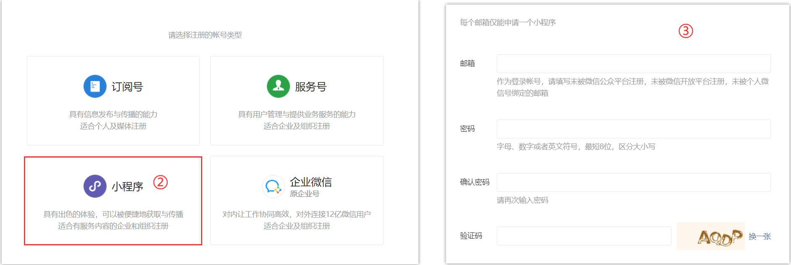

    


2. 注册成功后，使用绑定的微信扫码进行登录

    


3. 登录成功后，会跳转到小程序管理平台，开发”-“开发设置” 看到小程序的 **AppID** 了 。

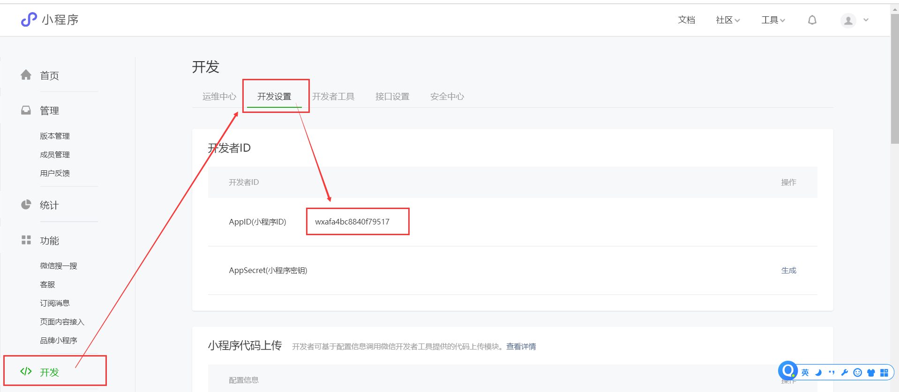


- 注：

    - **一个账号对应一个小程序**，个体户和个人类型主体可注册 5 个小程序
    - 注册微信公众号和微信小程序时，所填写的邮箱不能一致，否则会冲突，**QQ邮箱里支持注册3个邮箱**
    - 小程序的 AppID 相当于小程序平台的一个**身份证**


### 1.2.2 安装开发者工具

- 下载微信开发者工具，选择稳定版下载

    - https://developers.weixin.qq.com/miniprogram/dev/devtools/download.html

        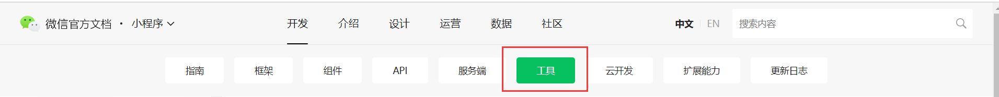


- 微信⼩程序⾃带开发者⼯具，集 开发 预览 调试 发布 于⼀⾝的 **完整环境**。 

- 但是由于编码的体验不算好，因此 建议使⽤` Vscode` + `微信开发工具 `来实现编码 
    - `Vscode` 负责敲代码，` 微信开发工具` 负责预览小程序


### 1.2.3 创建第一个小程序应用

1. 双击打开微信开发者工具，

    

    

2. 填写项⽬信息，`AppID`里选择我们申请的AppID


>注：**项目名称不能够更改！**
>


### 1.2.4  微信开发者⼯具介绍

- [微信开发者工具使用文档](https://developers.weixin.qq.com/miniprogram/dev/devtools/devtools.html)
    - `ctrl+s`即可保存并且**重新编译**

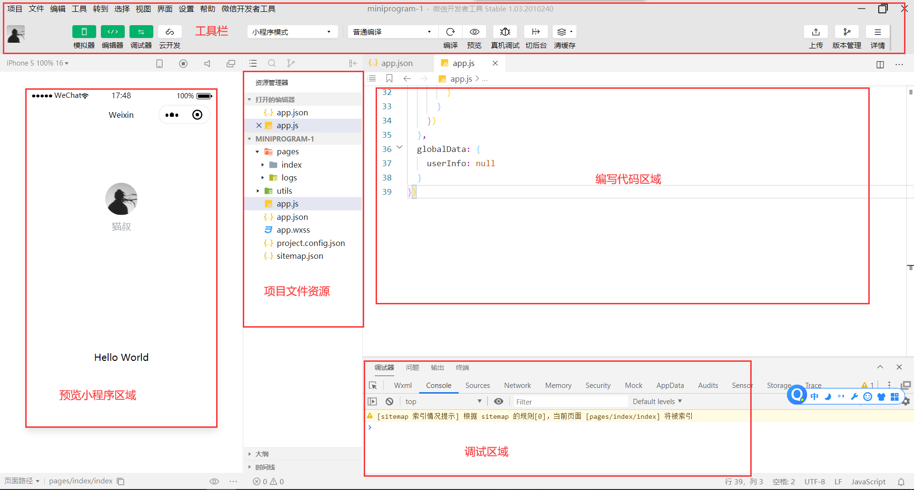


- 微信开发者工具一些简单配置

    


- 微信开发者工具小技巧
    - 想要新建**小程序页面**时，无需手动的创建页面文件夹以及对应的`wxml`、`wxss`等文件，只需要在`app.json`中的`pages`字段下，输入你想要创建的页面路径，然后`ctrl+s`保存，即可快速生成一个小程序页面文件夹


## 1.3 小程序的目录结构

### 1.3.1 小程序的组成

- ⼩程序框架提供了⾃⼰的视图层描述语⾔ `WXML` 和` WXSS` ，以及 `JavaScript` ，并采用了`MVVM`架构，让开发者能够**专注于数据与逻辑**。

    

- 小程序的开发主要分成三部分：
    - 页面布局： **WXML** ，类似 HTML
    - 页面样式： **WXSS** ，几乎就是 CSS （某些不支持，某些进行了增强）
    - 页面脚本： **JavaScript+WXS JS** 


- **小程序、页面、组件**三者之间的关系，这里暂时做个了结，后续学习到自定义组件时在研究

    

    


### 1.3.2 小程序文件结构和传统web对比


- 传统web网页是由**三层结构**组成的(`HTML + CSS + JS`)

- ⽽微信⼩程序是由**四层结构**组成的(`WXML + WXSS + JS + JSON`)，多了⼀层 配置文件`.json`

    

    

### 1.3.3 小程序的目录结构

- 微信小程序项目的**目录结构详解**


- 一个小程序**主体部分**由三个文件组成，必须放在项目的**根目录**，如下：

    


- 根目录下的`pages`文件夹用于存放各个页面，**每个页面由四个文件组成**，分别是：

    

    

- 注：
  
    - 在微信小程序中`json`文件如果存在，则内容不能为空，否则会编译报错，需要在`json`文件最外层添加花括号`{}`


## 1.4 小程序的MVVM架构

- 什么是`MVVM`？

    - **MVVM**（**Model–view–viewmodel**）是一种软件[架构模式](https://zh.wikipedia.org/wiki/架构模式)。MVVM有助于将[图形用户界面](https://zh.wikipedia.org/wiki/图形用户界面)的开发与[业务逻辑](https://zh.wikipedia.org/w/index.php?title=业务逻辑&action=edit&redlink=1)的开发[分离](https://zh.wikipedia.org/wiki/关注点分离)开来

- `MVVM`的组成
    - View层（**视图层**）：主要的作用是**给用户展示各种页面。**

    - Model层（**数据层**）：数据可能是我们固定的死数据，更多的是来自我们服务器，**从网络上请求下来的数据**。

    - ViewModel层（**视图模型层**）：

        - **视图模型层是View和Model沟通的桥梁**。

        - 一方面它实现了Data Binding，也就是**数据绑定**

        - 另一方面它实现了DOM Listener，也就是**DOM监听**


- `Vue`的MVVM和`小程序`MVVM对比

    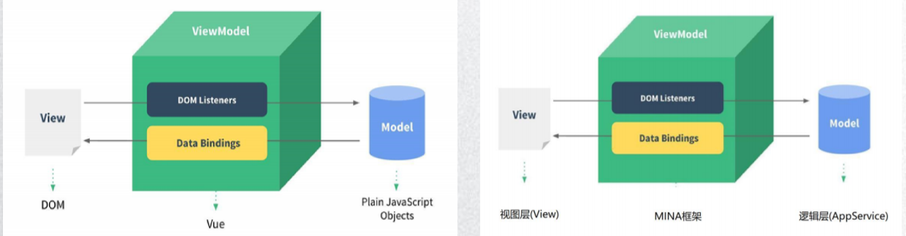

    

- 需要注意的是：在微信小程序中修改逻辑层中的`data`数据与获取`data`数据**方式并不一样**
  
    - 参考：`细节补充 => data的设置和获取`


# 二、小程序的配置文件

## 2.1 配置文件的概述

- 小程序的很多**开发需求**被规定在了**配置文件**中，[小程序配置参考文档](https://developers.weixin.qq.com/miniprogram/dev/reference/configuration/app.html)

- 在项目的根目录有一个 `app.json` 和 `project.config.json`，此外在 `pages/index` 目录下还有一个 `index.json`，我们依次来说明一下它们的用途。

    


## 2.2 全局配置 `app.json`

- `app.json` 是当前小程序的**全局配置**，包括了小程序的所有页面路径、界面表现、底部 tab 等。

    - [完整的配置信息请参考 app.json配置](https://developers.weixin.qq.com/miniprogram/dev/reference/configuration/app.html)

    

    

1. `pages` 字段 —— ⽤于描述当前⼩程序所有**⻚⾯路径**

    - 路径最后的文件名**不需要写文件后缀**，框架会自动去寻找对应位置的 `.json`, `.js`, `.wxml`, `.wxss` 四个文件进行处理。
    - 未指定 `entryPagePath` 字段时，数组的**第一项**代表小程序的**初始页面**（首页）。
    - **小程序中新增/减少页面，都需要对 pages 数组进行修改。**
    - 页面路径要以**绝对路径**形式书写


2. `window` 字段 —— 定义⼩程序**所有⻚⾯**的**顶部背景颜⾊**，**⽂字颜⾊**定义等。 

    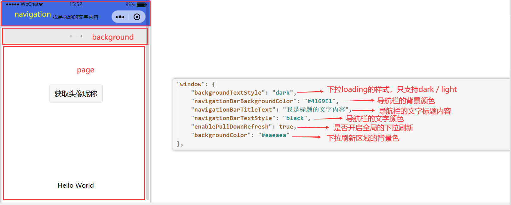

    

    

3. `tabBar`字段 —— 底部 `tab` 栏的表现，[tabBar配置文档](https://developers.weixin.qq.com/miniprogram/dev/reference/configuration/app.html#tabBar)

    - 如果小程序是一个多 tab 应用（客户端窗口的底部或顶部有 **tab 栏可以切换页面**），可以通过 tabBar 配置项指定 tab 栏的表现，以及 tab 切换时显示的对应页面。

    


>注：**tabBa**r中的页面路径前面不能加`/`，格式必须与**page**字段一致，**图片路径**可以是**相对路径**也可以是**绝对路径**
>


## 2.3 页面配置 `page.json`

[页面配置](https://developers.weixin.qq.com/miniprogram/dev/reference/configuration/page.html)

- `page.json`是指**每个页面**的**基本配置文件**

- 每一个小程序页面也可以使用 `.json` 文件来对**本页面的窗口表现进行配置**。页面中配置项在当前页面会**覆盖** `app.json` 中的 `window` 中相同的配置项

    
  
- `page.json`文件内容为一个 JSON 对象，有以下属性：

    


## 2.4 其他配置文件

[sitemap 配置](https://developers.weixin.qq.com/miniprogram/dev/reference/configuration/sitemap.html)

- ⼩程序根⽬录下的` sitemap.json `⽂件⽤于配置⼩程序及其⻚⾯是否允许被微信索引。
- 目前了解即可，之后小程序发布上线之后，在看该具体配置


- `project.config.json`
    - 微信开发者工具的配置文件，类似于`Vscode`中的`Setting.json`文件


## 2.5 JSON 语法

- `JSON文件`都是被包裹在一个**大括号**中 `{}`，也可以被包裹在**数组**中`[]`
- 通过**key-value**的方式来表达数据。**Key**必须包裹在一个`双引号`中
- JSON的值只能是以下几种数据格式，其他任何格式都会触发报错。

    1. 数字，包含浮点数和整数

    2. 字符串，需要包裹在双引号中

    3. Bool值，true 或者 false

    4. 数组，需要包裹在方括号中 []

    5. 对象，需要包裹在大括号中 {}
- 还需要注意的是 `JSON 文件`中**无法使用注释**，试图添加注释将会引发报错


# 三、小程序的双线程模型（理解）

## 3.1 小程序宿主环境

- 什么是小程序的**宿主环境**？
  
  - 小程序的**宿主环境**也可以理解为小程序的**运行环境**，**微信客户端**就是小程序的**宿主环境**
    
  - 小程序中的`wxml`、`wxss`、`js`这些文件都是运行在**微信客户端**上的，由于运行环境的不同，在微信小程序的`js`中无法获取浏览器所提供的API
  
    
  
- **微信客户端**这个**宿主环境**提供了小程序的**双线程模型**，根据不同的文件，分别采用不同的线程进行渲染


## 3.2 双线程模型

- 前言：**微信客户端**这个**宿主环境**提供了小程序的**双线程模型**，根据不同的文件，分别采用不同的线程进行渲染

- 小程序的**渲染层**(`wxml`、`wxss`)和**逻辑层**(`js`)分别由2个线程管理：

    - `WXML`模块和`WXSS`样式运行于渲染层，**渲染层**使用`WebView`线程渲染

    - **逻辑层**采用`JsCore`线程**运行JS脚本**。

        

- 一个微信小程序如果有多个页面，则会使用多个`WebView线程`去渲染对应的`wxml`和`wxss`文件

- `WebView`和`JsCore`这两个线程都会经由微信客户端（`Native`）进行中转 交互。**逻辑层**发送**网络请求**也经由`Native`转发，小程序的**通信模型**下图所示。


## 3.3 界面渲染过程 —— 虚拟DOM

- 简单理解**虚拟DOM**
    - 不论是`wxml`还是`html`，他们的**文件结构**等价于一棵**DOM树**，
    - 该**DOM树**可以使用一个JS对象来表示，这个**描述DOM树**的**JS对象**，就称为**虚拟DOM**


## 3.4 界面渲染过程 —— 初始化渲染

- 我们所能看到的微信小程序界面，实际上是通过以下几个步骤渲染实现的
    1. 将`wxml`和`js`文件由微信客户端`Native`进行解析，渲染成一个**虚拟DOM**
    2. **微信客户端**会将这个**虚拟DOM**，渲染成一个真实DOM树，然后交给`WebView`线程进行渲染

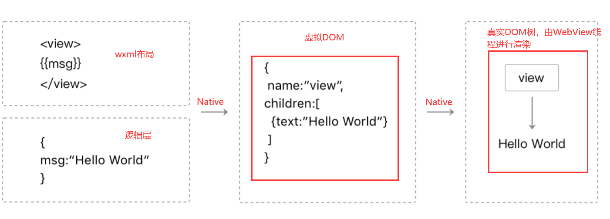


## 3.5 界面渲染过程 —— 数据变化

- 当我们通过`this.setData()`方式修改了逻辑层中的**数据**时，小程序界面之所以会发生变化，是经过了以下步骤：
    1. 根据修改后的数据，**产生**一个新的虚拟DOM对象
    2. 在**微信客户端Native**中，通过diff算法**对比**原来的虚拟DOM对象，得到改动的地方
    3. 将得到改动的地方应用在原来的DOM树上，从而达到更新UI的目的，这就是“**数据驱 动**”的原理


## 3.6 界面渲染的整体过程

- 界面渲染整体流程： 
    1. 宿主环境会把`WXML`和`js`转化成对应的JS对象(**虚拟DOM**)
    2. 将JS对象再次转成**真实DOM树**，交由**渲染层线程**渲染； 
    3. 数据变化时，逻辑层提供最新的变化数据，JS对象发生变化比较进行diff算法对比； 
    4. 将最新变化的内容反映到真实的DOM树中，更新UI


# 四、小程序的逻辑层

## 4.1 小程序的启动流程

- 我们一起来看一下一个小程序的启动流程，通过了解小程序的启动流程，我们就知道了自己代码的执行顺序：

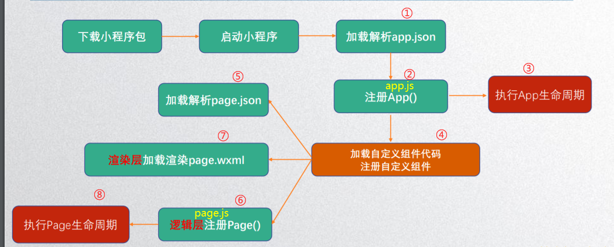


## 4.2 逻辑层的介绍

- 在小程序中，可以将逻辑层分为三类：`小程序逻辑层`、`页面逻辑层`、`组件逻辑层`，逻辑层就是其对应的JS文件

    

    

- 在进行小程序开发时，我们需要在`逻辑层`中对`小程序`、`页面`、`组件`分别进行**注册**，不同的`逻辑层`在进行注册时**调用的方法是不一致的**


## 4.3 小程序逻辑层

### 4.3.1 注册小程序

- 每个微信小程序项目都需要在 `app.js` 中调用 `App` **方法**注册**小程序实例**

    - 并传入一些**配置项**用来**初始化小程序示例**

    - ```js
        // app.js
        App({
          // ..options
        })
        ```

    - [具体可传入的配置项](https://developers.weixin.qq.com/miniprogram/dev/framework/app-service/app.html)

    


- **注册小程序实例**时一般做些什么？

    1. 判断小程序的进入场景 ，在**onLaunch**和**onShow**生命周期回调函数中，会有**options**参数，其中有**scene**值

        - ```js
            onLaunch(opation) {
                console.log(opation.scene);  // 获取小程序的进入场景
            },
            ```

    2. 监听生命周期函数，在生命周期中执行对应的业务逻辑，比如在某个生命周期函数中获取微信**用户的信息**。

        - ```js
            onLaunch(opation) {
            	// 获取获取用户信息，需要用户授权后才有数据
            	console.log(wx.getUserInfo()); 
            },
            ```

    3. 因为App()实例只有一个，并且是全局共享的（单例对象），所以我们可以将一些**共享数据**放在这里

        - ```js
            // 在小程序的任何js文件中都可以通过getApp()来获取到小程序实例
            const appInstance = getApp()
            console.log(appInstance.globalData) // I am global data
            ```

            


### 4.3.2 小程序的生命周期

- **小程序生命周期**就是**注册小程序实例**时传入的配置项，只不过该**配置项是函数**，会在不同阶段被自动调用


### 4.3.3 函数配置项中的this

- 注册小程序实例时，传入的**所有配置项**，都会作为该**小程序实例上的属性/方法**

- 注册小程序实例时所传入的**函数配置项**中的`this`指向的就是**小程序实例**

    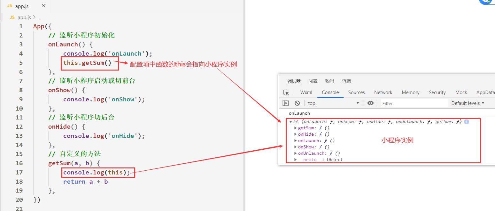


## 4.4 页面逻辑层

### 4.4.1 注册页面

- 对于小程序中的每个页面，都需要在页面对应的 `js` 文件中调用`Page`**方法**注册**页面实例**

    - 调用`Page`方法时需要传入一些**配置项**用来**初始化页面实例**

    - ```js
        // page.js
        Page({
          // ..options
        })
        ```
        
    - [Page配置项](https://developers.weixin.qq.com/miniprogram/dev/reference/api/Page.html)

        


- 注册Page时做什么呢?
    1. 在生命周期函数中**发送网络请求**，从服务器获取数据
    2. 初始化一些数据，以方便被`wxml`展示
    3. 监听`wxml`中的事件，绑定对应的事件函数
    4. 其他一些监听（比如页面滚动、上拉刷新、下拉加载更多等）


### 4.4.2 页面的生命周期

- **页面的生命周期**就是**注册页面实例**时传入的配置项，只不过该**配置项是函数**，会在不同阶段被自动调用

    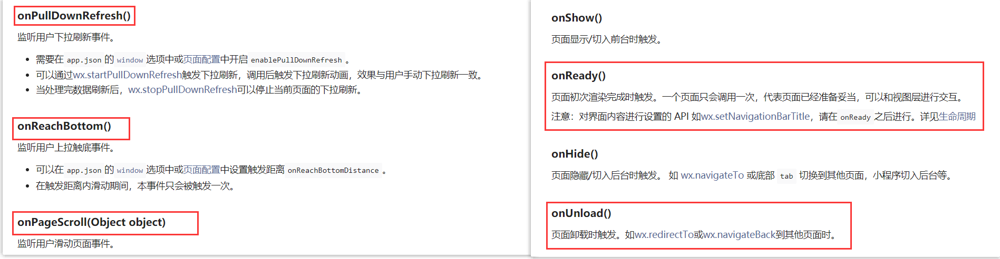


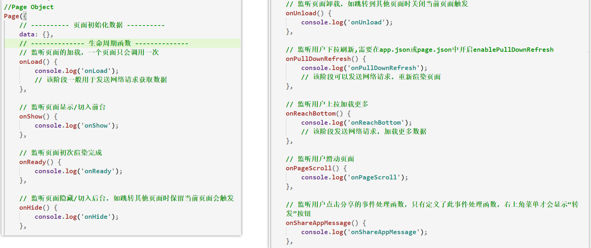


### 4.4.3 函数配置项中的this

- 注册页面实例时，所有传入的**配置项**，都会作为该**页面实例上的属性/方法**
- 注册页面实例时所传入的**函数配置项**中的`this`指向的就是**页面实例**，可以通过`this`来进行访问页面实例

    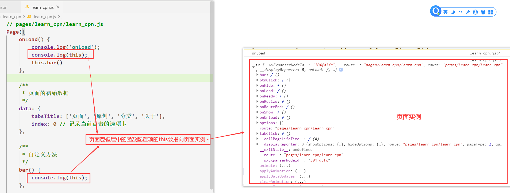


## 4.5 组件逻辑层

### 4.5.1 注册组件

- 在组件的 ` js ` ⽂件中，需要使⽤ `Component()` 来注册**组件实例**

    - 调用`Component`方法时需要传入一些**配置项**，用于**初始化组件实例**

    - ```js
        Component({
          // options...
        })
        ```
    
    - [Component配置项](https://developers.weixin.qq.com/miniprogram/dev/reference/api/Component.html)


>注意：`组件逻辑层`中的**自定义方法**以及**事件监听函数**是定义在`methods`对象中，这一点与`页面逻辑层`不同
>

​    

  

### 4.5.2 组件的生命周期

[组件生命周期](https://developers.weixin.qq.com/miniprogram/dev/framework/custom-component/lifetimes.html)

>**组件的生命周期**比较特殊，分为了两类，一种是**组件所在页面**的生命周期，另一种是**组件自身**的生命周期
>

- **组件所在页面**的**生命周期**函数需要在`pageLifetimes`配置项中定义

    

    


- **组件自身**的**生命周期**函数需要在`lifetimes`配置项中定义

    

    


### 4.5.3 组件中的this

>`Component`中的`methods`、`生命周期`、`observers`下的函数都可以通过 `this` 可以**访问组件实例**
>


>**组件实例**有以下常用的**属性**和**方法**


>注：`methods`下的方法会被**挂载到组件实例的原型**下，因此可以通过`this.方法名()`调用方法
>


>Tips：生命周期函数**无法**在组件方法中通过 `this` 访问到。
>


 


# 五、样式 WXSS

## 5.1  wxss的介绍

- `WXSS`是⼀套**样式语⾔**，⽤于描述 WXML 的组件样式。 
- 与 CSS 相⽐，`WXSS` 扩展的特性有： 
    - 响应式⻓度单位 **rpx** 
    - **样式导⼊**

- [WXSS参考文档](https://developers.weixin.qq.com/miniprogram/dev/framework/view/wxss.html)


## 5.2 页面样式写法

- 页面样式的**三种写法**： 
    -  **行内样式**、**页面样式**、**全局样式** 
    - 三种样式都可以作用于页面的组件

- 如果有相同的样式 
    - 优先级依次是：行内样式 > 页面样式 > 全局样式


- **全局样式**与**局部样式**
    - 定义在 `app.wxss `中的样式为**全局样式**，作用于每一个页面。
    - 在 `page` 的` wxss` 文件中定义的样式为**局部样式**，只作用在对应的页面，并覆盖 `app.wxss` 中相同的选择器
    
    - **全局**样式和**组件**样式会有一层**隔离状态**，因此**全局样式是影响不到组件样式的**


## 5.3 wxss中支持的选择器

- `wxss`中只支持如下**选择器**：

    

    - 除此之外，在微信小程序中还支持**交集选择器、子类选择器、后代选择器**
      
      

- 特别需要注意的是 ⼩程序 **不⽀持通配符 *** 因此以下代码⽆效！

    - ```css
        * {
            margin:0;
        }
        ```

    

- **选择器权重**

    


>注：官方推荐在微信小程序中尽量只用**class选择器**、**后代选择器**
>


## 5.4 wxss的扩展 - 尺寸单位

- 在`wxss`文件中，新增了`rpx`单位：该单位可以根据屏幕宽度进⾏**⾃适应**。规定所有设备屏幕宽为`750rpx` 

    

- 如在 `iPhone6` 上：

    - 屏幕宽度为 `375px` ，则共有`750个物理像素`，则 `750rpx = 375px = 750物理像素` ，
    - 则`1rpx = 0.5px = 1物理像素 `

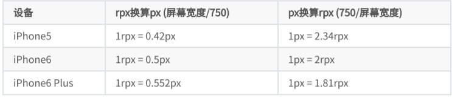


>补充：wxss中支持的**自适应单位**：vh、vw、%、em、rpx
>


## 5.5 wxss的扩展 - 样式导入

- 在微信小程序中允许在一个wxss中导入另一个wxss文件
    1. 在`wxss`文件中使用`@import`语句进行导入 
    2. @import后跟需要导入的外联样式表的**相对路径**，用;表示语句结束。

- 示例：

    - ```css
        @import './test.wxss';
        ```

        


>注：在微信小程序中，**无需**将`wxss`文件引入到`wxml`文件中
>
>


## 5.6 官方样式库

- 为了减少开发者样式开发的工作量，小程序官方提供了**WeUI.wxss**基本**样式库**
    - https://github.com/Tencent/weui-wxss


- 由于样式库发展的并不成熟，因此这里推荐使用基于`WeUI.wxss`样式库封装好的**组件库**
    - https://developers.weixin.qq.com/miniprogram/dev/extended/weui/


- 使用**组件库**开发一个**搜索框**，具体步骤如下

    ​	① 在`app.json`中声明要引用的扩展库

    ​									

    ​	② 在页面的 `json `文件加入 usingComponents 配置字段

    ​									

    ​	③ 在对应页面的`wxml`文件中直接使用该组件

    ​									


>搜索框组件参考：https://developers.weixin.qq.com/miniprogram/dev/extended/weui/search.html
>


# 六、模板语法

## 6.1 小程序的模板区域

- 以`profile`页面为例，其页面中的`wxml`文件就是一个模板区域
    - **只有在模板区域内**，才能使用小程序**特有的模板语法**


- 在现阶段，只需要知道在`wxml`文件中分别使用`text`和`view`标签，来代替`html`文件中的`span`和`div`标签

    


## 6.2 数据绑定

### 6.2.1 模板区域中可渲染的数据

- 在小程序中，我们往往将**页面的数据**定义在该页面的`js`文件中

1. 每个小程序页面的`js`文件都会调用`Page`方法，并且传入一个对象，该对象会作为当前页面的**初始化配置**
2. 在初始化配置项的`data`中定义页面要展示的数据


>总结：每个页面的`wxml`文件，只能够渲染当前页面逻辑层的`data`下的数据
>


### 6.2.2 绑定组件元素内容

- 和`Vue`一样，在`wxml`中直接使用`Mustache`语法来渲染`data`下的数据


### 6.2.3 绑定组件元素属性

- 在组件(标签)的属性值中，通过`Mustache`语法，来**动态绑定组件的属性**

    - ```html
        <!--  profile.wxml  -->
        <view id="item-{{ id }}"> </view>
        ```

    - ```js
        // profile.js
        Page({
          data: {
            id: 18
         }
        ```


- 如果希望组件绑定的属性值是一个`bool`或**其他类型**，那么必须要用`双大括号表达式`，否则将会解析为字符串类型

    - 类似于在Vue中动态绑定元素属性与非动态绑定元素属性，所**解析的数据类型区别**

    - ```html
        <!--  checked的值为bool类型  -->
        <checkbox checked="{{ false }}"></checkbox>
        
        <!--  id的值为数组类型类型  -->
        <view id="{{ [1, 2, 3] }}">我是内容3</view>
        
        <!--  checked的值为字符串类型  -->
        <checkbox checked="false"></checkbox>
        ```

        

>注：属性值的字符串和花括号之间**不能存在空格**，否则最终被**解析成为字符串**
>

- ```html
    <checkbox checked="{{ false }}"></checkbox>
    ```


​        

​        

​        


## 6.3 表达式

- 在模板区域的`Mustache`语法中，允许我们在`双大括号`内写一些**简单的表达式**


### 6.3.1 三元表达式

- 在**标签属性**中使用三元表达式

    - ```html
        <view hidden="{{ isShow ? false : true }}"> Hidden </view>
        ```

        

- 在**元素内容**中使用三元表达式

    - ```html
        <!--  page.wxml  -->
        <view>{{ score > 60 ? '及格了' : '不及格' }}</view>
        ```

    - ```js
        // page.js
        Page({
        	data: {
        		score: 70
        	},
        })
        ```

        

    


### 6.3.2 算数表达式

```html
<view> {{ a + b }} </view>
```

```js
Page({
  data: {
    a: 1,
    b: 2,
 }
})
```


### 6.3.3 非与或表达式

- `非与或表达式`对网络请求来的数据非常有用

    - ```html
        <!-- 当person有数据时，返回person.name数据 -->
        <view> {{ person && person.name }} </view>
        ```

        


## 6.4 循环渲染

### 6.4.1 wx:for 遍历数组

- 当我们**需要遍历数据渲染到模板区域**时，我们就可以使用`wx:for`指令来完成

- 语法：`wx:for="{{ 数组/对象/数字/字符串 }}`

- 演示：

    

    - `item`是当前遍历数组的**每一项的值**，`index`是当前遍历到的**项的索引值**
    - 我们可以使用`Mustache语法`，**将数组中每一项的值和对应索引，展示到页面上**


### 6.4.2 索引和项的别名

- 使用`wx:for="{{ 数组/对象 }}"`进行遍历时，我们可以为遍历的每一项或索引，指定他们的**变量名**

- **项**的变量名默认为` item`，`wx:for-item="项的变量名"`：可以指定数组当前**项**的变量名 

- **下标**变量名默认为 `index`，`wx:for-index="索引的变量名"`：可以指定数组当前**索引**的变量名

    

    

- 如果**不指定**索引和项的别名，那么他们的默认值为`index`和`item`


- 在`wx:for`**嵌套循环**时，最好为每一层循环的项以及索引指定别名，以便于区分当前循环的是哪一层

    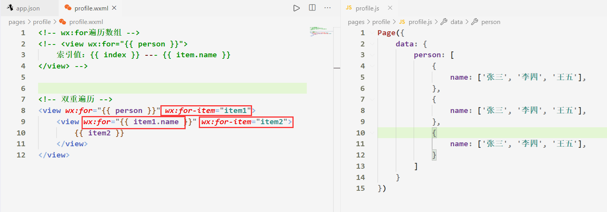


### 6.4.3 wx:for 遍历对象

- `wx:for`指令也可以用来遍历对象，遍历对象时，最好**为每一项和索引的变量重新命名**

- 演示：

    

    - `value`是对象上的属性值， `key`是对象上的属性名


### 6.4.4 wx:key 属性

- 官方推荐我们在使用`wx:for`时，给使用`wx:for`指令的组件**绑定上一个**`wx:key属性`，⽤来提⾼渲染的性能

- 如不提供 `wx:key`，会在控制台报一个 `warning`

    

- `wx:key` 绑定的值 有如下选择 

    1. `string 类型`，代表在 for 循环的 array 中 item 的某个 `property`，该 `property `的值**是唯一**的

        


2. 保留关键字： `*this` 代表在 for 循环中的 item 本身，这种表示需要 **item 本身是唯一**的

    


3. 索引值：`index`

    

    

>注：除了在`wx:key`中绑定索引值可以不加`双大括号`，其余场景绑定索引值，都必须加`双大括号`
>
>


### 6.4.5 循环绑定元素属性

- `wx:for`遍历数据时，我们可以为使用**每一项遍历**到的**元素或者他的子元素**，**动态的绑定元素属性**

    >注：**动态绑定属性时**，可以将`wx:for`遍历到的`items`和`index`作为属性值


### 6.4.6 block wx:for

- 渲染⼀个包含多节点的结构块 `block`最终不**会变成真正的dom元素**


## 6.5 条件渲染

### 6.5.1 wx:if 和 wx:else

- 在元素中，使用 `wx:if=""` 来判断是否需要渲染该代码块：

    - ```html
        <view wx:if="{{ isShow }}">我是内容1</view>
        <view wx:else>我是内容2</view>
        ```

    - ``` js
        // page.js
        Page({
        	data: {
        		isShow: false
        	}
        })
        ```

        

- 当`wx:if`绑定的值为`false`时，会渲染`wx:else`的DOM元素。且`wx:if`所在的DOM**不存在body标签里**

- `wx:else` 元素必须紧跟在**上一个**带 `wx:if` 的元素的后面，否则它将不会被识别。


### 6.5.2 hidden

- `hidden`的用法和`wx:if`非常相似，用于决定一个元素**是否隐藏**

    - ```html
        <view hidden="{{ isShow }}">我是内容1</view>
        ```

    - 当`hidden`的值为`false`时，`hidden` 的元素将会显示在页面中
    - 当`hidden`的值为`true`时，`hidden` 的元素的  CSS `display`属性将会为`none`


### 6.5.3 wx:if 和 hidden 区别

- `wx:if`和`hidden`的对比

    - `wx:if`当值为false时，**body标签中，不会有对应的元素**

    - `hidden`当值为true时，仅仅是将元素的**display属性设置为none**而已

        

- 开发中如何选择呢？

    - 当需要在显示与隐藏之间切片很频繁时，使用`hidden`
    - 当只有一次切换时，通过使用`wx:if`


## 6.6 事件绑定

### 6.6.1 什么是事件？

- 事件是**视图层**到**逻辑层**的**通讯方式**。
- 事件可以将用户的行为**反馈到逻辑层**进行处理。
- 事件可以**绑定在组件**上，当达到触发事件，就会**执行逻辑层中对应的事件处理函数。**
- 触发事件时，可以获取**事件对象**，事件对象上有触发事件的DOM相关数据


- [微信小程序事件参考文档](https://developers.weixin.qq.com/miniprogram/dev/framework/view/wxml/event.html)

    

    

### 6.6.2 事件绑定

- ⼩程序中绑定事件，通过`bind`关键字来实现，`bind`相当于Vue中的`@`，比如：

    -  `bindtap`：监听点击
    -  `bindinput`：监听表单的输入 

    - 最新版本的小程序中 `bind` 后可以紧跟一个冒号，其含义不变，如 `bind:tap`

    - **不同的组件⽀持不同的事件**，具体看[组件说明](https://developers.weixin.qq.com/miniprogram/dev/component)即可。所有组件通用的事件是**点击事件**：`bind:tap`

    

- 注：

    - 在`wxml`中绑定的事件处理函数，**只需填写函数名称**，无需加`()`调用
    - 在微信小程序中，事件处理函数**默认**有一个**形参**，该形参为`event`事件对象

    
    
    

### 6.6.3 表单双向绑定案例

- 接下来以`input`组件为案例，我们希望监听表单的输入事件，并且实现**表单数据**与**逻辑层数据**的**双向绑定**

    ① 在逻辑层的`data`下定义一个`inputVal`属性，用于为`input`组件动态绑定value属性 

    ② 监听`input`组件的键盘输入  

    ③ 在逻辑层对应的事件处理函数中获取表单的最新值，将最新的值赋值到`data`下的`inputVal`属性上

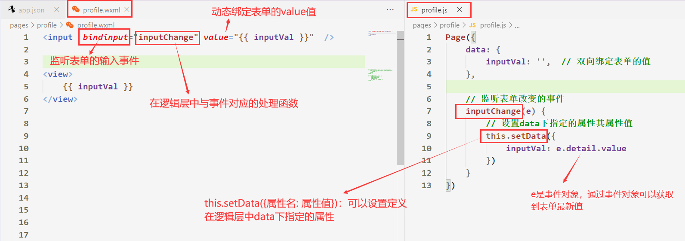


### 6.6.4 事件传参

- 在微信小程序中，绑定事件时**不能带参数** **不能带括号**。以下为错误写法

    


- 官方推荐我们以**自定义属性形式**实现事件**传递参数**功能，具体实现步骤如下


1. 在组件中添加自定义属性，自定义属性以 `data-` 开头，多个单词由连字符 `-` 连接

    - ```html
        <button data-sub-number="{{ 5 }}"> - </button>
        ```

2. 在事件处理函数中可以通过`事件对象.currentTarget.dataset.xxx`获取自定义属性的数据

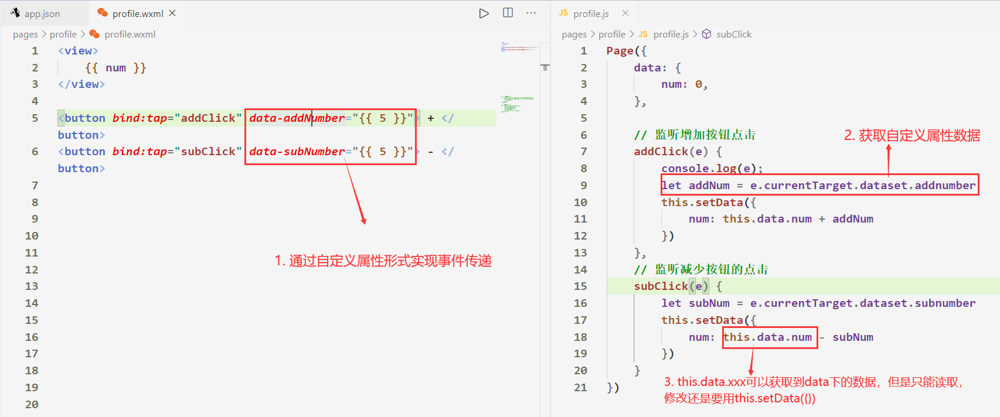


- 注：需要注意`data-xx`属性的定义名称，以及获取方式，参考`细节补充 -> 事件传参属性的命名规范`


### 6.6.5 data的获取和设置

- 在`逻辑层`的方法中**获取data**下的数据：`this.data.xxx`

    - ```js
        Page({
        	data: {
        		num: 0,  
        	},
        	foo() {
        		this.data.num  // 0
        })
        ```

        

- 在`逻辑层`的方法中**设置data**下的数据：`this.setData({属性名: 属性值})`

    - ```js
        Page({
        	data: {
        		num: 0,
        	},
        	foo() {
        		this.setData({
        			num: 1
        		})
        		this.data.num // 1
        	}
        })
        ```

        


# 细节补充

## 1. 事件传参属性的命名规范

- 需要注意下 data的定义名称 以及获取方式

    - 书写方式： 以`data-`开头，多个单词由连字符-链接。具体转换格式如下：

    - `data-element-type` ，最终会呈现为 `event.currentTarget.dataset.elementType` ；

    - `data-elementType` ，最终会呈现为 `event.currentTarget.dataset.elementtype` 

        ​    

- 官方示例：

    - ```html
        <view data-alpha-beta="1" data-alphaBeta="2" bindtap="click">DataSet</view>
        ```

    - ```javascript
        Page({
          click (e){
            e.currentTarget.dataset.alphaBeta === 1 // 会转为驼峰写法
            e.currentTarget.dataset.alphabeta === 2 // 大写会转为小写
          }
        })
        ```

    >建议`data-xxx`属性后面以`kobe-case`命名规范
    >
    >


## 2. data的设置和获取

- 使用 `this.data` 可以获取`逻辑层`中的内部数据和属性值

    

    

- 通过`this.data`修改数据不会有响应式，应使用 `this.setData` 修改内部数据。

    

    


## 3. wxml格式规范

- **类似于HTML代码**：比如可以写成单标签，也可以写成双标签
- **单标签必须有严格的闭合**：没有闭合会导致编译错误
- **大小写敏感**：class和Class是不同的属性
- 在WXML中是**不能直接调用**Page/Component中定义的函数的


## 4. setData()修改data对象指定属性

- 在小程序开发中，若有一串数据如下

    - ```js
        Page({
          data:{
            person:{
              name:'小红',
              age:12
            }   
        })
        ```

- 如果使用以下方法修改**person对象中的name属性**，会直接报错

    

    

- 如果要单独修改**data存储的person对象中的age属性**，可以将对象的属性字符串用中括号包裹住，来进行修改

    


- 如果定义的数据不是渲染在视图层的话，那么可以将**person这一对象**存储在和**data同层级**的地方，直接修改

    - ```js
        Page({
          data:{},
          person:{
             name:'小红',
             age:12
          },
          btnClick (){
            this.person.name = '王五'
        		this.person.age = 18
          } 
        })
        ```

        >注：如果数据没有定义在**data**下，则**不能再视图层被渲染**
        >


