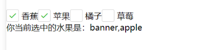
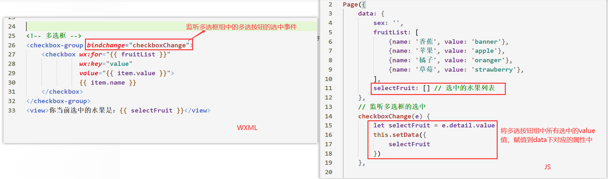
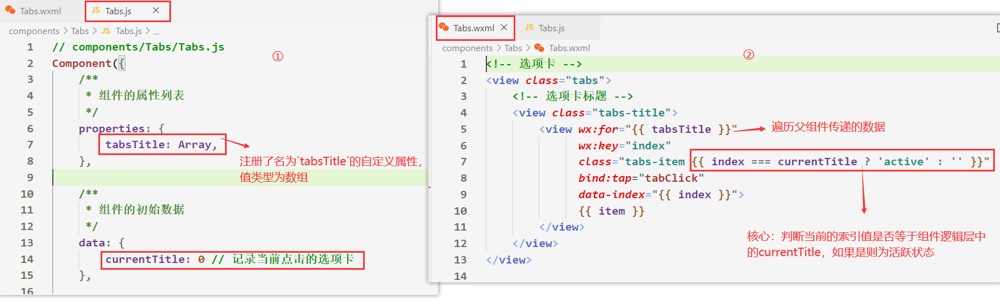
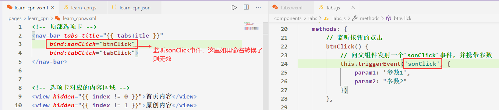

# 一、内置组件

## 1.1 什么是组件？

- 在微信小程序中，**页面布局**是通过`wxml`实现的，在`html`中，我们会将div、span这些布局的东西，称为**标签**或**元素**，但是在`wxml`中，我们往往更愿意把这些**称为组件**

    ​    

- 微信小程序组件参考文档：https://developers.weixin.qq.com/miniprogram/dev/component

    ​    

- 这里重点讲解⼩程序中**常⽤**的**布局组件**

    - `view、text、rich-text、button、image、navigator、icon、swiper、radio、checkbox`。 等


## 1.2 组件的共同属性

- 所有wxml标签(组件)都支持的属性称之为**共同属性**，有如下共同属性


## 常用组件（一）

### view

#### 基础用法

- `view`组件可以代替`html`中的 **div** 标签，特点：块级元素，会换行显示

- 示例代码：

    - ```html
        <view hover-class="two">
           你好你好啊
        </view>
        ```

        

#### view Attributes


### text

#### 基础用法

- `text`组件用于**代替**html中的**span**元素，特点如下

    - **行内非替换元素**，默认**会换行**

    - 无法设置宽高

    - 只能嵌套text组件

    - ⻓按⽂字可以复制（只有该标签有这个功能） 

    - 可以对空格 回⻋ 进⾏编码

      ​    

- 示例代码

    - ```html
        <text user-select decode>
           我是text元素
        </text>
        ```

        

#### text Attributes


### image

#### 基础用法

- `image`组件用于展示图片，该组件特点如下

    - `image`组件默认**宽度**320px、**⾼度**240px

    - ⽀持懒加载

    - `image`组件是一个**块级元素**

      ​    

- 示例代码

    - ```html
        <image src="../../icon/_home.png" 
               lazy-load 
               bind:load="imgLoad"  
               show-menu-by-longpress 
               mode="aspectFit"/>
        ```

        

- 实时预览用户选择的图片案例

    

    

    


>注：由于微信小程序只允许**小程序的大小为8兆**，因此图片资源最好用服务器传来的**图床路径**
>
>


#### image Attributes


#### mode 的可选值


### swiper

#### 基础用法

- `swiper` 组件用于展示轮播图，其特点如下

    - 其中只能嵌套`swiper-item`组件，`swiper-item`组件表示每一项轮播的数据

    - `swiper`组件**存在默认样式**：**width 100%  height: 150px**

    - [参考swiper组件](https://developers.weixin.qq.com/miniprogram/dev/component/swiper.html)

      ​    

- 示例代码：

    - ```html
        <!-- 轮播图组件 -->
        <swiper>
           <swiper-item>
              <image src="..." mode="widthFix"/>
           </swiper-item>
           <swiper-item>
              ..
           </swiper-item>
           ...
        </swiper>
        ```

        

- `swiper`组件**适配**`image`组件等比例缩放：

    - ①将`image`组件的mode属性设置为`widthFix`  

    - ②将`swiper`组件的高度设置为与`image`组件的高度一致

    - ```css
        swiper {
            /* 这里的高度必须与image组件的高度一致 */
            height: xxxpx;
        }
        image {
            width: 100vw;
        }
        ```

        

    


#### swiper Attributes


- 代码示例：

    - ```html
        <!-- 轮播图组件 -->
        <swiper indicator-dots autoplay interval="{{ 3000 }}" circular>
        	...
        </swiper>
        ```

        


#### swiper-item Attributes


###  navigator

#### 基础用法

- [navigator](https://developers.weixin.qq.com/miniprogram/dev/component/navigator.html)
    - 该组件用于**跳转小程序页面**
    - 类似于html中的a标签，不同的是`navigator`组件是**块级元素**，可以设置宽高


- 示例代码

    - ```html
        <navigator url="/pages/demo01/demo01">跳转导航</navigator>
        ```
        
    - `url`用于指定要跳转到当前小程序中的哪个页面下，可以是**相对路径**也可以是**绝对路径**

        - 绝对路径是以微信小程序根目录为基准

    - `open-type`：用于指定链接的跳转方式，具体看下方的`open-type 有效值`


- 注：
    - `navigator`组件**无法跳转到网址链接上**，只允许跳转到小程序的某个页面中
    - `navigator`组件默认不允许跳转到tabbar页面
    - `url`中路径最后不需要加`/`


#### navigator Attributes


#### open-type 有效值


- 示例代码

    

    

    


#### Tips

>使用**navigator组件跳转页面**时，如果**无法跳转**则大多数是以下原因
>

1. 跳转的页面没有在app.json页面中注册。如果是这种问题会在控制台弹出错误，留意控制台即可；
2. 跳转的路径不正确。初学时不太注意会出现这种问题，这种问题同样会在控制台弹出错误。
3. 跳转的页面位于TabBar中。这种情况不会在控制台弹出错误，需要自己去检查，解决的办法是将navigator改成switchtab即可。


### scroll-view

#### 基础用法

[scroll-view](https://developers.weixin.qq.com/miniprogram/dev/component/scroll-view.html)：scroll-view可以实现局部滚动


- 代码演练

    


>注意事项：  **垂直**方向滚动必须设置`scroll-view`一个**高度**，**水平**方向则必须设置**不换行**的css属性
>


#### scroll-view Attribute


#### scroll-view 事件


## 常用组件（二）

### input

#### 基础用法

[input组件](https://developers.weixin.qq.com/miniprogram/dev/component/input.html)


- 代码示例

    - ```html
        <input type="text" placeholder="请输入账号"/>
        <input type="text" placeholder="请输入密码"/>
        <input type="text" placeholder="请输入邮箱"/>
        ```

        


#### input Attribute


#### type 的合法值

>注：type类型只在**真机**上有效，**模拟上看不到键盘类型**
>


#### confirm-type 的合法值


#### input 事件


- 代码示例

    


### rich-text

#### 基础用法

- [rich-text](https://developers.weixin.qq.com/miniprogram/dev/component/rich-text.html) ：富文本标签
    - 可以将字符串解析成 对应标签，类似 **vue**中 `v-html` 功能


- 代码示例

    - ```html
        <rich-text nodes="{{ '<div>你好啊</div>' }}"></rich-text>
        ```

        

    - `nodes`属性用于指定要渲染的HTML字符串，具体可支持的HTML元素以及类名、元素，请看官网文档


#### rich-text Attributes


###  button

#### 基础用法

- [button](https://developers.weixin.qq.com/miniprogram/dev/component/button.html)：Button组件用于创建按钮，默认块级元素

- Button组件演练

    


- `button`组件更重要的是**微信开放能力**，具体查看`open-type 有效值`


#### button Attributes


#### 外观相关属性的有效值


#### open-type 有效值


##### contact

- 直接打开客服对话功能，需要在微信公众平台 -> **小程序后台中 配置客服微信**，并且只能通过**真机调试**打开


##### share

- **转发当前的小程序**，分享到朋友中，无法分享到朋友圈里

    


##### getPhoneNumber

- **获取用户手机号码**，结合一个`getphonenumber`事件来使用，如果不是企业的小程序帐号，则无法使用该功能

  ​    

- 示例代码

    - ```html
        <button open-type="getPhoneNumber" 
                bind:getphonenumber="getphonenumber"
                >获取用户手机号
        </button>
        ```

    - ```js
        Page({
        	// 获取用户的手机号码
        	getphonenumber(e) {
        		console.log(e);  // 用户手机号码就存在e对象里
        	}
        })
        ```

        


##### getUserInfo

- 可以直接**获取用户信息**，无需企业的小程序帐号，结合`getuserinfo`事件使用

  ​    

- 示例代码

    - ```html
        <button open-type="getUserInfo" 
        				bind:getuserinfo="getuserinfo">
        				获取用户信息
        </button>
        ```

    - ```js
        Page({
        	// 获取用户信息
        	getuserinfo(e) {
        		console.log(e);
        	}
        })
        ```

        


##### launchApp （了解）

- 在小程序中直接**打开APP**，前提是APP 需要接入 OpenSDK。 文档请参考 [iOS](https://open.weixin.qq.com/cgi-bin/showdocument?action=dir_list&t=resource/res_list&verify=1&id=1417694084) / [Android](https://open.weixin.qq.com/cgi-bin/showdocument?action=dir_list&t=resource/res_list&verify=1&id=1417751808)

- 由于没有学过`IOS/Android`端，所以这个属性值暂时不做深入


##### openSetting

- 打开小程序内置的**授权页面**，授权页面中只会出现用户曾经点击过的权限


##### feedback

- 打开小程序内置的**意见反馈页面**，只能通过真机调试打开

    


### icon

#### 基础用法

- [icon](https://developers.weixin.qq.com/miniprogram/dev/component/icon.html)：用于展示微信小程序**自带**的字体图标


- 示例代码

    - ```html
        <icon type="success" size="50"></icon>
        <icon type="success_no_circle" size="50"></icon>
        <icon type="info" size="50"></icon>
        <icon type="warn" size="50"></icon>
        ```

    - `type`用于决定当前字体图标的**类型**

    - `size`用于设置当前字体图标的大小，在微信小程序中，**无法**通过`font-size`来修改**自带的字体图标大小**

    - `color`用于改变`icon`组件的**背景颜色**


#### icon Attributes


### radio

#### 基础用法

- [radio单选](https://developers.weixin.qq.com/miniprogram/dev/component/radio.html)


- `radio`组件必须要配合父元素`radio-group`来使用，`radio-group`内部由多个 [radio](https://developers.weixin.qq.com/miniprogram/dev/component/radio.html) 组成。


- 实现一个简易的**单选按钮**的双向绑定

    


#### radio Attributes


#### radio-group Attributes


### checkbox

#### 基础用法

- [checkbox多选框](https://developers.weixin.qq.com/miniprogram/dev/component/checkbox.html)




- `checkbox`组件必须要配合父元素`checkbox-group`来使用，`checkbox-group`内部由多个 [checkbox](https://developers.weixin.qq.com/miniprogram/dev/component/checkbox.html) 组成。


- 实现一个简易的**多选按钮**的双向绑定

    


- 注：`checkbox-group`多选框组，获取到**表单值**的是一个**数组**


#### checkbox Attributes


#### checkbox-group Attributes


# 二、组件化开发

## 2.1 认识组件化

### 2.1.1 什么是组件化？

- 如果我们将一个页面中所有的处理逻辑全部放在一起，处理起来就会变得非常复杂，而且不利于后续的管理
- 但如果，我们将**一个页面**拆分成一个个**小的功能块**，每个功能块 完成属于自己这部分**独立的功能**，那么之后整个页面的管理和维 护就变得非常容易了。


​    


### 2.1.2 小程序组件化思想

- 小程序在刚刚推出时是不支持组件化的, 也是为人诟病的一个点
    -  但是从**v1.6.3**开始, 小程序开始支持自定义组件开发, 也让我们更加方便的在程序中使用组件化.


- 组件化思想的应用： 
    - 尽可能的**将页面拆分成一个个小的、可复用的组件**。
    -  这样让我们的代码更加方便组织和管理，并且扩展性也更强。


>创建自定义组件，往往是为了该组件能够在**多个页面里复用**或者将复杂的页面**拆分**成多个低耦合的**模块**
>


## 2.2 自定义组件的基本使用

### 2.2.1 创建自定义组件

- 一个自定义组件由 `json` `wxml` `wxss` ` js `4个文件组成

  - 先在根目录下创建一个文件夹 **components**, 里面存放我们之后自定义的**公共组件**
  
  - 常见一个自定义组件 **navBar**，包含对应的四个文件：`json` `wxml` `wxss` ` js `
  
    ​    											
  
    

- 创建自定义组件的**步骤**

    1. 声明组件：需要在组件的 ***json*** ⽂件中进⾏**⾃定义组件声明**

        - ```js
            // navBar.json
            {
              "component": true,  // 声明组件
              "usingComponents": {}  // 组件内部也可以注册其他组件
            }
            ```

    2. **在wxml中编写属于我们组件自己的模板** 

    3. **在wxss中编写属于我们组件自己的相关样式** 

    4. **在js文件中, 可以定义数据或组件内部的相关逻辑**


​               

### 2.2.2 注册自定义组件

1. 在需要引入组件的页面的 `json`中**注册组件**，提供对应的**组件名**和**组件路径**，组件路径也可以为绝对路径

    - ```json
        // page.json
        {
          // 在该字段下注册组件
          "usingComponents": {
            "nav-bar": "../../components/navBar/navBar",
            // 组件路径也可以为绝对路径，绝对路径相对于当前微信小程序的根目录
            "nav-bar": "/components/navBar/navBar" 
          }
        }
        ```

2. 在页面的`json`中引用组件后，则可以在该页面的`wxml`中，将注册的**组件名作为标签名使用**

    - ```html
        <!-- page.wxml -->
        <nav-bar></nav-bar>  <!-- 写法一 -->
        <nav-bar />  <!-- 写法二，当标签体内不需要填充内容时使用这种写法 -->
        ```

        

- 使用自定义组件的**流程图**


>注：**组件在哪个页面被注册的就只能在那个页面被使用**
>


### 2.2.3 使用自定义组件注意事项

- 一些需要注意的**细节**： 
    - **wxml标签名**最好遵循`kobe-case`规范 
    - 自定义组件也是可以引用自定义组件的，引用方法类似于**页面引用自定义组件**的方式
    - 自定义组件**标签名**和页面所在项目**根目录名** **不能以“wx-”为前缀**，否则会报错。 
    - 如果在**app.json**的**usingComponents**声明某个组件，那么**所有页面**和**组件**可以**直接使用**该组件


## 2.3 自定义组件的样式细节

### 2.3.1 组件样式选择器

- **组件内的样式** 对 **引用页面样式** 的影响 

    - 结论一：组件内的**class样式**，只对组件wxml内的节点生效，对于引用组件的Page页面不生效。 

    - 结论二：组件内不能使用id选择器、属性选择器、标签选择器 

    - 结论三：在组件中支持使用**后代选择器**

        

        

- **外部样式** 对 **组件内样式** 的影响 

    - 结论一：外部使用**class的样式**，只对外部wxml的class生效，对组件内是不生效的 

    - 结论二：外部使用了id选择器、属性选择器不会对组件内产生影响 

    - 结论三：外部使用了标签选择器，会对组件内产生影响

        

- 整体结论
    - **组件内的class样式和组件外的class样式, 默认是有一个隔离效果的**
    - **为了防止样式的错乱，官方不推荐使用id、属性、标签选择器**
    - **组件样式是独立模块，与全局样式互不影响**

>组件和引用组件的页面不能使用id选择器（`#a`）、属性选择器（`[a]`）和标签名选择器，请改用**class选择器**。
>
>


### 2.3.2 样式的相互影响

- 问题：如何让**组件**与**引用组件的页面**他们之间的**样式**可以**相互影响**？
- 在组件的js文件中需要调用**Component**方法用于**注册一个组件实例**，调用该方法时需要传入配置项，其中**options**配置项有一个**styleIsolation**（隔离）属性。 **styleIsolation**有三个取值：
    - `isolated` 表示启用样式隔离，在自定义组件内外，使用 class 指定的样式将不会相互影响（**默认取值**）
    - `apply-shared` 表示页面 wxss 样式将影响到自定义组件，但自定义组件 wxss 中指定的样式不会影响页面
    - `shared` 表示页面 wxss 样式将影响到自定义组件，自定义组件 wxss 中指定的样式也会影响页面和其他设置了


- 其他一些相关样式细节，参考官网：
    -  https://developers.weixin.qq.com/miniprogram/dev/framework/custom-component/wxml-wxss.html


## 2.4 父子组件通信

### 2.4.1 理解父子组件

- 我们可以把微信小程序的**每个页面当做是一个组件**
    - 如果一个页面的`page.json`中注册了自定义组件
    - 那么我们会将**注册自定义组件的页面**称为`父组件`，**被注册的自定义组件**称为`子组件`


### 2.4.2 理解父子组件通信

- 场景：

    - 一个选项卡可以在多个页面中使用，但是每个页面的**选项卡标题**又不相同
    - 这时候就要让页面来决定选项卡组件所要展示的内容

    


- 组件内展示的内容（数据、样式、标签）一般来说并不是在组件内写死的，而是可以由使用组件的页面来决定。

    


- 如何进行父子组件间的通信呢？

    - 父组件向子组件传递数据：通过`properties（注册属性）`

    - 子组件向父组件传递数据：通过`自定义事件`


### 2.4.3 父级向子级传递数据

> 大部分情况下，**组件只负责布局和样式**，内容是由使用组件的对象决定的


1. 在组件文件夹 -->  `component.js`中的`properties`选项用于**注册**`组件标签`中的一些`自定义属性`

    - ```js
        // component.js
        Component({
          // 注册组件的自定义属性
          properties: {
            innerText: {
              type: String,  // 属性值类型
              value: 'default value',  // 如果父组件没传递数据则该值生效
            }
          }
        })
        ```

        

2. 父组件在使用子组件时，**动态绑定**子组件注册的**自定义属性**，那么子组件注册的自定义属性，就会被挂载到子组件的`data`选项中，且**值为父组件动态绑定的值**

    


- 子组件注册的自定义属性**类型**可以**简写**

    - ```js
        properties: {
            tabsTitle: Array  // 表示tabsTitle这个自定义属性值类型为数组类型
        }
        ```

    - 支持的类型：  String、Number、Boolean Object、Array、null（不限制类型）

    

    

- 细节补充：

    - 如果父组件**传递的数据类型**与子组件**定义**的**数据类型不一致**，控制台不会报错，但是页面渲染不出对应的组件

    - 与`Vue`不同的是，父组件传递给子组件的**数据**，在子组件内部可以**直接被修改**，不会报错！

    - `properties`的命名规范：参考`细节补充 => properties的命名规范`

      ​    

      ​    


### 2.4.4 子级向父级传递数据

- 自定义事件的**流程**

    1. 在子组件中，通过`this.triggerEvent('自定义事件名', 要传递的参数)`来发射`自定义事件`。

    2. 在父组件中使用的**子组件标签**中，通过`bind:`来监听`子组件发射的自定义事件`。并执行父组件中对应的方法


- 自定义事件的**流程代码**

    


- 子组件发射自定义事件时，如果想**携带多个参数**，可以传递一个**对象**

    - 传递的参数会**覆盖**父组件中对应的事件回调函数中事件对象上的`detail`属性

        


### 2.4.5 向子组件传递样式

- 有时候，我们不希望将样式在组件内固定不变，而是外部可以决定样式。 

    - 这个时候，我们可以使用externalClasses属性： 

        ​	➢ 1. 在Component对象中，定义externalClasses配置项

        ​	➢ 2. 在组件内的wxml中使用externalClasses属性中的class 

        ​	➢ 3. 在页面中传入对应的class，并且给这个class设置样式


### 2.4.6 父子组件通信案例

- 需求如下：

    ​	① 封装一个选项卡组件 

    ​	② 选项卡上的文字由使用的页面来决定(父传子数据)

    ​	③ 点击选项卡上的文字时，点击到的那个文字就变为红色

    ​	④ 点击选项卡时，向父组件发射传递数据，父组件根据子组件传递的数据，来决定展示什么内容

    

1. 在页面的`json`中引用选项卡组件，**并在使用该组件时传递数据**

    


2. 在`Tabs`组件中注册自定义属性，用于**接收**父组件传递来的数据，并且将传递的数据进行**渲染**

    


3. 监听每个选项卡的点击事件，并且将当前选项卡的**索引值**作为**参数**进行传递，在事件处理函数中将获取到的索引值赋值到`currentTitle`数据中

    

    

4. 在**点击**选项卡的事件**处理函数**中向父组件`发射事件`，并携带当前点击的选项卡的`index`值作为参数传递

    

5. 父组件监听子组件发射的事件，并将子组件携带的参数，赋值到父组件逻辑层中的`index`下

    


6. 在父组件中根据逻辑层的`index`，决定展示不同的内容


### 2.4.7 获取组件实例

- 在父组件里调用 `this.selectComponent` ，可以获取**子组件**的**实例对象**

    - 调用时需要传入一个匹配选择器 `selector`，如：`this.selectComponent(".my-component")`
    - 选择器支持`id选择器`和`class选择器`

    

- 代码示范

    

    

    

    - 在上例中，父组件将会获取 `id` 为 `tab-control` 的子组件实例对象，即子组件的 `this` 


>注：**this.selectComponent()**只能够获取在当前页面中注册的自定义组件实例
>


## 2.5 slot 插槽

### 2.5.1 认识插槽

- 当我们使用其子组件时，我们往往都是通过`子组件标签`来展示`子组件内容`的。
    - 有时我们希望子组件里面能够给我们***预留一些空位***，以便**于父组件填充**，这样的子组件则更加灵活。
- [微信小程序插槽文档](https://developers.weixin.qq.com/miniprogram/dev/framework/custom-component/wxml-wxss.html)


### 2.5.2 单个插槽的使用

- 在子组件的`wxml`中，使用特殊的标签`<slot>`就可以为子组件开启一个插槽。
    - 该`slot元素`中插入什么内容***取决于父组件如何使用***。
    - 子组件定义的`slot元素`最终都是被**父组件所填充的内容给替换掉**的

1. 给子组件的模板区域定义一个插槽：`slot`元素

2. 父组件在使用子组件时，在`子组件标签`中编写的wxml内容，会替换掉子组件的`slot`元素


### 2.5.3 多个插槽的使用

- 默认情况下，一个组件的 wxml 中只能有一个 slot 。需要**使用多 slot** 时，必须在**组件 js** 中声明。

    - ```js
        Component({
          options: {
            multipleSlots: true // 在组件定义时的选项中启用多slot支持
          },
          properties: { /* ... */ },
          methods: { /* ... */ }
        })
        ```

    
    

1. 在组件 wxml 中 给插槽`solt元素`添加一个`name`属性，以不同的 `name` 来区分
2. 父组件往`子组件标签`中填充内容时，可以**通过slot属性指定插槽的名字**来替换子组件中***特定的`slot元素`***


# 三、小程序系统 API（一）

## 3.1 认识小程序系统API

- 微信小程序API（Application Programming Interface），即应用**程序编程接口。**API是一种接口函数，把函数封装起来给开发者，这样好多的功能就不需要你去实现了，**只要会调用**就好了。

    - 当js文件**运行在浏览器**时，浏览器会提供对应的API，比如**DOM、BOM**以便于开发者实现特定功能
    - 当js文件**运行在微信小程序**时，微信小程序也会提供对应的API，比如**网络请求、数据存储**等

    - 微信小程序**API文档**：https://developers.weixin.qq.com/miniprogram/dev/api/

    

    

>注：**只有运行在微信小程序中的js文件**，才能够使用微信小程序API
>


## 3.2 网络请求

### 3.2.1 服务器配置

- 当我们直接通过`wx.request`发送网络请求时，我们会发现在微信开发者工具中控制台会报这样一个错误

    

    

- 这是因为每个微信小程序需要事先在「**小程序后台-开发-开发设置-服务器域名**」 中进行配置，小程序**才可以跟指定的域名进行网络通信**，具体规则如下：


- 有时后端人员并没有配置好服务器域名，但是我们又希望能够发送网络请求访问到数据，如何做到？

    - 在微信开发者工具中打开**详情 --> 基本设置 --> 勾选不检验合法域名**

        


### 3.2.2 基本使用

[网络请求](https://developers.weixin.qq.com/miniprogram/dev/api/network/request/wx.request.html)

- 微信提供了专属的API接口，用于网络请求: `wx.request(Object object)`

- 调用`wx.request()`时，需要**传入一个对象**，该对象有如下属性

    

    - 比较关键的几个属性解析: 

        ​		➢ url: 请求的网络地址

        ​		➢ data: 携带的请求参数 

        ​		➢ method: 请求的方式 

        ​		➢ success: 请求成功时的回调函数

        ​		➢ fail: 请求失败时的回调函数


- 代码演练

    


### 3.2.3 网络请求的封装

- 为什么需要在微信小程序自带的网络请求API上再进行一次封装？
    1. `wx.request`方式发送网络请求比较古老，不支持Promise
    2. 使用我们封装好的函数去发送网络请求，对`wx.request`的依赖程序没有那么高


1. 在微信小程序项目的**根目录**下新建 ***network***文件夹

2. 在***network***文件夹中新建***network.js***文件，该文件用于**封装`wx.reuqest`**

3. 在 ***network.js*** 中写入如下代码

    


4. 在`page.js`中通过**ES6模块化语规范**导入封装好的***request函数***，并发送网络请求


5. 由于返回的是Promise对象，因此也可以用***async await*** 语法糖简写

    


## 3.3 展示弹窗

### 3.3.1 wx.showToast()

[吐司弹窗](https://developers.weixin.qq.com/miniprogram/dev/api/ui/interaction/wx.showToast.html)


- 调用`wx.showToast()`时，需要传入一个对象，该对象具体可传入的配置项需要查看文档

    

- 代码演练

    


>注：[wx.showLoading](https://developers.weixin.qq.com/miniprogram/dev/api/ui/interaction/wx.showLoading.html) 和 [wx.showToast](https://developers.weixin.qq.com/miniprogram/dev/api/ui/interaction/wx.showToast.html) 同时只能显示一个


### 3.3.2 wx.showModal()

[模态对话框](https://developers.weixin.qq.com/miniprogram/dev/api/ui/interaction/wx.showModal.html)


- 代码演练

    


### 3.3.3 wx.showLoading()

[loading提示框](https://developers.weixin.qq.com/miniprogram/dev/api/ui/interaction/wx.showLoading.html)


- 注：
    - 需主动调用 **wx.hideLoading** 才能关闭loading提示框
    - [wx.showLoading](https://developers.weixin.qq.com/miniprogram/dev/api/ui/interaction/wx.showLoading.html) 和 [wx.showToast](https://developers.weixin.qq.com/miniprogram/dev/api/ui/interaction/wx.showToast.html) 同时只能显示一个


- 代码演练

    


### 3.3.4 wx.showActionSheet()

[显示操作菜单](https://developers.weixin.qq.com/miniprogram/dev/api/ui/interaction/wx.showActionSheet.html)


- 代码演练

    


## 3.4 页面分享

- 分享是小程序扩散的一种重要方式，小程序中有两种分享方式： 
    - 点击右上角的**菜单按钮**，之后点击转发，通过`onShareAppMessage`生命周期函数
    - 点击**某一个按钮**，直接转发，通过`button`组件的**开放能力**


### 3.4.1 onShareAppMessage

[onShareAppMessage](https://developers.weixin.qq.com/miniprogram/dev/reference/api/Page.html#onShareAppMessage-Object-object)

- `onShareAppMessage`是**页面生命周期函数**
    - 该函数用于监听用户点击页面内转发按钮（[button](https://developers.weixin.qq.com/miniprogram/dev/component/button.html) 组件 `open-type="share"`）或右上角菜单“转发”按钮的行为，并**自定义转发内容**。

- **注意：只有定义了此事件处理函数，右上角菜单才会显示“转发”按钮**


- 此事件处理函数需要 ***return 一个 Object***，**用于自定义转发内容**，返回内容如下：


- 代码演练：

    


### 3.4.2 button的开放能力

- `button`组件中有个***open-type***属性，该属性有一个值为***share***，用于**触发用户转发**

    


- 代码演练

    - ```html
        <button open-type="share">分享小程序</button>
        ```

        

- 注：
    - 通过**button组件**方式分享小程序，其分享的自定义内容也需要在`onShareAppMessage`函数中进行配置
    - 通过**button组件**方式分享小程序时也会触发`onShareAppMessage`函数


## 3.5 小程序的登录流程

### 3.5.1 登录流程解析


1. 在 ***app.js*** 中调用 ***wx.login*** 获取**code**
2. 调用wx.request携带**code参数**发送**网络请求**到我们自己的服务器
3. 将服务器返回的**token**进行**本地存储**，
4. 请求需要登录态标识接口时，**携带token**，一般设置在**请求头**中


### 3.5.2 登录流程代码

- 接口说明

    


- 代码演练

          


## 3.6 本地存储

### 3.6.1 wx.setStorageSync()

- 将**数据存储**在**本地缓存中**指定的 key 中。会覆盖掉原来该 key 对应的内容。除非用户主动删除或因存储空间原因被系统清理，否则数据都一直可用。


- 调用该方法需要传入两个参数

    - 第一个参数：类型String，本地缓存中指定的 key

    - 第二个参数：任意类型，需要存储的内容

        

- 代码演练

    - ```js
        // 在本地存储中存储了key为 'token',  值为123的数据
        wx.setStorageSync("token", 123)
        ```

        

- 在**微信开发者工具**中查看**本地存储的数据**

    

>注：单个 key 允许存储的最大数据长度为 1MB，所有数据存储上限为 10MB。
>
>


### 3.6.2 wx.getStorageSync()

- 从本地缓存中**同步获取**指定 key 的内容

- 代码演练

    - ```js
        // 获取本地存储中key为 'token' 的数据
        const token = wx.getStorageSync("token")
        ```

        

### 3.6.3 wx.removeStorageSync()

- 从本地缓存中**移除指定 key**。

- 代码演练

    - ```js
        // 移除本地存储中 key 为 'token' 的数据
        wx.removeStorageSync("token")
        ```

        

- 也可以直接通过微信开发者工具清除所有的本地缓存

    

    

    


## 3.7 界面跳转


>界面的跳转有两种方式：通过**navigator组件** 和 通过**wx的API**跳转
>


### 3.7.1 navigator组件跳转页面

- `navigator`组件属性


- `open-type`有如下取值
    - **navigate**：保留当前页面，**跳转到非tabbar页面**
    - **redirect**：关闭当前页面，跳转到应用内的某个页面。但是**不允许跳转到 tabbar 页面**，并且不能返回。
    - **switchTab**：**跳转到 tabBar 页面**，并关闭其他所有非 tabBar 页面。（需要在tabBar中定义的） 
    - **reLaunch**：关闭所有的页面，打开应用中某个页面。（直接展示某个页面，并且**可以跳转到tabBar页面**）


- 代码演练

    

    

    

    


### 3.7.2 navigator跳转页面传参

1. 在`navigator`组件中的url路径后可以带参数，参数与路径之间使用 `?` 分隔，参数键与参数值用 `=` 相连，不同参数用 `&` 分隔；如 'path?key=value&key2=value2'

    - ```html
        <!-- 跳转页面时携带参数 -->
        <navigator url="/pages/demo01/demo01?name=kobe&age=38">
            跳转到demo01页面 并携带参数
        </navigator>
        ```

        

2. 在跳转页面的**js**文件中，可以通过`onLoad`生命周期函数中的形参，来获取上一个页面所携带的参数

    - ```js
        // pages/demo01/demo01.js
        Page({
          onLoad: function (options) {
            console.log(options);  // {name: "kobe", age: "38"}
          },
        })
        ```


>需要注意的是：**传递参数时，其页面路径不需要加上/作为结尾**，以下写法是错误的写法
>
>
>
>


### 3.7.3 系统API跳转页面

[路由](https://developers.weixin.qq.com/miniprogram/dev/api/route/)

- 很多情况下，我们并不喜欢使用navigator组件来进行跳转页面： 
    - 可能我们希望用户点击了某个button或者view时，对该button或者view进行监听 
    - 之后，通过相关的代码逻辑实现跳转


- 对此，微信也提供了对应的API接口： 
    - `wx.navigateTo(url[, ]) `
    - `wx.navigateBack([delta])`


- 代码演练

    


### 3.7.4 系统API跳转页面传参

- 方式一：在url路径后面直接拼接要**携带的参数字符串**

    


- 方式二：

    

>注：当需要**传递特别多参数**时，推荐使用**第二种方式**
>


- 坑：传递**数字类型**参数时，跳转到的页面会**自动转换为字符串类型**


# 四、小程序系统 API（二）

## 4.1 wx.previewImage()

[wx.previewImage(object)](https://developers.weixin.qq.com/miniprogram/dev/api/media/image/wx.previewImage.html)

- 在新页面中**全屏预览图片**。预览的过程中用户可以进行保存图片、发送给朋友等操作。


- 代码演练

    


## 4.2 wx.chooseAddress()

[wx.chooseAddress(Object object)](https://developers.weixin.qq.com/miniprogram/dev/api/open-api/address/wx.chooseAddress.html)

- 获取用户收货地址。并在编辑完成后返回用户选择的地址


-  代码演练

    

    


# 细节补充

## 1. 组件的命名规范

- 在**注册一个组件**的时候，我们始终需要给它一个名字。使用组件时，**组件名**将会被作为**自定义元素**

- ***组件名规范***：虽然在`wxml`中允许使用大写标签，但建议遵循`kobe-case`规范

    - ```js
        // 注册组件
        {
          "usingComponents": {
            "nav-bar": "../../components/Tabs/Tabs"
          }
        }
        ```

    - ```html
        <!-- 使用组件 -->
        <nav-bar></nav-bar>
        ```

        


##2. properties的命令规范

- `properties`中注册的**自定义属性名**最好以`小驼峰`命名
- 在使用**自定义属性**时，虽然`wxml`允许组件属性大写，但建议将**自定义属性**转换为等价的 `kobe-case` 格式


- 组件注册的**自定义属性名**应**避免以 data** 开头
- 组件注册的**自定义属性名**和 **data 配置项中的属性**不能冲突


- 坑：
    - **组件的自定义属性如果是大驼峰命名的，则不能转换为等价的`kobe-case`格式**
    - 如果不希望折腾自己，可以不转换为`kobe-case`格式，当然，这只是建议


## 3. 自定义事件的命名规范

- 子组件通过`this.triggerEvent('自定义事件名', 要传递的参数)`向父组件发射一个自定义事件

- 自定义事件名的命名规范：**遵循`驼峰`命名规范**

- 父组件监听子组件发射的事件时，子组件传递什么事件名，父组件就监听什么事件，**无需命名转换**

    


## 4. 系统API中的this

-  在系统API中，我们经常看到 ***success 、fail*** 等回调函数，这类回调函数往往会携带着一些**状态形参**

    - 比如模态框的success回调函数中携带的**res参数**，就是存储着用户点击状态

        


- 有时，我们希望将 **success 回调函数**中**携带的参数**，定义在data对象下，如何做到？

- 如果直接在**success**回调函数中使用`this.setData()`，会发现此时的***this是undefined***

    

    

- 解决方案一：在系统API外层 **定义一个变量用于存储 this**

    


- 解决方案二（**最优**）：***success***这类回调函数**定义为箭头函数**

    


