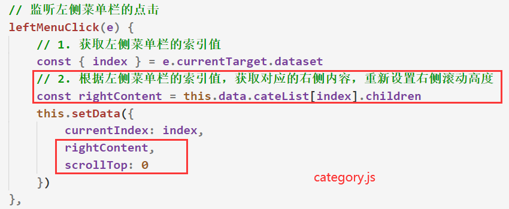
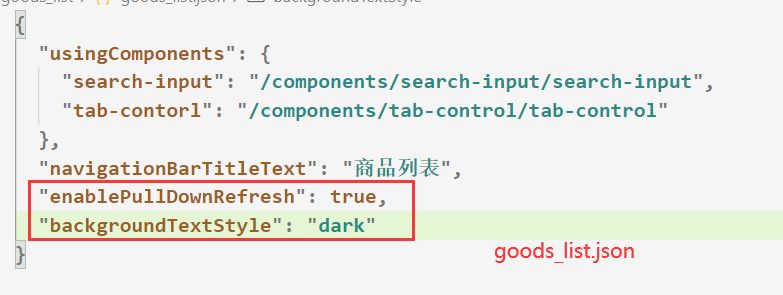
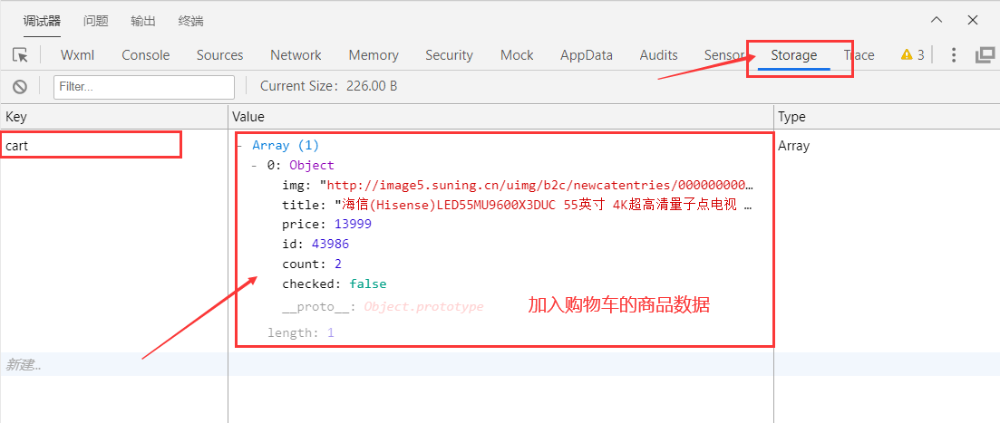
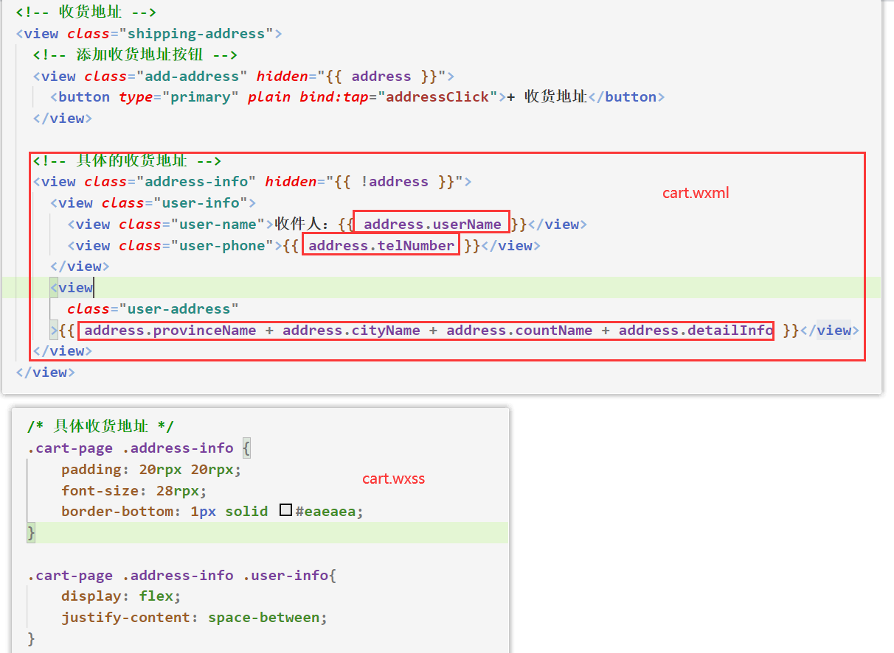
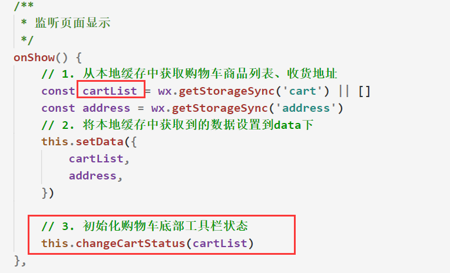
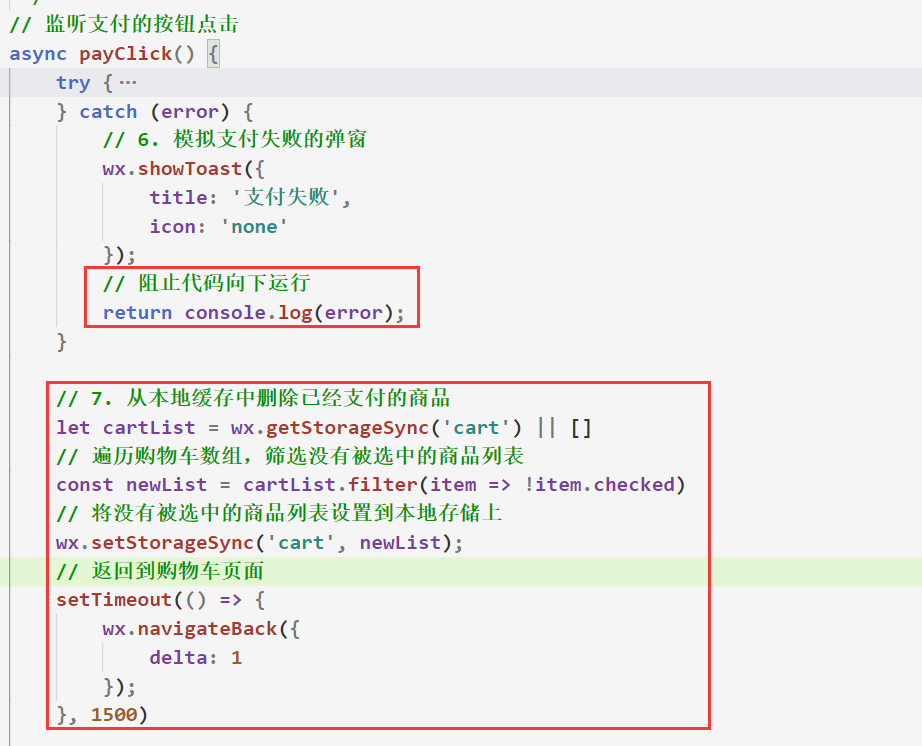
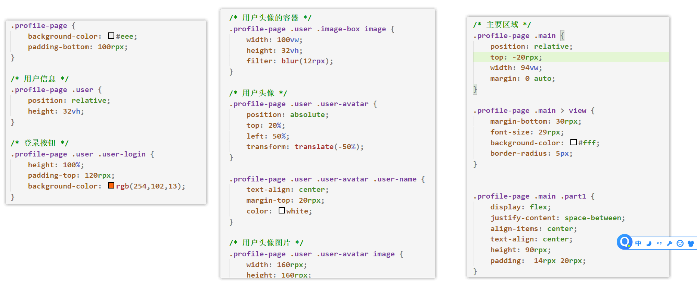
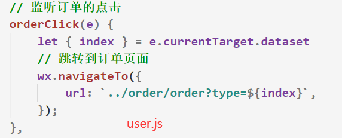

# 一、黑马优购 ----- 项目初始化

## 1.1 项目预览和技术选型

- 项目预览

    

- 小程序的第三方框架

    - 腾讯 wepy  类似vue

    - 美团 mpvue  类似vue

    - 京东 taro   类似react

    - uni-app   类似vue

        

- 项目的技术选型：
  
    - 本次项目不采用任何的小程序第三方框架，而是**通过原生小程序框架进行开发**

## 1.2 目录结构搭建

1. 新建小程序项目

2. **划分项目目录结构**

    

    

    

    

## 1.3 搭建项⽬的⻚⾯

1. 每个页面介绍

    

2. 代码实现

    

## 1.4 引入字体图标

1. 在阿里字体图标库中选择好字体图标后，**打开在线链接**

    

2. 打开链接后将**css样式复制**到项目文件夹下的 ***assets --> css -->iconfont.wxss*** 文件中

    

3. 在 ***app.wxss*** 中全局引入字体图标样式，在任何页面中都可以通过类名来展示字体图标，除了组件

    

>注：在阿里字体图标库项目中每次新增图标，就需要**重新获取在线链接**，重新更新到 ***iconfont.wxml*** 下
>

## 1.5 搭建tabbar结构

- 参照⼩程序基础中的tabbar知识点：`微信小程序基础 --> app.json配置`

- 代码实现

    

## 1.6 样式初始化

1. 在***app.wxml*** 中引入初始化样式的wxml文件

    

2. 在 ***app.json***中修改顶部导航栏样式

    

## 1.7 配置网络请求

1. 在  ***network ---> network.js***  中 编写如下代码，用于**二次封装**微信小程序的网络请求功能

    

2. 以获取首页轮播图为例，一般我们都会在***network文件夹***中存放**获取数据的js文件**，以下是调用演示

    

3. 配置服务器域名

    

4. 配置好合法域名后，可以关闭**不检验合法域名的选项**，只有配置好合法域名后，手机才能预览微信小程序项目

    

>注：如果配置好合法域名后真机依然无法预览小程序，则需要先通过调试预览即可
>

- 接口文档地址：https://www.showdoc.com.cn/128719739414963

# 二、黑马优购 ----- 首页

- 效果

    

## 2.1 搜索框

1. 在 ***components*** 中 新建 ***search-input*** 组件，该组件用于展示搜索框，并在 首页页面中引入该组件

    

    

    

2. 实现***search-input*** 组件视图，以及页面跳转功能

    

>注：**组件样式与全局样式是隔离开来的**，因此组件样式必须单独引用字体图标
>

## 2.2 轮播图

1. 在 ***network***文件夹下新建***index.js***文件，该文件用于存放**首页获取数据**的方法，并封装一个**获取轮播图数据**的方法

    

2. 在**首页的逻辑层**中，导入获取轮播图数据的函数，将获取到的轮播图数据赋值到 **data** 数据中

    

3. 在***components文件夹***新建***swiper组件***，并在首页中被引用

4. 首页将获取到的轮播图数据传递给**swiper组件**，让**swiper组件**通过`wx:for`遍历展示

    

    

5. 需要判断轮播图数据是否有**goods_id字段**，如果有则跳转页面，否则不跳转页面

    

- 注：微信小程序中使用***async、await***语法需要开启增强编译模式

    

## 2.3 分类导航

- 在**首页逻辑层**中发送网络请求获取分类导航数据，并将获取到的数据传递给子组件，让其进行渲染

    

    

- 在pages -> **index**文件夹下新建 ***childIndex文件夹***，该文件夹用于**存放首页相关**且不可被其他页面复用的子组件

    

## 2.4 楼层

1. 在 ***network*** ->***index.js***文件中，封装一个**获取楼层数据**的方法

    

2. 在**首页的逻辑层**中，导入获取楼层数据的函数，将获取到的楼层数据赋值到 **data** 数据中

    

3. 在***childIndex文件夹***新建***index-floor组件***，并在首页中被引用

4. 首页将获取到的楼层数据传递给**index-floor组件**，让**index-floor组件**展示

    

# 三、黑马优购 ----- 分类

## 3.1 筛选分类页面数据

1. 封装一个获取分类页面数据的方法

    

2. 在**分类逻辑层**中，发送网络请求，获取分类页面数据，并且将获取到的数据进行筛选

    

## 3.2 左侧菜单栏实现

- 实现分类页面**左侧菜单栏**的渲染，并实现**点击高亮**的功能

## 3.3 右侧内容区实现

- 将`rightContent`数据渲染到右侧内容区

    

    

- 点击左侧菜单栏时，**右侧scroll-view**区域需要回到顶部，并渲染和左侧菜单栏对应的数据

    

- 监听**品牌列表的点击**，并**携带分类id**参数跳转到**商品列表页面**

    

## 3.4 实现本地存储功能

- 需求：

    1. 将获取到的分类数据存储到微信本地上，并设置一个过期时间
    2. 分类页面加载时，先从本地存储上获取分类页面数据
    3. 如果本地存储没有分类数据，或数据已过期，则重新发送网络请求获取新的分类数据

- 代码实现

    

# 四、黑马优购 ----- 商品列表

## 4.1 封装选项卡组件

1. 在**components -> 新建 tab-control**文件夹，用于存放选项卡组件

    

2. 在商品列表页面中引入并监听**tab-control**组件发射的事件，根据**选项卡的索引值**，决定**渲染不同的内容区域**

    

## 4.2 获取商品列表数据

1. 封装一个**发送网络请求获取商品列表数据**的方法

    

2. 在**商品列表的逻辑层**中获取页面传递的参数，并且在**data下定义**发送网络请求时要**携带的参数**

    

    

3. 发送网络请求，获取商品列表数据，将获取到的数据存储到**goodsList**下

    

## 4.3 渲染商品列表

1. 对`goodsList`数据进行遍历渲染

    

2. 当商品列表点击时，需要**携带商品id参数**跳转到**商品详情页**

    

    

## 4.4 上拉加载更多

1. 监听商品列表页面的上拉加载事件，**修改页码，重新发送网络请求**

    

2. 重新发送网络请求时，需要将**获取到的商品列表与原来的商品列表数组进行合并**

    

## 4.5 代码优化 - 网络请求时的弹窗

1. 在 ***network.js*** 中，一旦**发送网络请求则展示弹窗**，当**网络请求结束后关闭弹窗**

2. 如果一次性有多个网络请求，则**需要等所有的网络请求都结束后**，在关闭弹窗

    

## 4.6 下拉刷新

1. 在**商品列表页面**的**配置文件**中，配置页面的下拉刷新功能

    

2. 监听**下拉刷新事件**，**重新设置页码和商品列表数据**，然后发送网络请求，重新获取数据，关闭页面的下拉刷新

    

# 五、黑马优购 ----- 商品详情页

## 5.1 获取商品详情数据

1. 在***network -> goods.js*** 中封装一个**获取商品详情数据**的网络请求方法

    

2. 在 ***goods_detail.js*** 中 的**onLoad生命周期函数**中获取页面携带的**商品id**

3. 并根据该**商品id**发送网络请求获取**商品详情数据**，将获取到的数据**定义在data**下

    

    

## 5.2 轮播图展示

1. 在 ***childDetail ->*** 新建 ***detail-swiper组件***，用于展示详情页的**轮播图数据**

2. 在 ***goods_detail.json***中**声明引入**轮播图组件并将**轮播图数据**传递给该组件

    

3. ***detail.swiper***组件对父组件传递过来的**轮播图数据进行渲染**

    

## 5.3 价格 & 名称 & 图文详情展示

1. 在 ***goods_detail.wxml*** 中对**goodsInfo**数据进行渲染

    

2. 在 ***goods_detail.wxss*** 中编写**对应的样式**

    

- 注：由于后台返回的图片格式有**webp格式**，iPhone不支持该图片格式，因此在获取数据时就需要**对该数据进行转换**

    

## 5.4 轮播图点击放大预览

1. 监听轮播图的点击事件，并且传入当前点击的index值

    

2. 将轮播图数组数据进行重构，重构成**只有远程图片路径的数组**，通过`wx.previewImage`实现图片预览放大功能

    

## 5.5 底部工具栏

1. 在 ***chilDetail*** 下 新建 ***nav-bottom*** 组件，该组件用于渲染商品详情页的**底部工具栏**

2. 在 ***goods_detail*** 中引入并使用 ***nav-bottom*** 组件

3. 完成 ***nav-bottom*** 组件的渲染

    

>注：这里需要用到**button的开放功能**，可以**结合样式**来达到**偷天换日**功能
>

## 5.6 加入购物车

1. 监听 ***nav-bottom*** 组件中**加入购物车**的**点击事件**，并**发射给父组件**，让父组件处理逻辑

    

- 实现点击加入购物车的**具体业务逻辑流程**如下

    1. 获取当前的**商品数据**，并整合成购物车界面所需要的数据

    2. 获取本地存储中的购物车数组 ***cart***

    3. ***遍历cart数组***，判断**当前要加入购物车的商品**是否已存在 ***cart数组*** 中
    4. 如果已经存在，则**修改**当前商品的**数量属性**，让**数量属性 + 1**

    5. 如果不存在，则将当前商品数据**追加**到 ***cart 数组中***

    6. 将 ***cart数组*** 重新添加到本地存储中

    7. 弹窗提示：加入成功

        

- 代码实现

- 可在微信开发者工具中查看本地存储的商品是否存在，并检验添加同一个商品是否数量会变化

    

# 六、黑马优购 ----- 购物车

## 6.1 添加收货地址按钮

1. 编写好 **+ 收货地址按钮**的 wxml结构 和wxss样式

    

2. 监听**收货地址按钮**的**点击事件**，调用`wx.chooseAddress` API，让用户添加收货地址

3. 将选择好的**收货信息保存到本地缓存中**并**定义在data**下

    

    

## 6.2 收货地址和按钮的切换显示

1. 在购物车页面加载时，**获取本地缓存中的收货地址**，并赋值到data下

    

    - 由于购物车页面需要被频繁的打开，上图中的**onLoad需要修改为onShow函数**

2. 根据***address数据***，渲染具体的收货地址

    

3. 通过判断 ***address*** 对象是否有值，来决定渲染**添加收货按钮**还是**收货地址**

    

    

## 6.3 购物车列表渲染

1. 监听购物车页面的加载，***用onShow函数***，获取本地缓存中的***cart数组***，并赋值到data下

    

2. 在***cart.wxm***l中 对  ***cartList***  数据进行**遍历渲染**

    

- 购物车商品列表的css样式

    

## 6.4 购物车底部结算区域

1. ***cart.wxml***	

    

2. ***cart.wxss***

    

## 6.5 实现全选按钮

1. 在***cart.js*** 中 的***data***下分别定义三个变量，用于控制购物车底部工具栏的状态

    

2. 监听**全选复选框**的点击事件，将data下的 **allChecked属性**进行取反

    

    

3. 遍历购物车数组的每一项，将每个商品的**checked属性都与allChecked保持一致**

    

4. ***cart.js*** 中 封装一个方法：将**修改后的cartList**数组设置回**data和本地缓存中** 并 **重新计算 底部工具栏的数据 全选 总价格 购买的数量**

     ① 都需要商品被选中 我们才拿它来计算

     ② 判断商品是否被选中(通过**filter过滤checked为true的数组)**

     ③ 总价格 += 商品的单价 * 商品的数量

     ④ 总数量 +=商品的数量

     ⑤把计算后的价格和数量 设置回data中即可

    

    

5. 将更改后的cartList数组，重新设置到data与本地缓存中，并重新计算商品总价格和总数量

    

6. 在onShow函数中，也需要**初始化购物车的底部工具栏状态**

    

## 6.6 商品的选中

1. 绑定change事件

2. 获取到被修改的商品对象

3. 商品对象的选中状态 取反

4. 重新填充回data中和缓存中

5. 重新更新底部工具栏状态

## 6.7 全选和复选框的关联

1. 获取cartList数组

2. 获取checked为true的新数组

3. 判断新数组的长度是否等于cartList数组

4. 如果等于，则说明商品全部被选中了

    

- 上图代码中的核心思路有bug，不够严谨

    

## 6.8 商品数量的编辑

1. 商品数量的编辑

    1. "+" "-" 按钮 绑定**同一个点击事件** 区分的关键：**自定义属性** 

    2. “+”："+1"

    3. "-" ："-1"

2. 传递被点击的商品的**index值**

    

3. 获取data中的购物车数组 来获取需要被**修改的商品对象**

4. 当 购物车的数量 =1 同时 用户 点击 "-"

    1. 弹窗提示(showModal) 询问用户 **是否要删除**（将微信的模态框API**封装成Promise形式**）

        1. 确定：直接执行删除，根据索引删除指定的数组元素

        2. 取消：什么都不做 
        3. return：阻止代码向下云翔

5. 直接修改商品对象的数量 count

6. 把cart数组 重新设置回 缓存中 和data中 ，并**重新更新底部工具栏的状态**

    

## 6.9 点击结算

1. 判断有没有收货地址信息，弹窗提示，return

2. 判断用户有没有选购商品，弹窗提示，return

3. 经过以上的验证 跳转到 支付页面！ 

## 6.10 没有商品的状态提示

# 七、黑马优购 ----- 支付页面

- 支付流程

    

## 7.1 支付页面展示

- 直接拷贝购物车页面的***wxml和wxss样式***，对应着删除

    

- pay.js

    1. 从本地缓存中获取收货信息和购物车列表
    2. 从购物车列表中筛选出选中的商品，重构成一个新数组

    3. 重新设置到data下

    4. 计算总价格和总数量

        

## 7.2 支付权限的分析

- 哪些人 哪些帐号 可以实现微信支付

    1. **企业帐号** 

    2. 企业帐号的小程序后台中 必须 给开发者 添加上**白名单** 

        1. 一个 appid 可以同时绑定多个开发者

        2. 这些开发者就可以公用这个appid 和 它的开发权限 

- 由于我的微信账号不是企业账号，因此无法完成真实的微信支付功能，**只能够模拟实现**

## 7.3 获取Token

1. 在pay.js 中监听支付按钮的点击，判断**本地存储**中是否有token值

    1. 如果没有则跳转到**支付授权**页面
    2. 如果有token，则通过token发送网络请求，**创建订单**

    

2. 在**auth**页面，需要通过**button**组件的开放功能，来**获取用户信息**

    

4. 在***auth.js*** 中监听**支付授权按钮**的**点击**
    1. 获取用户信息
    2. 获取用户登录的code （将wx.login封装成Promise形式）
    3. 携带用户信息以及code，发送网络请求，获取token ，在***network -> login.js***中封装
    4. 将token存储在本地缓存中
    5. 返回到支付页面

## 7.4 完成微信支付

1. 在pay.js 中监听支付按钮的点击，判断**本地存储**中是否有token值

    1. 如果没有则跳转到**支付授权**页面 （上一步）

    2. 如果有token

        1. 通过**token**发送网络请求，**创建订单**，获取**订单编号**
        2. 通过**订单编号**，发送网络请求，获取**预支付参数**

        3. 调用微信自带的支付API，传入预支付参数，实现微信支付功能

            

>注：由于不是企业级微信账号，这里**微信支付一定会失败**，因此可以**在catch中模拟支付成功的状态**
>

## 7.5 删除已支付的商品

1. 支付成功后，获取本地存储中的cart数组，try..catch 中catch要用return终止代码向下运行

2. 遍历cart数组，筛选没有被选中的商品列表

3. 将没有被选中的商品列表设置到本地存储上
4. 返回到购物车页面

# 八、黑马优购 -- 个人中心&订单页面

- 个人中心页面

​                                                 

- 订单界面

    

## 8.1 个人中心页面渲染

- **user.wxml**

- **user.wxss**

    

## 8.2 实现登录展示背景

1. 监听登录按钮的点击，跳转到***login页面***
2. 在***login页面***中，编写好**授权登录**的**按钮样式**
3. 监听授权登录按钮的点击
    1. 通过button的开放能力，获取用户信息
    2. 将用户信息存储到本地缓存中
    3. 返回到个人中心界面

4. 个人中心的逻辑层在onShow生命周期函数中获取本地缓存的用户信息数据，并初始化

    

5. 在***user.wxml***中判断userInfo是否有值，如果有值则**展示用户头像背景**以及**用户信息区域**，如果没有则不展示

    

## 8.3 订单页面渲染

1. 监听个人中心界面中**全部订单的点击**，跳转到订单界面

- order.wxml

    

- order.wxss

    

## 8.4 获取订单数据

1. 在network --> order.js 中封装一个获取订单数据的方法
2. 在order.js的onShow生命周期函数中，发送网络请求，获取订单数据

3. 获取订单数据时，判断本地存储是否有token，如果没有则跳转到支付授权页面，获取token

4. 将网络请求到的数据进行一个整理，并设置到data下

    

>微信小程序中**转换时间戳API**： `new Date('时间戳' * 1000).toLocaleString()`
>

## 8.5 动态渲染订单页面

## 8.6 订单入口与订单选项卡的关联

需求：点击不同的订单类型，跳转到订单页面时，展示不同的订单数据

​		

1. 为每个订单绑定绑定相同的事件，但传入不同的参数

2. 点击订单按钮时，携带着对应的参数，跳转到订单页面

3. 订单页面在onLoad钩子函数中，获取页面跳转时传递的参数，并赋值到data下

4. 在订单页面的onShow 钩子函数中，根据页面跳转时携带的参数，直接修改**tab-control组件下的currentIndex**

    

    

# 九、黑马优购 ----- 商品收藏

>核心：**在本地缓存中存储收藏的商品**，定义一个**cartList数组**存储

## 9.1 加载商品收藏状态

1. 在商品详情页的**onShow钩子函数**中， 加载缓存中的商品收藏的数据  collectList数组
2. 判断当前商品是不是已经在collectList数组中了
    - 如果是，则改变商品的收藏图标 --- 用 **isCollect 变量** 控制要展示的字体图标类名
    - 如果不是，则不改变商品的图标 --- 用 **isCollect 变量** 控制要展示的字体图标类名

## 9.2 实现商品收藏点击

1. 监听收藏按钮的点击

2. 判断该商品是否存在于**缓存数组collectList**中

    1. 已经存在，把该**商品删除**

    2. 没有存在，把商品添加到收藏数组中 存入到缓存中即可

3. 修改当前商品的收藏状态  **isCollect变量取反**

## 9.3 渲染商品收藏页面

1. 在商品收藏页面的onShow钩子函数中，获取本地缓存的collectList数组，并设置到data下

2. 根据**collectList**中的数据，动态的渲染**商品收藏页面**

    

    

3. 在个人中心页面的onShow钩子函数中，获取本地缓存collectList数组

4. 在个人中心的wxml中，**判断userInfo是否有值**，如果有值则展示收藏商品的数量，否则数量为0

# 十、黑马优购 ----- 搜索中心

## 10.1 静态页面渲染

## 10.2 获取搜索数据动态渲染页面

1. 在**network --> goods.js** 中 封装一个**商品列表搜索**的网络请求方法

2. 输入框绑定 值改变事件 input事件

    1. 获取到输入框的值

    2. 合法性判断 

    3. 检验通过 把输入框的值 发送到后台

    4. 返回的数据打印到页面上

3. 在search.wxml 中**遍历渲染goodsList数据**，动态渲染视图

    

## 10.3 防抖实现以及功能完善

1. 防抖 （防止抖动） 定时器 节流 
    1. 防抖 一般 输入框中 防止重复输入 重复发送请求
    2. 节流 一般是用在页面下拉和上拉 

2. 动态决定取消按钮的显示与隐藏  --- 用**showCancel**变量控制
    1. 监听文本框输入的值，如果有值，则显示
    2. 如果没有值，则隐藏 

3. 监听取消按钮的点击，重置数据

    

4. 监听每个商品列表的点击事件，跳转到商品详情页

    

    

# 十一、黑马优购 ----- 意见反馈

## 11.1 静态页面实现

## 11.2 选择图片

1. 点击 “+” 触发tap点击事件

2. 调用小程序内置的 选择图片的 api   `wx.chooseImage({})`

3. 获取到 图片的路径 数组
4. 把图片路径 存到 data的变量中
5. 页面就可以根据 图片数组 进行循环显示 `wx:for`

>注：当**元素需要绑定事件时**，**尽量别用绝对定位**，否则有时无法在正确的位置点击到
>

## 11.3 删除图片

1. 监听删除字体图标的点击事件
2. 获取被点击元素的索引
3. 获取data中的图片数组
4. 根据索引删除图片数组中指定的元素
5. 把删除后的图片数组重新设置回data中

 

## 11.4 提交功能

- 图片上传流程

1. **双向绑定**多行文本框的值

    

    

    

2. 监听提交按钮的点击事件
    1. 判断多行文本框双向绑定的值是否为空
    2. 判断用户是否有选择图片   判断图片数组的长度是否不等于0
    3. 通过系统API将用户选择的图片路径上传到图床服务器上，图床服务器会返回用户选择的图片的远程链接
    4. 等待图片上传成功再弹窗提示
    5. 文本域 和 外网的图片的路径 一起提交到服务器 前端的模拟 不会发送请求到后台。。。 
    6. 返回上一页 

# 项目发布

1. 关闭不检验合法域名的勾选

    

2. 上传项目

    

3. 在微信小程序后台管理中可以将**上传的版本进行发布**

    

    

    

4. 由于**个体小程序**无法发布电商类型小程序，因此**该项目**只允许**企业小程序**进行提**交审核发布**
  
    - 所以，我们只可以通过体验版，来让自己查看开发后的小程序

- 注：个人小程序只能对如下类型的小程序进行发布

    - 参考文档：https://zhuanlan.zhihu.com/p/30188207

    

