# 一、邂逅ECharts

## 1.1 数据可视化的介绍

- 数据可视化主要目的：借助于**图形化手段**，**清晰有效地传达与沟通信息 **  
- 数据可视化可以把数据从冰冷的数字转换成图形，揭示蕴含在数据中的规律和道理。

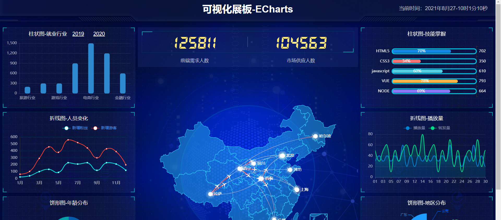


## 1.2 项目结构布局

>本次**学习ECharts**是通过**项目驱动知识点**的方式来进行学习

- 在开发可视化项目前，需要先编写好H5结构，然后再依次往里面**填充ECharts相关图表**

    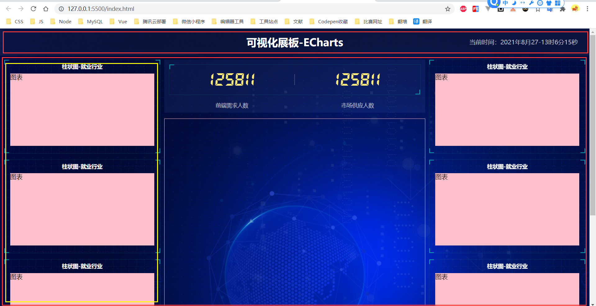


## 1.3 Echarts介绍

- 目前常见的**数据可视化JS库**：

    - ***D3.js***   目前 Web 端评价最高的 Javascript 可视化工具库(入手难)  

    - ***ECharts.js***   百度出品的一个开源 Javascript 数据可视化库   

    - ***AntV***  蚂蚁金服全新一代数据可视化解决方案  等等

        

- ***ECharts***是什么？

    - 一个使用 **JavaScript** 实现的**开源可视化库**，可以流畅的运行在 PC 和移动设备上
    - 兼容当前绝大部分浏览器，提供直观，交互丰富，可高度个性化定制的数据可视化图表。
    - 简单理解：是一个JS插件，性能好，提供很多常用图表，且可**定制**。
        - [折线图](https://www.echartsjs.com/zh/option.html#series-line)、[柱状图](https://www.echartsjs.com/zh/option.html#series-bar)、[散点图](https://www.echartsjs.com/zh/option.html#series-scatter)、[饼图](https://www.echartsjs.com/zh/option.html#series-pie)、[K线图](https://www.echartsjs.com/zh/option.html#series-candlestick)

    

- [ECharts官网地址](https://echarts.apache.org/zh/index.html)


- **学习Echarts的预备知识**：html + css + js


## 1.4 ECharts初体验

- [官方教程：五分钟上手Echarts](https://echarts.apache.org/zh/tutorial.html#5%20%E5%88%86%E9%92%9F%E4%B8%8A%E6%89%8B%20ECharts)

1. **引入**Echarts插件：github下载安全些

2. 为 ECharts 准备一个具备大小（宽高）的 **DOM** 

3. 基于准备好的**dom**，调用`echarts.init(DOM)方法`，**初始化echarts实例**

4. 指定图表的**配置项**和**数据**

5. 将**配置项设置**给echarts实例对象：` myChart.setOption(option);`

    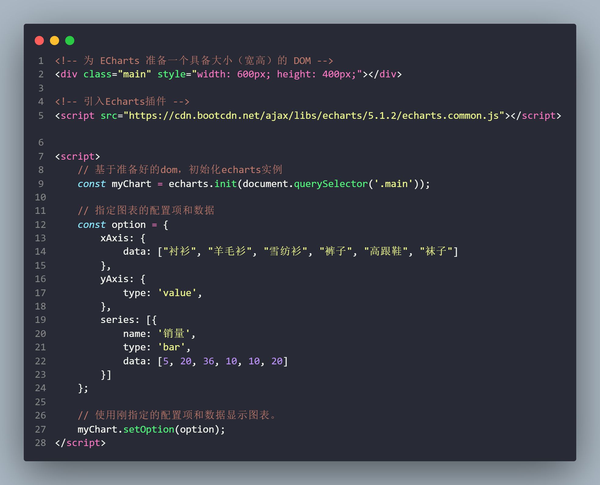


## 1.5 Echarts基础配置

- [Echarts配置项手册](https://echarts.apache.org/zh/option.html#title)

>使用Echarts时需要传入**配置项来指定图表的配置和数据**
>

- 因此，我们需要简单了解每个可传入的**配置项**的**主要作用**

    - 需要了解的主要配置：`series` `xAxis` `yAxis` `grid` `tooltip` `title` `legend` `color` 

    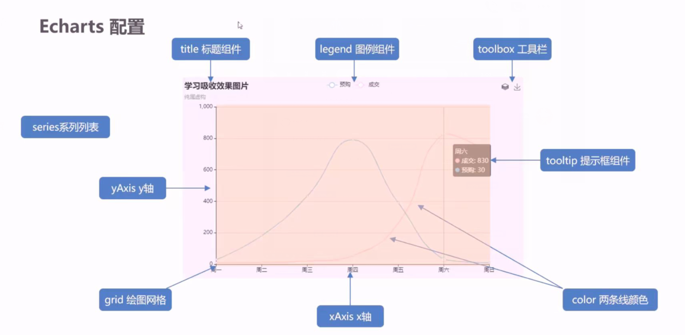

- ***title***：设置图表的标题

- ***tooltip***：设置图表的提示信息

- ***legend***：图例组件

    - **如果series中有name属性值，那么lengend下的data可以不用写**

- ***grid***：可**设置图表的大小**

    -  left、top、right、bottom分别都是**距离DOM容器的偏移量**
    -  **偏移量越小则图表越大**

- ***toolbox***：工具栏组件

- ***xAxis***：设置X轴的相关配置

- ***yAxis***：设置Y轴的相关配置

- ***color***：设置线条的颜色列表，注意**值是一个数组**

- ***series***
  
    - 系列列表。每个系列通过 `type` 决定自己的图表类型
    - seriers下的每个对象可以**简单理解为是每一个柱子对象**
    - `stack属性`：同个类目轴上系列配置相同的`stack`值后 后一个系列的值会在前一个系列的值上相加，一般情况下`stack`这个属性基本用不到


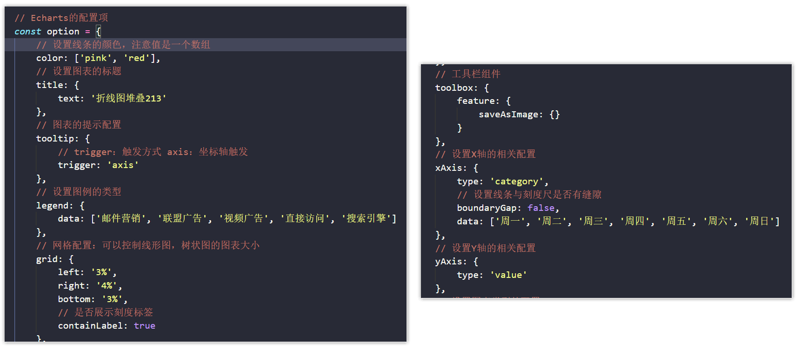


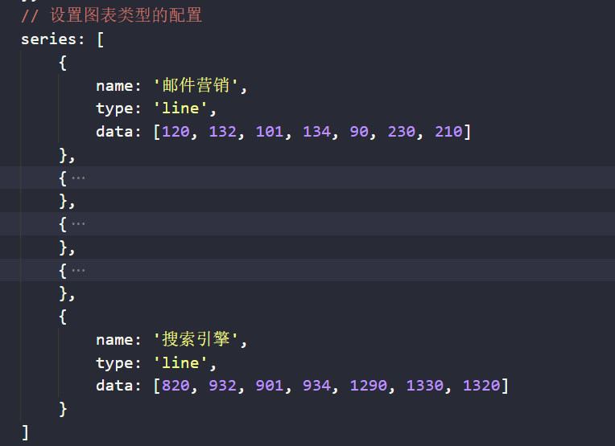


# 二、图表定制化

## 2.1 图表定制化概述

>在了解完Echarts的**基础配置**后，我们就需要在项目中**添加图表**来**展示数据**

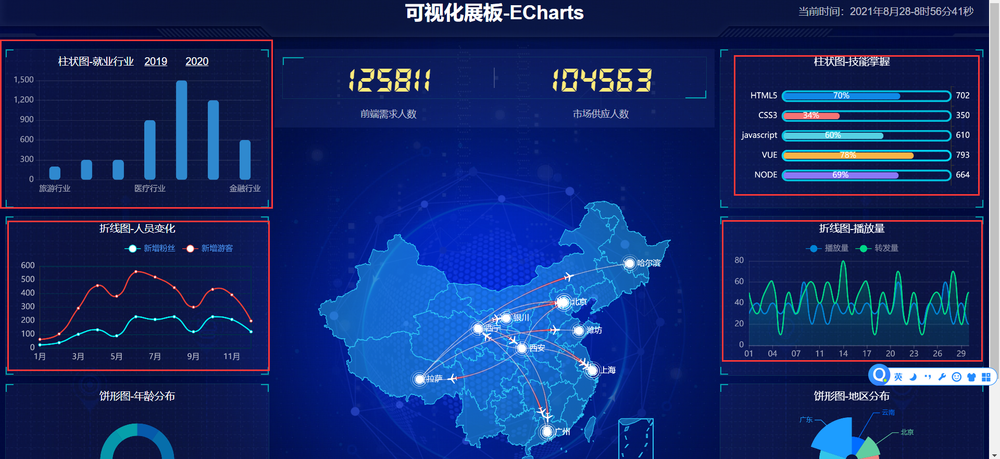


- **添加Echarts图表**的步骤有两步：
    1. 在***官方文档的示例***或***make a pie***的网站中，**引入**我们想要的图表的相关配置
    2. 通过**修改配置项**，以达到定制化图表的目的


## 2.2 柱状图1 - 就业行业

- 实现效果

    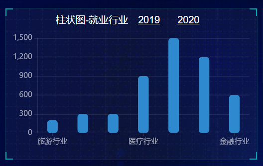


1. 将类似的**图表配置项引入到JS文件中**

    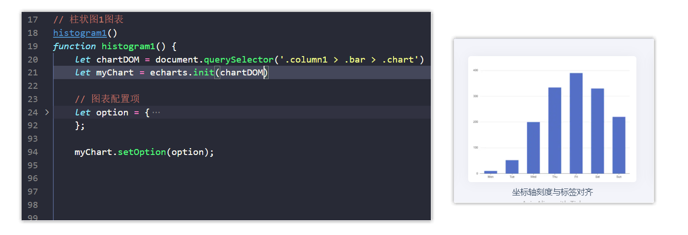


2. 根据需求定制

    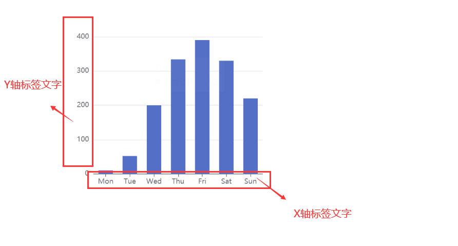

    1. 修改图表柱形颜、修改图表大小

        - ```js
            color: ['#2f89cf'],
            // 修改图表的大小
            grid: {
              left: "0%",
              top: "10px",
              right: "0%",
              bottom: "4%",
              containLabel: true
            },
            ```

            

    2. 修改X轴的**标签文字**和**标签文字样式**：`axisLabel / axisLine`

        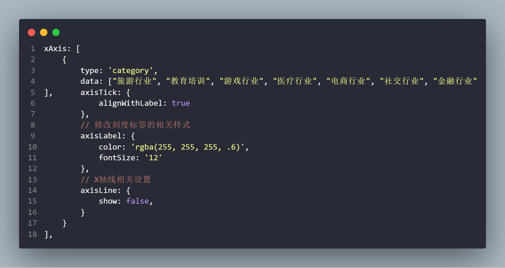

        

    3. 修改Y轴的标签文字样式、Y轴的分割线：`axisLabel / splitLine`

        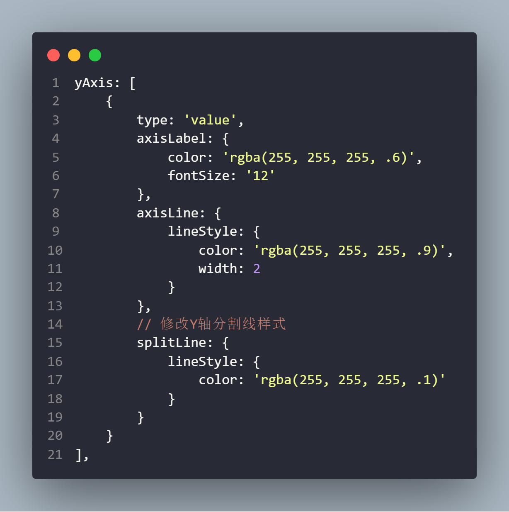

        

        

    4. 修改柱子为**圆角**以及设置柱子的**宽度**：`borderRadi`

        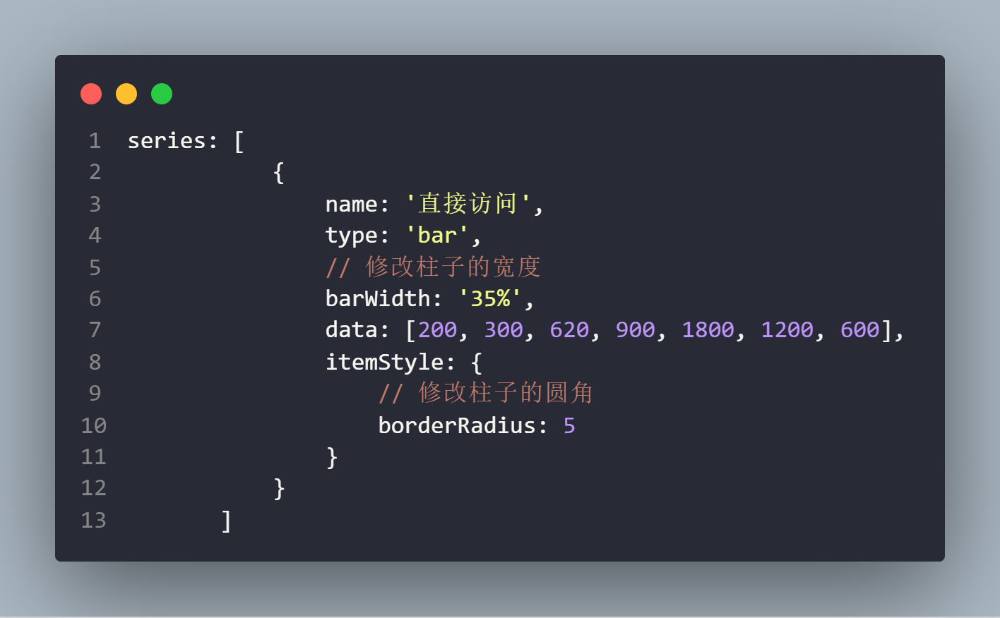


5. 更新X轴的标签文字以及所对应的数值

    - ```js
        // x轴中更换data数据
        data: [ "旅游行业","教育培训", "游戏行业", "医疗行业", "电商行业", "社交行业"],
        // series 更换数据
        data: [200, 300, 300, 900, 1500, 1200, 600]
        ```

        


## 2.3 柱状图2 - 技能掌握

- 实现效果

    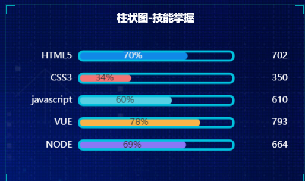


>首先：官网找到**类似实例**， **适当分析**，并且引入到HTML页面中
>

1. 修改图表大小：`grid`

    - ```js
        grid: {
          top: "10%",
          left: "22%",
          bottom: "10%",
          // 设置图表大小是否包含刻度标签
          containLabel: !true
        }
        ```

        

2. 不显示y轴线和相关刻度，y轴文字的颜色设置为白色：`axisLine / axisLabel`

3.  修改第一组柱子相关样式（条状）、设置第一组柱子内百分比显示数据、设置第一组柱子不同颜色

    - `series -> label -> formatter / series -> itemStyle color:fn `

4. 修改第二组柱子的相关配置（框状）、给y轴添加第二组数据、设置两组柱子层叠以及更换数据

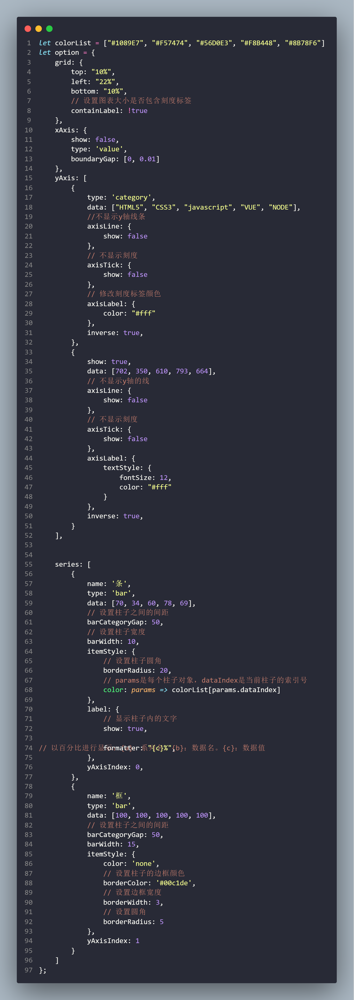


## 2.4 折线图1 - 人员变化

- 实现效果

    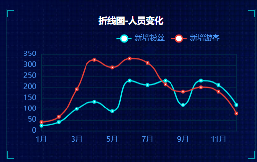

>首先：官网找到**类似实例**， **适当分析**，并且引入到HTML页面中
>
>


1. 修改**折线图大小**，显示图表的边框并设置颜色：`grid`

    - ```js
        grid: {
            top: "20%",
            left: '3%',
            right: '4%',
            bottom: '3%',
            show: true, // 显示图表布局的边框
            borderColor: '#012f4a', // 边框颜色
            containLabel: true
        },
        ```

2. 修改**图例组件**中的文字颜色 #4c9bfd， 距离右侧 right 为 10%：`legend`

    - ```js
         // 图例组价
         legend: {
             // 修改图例组件距离容器的右侧偏移量
             right: '10%',
             // 修改图例的文字样式
             textStyle: {
             		color: '#4c9bfd'
             },
             // 如果series对象有name值，那么legend可以不写data来声明图例名称
         },
        ```

3. 配置X轴：`xAxis`

    1. 刻度去除：`axisTick`

    2. x轴刻度标签字体颜色：`axisLabel`

    3. 剔除x坐标轴线颜色：`axisLine`

    4. 轴两端是不需要内间距：` boundaryGap`

        ```js
        xAxis: [
          {
            type: 'category',
            data: [],
            axisLabel: {
              color: '#4c9bfd',  // 设置标签文字颜色
            },
            axisTick: {
              show: false,  // 不展示刻度线
            },
            axisLine: {
              show: false,  // 去除轴线   
            },
            boundargGap: false  // 设置轴两边留白策略
          },
        ],
        ```

        

4. 配置Y轴:`yAxis`

    1. 刻度去除：`axisTick`

    2. 字体颜色：#4c9bfd：`axisLabel`

    3. 分割线颜色：#012f4a：`splitLine`

        ```js
        yAxis: {
           type: 'value',
           axisLabel: {
           	color: "#4c9bfd",  // 设置标签文字颜色
           },
           axisTick: {
           	show: false,  // 不展示刻度线
           },
           splitLine: {
           	lineStyle: {
           		color: '#012f4a' // 分割线颜色
           	}
           }
         },
        ```

        

5. 配置两条线的数据：`series`

    1. 颜色分别：#00f2f1  #ed3f35：`color`

    2. 把折线修饰为圆滑 series 数据中添加 smooth 为 true：`smooth`

        ```js
        color: ['#00f2f1', '#ed3f35'],
        series: [
          {
            name: '新增粉丝',
            type: 'line',
            data: [24, 40, 101, 134, 90, 230, 210, 230, 120, 230, 210, 120],
            smooth: true // 折线修饰为圆滑
          },
          {
            name: '新增游客',
            type: 'line',
            data: [40, 64, 191, 324, 290, 330, 310, 213, 180, 200, 180, 79],
            smooth: true // 折线修饰为圆滑
          },
        ]
        ```

        

6. 配置X轴的文字

    ```js
    xAxis: {
      type: 'category',
      data: ['1月', '2月', '3月', '4月', '5月', '6月', '7月', '8月', '9月', '10月']
    },
    ```

    

7.  新增需求  点击 2020年   2021年 数据发生变化

    - ```js
        // 模拟后台数据
        let yearData = [
          {
            year: '2020',  // 年份
            data: [  // 两个数组是因为有两条线
              [24, 40, 101, 134, 90, 230, 210, 230, 120, 230, 210, 120],
              [40, 64, 191, 324, 290, 330, 310, 213, 180, 200, 180, 79]
            ]
          },
          {
            year: '2021',  // 年份
            data: [  // 两个数组是因为有两条线
              [123, 175, 112, 197, 121, 67, 98, 21, 43, 64, 76, 38],
              [143, 131, 165, 123, 178, 21, 82, 64, 43, 60, 19, 34]
            ]
          }
        ];
        ```

        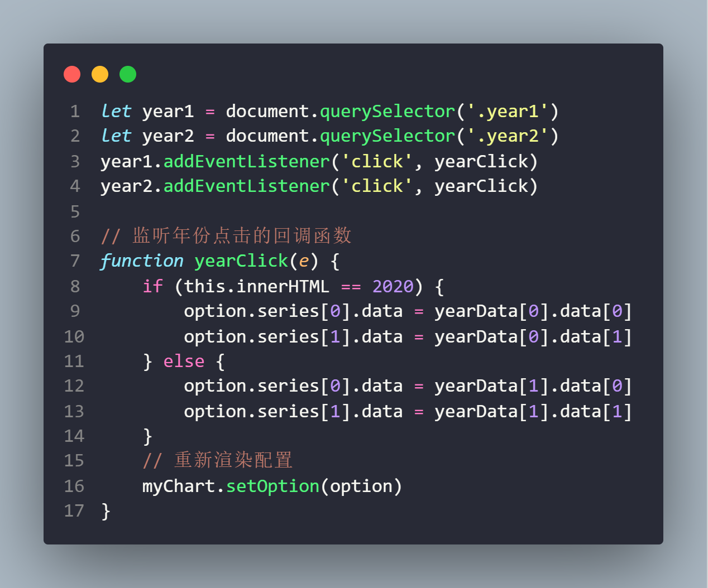


## 2.5 折线图2 - 播放量

- 实现效果

    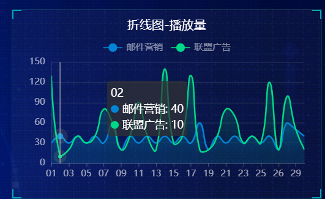

    >首先：官网找到**类似实例**， **适当分析**，并且引入到HTML页面中
    >
    >

    

1. 更换图例组件文字颜色、修改图表大小

    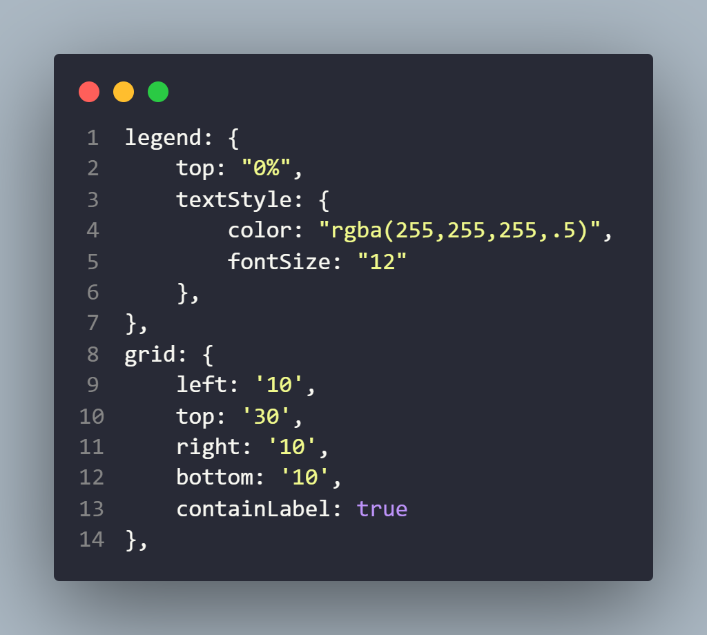

    

2. 修改x轴相关配置、修改y轴的相关配置

    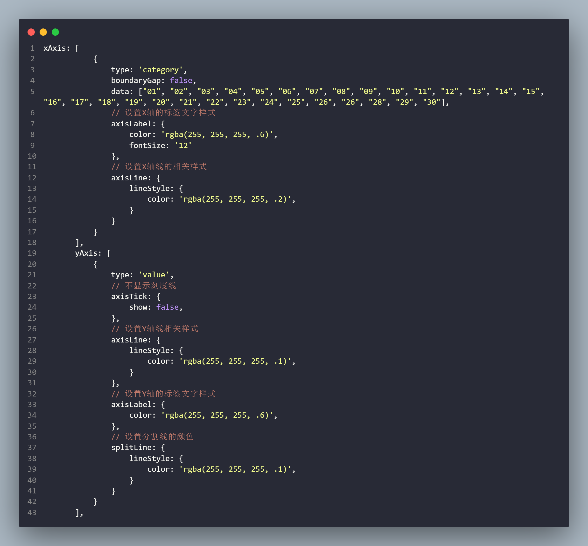

    

    

3. 修改两个线模块配置(注意在series 里面定制)

    - ```js
        series: [
        	{
        		name: '邮件营销',
        		type: 'line',
        		// hover时，聚焦当前高亮的数据所在的系列的所有图形。
        		emphasis: {
        			focus: 'series'
        		},
        		data: [30, 40, 30, 40, 30, 40],
        		// 平滑的线条
        		smooth: true,
        		// 单独修改线的样式
        		lineStyle: {
        			color: "#0184d5",
        			width: 2,
        		},
        		// 设置该线条下的填充区域
        		areaStyle: {
        			// 设置填充颜色为渐变色
        			color: new echarts.graphic.LinearGradient(
        				0,
        				0,
        				0,
        				1,
        				[
        					{
        						offset: 0,
        						color: "rgba(1, 132, 213, 0.4)"   // 渐变色的起始颜色
        					},
        					{
        						offset: 0.8,
        						color: "rgba(1, 132, 213, 0.1)"   // 渐变线的结束颜色
        					}
        				],
        				false
        			),
        			shadowColor: "rgba(0, 0, 0, 0.1)"
        		},
        		// 是否显示拐点，如果为false 则只有在 hover 的时候显示
        		showSymbol: false,
        		// 设置拐点的形状：小圆点
        		symbol: "circle",
        		// 设置拐点的大小
        		symbolSize: 8,
        		// 设置拐点颜色以及边框
        		itemStyle: {
        			color: "#0184d5",
        			borderColor: "rgba(221, 220, 107, .1)",
        			borderWidth: 18
        		},
        	},
        ]
        ```

    - ```js
        	{
            		name: '联盟广告',
            		type: 'line',
            		emphasis: {
            			focus: 'series'
            		},
            		data: [130, 10, 20],
            		smooth: true,
            		lineStyle: {
            			normal: {
            				color: "#00d887",
            				width: 2
            			}
            		},
            		// 设置该线条下的填充区域样式
            		areaStyle: {
            			color: new echarts.graphic.LinearGradient(
            				0,
            				0,
            				0,
            				1,
            				[
            					{
            						offset: 0,
            						color: "rgba(0, 216, 135, 0.4)"
            					},
            					{
            						offset: 0.8,
            						color: "rgba(0, 216, 135, 0.1)"
            					}
            				],
            			),
            			shadowColor: "rgba(0, 0, 0, 0.1)"
            		},
            
            		// 是否显示拐点，如果为false 则只有在 hover 的时候显示
            		showSymbol: false,
            		// 设置拐点的形状：小圆点
            		symbol: "circle",
            		// 设置拐点的大小
            		symbolSize: 8,
            		// 设置拐点颜色以及边框
            		itemStyle: {
            			color: "#00d887",
            			borderColor: "rgba(221, 220, 107, .1)",
            			borderWidth: 18
            		},
            	},
        ```

        

    

4. 更换数据

    - ```js
        // x轴更换数据
        data: [ "01","02","03","04","05","06","07","08","09","10","11","12","13","14","15","16","17","18","19","20","21","22","23","24","25","26","26","28","29","30"],
        // series  第一个对象data数据
         data: [ 30, 40, 30, 40,30, 40, 30,60,20, 40, 30, 40, 30, 40,30, 40, 30,60,20, 40, 30, 40, 30, 40,30, 40, 20,60,50, 40],
        // series  第二个对象data数据
         data: [ 130, 10, 20, 40,30, 40, 80,60,20, 40, 90, 40,20, 140,30, 40, 130,20,20, 40, 80, 70, 30, 40,30, 120, 20,99,50, 20],
        ```

        


## 2.6 饼形图1 - 年龄分布

- 实现效果

    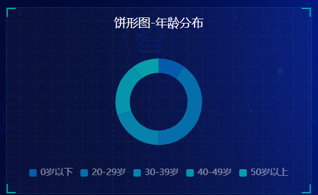

>首先：官网找到**类似实例**， **适当分析**，并且引入到HTML页面中
>
>


1. 修改图例组件在底部并且居中显示

2. 设置图例组件中 -> 小图标的宽度和高度修改为 10px 

3. **设置提示框的显示内容**  ：`tooltip`

    ```js
    legend: {
       // 设置图例的位置
       bottom: '0%',
       // 设置图例的图标的大小
       itemWidth: 10,
       itemHeight: 10,
       // 设置图例组件的文字样式
       textStyle: {
       	color: "rgba(255,255,255,.5)",
       }
    },
      // 设置hover饼图时显示的数据和触发方式
      tooltip: {
        trigger: 'item',
          formatter: "{a} <br/> {b} ：{d}%"
      },
    ```

    

4. 修改饼图的位置为水平居中 垂直居中

5. 修改内圆半径和外圆半径 ：

    - 带有直角坐标系的比如折线图柱状图是 **grid修改图形大小**
    - 而饼形图是通过 **radius 修改大小**

    ```js
     series: [
       {
         name: '年龄分布',
         type: 'pie',
         // 设置饼图位于DOM容器的位置，默认就是中心位置
         center: ["50%", "50%"],
         // 设置饼图的内圆半径和外圆半径
         radius: ['40%', '70%'],
         // 设置图形上的标签文字
         label: {
           show: false,
           position: 'center'
         },
         labelLine: {
           show: false
         },
       }
     ]
    ```

    

6. 更换数据、更换颜色

```js
color: [
            "#065aab",
            "#066eab",
            "#0682ab",
            "#0696ab",
            "#06a0ab",
        ],
// legend 中的data  可省略
data: ["0岁以下", "20-29岁", "30-39岁", "40-49岁", "50岁以上"],
//  series 中的数据
 data: [
          { value: 1, name: "0岁以下" },
          { value: 4, name: "20-29岁" },
          { value: 2, name: "30-39岁" },
          { value: 2, name: "40-49岁" },
          { value: 1, name: "50岁以上" }
 ] ,
```


## 2.7 饼形图1 - 地区分布

- 实现效果：**南丁格尔玫瑰图**

    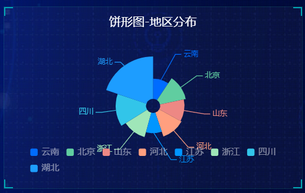

>首先：官网找到**类似实例**， **适当分析**，并且引入到HTML页面中
>
>


1. 颜色设置、设置图例的大小和图例的文字颜色

    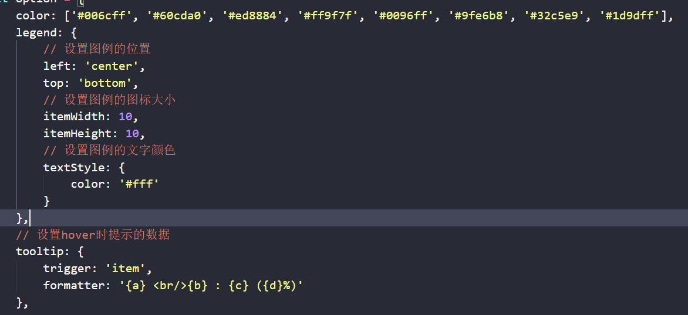

    

2. 修改饼形图大小 ( series对象)

3.  把饼形图的显示模式改为 半径模式

4. 数据使用更换（series对象 里面 data对象）

5. 饼图图形上的文本标签可以控制饼形图的文字的一些样式。   label 对象设置

6. 设置引导线的长度

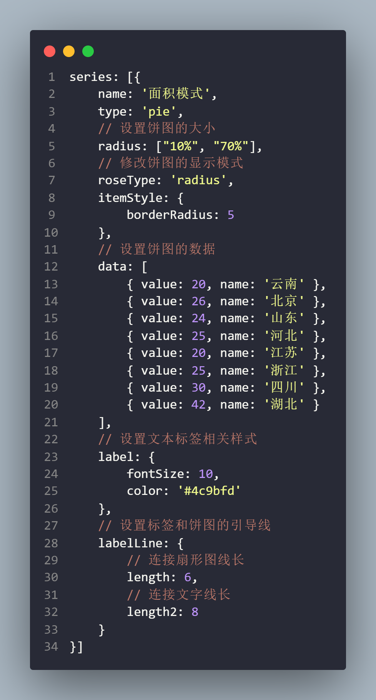


## 图表自适应

- 让图表大小跟随屏幕的变化而自适应

    - ```js
        // 图表自适应
        window.addEventListener('resize', () => {
         	echartsInstance.resize()
        })
        ```

        


# 三、ECharts社区

## 3.1 Echarts-社区介绍

>社区就是一些活跃的echart使用者，交流和贡献定制好的图表的地方。

- https://www.makeapie.com/explore.html

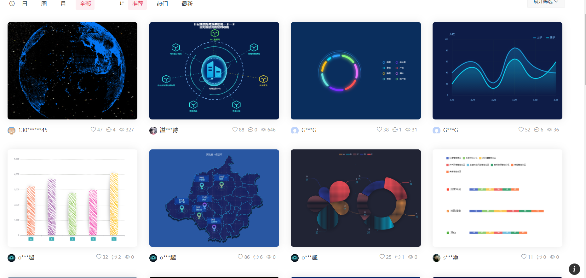


- 在这里可以找到一些基于echart的高度定制好的图表，相当于基于jquery开发的插件，这里是基于echarts开发的第三方的图表。


## 3.2 Echarts-map使用（扩展）

- 参考社区的例子：https://www.makeapie.com/editor.html?c=x0-ExSkZDM（模拟飞行航线）

    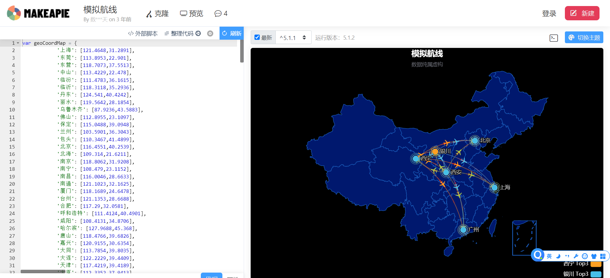

实现步骤：

- 第一：查看是否有使用到外部脚本，**引入外部脚本**

    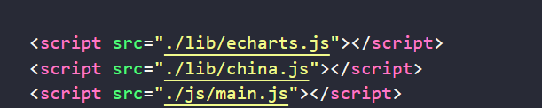

- 第二：将社区**提供的配置复制到我们的项目中**，然后我们再根据自己的需求去修改相应的配置

    

定制化步骤

1. 去掉标题组件
2. 去掉背景颜色
3. 修改地图省份背景  #142957  areaColor 里面做修改
4. 地图放大通过  zoom   设置为1.2即可

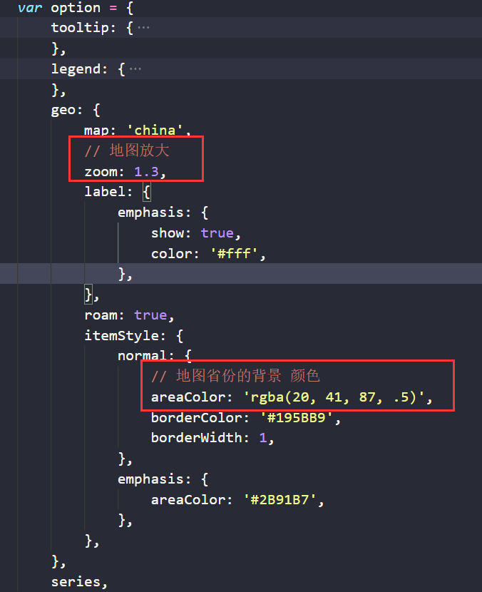


5. 记得设置CSS样式

    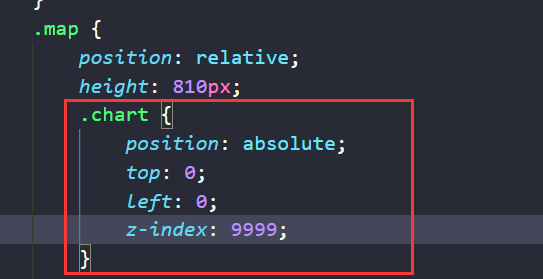


>总结：以上就是使用社区的案例，以后可以多看看社区里面的案例。
>


## 3.3 项目优化 - 响应式

>我们希望可视化页面在**不同的设备尺寸**下所**展示的页面不同**，这时候就要使用 **媒体查询**
>

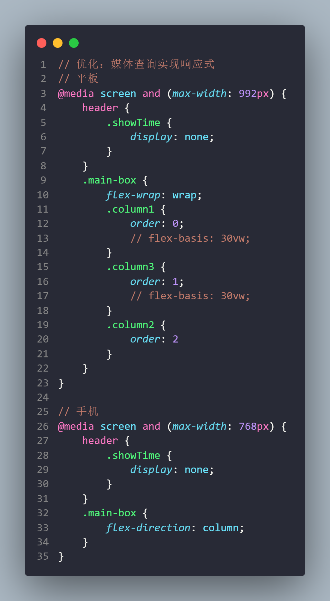


