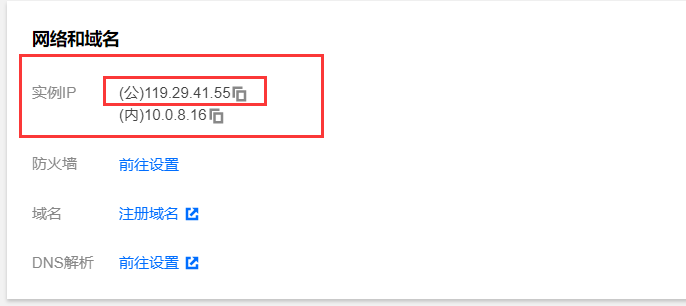
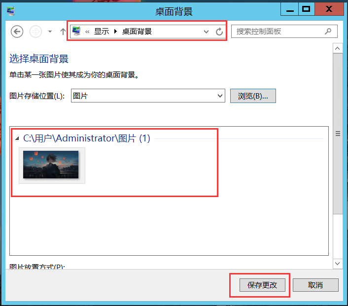
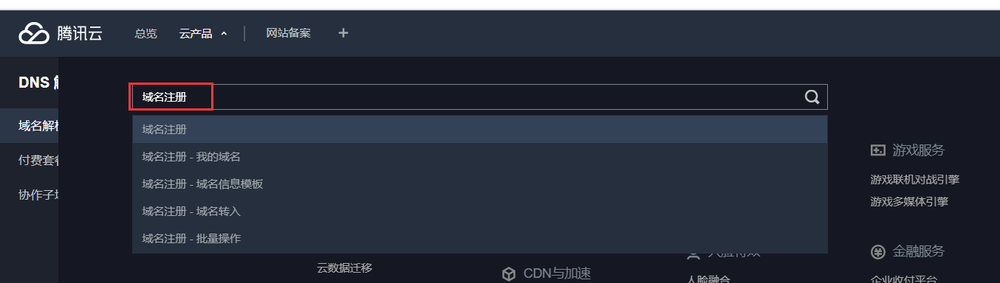

# 一、项目部署（本地）

## 1.1 本地部署项目的概述

- 什么是本地部署？

    - **本地部署**就是将自己的电脑作为服务器，在该服务器下放置一些希望他人访问的资源，该服务器一般称为**本地服务器**

    - **本地服务器**会开放一些端口，别人可以通过`本地服务器ip地址和端口号`，来访问该服务器的资源

    - 但是**本地服务器**会有一个**限制**：**本地服务器只允许同一局域网下的设备访问**。

        

- 不论是**本地服务器**还是**远程服务器**，其部署的方式都大同小异

  ​    

- 本地部署后，**开启内网穿透**，则不同局域网下的计算机都可以**通过内网穿透后的ip地址访问本地部署的项目**


  

## 1.2 Apache部署

### 1.2.1 认识Apache

- 什么是 ***Apache*** ？

    - ***Apache*** 是一款Web服务器软件，也就是电脑上的一个应用程序。

    - ***Apache*** 的作用就是将你的电脑变成一台服务器，让你的电脑开放特定的网络端口，用以接收来自网络上发送到这台机器的HTTP请求，对请求的内容进行处理并作出相应的响应。

      ​    
      


### 1.2.3 window下使用Apache

1. **下载Apache**（下载地址：https://www.apachehaus.com/cgi-bin/download.plx）

2. 下载安装包，然后**解压**到指定的目录。可以根据自己的要求指定目录 `（D:\web\apache2.4）`

    

3. 进入到`D:\web\apache2.4/conf`文件夹中，打开**httpd.conf**文件，查找 `Define SRVROOT`，**修改Apache路径**

    - ```js
        Define SRVROOT "D:/web/apache2.4"
        ```
        
        

4. 打开命令行，在命令行中输入`netstat -a` 查看80端口是否被占用。**如果被占用**，打开**httpd.conf**文件，**修改端口**

    - ```js
        Listen 80 // 如果被占用 端口号改其他的
        ```
        
        

5. **安装Apache**，通过命令行进入到`D:/web/apache2.4/bin`目录下，执行如下命令

    - ```js
        httpd -k install -n apache2.4
        ```
        
        

6. **启动Apache**，执行命令

    - ```js
        net start Apache2.4
        ```
        
        

7. 在浏览器中输入`localhost`回车。如果访问到`D:\web\apache2.4\htdocs`文件夹中的**index.html** 文件，即安装成功


- 命令行窗口切换磁盘： `D:`

- 命令行窗口切换文件夹路径: `cd 文件夹/文件夹`

- 直接进入到文件夹所在的cmd窗口路径

    


### 1.2.4 window下卸载Apache

1. **停止Apache服务**，在命令行窗口中执行命令：

    - ```js
        net stop Apache2.4
        ```

2. **卸载Apache服务**，在命令行窗口中执行命令

    - ```js
        sc delete apache2.4
        ```

3. **删除Apache相关的文件**


### 1.2.5 Apache配置静态资源

- 什么是静态资源？
  
- 静态资源：别人访问`http://服务器ip地址:端口号`时，默认给客户端展示的页面就是静态资源
  
- 在`apache2.4\htdocs`文件夹中，存放的就是静态资源，并且该文件夹中的**index.html文件**，将会作为客户端访问时的**入口文件**

    

    

- 如何访问`Apache`下的**静态资源**？
    - `Apache`服务默认监听的是80端口，因此其他设备可以通过`http://服务器ip地址:80`来进行访问
    - 注：如果`Apache`是在**本地服务器**上部署的，则只允许同一局域网下的设备进行访问静态资源


- 每次修改Apache下的静态资源后，需要重启Apache服务


### 1.2.6 Apache清除浏览器缓存

- 问题概述：
    - 当我们更换了**Apache下的静态资源**时，重启**Apache**服务后，再次访问服务器时，会发现浏览器会访问更换之前的静态资源，这是因为**浏览器默认会缓存以前浏览过的页面**
    - 如果我们希望**更换 Apache 下的静态资源时**，客户端再次访问访问到的是新的静态资源，如何做到？


1. 打开`D:\web\apache2.4\conf`文件夹下的**httpd.conf**文件，将下方代码的注释打开

    - ```html
        LoadModule headers_module modules/mod_headers.so
        ```

        

2. 在 **httpd.conf** 文件中，添加以下代码

    - ```js
        <FilesMatch "\.(php|js|css|swf|html)$">
        
        Header set Cache-Control "private, no-cache, no-store, proxy-revalidate, no-transform"
        
        Header set Pragma "no-cache"
        
        </FilesMatch>
        ```

        

- 这样就不用每次手动清除浏览器缓存了。


## 1.3 Node部署

### 1.3.1 Node概述

- 参考笔记：`Node --> 01-Node.js --> 一、Node.js的概述`


### 1.3.2 Node部署项目

1. 创建 node 项目，通过 express 快速创建 web 服务器，并将希望让他人访问的HTML页面，托管为**静态资源**即可

    


# 二、项目部署（远程） - 前端项目


## 2.1 远程部署项目的概述

- 什么是**远程部署**？

    - **远程部署**就是将一些资源部署到**远程服务器**上，任何人都可以通过访问`http://远程服务器ip地址:端口`形式，来访问远程服务器上特定的资源，**没有局域网限制**

        

- 什么是**远程服务器**？

    - **远程服务器又称为云服务器**，是一台24小时都不关机的电脑，该服务器需要我们进行购买才能使用
    - 我们可以通过自己的电脑来控制远程服务器

    - 常见的云服务器有：***阿里云服务器/腾讯云服务器***

        

- 接下来以**腾讯云服务器**为例子，演示如何在远程服务器上部署项目

    - 腾讯云官网地址：https://cloud.tencent.com/


- 配置**window系统**的云服务器的文档：https://cloud.tencent.com/document/product/213/2764


## 2.2 购买云服务器

1. 腾讯云学生服务器购买网址：https://cloud.tencent.com/act/campus，或根据下图进行点击


2. 这里选择要购买的云服务器套餐，选择**第一个套餐**，需要先去完成`学生认证`才能购买此套餐

    

    

    

3. **操作系统**一定要选择`Windows server 2012r`!!选择后点击购买

    

    

4. 购买成功后，点击下图中的图标，进入**个人中心**

    


5. 进入个人中心后，点击`云产品 --> 轻量应用服务器`，就可查看到刚刚购买的**云服务器**了

    - 注：如果购买的是云服务器则需要点击云服务器中查看

    


6. 点击更多 --> 管理 ，进入**云服务器的控制中心**，并且**重置服务器的密码**

    

    


7. 将云服务器的用户名以及密码记录下来，不能外泄，否则别人可以通过账号密码连接上你的云服务器
    - 云服务器**默认用户名**为`Administrator`


## 2.3 连接云服务器 (Windows)

- 云服务器也是一台电脑，是一台没有显示器的电脑，因此我们可以通过**本地服务器连接云服务器**的方式，来远程控制云服务器

    

- 注：

    - 不同的本地服务器操作系统，其连接云服务器的方式也是不同的

    - 连接腾讯云服务器的参考文档：https://cloud.tencent.com/document/product/213/39138

        

        

- 目前我们本地服务器操作系统是**windows**，云服务器操作系统是**windows**，因此接下来演示`MSTSC`方式连接云服务器

    

    

1. 在云服务器的**控制中心**获取云服务器的**公网IP地址**

    

1. 在本地计算机，使用快捷键【Windows + R】，打开【运行】窗口。

2. 在弹出的【运行】窗口中，输入 **mstsc**，单击【确定】，打开【远程桌面连接】对话框

3. 在【远程桌面连接】对话框中，输入**云服务器公网 IP 地址**，单击【选项】。如下图所示：

                   		


4. 输入公网ip地址以及云服务器用户名之后点击连接，输入云服务器密码之后点击确认

    - 如果忘记密码则需要去云服务器控制中心**重置密码**

    


5. 如果本地服务器上出现云服务器的桌面窗口，则说明**连接成功**了

    


## 2.4 云服务器环境搭建 (Windows)

- 注：
    - 如下操作都是**基于连接云服务器成功之后**的操作
    - 不同的云服务器系统的环境搭建方式是不一样的，以下是`windows server 2012`系统的云服务器搭建环境
    - `windows 2012`环境搭建参考文档：https://blog.csdn.net/luchengtao11/article/details/72283237


1. 双击打开云服务器的服务器管理器，点击**添加角色和功能选项**

    


2. 一直点击下一步，直到服务器角色选项，**选择Web服务器**，然后点击下一步

    


3. **角色服务**可以按需选择，这里直接默认，然后下一步

    


4. 一直下一步，耐心等待**安装成功**


5. 安装成功后，在服务器管理器中**打开IIS管理**

    


6. 在IIS管理中可以看到已经有**默认站点**了

    


7. 在本地服务器中通过`云服务器公网IP地址:80`进行访问，如出现以下页面，则说明配置云服务器环境成功

    


## 2.5 云服务器配置 (Windows)

1. 展示云服务器的**桌面图标**

    ​	① 点击菜单  ② 打开控制面板  ③ 搜索显示图标  ④ 勾选需要在桌面上展示的图标

    


2. 更改云服务器的**桌面背景**

    ① 将本地服务器上的图片通过**复制**方式，**粘贴**到云服务器上的指定路径下

    ② 在控制面板中 更改桌面背景图片

    


3. 在云服务中**下载谷歌浏览器**

    ① 打开云服务器上自带的浏览器 

    ② 谷歌浏览器官网：`https://www.google.cn/chrome/`，自行下载


4. 在云服务器中下载`MySQL`以及`navicat`


## 2.6 云服务器部署项目

- 在`windows`系统下的云服务器中，我们采用`Node`部署项目，为什么不用`Apache`部署项目呢？原因如下
    1. 云服务器配置普遍较低，配置`Apache`过于繁琐，配置时会卡顿
    2. `Apache`服务只能开启一个，意味着使用`Apache`只能部署一个项目，无法最大化云服务器的使用


1. 在云服务器下**安装Node运行环境**

    ​	① 复制本地服务器的Node安装包到云服务器上

    ​	② 在云服务器上双击打开Node安装包，一键next，傻瓜式安装

    ​	③ 在云服务器的命令行窗口输入`node -v`检查是否安装成功

    

    


2. 在本地服务器下**创建Node项目**，并且将需要部署的**项目作为静态资源**进行托管

    


3. **测试**在本地服务器上通过**Node部署的项目**是否正常运行

    ​	① 如果一切正常，那么可以将本地Node项目**复制粘贴到云服务器上**

    ​	② 如果运行不正常，那么需要等本地服务器上调节正常了再将本地Node项目**复制粘贴到云服务器上**


4. 在云服务器上，打开命令行窗口

    ​	① **路径切换到需要部署的Node项目**

    ​	② 通过`Node环境`运行Node项目中的app.js 文件


5. 在云服务器的**控制中心**中**添加规则**，**开放**在云服务部署的Node项目的**端口号**

    


6. 在浏览器地址栏中输入`云服务器公网IP地址:端口号`，如页面正常显示则说明部署成功，任何人都可以通过`云服务器公网IP地址:端口号`来访问你部署在云服务器的Node项目

    


## 2.7 域名绑定公网IP

- 域名是替换公网IP地址的，域名和IP的关系可以参考笔记：`Node --> 网络通信基础`

- 添加域名参考文档：https://cloud.tencent.com/document/product/302/3446

1. **购买**腾讯云服务器域名网址：https://buy.cloud.tencent.com/domain

    


2. 购买域名后该域名**需要审核1~2天**，审核通过了才能够使用该域名

    

3. 在腾讯云个人中心 --> 云产品中**输入域名注册**，然后回车，就可以看到我们购买过的域名信息

    


4. 点击解析操作

    


5. 点击快速添加网站，选择网站解析

    


6. 输入该域名所要绑定的**服务器的公网IP地址**

    


7. 绑定域名后，一般在**10分钟之后生效**，可以在命令窗口输入`ping 域名`来检测域名是否和公网IP地址绑定成功

    


8. 域名成功生效后，可以通过**域名来代替公网IP地址**，访问云服务器特定的资源

    


# 三、项目部署（远程） - 后端接口

## 3.1 连接远程MySQL服务


>连接**远程MySQL服务**
>
>
>

1. 在远程服务器上的navicat -> 的查询中**修改连接权限**

    - ```mysql
        # 使⽤mysql数据库
        use mysql;
        
        # 查看user表中，连接权限，默认看到root是localhost
        select host, user from user;
        
        # 修改权限
        update user set host = '%' where user = 'root';
        
        # 刷新MySQL的系统权限相关表
        flush privileges;
        ```

2. 在远程服务器配置 -> 防火墙中**开放3306端口**


3. 在本地服务器上**使用 navicat** 连接**远程服务器的MySQL**服务


4. **查看**远程服务器的MySQL中的数据库

    


## 3.2 MySQL数据迁移

>我们需要将之前项⽬中（本地）MySQL的数据库迁移到服务器中的MySQL数据库中。
>
>

1. 在服务器MySQL中**创建coderhub的数据库**

2. 在Navicat⼯具中**本地MySQL**直接**导出数据库**

    

    

3. 在Navicat⼯具中**服务器MySQL**中执⾏**SQL文件**


## 3.3 项目部署的三种方式

- 方式一：直接拷贝项目到服务器中，然后通过**node app.js**启动项目

    

- 方式二：（公司用的最多）

    1. 将项目代码上传到git仓库(github、gitee)

    2. 服务器通过 **git clone**克隆项目代码

    3. 然后在通过 **node app.js**启动项目

        

- 方式三：（部署前端项目(html页面)时的场景） -> **自动化部署**

    1. 将项目代码上传到git仓库(github、gitee)

    2. 服务器每次**自动下载**git仓库**最新的代码，并自动启动项目**

        

>如果是**自己在部署项目**的话，**推荐使用方式一**，没那么繁琐，在公司的话还是采用方式二部署
>


## 3.4 项目部署的具体实现

>由于方式一(拷贝项目)比较简单，方式三(自动化部署)需要配置**Jenkins**，因此这里**只对方式二进行演练**
>
>

1. 配置上传的忽略文件 -> 将**项目代码上传到git仓库**(github、gitee)


2. 将云服务器创建一个文件夹，然后通过`git clone url`命令**克隆git仓库中的代码**到该文件夹下
    - 前提是**云服务器**需要**安装好git环境**


3. 在云服务器的控制台 -> 防火墙中，添加规则加入该项目的服务端口(8883)


4. 在云服务器中修改项目配置，然后启动项目

    


5. 使用postman**请求远程接口**查看是否生效

    


